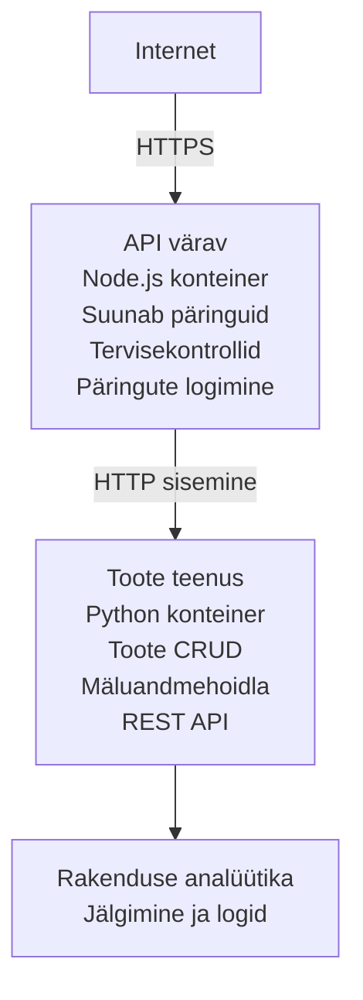

# Mikroteenuste arhitektuur - konteinerirakenduse näide

⏱️ **Hinnanguline aeg**: 25-35 minutit | 💰 **Hinnanguline maksumus**: ~$50-100/kuus | ⭐ **Kompleksus**: Edasijõudnu

**Lihtsustatud, aga funktsionaalne** mikroteenuste arhitektuur, mis on kasutusele võetud Azure Container Apps rakenduses, kasutades AZD CLI-d. See näide demonstreerib teenustevahelist kommunikatsiooni, konteinerite orkestreerimist ja jälgimist praktilise 2-teenusega seadistusega.

> **📚 Õppimismeetod**: See näide algab minimaalse 2-teenusega arhitektuuriga (API Gateway + Backend Service), mida saad reaalselt juurutada ja õppida. Kui see alus on omandatud, pakume juhiseid laiendamiseks täismahus mikroteenuste ökosüsteemi.

## Mida sa õpid

Selle näite lõpetamisega sa:
- Juurutad mitu konteinerit Azure Container Apps keskkonda
- Rakendad teenustevahelist suhtlust sisevõrgu kaudu
- Konfigureerid keskkonnapõhist skaleerimist ja tervisekontrolle
- Jälgid hajutatud rakendusi Application Insights abil
- Mõistad mikroteenuste juurutusmustreid ja parimaid praktikaid
- Õpid astmelist laiendamist lihtsast keerukani arhitektuurini

## Arhitektuur

### Faas 1: Mida me ehitame (kaasas selles näites)


**Miks alustada lihtsast?**
- ✅ Kiire juurutamine ja mõistmine (25-35 minutit)
- ✅ Õpi põhitehnikaid ilma keerukuseta
- ✅ Töötav kood, mida saad muuta ja katsetada
- ✅ Madalamad kulud õppimiseks (~$50-100/kuus vs $300-1400/kuus)
- ✅ Ehita enesekindlust enne andmebaaside ja sõnumijärjekordade lisamist

**Analoogia**: Mõtle sellele nagu sõiduõppele. Alustad tühjast parkimiskohast (2 teenust), valdad põhiteadmisi, seejärel liigud edasi linnaliiklusesse (5+ teenust andmebaasidega).

### Faas 2: Tuleviku laiendamine (viitearhitektuur)

Kui 2-teenuse arhitektuur on valduses, võid laiendada:

```
Full Architecture (Not Included - For Reference)
├── API Gateway (✅ Included)
├── Product Service (✅ Included)
├── Order Service (🔜 Add next)
├── User Service (🔜 Add next)
├── Notification Service (🔜 Add last)
├── Azure Service Bus (🔜 For async communication)
├── Cosmos DB (🔜 For product persistence)
├── Azure SQL (🔜 For order management)
└── Azure Storage (🔜 For file storage)
```

Vaata jaotist "Laiendamise juhend" lõpus samm-sammult juhiste jaoks.

## Kaasasolevad funktsioonid

✅ **Teenuse avastamine**: automaatne DNS-põhine avastus konteinerite vahel  
✅ **Koormuse tasakaalustamine**: sisseehitatud koormuse jaotus koopiate vahel  
✅ **Automaatne skaleerimine**: iga teenuse iseseisev skaleerimine HTTP-päringute põhjal  
✅ **Tervisekontrollid**: mõlema teenuse elujõulisuse ja valmisoleku sondid  
✅ **Hajutatud logimine**: tsentraliseeritud logimine Application Insightsiga  
✅ **Sisevõrk**: turvaline teenustevaheline kommunikatsioon  
✅ **Konteineri orkestreerimine**: automaatne juurutamine ja skaleerimine  
✅ **Puuduvad seisakud uuendamisel**: järkjärguline uuendamine ja versioonihaldus  

## Eeltingimused

### Nõutavad tööriistad

Enne alustamist veendu, et sul on need tööriistad paigaldatud:

1. **[Azure Developer CLI (azd)](https://learn.microsoft.com/azure/developer/azure-developer-cli/install-azd)** (versioon 1.0.0 või uuem)
   ```bash
   azd version
   # Oodatav väljund: azd versioon 1.0.0 või uuem
   ```

2. **[Azure CLI](https://learn.microsoft.com/cli/azure/install-azure-cli)** (versioon 2.50.0 või uuem)
   ```bash
   az --version
   # Oodatav väljund: azure-cli 2.50.0 või uuem
   ```

3. **[Docker](https://www.docker.com/get-started)** (kohalikuks arenduseks/testimiseks - vabatahtlik)
   ```bash
   docker --version
   # Oodatav väljund: Dockeri versioon 20.10 või uuem
   ```

### Azure'i nõuded

- Aktiivne **Azure tellimus** ([loo tasuta konto](https://azure.microsoft.com/free/))
- Õigused ressursse loomiseks oma tellimuses
- **Contributor** roll tellimuse või ressursigrupi tasemel

### Teadmiste eelduseks

See on **edasijõudnutele** mõeldud näide. Peaksid olema:
- Läbinud [Simple Flask API näite](../../../../../examples/container-app/simple-flask-api) 
- Põhiteadmised mikroteenuste arhitektuurist
- Tutvunud REST API-de ja HTTP-ga
- Mõistma konteinerite kontseptsiooni

**Uus Container Appsis?** Alusta esmalt [Simple Flask API näitega](../../../../../examples/container-app/simple-flask-api), et põhiasjad selgeks saada.

## Kiire algus (samm-sammult)

### Samm 1: Kopeeri ja liigu kausta

```bash
git clone https://github.com/microsoft/AZD-for-beginners.git
cd AZD-for-beginners/examples/container-app/microservices
```

**✓ Õnnestumise kontroll**: Veendu, et näed `azure.yaml` faili:
```bash
ls
# Oodatud: README.md, azure.yaml, infra/, src/
```

### Samm 2: Autendi Azure'i

```bash
azd auth login
```

See avab brauseri Azure autentimiseks. Logi sisse oma Azure kontoga.

**✓ Õnnestumise kontroll**: Sa peaksid nägema järgmist:
```
Logged in to Azure.
```

### Samm 3: Initsialiseeri keskkond

```bash
azd init
```

**Näidatud küsimused**:
- **Keskkonna nimi**: Sisesta lühike nimi (nt `microservices-dev`)
- **Azure tellimus**: Vali oma tellimus
- **Azure regioon**: Vali piirkond (nt `eastus`, `westeurope`)

**✓ Õnnestumise kontroll**: Sa peaksid nägema:
```
SUCCESS: New project initialized!
```

### Samm 4: Juuruta infrastruktuur ja teenused

```bash
azd up
```

**Mis toimub** (kestab 8-12 minutit):
1. Luuakse Container Apps keskkond
2. Luuakse Application Insights jälgimiseks
3. Koostatakse API Gateway konteiner (Node.js)
4. Koostatakse Product Service konteiner (Python)
5. Mõlemad konteinerid juurutatakse Azure’i
6. Konfigureeritakse võrgustik ja tervisekontrollid
7. Häälestatakse jälgimine ja logimine

**✓ Õnnestumise kontroll**: Sa peaksid nägema:
```
SUCCESS: Your application was deployed to Azure in X minutes Y seconds.
Endpoint: https://api-gateway-<unique-id>.azurecontainerapps.io
```

**⏱️ Aeg**: 8-12 minutit

### Samm 5: Testi juurutust

```bash
# Hangi värava lõpp-punkt
GATEWAY_URL=$(azd env get-values | grep API_GATEWAY_URL | cut -d '=' -f2 | tr -d '"')

# Testi API värava tervislikkus
curl $GATEWAY_URL/health

# Oodatav väljund:
# {"status":"healthy","service":"api-gateway","timestamp":"2025-11-19T10:30:00Z"}
```

**Testi tooteteenust gateway kaudu**:
```bash
# Toodete nimekiri
curl $GATEWAY_URL/api/products

# Oodatav väljund:
# [
#   {"id":1,"nimi":"Sülearvuti","hind":999.99,"laos":50},
#   {"id":2,"nimi":"Hiir","hind":29.99,"laos":200},
#   {"id":3,"nimi":"Klaviatuur","hind":79.99,"laos":150}
# ]
```

**✓ Õnnestumise kontroll**: Mõlemad lõpp-punktid tagastavad JSON andmeid ilma vigadeta.

---

**🎉 Palju õnne!** Sa oled juurutanud mikroteenuste arhitektuuri Azure’i!

## Projekti struktuur

Kõik rakendusfailid on kaasas – see on täielik ja töökindel näide:

```
microservices/
│
├── README.md                         # This file
├── azure.yaml                        # AZD configuration
├── .gitignore                        # Git ignore patterns
│
├── infra/                           # Infrastructure as Code (Bicep)
│   ├── main.bicep                   # Main orchestration
│   ├── abbreviations.json           # Naming conventions
│   ├── core/                        # Shared infrastructure
│   │   ├── container-apps-environment.bicep  # Container environment + registry
│   │   └── monitor.bicep            # Application Insights + Log Analytics
│   └── app/                         # Service definitions
│       ├── api-gateway.bicep        # API Gateway container app
│       └── product-service.bicep    # Product Service container app
│
└── src/                             # Application source code
    ├── api-gateway/                 # Node.js API Gateway
    │   ├── app.js                   # Express server with routing
    │   ├── package.json             # Node dependencies
    │   └── Dockerfile               # Container definition
    └── product-service/             # Python Product Service
        ├── main.py                  # Flask API with product data
        ├── requirements.txt         # Python dependencies
        └── Dockerfile               # Container definition
```

**Mida iga komponent teeb:**

**Infrastruktuur (infra/)**:
- `main.bicep`: Haldab kõiki Azure ressursse ja nende sõltuvusi
- `core/container-apps-environment.bicep`: Loob Container Apps keskkonna ja Azure Container Registry
- `core/monitor.bicep`: Häälestab Application Insights hajutatud logimiseks
- `app/*.bicep`: Individuaalsed konteinerirakenduste definitsioonid koos skaleerimise ja tervisekontrollidega

**API Gateway (src/api-gateway/)**:
- Avalikkusele suunatud teenus, mis juhib päringuid backend-teenustele
- Teostab logimist, veakäsitlust ja päringute edastamist
- Demonstreerib teenustevahelist HTTP suhtlust

**Product Service (src/product-service/)**:
- Sisemine teenus tooteloendiga (lihtsuse huvides mälus)
- REST API koos tervisekontrollidega
- Näide backend-mikroteenuse mustrist

## Teenuste ülevaade

### API Gateway (Node.js/Express)

**Port**: 8080  
**Juurdepääs**: Avalik (väline sisenemine)  
**Eesmärk**: Suunab sissetulevad päringud sobivatele backend-teenustele  

**Lõpp-punktid**:
- `GET /` - Teenuse info
- `GET /health` - Tervisekontrolli lõpp-punkt
- `GET /api/products` - Suunamine tooteteenusele (kõik tooted)
- `GET /api/products/:id` - Suunamine tooteteenusele (toode ID järgi)

**Põhifunktsioonid**:
- Päringute suunamine axios’iga
- Tsentraliseeritud logimine
- Veakäsitlus ja aegumise juhtimine
- Teenuse avastus keskkonnamuutujate kaudu
- Application Insights integratsioon

**Koodinäide** (`src/api-gateway/app.js`):
```javascript
// Sisemine teenustevaheline suhtlus
app.get('/api/products', async (req, res) => {
  const response = await axios.get(`${PRODUCT_SERVICE_URL}/products`);
  res.json(response.data);
});
```

### Product Service (Python/Flask)

**Port**: 8000  
**Juurdepääs**: Ainult sisevõrgus (väline sisenemine puudub)  
**Eesmärk**: Haldab tootekataloogi mälupõhiselt  

**Lõpp-punktid**:
- `GET /` - Teenuse info
- `GET /health` - Tervisekontrolli lõpp-punkt
- `GET /products` - Kõik tooted
- `GET /products/<id>` - Toode ID järgi

**Põhifunktsioonid**:
- REST API Flaskiga
- Mälupõhine tootepood (lihtne, andmebaasi ei vaja)
- Tervise jälgimine sondidega
- Struktureeritud logimine
- Application Insights integratsioon

**Andmemudel**:
```python
{
  "id": 1,
  "name": "Laptop",
  "description": "High-performance laptop",
  "price": 999.99,
  "stock": 50
}
```

**Miks ainult sisevõrgu jaoks?**
Tooteteenus ei ole avalikult kättesaadav. Kõik päringud peavad minema API Gateway kaudu, mis tagab:
- Turvalisus: kontrollitud ligipääs
- Paindlikkus: saab muuta backend’i ilma klienti mõjutamata
- Jälgimine: tsentraliseeritud päringute logimine

## Kuidas teenused omavahel suhtlevad

### Kuidas teenused omavahel suhtlevad

Selles näites suhtleb API Gateway Product Service’iga kasutades **sisesideseid HTTP-kõnesid**:

```javascript
// API värav (src/api-gateway/app.js)
const PRODUCT_SERVICE_URL = process.env.PRODUCT_SERVICE_URL;

// Tee sisemine HTTP päring
const response = await axios.get(`${PRODUCT_SERVICE_URL}/products`);
```

**Olulised punktid**:

1. **DNS-põhine avastamine**: Container Apps pakub automaatselt DNS-i sise-teenustele
   - Product Service täielik domeeninimi: `product-service.internal.<environment>.azurecontainerapps.io`
   - Lihtsustatud kujul: `http://product-service` (Container Apps lahendab selle)

2. **Avalikku ligipääsu pole**: Product Service’il on Bicep-s `external: false`
   - Kättesaadav ainult Container Apps keskkonnas
   - Pole ligipääsetav interneti kaudu

3. **Keskkonnamuutujad**: Teenuse URL-id süstitakse juurutamise ajal
   - Bicep edastab sise-FQDN gateway'le
   - Rakenduskoodis pole kõvasid URL-e

**Analoogia**: Mõtle sellele kui kontoriruumidele. API Gateway on vastuvõtulaud (avalik), Product Service on kontoriruum (ainult siseruum). Külastajad peavad läbi vastuvõtu igasse kontorisse pääsemiseks.

## Juurutamise võimalused

### Täielik juurutus (soovitatav)

```bash
# Paigalda infrastruktuur ja mõlemad teenused
azd up
```

See juurutab:
1. Container Apps keskkonna
2. Application Insights’i
3. Container Registry
4. API Gateway konteineri
5. Product Service konteineri

**Aeg**: 8-12 minutit

### Juuruta üksik teenus

```bash
# Hangi üles ainult üks teenus (pärast esmast azd up)
azd deploy api-gateway

# Või aja käima toote teenus
azd deploy product-service
```

**Kasutusjuhtum**: Kui oled ühes teenuses koodi uuendanud ja soovid ainult seda teenust uuesti juurutada.

### Konfiguratsiooni värskendamine

```bash
# Muuda skaleerimisparameetreid
azd env set GATEWAY_MAX_REPLICAS 30

# Käivita uuesti uue konfiguratsiooniga
azd up
```

## Konfiguratsioon

### Skaleerimise konfiguratsioon

Mõlemad teenused on konfigureeritud HTTP-põhise automaatse skaleerimisega oma Bicep failides:

**API Gateway**:
- Min koopiad: 2 (alati vähemalt 2 kättesaadavuse tagamiseks)
- Max koopiad: 20
- Skaleerimise käivitaja: 50 samaaegset päringut koopia kohta

**Product Service**:
- Min koopiad: 1 (vajadusel saab skaleerida ka nullini)
- Max koopiad: 10
- Skaleerimise käivitaja: 100 samaaegset päringut koopia kohta

**Skaleerimise kohandamine** (`infra/app/*.bicep`):
```bicep
scale: {
  minReplicas: 1
  maxReplicas: 10
  rules: [
    {
      name: 'http-scale-rule'
      http: {
        metadata: {
          concurrentRequests: '100'  // Adjust this
        }
      }
    }
  ]
}
```

### Ressursside jaotus

**API Gateway**:
- CPU: 1.0 vCPU
- Mälu: 2 GiB
- Põhjus: Töötleb kogu välist liiklust

**Product Service**:
- CPU: 0.5 vCPU
- Mälu: 1 GiB
- Põhjus: Kergekaaluline mälutöötlus

### Tervisekontrollid

Mõlemas teenuses on elujõulisuse ja valmisoleku sondid:

```bicep
probes: [
  {
    type: 'Liveness'
    httpGet: {
      path: '/health'
      port: 8080
    }
    initialDelaySeconds: 10
    periodSeconds: 30
  }
  {
    type: 'Readiness'
    httpGet: {
      path: '/health'
      port: 8080
    }
    initialDelaySeconds: 5
    periodSeconds: 10
  }
]
```

**Mida see tähendab**:
- **Elujõulisus**: kui tervisekontroll ebaõnnestub, taaskäivitab Container Apps konteineri
- **Valmisolek**: kui teenus pole valmis, lõpetab Container Apps selle koopia liikluse suunamise


## Jälgimine ja vaatlusalus

### Teenuste logide vaatamine

```bash
# Vaata logisid, kasutades azd monitorit
azd monitor --logs

# Või kasuta Azure CLI-d konkreetsete konteinerirakenduste jaoks:
# Voogesita logisid API väravast
az containerapp logs show --name api-gateway --resource-group $RG_NAME --follow

# Vaata viimaseid tootepoe logisid
az containerapp logs show --name product-service --resource-group $RG_NAME --tail 100
```

**Oodatav väljund**:
```
[api-gateway] API Gateway listening on port 8080
[api-gateway] Product Service URL: http://product-service
[api-gateway] GET /api/products 200 - 45ms
[product-service] Retrieved 5 products
```

### Application Insights päringud

Azure Portaalis Application Insightsi juures tee need päringud:

**Leia aeglased päringud**:
```kusto
requests
| where timestamp > ago(1h)
| where duration > 1000  // Requests taking >1 second
| summarize count() by name, cloud_RoleName
| order by count_ desc
```

**Jälgi teenustevahelisi kõnesid**:
```kusto
dependencies
| where timestamp > ago(1h)
| where type == "Http"
| project timestamp, name, target, duration, success
| order by timestamp desc
```

**Vigade määr teenuse kaupa**:
```kusto
exceptions
| where timestamp > ago(24h)
| summarize errorCount = count() by cloud_RoleName, type
| order by errorCount desc
```

**Päringute maht aja jooksul**:
```kusto
requests
| where timestamp > ago(1h)
| summarize requestCount = count() by bin(timestamp, 5m), cloud_RoleName
| render timechart
```

### Juurdepääs jälgimise armatuurlaudadele

```bash
# Hangi Application Insights'i üksikasjad
azd env get-values | grep APPLICATIONINSIGHTS

# Ava Azure Portali jälgimine
az monitor app-insights component show \
  --app $(azd env get-values | grep APPLICATIONINSIGHTS_CONNECTION_STRING | cut -d '=' -f2) \
  --resource-group $(azd env get-values | grep AZURE_RESOURCE_GROUP | cut -d '=' -f2) \
  --query "appId" -o tsv
```

### Reaalaegsed mõõdikud

1. Mine Azure Portaalis Application Insightsi
2. Klõpsa "Live Metrics"
3. Näed reaalajas päringuid, tõrkeid ja jõudlust
4. Proovi käivitada: `curl $(azd env get-values | grep API_GATEWAY_URL | cut -d '=' -f2 | tr -d '"')/api/products`

## Praktilised ülesanded

[Märkused: täielikke harjutusi näed "Praktiliste ülesannete" jaotises, mis sisaldab samm-sammult harjutusi juurutuse kontrollimiseks, andmete muutmiseks, automaatse skaleerimise testimiseks, vigade käsitlemiseks ja kolmanda teenuse lisamiseks.]

## Kuluanalüüs

### Hinnangulised kuukulud (selle 2-teenuse näite jaoks)

| Ressurss | Konfiguratsioon | Hinnanguline maksumus |
|----------|-----------------|----------------------|
| API Gateway | 2-20 koopiat, 1 vCPU, 2GB RAM | $30-150 |
| Product Service | 1-10 koopiat, 0.5 vCPU, 1GB RAM | $15-75 |
| Container Registry | Algne tase | $5 |
| Application Insights | 1-2 GB/kuus | $5-10 |
| Log Analytics | 1 GB/kuus | $3 |
| **Kokku** | | **$58-243/kuus** |

**Kulu jaotus kasutuse järgi**:
- **Vähene liiklus** (testimine/õppimine): ~$60/kuus
- **Mõõdukas liiklus** (väike tootmine): ~$120/kuus
- **Suur liiklus** (rasked perioodid): ~$240/kuus

### Kuluoptimeerimise näpunäited

1. **Skaleeri arendushooajal nullini**:
   ```bicep
   scale: {
     minReplicas: 0  // Save $30-40/month when not in use
     maxReplicas: 10
   }
   ```

2. **Kasuta Cosmos DB jaoks tarbimise plaani** (kui see lisada):
   - Maksad ainult kasutuse eest
   - Minimaalset tasu pole

3. **Seadista Application Insightsi näidiste võtmine**:
   ```javascript
   appInsights.defaultClient.config.samplingPercentage = 50; // Proovi 50% päringutest
   ```

4. **Puhasta, kui pole enam vaja**:
   ```bash
   azd down
   ```

### Tasuta taseme võimalused

Õppimiseks/testimiseks soovitatakse:
- Kasutage Azure tasuta krediiti (esimesed 30 päeva)  
- Hoidke replikate arv minimaalsena  
- Kustutage peale testimist (ei teki jooksvaid kulusid)  

---

## Puhastamine

Jooksvate kulude vältimiseks kustutage kõik ressursid:

```bash
azd down --force --purge
```
  
**Kinnituspalve**:  
```
? Total resources to delete: 6, are you sure you want to continue? (y/N)
```
  
Tippige kinnitamiseks `y`.  

**Mida kustutatakse**:  
- Container Apps keskkond  
- Mõlemad Container Appsid (lüüsi ja toote teenus)  
- Container Registry  
- Application Insights  
- Log Analytics tööruum  
- Ressursirühm  

**✓ Kontrolli puhastust**:  
```bash
az group list --query "[?starts_with(name,'rg-microservices')]" --output table
```
  
Peab tagastama tühja tulemuse.  

---

## Laiendusjuhend: 2-st 5+ teenuseni

Kui oled selle 2-teenuse arhitektuuri omandanud, on siin, kuidas edasi laiendada:  

### Faas 1: Lisa andmebaasi püsivus (järgmine samm)

**Lisa Cosmos DB toote teenusele**:

1. Loo `infra/core/cosmos.bicep`:  
   ```bicep
   resource cosmosAccount 'Microsoft.DocumentDB/databaseAccounts@2023-04-15' = {
     name: name
     location: location
     kind: 'GlobalDocumentDB'
     properties: {
       databaseAccountOfferType: 'Standard'
       locations: [{ locationName: location, failoverPriority: 0 }]
     }
   }
   ```
  
2. Uuenda toote teenust kasutamaks Cosmos DB-d mälus hoidmise asemel  

3. Hinnanguline lisakulu: ~25 USD kuus (serverless)  

### Faas 2: Lisa kolmas teenus (tellimuste haldus)

**Loo tellimuste teenus**:

1. Uus kaust: `src/order-service/` (Python/Node.js/C#)  
2. Uus Bicep: `infra/app/order-service.bicep`  
3. Uuenda API Gateway marsruuti `/api/orders`  
4. Lisa Azure SQL andmebaas tellimuste püsivuseks  

**Arhitektuur muutub selliseks**:  
```
API Gateway → Product Service (Cosmos DB)
           → Order Service (Azure SQL)
```
  
### Faas 3: Lisa asünkroonne suhtlus (Service Bus)

**Rakenda sündmuspõhine arhitektuur**:

1. Lisa Azure Service Bus: `infra/core/servicebus.bicep`  
2. Toote teenus avaldab "ProductCreated" sündmusi  
3. Tellimuste teenus tellimusi kuulab  
4. Lisa teavitusteenus sündmuste töötlemiseks  

**Muster**: Päring/Vastus (HTTP) + Sündmuspõhine (Service Bus)  

### Faas 4: Lisa kasutajate autentimine

**Rakenda kasutajate teenus**:

1. Loo `src/user-service/` (Go/Node.js)  
2. Lisa Azure AD B2C või kohandatud JWT autentimine  
3. API Gateway valideerib tokenid  
4. Teenused kontrollivad kasutaja õigusi  

### Faas 5: Tootmisvalmidus

**Lisa need komponendid**:  
- Azure Front Door (globaalne koormuse tasakaalustamine)  
- Azure Key Vault (salajaste andmete haldus)  
- Azure Monitor Workbooks (kohandatud armatuurlauad)  
- CI/CD torujuhe (GitHub Actions)  
- Blue-Green juurutused  
- Halda identiteeti kõigile teenustele  

**Täieliku tootmisarhitektuuri kulu**: ~300-1,400 USD kuus  

---

## Lisateave

### Seotud dokumentatsioon  
- [Azure Container Apps dokumentatsioon](https://learn.microsoft.com/azure/container-apps/)  
- [Mikroteenuste arhitektuuri juhend](https://learn.microsoft.com/azure/architecture/guide/architecture-styles/microservices)  
- [Application Insights hajutatud jälgimiseks](https://learn.microsoft.com/azure/azure-monitor/app/distributed-tracing)  
- [Azure Developer CLI dokumentatsioon](https://learn.microsoft.com/azure/developer/azure-developer-cli/)  

### Järgmised sammud kursusel  
- ← Eelmine: [Simple Flask API](../../../../../examples/container-app/simple-flask-api) - Algaja ühe konteineri näide  
- → Järgmine: [AI integratsiooni juhend](../../../../../examples/docs/ai-foundry) - Lisa tehisintellekti võimekused  
- 🏠 [Kursuse avaleht](../../README.md)  

### Võrdlus: millal kasutada mida

**Üksik konteineri rakendus** (Simple Flask API näide):  
- ✅ Lihtsad rakendused  
- ✅ Monoliitne arhitektuur  
- ✅ Kiire juurutamine  
- ❌ Piiratud skaleeritavus  
- **Kulu**: ~15-50 USD kuus  

**Mikroteenused** (see näide):  
- ✅ Komplekssed rakendused  
- ✅ Iga teenuse sõltumatu skaleerimine  
- ✅ Meeskondade autonoomia (erinevad teenused, erinevad meeskonnad)  
- ❌ Ülalpidamine keerulisem  
- **Kulu**: ~60-250 USD kuus  

**Kubernetes (AKS)**:  
- ✅ Maksimaalne kontroll ja paindlikkus  
- ✅ Mitmepilve ülekantavus  
- ✅ Täiustatud võrgustik  
- ❌ Nõuab Kubernetes ekspertiisi  
- **Kulu**: alates ~150-500 USD kuus  

**Soovitus**: Alusta Container Appsiga (see näide), liigu AKS-i ainult kui vajad Kubernetes-spetsiifilisi võimalusi.  

---

## Korduma kippuvad küsimused

**K: Miks kasutada ainult 2 teenust mitte 5+?**  
V: Hariduslik järjekord. Õpi esmalt põhialused (teenuste suhtlus, jälgimine, skaleerimine) lihtsa näitega enne keerukuse lisamist. Siin õpitu kehtib ka 100-teenuste arhitektuuridele.  

**K: Kas saan ise lisateenuseid lisada?**  
V: Muidugi! Järgi ülaltoodud laiendusjuhendit. Iga uus teenus järgib sama mustrit: loo src-kaust, bicep-fail, uuenda azure.yaml, juuruta.  

**K: Kas see on tootmisvalmis?**  
V: See on tugev alus. Tootmiskeskkonna jaoks lisa: hallatud identiteet, Key Vault, püsivad andmebaasid, CI/CD torujuhe, jälgimishoiatused ja varundusstrateegia.  

**K: Miks mitte kasutada Dapri või muid teenusevõrke?**  
V: Hoia õppimiseks lihtne. Kui mõistad Container Apps'i natiivset võrgustikku, saad hiljem lisada Dapri keerukamate stsenaariumide jaoks.  

**K: Kuidas ma saan kohapeal siluda?**  
V: Käivita teenused lokaalselt Dockeriga:  
```bash
cd src/api-gateway
docker build -t local-gateway .
docker run -p 8080:8080 -e PRODUCT_SERVICE_URL=http://localhost:8000 local-gateway
```
  
**K: Kas saan kasutada erinevaid programmeerimiskeeli?**  
V: Jah! See näide kasutab Node.js (lüüs) + Python (toote teenus). Võid kombineerida ükskõik milliseid konteinerites töötavaid keeli.  

**K: Mida teha, kui mul pole Azure krediiti?**  
V: Kasuta Azure tasuta kihti (esimesed 30 päeva uutele kontodele) või juuruta lühiajaliseks testimiseks ja kustuta kohe.  

---

> **🎓 Õppimiseteekonna kokkuvõte**: Sa õppisid juurutama mitme teenusega arhitektuuri automaatse skaleerimise, sisemise võrgustiku, tsentraliseeritud jälgimise ja tootmisvalmide mustritega. See alus valmistab sind ette keerukate hajutatud süsteemide ja ettevõtte mikroteenuste arhitektuuride tarbeks.  

**📚 Kursuse navigeerimine:**  
- ← Eelmine: [Simple Flask API](../../../../../examples/container-app/simple-flask-api)  
- → Järgmine: [Andmebaasi integreerimise näide](../../../../../examples/database-app)  
- 🏠 [Kursuse avaleht](../../../README.md)  
- 📖 [Container Appsi parimad praktikad](../../../docs/chapter-04-infrastructure/deployment-guide.md)

---

<!-- CO-OP TRANSLATOR DISCLAIMER START -->
**Lahtiütlus**:
See dokument on tõlgitud kasutades tehisintellektil põhinevat tõlketeenust [Co-op Translator](https://github.com/Azure/co-op-translator). Kuigi püüame täpsust, palun arvestage, et automaatsed tõlked võivad sisaldada vigu või ebatäpsusi. Originaaldokument oma emakeeles tuleks pidada autoriteetseks allikaks. Olulise teabe puhul soovitatakse kasutada professionaalset inimtõlget. Me ei vastuta käesoleva tõlke kasutamisest tingitud arusaamatuste või valesti mõistmiste eest.
<!-- CO-OP TRANSLATOR DISCLAIMER END -->