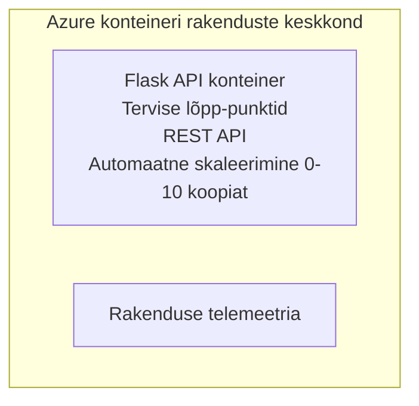

# Lihtne Flask API - konteinerirakenduse näide

**Õppeteekond:** Algaja ⭐ | **Aeg:** 25-35 minutit | **Hind:** 0-15 $/kuu

Täielik töötav Python Flask REST API, mis on juurutatud Azure Container Apps keskkonda, kasutades Azure Developer CLI-d (azd). See näide demonstreerib konteineri juurutamist, automaatset skaalaimist ja monitoorimise põhialuseid.

## 🎯 Mida Sa Õpid

- Juurutada konteineripõhist Python rakendust Azuresse
- Konfigureerida automaatset skaalaimist, mis skaleerib nulli
- Rakendada tervisekontrolli ja valmisolekukontrolle
- Jälgida rakenduse logisid ja mudeleid
- Kasutada Azure Developer CLI-d kiireks juurutamiseks

## 📦 Mis On Kaasas

✅ **Flaski rakendus** - Täielik REST API koos CRUD operatsioonidega (`src/app.py`)  
✅ **Dockerfile** - Tootmisvalmis konteinerikonfiguratsioon  
✅ **Bicep infrastruktuur** - Container Apps keskkond ja API juurutamine  
✅ **AZD konfiguratsioon** - Ühekäsuline juurutuse seadistus  
✅ **Terviseproovid** - Konfigureeritud elujõulisuse ja valmisoleku kontrollid  
✅ **Automaatne skaalaimine** - 0-10 koopiat HTTP koormuse alusel  

## Arhitektuur



## Eeltingimused

### Nõutud
- **Azure Developer CLI (azd)** - [Paigaldusjuhend](https://learn.microsoft.com/azure/developer/azure-developer-cli/install-azd)
- **Azure tellimus** - [Tasuta konto](https://azure.microsoft.com/free/)
- **Docker Desktop** - [Paigalda Docker](https://www.docker.com/products/docker-desktop/) (kohalikeks testideks)

### Eeltingimuste kontrollimine

```bash
# Kontrolli azd versiooni (vajalik 1.5.0 või uuem)
azd version

# Kinnita Azure sisse logimine
azd auth login

# Kontrolli Dockerit (valikuline, kohalikuks testimiseks)
docker --version
```

## ⏱️ Juurutuse ajakava

| Faas | Kestus | Mis toimub |
|-------|----------|--------------||
| Keskkonna seadistamine | 30 sekundit | Loo azd keskkond |
| Konteineri loomine | 2-3 minutit | Docker loob Flask rakenduse |
| Infrastruktuuri loomine | 3-5 minutit | Loo Container Apps, registri ja monitooring |
| Rakenduse juurutamine | 2-3 minutit | Pusheta pilt ja juuruta Container Apps-sse |
| **Kokku** | **8-12 minutit** | Täielik juurutus valmis |

## Kiire Algus

```bash
# Navigeeri näidisele
cd examples/container-app/simple-flask-api

# Initsialiseeri keskkond (vali unikaalne nimi)
azd env new myflaskapi

# Paigalda kõik (infrastruktuur + rakendus)
azd up
# Sind palutakse:
# 1. Vali Azure tellimus
# 2. Vali asukoht (nt eastus2)
# 3. Oota 8-12 minutit paigalduse lõpuleviimiseks

# Hangi oma API lõpp-punkt
azd env get-values

# Testi API-d
curl $(azd env get-value API_ENDPOINT)/health
```

**Oodatav väljund:**
```json
{
  "status": "healthy",
  "timestamp": "2025-11-19T10:30:00Z",
  "service": "simple-flask-api",
  "version": "1.0.0"
}
```

## ✅ Kontrolli juurutust

### Samm 1: Kontrolli juurutuse olekut

```bash
# Vaata juurutatud teenuseid
azd show

# Oodatud väljund näitab:
# - Teenus: api
# - Lõpp-punkt: https://ca-api-[env].xxx.azurecontainerapps.io
# - Staatus: Töös
```

### Samm 2: Testi API otspunkte

```bash
# Hangi API lõpp-punkt
API_URL=$(azd env get-value API_ENDPOINT)

# Testi tervist
curl $API_URL/health

# Testi juurlõpp-punkti
curl $API_URL/

# Loo üksus
curl -X POST $API_URL/api/items \
  -H "Content-Type: application/json" \
  -d '{"name": "Test Item", "description": "My first item"}'

# Hangi kõik üksused
curl $API_URL/api/items
```

**Edu kriteeriumid:**
- ✅ Tervise otspunkt tagastab HTTP 200
- ✅ Juuretpunktil kuvatakse API info
- ✅ POST loob objekti ja tagastab HTTP 201
- ✅ GET tagastab loodud objektid

### Samm 3: Vaata logisid

```bash
# Voogesita reaalajas logisid, kasutades azd monitorit
azd monitor --logs

# Või kasuta Azure CLI-d:
az containerapp logs show --name api --resource-group $RG_NAME --follow

# Sa peaksid nägema:
# - Gunicorni käivitussõnumeid
# - HTTP-päringu logisid
# - Rakenduse infologisid
```

## Projekti struktuur

```
simple-flask-api/
├── azure.yaml              # AZD configuration
├── infra/
│   ├── main.bicep         # Main infrastructure
│   ├── main.parameters.json
│   └── app/
│       ├── container-env.bicep
│       └── api.bicep
└── src/
    ├── app.py             # Flask application
    ├── requirements.txt
    └── Dockerfile
```

## API otspunktid

| Otspunkt | Meetod | Kirjeldus |
|----------|--------|-------------|
| `/health` | GET | Tervise kontroll |
| `/api/items` | GET | Kõigi elementide nimekiri |
| `/api/items` | POST | Uue elemendi loomine |
| `/api/items/{id}` | GET | Spetsiifilise elemendi päring |
| `/api/items/{id}` | PUT | Elemendi uuendamine |
| `/api/items/{id}` | DELETE | Elemendi kustutamine |

## Konfiguratsioon

### Keskkonnamuutujad

```bash
# Määra kohandatud konfiguratsioon
azd env set PORT 8000
azd env set LOG_LEVEL info
azd env set MAX_REPLICAS 20
```

### Skaalaimise konfiguratsioon

API skaleerub automaatselt HTTP-liikluse põhjal:
- **Minimaalne koopiate arv**: 0 (skaalab nulli kui tühi)
- **Maksimaalne koopiate arv**: 10
- **Päringute arv ühes koopias**: 50

## Arendus

### Käivita lokaalselt

```bash
# Paigalda sõltuvused
cd src
pip install -r requirements.txt

# Käivita rakendus
python app.py

# Testi lokaalselt
curl http://localhost:8000/health
```

### Konteineri ehitamine ja testimine

```bash
# Koosta Dockeri kujutis
docker build -t flask-api:local ./src

# Käivita konteiner lokaalselt
docker run -p 8000:8000 flask-api:local

# Testi konteinerit
curl http://localhost:8000/health
```

## Juurutamine

### Täielik juurutus

```bash
# Paigalda infrastruktuur ja rakendus
azd up
```

### Ainult koodi juurutus

```bash
# Paigalda ainult rakenduse kood (tarkvara infrastruktuur muutmata)
azd deploy api
```

### Konfiguratsiooni uuendamine

```bash
# Uuenda keskkonnamuutujaid
azd env set API_KEY "new-api-key"

# Taaspaiguta uue konfiguratsiooniga
azd deploy api
```

## Monitooring

### Vaata logisid

```bash
# Voogedasta reaalajas logisid, kasutades azd monitori
azd monitor --logs

# Või kasuta Azure CLI-d konteinerirakenduste jaoks:
az containerapp logs show --name api --resource-group $RG_NAME --follow

# Vaata viimaseid 100 rida
az containerapp logs show --name api --resource-group $RG_NAME --tail 100
```

### Monitoori mudeleid

```bash
# Ava Azure Monitori juhtpaneel
azd monitor --overview

# Vaata konkreetseid mõõdikuid
az monitor metrics list \
  --resource $(azd show --output json | jq -r '.services.api.resourceId') \
  --metric "Requests,ResponseTime"
```

## Testimine

### Tervisekontroll

```bash
curl $(azd show --output json | jq -r '.services.api.endpoint')/health
```

Oodatav vastus:
```json
{
  "status": "healthy",
  "timestamp": "2025-11-19T10:30:00Z"
}
```

### Loo element

```bash
curl -X POST $(azd show --output json | jq -r '.services.api.endpoint')/api/items \
  -H "Content-Type: application/json" \
  -d '{"name": "Test Item", "description": "A test item"}'
```

### Saa kõik elemendid

```bash
curl $(azd show --output json | jq -r '.services.api.endpoint')/api/items
```

## Kulu optimeerimine

See juurutus kasutab skaalaimist nulli, nii et maksad ainult siis kui API teenindab päringuid:

- **Tühikäigu maksumus**: ~0 $/kuu (skaalatuna nulli)
- **Aktiivne maksumus**: ~0.000024 $ sekundis koopia kohta
- **Oodatav kuukulu** (kerge kasutus): 5-15 $

### Kulude veelgi vähendamine

```bash
# Vähendada maksimaalset koopiate arvu arenduskeskkonnas
azd env set MAX_REPLICAS 3

# Kasutada lühemat tühikäigu aegumist
azd env set SCALE_TO_ZERO_TIMEOUT 300  # 5 minutit
```

## Veaotsing

### Konteinerit ei käivitu

```bash
# Kontrolli konteineri logisid Azure CLI abil
az containerapp logs show --name api --resource-group $RG_NAME --tail 100

# Kontrolli Docker piltide kohalikku ülesehitamist
docker build -t test ./src
```

### API ei ole ligipääsetav

```bash
# Kontrolli, et sisend on väline
az containerapp show --name api --resource-group rg-simple-flask-api \
  --query properties.configuration.ingress.external
```

### Kõrged vastuseajad

```bash
# Kontrolli protsessori/mälu kasutust
az monitor metrics list \
  --resource $(azd show --output json | jq -r '.services.api.resourceId') \
  --metric "CPUPercentage,MemoryPercentage"

# Vajadusel suurenda ressursse
az containerapp update --name api --resource-group rg-simple-flask-api \
  --cpu 1.0 --memory 2Gi
```

## Puhastamine

```bash
# Kustuta kõik ressursid
azd down --force --purge
```

## Järgmised sammud

### Selle näite laiendamine

1. **Lisa andmebaas** - integreeri Azure Cosmos DB või SQL andmebaas
   ```bash
   # Lisa Cosmos DB moodul failile infra/main.bicep
   # Uuenda app.py-d andmebaasi ühendusega
   ```

2. **Lisa autentimine** - rakenda Microsoft Entra ID või API võtmed
   ```python
   # Lisa autentimismiddleware faili app.py
   from functools import wraps
   ```

3. **Sea üles CI/CD** - GitHub Actions töövoog
   ```yaml
   # Create .github/workflows/deploy.yml
   name: Deploy to Azure
   on: [push]
   ```

4. **Lisa hallatav identiteet** - turvaline ligipääs Azure teenustele
   ```bicep
   # Update infra/app/api.bicep
   identity: { type: 'SystemAssigned' }
   ```

### Seotud näited

- **[Andmebaasirakendus](../../../../../examples/database-app)** - Täielik näide SQL andmebaasiga
- **[Mikroteenused](../../../../../examples/container-app/microservices)** - Mitme teenuse arhitektuur
- **[Container Apps põhijuhend](../README.md)** - Kõik konteinerimustrid

### Õppematerjalid

- 📚 [AZD Algajate Kursus](../../../README.md) - Peamine kursuse koduleht
- 📚 [Container Apps mustrid](../README.md) - Rohkem juurutusmustreid
- 📚 [AZD mallide galerii](https://azure.github.io/awesome-azd/) - Kogukonna mallid

## Täiendavad ressursid

### Dokumentatsioon
- **[Flaski dokumentatsioon](https://flask.palletsprojects.com/)** - Flaski raamistiku juhend
- **[Azure Container Apps](https://learn.microsoft.com/azure/container-apps/)** - Azure ametlik dokumentatsioon
- **[Azure Developer CLI](https://learn.microsoft.com/azure/developer/azure-developer-cli/)** - azd käsurea viide

### Õpetused
- **[Container Apps kiire algus](https://learn.microsoft.com/azure/container-apps/quickstart-portal)** - Juuruta oma esimene rakendus
- **[Python Azures](https://learn.microsoft.com/azure/developer/python/)** - Pythoni arenduse juhend
- **[Bicep keel](https://learn.microsoft.com/azure/azure-resource-manager/bicep/)** - Infrastruktuur koodina

### Tööriistad
- **[Azure portaal](https://portal.azure.com)** - Visuaalne ressursside haldus
- **[VS Code Azure laiendus](https://marketplace.visualstudio.com/items?itemName=ms-azuretools.vscode-azurecontainerapps)** - IDE integratsioon

---

**🎉 Palju õnne!** Sa oled juurutanud tootmisvalmis Flask API Azure Container Apps keskkonda automaatse skaalaimise ja monitooringuga.

**Küsimused?** [Ava probleem](https://github.com/microsoft/AZD-for-beginners/issues) või vaata [KKK](../../../resources/faq.md) lehte.

---

<!-- CO-OP TRANSLATOR DISCLAIMER START -->
**Lahtiütlus**:
See dokument on tõlgitud kasutades AI tõlketeenust [Co-op Translator](https://github.com/Azure/co-op-translator). Kuigi me püüdleme täpsuse poole, palun pange tähele, et automatiseeritud tõlgetes võib esineda vigu või ebatäpsusi. Originaaldokument selle emakeeles tuleks pidada autoriteetseks allikaks. Olulise teabe puhul soovitatakse kasutada professionaalset inimtõlget. Me ei vastuta selle tõlkega seotud eksimustest või valesti mõistmistest.
<!-- CO-OP TRANSLATOR DISCLAIMER END -->