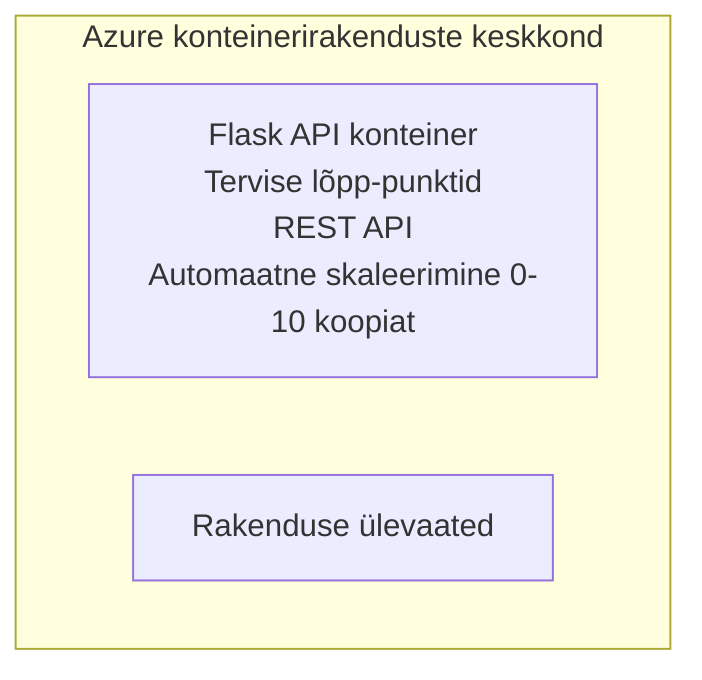

# Lihtne Flask API - konteinerirakenduse näide

**Õppeteekond:** Algaja ⭐ | **Aeg:** 25-35 minutit | **Kulu:** 0-15 $/kuus

Täielik, töötav Python Flask REST API, mis on juurutatud Azure Container Apps platvormile, kasutades Azure Developer CLI-d (azd). See näide demonstreerib konteinerite paigaldamist, automaatset skaleerimist ja põhimonitooringut.

## 🎯 Mida Sa Õpid

- Paigaldada konteineripõhist Python rakendust Azure’i
- Konfigureerida automaatne skaleerimine koos skaleerumisega nullini
- Rakendada tervisekontrolle ja valmiduskontrolle
- Jälgida rakenduse logisid ja mõõdikuid
- Kasutada Azure Developer CLI-d kiireks juurutamiseks

## 📦 Mis Kaasas On

✅ **Flaski rakendus** - Täielik REST API koos CRUD-operatsioonidega (`src/app.py`)  
✅ **Dockerfile** - Tootmiskõlblik konteinerikonfiguratsioon  
✅ **Bicep infrastruktuur** - Container Apps keskkond ja API juurutus  
✅ **AZD konfiguratsioon** - Ühe käsuga juurutamise seadistus  
✅ **Tervisekontrollid** - Konfigureeritud livenes ja valmiduskontrollid  
✅ **Automaatne skaleerimine** - 0-10 eksemplari HTTP koormuse alusel  

## Arhitektuur


## Eeltingimused

### Vajalik
- **Azure Developer CLI (azd)** - [Paigaldusjuhend](https://learn.microsoft.com/azure/developer/azure-developer-cli/install-azd)
- **Azure tellimus** - [Tasuta konto](https://azure.microsoft.com/free/)
- **Docker Desktop** - [Paigalda Docker](https://www.docker.com/products/docker-desktop/) (kohalikuks testimiseks)

### Eeltingimuste kontrollimine

```bash
# Kontrolli azd versiooni (vajalik 1.5.0 või uuem)
azd version

# Kontrolli Azure sisse logimist
azd auth login

# Kontrolli Dockerit (valikuline, lokaalseks testimiseks)
docker --version
```

## ⏱️ Juurutamise Ajakava

| Etapp | Kestus | Mis Juhtub |
|-------|----------|--------------||
| Keskkonna seadistamine | 30 sekundit | Loob azd keskkonna |
| Konteineri ehitus | 2-3 minutit | Docker ehitab Flaski rakenduse |
| Infrastruktuuri loomine | 3-5 minutit | Loob Container Apps, registri, monitooringu |
| Rakenduse juurutamine | 2-3 minutit | Pushib image’i ja juurutab Container Apps’i |
| **Kokku** | **8-12 minutit** | Valmis juurutus |

## Kiire Algus

```bash
# Liigu näite juurde
cd examples/container-app/simple-flask-api

# Initsialiseeri keskkond (vali unikaalne nimi)
azd env new myflaskapi

# Paiguta kõik (taristu + rakendus)
azd up
# Sinu käest küsitakse:
# 1. Vali Azure tellimus
# 2. Vali asukoht (nt eastus2)
# 3. Oota 8-12 minutit paigutamiseks

# Hangi oma API lõpp-punkt
azd env get-values

# Testi API-d
curl $(azd env get-value API_ENDPOINT)/health
```

**Oodatav tulemus:**
```json
{
  "status": "healthy",
  "timestamp": "2025-11-19T10:30:00Z",
  "service": "simple-flask-api",
  "version": "1.0.0"
}
```

## ✅ Juurutuse Kinnitus

### 1. samm: Juurutuse oleku kontrollimine

```bash
# Kuva kasutusele võetud teenused
azd show

# Oodatud väljund näitab:
# - Teenus: api
# - Lõpp-punkt: https://ca-api-[env].xxx.azurecontainerapps.io
# - Olekur: Töötamas
```

### 2. samm: API lõpp-punktide testimine

```bash
# Hangi API lõpp-punkt
API_URL=$(azd env get-value API_ENDPOINT)

# Testi seisundit
curl $API_URL/health

# Testi juur-lõpp-punkti
curl $API_URL/

# Loo üksus
curl -X POST $API_URL/api/items \
  -H "Content-Type: application/json" \
  -d '{"name": "Test Item", "description": "My first item"}'

# Hangi kõik üksused
curl $API_URL/api/items
```

**Edu kriteeriumid:**
- ✅ Tervise lõpp-punkt tagastab HTTP 200
- ✅ Juure lõpp-punkt kuvab API infot
- ✅ POST loob kirje ja tagastab HTTP 201
- ✅ GET tagastab loodud kirjed

### 3. samm: Logide vaatamine

```bash
# Voogesita otseülekandes logisid, kasutades azd monitori
azd monitor --logs

# Või kasuta Azure CLI-d:
az containerapp logs show --name api --resource-group $RG_NAME --follow

# Sa peaksid nägema:
# - Gunicorni käivitussõnumeid
# - HTTP-päringu logisid
# - Rakenduse info logisid
```

## Projekti struktuur

```
simple-flask-api/
├── azure.yaml              # AZD configuration
├── infra/
│   ├── main.bicep         # Main infrastructure
│   ├── main.parameters.json
│   └── app/
│       ├── container-env.bicep
│       └── api.bicep
└── src/
    ├── app.py             # Flask application
    ├── requirements.txt
    └── Dockerfile
```

## API lõpp-punktid

| Lõpp-punkt | Meetod | Kirjeldus |
|------------|--------|-----------|
| `/health` | GET | Tervisekontroll |
| `/api/items` | GET | Kõigi esemete nimekiri |
| `/api/items` | POST | Uue eseme loomine |
| `/api/items/{id}` | GET | Kindla eseme päring |
| `/api/items/{id}` | PUT | Esimese uuendamine |
| `/api/items/{id}` | DELETE | Esimese kustutamine |

## Konfiguratsioon

### Keskkonnamuutujad

```bash
# Sea kohandatud konfiguratsioon
azd env set PORT 8000
azd env set LOG_LEVEL info
azd env set MAX_REPLICAS 20
```

### Skaleerimise konfiguratsioon

API skaleerub automaatselt HTTP-liikluse alusel:
- **Minimaalsete koopiate arv**: 0 (skaleerub nullini tühikäigul)
- **Maksimaalsete koopiate arv**: 10
- **Samasuguste päringute arv koopial**: 50

## Arendus

### Käivita kohapeal

```bash
# Installi sõltuvused
cd src
pip install -r requirements.txt

# Käivita rakendus
python app.py

# Testi lokaalselt
curl http://localhost:8000/health
```

### Koosta ja testi konteinerit

```bash
# Koosta Dockeri kujutis
docker build -t flask-api:local ./src

# Käivita konteiner lokaalselt
docker run -p 8000:8000 flask-api:local

# Testi konteinerit
curl http://localhost:8000/health
```

## Juurutamine

### Täielik juurutus

```bash
# Paigaldage infrastruktuur ja rakendus
azd up
```

### Ainult koodi juurutus

```bash
# Hõlma vaid rakenduse koodi (infrastruktuur muutmata)
azd deploy api
```

### Konfiguratsiooni uuendamine

```bash
# Uuenda keskkonnamuutujaid
azd env set API_KEY "new-api-key"

# Taaskäivita uue konfiguratsiooniga
azd deploy api
```

## Monitooring

### Logide vaatamine

```bash
# Voogesita reaalajas logisid, kasutades azd monitori
azd monitor --logs

# Või kasuta Azure CLI-d konteinerirakenduste jaoks:
az containerapp logs show --name api --resource-group $RG_NAME --follow

# Vaata viimaseid 100 rida
az containerapp logs show --name api --resource-group $RG_NAME --tail 100
```

### Mõõdikute jälgimine

```bash
# Ava Azure Monitor juhtpaneel
azd monitor --overview

# Vaata spetsiifilisi mõõdikuid
az monitor metrics list \
  --resource $(azd show --output json | jq -r '.services.api.resourceId') \
  --metric "Requests,ResponseTime"
```

## Testimine

### Tervisekontroll

```bash
curl $(azd show --output json | jq -r '.services.api.endpoint')/health
```

Oodatud vastus:
```json
{
  "status": "healthy",
  "timestamp": "2025-11-19T10:30:00Z"
}
```

### Eseme loomine

```bash
curl -X POST $(azd show --output json | jq -r '.services.api.endpoint')/api/items \
  -H "Content-Type: application/json" \
  -d '{"name": "Test Item", "description": "A test item"}'
```

### Kõigi esemete päring

```bash
curl $(azd show --output json | jq -r '.services.api.endpoint')/api/items
```

## Kulude optimeerimine

See juurutus kasutab skaleerimist nullini, nii et maksad ainult siis, kui API töötleb päringuid:

- **Tühikäigu kulu**: umbes 0 $/kuus (skaleeritud nullini)
- **Aktiivse töö kulu**: umbes 0,000024 $/sekund koopiale
- **Oodatav kuukulu** (kerge kasutus): 5-15 $

### Kulude edasine vähendamine

```bash
# Vähenda arenduskeskkonna maksimaalsete koopiate arvu
azd env set MAX_REPLICAS 3

# Kasuta lühemat tühikäigu ajalõppu
azd env set SCALE_TO_ZERO_TIMEOUT 300  # 5 minutit
```

## Tõrkeotsing

### Konteinerit ei alustata

```bash
# Kontrolli konteineri logisid kasutades Azure CLI-d
az containerapp logs show --name api --resource-group $RG_NAME --tail 100

# Kontrolli Docker pildi lokaalset ehitamist
docker build -t test ./src
```

### API ei ole ligipääsetav

```bash
# Kontrolli, kas sisenemine on väline
az containerapp show --name api --resource-group rg-simple-flask-api \
  --query properties.configuration.ingress.external
```

### Kõrged vastuseajad

```bash
# Kontrolli CPU/mälu kasutust
az monitor metrics list \
  --resource $(azd show --output json | jq -r '.services.api.resourceId') \
  --metric "CPUPercentage,MemoryPercentage"

# Vajadusel suurenda ressursse
az containerapp update --name api --resource-group rg-simple-flask-api \
  --cpu 1.0 --memory 2Gi
```

## Koristamine

```bash
# Kustuta kõik ressursid
azd down --force --purge
```

## Järgmised sammud

### Laienda seda näidet

1. **Lisa andmebaas** - integreeri Azure Cosmos DB või SQL andmebaas  
   ```bash
   # Lisa Cosmos DB moodul infra/main.bicep faili
   # Uuenda app.py faili andmebaasi ühendusega
   ```

2. **Lisa autentimine** - rakenda Azure AD või API võtmed  
   ```python
   # Lisa autentimise vahendustarkvara faili app.py
   from functools import wraps
   ```

3. **Sea üles CI/CD** - GitHub Actions töövoog  
   ```yaml
   # Create .github/workflows/deploy.yml
   name: Deploy to Azure
   on: [push]
   ```

4. **Lisa hallatav identiteet** - turvaline ligipääs Azure teenustele  
   ```bicep
   # Update infra/app/api.bicep
   identity: { type: 'SystemAssigned' }
   ```

### Seotud näited

- **[Andmebaasi rakendus](../../../../../examples/database-app)** - Täielik näide SQL andmebaasiga  
- **[Mikroteenused](../../../../../examples/container-app/microservices)** - Mitmepõhine arhitektuur  
- **[Container Apps peajuht](../README.md)** - Kõik konteineripõhised mustrid  

### Õppematerjalid

- 📚 [AZD algajatele kursus](../../../README.md) - Peamine kursuse avaleht  
- 📚 [Container Apps mustrid](../README.md) - Rohkem juurutusmustreid  
- 📚 [AZD mallide galerii](https://azure.github.io/awesome-azd/) - Kogukonna mallid  

## Lisamaterjalid

### Dokumentatsioon
- **[Flaski dokumentatsioon](https://flask.palletsprojects.com/)** - Flask raamistik  
- **[Azure Container Apps](https://learn.microsoft.com/azure/container-apps/)** - Azure ametlik dokumentatsioon  
- **[Azure Developer CLI](https://learn.microsoft.com/azure/developer/azure-developer-cli/)** - azd käsurea viide  

### Juhendid
- **[Container Apps juhend](https://learn.microsoft.com/azure/container-apps/quickstart-portal)** - Esimese rakenduse juurutamine  
- **[Python Azure’is](https://learn.microsoft.com/azure/developer/python/)** - Python arendusjuhend  
- **[Bicep keel](https://learn.microsoft.com/azure/azure-resource-manager/bicep/)** - infrastruktuur koodina  

### Tööriistad
- **[Azure portaal](https://portal.azure.com)** - visuaalne haldamine  
- **[VS Code Azure laiendus](https://marketplace.visualstudio.com/items?itemName=ms-azuretools.vscode-azurecontainerapps)** - IDE integratsioon  

---

**🎉 Palju õnne!** Sa oled paigaldanud tootmiskõlbuliku Flask API Azure Container Apps’i platvormile koos automaatse skaleerimise ja monitooringuga.

**Küsimused?** [Ava teema](https://github.com/microsoft/AZD-for-beginners/issues) või vaata [KKK-d](../../../resources/faq.md)

---

<!-- CO-OP TRANSLATOR DISCLAIMER START -->
**Vastutusest loobumine**:
See dokument on tõlgitud kasutades tehisintellektil põhinevat tõlketeenust [Co-op Translator](https://github.com/Azure/co-op-translator). Kuigi me püüame tagada täpsust, tuleb arvestada, et automaatsed tõlked võivad sisaldada vigu või ebatäpsusi. Originaaldokument oma emakeeles tuleks pidada autoriteetseks allikaks. Olulise teabe puhul on soovitatav kasutada professionaalset inimtõlget. Me ei vastuta selle tõlke kasutamisest tingitud arusaamatuste või valesti tõlgenduste eest.
<!-- CO-OP TRANSLATOR DISCLAIMER END -->