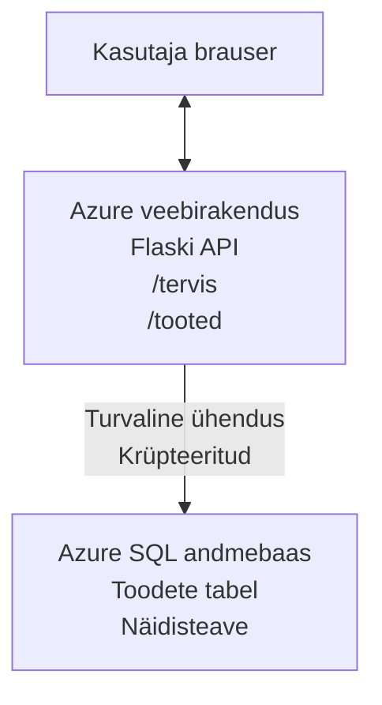

# Microsoft SQL andmebaasi ja veebirakenduse juurutamine AZD-ga

⏱️ **Eeldatav aeg**: 20–30 minutit | 💰 **Eeldatav maksumus**: ~15–25 USD kuus | ⭐ **Tasemeklaskus**: Kesktasemel

See **täielik töötav näide** demonstreerib, kuidas kasutada [Azure Developer CLI (azd)](https://learn.microsoft.com/azure/developer/azure-developer-cli/) Python Flask veebirakenduse juurutamiseks Microsoft SQL andmebaasiga Azure'i. Kogu kood on kaasatud ja testitud—väliseid sõltuvusi ei ole vaja.

## Mida sa õpid

Selle näite sooritamisega:
- Juurutad mitmekihilise rakenduse (veebirakendus + andmebaas) infrastruktuur-koodi abil
- Konfigureerid turvalisi andmebaasiühendusi ilma salasõnade kodeerimiseta
- Jälgid rakenduse tervist Application Insightsiga
- Haldate Azure ressursse tõhusalt AZD CLI abil
- Järgite Azure parimaid tavasid turvalisuse, kulude optimeerimise ja jälgitavuse osas

## Stsenaarium kokkuvõte
- **Veebirakendus**: Python Flask REST API, andmebaasiühendusega
- **Andmebaas**: Azure SQL andmebaas näidisandmetega
- **Infrastruktuur**: Provisioneeritud Bicepiga (modulaarne, korduvkasutatav mall)
- **Juurutamine**: Täiesti automatiseeritud `azd` käskudega
- **Jälgimine**: Application Insights logide ja telemeetria jaoks

## Eeltingimused

### Nõutavad tööriistad

Enne alustamist veendu, et sul on need tööriistad paigaldatud:

1. **[Azure CLI](https://learn.microsoft.com/cli/azure/install-azure-cli)** (versioon 2.50.0 või uuem)
   ```sh
   az --version
   # Oodatav väljund: azure-cli 2.50.0 või uuem
   ```

2. **[Azure Developer CLI (azd)](https://learn.microsoft.com/azure/developer/azure-developer-cli/install-azd)** (versioon 1.0.0 või uuem)
   ```sh
   azd version
   # Oodatav väljund: azd versioon 1.0.0 või uuem
   ```

3. **[Python 3.8+](https://www.python.org/downloads/)** (kohalikuks arenduseks)
   ```sh
   python --version
   # Oodatav väljund: Python 3.8 või uuem
   ```

4. **[Docker](https://www.docker.com/get-started)** (valikuline, konteineripõhiseks kohalikuks arenduseks)
   ```sh
   docker --version
   # Oodatav väljund: Dockeri versioon 20.10 või uuem
   ```

### Azure nõuded

- Aktiivne **Azure tellimus** ([loo tasuta konto](https://azure.microsoft.com/free/))
- Õigused ressursside loomiseks sinu tellimuses
- **Omamise** või **Kaastöötaja** roll tellimuses või ressursigrupis

### Eelteadmised

See on **kesktaseme** näide. Peaksid tuttav olema:
- Põhiliste käsurea operatsioonidega
- Pilvepõhiste aluste mõistmisega (ressursid, ressursigrupid)
- Põhitõdede teadmine veebirakenduste ja andmebaaside kohta

**AZD-ga alustamiseks** vaata esmalt [Getting Started juhendit](../../docs/chapter-01-foundation/azd-basics.md).

## Arhitektuur

See näide juurutab kahtekihilise arhitektuuri veebirakenduse ja SQL andmebaasiga:


**Ressursside juurutamine:**
- **Ressursigrupp**: Kõigi ressursside konteiner
- **App Service plaan**: Linux-põhine majutus (B1 tase, kulutõhus)
- **Veebirakendus**: Python 3.11 runtime Flask rakendusega
- **SQL server**: Hallatav andmebaasiserver, TLS 1.2 miinimumiga
- **SQL andmebaas**: Põhitasemel (2 GB, sobib arenduseks/testimiseks)
- **Application Insights**: Jälgimine ja logimine
- **Log Analytics tööruum**: Keskne logisäilitamine

**Analooogia**: Mõtle sellele nagu restoranile (veebirakendus) koos jalutuskülmikuga (andmebaas). Kliendid tellivad menüüst (API otspunktid) ning köök (Flaski rakendus) võtab koostisosi (andmeid) külmikust. Restorani juht (Application Insights) jälgib kõike, mis toimub.

## Kaustastruktuur

Kõik failid kaasatud – väliseid sõltuvusi ei ole:

```
examples/database-app/
│
├── README.md                    # This file
├── azure.yaml                   # AZD configuration file
├── .env.sample                  # Sample environment variables
├── .gitignore                   # Git ignore patterns
│
├── infra/                       # Infrastructure as Code (Bicep)
│   ├── main.bicep              # Main orchestration template
│   ├── abbreviations.json      # Azure naming conventions
│   └── resources/              # Modular resource templates
│       ├── sql-server.bicep    # SQL Server configuration
│       ├── sql-database.bicep  # Database configuration
│       ├── app-service-plan.bicep  # Hosting plan
│       ├── app-insights.bicep  # Monitoring setup
│       └── web-app.bicep       # Web application
│
└── src/
    └── web/                    # Application source code
        ├── app.py              # Flask REST API
        ├── requirements.txt    # Python dependencies
        └── Dockerfile          # Container definition
```

**Mida iga fail teeb:**
- **azure.yaml**: Ütleb AZD-le, mida ja kuhu juurutada
- **infra/main.bicep**: Koordineerib kõiki Azure ressursse
- **infra/resources/*.bicep**: Üksiktarbimuste definitsioonid (modulaarsed korduvkasutuseks)
- **src/web/app.py**: Flask rakendus andmebaasi loogikaga
- **requirements.txt**: Python pakettide sõltuvused
- **Dockerfile**: Juhised konteinerimiseks juurutamisel

## Kiirkäivitus (samm-sammult)

### Samm 1: Kloonimine ja navigeerimine
```sh
git clone https://github.com/microsoft/AZD-for-beginners.git
cd AZD-for-beginners/examples/database-app
```

**✓ Õnnestumise kontroll**: Veendu, et näed `azure.yaml` ja `infra/` kausta:
```sh
ls
# Oodatud: README.md, azure.yaml, infra/, src/
```

### Samm 2: Azure'isse autentimine

```sh
azd auth login
```

See avab brauseri Azure autentimiseks. Logi sisse oma Azure kasutajaga.

**✓ Õnnestumise kontroll**: Peaksid nägema:
```
Logged in to Azure.
```

### Samm 3: Keskkonna initsialiseerimine

```sh
azd init
```

**Mis toimub**: AZD loob kohalikku konfiguratsiooni sinu juurutuseks.

**Promptid, mida näed**:
- **Keskkonna nimi**: Sisesta lühike nimi (nt `dev`, `myapp`)
- **Azure tellimus**: Vali tellimus nimekirjast
- **Azure piirkond**: Vali piirkond (nt `eastus`, `westeurope`)

**✓ Õnnestumise kontroll**: Peaksid nägema:
```
SUCCESS: New project initialized!
```

### Samm 4: Azure ressursside provisioneerimine

```sh
azd provision
```

**Mis toimub**: AZD juurutab kogu infrastruktuuri (võtab 5–8 minutit):
1. Loob ressursigrupi
2. Loob SQL serveri ja andmebaasi
3. Loob App Service plaani
4. Loob veebirakenduse
5. Loob Application Insightsi
6. Konfigureerib võrgu ja turvalisuse

**Sind küsitakse**:
- **SQL admin kasutajanimi**: Sisesta kasutajanimi (nt `sqladmin`)
- **SQL admin parool**: Sisesta tugev parool (salvesta see!)

**✓ Õnnestumise kontroll**: Peaksid nägema:
```
SUCCESS: Your application was provisioned in Azure in X minutes Y seconds.
You can view the resources created under the resource group rg-<env-name> in Azure Portal:
https://portal.azure.com/#@/resource/subscriptions/.../resourceGroups/rg-<env-name>
```

**⏱️ Aeg**: 5–8 minutit

### Samm 5: Rakenduse juurutamine

```sh
azd deploy
```

**Mis toimub**: AZD ehitab ja juurutab sinu Flask rakenduse:
1. Pakkib Python rakenduse
2. Ehitab Docker konteineri
3. Lükab selle Azure Web Appi
4. Initsialiseerib andmebaasi näidisandmetega
5. Käivitab rakenduse

**✓ Õnnestumise kontroll**: Peaksid nägema:
```
SUCCESS: Your application was deployed to Azure in X minutes Y seconds.
You can view the resources created under the resource group rg-<env-name> in Azure Portal:
https://portal.azure.com/#@/resource/subscriptions/.../resourceGroups/rg-<env-name>
```

**⏱️ Aeg**: 3–5 minutit

### Samm 6: Rakenduse avamine brauseris

```sh
azd browse
```

See avab sinu juurutatud veebirakenduse aadressil `https://app-<unique-id>.azurewebsites.net`

**✓ Õnnestumise kontroll**: Näed JSON väljundit:
```json
{
  "message": "Welcome to the Database App API",
  "endpoints": {
    "/": "This help message",
    "/health": "Health check endpoint",
    "/products": "List all products",
    "/products/<id>": "Get product by ID"
  }
}
```

### Samm 7: API otspunktide testimine

**Tervisekontroll** (kontrollib andmebaasiühendust):
```sh
curl https://app-<your-id>.azurewebsites.net/health
```

**Oodatud vastus**:
```json
{
  "status": "healthy",
  "database": "connected"
}
```

**Toodete nimekiri** (näidisandmed):
```sh
curl https://app-<your-id>.azurewebsites.net/products
```

**Oodatud vastus**:
```json
[
  {
    "id": 1,
    "name": "Laptop",
    "description": "High-performance laptop",
    "price": 1299.99,
    "created_at": "2025-11-19T10:30:00"
  },
  ...
]
```

**Ühe toote päring**:
```sh
curl https://app-<your-id>.azurewebsites.net/products/1
```

**✓ Õnnestumise kontroll**: Kõik otspunktid tagastavad JSON andmed ilma vigadeta.

---

**🎉 Palju õnne!** Sa oled edukalt juurutanud veebirakenduse koos andmebaasiga Azure'i kasutades AZD-d.

## Konfiguratsiooni süvitsi

### Keskkonnamuutujad

Saladused hallatakse turvaliselt Azure App Service konfigureerimise kaudu—**kunagi ei sisestata otse lähtekoodi**.

**AZD konfiguratsiooni automaatselt lisab**:
- `SQL_CONNECTION_STRING`: Andmebaasi ühendus sh krüpteeritud mandaadid
- `APPLICATIONINSIGHTS_CONNECTION_STRING`: Jälgimistelemeetri otsapunkt
- `SCM_DO_BUILD_DURING_DEPLOYMENT`: Lubab automaatse sõltuvuste paigalduse

**Kus saladused hoiustatakse**:
1. `azd provision` käigus sisestad SQL mandaadid turvaliste promptidega
2. AZD salvestab need kohalikku `.azure/<env-name>/.env` faili (git-ignoreeritud)
3. AZD süstib need Azure App Service konfigureerimisse (krüpteeritult)
4. Rakendus loeb neid `os.getenv()` abil käivitumisel

### Kohalik arendus

Kohaliku testimise jaoks loo `.env` fail näidisfailist:

```sh
cp .env.sample .env
# Muuda .env oma kohaliku andmebaasi ühendusega
```

**Kohaliku arenduse töövoog**:
```sh
# Paigalda sõltuvused
cd src/web
pip install -r requirements.txt

# Määra keskkonnamuutujad
export SQL_CONNECTION_STRING="your-local-connection-string"

# Käivita rakendus
python app.py
```

**Testimine kohapeal**:
```sh
curl http://localhost:8000/health
# Oodatud: {"status": "terve", "andmebaas": "ühendatud"}
```

### Infrastruktuur kui kood

Kõik Azure ressursid on määratletud **Bicep mallides** (`infra/` kaust):

- **Modulaarne disain**: Igal ressursitüübil on oma fail korduvkasutuseks
- **Parameetriseeritud**: Kohanda SKUsid, piirkondi, nimekonventsioone
- **Parimad tavad**: Järgib Azure nime- ja turvastandardeid
- **Versioonihaldus**: Infrastruktuuri muudatused jälgitavad Gitis

**Kohanäide**:
Andmebaasi taseme muutmiseks muuda `infra/resources/sql-database.bicep` faili:
```bicep
sku: {
  name: 'Standard'  // Changed from 'Basic'
  tier: 'Standard'
  capacity: 10
}
```

## Turvalisuse parimad tavad

See näide järgib Azure turvalisuse parimaid tavasid:

### 1. **Saladused ei ole lähtekoodis**
- ✅ Mandaadid hoiustatud Azure App Service’i konfigureerimises (krüpteeritud)
- ✅ `.env` failid on `.gitignore`-s
- ✅ Saladused sisestatakse turvaliste parameetritena juurutamise ajal

### 2. **Krüpteeritud ühendused**
- ✅ SQL server TLS 1.2 miinimumiga
- ✅ Veebirakendusel HTTPS ainult lubatud
- ✅ Andmebaasiühendused krüpteeritud kanalite kaudu

### 3. **Võrgu turvalisus**
- ✅ SQL serveri tulemüür lubab ainult Azure teenuseid
- ✅ Avalik võrgujuurdepääs piiratud (saab täiendavalt piirata Privaatsete otsapunktidega)
- ✅ Web Appil FTPS keelatud

### 4. **Autentimine ja autoriseerimine**
- ⚠️ **Praegu**: SQL autentimine (kasutajanimi/parool)
- ✅ **Tootmise soovitus**: Kasuta Azure Managed Identity paroolivabaks autentimiseks

**Managed Identity kasutuselevõtt tootmises**:
1. Luba veebirakendusel hallatav identiteet
2. Anna identiteedile SQL õigused
3. Uuenda ühendusstring managed identity kasutamiseks
4. Eemalda paroolipõhine autentimine

### 5. **Audit ja vastavus**
- ✅ Application Insights logib kõik päringud ja vead
- ✅ SQL andmebaasi auditeerimine lubatud (konfigureeritav vastavuseks)
- ✅ Kõik ressursid märgistatud halduseks

**Turvalisuse kontrollnimekiri enne tootmisse minekut**:
- [ ] Luba Azure Defender SQL jaoks
- [ ] Konfigureeri privaatotsapunktid SQL andmebaasile
- [ ] Luba Veebirakenduste tulemüür (WAF)
- [ ] Kasuta Azure Key Vaulti saladuste vahetamiseks
- [ ] Konfigureeri Azure AD autentimine
- [ ] Luba diagnostika logimine kõikidele ressurssidele

## Kulude optimeerimine

**Eeldatavad kuukulud** (2025. aasta november):

| Ressurss | SKU / tase | Eeldatav maksumus |
|----------|------------|-------------------|
| App Service plaan | B1 (Basic) | ~13 USD kuus |
| SQL andmebaas | Basic (2GB) | ~5 USD kuus |
| Application Insights | Pay-as-you-go | ~2 USD kuus (vähene liiklus) |
| **Kokku** | | **~20 USD kuus** |

**💡 Kulu kokkuhoiu näpunäited**:

1. **Kasuta tasuta taset õppimiseks**:
   - App Service: F1 tase (tasuta, piiratud tunnid)
   - SQL andmebaas: vali Azure SQL Database serverless variant
   - Application Insights: 5 GB kuus tasuta andmete kogumine

2. **Peata ressursid, kui neid ei kasutata**:
   ```sh
   # Peata veebirakendus (andmebaas laadib endiselt)
   az webapp stop --name <app-name> --resource-group <rg-name>
   
   # Taaskäivita vajadusel
   az webapp start --name <app-name> --resource-group <rg-name>
   ```

3. **Kustuta kõik pärast testimist**:
   ```sh
   azd down
   ```
   See eemaldab KÕIK ressursid ja peatab kulud.

4. **Arendus- vs tootmistasemed**:
   - **Arendus**: põhitasemel (kasutatud selles näites)
   - **Tootmine**: standard / premium tasemed koos redundantsiga

**Kulude jälgimine**:
- Vaatamine [Azure Cost Management](https://portal.azure.com/#view/Microsoft_Azure_CostManagement) juures
- Sea üles kulualarmid üllatuste vältimiseks
- Märgista kõik ressursid `azd-env-name` sildiga jälgimiseks

**Tasuta taseme alternatiiv**:
Õppimiseks muuda `infra/resources/app-service-plan.bicep` faili:
```bicep
sku: {
  name: 'F1'  // Free tier
  tier: 'Free'
}
```
**Märkus**: Tasuta tase on piiratud (60 minutit päevas CPU, mitte pesa-alati sees).

## Jälgimine ja jälgitavus

### Application Insights integreerimine

See näide sisaldab **Application Insightsi** põhjalikuks jälgimiseks:

**Jälgitakse**:
- ✅ HTTP päringud (viivitus, staatuskoodid, otspunktid)
- ✅ Rakenduse vead ja erandid
- ✅ Kohandatud logimine Flask rakendusest
- ✅ Andmebaasi ühenduse tervis
- ✅ Jõudlusmõõdikud (CPU, mälu)

**Kuidas vaadata Application Insightsi**:
1. Ava [Azure portaal](https://portal.azure.com)
2. Leia oma ressursigrupp (`rg-<env-name>`)
3. Klõpsa Application Insights ressursil (`appi-<unique-id>`)

**Kasulikud päringud** (Application Insights → Logs):

**Vaata kõiki päringuid**:
```kusto
requests
| where timestamp > ago(1h)
| order by timestamp desc
| project timestamp, name, url, resultCode, duration
```

**Leia vead**:
```kusto
exceptions
| where timestamp > ago(24h)
| order by timestamp desc
| project timestamp, type, outerMessage, operation_Name
```

**Tervise kontrolli otspunkt**:
```kusto
requests
| where name contains "health"
| summarize count() by resultCode, bin(timestamp, 1h)
```

### SQL andmebaasi auditeerimine

**SQL andmebaasi auditeerimine on lubatud** järgneva jälgimiseks:
- Andmebaasi ligipääsu mustrid
- Ebaõnnestunud sisselogimiskatsed
- Skeemi muutused
- Andmete ligipääs (täituvuse jaoks)

**Auditilogide vaatamine**:
1. Azure portaal → SQL andmebaas → Auditeerimine
2. Logid Log Analytics tööruumis

### Reaalajas jälgimine

**Vaata Live Metricsi**:
1. Application Insights → Live Metrics
2. Näed päringuid, vigu ja jõudlust reaalajas

**Seadista alarmid**:
Loo alarmid kriitilistele sündmustele:
- HTTP 500 vead > 5 viis minutit
- Andmebaasiühenduse vead
- Kõrged vastuseajad (> 2 sekundit)

**Näide alarmeerimise loomisest**:
```sh
az monitor metrics alert create \
  --name "High-Response-Time" \
  --resource-group <rg-name> \
  --scopes <app-insights-resource-id> \
  --condition "avg requests/duration > 2000" \
  --description "Alert when response time exceeds 2 seconds"
```

## Tõrkeotsing
### Levinumad probleemid ja lahendused

#### 1. `azd provision` ebaõnnestub veaga "Location not available"

**Sümptom**:
```
Error: The subscription is not registered for the resource type 'components' in the location 'centralus'.
```

**Lahendus**:
Vali teine Azure regioon või registreeri ressursipakkuja:
```sh
az provider register --namespace Microsoft.Insights
```

#### 2. SQL ühendus ebaõnnestub juurutamise ajal

**Sümptom**:
```
pyodbc.OperationalError: ('08001', '[08001] [Microsoft][ODBC Driver 18 for SQL Server]TCP Provider...')
```

**Lahendus**:
- Kontrolli, et SQL Serveri tulemüür lubab Azure teenuseid (on konfigureeritud automaatselt)
- Veendu, et SQL admin parool sisestati õigesti käsklusega `azd provision`
- Kontrolli, kas SQL Server on täielikult juurutatud (võib võtta 2-3 minutit)

**Ühenduse kontrollimine**:
```sh
# Azure portaalist minge SQL andmebaasi → Päringuredaktor
# Proovige oma volikirjadega ühendada
```

#### 3. Veebirakendus kuvab "Application Error"

**Sümptom**:
Brauser kuvab üldist vealehte.

**Lahendus**:
Kontrolli rakenduse logisid:
```sh
# Vaata viimaseid logisid
az webapp log tail --name <app-name> --resource-group <rg-name>
```

**Levinumad põhjused**:
- Puuduvad keskkonnamuutujad (kontrolli App Service → Configuration)
- Python'i paketi installatsioon ebaõnnestus (kontrolli juurutuslogisid)
- Andmebaasi inicialiseerimise viga (kontrolli SQL ühendust)

#### 4. `azd deploy` ebaõnnestub veaga "Build Error"

**Sümptom**:
```
Error: Failed to build project
```

**Lahendus**:
- Veendu, et `requirements.txt` failis pole süntaksivigu
- Kontrolli, et Python 3.11 on määratletud failis `infra/resources/web-app.bicep`
- Veendu, et Dockerfile kasutab õiget baaspilti

**Silumine kohapeal**:
```sh
cd src/web
docker build -t test-app .
docker run -p 8000:8000 test-app
```

#### 5. "Unauthorized" tõrked AZD käskluste käivitamisel

**Sümptom**:
```
ERROR: (Unauthorized) The client '<id>' with object id '<id>' does not have authorization
```

**Lahendus**:
Autendi uuesti Azure’i:
```sh
azd auth login
az login
```

Veendu, et sul on tellimuses õige õigustase (Contributor roll).

#### 6. Kõrged andmebaasi kulud

**Sümptom**:
Ootamatult suur Azure arve.

**Lahendus**:
- Kontrolli, kas unustasid peale testimist käivitada `azd down`
- Veendu, et SQL andmebaas kasutab Basic taset (mitte Premium)
- Vaata kulusid Azure Cost Management’is
- Sea üles kuluhoiatused

### Abi saamine

**Kõigi AZD keskkonnamuutujate kuvamine**:
```sh
azd env get-values
```

**Juurutuse staatuse kontroll**:
```sh
az webapp show --name <app-name> --resource-group <rg-name> --query state
```

**Rakenduse logide lugemine**:
```sh
az webapp log download --name <app-name> --resource-group <rg-name> --log-file app-logs.zip
```

**Vaja rohkem abi?**
- [AZD tõrkeotsingu juhend](../../docs/chapter-07-troubleshooting/common-issues.md)
- [Azure App Service tõrkeotsingu juhend](https://learn.microsoft.com/azure/app-service/troubleshoot-diagnostic-logs)
- [Azure SQL tõrkeotsingu juhend](https://learn.microsoft.com/azure/azure-sql/database/troubleshoot-common-errors-issues)

## Praktilised harjutused

### Harjutus 1: Kontrolli oma juurutust (Algaja)

**Eesmärk**: Kinnita, et kõik ressursid on juurutatud ja rakendus töötab.

**Sammud**:
1. Loetle kõik ressursid oma ressursigrupis:
   ```sh
   az resource list --resource-group rg-<env-name> --output table
   ```
   **Oodatud**: 6-7 ressurssi (Web App, SQL Server, SQL Database, App Service Plan, Application Insights, Log Analytics)

2. Testi kõiki API otsapunkte:
   ```sh
   curl https://app-<your-id>.azurewebsites.net/
   curl https://app-<your-id>.azurewebsites.net/health
   curl https://app-<your-id>.azurewebsites.net/products
   curl https://app-<your-id>.azurewebsites.net/products/1
   ```
   **Oodatud**: Kõik tagastavad valide JSONi ilma vigadeta

3. Kontrolli Application Insights’i:
   - Ava Azure Portalis Application Insights
   - Mine jaotisse "Live Metrics"
   - Värskenda veebirakendust brauseris
   **Oodatud**: Nostud ilmuvad reaalajas

**Edu kriteeriumid**: Kõik 6-7 ressurssi on olemas, kõik otsapunktid tagastavad andmed, Live Metrics näitab aktiivsust.

---

### Harjutus 2: Lisa uus API otsapunkt (Kesktase)

**Eesmärk**: Laienda Flask-rakendust uue otsapunktiga.

**Alguskood**: Praegused otsapunktid failis `src/web/app.py`

**Sammud**:
1. Muuda `src/web/app.py` ja lisa uus otsapunkt pärast funktsiooni `get_product()`:
   ```python
   @app.route('/products/search/<keyword>')
   def search_products(keyword):
       """Search products by name or description."""
       try:
           conn = get_db_connection()
           cursor = conn.cursor()
           cursor.execute(
               "SELECT id, name, description, price, created_at FROM products WHERE name LIKE ? OR description LIKE ?",
               (f'%{keyword}%', f'%{keyword}%')
           )
           
           products = []
           for row in cursor.fetchall():
               products.append({
                   'id': row[0],
                   'name': row[1],
                   'description': row[2],
                   'price': float(row[3]) if row[3] else None,
                   'created_at': row[4].isoformat() if row[4] else None
               })
           
           cursor.close()
           conn.close()
           
           logger.info(f"Search for '{keyword}' returned {len(products)} results")
           return jsonify(products), 200
           
       except Exception as e:
           logger.error(f"Error searching products: {str(e)}")
           return jsonify({'error': str(e)}), 500
   ```

2. Juuri uuendatud rakendus:
   ```sh
   azd deploy
   ```

3. Testi uut otsapunkti:
   ```sh
   curl https://app-<your-id>.azurewebsites.net/products/search/laptop
   ```
   **Oodatud**: Tagastab tooted, mis vastavad "laptop" märksõnale

**Edu kriteeriumid**: Uus otsapunkt töötab, tagastab filtreeritud tulemused, ilmub Application Insights logides.

---

### Harjutus 3: Lisa monitooring ja hoiatused (Edasijõudnu)

**Eesmärk**: Seadista proaktiivne monitooring koos teadetega.

**Sammud**:
1. Loo hoiatus HTTP 500 vigade jaoks:
   ```sh
   # Saa Application Insightsi ressursi ID
   AI_ID=$(az monitor app-insights component show \
     --app appi-<your-id> \
     --resource-group rg-<env-name> \
     --query id -o tsv)
   
   # Loo hoiatus
   az monitor metrics alert create \
     --name "High-Error-Rate" \
     --resource-group rg-<env-name> \
     --scopes $AI_ID \
     --condition "count requests/failed > 5" \
     --window-size 5m \
     --evaluation-frequency 1m \
     --description "Alert when >5 failed requests in 5 minutes"
   ```

2. Tekita vigu hoiatuses käivitamiseks:
   ```sh
   # Taotlege mitteolemasolevat toodet
   for i in {1..10}; do curl https://app-<your-id>.azurewebsites.net/products/999; done
   ```

3. Kontrolli, kas hoiatus käivitati:
   - Azure Portal → Alerts → Alert Rules
   - Kontrolli oma e-posti (kui konfigureeritud)

**Edu kriteeriumid**: Hoiatereegel on loodud, vigu tuvastab, teated on saadetud.

---

### Harjutus 4: Andmebaasi skeemi muutused (Edasijõudnu)

**Eesmärk**: Lisa uus tabel ja muuda rakendust selle kasutamiseks.

**Sammud**:
1. Ühendu SQL andmebaasiga Azure Portali Query Editori kaudu

2. Loo uus tabel `categories`:
   ```sql
   CREATE TABLE categories (
       id INT PRIMARY KEY IDENTITY(1,1),
       name NVARCHAR(50) NOT NULL,
       description NVARCHAR(200)
   );
   
   INSERT INTO categories (name, description) VALUES
   ('Electronics', 'Electronic devices and accessories'),
   ('Office Supplies', 'Office equipment and supplies');
   
   -- Add category to products table
   ALTER TABLE products ADD category_id INT;
   UPDATE products SET category_id = 1; -- Set all to Electronics
   ```

3. Uuenda `src/web/app.py`, et vastustes kuvada kategooria informatsiooni

4. Juuri ja testi

**Edu kriteeriumid**: Uus tabel on olemas, tooted kuvavad kategooriat, rakendus töötab endiselt.

---

### Harjutus 5: Rakenda vahemällu salvestamine (Ekspert)

**Eesmärk**: Lisa Azure Redis Cache jõudluse parandamiseks.

**Sammud**:
1. Lisa Redis Cache faili `infra/main.bicep`
2. Uuenda `src/web/app.py`, et vahemällu salvestada tooteküsimusi
3. Mõõda jõudluse paranemist Application Insights abil
4. Võrdle vastamisajad enne ja pärast vahemällu salvestamist

**Edu kriteeriumid**: Redis on juurutatud, vahemällu salvestamine töötab, vastamisajad paranevad >50%.

**Vihje**: Alusta [Azure Cache for Redis dokumentatsioonist](https://learn.microsoft.com/azure/azure-cache-for-redis/).

---

## Puhastamine

Jätkuvate kulude vältimiseks kustuta kõik ressursid pärast lõpetamist:

```sh
azd down
```

**Kinnitusviip**:
```
? Total resources to delete: 7, are you sure you want to continue? (y/N)
```

Sisesta `y`, et kinnitada.

**✓ Edu kontroll**: 
- Kõik ressursid on kustutatud Azure Portalist
- Ei ole jooksvaid kulusid
- Kohalikku kausta `.azure/<env-name>` võib kustutada

**Alternatiiv** (hoia infrastruktuuri, kustuta andmed):
```sh
# Kustuta ainult ressursigrupp (hoia AZD konfiguratsiooni)
az group delete --name rg-<env-name> --yes
```
## Õpi Rohkem

### Seotud dokumentatsioon
- [Azure Developer CLI dokumentatsioon](https://learn.microsoft.com/azure/developer/azure-developer-cli/)
- [Azure SQL Database dokumentatsioon](https://learn.microsoft.com/azure/azure-sql/database/)
- [Azure App Service dokumentatsioon](https://learn.microsoft.com/azure/app-service/)
- [Application Insights dokumentatsioon](https://learn.microsoft.com/azure/azure-monitor/app/app-insights-overview)
- [Bicep keele viide](https://learn.microsoft.com/azure/azure-resource-manager/bicep/)

### Järgmised sammud kursusel
- **[Container Apps näidis](../../../../examples/container-app)**: Juuruta mikroteenused Azure Container Apps abil
- **[AI integratsiooni juhend](../../../../docs/ai-foundry)**: Lisa rakendusele AI võimekused
- **[Juurutuse häid tavasid](../../docs/chapter-04-infrastructure/deployment-guide.md)**: Tootmisjuurutuse mustrid

### Täiustatud teemad
- **Haldusega identiteet**: Eemalda paroolid ja kasuta Azure AD autentimist
- **Privaatotsapunktid**: Turvalised andmebaasiühendused virtuaalvõrgus
- **CI/CD integratsioon**: Automatiseeri juurutused GitHub Actions või Azure DevOps abil
- **Mitmekesised keskkonnad**:  Seadista arendus-, testimis- ja tootmiskeskkonnad
- **Andmebaasi migratsioonid**: Kasuta Alembic või Entity Framework skeemi versioonimiseks

### Võrdlus teiste lähenemistega

**AZD vs ARM mallid**:
- ✅ AZD: Kõrgema taseme abstraktsioon, lihtsamad käsud
- ⚠️ ARM: Detailsem ja põhjalikum kontroll

**AZD vs Terraform**:
- ✅ AZD: Azurele kohandatud, integreeritud Azure teenustega
- ⚠️ Terraform: Töötleb mitut pilve, suurem ökosüsteem

**AZD vs Azure Portal**:
- ✅ AZD: Korduv, versioonihalduses, automatiseeritav
- ⚠️ Portal: Käsitsi klikkimine, raske reprodutseerida

**Mõtle AZD-le kui**: Docker Compose'ile Azure jaoks — lihtsustatud konfiguratsioon keerukate juurutuste jaoks.

---

## Korduma kippuvad küsimused

**K: Kas saan kasutada teist programmeerimiskeelt?**  
V: Jah! Asenda `src/web/` Node.js, C#, Go või mõne teise keelega. Uuenda `azure.yaml` ja Bicep vastavalt.

**K: Kuidas lisada rohkem andmebaase?**  
V: Lisa teine SQL Database moodul faili `infra/main.bicep` või kasuta Azure Database teenuste PostgreSQL/MySQL teenuseid.

**K: Kas saan seda tootmises kasutada?**  
V: See on lähtepunkt. Tootmises lisa: haldatu identiteet, privaatotsapunktid, redundantsus, varundusstrateegia, WAF ja täiustatud monitooring.

**K: Mis siis, kui soovin kasutada konteinerit koodi juurutamise asemel?**  
V: Vaata [Container Apps näidist](../../../../examples/container-app), kus kasutatakse masterina Docker konteinerit kogu protsessis.

**K: Kuidas ühendada andmebaasiga oma lokaalsest masinast?**  
V: Lisa oma IP SQL Serveri tulemüüri:
```sh
az sql server firewall-rule create \
  --resource-group rg-<env-name> \
  --server sql-<unique-id> \
  --name AllowMyIP \
  --start-ip-address <your-ip> \
  --end-ip-address <your-ip>
```

**K: Kas saan kasutada olemasolevat andmebaasi uue loomise asemel?**  
V: Jah, muuda `infra/main.bicep` nii, et viitaks olemasolevale SQL Serverile ja uuenda ühendusstringi parameetreid.

---

> **Märkus:** See näide demonstreerib parimaid tavasid veebirakenduse juurutamiseks andmebaasiga kasutades AZD-d. Sisaldab töötavat koodi, põhjalikku dokumentatsiooni ja praktilisi harjutusi õppimise süvendamiseks. Tootmisjuurutuste puhul vaata üle turvalisus, skaleerimine, nõuetele vastavus ja kulud vastavalt oma organisatsioonile.

**📚 Kursuse navigeerimine:**  
- ← Eelmine: [Container Apps näidis](../../../../examples/container-app)  
- → Järgmine: [AI integratsiooni juhend](../../../../docs/ai-foundry)  
- 🏠 [Kursuse avaleht](../../README.md)

---

<!-- CO-OP TRANSLATOR DISCLAIMER START -->
**Vastutusest loobumine**:
See dokument on tõlgitud kasutades tehisintellektil põhinevat tõlketeenust [Co-op Translator](https://github.com/Azure/co-op-translator). Kuigi püüame tagada täpsust, tuleb arvestada, et automaatsed tõlked võivad sisaldada vigu või ebatäpsusi. Originaaldokument selle emakeeles tuleks pidada autoriteetseks allikaks. Olulise info puhul soovitame kasutada professionaalset inimtõlget. Me ei vastuta selle tõlke kasutamisest tulenevate arusaamatuste või valesti mõistmiste eest.
<!-- CO-OP TRANSLATOR DISCLAIMER END -->