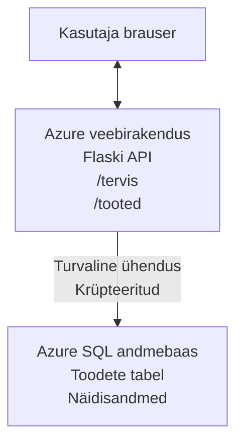

# Microsoft SQL andmebaasi ja veebiäpi levitamine AZD abil

⏱️ **Hinnanguline aeg**: 20-30 minutit | 💰 **Hinnanguline maksumus**: ~$15-25/kuus | ⭐ **Tasemel keerukus**: Keskmine

See **täielik, töökindel näide** demonstreerib, kuidas kasutada [Azure Developer CLI (azd)](https://learn.microsoft.com/azure/developer/azure-developer-cli/) Python Flask veebirakenduse levitamiseks Microsoft SQL andmebaasiga Azure’is. Kõik kood on kaasatud ja testitud—väliseid sõltuvusi pole vaja.

## Mida Sa Õpid

Selle näite lõpetades:
- Teed mitmekihilise rakenduse (veebiäpp + andmebaas) levituse infrastruktuuri kui koodi abil
- Konfigureerid turvalised andmebaasiühendused ilma saladuste kõvakodeerimiseta
- Jälgid rakenduse tervist rakenduse Insightsiga
- Halad Azure ressursse AZD käsurea tööriistaga tõhusalt
- Järgida Azure parimaid tavasid turvalisuse, kulude optimeerimise ja jälgitavuse osas

## Stsenaariumi Ülevaade
- **Veebiäpp**: Python Flask REST API andmebaasiühendusega
- **Andmebaas**: Azure SQL andmebaas näidisandmetega
- **Infrastruktuur**: Provisioneeritud Bicepiga (moodulipõhised, taaskasutatavad mallid)
- **Levitamine**: Täielikult automatiseeritud `azd` käskudega
- **Jälgimine**: Application Insights logide ja telemeetriaga

## Eeltingimused

### Vajalikud Tööriistad

Enne alustamist veendu, et järgnevad tööriistad on installitud:

1. **[Azure CLI](https://learn.microsoft.com/cli/azure/install-azure-cli)** (versioon 2.50.0 või uuem)
   ```sh
   az --version
   # Oodatav väljund: azure-cli 2.50.0 või uuem
   ```

2. **[Azure Developer CLI (azd)](https://learn.microsoft.com/azure/developer/azure-developer-cli/install-azd)** (versioon 1.0.0 või uuem)
   ```sh
   azd version
   # Oodatav väljund: azd versioon 1.0.0 või uuem
   ```

3. **[Python 3.8+](https://www.python.org/downloads/)** (kohalikuks arenduseks)
   ```sh
   python --version
   # Oodatav väljund: Python 3.8 või uuem
   ```

4. **[Docker](https://www.docker.com/get-started)** (valikuline, kohalikuks konteineripõhiseks arenduseks)
   ```sh
   docker --version
   # Oodatav väljund: Docker versioon 20.10 või uuem
   ```

### Azure Nõuded

- Aktiivne **Azure tellimus** ([loo tasuta konto](https://azure.microsoft.com/free/))
- Õigused luua ressursse oma tellimusse
- **Omaniku** või **kaastöötaja** roll tellimuse või ressursigrupi tasemel

### Teadmiste Eeltingimused

See on **kesktaseme** näide. Tuleb olla tuttav:
- Põhiliste käsurea toimingutega
- Pilve alusterminoloogiaga (ressursid, ressursigrupid)
- Veebirakenduste ja andmebaaside baasteadmistega

**Sa oled AZD uus?** Alusta esmalt [Sissejuhatuse juhendist](../../docs/chapter-01-foundation/azd-basics.md).

## Arhitektuur

See näide levitab kahte taset koos veebirakenduse ja SQL andmebaasiga:


**Ressursi levitus:**
- **Ressursigrupp**: Kõigi ressursside konteiner
- **App Service plaan**: Linuxil põhinev majutus (B1 virnast kuluefektiivseks)
- **Veebiäpp**: Python 3.11 runtime Flask rakendusega
- **SQL server**: Hallatav andmebaasi server TLS 1.2 või uuema minimaalne tugi
- **SQL andmebaas**: Basic virn (2 GB, sobib arenduseks/testimiseks)
- **Application Insights**: Jälgimine ja logimine
- **Log Analytics tööala**: Keskne logide hoiustamine

**Analooogia**: Kujuta ette restorani (veebiäpp) koos sisseehitatud külmkambriga (andmebaas). Kliendid tellivad menüüst (API lõpp-punktid) ja köök (Flask rakendus) võtab külmkambrist koostisosad (andmed). Restorani juht (Application Insights) jälgib kõike, mis toimub.

## Kaustastruktuur

Kõik failid on selles näites kaasatud—väliseid sõltuvusi pole vaja:

```
examples/database-app/
│
├── README.md                    # This file
├── azure.yaml                   # AZD configuration file
├── .env.sample                  # Sample environment variables
├── .gitignore                   # Git ignore patterns
│
├── infra/                       # Infrastructure as Code (Bicep)
│   ├── main.bicep              # Main orchestration template
│   ├── abbreviations.json      # Azure naming conventions
│   └── resources/              # Modular resource templates
│       ├── sql-server.bicep    # SQL Server configuration
│       ├── sql-database.bicep  # Database configuration
│       ├── app-service-plan.bicep  # Hosting plan
│       ├── app-insights.bicep  # Monitoring setup
│       └── web-app.bicep       # Web application
│
└── src/
    └── web/                    # Application source code
        ├── app.py              # Flask REST API
        ├── requirements.txt    # Python dependencies
        └── Dockerfile          # Container definition
```

**Mis iga fail teeb:**
- **azure.yaml**: Määrab AZD-le, mida ja kuhu levitada
- **infra/main.bicep**: Koordineerib kõiki Azure ressursse
- **infra/resources/*.bicep**: Individuaalsed ressurside definitsioonid (moodulid taaskasutuseks)
- **src/web/app.py**: Flask rakendus andmebaasi loogikaga
- **requirements.txt**: Pythoni paketisõltuvused
- **Dockerfile**: Konteineriseerimise juhised levitamiseks

## Kiire algus (samm-sammult)

### Samm 1: Kopeeri ja liigu kataloogi

```sh
git clone https://github.com/microsoft/AZD-for-beginners.git
cd AZD-for-beginners/examples/database-app
```

**✓ Edu Kontroll**: Veendu, et näed faile `azure.yaml` ja kausta `infra/`:
```sh
ls
# Oodatud: README.md, azure.yaml, infra/, src/
```

### Samm 2: Autentimine Azure’iga

```sh
azd auth login
```

See avab su brauseri Azure autentimiseks. Logi sisse oma Azure andmetega.

**✓ Edu Kontroll**: Pead nägema:
```
Logged in to Azure.
```

### Samm 3: Keskkonna initsialiseerimine

```sh
azd init
```

**Mis toimub**: AZD loob kohaliku konfiguratsiooni su levituseks.

**Küsitakse:**
- **Keskkonna nimi**: Sisesta lühike nimi (nt `dev`, `myapp`)
- **Azure tellimus**: Vali tellimus nimekirjast
- **Azure regioon**: Vali regioon (nt `eastus`, `westeurope`)

**✓ Edu Kontroll**: Pead nägema:
```
SUCCESS: New project initialized!
```

### Samm 4: Azure ressursside loomine

```sh
azd provision
```

**Mis toimub**: AZD levitab kogu infrastruktuuri (kestab 5-8 minutit):
1. Loob ressursigrupi
2. Loob SQL serveri ja andmebaasi
3. Loob App Service plaani
4. Loob veebiäpi
5. Loob Application Insightsi
6. Konfigureerib võrgustiku ja turvalisuse

**Küsitakse:**
- **SQL admin kasutajanimi**: Sisesta kasutajanimi (nt `sqladmin`)
- **SQL admin parool**: Sisesta tugev parool (salvesta see!)

**✓ Edu Kontroll**: Pead nägema:
```
SUCCESS: Your application was provisioned in Azure in X minutes Y seconds.
You can view the resources created under the resource group rg-<env-name> in Azure Portal:
https://portal.azure.com/#@/resource/subscriptions/.../resourceGroups/rg-<env-name>
```

**⏱️ Aeg**: 5-8 minutit

### Samm 5: Rakenduse levitamine

```sh
azd deploy
```

**Mis toimub**: AZD koostab ja levitab su Flask rakenduse:
1. Paketib Pythoni rakenduse
2. Koostab Docker konteineri
3. Lõhub Azure Web Äppi
4. Algatab andmebaasi näidisandmetega
5. Käivitab rakenduse

**✓ Edu Kontroll**: Pead nägema:
```
SUCCESS: Your application was deployed to Azure in X minutes Y seconds.
You can view the resources created under the resource group rg-<env-name> in Azure Portal:
https://portal.azure.com/#@/resource/subscriptions/.../resourceGroups/rg-<env-name>
```

**⏱️ Aeg**: 3-5 minutit

### Samm 6: Rakenduse sirvimine brauseris

```sh
azd browse
```

See avab su levitatud veebiäpi brauseris aadressil `https://app-<unique-id>.azurewebsites.net`

**✓ Edu Kontroll**: Pead nägema JSON väljundit:
```json
{
  "message": "Welcome to the Database App API",
  "endpoints": {
    "/": "This help message",
    "/health": "Health check endpoint",
    "/products": "List all products",
    "/products/<id>": "Get product by ID"
  }
}
```

### Samm 7: API lõpp-punktide testimine

**Tervisekontroll** (kontrollib andmebaasiühendust):
```sh
curl https://app-<your-id>.azurewebsites.net/health
```

**Oodatud vastus**:
```json
{
  "status": "healthy",
  "database": "connected"
}
```

**Toodete nimekiri** (näidisandmed):
```sh
curl https://app-<your-id>.azurewebsites.net/products
```

**Oodatud vastus**:
```json
[
  {
    "id": 1,
    "name": "Laptop",
    "description": "High-performance laptop",
    "price": 1299.99,
    "created_at": "2025-11-19T10:30:00"
  },
  ...
]
```

**Ühe toote päring**:
```sh
curl https://app-<your-id>.azurewebsites.net/products/1
```

**✓ Edu Kontroll**: Kõik lõpp-punktid tagastavad JSON andmeid ilma vigadeta.

---

**🎉 Palju õnne!** Sa oled edukalt levitanud veebiäpi koos andmebaasiga Azures AZD abil.

## Konfiguratsiooni süvaanalüüs

### Keskkonnamuutujad

Saladused on turvaliselt hallatud Azure App Service konfiguratsiooni kaudu—**mitte kunagi kõvakodeeritud lähtekoodis**.

**AZD konfigureerib automaatselt:**
- `SQL_CONNECTION_STRING`: Andmebaasi ühendus krüpteeritud andmetega
- `APPLICATIONINSIGHTS_CONNECTION_STRING`: Jälgimise telemeetri aadress
- `SCM_DO_BUILD_DURING_DEPLOYMENT`: Automaatse sõltuvuste paigalduse lubamine

**Kus saladused hoitakse:**
1. `azd provision` ajal sisestad SQL mandaadid turvaliste promptide abil
2. AZD salvestab need su kohalikku `.azure/<env-name>/.env` faili (ignoreeritud Git’is)
3. AZD süstib need Azure App Service konfiguratsiooni (krüpteeritult salvestatult)
4. Rakendus loeb neid `os.getenv()` kaudu jooksuajal

### Kohalik arendus

Kohaliku testimise jaoks loo `.env` fail näidisfailist:

```sh
cp .env.sample .env
# Muutke .env faili oma kohaliku andmebaasi ühenduse andmetega
```

**Kohaliku arenduse töövoog**:
```sh
# Paigalda sõltuvused
cd src/web
pip install -r requirements.txt

# Sea keskkonnamuutujad
export SQL_CONNECTION_STRING="your-local-connection-string"

# Käivita rakendus
python app.py
```

**Teste kohapeal**:
```sh
curl http://localhost:8000/health
# Oodatud: {"status": "terve", "andmebaas": "ühendatud"}
```

### Infrastruktuur kui Kood

Kõik Azure ressursid on määratletud **Bicep mallides** (`infra/` kaust):

- **Moodulipõhine disain**: Igal ressursitüübil oma fail taaskasutuseks
- **Parameetriseeritud**: SKU-d, regioonid, nimekonventsioonid kohandatavad
- **Parimad tavad**: Järgib Azure nime- ja turvastandardeid
- **Versioonikontroll**: Infrastruktuur muudatused jälgitakse Gitis

**Kohandamise näide**:
Andmebaasi tüki muutmiseks muuda `infra/resources/sql-database.bicep` faili:
```bicep
sku: {
  name: 'Standard'  // Changed from 'Basic'
  tier: 'Standard'
  capacity: 10
}
```

## Turvalisuse parimad tavad

See näide järgib Azure turvalisuse parimaid tavasid:

### 1. **Ei saladusi lähtekoodis**
- ✅ Mandaadid salvestatud Azure App Service konfiguratsioonis (krüpteeritud)
- ✅ `.env` failid jäetud Git’is ignoreerimiseks `.gitignore` abil
- ✅ Saladused edastatakse turvaliste parameetritena provisioneerimisel

### 2. **Krüpteeritud ühendused**
- ✅ SQL Server TLS 1.2 minimaalne tugi
- ✅ Veebirakendus lubab ainult HTTPS teenindust
- ✅ Andmebaasiühendused kasutavad krüpteeritud kanaleid

### 3. **Võrguturvalisus**
- ✅ SQL Serveri tulemüür lubab ligipääsu ainult Azure teenustele
- ✅ Avalik võrguliiklus piiratud (võimalik täiendav piirang Privaatsete Lõpp-punktide kaudu)
- ✅ Veebiäpis on FTPS keelatud

### 4. **Autentimine ja autoriseerimine**
- ⚠️ **Praegu**: SQL autentimine (kasutajanimi/parool)
- ✅ **Tootmiskeskkonnas soovitatav**: Kasutada Azure Hallatavat Identiteeti paroolivabaks autentimiseks

**Hallatavale identiteedile üleminek** (tootmises):
1. Luba hallatav identiteet veebiäpil
2. Anna identiteedile SQL õigused
3. Värskenda ühendusstring, et kasutada hallatavat identiteeti
4. Eemalda paroolipõhine autentimine

### 5. **Audit ja vastavus**
- ✅ Application Insights logib kõik päringud ja vead
- ✅ SQL andmebaasi audit lubatud (vastavuseks konfigureeritav)
- ✅ Kõik ressursid on märgistatud halduseks

**Turvalisuse kontrollnimekiri enne tootmisse minekut**:
- [ ] Luba Azure Defender SQL jaoks
- [ ] Konfigureeri Privaatsed Lõpp-punktid SQL andmebaasile
- [ ] Luba Veebi Rakenduse Tulemüür (WAF)
- [ ] Kasuta Azure Key Vault saladuste pööramiseks
- [ ] Luba Azure AD autentimine
- [ ] Luba diagnostikalogimine kõigile ressurssidele

## Kulude optimeerimine

**Hinnangulised kuukulud** (seisuga november 2025):

| Ressurss | SKU/Virn | Hinnanguline maksumus |
|----------|----------|----------------------|
| App Service plaan | B1 (Basic) | ~$13/kuus |
| SQL andmebaas | Basic (2GB) | ~$5/kuus |
| Application Insights | Maksa vastavalt kasutusele | ~$2/kuus (madal liiklus) |
| **Kokku** | | **~$20/kuus** |

**💡 Kulu kokkuhoiu nipid**:

1. **Kasutage õppimiseks tasuta virna**:
   - App Service: F1 virn (tasuta, piiratud tunnid)
   - SQL andmebaas: Kasuta Azure serverless SQL andmebaasi
   - Application Insights: 5GB/kuu tasuta andmete sissetoomine

2. **Peata ressursid, kui neid ei kasutata**:
   ```sh
   # Peata veebirakendus (andmebaas kannab siiski kulusid)
   az webapp stop --name <app-name> --resource-group <rg-name>
   
   # Taaskäivita vastavalt vajadusele
   az webapp start --name <app-name> --resource-group <rg-name>
   ```

3. **Kustuta kõik pärast testimist**:
   ```sh
   azd down
   ```
   See kustutab KÕIK ressursid ja lõpetab kulutused.

4. **Arenduse ja tootmise SKU-d**:
   - **Arendus**: Basic virn (kasutatakse selles näites)
   - **Tootmine**: Standard/Premium virn, süsteemsuse ja redundantsusega

**Kulude jälgimine**:
- Vaata kulusid [Azure Cost Management](https://portal.azure.com/#view/Microsoft_Azure_CostManagement)
- Sea sisse kuluhäired, et vältida ootamatuid arveid
- Märgista kõik ressursid `azd-env-name` sildiga jälgimiseks

**Tasuta virna alternatiiv**:
Õppimise eesmärgil saad muuta faili `infra/resources/app-service-plan.bicep`:
```bicep
sku: {
  name: 'F1'  // Free tier
  tier: 'Free'
}
```
**Märkus**: Tasuta virnal on piirangud (60 minutit päevas CPU, puudub always-on).

## Jälgimine ja jälgitavus

### Application Insightsi integreerimine

See näide sisaldab **Application Insightsi** põhjalikku jälgimist:

**Jälgimisel**:
- ✅ HTTP päringud (latentsus, olekukoodid, lõpp-punktid)
- ✅ Rakenduse vead ja erandid
- ✅ Kohandatud logimine Flask rakendusest
- ✅ Andmebaasiühenduse tervis
- ✅ Jõudlusnäitajad (CPU, mälukasutus)

**Kuidas pääseda Application Insightsile:**
1. Ava [Azure Portaal](https://portal.azure.com)
2. Liigu oma ressursigrupi juurde (`rg-<env-name>`)
3. Klõpsa Application Insights ressursil (`appi-<unique-id>`)

**Kasulikud päringud** (Application Insights → Logid):

**Kõigi päringute vaatamine**:
```kusto
requests
| where timestamp > ago(1h)
| order by timestamp desc
| project timestamp, name, url, resultCode, duration
```

**Vigade leidmine**:
```kusto
exceptions
| where timestamp > ago(24h)
| order by timestamp desc
| project timestamp, type, outerMessage, operation_Name
```

**Tervise lõpp-punkti kontroll**:
```kusto
requests
| where name contains "health"
| summarize count() by resultCode, bin(timestamp, 1h)
```

### SQL andmebaasi audit

**SQL andmebaasi audit lubatud**, et jälgida:
- Andmebaasi kasutusmustreid
- Ebaõnnestunud sisselogimiskatseid
- Skeemi muudatusi
- Andmete ligipääsu (vastavuse tagamiseks)

**Juhtpaneeli logid**:
1. Azure Portaal → SQL andmebaas → Audit
2. Vaata logisid Log Analytics tööalas

### Reaalajas jälgimine

**Vaata elavaid mõõdikuid**:
1. Application Insights → Live Metrics
2. Vaata päringuid, ebaõnnestumisi ja jõudlust reaalajas

**Häirete seadistamine**:
Loo häired kriitiliste sündmuste jaoks:
- HTTP 500 vead > 5 5 minuti jooksul
- Andmebaasiühenduse katkestused
- Kõrged vastuseajad (>2 sekundit)

**Näide häirete loomisest**:
```sh
az monitor metrics alert create \
  --name "High-Response-Time" \
  --resource-group <rg-name> \
  --scopes <app-insights-resource-id> \
  --condition "avg requests/duration > 2000" \
  --description "Alert when response time exceeds 2 seconds"
```

## Probleemide lahendamine
### Levinumad probleemid ja lahendused

#### 1. `azd provision` nurjub veaga "Asukoht pole saadaval"

**Sümptom**:  
```
Error: The subscription is not registered for the resource type 'components' in the location 'centralus'.
```
  
**Lahendus**:  
Vali mõni teine Azure piirkond või registreeri ressursipakkuja:  
```sh
az provider register --namespace Microsoft.Insights
```
  
#### 2. SQL-ühendus ebaõnnestub juurutamise ajal

**Sümptom**:  
```
pyodbc.OperationalError: ('08001', '[08001] [Microsoft][ODBC Driver 18 for SQL Server]TCP Provider...')
```
  
**Lahendus**:  
- Kontrolli, et SQL Serveri tulemüür lubab Azure teenuseid (konfigureeritakse automaatselt)  
- Veendu, et SQL administraatori parool sisestati `azd provision` ajal õigesti  
- Veendu, et SQL Server on täielikult juurutatud (võib võtta 2-3 minutit)  

**Ühenduse kontrollimine**:  
```sh
# Azure'i portaalist minge SQL andmebaasi → Päringu redaktorisse
# Proovige oma mandaadiga ühenduda
```
  
#### 3. Veebirakendus kuvab "Rakenduse viga"

**Sümptom**:  
Brauser kuvab üldist veateadet.

**Lahendus**:  
Kontrolli rakenduse logisid:  
```sh
# Vaata viimaseid logisid
az webapp log tail --name <app-name> --resource-group <rg-name>
```
  
**Levinumad põhjused**:  
- Puuduvad keskkonnamuutujad (kontrolli App Service → Configuration)  
- Python-paketi paigaldus ebaõnnestus (kontrolli juurutuslogisid)  
- Andmebaasi algatamise viga (kontrolli SQL-ühenduvust)  

#### 4. `azd deploy` nurjub veaga "Build Error"

**Sümptom**:  
```
Error: Failed to build project
```
  
**Lahendus**:  
- Veendu, et `requirements.txt` failis pole süntaksi vigu  
- Kontrolli, et Python 3.11 on määratud failis `infra/resources/web-app.bicep`  
- Kontrolli, et Dockerfile kasutab õiget baaspilti  

**Silumine lokaalselt**:  
```sh
cd src/web
docker build -t test-app .
docker run -p 8000:8000 test-app
```
  
#### 5. "Volitamata" AZD käskude käivitamisel

**Sümptom**:  
```
ERROR: (Unauthorized) The client '<id>' with object id '<id>' does not have authorization
```
  
**Lahendus**:  
Logi Azure keskkonda uuesti sisse:  
```sh
# Nõutav AZD töövoogude jaoks
azd auth login

# Valikuline, kui kasutate ka Azure CLI käske otse
az login
```
  
Veendu, et sul on õige õiguste tase (Contributor roll) tellimuses.

#### 6. Kõrged andmebaasi kulud

**Sümptom**:  
Ootamatu Azure arve.

**Lahendus**:  
- Kontrolli, kas unustasid pärast testimist käivitada `azd down`  
- Veendu, et SQL andmebaas kasutab Basic taset (mitte Premium)  
- Vaata kulusid Azure Cost Managementis üle  
- Seadista kuluhoiatused  

### Abi saamine

**Vaata kõiki AZD keskkonnamuutujaid**:  
```sh
azd env get-values
```
  
**Kontrolli juurutamise staatust**:  
```sh
az webapp show --name <app-name> --resource-group <rg-name> --query state
```
  
**Juurdepääs rakenduse logidele**:  
```sh
az webapp log download --name <app-name> --resource-group <rg-name> --log-file app-logs.zip
```
  
**Vajate rohkem abi?**  
- [AZD tõrkeotsingu juhend](../../docs/chapter-07-troubleshooting/common-issues.md)  
- [Azure App Service tõrkeotsing](https://learn.microsoft.com/azure/app-service/troubleshoot-diagnostic-logs)  
- [Azure SQL tõrkeotsing](https://learn.microsoft.com/azure/azure-sql/database/troubleshoot-common-errors-issues)  

## Praktilised harjutused

### Harjutus 1: Kontrolli oma juurutust (Algaja)

**Eesmärk**: Kinnita, et kõik ressursid on juurutatud ja rakendus töötab.

**Sammud**:  
1. Kuva kõik ressursid oma ressursigrupis:  
   ```sh
   az resource list --resource-group rg-<env-name> --output table
   ```
   **Oodatud**: 6–7 ressurssi (Web App, SQL Server, SQL Database, App Service Plan, Application Insights, Log Analytics)

2. Testi kõiki API lõpp-punkte:  
   ```sh
   curl https://app-<your-id>.azurewebsites.net/
   curl https://app-<your-id>.azurewebsites.net/health
   curl https://app-<your-id>.azurewebsites.net/products
   curl https://app-<your-id>.azurewebsites.net/products/1
   ```
   **Oodatud**: Kõik tagastavad kehtiva JSONi vigadeta

3. Kontrolli Application Insights:  
   - Ava Azure portaalis Application Insights  
   - Mine "Live Metrics" lehele  
   - Värskenda oma brauseri vaadet veebirakenduses  
   **Oodatud**: Reaalajas ilmub päringute tegevus

**Edu kriteeriumid**: Kõik 6–7 ressurssi olemas, kõik lõpp-punktid tagastavad andmeid, Live Metrics näitab aktiivsust.

---

### Harjutus 2: Lisa uus API lõpp-punkt (Kesktase)

**Eesmärk**: Laienda Flaski rakendust uue lõpp-punktiga.

**Algkodeks**: Praegused lõpp-punktid failis `src/web/app.py`

**Sammud**:  
1. Muuda faili `src/web/app.py` ja lisa uus lõpp-punkt pärast `get_product()` funktsiooni:  
   ```python
   @app.route('/products/search/<keyword>')
   def search_products(keyword):
       """Search products by name or description."""
       try:
           conn = get_db_connection()
           cursor = conn.cursor()
           cursor.execute(
               "SELECT id, name, description, price, created_at FROM products WHERE name LIKE ? OR description LIKE ?",
               (f'%{keyword}%', f'%{keyword}%')
           )
           
           products = []
           for row in cursor.fetchall():
               products.append({
                   'id': row[0],
                   'name': row[1],
                   'description': row[2],
                   'price': float(row[3]) if row[3] else None,
                   'created_at': row[4].isoformat() if row[4] else None
               })
           
           cursor.close()
           conn.close()
           
           logger.info(f"Search for '{keyword}' returned {len(products)} results")
           return jsonify(products), 200
           
       except Exception as e:
           logger.error(f"Error searching products: {str(e)}")
           return jsonify({'error': str(e)}), 500
   ```
  
2. Juuruta uuendatud rakendus:  
   ```sh
   azd deploy
   ```
  
3. Testi uut lõpp-punkti:  
   ```sh
   curl https://app-<your-id>.azurewebsites.net/products/search/laptop
   ```
   **Oodatud**: Tagastab tooted, mis vastavad "laptop"

**Edu kriteeriumid**: Uus lõpp-punkt töötab, tagastab filtreeritud tulemused, ilmub Application Insights logides.

---

### Harjutus 3: Lisa jälgimine ja hoiatused (Edasijõudnud)

**Eesmärk**: Loo proaktiivne jälgimine ja hoiatused.

**Sammud**:  
1. Loo hoiatus HTTP 500 vigade jaoks:  
   ```sh
   # Hangi Application Insightsi ressursi ID
   AI_ID=$(az monitor app-insights component show \
     --app appi-<your-id> \
     --resource-group rg-<env-name> \
     --query id -o tsv)
   
   # Loo alarm
   az monitor metrics alert create \
     --name "High-Error-Rate" \
     --resource-group rg-<env-name> \
     --scopes $AI_ID \
     --condition "count requests/failed > 5" \
     --window-size 5m \
     --evaluation-frequency 1m \
     --description "Alert when >5 failed requests in 5 minutes"
   ```
  
2. Käivita hoiatus, põhjustades vigu:  
   ```sh
   # Taotlege mitteolemasolevat toodet
   for i in {1..10}; do curl https://app-<your-id>.azurewebsites.net/products/999; done
   ```
  
3. Kontrolli, kas hoiatus käivitati:  
   - Azure portaal → Alerts → Alert Rules  
   - Kontrolli oma e-kirja (kui seadistatud)  

**Edu kriteeriumid**: Hoiatusreegel on loodud, aktiveerub vigade korral, teavitused saadetakse.

---

### Harjutus 4: Andmebaasi skeemi muudatused (Edasijõudnud)

**Eesmärk**: Lisa uus tabel ja muuda rakendust selle kasutamiseks.

**Sammud**:  
1. Ühendu SQL andmebaasiga Azure portaali päringutoimetis

2. Loo uus tabel `categories`:  
   ```sql
   CREATE TABLE categories (
       id INT PRIMARY KEY IDENTITY(1,1),
       name NVARCHAR(50) NOT NULL,
       description NVARCHAR(200)
   );
   
   INSERT INTO categories (name, description) VALUES
   ('Electronics', 'Electronic devices and accessories'),
   ('Office Supplies', 'Office equipment and supplies');
   
   -- Add category to products table
   ALTER TABLE products ADD category_id INT;
   UPDATE products SET category_id = 1; -- Set all to Electronics
   ```
  
3. Lisa `src/web/app.py` ka kategooria info vastustesse

4. Juuruta ja testi

**Edu kriteeriumid**: Uus tabel olemas, tooted kuvavad kategooria infot, rakendus töötab endiselt.

---

### Harjutus 5: Rakenda vahemälu (Ekspert)

**Eesmärk**: Lisa Azure Redis Cache jõudluse parandamiseks.

**Sammud**:  
1. Lisa Redis Cache failis `infra/main.bicep`  
2. Uuenda `src/web/app.py`, et vahemällu salvestada tootepäringud  
3. Mõõda jõudluse paranemist Application Insights abil  
4. Võrdle vastuseaegu enne ja pärast vahemällu panekut

**Edu kriteeriumid**: Redis on juurutatud, vahemälu töötab, vastuseajad paranevad üle 50%.

**Vihje**: Alustamiseks vaata [Azure Cache for Redis dokumentatsiooni](https://learn.microsoft.com/azure/azure-cache-for-redis/).

---

## Puhastamine

Kulude vältimiseks kustuta kõik ressursid pärast lõpetamist:

```sh
azd down
```
  
**Kinnituse päring**:  
```
? Total resources to delete: 7, are you sure you want to continue? (y/N)
```
  
Sisesta `y`, et kinnitada.

**✓ Edu kontroll**:  
- Kõik ressursid on kustutatud Azure portaali kaudu  
- Pole jooksvaid kulusid  
- Kohalik `.azure/<env-name>` kaust võib kustutada  

**Alternatiiv** (säilita infrastruktuur, kustuta andmed):  
```sh
# Kustuta ainult ressursigrupi (hoia AZD konfiguratsiooni)
az group delete --name rg-<env-name> --yes
```
  
## Õpi rohkem

### Seotud dokumentatsioon  
- [Azure Developer CLI dokumentatsioon](https://learn.microsoft.com/azure/developer/azure-developer-cli/)  
- [Azure SQL Database dokumentatsioon](https://learn.microsoft.com/azure/azure-sql/database/)  
- [Azure App Service dokumentatsioon](https://learn.microsoft.com/azure/app-service/)  
- [Application Insights dokumentatsioon](https://learn.microsoft.com/azure/azure-monitor/app/app-insights-overview)  
- [Bicep keele viide](https://learn.microsoft.com/azure/azure-resource-manager/bicep/)  

### Edasised sammud selles kursuses  
- **[Container Apps näide](../../../../examples/container-app)**: Juuruta mikroteenuseid Azure Container Apps abil  
- **[AI integreerimise juhend](../../../../docs/ai-foundry)**: Lisa AI võimekused oma rakendusse  
- **[Juurutuse parimad tavad](../../docs/chapter-04-infrastructure/deployment-guide.md)**: Tootmisjuurutuse mallid  

### Täiustatud teemad  
- **Haldatud identiteet**: Eemalda paroolid ja kasuta Azure AD autentimist  
- **Privaatendpunktid**: Turvalised andmebaasi ühendused virtuaalses võrgus  
- **CI/CD integratsioon**: Automatiseeri juurutused GitHub Actions või Azure DevOps abil  
- **Mitmekeskkond**: Määra arendus-, test- ja tootmiskeskkonnad  
- **Andmebaasi migratsioonid**: Kasuta Alembicit või Entity Frameworki skeemiversioonide jaoks  

### Võrdlus teiste lähenemistega

**AZD vs. ARM mallid**:  
- ✅ AZD: Kõrgema taseme abstraktsioon, lihtsamad käsud  
- ⚠️ ARM: Detailsem, peenhäälestatud juhtimine  

**AZD vs. Terraform**:  
- ✅ AZD: Azure-loomuline, integreeritud Azure teenustega  
- ⚠️ Terraform: Mitme pilve tugi, suurem ökosüsteem  

**AZD vs. Azure portaal**:  
- ✅ AZD: Korduv, versioonihaldatav, automatiseeritav  
- ⚠️ Portaal: Käsitsi klõpsimine, keeruline korrata  

**Kujuta ette AZD-d nii nagu**: Docker Compose Azure jaoks — lihtsustatud konfiguratsioon keerukate juurutuste tarbeks.

---

## Korduma kippuvad küsimused

**K: Kas ma saan kasutada mõnda teist programmeerimiskeelt?**  
V: Jah! Asenda `src/web/` Node.js, C#, Go või mõne muu keelega. Uuenda `azure.yaml` ja Bicep faile vastavalt.

**K: Kuidas lisada rohkem andmebaase?**  
V: Lisa teine SQL Database moodul faili `infra/main.bicep` või kasuta PostgreSQL/MySQL teenuseid Azure Database sektsioonist.

**K: Kas seda saab kasutada tootmises?**  
V: See on lähtepunkt. Tootmises lisa: haldatud identiteet, privaatendpunktid, kõrge saadavus, varundusstrateegia, WAF ja täiustatud jälgimine.

**K: Mis siis, kui tahan konteinerite asemel kasutada koodi juurutamist?**  
V: Vaata [Container Apps näidet](../../../../examples/container-app), mis kasutab kogu ulatuses Docker konteinerid.

**K: Kuidas ühendada andmebaasiga oma lokaalselt arvutist?**  
V: Lisa oma IP aadress SQL Serveri tulemüüri:  
```sh
az sql server firewall-rule create \
  --resource-group rg-<env-name> \
  --server sql-<unique-id> \
  --name AllowMyIP \
  --start-ip-address <your-ip> \
  --end-ip-address <your-ip>
```
  
**K: Kas ma saan kasutada olemasolevat andmebaasi uue loomise asemel?**  
V: Jah, muuda `infra/main.bicep`, et viidata olemasolevale SQL Serverile ja uuenda ühenduse stringi parameetreid.

---

> **Märkus:** See näide demonstreerib parimaid praktikaid veebirakenduse juurutamisel andmebaasiga kasutades AZD-d. Sisaldab töökindlat koodi, põhjalikku dokumentatsiooni ja praktilisi harjutusi õppimise toetamiseks. Tootmisjuurutuste puhul vaata hoolikalt üle organisatsiooni spetsiifilised turbe-, skalatsiooni-, nõuete ja kulude seadistused.

**📚 Kursuse navigeerimine:**  
- ← Eelmine: [Container Apps näide](../../../../examples/container-app)  
- → Järgmine: [AI integreerimise juhend](../../../../docs/ai-foundry)  
- 🏠 [Kursuse avaleht](../../README.md)

---

<!-- CO-OP TRANSLATOR DISCLAIMER START -->
**Vastutusest loobumine**:
See dokument on tõlgitud kasutades tehisintellektil põhinevat tõlketeenust [Co-op Translator](https://github.com/Azure/co-op-translator). Kuigi püüame tagada täpsust, palun arvestage, et automaatsed tõlked võivad sisaldada vigu või ebatäpsusi. Originaaldokument selle emakeeles tuleks pidada autoriteetseks allikaks. Olulise teabe puhul soovitatakse kasutada professionaalset inimtõlget. Me ei vastuta selle tõlke kasutamisest tulenevate arusaamatuste või valesti mõistmiste eest.
<!-- CO-OP TRANSLATOR DISCLAIMER END -->