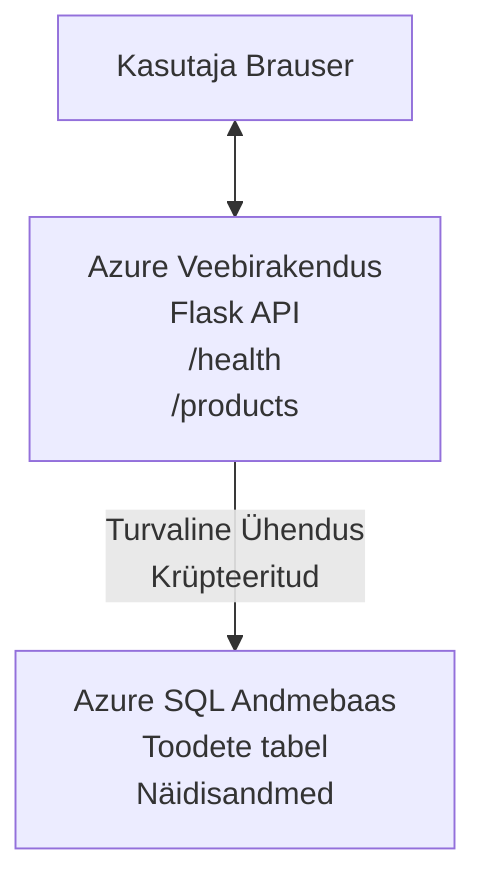

# Microsoft SQL andmebaasi ja veebirakenduse juurutamine AZD-ga

⏱️ **Hinnanguline aeg**: 20–30 minutit | 💰 **Hinnanguline maksumus**: umbes $15–25 kuus | ⭐ **Tasemeks**: Kesktase

See **täielik, töötav näide** näitab, kuidas kasutada [Azure Developer CLI-d (azd)](https://learn.microsoft.com/azure/developer/azure-developer-cli/) Python Flask veebirakenduse ja Microsoft SQL andmebaasi juurutamiseks Azure’i. Kõik koodid on kaasas ja testitud – väliseid sõltuvusi pole vaja.

## Mida sa õpid

Selle näite lõpuleviimisel:

- Juurutad mitmekihilise rakenduse (veebirakendus + andmebaas) infrastruktuuri-koodina
- Seadistad turvalised andmebaasiühendused ilma saladusi kõvakodeerimata
- Jälgid rakenduse tervist Application Insightsi abil
- Halda Azure ressursse tõhusalt AZD CLI-ga
- Järgid Azure’i parimaid tavasid turvalisuse, kulude optimeerimise ja jälgitavuse osas

## Stsenaarium

- **Veebirakendus**: Python Flask REST API koos andmebaasiühendusega
- **Andmebaas**: Azure SQL andmebaas näidandmetega
- **Infrastruktuur**: Provisioneeritud Bicep-iga (moodulite ja taaskasutusega mallid)
- **Juurutamine**: Täielikult automatiseeritud `azd` käskudega
- **Jälgimine**: Application Insights logide ja telemeetriaga

## Eeldused

### Vajalikud tööriistad

Enne alustamist veendu, et sul on need tööriistad paigaldatud:

1. **[Azure CLI](https://learn.microsoft.com/cli/azure/install-azure-cli)** (versioon 2.50.0 või uuem)
   ```sh
   az --version
   # Eeldatav väljund: azure-cli 2.50.0 või uuem
   ```

2. **[Azure Developer CLI (azd)](https://learn.microsoft.com/azure/developer/azure-developer-cli/install-azd)** (versioon 1.0.0 või uuem)
   ```sh
   azd version
   # Oodatav väljund: azd versioon 1.0.0 või uuem
   ```

3. **[Python 3.8+](https://www.python.org/downloads/)** (kohalikuks arenduseks)
   ```sh
   python --version
   # Oodatav väljund: Python 3.8 või uuem
   ```

4. **[Docker](https://www.docker.com/get-started)** (valikuline, kohalikuks konteineripõhiseks arenduseks)
   ```sh
   docker --version
   # Oodatav väljund: Dockeri versioon 20.10 või uuem
   ```

### Azure nõuded

- Aktiivne **Azure tellimus** ([lisa tasuta konto](https://azure.microsoft.com/free/))
- Õigused ressurside loomiseks oma tellimuses
- **Owner** või **Contributor** roll tellimuse või ressursigrupi osas

### Teadmised

See on **kesktaseme** näide. Soovitav on olla tuttav:

- Põhiliste käsurea toimingutega
- Pilve põhimõistetega (ressursid, ressursigrupid)
- Põhilised teadmised veebirakendustest ja andmebaasidest

**Uus AZD-s?** Alusta [Getting Started juhendist](../../docs/chapter-01-foundation/azd-basics.md).

## Arhitektuur

See näide juurutab kahekihilise arhitektuuri koos veebirakenduse ja SQL andmebaasiga:



**Ressursside juurutamine:**
- **Ressursigrupp**: Kõikide ressursside konteiner
- **App Service plaan**: Linuxi baasil hostimine (B1 kiht kulutõhususeks)
- **Veebirakendus**: Python 3.11 runtime Flask rakendusega
- **SQL server**: Hallatud andmebaasiserver TLS 1.2 minimaalselt
- **SQL andmebaas**: Basic kiht (2GB, arenduse/testimise jaoks sobiv)
- **Application Insights**: Jälgimine ja logimine
- **Log Analytics Workspace**: Keskne logide hoiustamine

**Analoogia**: Mõtle sellele nagu restoran (veebirakendus) koos külmhoonega (andmebaas). Kliendid tellivad menüüst (API lõpp-punktid), ja köök (Flask rakendus) võtab toorained (andmed) külmhoonest. Restorani juhataja (Application Insights) jälgib kõike, mis toimub.

## Kaustastruktuur

Kõik failid on selles näites kaasas – väliseid sõltuvusi ei ole:

```
examples/database-app/
│
├── README.md                    # This file
├── azure.yaml                   # AZD configuration file
├── .env.sample                  # Sample environment variables
├── .gitignore                   # Git ignore patterns
│
├── infra/                       # Infrastructure as Code (Bicep)
│   ├── main.bicep              # Main orchestration template
│   ├── abbreviations.json      # Azure naming conventions
│   └── resources/              # Modular resource templates
│       ├── sql-server.bicep    # SQL Server configuration
│       ├── sql-database.bicep  # Database configuration
│       ├── app-service-plan.bicep  # Hosting plan
│       ├── app-insights.bicep  # Monitoring setup
│       └── web-app.bicep       # Web application
│
└── src/
    └── web/                    # Application source code
        ├── app.py              # Flask REST API
        ├── requirements.txt    # Python dependencies
        └── Dockerfile          # Container definition
```

**Iga faili funktsioon:**
- **azure.yaml**: Ütleb AZD-le, mida ja kuhu juurutada
- **infra/main.bicep**: Koordineerib kõiki Azure ressursse
- **infra/resources/*.bicep**: Individuaalsed ressursside definitsioonid (moodulid taaskasutuseks)
- **src/web/app.py**: Flask rakendus andmebaasi loogikaga
- **requirements.txt**: Python pakettide sõltuvused
- **Dockerfile**: Juhised konteineriseerimiseks juurutamisel

## Kiirstart (Samm-sammult)

### Samm 1: Kloneeri ja liigu kausta

```sh
git clone https://github.com/microsoft/AZD-for-beginners.git
cd AZD-for-beginners/examples/database-app
```

**✓ Edu kontroll**: Veendu, et näed `azure.yaml` ja `infra/` kausta:
```sh
ls
# Oodatud: README.md, azure.yaml, infra/, src/
```

### Samm 2: Autentimine Azure’i kaudu

```sh
azd auth login
```

See avab sinu brauseri Azure autentimiseks. Logi sisse oma Azure kontoga.

**✓ Edu kontroll**: Peaksid nägema:
```
Logged in to Azure.
```

### Samm 3: Keskkonna initsialiseerimine

```sh
azd init
```

**Mis juhtub**: AZD loob kohalikku konfiguratsiooni sinu juurutamiseks.

**Küsimused, mida näed**:
- **Keskkonna nimi**: Sisesta lühike nimi (nt `dev`, `myapp`)
- **Azure tellimus**: Vali tellimus nimekirjast
- **Azure asukoht**: Vali regioon (nt `eastus`, `westeurope`)

**✓ Edu kontroll**: Peaksid nägema:
```
SUCCESS: New project initialized!
```

### Samm 4: Azure ressursside provisioneerimine

```sh
azd provision
```

**Mis juhtub**: AZD juurutab kogu infrastruktuuri (võtab 5–8 minutit):
1. Loob ressursigrupi
2. Loob SQL serveri ja andmebaasi
3. Loob App Service plaani
4. Loob veebirakenduse
5. Loob Application Insightsi
6. Seadistab võrgu- ja turvakonfiguratsiooni

**Sind küsitakse:**
- **SQL administraatori kasutajanimi**: Sisesta kasutajanimi (nt `sqladmin`)
- **SQL administraatori parool**: Sisesta tugev parool (salvesta see!)

**✓ Edu kontroll**: Peaksid nägema:
```
SUCCESS: Your application was provisioned in Azure in X minutes Y seconds.
You can view the resources created under the resource group rg-<env-name> in Azure Portal:
https://portal.azure.com/#@/resource/subscriptions/.../resourceGroups/rg-<env-name>
```

**⏱️ Aeg**: 5–8 minutit

### Samm 5: Rakenduse juurutamine

```sh
azd deploy
```

**Mis juhtub**: AZD ehitab ja juurutab sinu Flask rakenduse:
1. Pakendab Python rakenduse
2. Ehitab Docker konteineri
3. Pushib selle Azure Web Appi
4. Algatab andmebaasi näidandmetega
5. Käivitab rakenduse

**✓ Edu kontroll**: Peaksid nägema:
```
SUCCESS: Your application was deployed to Azure in X minutes Y seconds.
You can view the resources created under the resource group rg-<env-name> in Azure Portal:
https://portal.azure.com/#@/resource/subscriptions/.../resourceGroups/rg-<env-name>
```

**⏱️ Aeg**: 3–5 minutit

### Samm 6: Veebirakenduse avamine

```sh
azd browse
```

See avab sinu juurutatud veebirakenduse brauseris aadressil `https://app-<unique-id>.azurewebsites.net`

**✓ Edu kontroll**: Peaksid nägema JSON-väljundit:
```json
{
  "message": "Welcome to the Database App API",
  "endpoints": {
    "/": "This help message",
    "/health": "Health check endpoint",
    "/products": "List all products",
    "/products/<id>": "Get product by ID"
  }
}
```

### Samm 7: API lõpp-punktide testimine

**Tervise kontroll** (kontrolli andmebaasiühendust):
```sh
curl https://app-<your-id>.azurewebsites.net/health
```

**Oodatud vastus**:
```json
{
  "status": "healthy",
  "database": "connected"
}
```

**Toodete nimekiri** (näidandmed):
```sh
curl https://app-<your-id>.azurewebsites.net/products
```

**Oodatud vastus**:
```json
[
  {
    "id": 1,
    "name": "Laptop",
    "description": "High-performance laptop",
    "price": 1299.99,
    "created_at": "2025-11-19T10:30:00"
  },
  ...
]
```

**Üksiku toote päring**:
```sh
curl https://app-<your-id>.azurewebsites.net/products/1
```

**✓ Edu kontroll**: Kõik lõpp-punktid tagastavad JSON andmeid veatult.

---

**🎉 Palju õnne!** Sa oled edukalt juurutanud veebirakenduse koos andmebaasiga Azures AZD abil.

## Konfiguratsiooni detailid

### Keskkonnamuutujad

Saladused hallatakse turvaliselt Azure App Service konfiguratsiooni kaudu — **kunagi ei kõvakodeerita lähtekoodis**.

**AZD seadistab automaatselt:**
- `SQL_CONNECTION_STRING`: Andmebaasi ühendus krüpteeritud andmetega
- `APPLICATIONINSIGHTS_CONNECTION_STRING`: Jälgimise telemeetria endpoint
- `SCM_DO_BUILD_DURING_DEPLOYMENT`: Võimaldab automaatse sõltuvuste paigaldamise

**Kus saladused asuvad:**
1. `azd provision` ajal annad SQL volitused turvalistel promptidel
2. AZD salvestab need sinu kohalikku `.azure/<env-nimi>/.env` faili (git ignoreeritud)
3. AZD süstib need Azure App Service konfiguratsiooni (krüpteeritult)
4. Rakendus loeb neid `os.getenv()` abil runtime’is

### Kohalik arendus

Kohalikuks testimiseks loo `.env` fail näidiskoodist:

```sh
cp .env.sample .env
# Muuda .env oma lokaalse andmebaasi ühenduse jaoks
```

**Kohaliku arenduse töövoog**:
```sh
# Paigalda sõltuvused
cd src/web
pip install -r requirements.txt

# Määra keskkonnamuutujad
export SQL_CONNECTION_STRING="your-local-connection-string"

# Käivita rakendus
python app.py
```

**Testi kohalikult**:
```sh
curl http://localhost:8000/health
# Oodatud: {"status": "terve", "andmebaas": "ühendatud"}
```

### Infrastruktuur koodina

Kõik Azure ressursid on defineeritud **Bicep mallides** (`infra/` kaust):

- **Moodulipõhine disain**: Iga ressursitüüp oma failiga, taaskasutamiseks
- **Parameetriseeritud**: Customize SKU-d, regioonid, nimekonventsioonid
- **Parimad tavad**: Järgi Azure nimetamispõhimõtteid ning turvalisi vaikeseadeid
- **Versioonikontrollitud**: Infrastruktuuri muudatused Gitis

**Näide kohandamisest**:
Andmebaasi kihi muutmiseks muuda `infra/resources/sql-database.bicep` faili:
```bicep
sku: {
  name: 'Standard'  // Changed from 'Basic'
  tier: 'Standard'
  capacity: 10
}
```

## Turvalisuse parimad tavad

See näide järgib Azure turvalisuse parimaid tavasid:

### 1. **Saladused ei ole lähtekoodis**
- ✅ Volitused hoiustatakse krüpteeritult Azure App Service konfiguratsioonis
- ✅ `.env` failid on lisatud `.gitignore`-i
- ✅ Saladused edastatakse turvaliste parameetritena provisioneerimisel

### 2. **Krüpteeritud ühendused**
- ✅ SQL server nõuab TLS 1.2 minimaalset taset
- ✅ Veebirakenduse HTTPS-only aktiveeritud
- ✅ Andmebaasiühendused on krüpteeritud kanalites

### 3. **Võrgu turvalisus**
- ✅ SQL Serveri tulemüür on seadistatud lubama ainult Azure teenuseid
- ✅ Avalik võrgupääs on piiratud (saab täiendavalt lukustada privaatsete lõpp-punktidega)
- ✅ FTPS on veebirakenduses keelatud

### 4. **Autentimine ja volitamine**
- ⚠️ **Praegune**: SQL autentimine (kasutajanimi/parool)
- ✅ **Tootmissoovitus**: Kasuta Azure Managed Identity’d paroolivabaks autentimiseks

**Managed Identity peale üleminek** (tootmises):
1. Lülita sisse managed identity veebirakendusel
2. Anna selle identiteedi SQL õigused
3. Uuenda ühendusstring kasutama managed identity’d
4. Eemalda paroolipõhine autentimine

### 5. **Audit ja vastavus**
- ✅ Application Insights logib kõik päringud ja vead
- ✅ SQL andmebaasi auditimine on lubatud (saab seadistada vastavuseks)
- ✅ Kõik ressursid on märgistatud halduseks

**Turvakontroll tootmisesse minnes**:
- [ ] Lülita sisse Azure Defender SQL jaoks
- [ ] Seadista Private Endpoints SQL andmebaasile
- [ ] Lülita sisse Web Application Firewall (WAF)
- [ ] Kasuta Azure Key Vaulti saladuste halduseks
- [ ] Seadista Microsoft Entra ID autentimine
- [ ] Lülita sisse diagnostika logimine kõigi ressursside jaoks

## Kulu optimeerimine

**Hinnangulised kuukulud** (seisuga november 2025):

| Ressurss | SKU/Kiht | Hinnanguline kulu |
|----------|----------|------------------|
| App Service Plan | B1 (Basic) | umbes $13/kuus |
| SQL andmebaas | Basic (2GB) | umbes $5/kuus |
| Application Insights | Pay-as-you-go | umbes $2/kuus (madal liiklus) |
| **Kokku** | | **~$20/kuus** |

**💡 Kulu kokkuhoiuvõtted**:

1. **Õpi tasuta kihil:**
   - App Service: F1 kiht (tasuta, piiratud töötundidega)
   - SQL andmebaas: Kasuta Azure SQL serverless variant
   - Application Insights: 5GB kuus tasuta andmete vastuvõtu maht

2. **Peata ressursid, kui neid ei kasutata:**
   ```sh
   # Peata veebirakendus (andmebaas läheb endiselt tasu)
   az webapp stop --name <app-name> --resource-group <rg-name>
   
   # Taaskäivita vajadusel
   az webapp start --name <app-name> --resource-group <rg-name>
   ```

3. **Kustuta kõik pärast testimist:**
   ```sh
   azd down
   ```
   See eemaldab KÕIK ressursid ja peatab kulud.

4. **Arendus vs tootmise SKU-d:**
   - **Arendus**: Basic kiht (kasutatud selles näites)
   - **Tootmine**: Standard/Premium kiht koos redundantssusega

**Kulude jälgimine**:
- Vaata kulusid [Azure Cost Management](https://portal.azure.com/#view/Microsoft_Azure_CostManagement) kaudu
- Seadista kuluteavitused ootamatuste vältimiseks
- Märgista kõik ressursid `azd-env-nimi` sildiga jälgimiseks

**Tasuta kihi alternatiiv**:
Õppimiseks muuda `infra/resources/app-service-plan.bicep` faili:
```bicep
sku: {
  name: 'F1'  // Free tier
  tier: 'Free'
}
```
**Märkus**: Tasuta kiht on piiratud (60 minutit päevas CPU, alati sees ei tööta).

## Jälgimine ja jälgitavus

### Application Insights integratsioon

See näide sisaldab **Application Insightsi** terviklikuks jälgimiseks:

**Mida jälgitakse:**
- ✅ HTTP päringud (latentsus, staatuskoodid, lõpp-punktid)
- ✅ Rakenduse vead ja erandid
- ✅ Kohandatud logimine Flask rakendusest
- ✅ Andmebaasi ühenduse tervis
- ✅ Jõudluse mõõdikud (CPU, mälu)

**Application Insightsi avamine**:
1. Ava [Azure Portal](https://portal.azure.com)
2. Mine oma ressursigrupi juurde (`rg-<env-nimi>`)
3. Klõpsa Application Insights ressursil (`appi-<unique-id>`)

**Kasulikud päringud** (Application Insights → Logid):

**Kõik päringud**:
```kusto
requests
| where timestamp > ago(1h)
| order by timestamp desc
| project timestamp, name, url, resultCode, duration
```

**Veateated**:
```kusto
exceptions
| where timestamp > ago(24h)
| order by timestamp desc
| project timestamp, type, outerMessage, operation_Name
```

**Tervise lõpp-punkti kontroll**:
```kusto
requests
| where name contains "health"
| summarize count() by resultCode, bin(timestamp, 1h)
```

### SQL andmebaasi auditeerimine

**SQL andmebaasi auditeerimine on lubatud**, et jälgida:
- Andmebaasi ligipääsu mustrid
- Ebaõnnestunud sisselogimiskatsed
- Skeemi muudatused
- Andmete ligipääs (vastavuse tagamiseks)

**Auditilogide vaatamine**:
1. Azure Portal → SQL andmebaas → Auditeerimine
2. Vaata logisid Log Analytics workspace’is

### Reaalajas jälgimine

**Live Metricsi vaatamine**:
1. Application Insights → Live Metrics
2. Näed päringuid, tõrkeid ja jõudlust reaalajas

**Teavituste seadistamine**:
Loo hoiatused kriitiliste sündmuste jaoks:
- HTTP 500 vead > 5 5 minuti jooksul
- Andmebaasi ühenduse tõrked
- Kõrged reageerimisajad (>2 sekundit)

**Näide teavituse loomisest**:
```sh
az monitor metrics alert create \
  --name "High-Response-Time" \
  --resource-group <rg-name> \
  --scopes <app-insights-resource-id> \
  --condition "avg requests/duration > 2000" \
  --description "Alert when response time exceeds 2 seconds"
```

## Tõrkeotsing
### Levinumad probleemid ja lahendused

#### 1. `azd provision` ebaõnnestub veaga "Location not available"

**Sümptom**:
```
Error: The subscription is not registered for the resource type 'components' in the location 'centralus'.
```

**Lahendus**:
Vali mõni teine Azure piirkond või registreeri ressursi pakkuja:
```sh
az provider register --namespace Microsoft.Insights
```

#### 2. SQL-ühendus ebaõnnestub juurutamise ajal

**Sümptom**:
```
pyodbc.OperationalError: ('08001', '[08001] [Microsoft][ODBC Driver 18 for SQL Server]TCP Provider...')
```

**Lahendus**:
- Kontrolli, et SQL Serveri tulemüür lubaks Azure teenuseid (on automaatselt seadistatud)
- Veendu, et SQL administraatori parool sisestati õigesti `azd provision` ajal
- Veendu, et SQL Server on täielikult juurutatud (võib võtta 2-3 minutit)

**Ühenduse kontroll**:
```sh
# Azure portaali kaudu minge SQL andmebaasi → Päringuredaktor
# Proovige oma mandaate kasutades ühenduda
```

#### 3. Veebirakendus kuvab "Application Error"

**Sümptom**:
Brauser kuvab üldise vealehe.

**Lahendus**:
Kontrolli rakenduse logisid:
```sh
# Vaata hiljutisi logisid
az webapp log tail --name <app-name> --resource-group <rg-name>
```

**Levinud põhjused**:
- Puuduvad keskkonnamuutujad (kontrolli App Service → Configuration)
- Python pakettide paigaldamine ebaõnnestus (kontrolli juurutamise logisid)
- Andmebaasi initsialiseerimise viga (kontrolli SQL-ühendust)

#### 4. `azd deploy` ebaõnnestub veaga "Build Error"

**Sümptom**:
```
Error: Failed to build project
```

**Lahendus**:
- Veendu, et `requirements.txt` ei sisalda süntaksivigu
- Kontrolli, et Python 3.11 on määratud failis `infra/resources/web-app.bicep`
- Veendu, et Dockerfile kasutab õiget aluspilti

**Debugi kohapeal**:
```sh
cd src/web
docker build -t test-app .
docker run -p 8000:8000 test-app
```

#### 5. "Unauthorized" AZD käskude käivitamisel

**Sümptom**:
```
ERROR: (Unauthorized) The client '<id>' with object id '<id>' does not have authorization
```

**Lahendus**:
Logi Azure'i uuesti sisse:
```sh
# Nõutav AZD töövoogude jaoks
azd auth login

# Valikuline, kui kasutate ka Azure CLI käske otse
az login
```

Veendu, et sul on õige õigustega (Contributor roll) ligipääs tellimusele.

#### 6. Kõrged andmebaasi kulud

**Sümptom**:
Ootamatu Azure arve.

**Lahendus**:
- Kontrolli, kas unustasid pärast testimist käivitada `azd down`
- Veendu, et SQL andmebaas kasutab Basic taset (mitte Premium)
- Uuri kulusid Azure Cost Management'is
- Sea üles kuluteavitused

### Abi saamine

**Kuva kõik AZD keskkonnamuutujad**:
```sh
azd env get-values
```

**Kontrolli juurutamise olekut**:
```sh
az webapp show --name <app-name> --resource-group <rg-name> --query state
```

**Juurdepääs rakenduse logidele**:
```sh
az webapp log download --name <app-name> --resource-group <rg-name> --log-file app-logs.zip
```

**Vajate rohkem abi?**
- [AZD tõrkeotsingu juhend](../../docs/chapter-07-troubleshooting/common-issues.md)
- [Azure App Service tõrkeotsing](https://learn.microsoft.com/azure/app-service/troubleshoot-diagnostic-logs)
- [Azure SQL tõrkeotsing](https://learn.microsoft.com/azure/azure-sql/database/troubleshoot-common-errors-issues)

## Praktilised harjutused

### Harjutus 1: Kontrolli oma juurutamist (Algaja)

**Eesmärk**: Kinnita, et kõik ressursid on juurutatud ja rakendus töötab.

**Sammud**:
1. Loetle kõik ressursid oma ressursigrupis:
   ```sh
   az resource list --resource-group rg-<env-name> --output table
   ```
   **Ootuspärane**: 6-7 ressurssi (Web App, SQL Server, SQL Database, App Service Plan, Application Insights, Log Analytics)

2. Testi kõiki API otsapunkte:
   ```sh
   curl https://app-<your-id>.azurewebsites.net/
   curl https://app-<your-id>.azurewebsites.net/health
   curl https://app-<your-id>.azurewebsites.net/products
   curl https://app-<your-id>.azurewebsites.net/products/1
   ```
   **Ootuspärane**: Kõik tagastavad kehtiva JSONi ilma vigadeta

3. Kontrolli Application Insightsi:
   - Ava Azure portaalis Application Insights
   - Mine sektsiooni "Live Metrics"
   - Värskenda brauseri lehte veebirakenduses
   **Ootuspärane**: Päringud ilmuvad reaalajas

**Edu kriteeriumid**: Kõik 6-7 ressurssi on olemas, kõik otsapunktid tagastavad andmed, Live Metrics kuvab aktiivsust.

---

### Harjutus 2: Lisa uus API otsapunkt (Kesktase)

**Eesmärk**: Laienda Flaski rakendust uue otsapunktiga.

**Alguskood**: Praegused otsapunktid failis `src/web/app.py`

**Sammud**:
1. Muuda faili `src/web/app.py` ja lisa uus otsapunkt pärast `get_product()` funktsiooni:
   ```python
   @app.route('/products/search/<keyword>')
   def search_products(keyword):
       """Search products by name or description."""
       try:
           conn = get_db_connection()
           cursor = conn.cursor()
           cursor.execute(
               "SELECT id, name, description, price, created_at FROM products WHERE name LIKE ? OR description LIKE ?",
               (f'%{keyword}%', f'%{keyword}%')
           )
           
           products = []
           for row in cursor.fetchall():
               products.append({
                   'id': row[0],
                   'name': row[1],
                   'description': row[2],
                   'price': float(row[3]) if row[3] else None,
                   'created_at': row[4].isoformat() if row[4] else None
               })
           
           cursor.close()
           conn.close()
           
           logger.info(f"Search for '{keyword}' returned {len(products)} results")
           return jsonify(products), 200
           
       except Exception as e:
           logger.error(f"Error searching products: {str(e)}")
           return jsonify({'error': str(e)}), 500
   ```

2. Juuruta uuendatud rakendus:
   ```sh
   azd deploy
   ```

3. Testi uut otsapunkti:
   ```sh
   curl https://app-<your-id>.azurewebsites.net/products/search/laptop
   ```
   **Ootuspärane**: Tagastab tooted, mis vastavad märksõnale "laptop"

**Edu kriteeriumid**: Uus otsapunkt töötab, tagastab filtreeritud tulemused, kuvatakse Application Insights logides.

---

### Harjutus 3: Lisa monitooring ja teavitused (Kogenud)

**Eesmärk**: Sea üles äratused proaktiivseks jälgimiseks.

**Sammud**:
1. Loo äratus HTTP 500 vigade jaoks:
   ```sh
   # Hangi Application Insights ressursi ID
   AI_ID=$(az monitor app-insights component show \
     --app appi-<your-id> \
     --resource-group rg-<env-name> \
     --query id -o tsv)
   
   # Loo häire
   az monitor metrics alert create \
     --name "High-Error-Rate" \
     --resource-group rg-<env-name> \
     --scopes $AI_ID \
     --condition "count requests/failed > 5" \
     --window-size 5m \
     --evaluation-frequency 1m \
     --description "Alert when >5 failed requests in 5 minutes"
   ```

2. Käivita äratus põhjustades vigu:
   ```sh
   # Taotle mitteolevat toodet
   for i in {1..10}; do curl https://app-<your-id>.azurewebsites.net/products/999; done
   ```

3. Kontrolli, kas äratus käivitati:
   - Azure portaal → Alerts → Alert Rules
   - Kontrolli oma e-posti (kui konfigureeritud)

**Edu kriteeriumid**: Äratusreegel loodud, käivitub vigade korral, saadakse teavitusi.

---

### Harjutus 4: Andmebaasi skeemi muudatused (Kogenud)

**Eesmärk**: Lisa uus tabel ja muuda rakendust selle kasutamiseks.

**Sammud**:
1. Ühendu SQL andmebaasiga Azure portaali päringutoimetis

2. Loo uus tabel `categories`:
   ```sql
   CREATE TABLE categories (
       id INT PRIMARY KEY IDENTITY(1,1),
       name NVARCHAR(50) NOT NULL,
       description NVARCHAR(200)
   );
   
   INSERT INTO categories (name, description) VALUES
   ('Electronics', 'Electronic devices and accessories'),
   ('Office Supplies', 'Office equipment and supplies');
   
   -- Add category to products table
   ALTER TABLE products ADD category_id INT;
   UPDATE products SET category_id = 1; -- Set all to Electronics
   ```

3. Uuenda `src/web/app.py`, et vastustes oleks kategooria info

4. Juuruta ja testi

**Edu kriteeriumid**: Uus tabel olemas, tooted kuvavad kategooria infot, rakendus töötab endiselt.

---

### Harjutus 5: Rakenda vahemällu salvestamine (Ekspert)

**Eesmärk**: Lisa Azure Redis Cache jõudluse parandamiseks.

**Sammud**:
1. Lisa Redis Cache `infra/main.bicep` faili
2. Uuenda `src/web/app.py`, et vahemällu salvestada tootepäringuid
3. Mõõda jõudluse paranemist Application Insights abil
4. Võrdle vastuse kiirust enne ja pärast vahemällu salvestamist

**Edu kriteeriumid**: Redis on juurutatud, vahemällu salvestamine töötab, vastuste kiirus paraneb >50%.

**Vihje**: Alusta [Azure Cache for Redis dokumentatsioonist](https://learn.microsoft.com/azure/azure-cache-for-redis/).

---

## Puhastamine

Pidevate kulude vältimiseks kustuta kõik ressursid pärast lõpetamist:

```sh
azd down
```

**Kinnitusviip**:
```
? Total resources to delete: 7, are you sure you want to continue? (y/N)
```

Sisesta `y`, et kinnitada.

**✓ Edu kontroll**: 
- Kõik ressursid on kustutatud Azure portaalist
- Ei ole jooksvaid kulusid
- Kohalik `.azure/<env-name>` kaust võib olla kustutatud

**Alternatiiv** (hoia infrastruktuuri, kustuta andmed):
```sh
# Kustuta ainult ressursigrupp (hoia AZD konfiguratsiooni)
az group delete --name rg-<env-name> --yes
```
## Õpi rohkem

### Seotud dokumentatsioon
- [Azure Developer CLI dokumentatsioon](https://learn.microsoft.com/azure/developer/azure-developer-cli/)
- [Azure SQL andmebaasi dokumentatsioon](https://learn.microsoft.com/azure/azure-sql/database/)
- [Azure App Service dokumentatsioon](https://learn.microsoft.com/azure/app-service/)
- [Application Insights dokumentatsioon](https://learn.microsoft.com/azure/azure-monitor/app/app-insights-overview)
- [Bicep keele viide](https://learn.microsoft.com/azure/azure-resource-manager/bicep/)

### Järgmised sammud selles kursuses
- **[Container Apps näide](../../../../examples/container-app)**: Mikroteenuste juurutamine Azure Container Apps abil
- **[AI integratsiooni juhend](../../../../docs/ai-foundry)**: Lisa oma rakendusele tehisintellekti võimekused
- **[Juurutamise parimad praktikad](../../docs/chapter-04-infrastructure/deployment-guide.md)**: Tootmiskeskkonna juurutamise mustrid

### Täiustatud teemad
- **Halduse identiteet**: Eemalda salasõnad ja kasuta Microsoft Entra ID autentimist
- **Privaatotsapunktid**: Turvata andmebaasi ühendused virtuaalvõrgus
- **CI/CD integratsioon**: Automatiseeri juurutamine GitHub Actions või Azure DevOps abil
- **Mitme keskkonna tugi**: Sea üles arendus-, katsetus- ja tootmiskeskkonnad
- **Andmebaasi migratsioonid**: Kasuta Alembicit või Entity Frameworki skeemi versiooni haldamiseks

### Võrdlus teiste lähenemistega

**AZD vs. ARM mallid**:
- ✅ AZD: kõrgema taseme abstraktsioon, lihtsamad käsud
- ⚠️ ARM: pikem, detailsem kontroll

**AZD vs. Terraform**:
- ✅ AZD: Azure-spetsiifiline, integreeritud Azure teenustega
- ⚠️ Terraform: Mitme-pilve tugi, suurem ökosüsteem

**AZD vs. Azure portaal**:
- ✅ AZD: Korratav, versioonihaldatud, automatiseeritav
- ⚠️ Portaal: Käsitsi klikkimine, raske korrata

**Mõtle AZD-le nagu**: Docker Compose Azure jaoks – lihtsustatud konfiguratsioon keerukate juurutuste jaoks.

---

## Korduma kippuvad küsimused

**K: Kas ma saan kasutada mõnda teist programmeerimiskeelt?**  
V: Jah! Asenda `src/web/` Node.js, C#, Go või mõne muu keelega. Uuenda vastavalt `azure.yaml` ja Bicep faile.

**K: Kuidas lisada rohkem andmebaase?**  
V: Lisa teine SQL Database moodul `infra/main.bicep` faili või kasuta PostgreSQL/MySQL Azure andmebaasiteenustest.

**K: Kas seda saab kasutada tootmises?**  
V: See on lähtepunkt. Tootmisse lisada: haldusidentiteet, privaatotsapunktid, mitmekordsus, varundusstrateegia, WAF ja täiustatud monitooring.

**K: Mida teha, kui soovin konteinerite asemel koodi juurutada?**  
V: Vaata [Container Apps näidet](../../../../examples/container-app), mis kasutab kogu protsessi jooksul Docker konteinerid.

**K: Kuidas ühendada andmebaasiga oma kohalikust masinast?**  
V: Lisa oma IP aadress SQL Serveri tulemüüri:
```sh
az sql server firewall-rule create \
  --resource-group rg-<env-name> \
  --server sql-<unique-id> \
  --name AllowMyIP \
  --start-ip-address <your-ip> \
  --end-ip-address <your-ip>
```

**K: Kas saan kasutada olemasolevat andmebaasi uue loomise asemel?**  
V: Jah, muuda `infra/main.bicep`, et kasutada olemasolevat SQL Serverit ja uuenda ühendusstringi parameetreid.

---

> **Märkus:** See näide demonstreerib parimaid tavasid veebi- ja andmebaasirakenduse juurutamiseks AZD abil. Sisaldab toimivat koodi, põhjalikku dokumentatsiooni ja praktilisi harjutusi õppimise toetuseks. Tootmisjuurutuste jaoks vaata üle oma organisatsiooni turva-, suurendamis-, vastavus- ja kulunõuded.

**📚 Kursuse navigeerimine:**
- ← Eelmine: [Container Apps näide](../../../../examples/container-app)
- → Järgmine: [AI integratsiooni juhend](../../../../docs/ai-foundry)
- 🏠 [Kursuse avaleht](../../README.md)

---

<!-- CO-OP TRANSLATOR DISCLAIMER START -->
**Lahtiütlus**:
See dokument on tõlgitud kasutades AI tõlketeenust [Co-op Translator](https://github.com/Azure/co-op-translator). Kuigi me püüdleme täpsuse poole, palun pange tähele, et automatiseeritud tõlgetes võib esineda vigu või ebatäpsusi. Originaaldokument selle emakeeles tuleks pidada autoriteetseks allikaks. Olulise teabe puhul soovitatakse kasutada professionaalset inimtõlget. Me ei vastuta selle tõlkega seotud eksimustest või valesti mõistmistest.
<!-- CO-OP TRANSLATOR DISCLAIMER END -->