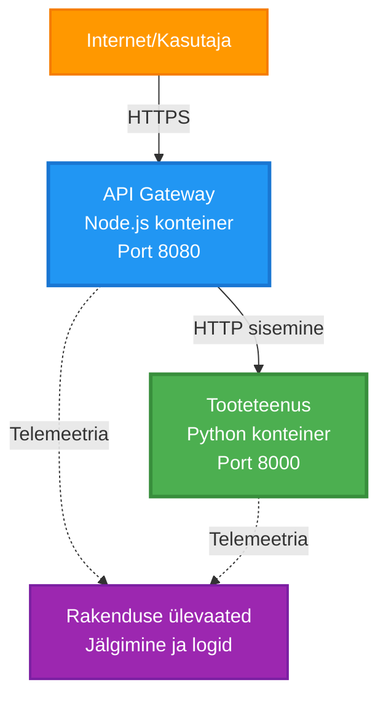
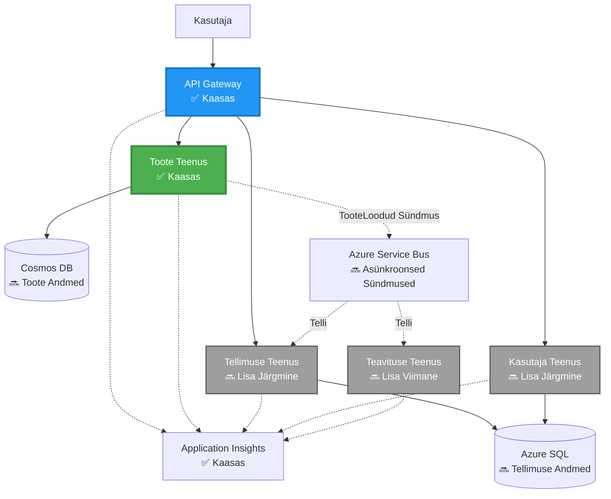
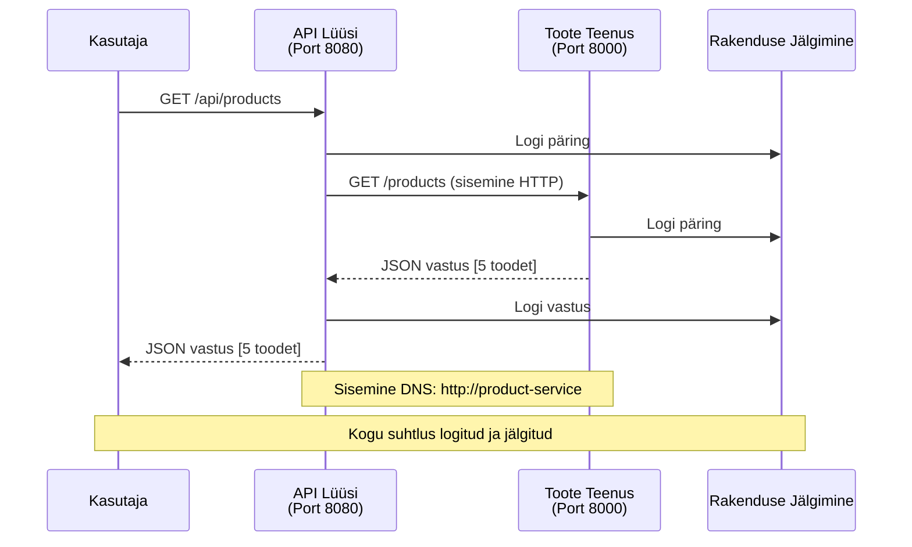

<!--
CO_OP_TRANSLATOR_METADATA:
{
  "original_hash": "eb3a4803a1e80a7f2e64f6bf63738c0f",
  "translation_date": "2025-11-24T14:49:55+00:00",
  "source_file": "examples/microservices/README.md",
  "language_code": "et"
}
-->
# Mikroteenuste arhitektuur - konteinerirakenduse näide

⏱️ **Hinnanguline aeg**: 25-35 minutit | 💰 **Hinnanguline kulu**: ~50-100 $/kuus | ⭐ **Keerukus**: Edasijõudnud

**📚 Õppimise teekond:**
- ← Eelmine: [Lihtne Flask API](../../../../examples/container-app/simple-flask-api) - Ühe konteineri põhitõed
- 🎯 **Oled siin**: Mikroteenuste arhitektuur (2-teenuse alus)
- → Järgmine: [Tehisintellekti integreerimine](../../../../docs/ai-foundry) - Lisa oma teenustele intelligentsust
- 🏠 [Kursuse avaleht](../../README.md)

---

**Lihtsustatud, kuid funktsionaalne** mikroteenuste arhitektuur, mis on juurutatud Azure Container Apps abil, kasutades AZD CLI-d. See näide demonstreerib teenustevahelist suhtlust, konteinerite orkestreerimist ja monitooringut praktilise 2-teenuse seadistusega.

> **📚 Õppimise lähenemine**: See näide algab minimaalse 2-teenuse arhitektuuriga (API Gateway + taustateenus), mida saate tegelikult juurutada ja õppida. Pärast selle aluse omandamist pakume juhiseid, kuidas laiendada täisväärtuslikuks mikroteenuste ökosüsteemiks.

## Mida õpid

Selle näite läbimisega õpid:
- Juurutama mitut konteinerit Azure Container Apps-i
- Rakendama teenustevahelist suhtlust sisemise võrgustiku abil
- Konfigureerima keskkonnapõhist skaleerimist ja tervisekontrolle
- Monitoorima hajutatud rakendusi Application Insights abil
- Mõistma mikroteenuste juurutusmustreid ja parimaid tavasid
- Õppima järkjärgulist laienemist lihtsast keerukamate arhitektuurideni

## Arhitektuur

### 1. etapp: Mida ehitame (sisaldub selles näites)


**Komponentide üksikasjad:**

| Komponent | Eesmärk | Juurdepääs | Ressursid |
|-----------|---------|------------|-----------|
| **API Gateway** | Suunab välised päringud taustateenustele | Avalik (HTTPS) | 1 vCPU, 2GB RAM, 2-20 koopiat |
| **Tooteteenus** | Haldab tooteloendit mälusisese andmestikuga | Ainult sisemine | 0.5 vCPU, 1GB RAM, 1-10 koopiat |
| **Application Insights** | Keskne logimine ja hajutatud jälgimine | Azure Portal | 1-2 GB/kuus andmesisestus |

**Miks alustada lihtsast?**
- ✅ Juuruta ja mõista kiiresti (25-35 minutit)
- ✅ Õpi mikroteenuste põhiskeeme ilma keerukuseta
- ✅ Töötav kood, mida saad muuta ja katsetada
- ✅ Madalam õppimiskulu (~50-100 $/kuus vs 300-1400 $/kuus)
- ✅ Ehita enesekindlust enne andmebaaside ja sõnumijärjekordade lisamist

**Võrdlus**: Mõtle sellele nagu autoga sõitma õppimisele. Alustad tühjast parklast (2 teenust), omandad põhitõed ja liigud edasi linnaliiklusesse (5+ teenust andmebaasidega).

### 2. etapp: Tulevane laienemine (viitearhitektuur)

Kui oled 2-teenuse arhitektuuri omandanud, saad seda laiendada:


Vaata "Laienemisjuhend" sektsiooni lõpus samm-sammuliste juhiste jaoks.

## Kaasatud funktsioonid

✅ **Teenuste avastamine**: Automaatne DNS-põhine avastamine konteinerite vahel  
✅ **Koormuse tasakaalustamine**: Sisseehitatud koormuse tasakaalustamine koopiate vahel  
✅ **Automaatne skaleerimine**: Iga teenuse sõltumatu skaleerimine HTTP-päringute alusel  
✅ **Tervise monitooring**: Elususe ja valmisoleku kontrollid mõlemale teenusele  
✅ **Hajutatud logimine**: Keskne logimine Application Insights abil  
✅ **Sisemine võrgustik**: Turvaline teenustevaheline suhtlus  
✅ **Konteinerite orkestreerimine**: Automaatne juurutamine ja skaleerimine  
✅ **Katkestusteta uuendused**: Järkjärgulised uuendused koos versioonihaldusega  

## Eeltingimused

### Vajalikud tööriistad

Enne alustamist veendu, et sul on need tööriistad paigaldatud:

1. **[Azure Developer CLI (azd)](https://learn.microsoft.com/azure/developer/azure-developer-cli/install-azd)** (versioon 1.0.0 või uuem)
   ```bash
   azd version
   # Oodatav väljund: azd versioon 1.0.0 või uuem
   ```

2. **[Azure CLI](https://learn.microsoft.com/cli/azure/install-azure-cli)** (versioon 2.50.0 või uuem)
   ```bash
   az --version
   # Oodatav väljund: azure-cli 2.50.0 või uuem
   ```

3. **[Docker](https://www.docker.com/get-started)** (kohalikuks arenduseks/testimiseks - valikuline)
   ```bash
   docker --version
   # Oodatav väljund: Dockeri versioon 20.10 või uuem
   ```

### Kontrolli oma seadistust

Käivita need käsud, et veenduda valmisolekus:

```bash
# Kontrolli Azure Developer CLI-d
azd version
# ✅ Oodatav: azd versioon 1.0.0 või uuem

# Kontrolli Azure CLI-d
az --version
# ✅ Oodatav: azure-cli 2.50.0 või uuem

# Kontrolli Dockeri (valikuline)
docker --version
# ✅ Oodatav: Dockeri versioon 20.10 või uuem
```

**Edu kriteerium**: Kõik käsud tagastavad versiooninumbrid, mis vastavad miinimumnõuetele või on neist uuemad.

### Azure'i nõuded

- Aktiivne **Azure'i tellimus** ([loo tasuta konto](https://azure.microsoft.com/free/))
- Õigused ressursside loomiseks oma tellimuses
- **Kaastöötaja** roll tellimuses või ressursigrupis

### Teadmiste eeltingimused

See on **edasijõudnud taseme** näide. Sul peaks olema:
- Läbitud [Lihtne Flask API näide](../../../../examples/container-app/simple-flask-api) 
- Põhiteadmised mikroteenuste arhitektuurist
- REST API-de ja HTTP mõistmine
- Konteinerite kontseptsioonide tundmine

**Uus konteinerirakendustes?** Alusta [Lihtne Flask API näitest](../../../../examples/container-app/simple-flask-api), et õppida põhitõdesid.

## Kiirstart (samm-sammult)

### Samm 1: Klooni ja liigu kausta

```bash
git clone https://github.com/microsoft/AZD-for-beginners.git
cd AZD-for-beginners/examples/microservices
```

**✓ Edu kontroll**: Veendu, et näed `azure.yaml` faili:
```bash
ls
# Oodatud: README.md, azure.yaml, infra/, src/
```

### Samm 2: Autendi Azure'iga

```bash
azd auth login
```

See avab sinu brauseris Azure'i autentimise. Logi sisse oma Azure'i mandaatidega.

**✓ Edu kontroll**: Peaksid nägema:
```
Logged in to Azure.
```

### Samm 3: Algata keskkond

```bash
azd init
```

**Küsimused, mida näed**:
- **Keskkonna nimi**: Sisesta lühike nimi (nt `microservices-dev`)
- **Azure'i tellimus**: Vali oma tellimus
- **Azure'i asukoht**: Vali regioon (nt `eastus`, `westeurope`)

**✓ Edu kontroll**: Peaksid nägema:
```
SUCCESS: New project initialized!
```

### Samm 4: Juuruta infrastruktuur ja teenused

```bash
azd up
```

**Mis juhtub** (kestab 8-12 minutit):

```mermaid
graph LR
    A[azd üles] --> B[Loo Ressursigrupp]
    B --> C[Paigalda Konteineriregister]
    C --> D[Paigalda Logianalüütika]
    D --> E[Paigalda Rakenduse Jälgimine]
    E --> F[Loo Konteinerikeskkond]
    F --> G[Ehitada API Gateway Pilt]
    F --> H[Ehitada Toote Teenuse Pilt]
    G --> I[Lükka Registrisse]
    H --> I
    I --> J[Paigalda API Gateway]
    I --> K[Paigalda Toote Teenus]
    J --> L[Konfigureeri Sissepääs & Tervisekontrollid]
    K --> L
    L --> M[Paigaldamine Lõpetatud ✓]
    
    style A fill:#2196F3,stroke:#1976D2,stroke-width:3px,color:#fff
    style M fill:#4CAF50,stroke:#388E3C,stroke-width:3px,color:#fff
```


**✓ Edu kontroll**: Peaksid nägema:
```
SUCCESS: Your application was deployed to Azure in X minutes Y seconds.
Endpoint: https://api-gateway-<unique-id>.azurecontainerapps.io
```

**⏱️ Aeg**: 8-12 minutit

### Samm 5: Testi juurutust

```bash
# Hankige lüüsipunkt
GATEWAY_URL=$(azd env get-values | grep API_GATEWAY_URL | cut -d '=' -f2 | tr -d '"')

# Testige API Gateway tervist
curl $GATEWAY_URL/health
```

**✅ Oodatav väljund:**
```json
{
  "status": "healthy",
  "service": "api-gateway",
  "timestamp": "2025-11-19T10:30:00Z"
}
```

**Testi tooteteenust läbi värava**:
```bash
# Loetle tooted
curl $GATEWAY_URL/api/products
```

**✅ Oodatav väljund:**
```json
[
  {"id":1,"name":"Laptop","price":999.99,"stock":50},
  {"id":2,"name":"Mouse","price":29.99,"stock":200},
  {"id":3,"name":"Keyboard","price":79.99,"stock":150}
]
```

**✓ Edu kontroll**: Mõlemad lõpp-punktid tagastavad JSON-andmeid ilma vigadeta.

---

**🎉 Palju õnne!** Oled juurutanud mikroteenuste arhitektuuri Azure'i!

## Projekti struktuur

Kõik rakenduse failid on kaasatud—see on täielik, töötav näide:

```
microservices/
│
├── README.md                         # This file
├── azure.yaml                        # AZD configuration
├── .gitignore                        # Git ignore patterns
│
├── infra/                           # Infrastructure as Code (Bicep)
│   ├── main.bicep                   # Main orchestration
│   ├── abbreviations.json           # Naming conventions
│   ├── core/                        # Shared infrastructure
│   │   ├── container-apps-environment.bicep  # Container environment + registry
│   │   └── monitor.bicep            # Application Insights + Log Analytics
│   └── app/                         # Service definitions
│       ├── api-gateway.bicep        # API Gateway container app
│       └── product-service.bicep    # Product Service container app
│
└── src/                             # Application source code
    ├── api-gateway/                 # Node.js API Gateway
    │   ├── app.js                   # Express server with routing
    │   ├── package.json             # Node dependencies
    │   └── Dockerfile               # Container definition
    └── product-service/             # Python Product Service
        ├── main.py                  # Flask API with product data
        ├── requirements.txt         # Python dependencies
        └── Dockerfile               # Container definition
```

**Mida iga komponent teeb:**

**Infrastruktuur (infra/)**:
- `main.bicep`: Orkestreerib kõik Azure'i ressursid ja nende sõltuvused
- `core/container-apps-environment.bicep`: Loob Container Apps keskkonna ja Azure Container Registry
- `core/monitor.bicep`: Seadistab Application Insights hajutatud logimiseks
- `app/*.bicep`: Individuaalsed konteinerirakenduste definitsioonid skaleerimise ja tervisekontrollidega

**API Gateway (src/api-gateway/)**:
- Avalik teenus, mis suunab päringud taustateenustele
- Rakendab logimist, veakäsitlust ja päringute edastamist
- Näitab teenustevahelist HTTP suhtlust

**Tooteteenus (src/product-service/)**:
- Sisemine teenus tooteloendiga (lihtsuse huvides mälusisene)
- REST API tervisekontrollidega
- Näide taustateenuse mustrist

## Teenuste ülevaade

### API Gateway (Node.js/Express)

**Port**: 8080  
**Juurdepääs**: Avalik (väline juurdepääs)  
**Eesmärk**: Suunab sissetulevad päringud sobivatele taustateenustele  

**Lõpp-punktid**:
- `GET /` - Teenuse info
- `GET /health` - Tervisekontrolli lõpp-punkt
- `GET /api/products` - Suunab tooteteenusele (kõikide loetlemine)
- `GET /api/products/:id` - Suunab tooteteenusele (ID järgi)

**Peamised omadused**:
- Päringute suunamine axios-iga
- Keskne logimine
- Veakäsitlus ja ajahaldus
- Teenuste avastamine keskkonnamuutujate kaudu
- Application Insights integratsioon

**Koodi esiletõst** (`src/api-gateway/app.js`):
```javascript
// Sisemine teenustevaheline suhtlus
app.get('/api/products', async (req, res) => {
  const response = await axios.get(`${PRODUCT_SERVICE_URL}/products`, {
    timeout: 5000
  });
  res.json(response.data);
});
```

### Tooteteenus (Python/Flask)

**Port**: 8000  
**Juurdepääs**: Ainult sisemine (väline juurdepääs puudub)  
**Eesmärk**: Haldab tooteloendit mälusisese andmestikuga  

**Lõpp-punktid**:
- `GET /` - Teenuse info
- `GET /health` - Tervisekontrolli lõpp-punkt
- `GET /products` - Kõikide toodete loetlemine
- `GET /products/<id>` - Toote saamine ID järgi

**Peamised omadused**:
- RESTful API Flaskiga
- Mälusisene tootepood (lihtne, andmebaasi pole vaja)
- Tervise monitooring proovidega
- Struktureeritud logimine
- Application Insights integratsioon

**Andmemudel**:
```python
{
  "id": 1,
  "name": "Laptop",
  "description": "High-performance laptop",
  "price": 999.99,
  "stock": 50
}
```

**Miks ainult sisemine?**
Tooteteenus pole avalikult kättesaadav. Kõik päringud peavad läbima API Gateway, mis pakub:
- Turvalisus: Kontrollitud juurdepääsupunkt
- Paindlikkus: Saab muuta taustateenust ilma kliente mõjutamata
- Monitooring: Keskne päringute logimine

## Teenustevahelise suhtluse mõistmine

### Kuidas teenused omavahel suhtlevad


Selles näites suhtleb API Gateway tooteteenusega **sisemiste HTTP-kõnede** abil:

```javascript
// API Gateway (src/api-gateway/app.js)
const PRODUCT_SERVICE_URL = process.env.PRODUCT_SERVICE_URL;

// Tee sisemine HTTP-päring
const response = await axios.get(`${PRODUCT_SERVICE_URL}/products`);
```

**Peamised punktid**:

1. **DNS-põhine avastamine**: Container Apps pakub automaatselt DNS-i sisemistele teenustele
   - Tooteteenuse FQDN: `product-service.internal.<environment>.azurecontainerapps.io`
   - Lihtsustatud kujul: `http://product-service` (Container Apps lahendab selle)

2. **Avalik juurdepääs puudub**: Tooteteenus on `external: false` Bicep-is
   - Ligipääsetav ainult Container Apps keskkonnas
   - Internetist ei saa sellele ligi

3. **Keskkonnamuutujad**: Teenuse URL-id süstitakse juurutamise ajal
   - Bicep edastab sisemise FQDN-i väravale
   - Rakenduse koodis pole kõvakodeeritud URL-e

**Võrdlus**: Mõtle sellele nagu kontoriruumidele. API Gateway on vastuvõtulaud (avalik), ja tooteteenus on kontoriruum (ainult sisemine). Külastajad peavad vastuvõtust läbi minema, et jõuda kontorisse.
3. Paigalda mõlemad teenused uuesti:

```bash
azd deploy product-service
azd deploy api-gateway
```

4. Testi uut lõpp-punkti:

```bash
GATEWAY_URL=$(azd env get-values | grep API_GATEWAY_URL | cut -d '=' -f2 | tr -d '"')

# Loo uus toode
curl -X POST $GATEWAY_URL/api/products \
  -H "Content-Type: application/json" \
  -d '{"name":"USB Cable","price":9.99,"stock":500}'
```

**✅ Oodatav väljund:**
```json
{"id":6,"name":"USB Cable","description":"","price":9.99,"stock":500}
```

5. Kontrolli, kas see ilmub nimekirjas:

```bash
curl $GATEWAY_URL/api/products
# Peaks nüüd näitama 6 toodet, sealhulgas uut USB-kaablit
```

**Edu kriteeriumid**:
- ✅ POST-päring tagastab HTTP 201
- ✅ Uus toode ilmub GET /api/products nimekirjas
- ✅ Toote ID on automaatselt suurenev

**Aeg**: 10-15 minutit

---

### Harjutus 2: Muuda automaatse skaleerimise reegleid ⭐⭐ (Keskmine)

**Eesmärk**: Muuda Product Service'i skaleerimist agressiivsemaks

**Alguspunkt**: `infra/app/product-service.bicep`

**Sammud**:

1. Ava `infra/app/product-service.bicep` ja leia `scale` plokk (umbes rida 95)

2. Muuda:
```bicep
scale: {
  minReplicas: 1
  maxReplicas: 10
  rules: [
    {
      name: 'http-scale-rule'
      http: {
        metadata: {
          concurrentRequests: '100'  // OLD
        }
      }
    }
  ]
}
```

Kuni:
```bicep
scale: {
  minReplicas: 2  // Always have 2 running
  maxReplicas: 20  // Allow more scaling
  rules: [
    {
      name: 'http-scale-rule'
      http: {
        metadata: {
          concurrentRequests: '20'  // Scale at lower threshold
        }
      }
    }
  ]
}
```

3. Paigalda infrastruktuur uuesti:

```bash
azd up
```

4. Kontrolli uut skaleerimise konfiguratsiooni:

```bash
az containerapp show \
  --name $(azd env get-values | grep PRODUCT_SERVICE | head -1 | cut -d '/' -f5) \
  --resource-group $(azd env get-values | grep AZURE_RESOURCE_GROUP | cut -d '=' -f2 | tr -d '"') \
  --query "properties.template.scale" -o json
```

**✅ Oodatav väljund:**
```json
{
  "minReplicas": 2,
  "maxReplicas": 20,
  "rules": [...]
}
```

5. Testi skaleerimist koormusega:

```bash
# Genereeri samaaegsed päringud
for i in {1..500}; do curl $GATEWAY_URL/api/products & done

# Vaata skaleerimise toimumist
azd logs product-service --follow
# Otsi: Container Apps skaleerimise sündmusi
```

**Edu kriteeriumid**:
- ✅ Product Service töötab alati vähemalt 2 koopiaga
- ✅ Koormuse korral skaleerub rohkem kui 2 koopiani
- ✅ Azure Portal näitab uusi skaleerimise reegleid

**Aeg**: 15-20 minutit

---

### Harjutus 3: Lisa kohandatud jälgimispäring ⭐⭐ (Keskmine)

**Eesmärk**: Loo kohandatud Application Insights päring, et jälgida toote API jõudlust

**Sammud**:

1. Mine Azure Portali Application Insights:
   - Ava Azure Portal
   - Leia oma ressursigrupp (rg-microservices-*)
   - Klõpsa Application Insights ressursil

2. Klõpsa vasakul menüüs "Logs"

3. Loo see päring:

```kusto
requests
| where timestamp > ago(1h)
| where name contains "products"
| summarize 
    RequestCount = count(),
    AvgDuration = avg(duration),
    P95Duration = percentile(duration, 95),
    SuccessRate = 100.0 * countif(success == true) / count()
  by bin(timestamp, 5m)
| render timechart
```

4. Klõpsa "Run", et päringut käivitada

5. Salvesta päring:
   - Klõpsa "Save"
   - Nimi: "Product API Performance"
   - Kategooria: "Performance"

6. Genereeri testliiklus:

```bash
for i in {1..100}; do curl $GATEWAY_URL/api/products; sleep 1; done
```

7. Värskenda päringut, et näha andmeid

**✅ Oodatav väljund:**
- Graafik, mis näitab päringute arvu aja jooksul
- Keskmine kestus < 500ms
- Edukuse määr = 100%
- Ajaühikud 5-minutilised

**Edu kriteeriumid**:
- ✅ Päring näitab 100+ päringut
- ✅ Edukuse määr on 100%
- ✅ Keskmine kestus < 500ms
- ✅ Graafik kuvab 5-minutilisi ajaühikuid

**Õpitulemus**: Õpi jälgima teenuse jõudlust kohandatud päringutega

**Aeg**: 10-15 minutit

---

### Harjutus 4: Rakenda korduspäringute loogika ⭐⭐⭐ (Edasijõudnud)

**Eesmärk**: Lisa API Gateway'le korduspäringute loogika, kui Product Service on ajutiselt kättesaamatu

**Alguspunkt**: `src/api-gateway/app.js`

**Sammud**:

1. Paigalda korduspäringute teek:

```bash
cd src/api-gateway
npm install axios-retry --save
cd ../..
```

2. Uuenda `src/api-gateway/app.js` (lisa pärast axios importimist):

```javascript
const axiosRetry = require('axios-retry');

// Konfigureeri uuesti proovimise loogika
axiosRetry(axios, {
  retries: 3,
  retryDelay: (retryCount) => {
    return retryCount * 1000; // 1s, 2s, 3s
  },
  retryCondition: (error) => {
    // Proovi uuesti võrguvigade või 5xx vastuste korral
    return axiosRetry.isNetworkOrIdempotentRequestError(error) ||
           (error.response && error.response.status >= 500);
  }
});

console.log('Retry logic configured: 3 retries with exponential backoff');
```

3. Paigalda API Gateway uuesti:

```bash
azd deploy api-gateway
```

4. Testi korduspäringute käitumist, simuleerides teenuse tõrget:

```bash
# Skaala toote teenus nulli (simuleeri tõrget)
az containerapp update \
  --name $(azd env get-values | grep PRODUCT_SERVICE | head -1 | cut -d '/' -f5) \
  --resource-group $(azd env get-values | grep AZURE_RESOURCE_GROUP | cut -d '=' -f2 | tr -d '"') \
  --min-replicas 0 \
  --max-replicas 0

# Proovi toodetele juurde pääseda (katsetab uuesti 3 korda)
time curl -v $GATEWAY_URL/api/products
# Jälgi: Vastus võtab ~6 sekundit (1s + 2s + 3s korduskatseid)

# Taasta toote teenus
az containerapp update \
  --name $(azd env get-values | grep PRODUCT_SERVICE | head -1 | cut -d '/' -f5) \
  --resource-group $(azd env get-values | grep AZURE_RESOURCE_GROUP | cut -d '=' -f2 | tr -d '"') \
  --min-replicas 1 \
  --max-replicas 10
```

5. Vaata korduspäringute logisid:

```bash
azd logs api-gateway --tail 50
# Otsi: Uuesti proovimise katse sõnumeid
```

**✅ Oodatav käitumine:**
- Päringud korduvad 3 korda enne ebaõnnestumist
- Iga kordus ootab kauem (1s, 2s, 3s)
- Edukad päringud pärast teenuse taaskäivitamist
- Logid näitavad korduspäringute katseid

**Edu kriteeriumid**:
- ✅ Päringud korduvad 3 korda enne ebaõnnestumist
- ✅ Iga kordus ootab kauem (eksponentsiaalne viivitus)
- ✅ Edukad päringud pärast teenuse taaskäivitamist
- ✅ Logid näitavad korduspäringute katseid

**Õpitulemus**: Õpi mikroteenuste vastupidavuse mustreid (kaitselülitid, korduspäringud, ajapiirangud)

**Aeg**: 20-25 minutit

---

## Teadmiste kontrollpunkt

Pärast selle näite lõpetamist kontrolli oma arusaamist:

### 1. Teenuste kommunikatsioon ✓

Testi oma teadmisi:
- [ ] Kas oskad selgitada, kuidas API Gateway leiab Product Service'i? (DNS-põhine teenuse avastamine)
- [ ] Mis juhtub, kui Product Service on maas? (Gateway tagastab 503 vea)
- [ ] Kuidas lisada kolmas teenus? (Loo uus Bicep-fail, lisa main.bicep-faili, loo src-kaust)

**Praktiline kontroll**:
```bash
# Simuleeri teenuse tõrget
az containerapp update --name <product-service-name> --min-replicas 0 --max-replicas 0
curl $GATEWAY_URL/api/products
# ✅ Oodatav: 503 Teenus pole saadaval

# Taasta teenus
az containerapp update --name <product-service-name> --min-replicas 1 --max-replicas 10
```

### 2. Jälgimine ja nähtavus ✓

Testi oma teadmisi:
- [ ] Kus näed hajutatud logisid? (Application Insights Azure Portalis)
- [ ] Kuidas jälgida aeglaseid päringuid? (Kusto päring: `requests | where duration > 1000`)
- [ ] Kas oskad tuvastada, milline teenus põhjustas vea? (Vaata `cloud_RoleName` välja logides)

**Praktiline kontroll**:
```bash
# Loo aeglase päringu simulatsioon
curl "$GATEWAY_URL/api/products?delay=2000"

# Päring Application Insightsist aeglaste päringute jaoks
# Navigeeri Azure Portaal → Application Insights → Logid
# Käivita: requests | where duration > 1000 | project timestamp, name, duration, cloud_RoleName
```

### 3. Skaleerimine ja jõudlus ✓

Testi oma teadmisi:
- [ ] Mis käivitab automaatse skaleerimise? (HTTP samaaegsete päringute reeglid: 50 gateway jaoks, 100 toote jaoks)
- [ ] Mitu koopiat praegu töötab? (Kontrolli `az containerapp revision list` abil)
- [ ] Kuidas skaleerida Product Service 5 koopiani? (Uuenda minReplicas Bicep-failis)

**Praktiline kontroll**:
```bash
# Genereeri koormus autoskaalimise testimiseks
for i in {1..1000}; do curl $GATEWAY_URL/api/products & done

# Vaata replikate arvu suurenemist
azd logs api-gateway --follow
# ✅ Oodatav: Näha skaleerimise sündmusi logides
```

**Edu kriteeriumid**: Saad vastata kõigile küsimustele ja kinnitada praktiliste käskudega.

---

## Kulude analüüs

### Hinnangulised kuukulud (selle 2-teenuse näite jaoks)

| Ressurss | Konfiguratsioon | Hinnanguline kulu |
|----------|-----------------|-------------------|
| API Gateway | 2-20 koopiat, 1 vCPU, 2GB RAM | $30-150 |
| Product Service | 1-10 koopiat, 0.5 vCPU, 1GB RAM | $15-75 |
| Container Registry | Basic tier | $5 |
| Application Insights | 1-2 GB/kuus | $5-10 |
| Log Analytics | 1 GB/kuus | $3 |
| **Kokku** | | **$58-243/kuus** |

### Kulude jaotus kasutuse järgi

**Kerge liiklus** (testimine/õppimine): ~$60/kuus
- API Gateway: 2 koopiat × 24/7 = $30
- Product Service: 1 koopia × 24/7 = $15
- Jälgimine + Registry = $13

**Mõõdukas liiklus** (väike tootmine): ~$120/kuus
- API Gateway: 5 keskmist koopiat = $75
- Product Service: 3 keskmist koopiat = $45
- Jälgimine + Registry = $13

**Suur liiklus** (aktiivsed perioodid): ~$240/kuus
- API Gateway: 15 keskmist koopiat = $225
- Product Service: 8 keskmist koopiat = $120
- Jälgimine + Registry = $13

### Kulude optimeerimise näpunäited

1. **Arenduseks nulli skaleerimine**:
   ```bicep
   scale: {
     minReplicas: 0  // Save $30-40/month when not in use
     maxReplicas: 10
   }
   ```

2. **Kasuta Cosmos DB tarbimiskava** (kui lisad selle):
   - Maksad ainult kasutuse eest
   - Pole miinimumtasusid

3. **Seadista Application Insights proovivõtmine**:
   ```javascript
   appInsights.defaultClient.config.samplingPercentage = 50; // Proovi 50% päringutest
   ```

4. **Puhasta, kui pole vaja**:
   ```bash
   azd down --force --purge
   ```

### Tasuta taseme valikud

Õppimiseks/testimiseks kaalu:
- ✅ Kasuta Azure tasuta krediiti ($200 esimese 30 päeva jooksul uute kontode jaoks)
- ✅ Hoia minimaalsed koopiad (säästab ~50% kuludest)
- ✅ Kustuta pärast testimist (pole pidevaid tasusid)
- ✅ Skaleeri nulli õppeseansside vahel

**Näide**: Selle näite käitamine 2 tundi päevas × 30 päeva = ~$5/kuus, mitte $60/kuus

---

## Kiire viide probleemide lahendamiseks

### Probleem: `azd up` ebaõnnestub veaga "Subscription not found"

**Lahendus**:
```bash
# Logi uuesti sisse selgesõnalise tellimusega
az account set --subscription <your-subscription-id>
azd env set AZURE_SUBSCRIPTION_ID <your-subscription-id>
azd up
```

### Probleem: API Gateway tagastab 503 "Product service unavailable"

**Diagnostika**:
```bash
# Kontrolli toote teenuse logisid
azd logs product-service --tail 50

# Kontrolli toote teenuse tervist
az containerapp show \
  --name $(azd env get-values | grep PRODUCT_SERVICE | head -1 | cut -d '/' -f5) \
  --resource-group $(azd env get-values | grep AZURE_RESOURCE_GROUP | cut -d '=' -f2 | tr -d '"') \
  --query "properties.runningStatus"
```

**Levinud põhjused**:
1. Product Service ei käivitunud (kontrolli Python vigade logisid)
2. Tervisekontroll ebaõnnestub (kontrolli, kas `/health` lõpp-punkt töötab)
3. Konteineri pildi ehitamine ebaõnnestus (kontrolli registris pilti)

### Probleem: Automaatne skaleerimine ei tööta

**Diagnostika**:
```bash
# Kontrolli praegust replika arvu
az containerapp revision list \
  --name $(azd env get-values | grep API_GATEWAY | head -1 | cut -d '/' -f5) \
  --resource-group $(azd env get-values | grep AZURE_RESOURCE_GROUP | cut -d '=' -f2 | tr -d '"') \
  --query "[].properties.replicas"

# Genereeri koormus testimiseks
for i in {1..1000}; do curl $GATEWAY_URL/api/products & done

# Jälgi skaleerimise sündmusi
azd logs api-gateway --follow | grep -i scale
```

**Levinud põhjused**:
1. Koormus pole piisavalt suur, et käivitada skaleerimisreegel (vajalik >50 samaaegset päringut)
2. Maksimaalne koopiate arv on juba saavutatud (kontrolli Bicep konfiguratsiooni)
3. Skaleerimisreegel on Bicep-failis valesti seadistatud (kontrolli concurrentRequests väärtust)

### Probleem: Application Insights ei näita logisid

**Diagnostika**:
```bash
# Kontrolli, kas ühenduse string on määratud
azd env get-values | grep APPLICATIONINSIGHTS

# Kontrolli, kas teenused saadavad telemeetriat
az monitor app-insights component show \
  --app $(azd env get-values | grep APPLICATIONINSIGHTS_NAME | cut -d '=' -f2 | tr -d '"') \
  --resource-group $(azd env get-values | grep AZURE_RESOURCE_GROUP | cut -d '=' -f2 | tr -d '"') \
  --query "properties.InstrumentationKey"
```

**Levinud põhjused**:
1. Ühenduse stringi ei edastata konteinerile (kontrolli keskkonnamuutujaid)
2. Application Insights SDK pole seadistatud (kontrolli imporditud mooduleid koodis)
3. Telemeetria blokeerimine tulemüüriga (harv, kontrolli võrgu reegleid)

### Probleem: Docker build ebaõnnestub kohapeal

**Diagnostika**:
```bash
# Testi API Gateway'i ehitust
cd src/api-gateway
docker build -t test-gateway .

# Testi Product Service'i ehitust
cd ../product-service
docker build -t test-product .
```

**Levinud põhjused**:
1. Puuduvad sõltuvused package.json/requirements.txt failis
2. Dockerfile süntaksivead
3. Võrgu probleemid sõltuvuste allalaadimisel

**Ikka probleeme?** Vaata [Levinud probleemide juhendit](../../docs/troubleshooting/common-issues.md) või [Azure Container Apps tõrkeotsingut](https://learn.microsoft.com/azure/container-apps/troubleshooting)

---

## Puhastamine

Et vältida pidevaid kulusid, kustuta kõik ressursid:

```bash
azd down --force --purge
```

**Kinnituse küsimine**:
```
? Total resources to delete: 6, are you sure you want to continue? (y/N)
```

Sisesta `y`, et kinnitada.

**Mis kustutatakse**:
- Container Apps keskkond
- Mõlemad Container Apps (gateway & product service)
- Container Registry
- Application Insights
- Log Analytics tööruum
- Ressursigrupp

**✓ Kontrolli puhastamist**:
```bash
az group list --query "[?starts_with(name,'rg-microservices')]" --output table
```

Peaks tagastama tühja.

---

## Laiendamise juhend: 2 teenusest 5+ teenuseni

Kui oled selle 2-teenuse arhitektuuri omandanud, siis siin on, kuidas edasi liikuda:

### Faas 1: Lisa andmebaasi püsivus (Järgmine samm)

**Lisa Cosmos DB Product Service'ile**:

1. Loo `infra/core/cosmos.bicep`:
   ```bicep
   resource cosmosAccount 'Microsoft.DocumentDB/databaseAccounts@2023-04-15' = {
     name: name
     location: location
     kind: 'GlobalDocumentDB'
     properties: {
       databaseAccountOfferType: 'Standard'
       consistencyPolicy: { defaultConsistencyLevel: 'Session' }
       locations: [{ locationName: location, failoverPriority: 0 }]
     }
   }
   ```

2. Uuenda Product Service'i, et kasutada Azure Cosmos DB Python SDK-d in-memory andmete asemel

3. Hinnanguline lisakulu: ~$25/kuus (serverless)

### Faas 2: Lisa kolmas teenus (Tellimuste haldamine)

**Loo Order Service**:

1. Uus kaust: `src/order-service/` (Python/Node.js/C#)
2. Uus Bicep: `infra/app/order-service.bicep`
3. Uuenda API Gateway't, et suunata `/api/orders`
4. Lisa Azure SQL Database tellimuste püsivuseks

**Arhitektuur muutub**:
```
API Gateway → Product Service (Cosmos DB)
           → Order Service (Azure SQL)
```

### Faas 3: Lisa asünkroonne kommunikatsioon (Service Bus)

**Rakenda sündmuspõhine arhitektuur**:

1. Lisa Azure Service Bus: `infra/core/servicebus.bicep`
2. Product Service avaldab "ProductCreated" sündmusi
3. Order Service tellib toote sündmusi
4. Lisa Notification Service sündmuste töötlemiseks

**Muster**: Päring/vastus (HTTP) + sündmuspõhine (Service Bus)

### Faas 4: Lisa kasutaja autentimine

**Rakenda User Service**:

1. Loo `src/user-service/` (Go/Node.js)
2. Lisa Azure AD B2C või kohandatud JWT autentimine
3. API Gateway valideerib tokenid enne suunamist
4. Teenused kontrollivad kasutaja õigusi

### Faas 5: Tootmisvalmidus

**Lisa need komponendid**:
- ✅ Azure Front Door (globaalne koormuse tasakaalustamine)
- ✅ Azure Key Vault (saladuste haldamine)
- ✅ Azure Monitor Workbooks (kohandatud armatuurlauad)
- ✅ CI/CD torustik (GitHub Actions)
- ✅ Sinine-roheline paigaldamine
- ✅ Hallatud identiteet kõigile teenustele

**Täieliku tootmisarhitektuuri kulu**: ~$300-1,400/kuus

---

## Lisainfo

### Seotud dokumentatsioon
- [Azure Container Apps dokumentatsioon](https://learn.microsoft.com/azure/container-apps/)
- [Mikroteenuste arhitektuuri juhend](https://learn.microsoft.com/azure/architecture/guide/architecture-styles/microservices)
- [Application Insights hajutatud jälgimise jaoks](https://learn.microsoft.com/azure/azure-monitor/app/distributed-tracing)
- [Azure Developer CLI dokumentatsioon](https://learn.microsoft.com/azure/developer/azure-developer-cli/)

### Järgmised sammud selles kursuses
- ← Eelmine: [Lihtne Flask API](../../../../examples/container-app/simple-flask-api) - Algaja ühe konteineri näide
- → Järgmine: [AI integreerimise juhend](../../../../docs/ai-foundry) - Lisa AI võimalused
- 🏠 [Kursuse avaleht](../../README.md)

### Võrdlus: Millal mida kasutada

| Funktsioon | Üks konteiner | Mikroteenused (See) | Kubernetes (AKS) |
|------------|---------------|---------------------|------------------|
| **Kasutusjuhtum** | Lihtsad rakendused | Komplekssemad rakendused | Ettevõtte rakendused |
| **Skaleeritavus** | Üks teenus | Teenusepõhine skaleerimine | Maksimaalne paindlikkus |
| **Keerukus** | Madal | Keskmine | Kõrge |
| **Meeskonna suurus** | 1-3 arendajat | 3-10 arendajat | 10+ arendajat |
| **Kulu** | ~$15-50/kuus | ~$60-250/kuus | ~$150-500/kuus |
| **Paigaldamise aeg** | 5-10 minutit | 8-12 minutit | 15-30 minutit |
| **Parim kasutus** | MVP-d, prototüübid | Tootmisrakendused | Multi-cloud, täiustatud võrgundus |

**Soovitus**: Alusta Container Apps'iga (see näide), liigu AKS-i juurde ainult siis, kui vajad Kubernetes-spetsiifilisi funktsioone.

---

## Korduma kippuvad küsimused

**K: Miks ainult 2 teenust, mitte 5+?**  
V: Hariduslik progress. Õpi esmalt põhitõdesid (teenustevaheline suhtlus, monitooring, skaleerimine) lihtsa näite abil, enne kui lisad keerukust. Siin õpitud mustrid kehtivad ka 100-teenuse arhitektuuridele.

**K: Kas ma saan ise rohkem teenuseid lisada?**  
V: Absoluutselt! Järgi ülaltoodud laiendusjuhendit. Iga uus teenus järgib sama mustrit: loo src kaust, loo Bicep fail, uuenda azure.yaml, juuruta.

**K: Kas see on tootmisvalmis?**  
V: See on tugev alus. Tootmiseks lisa: hallatud identiteet, Key Vault, püsivad andmebaasid, CI/CD torujuhe, monitooringu teavitused ja varundusstrateegia.

**K: Miks mitte kasutada Dapr'i või muud teenuste võrku?**  
V: Hoia õppimiseks lihtne. Kui mõistad Container Apps'i loomulikku võrgundust, saad lisada Dapr'i keerukamate stsenaariumide jaoks (olekute haldus, pub/sub, sidumised).

**K: Kuidas ma saan lokaalselt siluda?**  
V: Käivita teenused lokaalselt Dockeriga:  
```bash
cd src/api-gateway
docker build -t local-gateway .
docker run -p 8080:8080 -e PRODUCT_SERVICE_URL=http://localhost:8000 local-gateway
```
  
**K: Kas ma saan kasutada erinevaid programmeerimiskeeli?**  
V: Jah! Näites on Node.js (gateway) + Python (toodete teenus). Saad segada mis tahes keeli, mis töötavad konteinerites: C#, Go, Java, Ruby, PHP jne.

**K: Mis siis, kui mul pole Azure krediiti?**  
V: Kasuta Azure tasuta taset (esimesed 30 päeva uute kontode puhul saad $200 krediiti) või juuruta lühikesteks testimisperioodideks ja kustuta kohe. See näide maksab ~2$/päevas.

**K: Kuidas see erineb Azure Kubernetes Service'ist (AKS)?**  
V: Container Apps on lihtsam (pole vaja Kubernetes'i teadmisi), kuid vähem paindlik. AKS annab täieliku Kubernetes'i kontrolli, kuid nõuab rohkem oskusi. Alusta Container Apps'iga, liigu AKS-i juurde, kui vaja.

**K: Kas ma saan seda kasutada olemasolevate Azure teenustega?**  
V: Jah! Saad ühendada olemasolevate andmebaaside, salvestuskontode, Service Bus'i jne. Uuenda Bicep faile, et viidata olemasolevatele ressurssidele, mitte luua uusi.

---

> **🎓 Õppeteekonna kokkuvõte**: Oled õppinud juurutama mitme teenuse arhitektuuri automaatse skaleerimise, sisemise võrgunduse, tsentraliseeritud monitooringu ja tootmisvalmis mustritega. See alus valmistab sind ette keerukate hajutatud süsteemide ja ettevõtte mikroteenuste arhitektuuride jaoks.

**📚 Kursuse navigeerimine:**
- ← Eelmine: [Lihtne Flask API](../../../../examples/container-app/simple-flask-api)
- → Järgmine: [Andmebaasi integreerimise näide](../../../../database-app)
- 🏠 [Kursuse avaleht](../../README.md)
- 📖 [Container Apps parimad praktikad](../../docs/deployment/deployment-guide.md)

---

**✨ Palju õnne!** Oled lõpetanud mikroteenuste näite. Nüüd mõistad, kuidas ehitada, juurutada ja monitoorida hajutatud rakendusi Azure Container Apps'is. Valmis lisama AI võimekust? Vaata [AI integreerimise juhendit](../../../../docs/ai-foundry)!

---

<!-- CO-OP TRANSLATOR DISCLAIMER START -->
**Lahtiütlus**:  
See dokument on tõlgitud AI tõlketeenuse [Co-op Translator](https://github.com/Azure/co-op-translator) abil. Kuigi püüame tagada täpsust, palume arvestada, et automaatsed tõlked võivad sisaldada vigu või ebatäpsusi. Algne dokument selle algses keeles tuleks pidada autoriteetseks allikaks. Olulise teabe puhul soovitame kasutada professionaalset inimtõlget. Me ei vastuta selle tõlke kasutamisest tulenevate arusaamatuste või valesti tõlgenduste eest.
<!-- CO-OP TRANSLATOR DISCLAIMER END -->