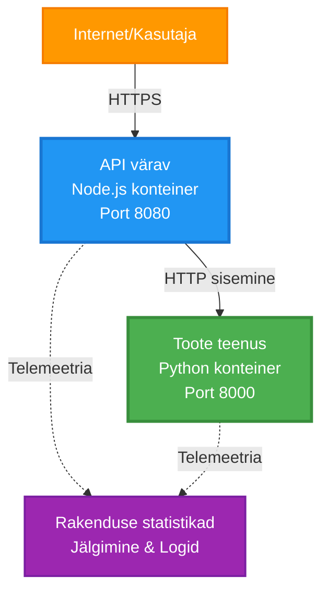
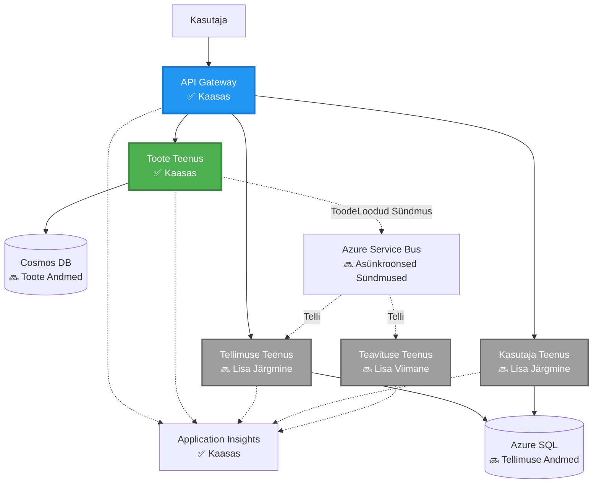
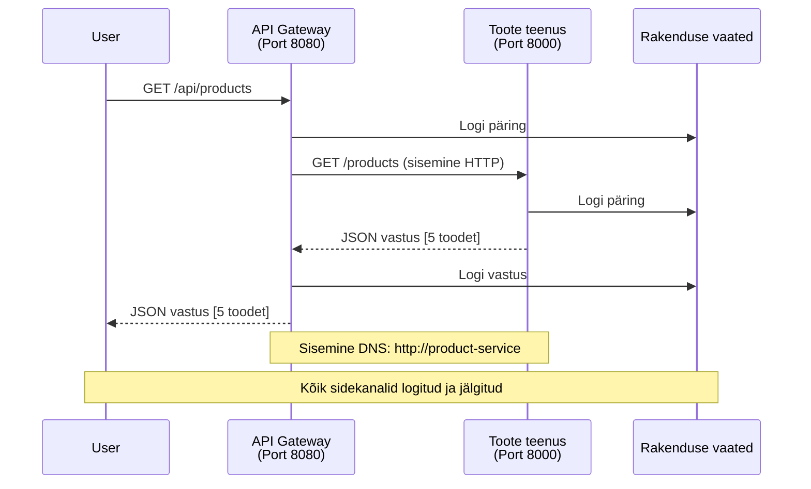

# Mikroteenuste Arhitektuur – Container App Näide

⏱️ **Hinnanguline aeg**: 25-35 minutit | 💰 **Hinnanguline maksumus**: ~$50-100/kuus | ⭐ **Keerukus**: Edasijõudnud

**📚 Õppekava:**
- ← Eelmine: [Lihtne Flask API](../../../../examples/container-app/simple-flask-api) – Ühe konteineri põhitõed
- 🎯 **Oled siin**: Mikroteenuste arhitektuur (2-teenuse alus)
- → Järgmine: [AI integratsioon](../../../../docs/ai-foundry) – Lisa oma teenustele intelligentne funktsionaalsus
- 🏠 [Kursuse avaleht](../../README.md)

---

See on **lihtsustatud, kuid toimiv** mikroteenuste arhitektuur, mis on juurutatud Azure Container Appsi kasutades AZD CLI-d. Näidis demonstreerib teenuste vahelist suhtlust, konteinerite orkestreerimist ja jälgimist praktilise 2-teenusega seadistusega.

> **📚 Õppemeetod**: See näide algab minimaalse 2-teenuse arhitektuuriga (API Gateway + Backend Service), mida saad tegelikult juurutada ja õppida. Kui oled selle aluse omandanud, anname juhiseid täismikroteenuste ökosüsteemi laiendamiseks.

## Mida sa õpid

Selle näidise lõpetamisel:
- Juurutad mitu konteinerit Azure Container Apps keskkonda
- Rakendad teenuste omavahelist suhtlust sisemise võrgustiku abil
- Seadistad keskkonnapõhise skaleerimise ja tervisekontrollid
- Jälgid hajutatud rakendusi Application Insightsi abil
- Mõistad mikroteenuste juurutamise mustreid ja parimaid tavasid
- Õpid liikuva laienduse meetodit lihtsast keeruliseni

## Arhitektuur

### Faas 1: Mida me loome (sisaldub selles näites)


```mermaid
graph TB
    Internet[Internet/Kasutaja]
    Gateway[API värav<br/>Node.js konteiner<br/>Port 8080]
    Product[Toote teenus<br/>Python konteiner<br/>Port 8000]
    AppInsights[Rakenduse statistikad<br/>Jälgimine & Logid]
    
    Internet -->|HTTPS| Gateway
    Gateway -->|HTTP sisemine| Product
    Gateway -.->|Telemeetria| AppInsights
    Product -.->|Telemeetria| AppInsights
    
    style Gateway fill:#2196F3,stroke:#1976D2,stroke-width:3px,color:#fff
    style Product fill:#4CAF50,stroke:#388E3C,stroke-width:3px,color:#fff
    style Internet fill:#FF9800,stroke:#F57C00,stroke-width:2px,color:#fff
    style AppInsights fill:#9C27B0,stroke:#7B1FA2,stroke-width:2px,color:#fff
```
**Komponentide üksikasjad:**

| Komponent | Eesmärk | Juurdepääs | Ressursid |
|-----------|---------|------------|-----------|
| **API Gateway** | Suunab välised päringud taustateenustele | Avalik (HTTPS) | 1 vCPU, 2GB RAM, 2-20 koopiat |
| **Toote teenus** | Halda tootekataloogi mälus | Ainult sisemine | 0.5 vCPU, 1GB RAM, 1-10 koopiat |
| **Application Insights** | Keskne logimine ja hajutatud jälgimine | Azure portaal | 1-2 GB/kuus andmete vastuvõtt |

**Miks alustada lihtsast?**
- ✅ Kiire juurutus ja arusaamine (25-35 minutit)
- ✅ Õpi mikroteenuste põhimustreid ilma keerukuseta
- ✅ Töötav kood, mida saad muuta ja katsetada
- ✅ Õppimise madalam hind (~$50-100/kuus vs $300-1400/kuus)
- ✅ Ehita enesekindlust enne andmebaaside ja sõnumijärjekordade lisamist

**Võrdlus**: Mõtle sellele nagu autojuhtimise õppimine: alustad tühjast parklast (2 teenust), valdades põhialuseid, seejärel liigud linnaliiklusesse (5+ teenust ja andmebaasid).

### Faas 2: Tulevikulaiendus (viitearhitektuur)

Kui oled 2-teenuse arhitektuuri omandanud, saad laiendada:


```mermaid
graph TB
    User[Kasutaja]
    Gateway[API Gateway<br/>✅ Kaasas]
    Product[Toote Teenus<br/>✅ Kaasas]
    Order[Tellimuse Teenus<br/>🔜 Lisa Järgmine]
    UserSvc[Kasutaja Teenus<br/>🔜 Lisa Järgmine]
    Notify[Teavituse Teenus<br/>🔜 Lisa Viimane]
    
    CosmosDB[(Cosmos DB<br/>🔜 Toote Andmed)]
    AzureSQL[(Azure SQL<br/>🔜 Tellimuse Andmed)]
    ServiceBus[Azure Service Bus<br/>🔜 Asünkroonsed Sündmused]
    AppInsights[Application Insights<br/>✅ Kaasas]
    
    User --> Gateway
    Gateway --> Product
    Gateway --> Order
    Gateway --> UserSvc
    
    Product --> CosmosDB
    Order --> AzureSQL
    UserSvc --> AzureSQL
    
    Product -.->|ToodeLoodud Sündmus| ServiceBus
    ServiceBus -.->|Telli| Notify
    ServiceBus -.->|Telli| Order
    
    Gateway -.-> AppInsights
    Product -.-> AppInsights
    Order -.-> AppInsights
    UserSvc -.-> AppInsights
    Notify -.-> AppInsights
    
    style Product fill:#4CAF50,stroke:#388E3C,stroke-width:3px,color:#fff
    style Gateway fill:#2196F3,stroke:#1976D2,stroke-width:3px,color:#fff
    style Order fill:#9E9E9E,stroke:#616161,stroke-width:2px,color:#fff
    style UserSvc fill:#9E9E9E,stroke:#616161,stroke-width:2px,color:#fff
    style Notify fill:#9E9E9E,stroke:#616161,stroke-width:2px,color:#fff
```
Vaata lõpus olevat "Laiendamise juhendit" samm-sammult juhiste jaoks.

## Sisaldab funktsioone

✅ **Teenuse avastamine**: Automaatne DNS-põhine avastamine konteinerite vahel  
✅ **Koormuse tasakaalustamine**: Koormuse jagamine koopiate vahel  
✅ **Automaatne skaleerimine**: Iga teenuse sõltumatu skaleerimine HTTP päringute põhjal  
✅ **Tervise jälgimine**: Elujõulisuse ja valmisoleku sondid mõlemale teenusele  
✅ **Hajutatud logimine**: Keskne logimine Application Insightsiga  
✅ **Sisene võrgustik**: Turvaline teenuste omavaheline side  
✅ **Konteinerite orkestreerimine**: Automaatne juurutamine ja skaleerimine  
✅ **Katkestusteta uuendused**: Jooksvalt uuendused koos revisjonihaldusega  

## Nõuded

### Vajalikud tööriistad

Enne alustamist veendu, et sul on need tööriistad paigaldatud:

1. **[Azure Developer CLI (azd)](https://learn.microsoft.com/azure/developer/azure-developer-cli/install-azd)** (versioon 1.0.0 või uuem)
   ```bash
   azd version
   # Oodatav väljund: azd versioon 1.0.0 või uuem
   ```

2. **[Azure CLI](https://learn.microsoft.com/cli/azure/install-azure-cli)** (versioon 2.50.0 või uuem)
   ```bash
   az --version
   # Oodatav väljund: azure-cli 2.50.0 või uuem
   ```

3. **[Docker](https://www.docker.com/get-started)** (kohalikuks arenduseks/testimiseks – vabatahtlik)
   ```bash
   docker --version
   # Eeldatav väljund: Docker versioon 20.10 või uuem
   ```

### Kontrolli oma seadistust

Käivita need käsud, et veenduda valmiduses:

```bash
# Kontrolli Azure Developer CLI-d
azd version
# ✅ Oodatud: azd versioon 1.0.0 või uuem

# Kontrolli Azure CLI-d
az --version
# ✅ Oodatud: azure-cli 2.50.0 või uuem

# Kontrolli Dockerit (valikuline)
docker --version
# ✅ Oodatud: Dockeri versioon 20.10 või uuem
```

**Õnnestumise kriteerium**: Kõik käsud tagastavad versiooninumbrid, mis vastavad või ületavad miinimumnõudeid.

### Azure lähte-eeskirjad

- Aktiivne **Azure tellimus** ([loo tasuta konto](https://azure.microsoft.com/free/))
- Õigused ressursside loomiseks tellimuses
- **Kaastöötaja** roll tellimuse või ressursigrupi tasemel

### Teadmiste tasemed

See on **edasijõudnutele** mõeldud näide. Peaksid:
- Olles lõpetanud [Lihtsa Flask API näite](../../../../examples/container-app/simple-flask-api)
- Mõistma mikroteenuste arhitektuuri põhitõdesid
- Tutvuma REST API-de ja HTTP-ga
- Mõistma konteinerite kontseptsioone

**Pole Container Appsidega kursis?** Alusta [Lihtsa Flask API näitega](../../../../examples/container-app/simple-flask-api), et õppida põhialuseid.

## Kiire algus (samm-sammult)

### Samm 1: Kopeeri ja liigu kausta

```bash
git clone https://github.com/microsoft/AZD-for-beginners.git
cd AZD-for-beginners/examples/microservices
```

**✓ Kontrolli õnnestumist**: Kontrolli, et kuvatakse `azure.yaml`:
```bash
ls
# Oodatud: README.md, azure.yaml, infra/, src/
```

### Samm 2: Autendi Azure'iga

```bash
azd auth login
```

See avab brauseri Azure autentimiseks. Logi sisse oma Azure kasutajatunnustega.

**✓ Kontrolli õnnestumist**: Peaksid nägema:
```
Logged in to Azure.
```

### Samm 3: Alusta keskkonda

```bash
azd init
```

**Sinu sisendid:**
- **Keskkonna nimi**: Sisesta lühike nimi (nt `microservices-dev`)
- **Azure tellimus**: Vali oma tellimus
- **Azure asukoht**: Vali piirkond (nt `eastus`, `westeurope`)

**✓ Kontrolli õnnestumist**: Peaksid nägema:
```
SUCCESS: New project initialized!
```

### Samm 4: Juuruta infrastruktuur ja teenused

```bash
azd up
```

**Mis juhtub** (8-12 minutit):


```mermaid
graph LR
    A[azd up] --> B[Loo ressursirühm]
    B --> C[Paigalda konteineri registratuur]
    C --> D[Paigalda Logianalüütika]
    D --> E[Paigalda rakenduse ülevaated]
    E --> F[Loo konteineri keskkond]
    F --> G[Koosta API värava kuva]
    F --> H[Koosta toote teenuse kuva]
    G --> I[Suru registrisse]
    H --> I
    I --> J[Paigalda API värav]
    I --> K[Paigalda toote teenus]
    J --> L[Sea sisse ingress ja tervisekontrollid]
    K --> L
    L --> M[Paigaldamine lõpetatud ✓]
    
    style A fill:#2196F3,stroke:#1976D2,stroke-width:3px,color:#fff
    style M fill:#4CAF50,stroke:#388E3C,stroke-width:3px,color:#fff
```
**✓ Kontrolli õnnestumist**: Peaksid nägema:
```
SUCCESS: Your application was deployed to Azure in X minutes Y seconds.
Endpoint: https://api-gateway-<unique-id>.azurecontainerapps.io
```

**⏱️ Aeg**: 8-12 minutit

### Samm 5: Testi juurutust

```bash
# Saa gateway lõpp-punkt
GATEWAY_URL=$(azd env get-values | grep API_GATEWAY_URL | cut -d '=' -f2 | tr -d '"')

# Testi API Gateway tervist
curl $GATEWAY_URL/health
```

**✅ Oodatav tulemus:**
```json
{
  "status": "healthy",
  "service": "api-gateway",
  "timestamp": "2025-11-19T10:30:00Z"
}
```

**Testi toote teenust läbi gateway:**
```bash
# Tooted loetelu
curl $GATEWAY_URL/api/products
```

**✅ Oodatav tulemus:**
```json
[
  {"id":1,"name":"Laptop","price":999.99,"stock":50},
  {"id":2,"name":"Mouse","price":29.99,"stock":200},
  {"id":3,"name":"Keyboard","price":79.99,"stock":150}
]
```

**✓ Kontrolli õnnestumist**: Mõlemad lõpp-punktid tagastavad JSON-andmed vigadeta.

---

**🎉 Palju õnne!** Sa oled juurutanud mikroteenuste arhitektuuri Azure'i!

## Projekti struktuur

Kõik rakenduse failid on kaasatud – see on täielik, töötav näidis:

```
microservices/
│
├── README.md                         # This file
├── azure.yaml                        # AZD configuration
├── .gitignore                        # Git ignore patterns
│
├── infra/                           # Infrastructure as Code (Bicep)
│   ├── main.bicep                   # Main orchestration
│   ├── abbreviations.json           # Naming conventions
│   ├── core/                        # Shared infrastructure
│   │   ├── container-apps-environment.bicep  # Container environment + registry
│   │   └── monitor.bicep            # Application Insights + Log Analytics
│   └── app/                         # Service definitions
│       ├── api-gateway.bicep        # API Gateway container app
│       └── product-service.bicep    # Product Service container app
│
└── src/                             # Application source code
    ├── api-gateway/                 # Node.js API Gateway
    │   ├── app.js                   # Express server with routing
    │   ├── package.json             # Node dependencies
    │   └── Dockerfile               # Container definition
    └── product-service/             # Python Product Service
        ├── main.py                  # Flask API with product data
        ├── requirements.txt         # Python dependencies
        └── Dockerfile               # Container definition
```

**Mida iga komponent teeb:**

**Infrastruktuur (infra/):**
- `main.bicep`: Orkestreerib kõik Azure ressursid ja nende sõltuvused
- `core/container-apps-environment.bicep`: Loob Container Apps keskkonna ja Azure Container Registry
- `core/monitor.bicep`: Seadistab Application Insights hajutatud logimiseks
- `app/*.bicep`: Üksikute konteinerirakenduste definitsioonid, sealhulgas skaleerimine ja tervisekontrollid

**API Gateway (src/api-gateway/):**
- Avalik teenus, mis juhib päringud taustateenustele
- Rakendab logimist, veahaldust ja päringute edastamist
- Näitab teenuste omavahelist HTTP suhtlust

**Toote teenus (src/product-service/):**
- Sisemine teenus koos lihtsa mälus oleva tootekataloogiga
- REST API tervisekontrollidega
- Näide taustateenuse mustrist

## Teenused ülevaade

### API Gateway (Node.js/Express)

**Port**: 8080  
**Juurdepääs**: Avalik (väline sisenemine)  
**Eesmärk**: Suunab sissetulevad päringud sobivatele taustateenustele  

**Lõpp-punktid**:
- `GET /` – Teenuse info
- `GET /health` – Tervisekontroll
- `GET /api/products` – Edasta toote teenusele (kõik tooted)
- `GET /api/products/:id` – Edasta toote teenusele (toode ID järgi)

**Põhijooned**:
- Päringute suunamine axiosi abil
- Keskne logimine
- Veahaldus ja ajapiirangu juhtimine
- Teenuse avastamine keskkonnamuutujate kaudu
- Application Insights integratsioon

**Koodinäide** (`src/api-gateway/app.js`):
```javascript
// Sisemine teenustevaheline suhtlus
app.get('/api/products', async (req, res) => {
  const response = await axios.get(`${PRODUCT_SERVICE_URL}/products`, {
    timeout: 5000
  });
  res.json(response.data);
});
```

### Toote teenus (Python/Flask)

**Port**: 8000  
**Juurdepääs**: Ainult sisemine (väliseid sisenemisi ei ole)  
**Eesmärk**: Halda mälus olevat tootekataloogi  

**Lõpp-punktid**:
- `GET /` – Teenuse info
- `GET /health` – Tervisekontroll
- `GET /products` – Kõigi toodete nimekiri
- `GET /products/<id>` – Toode ID järgi

**Põhijooned**:
- REST API Flaskiga
- Mälus olev tootekataloog (lihtne, pole andmebaasi vaja)
- Tervise jälgimine sondidega
- Struktureeritud logimine
- Application Insights integratsioon

**Andmemudel**:
```python
{
  "id": 1,
  "name": "Laptop",
  "description": "High-performance laptop",
  "price": 999.99,
  "stock": 50
}
```

**Miks ainult sisemine?**
Toote teenus pole avalikult kättesaadav. Kõik päringud peavad läbima API Gateway, mis tagab:
- Turvalisuse: kontrollitud juurdepääs
- Paindlikkuse: võimalik muuta taustateenuseid klientidele nähtamatult
- Jälgimise: päringute keskne logimine

## Teenuste omavaheline suhtlus

### Kuidas teenused omavahel suhtlevad


```mermaid
sequenceDiagram
    participant User
    participant Gateway as API Gateway<br/>(Port 8080)
    participant Product as Toote teenus<br/>(Port 8000)
    participant AI as Rakenduse vaated
    
    User->>Gateway: GET /api/products
    Gateway->>AI: Logi päring
    Gateway->>Product: GET /products (sisemine HTTP)
    Product->>AI: Logi päring
    Product-->>Gateway: JSON vastus [5 toodet]
    Gateway->>AI: Logi vastus
    Gateway-->>User: JSON vastus [5 toodet]
    
    Note over Gateway,Product: Sisemine DNS: http://product-service
    Note over User,AI: Kõik sidekanalid logitud ja jälgitud
```
Selles näites suhtleb API Gateway Toote teenusega kasutades **siseriiklikke HTTP-kõnesid**:

```javascript
// API lüüsi (src/api-gateway/app.js)
const PRODUCT_SERVICE_URL = process.env.PRODUCT_SERVICE_URL;

// Tee sisemine HTTP päring
const response = await axios.get(`${PRODUCT_SERVICE_URL}/products`);
```

**Olulised punktid:**

1. **DNS-põhine avastamine**: Container Apps tagab automaatse DNS sisemistele teenustele
   - Toote teenuse FQDN: `product-service.internal.<keskkond>.azurecontainerapps.io`
   - Lihtsustatud kujul: `http://product-service` (Container Apps lahendab selle)

2. **Ei ole avalikult nähtav**: Toote teenusel on Bicepis `external: false`
   - Juhtpääs vaid Container Apps keskkonnas
   - Internetist pole ligipääsu

3. **Keskkonnamuutujad**: Teenuse URL-id sisestatakse juurutamise ajal
   - Bicep edastab sisemise FQDN gateway-le
   - Rakenduse koodis ei ole kõvasti kodeeritud URL-e

**Võrdlus**: Mõtle kontoriruumidele. API Gateway on vastuvõtulaud (avalik), toote teenus on kontoriruum (ainult sisemine). Külastajatel tuleb minna läbi vastuvõtu, et jõuda kontoriruumidesse.

## Juurutamise valikud

### Täielik juurutus (soovitatav)

```bash
# Hakake infrastruktuuri ja mõlemat teenust juurutama
azd up
```

See juurutab:
1. Container Apps keskkonna
2. Application Insightsi
3. Container Registry
4. API Gateway konteineri
5. Toote teenuse konteineri

**Aeg**: 8-12 minutit

### Juuruta üksik teenus

```bash
# Käivita ainult üks teenus (pärast esialgset azd up'i)
azd deploy api-gateway

# Või käivita tooteteenus
azd deploy product-service
```

**Kasutusjuhtum**: Kui oled muutnud teenuse koodi ja soovid uuesti vaid seda teenust juurutada.

### Konfiguratsiooni uuendus

```bash
# Muuda skaleerimisparameetreid
azd env set GATEWAY_MAX_REPLICAS 30

# Käivita uuesti uue konfiguratsiooniga
azd up
```

## Konfiguratsioon

### Skaleerimise konfiguratsioon

Mõlemad teenused on seadistatud HTTP-põhise automaatse skaleerimisega oma Bicep failides:

**API Gateway**:
- Min koopiad: 2 (alati vähemalt 2 teenust saadaval)
- Max koopiad: 20
- Skaleerimistrigger: 50 samaaegset päringut koopia kohta

**Toote teenus**:
- Min koopiad: 1 (vajadusel saab skaleerida kuni 0-ni)
- Max koopiad: 10
- Skaleerimistrigger: 100 samaaegset päringut koopia kohta

**Kohanda skaleerimist** (failis `infra/app/*.bicep`):
```bicep
scale: {
  minReplicas: 1
  maxReplicas: 10
  rules: [
    {
      name: 'http-scale-rule'
      http: {
        metadata: {
          concurrentRequests: '100'  // Adjust this
        }
      }
    }
  ]
}
```

### Ressursside jaotus

**API Gateway**:
- CPU: 1.0 vCPU
- Mälu: 2 GiB
- Põhjus: Halda kogu välisliiklust

**Toote teenus**:
- CPU: 0.5 vCPU
- Mälu: 1 GiB
- Põhjus: Kergekaaluline mälus toimivus

### Tervise sondid

Mõlemal teenusel on elujõulisuse ja valmisoleku sondid:

```bicep
probes: [
  {
    type: 'Liveness'
    httpGet: {
      path: '/health'
      port: 8080
    }
    initialDelaySeconds: 10
    periodSeconds: 30
  }
  {
    type: 'Readiness'
    httpGet: {
      path: '/health'
      port: 8080
    }
    initialDelaySeconds: 5
    periodSeconds: 10
  }
]
```

**Mida see tähendab**:
- **Elujõulisus**: Kui tervisekontroll ebaõnnestub, Container Apps taaskäivitab konteineri
- **Valmisolek**: Kui teenus pole valmis, Container Apps ei suuna sellele koopiale liiklust

## Jälgimine ja nähtavus

### Vaata teenuste logisid

```bash
# Vaata logisid, kasutades azd monitori
azd monitor --logs

# Või kasuta Azure CLI-d konkreetsete konteinerirakenduste jaoks:
# Voogu logisid API väravast
az containerapp logs show --name api-gateway --resource-group $RG_NAME --follow

# Vaata viimaseid toote teenuse logisid
az containerapp logs show --name product-service --resource-group $RG_NAME --tail 100
```

**Oodatud väljund:**
```
[api-gateway] API Gateway listening on port 8080
[api-gateway] Product Service URL: http://product-service
[api-gateway] GET /api/products 200 - 45ms
[product-service] Retrieved 5 products
```

### Application Insights päringud

Azure portaalis Application Insightsi all käivita need päringud:

**Leia aeglased päringud**:
```kusto
requests
| where timestamp > ago(1h)
| where duration > 1000  // Requests taking >1 second
| summarize count() by name, cloud_RoleName
| order by count_ desc
```

**Jälgi teenuste siseseid kõnesid**:
```kusto
dependencies
| where timestamp > ago(1h)
| where type == "Http"
| project timestamp, name, target, duration, success
| order by timestamp desc
```

**Veamäär teenuste lõikes**:
```kusto
exceptions
| where timestamp > ago(24h)
| summarize errorCount = count() by cloud_RoleName, type
| order by errorCount desc
```

**Päringute maht aja jooksul**:
```kusto
requests
| where timestamp > ago(1h)
| summarize requestCount = count() by bin(timestamp, 5m), cloud_RoleName
| render timechart
```

### Juurde pääs jälgimisarmatuurlaudadele

```bash
# Hangi Application Insights'i üksikasjad
azd env get-values | grep APPLICATIONINSIGHTS

# Ava Azure Portali jälgimine
az monitor app-insights component show \
  --app $(azd env get-values | grep APPLICATIONINSIGHTS_CONNECTION_STRING | cut -d '=' -f2) \
  --resource-group $(azd env get-values | grep AZURE_RESOURCE_GROUP | cut -d '=' -f2) \
  --query "appId" -o tsv
```

### Reaalajas mõõdikud

1. Mine Azure portaalis Application Insightsi lehele
2. Klõpsa "Live Metrics"
3. Näed päringuid, tõrkeid ja jõudlust reaalajas
4. Testimiseks kasuta käsku: `curl $(azd env get-values | grep API_GATEWAY_URL | cut -d '=' -f2 | tr -d '"')/api/products`

## Praktilised harjutused

### Harjutus 1: Lisa uus toote lõpp-punkt ⭐ (Lihtne)

**Eesmärk**: Lisa POST lõpp-punkt uute toodete loomiseks

**Alustamise koht**: `src/product-service/main.py`

**Sammud**:

1. Lisa see lõpp-punkt otse pärast `get_product` funktsiooni `main.py`s:

```python
@app.route('/products', methods=['POST'])
def create_product():
    """Create a new product"""
    data = request.get_json()
    
    # Kontrolli kohustuslikke välju
    if not data or 'name' not in data or 'price' not in data:
        return jsonify({'error': 'Missing required fields: name, price'}), 400
    
    new_id = max(p['id'] for p in products) + 1
    new_product = {
        'id': new_id,
        'name': data['name'],
        'description': data.get('description', ''),
        'price': float(data['price']),
        'stock': int(data.get('stock', 0))
    }
    products.append(new_product)
    logger.info(f"Created product {new_id}")
    return jsonify(new_product), 201
```

2. Lisa POST teekond API Gatewayle (`src/api-gateway/app.js`):

```javascript
// Lisa see pärast GET /api/products marsruuti
app.post('/api/products', async (req, res) => {
  try {
    console.log(`Forwarding POST request to ${PRODUCT_SERVICE_URL}/products`);
    const response = await axios.post(`${PRODUCT_SERVICE_URL}/products`, req.body, {
      timeout: 5000
    });
    res.status(201).json(response.data);
  } catch (error) {
    console.error('Error calling product service:', error.message);
    res.status(503).json({
      error: 'Product service unavailable',
      message: error.message
    });
  }
});
```

3. Käivitage mõlemad teenused uuesti:

```bash
azd deploy product-service
azd deploy api-gateway
```

4. Testige uut lõpp-punkti:

```bash
GATEWAY_URL=$(azd env get-values | grep API_GATEWAY_URL | cut -d '=' -f2 | tr -d '"')

# Loo uus toode
curl -X POST $GATEWAY_URL/api/products \
  -H "Content-Type: application/json" \
  -d '{"name":"USB Cable","price":9.99,"stock":500}'
```

**✅ Oodatav väljund:**
```json
{"id":6,"name":"USB Cable","description":"","price":9.99,"stock":500}
```

5. Kontrollige, et see ilmub nimekirjas:

```bash
curl $GATEWAY_URL/api/products
# Nüüd peaks näitama 6 toodet, sealhulgas uut USB-kaablit
```

**Edu kriteeriumid**:
- ✅ POST päring tagastab HTTP 201
- ✅ Uus toode ilmub GET /api/products nimekirja
- ✅ Tootel on automaatselt kasvav ID

**Aeg**: 10-15 minutit

---

### Harjutus 2: Muutke autoskaleerimise reegleid ⭐⭐ (Keskmine)

**Eesmärk**: Muuta Product Service agressiivsemaks skaleerimisel

**Alguspunkt**: `infra/app/product-service.bicep`

**Sammud**:

1. Avage `infra/app/product-service.bicep` ja leidke `scale` plokk (umbes rida 95)

2. Muutke järgmiselt:
```bicep
scale: {
  minReplicas: 1
  maxReplicas: 10
  rules: [
    {
      name: 'http-scale-rule'
      http: {
        metadata: {
          concurrentRequests: '100'  // OLD
        }
      }
    }
  ]
}
```

Selliselt:
```bicep
scale: {
  minReplicas: 2  // Always have 2 running
  maxReplicas: 20  // Allow more scaling
  rules: [
    {
      name: 'http-scale-rule'
      http: {
        metadata: {
          concurrentRequests: '20'  // Scale at lower threshold
        }
      }
    }
  ]
}
```

3. Käivitage infrastruktuur uuesti:

```bash
azd up
```

4. Kontrollige uut skaleerimise konfiguratsiooni:

```bash
az containerapp show \
  --name $(azd env get-values | grep PRODUCT_SERVICE | head -1 | cut -d '/' -f5) \
  --resource-group $(azd env get-values | grep AZURE_RESOURCE_GROUP | cut -d '=' -f2 | tr -d '"') \
  --query "properties.template.scale" -o json
```

**✅ Oodatav väljund:**
```json
{
  "minReplicas": 2,
  "maxReplicas": 20,
  "rules": [...]
}
```

5. Testige automaatset skaleerimist koormusega:

```bash
# Genereeri samaaegseid päringuid
for i in {1..500}; do curl $GATEWAY_URL/api/products & done

# Vaata skaala muutumist Azure CLI abil
az containerapp logs show --name product-service --resource-group $RG_NAME --follow
# Otsi: konteinerirakenduste skaala sündmusi
```

**Edu kriteeriumid**:
- ✅ Product Service töötab alati vähemalt 2 koopiaga
- ✅ Koormuse all skaleerub rohkem kui 2 koopiaks
- ✅ Azure portaali näidatakse uusi skaleerimisreegleid

**Aeg**: 15-20 minutit

---

### Harjutus 3: Lisage kohandatud jälgimispäring ⭐⭐ (Keskmine)

**Eesmärk**: Looge kohandatud Application Insights päring toote API jõudluse jälgimiseks

**Sammud**:

1. Minge Azure portaali Application Insights sektsiooni:
   - Avage Azure Portal
   - Leidke oma ressursirühm (rg-microservices-*)
   - Klõpsake Application Insights ressursil

2. Vasakult menüüst valige "Logs"

3. Looge järgmine päring:

```kusto
requests
| where timestamp > ago(1h)
| where name contains "products"
| summarize 
    RequestCount = count(),
    AvgDuration = avg(duration),
    P95Duration = percentile(duration, 95),
    SuccessRate = 100.0 * countif(success == true) / count()
  by bin(timestamp, 5m)
| render timechart
```

4. Klõpsake "Run" päringu käivitamiseks

5. Salvestage päring:
   - Klõpsake "Save"
   - Nimetus: "Product API Performance"
   - Kategooria: "Performance"

6. Genereerige testliiklus:

```bash
for i in {1..100}; do curl $GATEWAY_URL/api/products; sleep 1; done
```

7. Värskendage päringut, et näha andmeid

**✅ Oodatav väljund:**
- Graafik päringute arvuga aja jooksul
- Keskmine kestus < 500 ms
- Edukuse määr = 100%
- Ajaruumid 5 minutit

**Edu kriteeriumid**:
- ✅ Päring näitab üle 100 päringu
- ✅ Edukuse määr on 100%
- ✅ Keskmine kestus < 500 ms
- ✅ Graafik kuvab 5-minutilisi ajahulki

**Õpitulemused**: Mõista, kuidas jälgida teenuse jõudlust kohandatud päringutega

**Aeg**: 10-15 minutit

---

### Harjutus 4: Rakendage taaskatse loogika ⭐⭐⭐ (Edasijõudnutele)

**Eesmärk**: Lisage taaskatse loogika API Gateway’s, kui Product Service pole ajutiselt saadaval

**Alguspunkt**: `src/api-gateway/app.js`

**Sammud**:

1. Installige taaskatse teek:

```bash
cd src/api-gateway
npm install axios-retry --save
cd ../..
```

2. Uuendage `src/api-gateway/app.js` (lisage pärast axios importi):

```javascript
const axiosRetry = require('axios-retry');

// Seadista taasalustamise loogika
axiosRetry(axios, {
  retries: 3,
  retryDelay: (retryCount) => {
    return retryCount * 1000; // 1s, 2s, 3s
  },
  retryCondition: (error) => {
    // Taasproovi võrguvigade või 5xx vastuste korral
    return axiosRetry.isNetworkOrIdempotentRequestError(error) ||
           (error.response && error.response.status >= 500);
  }
});

console.log('Retry logic configured: 3 retries with exponential backoff');
```

3. Käivitage API Gateway uuesti:

```bash
azd deploy api-gateway
```

4. Testige taaskatset, simuleerides teenuse tõrget:

```bash
# Skaalake toote teenus 0-ni (süüte rikke simuleerimiseks)
az containerapp update \
  --name $(azd env get-values | grep PRODUCT_SERVICE | head -1 | cut -d '/' -f5) \
  --resource-group $(azd env get-values | grep AZURE_RESOURCE_GROUP | cut -d '=' -f2 | tr -d '"') \
  --min-replicas 0 \
  --max-replicas 0

# Proovige tooteid juurde pääseda (proovitakse 3 korda)
time curl -v $GATEWAY_URL/api/products
# Vaadake: Vastus võtab umbes 6 sekundit (1s + 2s + 3s taaskatsed)

# Taasta toote teenus
az containerapp update \
  --name $(azd env get-values | grep PRODUCT_SERVICE | head -1 | cut -d '/' -f5) \
  --resource-group $(azd env get-values | grep AZURE_RESOURCE_GROUP | cut -d '=' -f2 | tr -d '"') \
  --min-replicas 1 \
  --max-replicas 10
```

5. Vaadake taaskatse logisid:

```bash
az containerapp logs show --name api-gateway --resource-group $RG_NAME --tail 50
# Otsi: Katseta uuesti protsessi sõnumeid
```

**✅ Oodatav käitumine:**
- Päringud proovivad uuesti 3 korda enne ebaõnnestumist
- Iga taaskatse ootab kauem (1s, 2s, 3s)
- Edukad päringud pärast teenuse restarti
- Logisid näidatakse taaskatse katsed

**Edu kriteeriumid**:
- ✅ Päringud proovivad uuesti 3 korda enne ebaõnnestumist
- ✅ Iga taaskatse ootab järjest kauem (eksponentsiaalne tagasilükkamine)
- ✅ Edukad päringud pärast teenuse restarti
- ✅ Logid näitavad taaskatse katseid

**Õpitulemused**: Mõista mikroteenuste vastupidavusmustreid (circuit breakers, taaskatsed, timeoutid)

**Aeg**: 20-25 minutit

---

## Teadmiste kontrollpunkt

Pärast selle näite lõpetamist kontrollige oma teadmisi:

### 1. Teenuste suhtlus ✓

Testi oma teadmisi:
- [ ] Kas suudate selgitada, kuidas API Gateway leiab Product Service? (DNS-põhine teenuse avastamine)
- [ ] Mis juhtub, kui Product Service ei tööta? (Gateway tagastab 503 vea)
- [ ] Kuidas lisada kolmas teenus? (Looge uus Bicep fail, lisage main.bicep, looge src kaust)

**Käte-koolitus kontroll:**
```bash
# Simuleeri teenuse tõrget
az containerapp update --name <product-service-name> --min-replicas 0 --max-replicas 0
curl $GATEWAY_URL/api/products
# ✅ Oodatud: 503 Teenus pole saadaval

# Taasta teenus
az containerapp update --name <product-service-name> --min-replicas 1 --max-replicas 10
```

### 2. Jälgimine ja nähtavus ✓

Testi oma teadmisi:
- [ ] Kus näete hajutatud logisid? (Application Insights Azure portaalis)
- [ ] Kuidas jälgida aeglaseid päringuid? (Kusto päring: `requests | where duration > 1000`)
- [ ] Kas oskate tuvastada, milline teenus viga põhjustas? (Vaadake `cloud_RoleName` välja logides)

**Käte-koolitus kontroll:**
```bash
# Genereeri aeglase päringu simulatsioon
curl "$GATEWAY_URL/api/products?delay=2000"

# Kysige Application Insightsist aeglaste päringute kohta
# Liigu Azure Portali → Application Insights → Logid
# Käivita: requests | where duration > 1000 | project timestamp, name, duration, cloud_RoleName
```

### 3. Skaleerimine ja jõudlus ✓

Testi oma teadmisi:
- [ ] Mis vallandab automaatse skaleerimise? (HTTP samaaegsete päringute reeglid: 50 gateway jaoks, 100 product jaoks)
- [ ] Mitu koopiat töötab praegu? (Kontrollige `az containerapp revision list` kaudu)
- [ ] Kuidas skaleerida Product Service 5 koopiani? (Uuendage minReplicas Bicep failis)

**Käte-koolitus kontroll:**
```bash
# Genereri koormust automaatskaleerimise testimiseks
for i in {1..1000}; do curl $GATEWAY_URL/api/products & done

# Jälgi replikate arvu kasvu Azure CLI abil
az containerapp logs show --name api-gateway --resource-group $RG_NAME --follow
# ✅ Oodatav: Näha skaleerimisüritusi logides
```

**Edu kriteeriumid**: Vastate kõigile küsimustele ja kontrollite seda käsurealt.

---

## Kuluanalüüs

### Hinnangulised kuukulud (Selle 2-teenuse näite jaoks)

| Ressurss | Konfiguratsioon | Hinnanguline kulu |
|----------|-----------------|-------------------|
| API Gateway | 2-20 koopiat, 1 vCPU, 2GB RAM | $30-150 |
| Product Service | 1-10 koopiat, 0.5 vCPU, 1GB RAM | $15-75 |
| Container Registry | Basic tase | $5 |
| Application Insights | 1-2 GB kuus | $5-10 |
| Log Analytics | 1 GB kuus | $3 |
| **Kokku** | | **$58-243/kuus** |

### Kulu jaotus kasutuse põhjal

**Vähene liiklus** (testimine/õppimine): ~$60/kuus
- API Gateway: 2 koopiat × 24/7 = $30
- Product Service: 1 koopia × 24/7 = $15
- Jälgimine + Registry = $13

**Mõõdukas liiklus** (väike tootmine): ~$120/kuus
- API Gateway: keskmiselt 5 koopiat = $75
- Product Service: keskmiselt 3 koopiat = $45
- Jälgimine + Registry = $13

**Kõrge liiklus** (tipud): ~$240/kuus
- API Gateway: keskmiselt 15 koopiat = $225
- Product Service: keskmiselt 8 koopiat = $120
- Jälgimine + Registry = $13

### Kulu optimeerimise näpunäited

1. **Skaleerige arenduseks nullini**:
   ```bicep
   scale: {
     minReplicas: 0  // Save $30-40/month when not in use
     maxReplicas: 10
   }
   ```

2. **Kasutage Cosmos DB jaoks tarbimisplaani** (kui see lisatakse):
   - Makske ainult kasutamise eest
   - Puudub minimaalne tasu

3. **Seadistage Application Insights proovivõtt**:
   ```javascript
   appInsights.defaultClient.config.samplingPercentage = 50; // Võta prooviks 50% päringutest
   ```

4. **Puhastage vajadusel**:
   ```bash
   azd down --force --purge
   ```

### Tasuta taseme valikud

Õppimiseks/testimiseks arvestage:
- ✅ Kasutage Azure tasuta krediite ($200 esimeseks 30 päevaks uutele kontodele)
- ✅ Hoidke koopiate arv minimaalsena (säästab ~50% kuludest)
- ✅ Kustutage pärast testimist (puuduvad jätkuvad kulud)
- ✅ Skaleerige nullini õppesessioonide vahel

**Näide**: Selle näite käitamine 2 tundi päevas × 30 päeva = ~$5/kuus asemel $60/kuus

---

## Kiire tõrkeotsingu juhend

### Probleem: `azd up` ebaõnnestub „Subscription not found“

**Lahendus**:
```bash
# Logi uuesti sisse konkreetse tellimusega
az account set --subscription <your-subscription-id>
azd env set AZURE_SUBSCRIPTION_ID <your-subscription-id>
azd up
```

### Probleem: API Gateway tagastab 503 „Product service unavailable“

**Diagnoos**:
```bash
# Kontrolli toote teenuse logisid, kasutades Azure CLI-d
az containerapp logs show --name product-service --resource-group $RG_NAME --tail 50

# Kontrolli toote teenuse tervist
az containerapp show \
  --name $(azd env get-values | grep PRODUCT_SERVICE | head -1 | cut -d '/' -f5) \
  --resource-group $(azd env get-values | grep AZURE_RESOURCE_GROUP | cut -d '=' -f2 | tr -d '"') \
  --query "properties.runningStatus"
```

**Tüüpilised põhjused**:
1. Product service ei käivitu (kontrollige logisid Python vigade suhtes)
2. Tervisekontroll ebaõnnestub (kontrollige, et `/health` lõpp-punkt töötab)
3. Konteineri pildi ehitus ebaõnnestus (kontrollige pildiregistrit)

### Probleem: Autoskaleerimine ei tööta

**Diagnoos**:
```bash
# Kontrolli praegust koopiate arvu
az containerapp revision list \
  --name $(azd env get-values | grep API_GATEWAY | head -1 | cut -d '/' -f5) \
  --resource-group $(azd env get-values | grep AZURE_RESOURCE_GROUP | cut -d '=' -f2 | tr -d '"') \
  --query "[].properties.replicas"

# Genereeri koormus testimiseks
for i in {1..1000}; do curl $GATEWAY_URL/api/products & done

# Jälgi skalatsiooni sündmusi Azure CLI abil
az containerapp logs show --name api-gateway --resource-group $RG_NAME --follow | grep -i scale
```

**Tüüpilised põhjused**:
1. Koormus ei ole piisav, et skaleerimisreeglit vallandada (vajalik >50 samaaegset päringut)
2. Maksimaalne koopiate arv on juba saavutatud (kontrollige Bicep konfiguratsiooni)
3. Skaleerimisreegel on valesti seadistatud Bicep’is (kontrollige concurrentRequests väärtust)

### Probleem: Application Insights ei kuva logisid

**Diagnoos**:
```bash
# Kontrolli, kas ühenduse string on määratud
azd env get-values | grep APPLICATIONINSIGHTS

# Kontrolli, kas teenused saadavad telemeetriat
az monitor app-insights component show \
  --app $(azd env get-values | grep APPLICATIONINSIGHTS_NAME | cut -d '=' -f2 | tr -d '"') \
  --resource-group $(azd env get-values | grep AZURE_RESOURCE_GROUP | cut -d '=' -f2 | tr -d '"') \
  --query "properties.InstrumentationKey"
```

**Tüüpilised põhjused**:
1. Ühendusstringi ei edastata konteinerile (kontrollige keskkonnamuutujaid)
2. Application Insights SDK ei ole konfigureeritud (kontrollige importi koodis)
3. Tulevärav blokeerib telemeetriat (haruldane, kontrollige võrgu reegleid)

### Probleem: Docker build ebaõnnestub lokaalselt

**Diagnoos**:
```bash
# Testi API Gateway ehitust
cd src/api-gateway
docker build -t test-gateway .

# Testi tootepalvelu ehitust
cd ../product-service
docker build -t test-product .
```

**Tüüpilised põhjused**:
1. Puuduvad sõltuvused package.json/requirements.txt
2. Dockerfile süntaksi vead
3. Võrguprobleemid sõltuvuste allalaadimisel

**Veel ummikus?** Vaadake [Levinud probleemide juhendit](../../docs/chapter-07-troubleshooting/common-issues.md) või [Azure Container Apps tõrkeotsingut](https://learn.microsoft.com/azure/container-apps/troubleshooting)

---

## Puhastamine

Jätkuvate kulude vältimiseks kustutage kõik ressursid:

```bash
azd down --force --purge
```

**Kinnitusviip**:
```
? Total resources to delete: 6, are you sure you want to continue? (y/N)
```

Tippige kinnitamiseks `y`.

**Mis kustutatakse**:
- Container Apps keskkond
- Mõlemad Container Apps (gateway ja product service)
- Container Registry
- Application Insights
- Log Analytics Workspace
- Ressursirühm

**✓ Kontrollige puhastust**:
```bash
az group list --query "[?starts_with(name,'rg-microservices')]" --output table
```

Tuleb tühjenev nimekiri.

---

## Laiendamise juhend: 2-teenuselt 5+ teenuseni

Kui olete selle 2-teenuse arhitektuuri selgeks saanud, vaadake, kuidas seda laiendada:

### Faas 1: Lisage andmebaasi püsivus (järgmine samm)

**Lisage Cosmos DB Product Service jaoks**:

1. Looge `infra/core/cosmos.bicep`:
   ```bicep
   resource cosmosAccount 'Microsoft.DocumentDB/databaseAccounts@2023-04-15' = {
     name: name
     location: location
     kind: 'GlobalDocumentDB'
     properties: {
       databaseAccountOfferType: 'Standard'
       consistencyPolicy: { defaultConsistencyLevel: 'Session' }
       locations: [{ locationName: location, failoverPriority: 0 }]
     }
   }
   ```

2. Uuendage product service kasutama Azure Cosmos DB Python SDK-d mälus hoidmise asemel

3. Hinnanguline lisakulu: ~$25/kuus (serverless)

### Faas 2: Lisage kolmas teenus (Tellimuste haldus)

**Looge Order Service**:

1. Uus kaust: `src/order-service/` (Python/Node.js/C#)
2. Uus Bicep fail: `infra/app/order-service.bicep`
3. Uuendage API Gateway marsruudiks `/api/orders`
4. Lisage Azure SQL andmebaas tellimuste püsivuseks

**Arhitektuur näeb välja selline**:
```
API Gateway → Product Service (Cosmos DB)
           → Order Service (Azure SQL)
```

### Faas 3: Lisage asünkroonne suhtlus (Service Bus)

**Rakendage sündmuspõhine arhitektuur**:

1. Lisage Azure Service Bus: `infra/core/servicebus.bicep`
2. Product Service avaldab "ProductCreated" sündmused
3. Order Service tellib tootesündmusi
4. Lisage Notification Service sündmuste töötlemiseks

**Muster**: Päring/Vastus (HTTP) + sündmuspõhine (Service Bus)

### Faas 4: Lisage kasutaja autentimine

**Rakendage User Service**:

1. Looge `src/user-service/` (Go/Node.js)
2. Lisage Azure AD B2C või kohandatud JWT autentimine
3. API Gateway valideerib tokenid enne marsruutimist
4. Teenused kontrollivad kasutaja õigusi

### Faas 5: Tootmiskõlblikkus

**Lisage need komponendid**:
- ✅ Azure Front Door (globaalne koormuse tasakaalustamine)
- ✅ Azure Key Vault (salade haldamine)
- ✅ Azure Monitor Workbooks (kohandatud juhtpaneelid)
- ✅ CI/CD Pipeline (GitHub Actions)
- ✅ Sinine-Roheline juurutus
- ✅ Hallatav identiteet kõigi teenuste jaoks

**Täismahus tootmise arhitektuuri kulu**: ~$300-1,400/kuus

---

## Lisateave

### Seotud dokumentatsioon
- [Azure Container Apps dokumentatsioon](https://learn.microsoft.com/azure/container-apps/)
- [Mikroteenuste arhitektuuri juhend](https://learn.microsoft.com/azure/architecture/guide/architecture-styles/microservices)
- [Application Insights hajutatud jälgimiseks](https://learn.microsoft.com/azure/azure-monitor/app/distributed-tracing)
- [Azure Developer CLI dokumentatsioon](https://learn.microsoft.com/azure/developer/azure-developer-cli/)

### Järgmised sammud selles kursuses
- ← Eelmine: [Lihtne Flask API](../../../../examples/container-app/simple-flask-api) - Algaja ühe konteineri näide
- → Järgmine: [AI integreerimise juhend](../../../../docs/ai-foundry) - Lisage AI võimekused
- 🏠 [Kursuse avaleht](../../README.md)

### Võrdlus: Millal mida kasutada

| Funktsioon | Üks konteiner | Mikroteenused (see) | Kubernetes (AKS) |
|------------|---------------|---------------------|------------------|
| **Kasutusjuht** | Lihtsad rakendused | Komplekssed rakendused | Ettevõtte rakendused |
| **Skaleeritavus** | Üks teenus | Teenusepõhine skaleerimine | Maksimaalne paindlikkus |
| **Kompleksus** | Madal | Keskmine | Kõrge |
| **Meeskonna suurus** | 1-3 arendajat | 3-10 arendajat | 10+ arendajat |
| **Kulu** | ~$15-50/kuus | ~$60-250/kuus | ~$150-500/kuus |
| **Juurutusaeg** | 5-10 minutit | 8-12 minutit | 15-30 minutit |
| **Parim Valik** | MVP-d, prototüübid | Tootmisrakendused | Mitme pilve lahendused, keeruline võrgustik |

**Soovitus**: Alusta Container Appsidega (see näide), liigu AKS-i alles siis, kui vajad Kubernetesile omaseid funktsioone.

---

## Korduma Kippuvad Küsimused

**K: Miks ainult 2 teenust, mitte 5+?**  
V: Õppetark eesmärk. Valda põhialused (teenuste suhtlus, jälgimine, skaleerimine) lihtsa näitega enne keerukuse lisamist. Siin õpitud mustrid kehtivad 100-teenuse arhitektuuride puhul.

**K: Kas ma saan ise lisada rohkem teenuseid?**  
V: Muidugi! Järgi ülaltoodud laiendamise juhendit. Iga uus teenus järgib sama mustrit: loo src kaust, loo Bicep fail, uuenda azure.yaml, deploy.

**K: Kas see on tootmiseks valmis?**  
V: See on korralik alus. Tootmises lisa: hallatav identiteet, Key Vault, püsivad andmebaasid, CI/CD torujuht, monitooringu teated ja varundusstrateegia.

**K: Miks mitte kasutada Dapri või teisi teenusevõrke?**  
V: Õppimiseks hoia lihtne. Kui saad Container Appside võrgustikust aru, saad keerukamate stsenaariumite jaoks Dapri peale panna (osariigi haldus, pub/sub, sidumised).

**K: Kuidas ma saan lokaalselt siluda?**  
V: Käivita teenused lokaalselt Dockeriga:
```bash
cd src/api-gateway
docker build -t local-gateway .
docker run -p 8080:8080 -e PRODUCT_SERVICE_URL=http://localhost:8000 local-gateway
```

**K: Kas ma võin kasutada erinevaid programmeerimiskeeli?**  
V: Jah! See näide kasutab Node.js-i (gateway) + Pythoni (toote teenus). Võid kombineerida suvalisi konteinerites töötavaid keeli: C#, Go, Java, Ruby, PHP jne.

**K: Mida teha, kui mul pole Azure krediite?**  
V: Kasuta Azure tasuta taset (esimesed 30 päeva uutele kontodele annavad $200 krediiti) või deploy lühiajaliseks testimiseks ja kustuta kohe. See näide maksab ~2$/päev.

**K: Mis on erinevus Azure Kubernetes Service’iga (AKS)?**  
V: Container Apps on lihtsam (ei vaja Kubernetesi teadmisi), kuid vähem paindlik. AKS annab täieliku Kubernetesi kontrolli, kuid nõuab rohkem oskusi. Alusta Container Appsidega, liigu vajadusel AKS-ile.

**K: Kas ma saan seda kasutada olemasolevate Azure teenustega?**  
V: Jah! Võid ühendada olemasolevate andmebaaside, salvestuskontode, Service Bus jm-ga. Uuenda Bicep faile, et viidata olemasolevatele ressurssidele, mitte luua uusi.

---

> **🎓 Õppeteekonna kokkuvõte**: Õppisid üles seadma multi-teenuste arhitektuuri automaatse skaleerimise, sisevõrgustiku, tsentraliseeritud monitooringu ja tootmiseks valmis mustritega. See alus valmistab sind ette keerukate hajutatud süsteemide ja äriliste mikroteenuste arhitektuuride jaoks.

**📚 Kursuse navigeerimine:**
- ← Eelmine: [Simple Flask API](../../../../examples/container-app/simple-flask-api)
- → Järgmine: [Database Integration Example](../../../../database-app)
- 🏠 [Kursuse avaleht](../../README.md)
- 📖 [Container Apps Parimad Tavad](../../docs/chapter-04-infrastructure/deployment-guide.md)

---

**✨ Palju õnne!** Oled lõpetanud mikroteenuste näite. Nüüd mõistad, kuidas ehitada, deploy’da ja jälgida hajutatud rakendusi Azure Container Appsis. Valmis lisama tehisintellekti võimekusi? Vaata [AI Integratsiooni juhendit](../../../../docs/ai-foundry)!

---

<!-- CO-OP TRANSLATOR DISCLAIMER START -->
**Vastutusest loobumine**:
See dokument on tõlgitud kasutades tehisintellekti tõlketeenust [Co-op Translator](https://github.com/Azure/co-op-translator). Kuigi püüame tagada täpsust, palun arvestage, et automatiseeritud tõlked võivad sisaldada vigu või ebatäpsusi. Originaaldokument oma emakeeles tuleks pidada autoriteetseks allikaks. Olulise info puhul soovitatakse kasutada professionaalset inimtõlget. Me ei vastuta selle tõlke kasutamisest tulenevate arusaamatuste või valesti mõistmiste eest.
<!-- CO-OP TRANSLATOR DISCLAIMER END -->