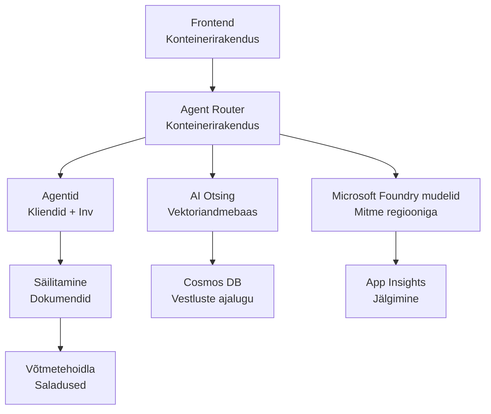

# Jaemüügi mitmeagendi lahendus – infrastruktuuri mall

**5. peatükk: tootmisesse juurutamise pakett**  
- **📚 Kursuse avaleht**: [AZD algajatele](../../README.md)  
- **📖 Seotud peatükk**: [5. peatükk: mitmeagendi tehisintellekti lahendused](../../README.md#-chapter-5-multi-agent-ai-solutions-advanced)  
- **📝 Stsenaariumi juhend**: [Täielik arhitektuur](../retail-scenario.md)  
- **🎯 Kiire juurutamine**: [Ühe klõpsuga juurutamine](../../../../examples/retail-multiagent-arm-template)  

> **⚠️ AINULT INFRASTRUKTUURI MALL**  
> See ARM-mall loob **Azure'i ressursid** mitmeagendi süsteemi jaoks.  
>  
> **Mis juurutatakse (15–25 minutit):**  
> - ✅ Microsoft Foundry mudelid (gpt-4.1, gpt-4.1-mini, manused 3 regioonis)  
> - ✅ AI Search teenus (tühi, valmis indeksi loomiseks)  
> - ✅ Container Apps (kohatäited, valmis teie koodi jaoks)  
> - ✅ Salvestus, Cosmos DB, Key Vault, Application Insights  
>  
> **Mis EI OLE kaasatud (nõuab arendust):**  
> - ❌ Agendi rakenduskood (kliendiagent, laoagent)  
> - ❌ Marsruutimise loogika ja API lõpp-punktid  
> - ❌ Esipaneeli vestluse kasutajaliides  
> - ❌ Otsingu indeksiskeemid ja andmevood  
> - ❌ **Hinnanguline arenduskulu: 80–120 tundi**  
>  
> **Kasuta seda malli kui:**  
> - ✅ Tahad Azure infrastruktuuri mitmeagendi projektiks luua  
> - ✅ Plaanid arendada agendi rakendust eraldi  
> - ✅ Vajad tootmiseks valmis infrastruktuuri lähtebaasi  
>  
> **Ära kasuta kui:**  
> - ❌ Ootad koheselt töötavat mitmeagendi demot  
> - ❌ Otsid täielikke rakenduse koodinäiteid  

## Ülevaade  

See kataloog sisaldab põhjalikku Azure Resource Manager (ARM) malli mitmeagendi klienditoe süsteemi **infrastruktuurialuse** juurutamiseks. Mall loob kõik vajalikud Azure’i teenused, korrektselt konfigureerituna ja omavahel ühendatuna, valmis teie rakenduse arenduseks.  

**Pärast juurutamist on teil:** tootmiseks valmis Azure infrastruktuur  
**Süsteemi täiendamiseks vajate:** agendi koodi, esipaneeli UI-d ja andmete konfiguratsiooni (vt [arhitektuuri juhendit](../retail-scenario.md))  

## 🎯 Mis juurutatakse  

### Põhisinfrastruktuur (seisund pärast juurutamist)

✅ **Microsoft Foundry mudelite teenused** (valmis API kõnede jaoks)  
  - Peamine regioon: gpt-4.1 juurutus (20K TPM mahutavus)  
  - Sekundaarsed regioonid: gpt-4.1-mini juurutus (10K TPM mahutavus)  
  - Tertsiaarne regioon: tekstimanused mudel (30K TPM mahutavus)  
  - Hinnanguregioon: gpt-4.1 hindaja mudel (15K TPM mahutavus)  
  - **Seisund:** Täisfunktsionaalne – saab kohe API kõnesid teha  

✅ **Azure AI Search** (tühi – valmis konfiguratsiooniks)  
  - Vektorotsingu võimekusega  
  - Standardtasemel 1 partitsiooniga, 1 koopiaga  
  - **Seisund:** Teenus töötab, kuid indeks tuleb luua  
  - **Vajalik tegevus:** Loo oma skeemi alusel otsinguindeks  

✅ **Azure Storage Account** (tühi – valmis üleslaadimiseks)  
  - Blob-konteinerid: `documents`, `uploads`  
  - Turvaline konfiguratsioon (ainult HTTPS, avalik juurdepääs keelatud)  
  - **Seisund:** Valmis failide vastuvõtmiseks  
  - **Vajalik tegevus:** Laadi üles tooteandmed ja dokumendid  

⚠️ **Container Apps keskkond** (paigaldatud kohatäite pildid)  
  - Agendi marsruuteri rakendus (nginx vaikimisi pilt)  
  - Esipaneeli rakendus (nginx vaikimisi pilt)  
  - Automaatskaalumine seadistatud (0–10 eksemplari)  
  - **Seisund:** Käimas kohatäite konteinerid  
  - **Vajalik tegevus:** Ehita ja juuruta oma agendi rakendused  

✅ **Azure Cosmos DB** (tühi – valmis andmete jaoks)  
  - Andmebaas ja konteiner valmis konfigureeritud  
  - Madala latentsusega toimingute jaoks optimeeritud  
  - TTL lubatud automaatseks koristamiseks  
  - **Seisund:** Valmis vestluste ajaloo salvestamiseks  

✅ **Azure Key Vault** (valikuline – valmis saladuste jaoks)  
  - Pehme kustutamise funktsioon lubatud  
  - RBAC seadistatud hallatud identiteetidele  
  - **Seisund:** Valmis API võtmete ja ühendusstringide salvestamiseks  

✅ **Application Insights** (valikuline – jälgimine aktiivne)  
  - Ühendatud Log Analytics tööruumiga  
  - Kohandatud mõõdikud ja hoiatused konfigureeritud  
  - **Seisund:** Valmis teie rakenduste telemeetri vastuvõtuks  

✅ **Dokumendi intelligentsus** (valmis API kõnedeks)  
  - S0 tase tootmiskoormustele  
  - **Seisund:** Valmis üleslaaditud dokumentide töötlemiseks  

✅ **Bing Search API** (valmis API kõnedeks)  
  - S1 tase reaalajas otsinguteks  
  - **Seisund:** Valmis veebiotsingupäringute jaoks  

### Juurutusrežiimid  

| Režiim | OpenAI mahutavus | Konteineri eksemplarid | Otsingu tase | Salvestusredundantsus | Parim kasutusala |
|--------|------------------|-----------------------|--------------|-----------------------|------------------|
| **Minimaalne** | 10K–20K TPM | 0–2 koopiat | Alustase | LRS (kohalik) | Arendus/test, õppimine, kontseptsiooni tõestus |
| **Standardsed** | 30K–60K TPM | 2–5 koopiat | Standard | ZRS (tsoon) | Tootmine, mõõdukas liiklus (<10K kasutajat) |
| **Premium** | 80K–150K TPM | 5–10 koopiat, tsoonireduntants | Premium | GRS (geograafiline) | Ettevõte, suur liiklus (>10K kasutajat), 99,99% SLA |

**Kulu mõju:**  
- **Minimaalne → Standard:** umbes 4x kulu suurenemine (100–370 $/kuus → 420–1,450 $/kuus)  
- **Standard → Premium:** umbes 3x kulu suurenemine (420–1,450 $/kuus → 1,150–3,500 $/kuus)  
- **Vali vastavalt:** eeldatav koormus, SLA nõuded, eelarvelised piirangud  

**Mahutavuse planeerimine:**  
- **TPM (märgid minutis):** kogus kõigi mudelijuhtumite kohta  
- **Konteinerite eksemplarid:** automaatskaalumise vahemik (min–max koopiad)  
- **Otsingu tase:** mõjutab päringu jõudlust ja indeksi suuruse piire  

## 📋 Eeltingimused  

### Nõutavad tööriistad  
1. **Azure CLI** (versioon 2.50.0 või uuem)  
   ```bash
   az --version  # Kontrolli versiooni
   az login      # Autendi
   ```
  
2. **Aktiivne Azure tellimus** Omaniku või Panustaja õigustega  
   ```bash
   az account show  # Kontrolli tellimust
   ```
  
### Nõutavad Azure'i kvotad  

Enne juurutamist kontrolli piisavaid kvotasid sihtregioonides:  

```bash
# Kontrolli Microsoft Foundry mudelite saadavust sinu piirkonnas
az cognitiveservices account list-skus \
  --kind OpenAI \
  --location eastus2

# Kontrolli OpenAI krediiti (näide gpt-4.1 kohta)
az cognitiveservices usage list \
  --location eastus2 \
  --query "[?name.value=='OpenAI.Standard.gpt-4.1']"

# Kontrolli Container Appsi krediiti
az provider show \
  --namespace Microsoft.App \
  --query "resourceTypes[?resourceType=='managedEnvironments'].locations"
```
  
**Minimaalsed nõutavad kvotad:**  
- **Microsoft Foundry mudelid:** 3–4 mudelijuhtumit regioonides  
  - gpt-4.1: 20K TPM  
  - gpt-4.1-mini: 10K TPM  
  - text-embedding-ada-002: 30K TPM  
  - **Märkus:** gpt-4.1 võib mõnes regioonis ootenimekirjas olla – kontrolli [mudelite saadavust](https://learn.microsoft.com/azure/ai-services/openai/concepts/models)  
- **Container Apps:** hallatud keskkond + 2–10 konteineri eksemplari  
- **AI Search:** standardtase (baastaset pole vektorotsinguks piisavalt)  
- **Cosmos DB:** standardne etteantud läbilaskevõime  

**Kui kvota ei ole piisav:**  
1. Minge AzurePortaali → Kvotad → Palu tõusu  
2. Või kasuta Azure CLI-d:  
   ```bash
   az support tickets create \
     --ticket-name "OpenAI-Quota-Increase" \
     --severity "minimal" \
     --description "Request quota increase for Microsoft Foundry Models gpt-4.1 in eastus2"
   ```
  
3. Mõtle alternatiivsetele regioonidele, kus on saadavus  

## 🚀 Kiire juurutamine  

### Variant 1: Azure CLI kasutamine  

```bash
# Kopeeri või laadi mallifailid alla
git clone <repository-url>
cd examples/retail-multiagent-arm-template

# Tee juurutusskript käivitatavaks
chmod +x deploy.sh

# Juuruta vaikeväärtustega
./deploy.sh -g myResourceGroup

# Juuruta tootmiseks koos täisfunktsioonidega
./deploy.sh -g myProdRG -e prod -m premium -l eastus2
```
  
### Variant 2: Azure Portaal  

[](https://portal.azure.com/#create/Microsoft.Template/uri/https%3A%2F%2Fraw.githubusercontent.com%2Fmicrosoft%2Fazd-for-beginners%2Fmain%2Fexamples%2Fretail-multiagent-arm-template%2Fazuredeploy.json)  

### Variant 3: Azure CLI otse  

```bash
# Loo ressursside grupp
az group create --name myResourceGroup --location eastus2

# Käivita mall
az deployment group create \
  --resource-group myResourceGroup \
  --template-file azuredeploy.json \
  --parameters azuredeploy.parameters.json
```
  
## ⏱️ Juurutamise ajaskaala  

### Mida oodata  

| Etapp | Kestus | Toimuv |
|-------|--------|--------|
| **Malli valideerimine** | 30–60 sekundit | Azure kontrollib ARM malli süntaksit ja parameetreid |
| **Ressurssigrupi loomine** | 10–20 sekundit | Vajaduse korral loob ressursigrupi |
| **OpenAI loomine** | 5–8 minutit | Loob 3–4 OpenAI kontot ja juurutab mudelid |
| **Container Apps** | 3–5 minutit | Loob keskkonna ja juurutab kohatäitekonteinerid |
| **Otsing ja salvestus** | 2–4 minutit | Loob AI Search teenuse ja salvestuskontod |
| **Cosmos DB** | 2–3 minutit | Loob andmebaasi ja konfigureerib konteinerid |
| **Jälgimisseadistus** | 2–3 minutit | Seadistab Application Insights ja Log Analytics'i |
| **RBAC konfiguratsioon** | 1–2 minutit | Konfigureerib hallatud identiteedid ja õigused |
| **Kogu juurutamine** | **15–25 minutit** | Täielik infrastruktuur valmis |

**Pärast juurutamist:**  
- ✅ **Infrastruktuur valmis:** kõik Azure teenused on loodud ja töös  
- ⏱️ **Rakenduse arendus:** 80–120 tundi (teie vastutus)  
- ⏱️ **Indeksi konfiguratsioon:** 15–30 minutit (vajab teie skeemi)  
- ⏱️ **Andmete üleslaadimine:** sõltub andmekogumi suurusest  
- ⏱️ **Testimine ja valideerimine:** 2–4 tundi  

---

## ✅ Kontrolli juurutamise edukust  

### Samm 1: Kontrolli ressursside loomist (2 minutit)  

```bash
# Kontrolli, kas kõik ressursid paigaldati edukalt
az resource list \
  --resource-group myResourceGroup \
  --query "[?provisioningState!='Succeeded'].{Name:name, Status:provisioningState, Type:type}" \
  --output table
```
  
**Oodatav:** tühi tabel (kõik ressursid näitavad staatust "Succeeded")  

### Samm 2: Kontrolli Microsoft Foundry mudelite juurutamist (3 minutit)  

```bash
# Loetle kõik OpenAI kontod
az cognitiveservices account list \
  --resource-group myResourceGroup \
  --query "[?kind=='OpenAI'].{Name:name, Location:location, Status:properties.provisioningState}" \
  --output table

# Kontrolli mudelite juurutusi peamiseks piirkonnaks
OPENAI_NAME=$(az cognitiveservices account list \
  --resource-group myResourceGroup \
  --query "[?kind=='OpenAI'] | [0].name" -o tsv)

az cognitiveservices account deployment list \
  --name $OPENAI_NAME \
  --resource-group myResourceGroup \
  --output table
```
  
**Oodatav:**  
- 3–4 OpenAI kontot (peamine, sekundaarne, tertsiaarne, hinnanguregioon)  
- 1–2 mudelijuhtumit iga konto kohta (gpt-4.1, gpt-4.1-mini, text-embedding-ada-002)  

### Samm 3: Testi infrastruktuuri lõpp-punkte (5 minutit)  

```bash
# Hangi konteineri rakenduse URL-id
az containerapp list \
  --resource-group myResourceGroup \
  --query "[].{Name:name, URL:properties.configuration.ingress.fqdn, Status:properties.runningStatus}" \
  --output table

# Testi ruuteri lõpp-punkti (vastab kohatäitja pilt)
ROUTER_URL=$(az containerapp show \
  --name retail-router \
  --resource-group myResourceGroup \
  --query "properties.configuration.ingress.fqdn" -o tsv)

echo "Testing: https://$ROUTER_URL"
curl -I https://$ROUTER_URL || echo "Container running (placeholder image - expected)"
```
  
**Oodatav:**  
- Container Apps näitab staatust "Running"  
- Kohatäitena nginx vastab HTTP 200 või 404 (rakenduse kood puudub)  

### Samm 4: Kontrolli Microsoft Foundry mudelite API juurdepääsu (3 minutit)  

```bash
# Saa OpenAI lõpp-punkt ja võti
OPENAI_ENDPOINT=$(az cognitiveservices account show \
  --name $OPENAI_NAME \
  --resource-group myResourceGroup \
  --query "properties.endpoint" -o tsv)

OPENAI_KEY=$(az cognitiveservices account keys list \
  --name $OPENAI_NAME \
  --resource-group myResourceGroup \
  --query "key1" -o tsv)

# Testi gpt-4.1 paigaldust
curl "${OPENAI_ENDPOINT}openai/deployments/gpt-4.1/chat/completions?api-version=2024-08-01-preview" \
  -H "Content-Type: application/json" \
  -H "api-key: $OPENAI_KEY" \
  -d '{
    "messages": [{"role": "user", "content": "Say hello"}],
    "max_tokens": 10
  }'
```
  
**Oodatav:** JSON vastus vestluse lõpetamisega (kinnitab OpenAI funktsionaalsust)  

### Mis töötab vs mis mitte  

**✅ Töötab pärast juurutamist:**  
- Microsoft Foundry mudelid on juurutatud ja API kõned vastu võetud  
- AI Search teenus töötab (tühi, indeks veel puudub)  
- Container Apps töötavad (nginx kohatäited)  
- Salvestuskontod on kättesaadavad ja valmis üleslaadimiseks  
- Cosmos DB valmis andmete töötlemiseks  
- Application Insights kogub infrastruktuuri telemeetriaandmeid  
- Key Vault valmis saladuste hoidmiseks  

**❌ Ei tööta veel (nõuab arendust):**  
- Agendi lõpp-punktid (rakenduskood puudub)  
- Vestluse funktsionaalsus (nõuab frontendi ja backendi rakendust)  
- Otsingupäringud (otsinguindeks puudub)  
- Dokumentide töötlemise pipelines (andmed üles laadimata)  
- Kohandatud telemeetria (nõuab rakenduse instrumentatsiooni)  

**Järgmised sammud:** vaata [järeltöötluse konfiguratsiooni](../../../../examples/retail-multiagent-arm-template), et arendada ja juurutada oma rakendus  

---

## ⚙️ Konfiguratsiooni valikud  

### Malli parameetrid  

| Parameeter | Tüüp | Vaikeväärtus | Kirjeldus |
|------------|-------|--------------|-----------|
| `projectName` | string | "retail" | Kõikide ressursside eesliide |
| `location` | string | Ressursside grupi asukoht | Peamine juurutuspiirkond |
| `secondaryLocation` | string | "westus2" | Sekundaarne regioon mitmeregiooni juurutuseks |
| `tertiaryLocation` | string | "francecentral" | Regioon manusemudelitele |
| `environmentName` | string | "dev" | Keskkonna määrang (dev/staging/prod) |
| `deploymentMode` | string | "standard" | Juurutuse konfiguratsioon (minimal/standard/premium) |
| `enableMultiRegion` | bool | true | Luba mitmeregiooniline juurutus |
| `enableMonitoring` | bool | true | Luba Application Insights ja logimine |
| `enableSecurity` | bool | true | Luba Key Vault ja täiendav turvalisus |

### Parameetrite kohandamine  

Muuda faili `azuredeploy.parameters.json`:  

```json
{
  "$schema": "https://schema.management.azure.com/schemas/2019-04-01/deploymentParameters.json#",
  "contentVersion": "1.0.0.0",
  "parameters": {
    "projectName": {
      "value": "mycompany"
    },
    "environmentName": {
      "value": "prod"
    },
    "deploymentMode": {
      "value": "premium"
    },
    "location": {
      "value": "eastus2"
    }
  }
}
```
  
## 🏗️ Arhitektuuri ülevaade  


## 📖 Juurutusskripti kasutamine  

`deploy.sh` skript pakub interaktiivset juurutuskogemust:  

```bash
# Näita abi
./deploy.sh --help

# Põhjalik kasutuselevõtt
./deploy.sh -g myResourceGroup

# Täiustatud kasutuselevõtt kohandatud seadistustega
./deploy.sh \
  -g myProductionRG \
  -p companyname \
  -e prod \
  -m premium \
  -l eastus2

# Arenduse kasutuselevõtt ilma mitme regioonita
./deploy.sh \
  -g myDevRG \
  -e dev \
  -m minimal \
  --no-multi-region \
  --no-security
```
  
### Skripti omadused  

- ✅ **Eeltingimuste kontroll** (Azure CLI, sisselogimise olek, malli failid)  
- ✅ **Ressurssigrupi haldus** (loob kui puudub)  
- ✅ **Malli valideerimine** enne juurutamist  
- ✅ **Edenemise jälgimine** värvilise väljundiga  
- ✅ **Juurutamise väljundid** kuvamine  
- ✅ **Pärast juurutamist juhised**  

## 📊 Jälgimine juurutamisel  

### Kontrolli juurutamise olekut  

```bash
# Loenda juurutusi
az deployment group list --resource-group myResourceGroup --output table

# Hangi juurutuse üksikasjad
az deployment group show \
  --resource-group myResourceGroup \
  --name retail-deployment-YYYYMMDD-HHMMSS

# Jälgi juurutuse edenemist
az deployment group create \
  --resource-group myResourceGroup \
  --template-file azuredeploy.json \
  --parameters azuredeploy.parameters.json \
  --verbose
```
  
### Juurutamise väljundid  

Pärast edukat juurutamist on saadaval järgmised väljundid:  

- **Esipaneeli URL:** Avalik veebiliidese lõpp-punkt  
- **Marsruuteri URL:** Agendi marsruuteri API lõpp-punkt  
- **OpenAI lõpp-punktid:** Peamine ja sekundaarne OpenAI teenuse lõpp-punkt  
- **Otsingu teenus:** Azure AI Search teenuse lõpp-punkt  
- **Salvestuskonto:** Salvestuskonto nimi dokumentide jaoks  
- **Key Vault:** Key Vault nimi (kui lubatud)  
- **Application Insights:** Jälgimisteenus nimega (kui lubatud)  

## 🔧 Pärast juurutamist: järgmised sammud  

> **📝 Tähtis:** Infrastruktuur on juurutatud, kuid teil tuleb arendada ja paigaldada rakenduse kood.

### 1. etapp: Arendage agendi rakendused (Teie vastutus)

ARM mall loob **tühjad Container Apps** koos kohatäiteks nginx piltidega. Te peate:

**Nõutav arendus:**
1. **Agendi rakendamine** (30-40 tundi)
   - Klienditeeninduse agent koos gpt-4.1 integratsiooniga
   - Inventari agent koos gpt-4.1-mini integratsiooniga
   - Agendi marsruutimise loogika

2. **Eesliidese arendus** (20-30 tundi)
   - Vestlusliidese kasutajaliides (React/Vue/Angular)
   - Failide üleslaadimise funktsionaalsus
   - Vastuste kuvamine ja vormindamine

3. **Taustateenused** (12-16 tundi)
   - FastAPI või Express marsruutija
   - Autentimismiddleware
   - Telemeetria integratsioon

**Vaadake:** [Arhitektuuri juhendit](../retail-scenario.md) üksikasjalike rakendusmustrite ja koodinäidete jaoks

### 2. etapp: Konfigureerige tehisintellekti otsingu indeks (15-30 minutit)

Looge otsingu indeks, mis vastab teie andmemudelile:

```bash
# Hangi otsinguteenuse üksikasjad
SEARCH_NAME=$(az search service list \
  --resource-group myResourceGroup \
  --query "[0].name" -o tsv)

SEARCH_KEY=$(az search admin-key show \
  --service-name $SEARCH_NAME \
  --resource-group myResourceGroup \
  --query "primaryKey" -o tsv)

# Loo indeks oma skeemiga (näide)
curl -X POST "https://${SEARCH_NAME}.search.windows.net/indexes?api-version=2023-11-01" \
  -H "Content-Type: application/json" \
  -H "api-key: ${SEARCH_KEY}" \
  -d '{
    "name": "products",
    "fields": [
      {"name": "id", "type": "Edm.String", "key": true},
      {"name": "title", "type": "Edm.String", "searchable": true},
      {"name": "content", "type": "Edm.String", "searchable": true},
      {"name": "category", "type": "Edm.String", "filterable": true},
      {"name": "content_vector", "type": "Collection(Edm.Single)", 
       "searchable": true, "dimensions": 1536, "vectorSearchProfile": "default"}
    ],
    "vectorSearch": {
      "algorithms": [{"name": "default", "kind": "hnsw"}],
      "profiles": [{"name": "default", "algorithm": "default"}]
    }
  }'
```

**Ressursid:**
- [Tehisintellekti otsingu indeksi skeemi disain](https://learn.microsoft.com/azure/search/search-what-is-an-index)
- [Vektoriotsingu seadistamine](https://learn.microsoft.com/azure/search/vector-search-how-to-create-index)

### 3. etapp: Laadige andmed üles (Aeg varieerub)

Kui teil on tooteandmed ja dokumendid:

```bash
# Hangi salvestuskonto üksikasjad
STORAGE_NAME=$(az storage account list \
  --resource-group myResourceGroup \
  --query "[0].name" -o tsv)

STORAGE_KEY=$(az storage account keys list \
  --account-name $STORAGE_NAME \
  --resource-group myResourceGroup \
  --query "[0].value" -o tsv)

# Laadi oma dokumendid üles
az storage blob upload-batch \
  --destination documents \
  --source /path/to/your/product/docs \
  --account-name $STORAGE_NAME \
  --account-key $STORAGE_KEY

# Näide: Laadi üles üksik fail
az storage blob upload \
  --container-name documents \
  --name "product-manual.pdf" \
  --file /path/to/product-manual.pdf \
  --account-name $STORAGE_NAME \
  --account-key $STORAGE_KEY
```

### 4. etapp: Koostage ja paigaldage oma rakendused (8-12 tundi)

Kui olete oma agendi koodi arendanud:

```bash
# 1. Loo Azure konteineriregister (vajadusel)
az acr create \
  --name myregistry \
  --resource-group myResourceGroup \
  --sku Basic

# 2. Koosta ja saada agentrouteri pilt
docker build -t myregistry.azurecr.io/agent-router:v1 /path/to/your/router/code
az acr login --name myregistry
docker push myregistry.azurecr.io/agent-router:v1

# 3. Koosta ja saada esipaneeli pilt
docker build -t myregistry.azurecr.io/frontend:v1 /path/to/your/frontend/code
docker push myregistry.azurecr.io/frontend:v1

# 4. Uuenda konteinerirakendusi oma piltidega
az containerapp update \
  --name retail-router \
  --resource-group myResourceGroup \
  --image myregistry.azurecr.io/agent-router:v1

az containerapp update \
  --name retail-frontend \
  --resource-group myResourceGroup \
  --image myregistry.azurecr.io/frontend:v1

# 5. Konfigureeri keskkonnamuutujad
az containerapp update \
  --name retail-router \
  --resource-group myResourceGroup \
  --set-env-vars \
    OPENAI_ENDPOINT=secretref:openai-endpoint \
    OPENAI_KEY=secretref:openai-key \
    SEARCH_ENDPOINT=secretref:search-endpoint \
    SEARCH_KEY=secretref:search-key
```

### 5. etapp: Testige oma rakendust (2-4 tundi)

```bash
# Hangi oma rakenduse URL
ROUTER_URL=$(az containerapp show \
  --name retail-router \
  --resource-group myResourceGroup \
  --query "properties.configuration.ingress.fqdn" -o tsv)

# Testi agendi lõpp-punkt (pärast sinu koodi juurutamist)
curl -X POST "https://${ROUTER_URL}/chat" \
  -H "Content-Type: application/json" \
  -d '{
    "message": "Hello, I need help with my order",
    "agent": "customer"
  }'

# Kontrolli rakenduse logisid
az containerapp logs show \
  --name retail-router \
  --resource-group myResourceGroup \
  --follow
```

### Rakenduse ressursid

**Arhitektuur ja disain:**
- 📖 [Täielik arhitektuuri juhend](../retail-scenario.md) – üksikasjalikud rakendusmustrid
- 📖 [Mitme agendi disainimustrid](https://learn.microsoft.com/azure/architecture/ai-ml/guide/multi-agent-systems)

**Koodinäited:**
- 🔗 [Microsoft Foundry mudelite vestlusnäide](https://github.com/Azure-Samples/azure-search-openai-demo) – RAG muster
- 🔗 [Semantic Kernel](https://github.com/microsoft/semantic-kernel) – Agendi raamistik (C#)
- 🔗 [LangChain Azure](https://github.com/langchain-ai/langchain) – Agendi orkestreerimine (Python)
- 🔗 [AutoGen](https://github.com/microsoft/autogen) – Mitme agendi vestlused

**Hinnanguline kogu töömaht:**
- Infrastruktuuri juurutamine: 15-25 minutit (✅ Tehtud)
- Rakenduse arendus: 80-120 tundi (🔨 Teie töö)
- Testimine ja optimeerimine: 15-25 tundi (🔨 Teie töö)

## 🛠️ Probleemide lahendamine

### Levinumad probleemid

#### 1. Microsoft Foundry mudelite kvota saab täis

```bash
# Kontrolli praegust kvota kasutust
az cognitiveservices usage list --location eastus2

# Taotle kvota suurendamist
az support tickets create \
  --ticket-name "OpenAI-Quota-Increase" \
  --severity "minimal" \
  --description "Request quota increase for Microsoft Foundry Models in region X"
```

#### 2. Container Apps juurutus ebaõnnestus

```bash
# Kontrolli konteineri rakenduse logisid
az containerapp logs show \
  --name retail-router \
  --resource-group myResourceGroup \
  --follow

# Taaskäivita konteineri rakendus
az containerapp revision restart \
  --name retail-router \
  --resource-group myResourceGroup
```

#### 3. Otsinguteenuse initsialiseerimine

```bash
# Kontrolli otsinguteenuse olekut
az search service show \
  --name <search-service-name> \
  --resource-group myResourceGroup

# Testi otsinguteenuse ühenduvust
curl -X GET "https://<search-service-name>.search.windows.net/indexes?api-version=2023-11-01" \
  -H "api-key: <search-admin-key>"
```

### Juurutuse valideerimine

```bash
# Kontrolli, et kõik ressursid oleksid loodud
az resource list \
  --resource-group myResourceGroup \
  --output table

# Kontrolli ressursi tervist
az resource list \
  --resource-group myResourceGroup \
  --query "[?provisioningState!='Succeeded'].{Name:name, Status:provisioningState, Type:type}" \
  --output table
```

## 🔐 Turvaküsimused

### Võtmete haldus
- Kõik saladused salvestatakse Azure Key Vaulti (kui see on lubatud)
- Container apps kasutavad autentimiseks hallatud identiteeti
- Salvestuskontodel on turvalised vaikeseaded (ainult HTTPS, avalikku blobide ligipääsu pole)

### Võrgu turvalisus
- Container apps kasutavad võimaluse korral sisemist võrku
- Otsinguteenuse konfiguratsioon privaatsete otspunktidega
- Cosmos DB on seadistatud minimaalsete vajalike õigustega

### RBAC konfiguratsioon
```bash
# Määrake hallatud identiteedi jaoks vajalikud rollid
az role assignment create \
  --assignee <container-app-managed-identity> \
  --role "Cognitive Services OpenAI User" \
  --scope <openai-resource-id>
```

## 💰 Kulu optimeerimine

### Kulu hinnangud (kuus, USD)

| Režiim    | OpenAI   | Container Apps | Otsing | Salvestus | Kogu hinnang |
|-----------|----------|----------------|--------|-----------|--------------|
| Minimaalne| $50-200  | $20-50         | $25-100| $5-20     | $100-370     |
| Standard  | $200-800 | $100-300       | $100-300| $20-50   | $420-1450    |
| Premium   | $500-2000| $300-800       | $300-600| $50-100  | $1150-3500   |

### Kulu jälgimine

```bash
# Sea eelarvehoiatused üles
az consumption budget create \
  --account-name <subscription-id> \
  --budget-name "retail-budget" \
  --amount 500 \
  --time-grain Monthly \
  --start-date 2024-01-01 \
  --end-date 2024-12-31
```

## 🔄 Uuendused ja hooldus

### Malli uuendused
- ARM malli failide versioonikontroll
- Muudatuste testimine esmalt arenduskeskkonnas
- Kasutage värskendamiseks inkrementaalset juurutusrežiimi

### Ressursside uuendused
```bash
# Uuenda uute parameetritega
az deployment group create \
  --resource-group myResourceGroup \
  --template-file azuredeploy.json \
  --parameters azuredeploy.parameters.json \
  --mode Incremental
```

### Varundamine ja taastamine
- Cosmos DB automaatne varundamine lubatud
- Key Vault pehme kustutamise funktsioon lubatud
- Container appi revisionid säilitatakse tagasipöördumiseks

## 📞 Toetus

- **Malli probleemid**: [GitHub Issues](https://github.com/microsoft/azd-for-beginners/issues)
- **Azure tugi**: [Azure tugiportaal](https://portal.azure.com/#blade/Microsoft_Azure_Support/HelpAndSupportBlade)
- **Kogukond**: [Azure AI Discord](https://discord.gg/microsoft-azure)

---

**⚡ Valmis oma mitme-agendi lahendust juurutama?**

Alustage käsuga: `./deploy.sh -g myResourceGroup`

---

<!-- CO-OP TRANSLATOR DISCLAIMER START -->
**Vastutusest loobumine**:
See dokument on tõlgitud tehisintellekti tõlketeenuse [Co-op Translator](https://github.com/Azure/co-op-translator) abil. Kuigi püüame täpsust, palun pidage meeles, et automaatsed tõlked võivad sisaldada vigu või ebatäpsusi. Originaaldokument selle emakeeles tuleks pidada autoriteetseks allikaks. Olulise info puhul soovitatakse kasutada professionaalset inimtõlget. Me ei vastuta mingite arusaamatuste või valesti mõistmiste eest, mis võivad sellest tõlkest tekkida.
<!-- CO-OP TRANSLATOR DISCLAIMER END -->