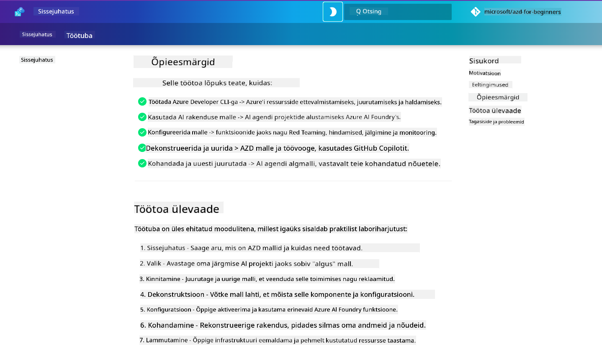

<!--
CO_OP_TRANSLATOR_METADATA:
{
  "original_hash": "9cc966416ab431c38b2ab863884b196c",
  "translation_date": "2025-10-11T15:41:53+00:00",
  "source_file": "workshop/README.md",
  "language_code": "et"
}
-->
# AZD AI Arendajate Töötuba

Tere tulemast praktilisse töötuppa, kus õpitakse Azure Developer CLI (AZD) kasutamist, keskendudes AI rakenduste juurutamisele. See töötuba aitab teil omandada praktilisi teadmisi AZD mallide kohta 3 sammuga:

1. **Avastamine** - leia endale sobiv mall.
1. **Juurutamine** - juuruta ja kinnita, et see töötab.
1. **Kohandamine** - muuda ja täiusta, et see vastaks sinu vajadustele!

Töötoa käigus tutvustatakse ka põhilisi arendustööriistu ja töövooge, mis aitavad teil sujuvamaks muuta kogu arendusteekonda.

<br/>

## Brauseripõhine juhend

Töötoa õppetunnid on Markdownis. Saate neid otse GitHubis sirvida või avada brauseripõhise eelvaate, nagu alloleval ekraanipildil näidatud.



Selle valiku kasutamiseks - tehke repositooriumist oma profiilile fork ja käivitage GitHub Codespaces. Kui VS Code terminal on aktiivne, sisestage järgmine käsk:

```bash title="" linenums="0"
mkdocs serve > /dev/null 2>&1 &
```

Mõne sekundi pärast ilmub hüpikaken. Valige valik `Open in browser`. Veebipõhine juhend avaneb nüüd uues brauseri vahekaardis. Selle eelvaate eelised:

1. **Sisseehitatud otsing** - leidke märksõnu või õppetunde kiiresti.
1. **Kopeerimisikoon** - hõljutage koodiplokkide kohal, et näha seda valikut.
1. **Teema vahetus** - lülitage tumeda ja heleda teema vahel.
1. **Abi saamine** - klõpsake jaluses Discordi ikooni, et liituda!

<br/>

## Töötoa ülevaade

**Kestus:** 3-4 tundi  
**Tase:** Algaja kuni kesktase  
**Eeltingimused:** Azure'i, AI kontseptsioonide, VS Code'i ja käsureatööriistade tundmine.

See on praktiline töötuba, kus õpitakse läbi tegevuse. Kui olete harjutused lõpetanud, soovitame üle vaadata AZD Algajatele õppekava, et jätkata oma õpiteekonda turvalisuse ja tootlikkuse parimate tavadega.

| Aeg | Moodul  | Eesmärk |
|:---|:---|:---|
| 15 min | [Sissejuhatus](docs/instructions/0-Introduction.md) | Seadke eesmärgid, mõistke sihte |
| 30 min | [Vali AI Mall](docs/instructions/1-Select-AI-Template.md) | Uurige valikuid ja valige alustamiseks mall | 
| 30 min | [Kinnita AI Mall](docs/instructions/2-Validate-AI-Template.md) | Juurutage vaikimisi lahendus Azure'is |
| 30 min | [Dekonstrueeri AI Mall](docs/instructions/3-Deconstruct-AI-Template.md) | Uurige struktuuri ja konfiguratsiooni |
| 30 min | [Konfigureeri AI Mall](docs/instructions/4-Configure-AI-Template.md) | Aktiveerige ja proovige saadaolevaid funktsioone |
| 30 min | [Kohanda AI Mall](docs/instructions/5-Customize-AI-Template.md) | Kohandage mall vastavalt oma vajadustele |
| 30 min | [Infrastruktuuri lammutamine](docs/instructions/6-Teardown-Infrastructure.md) | Puhastage ja vabastage ressursid |
| 15 min | [Kokkuvõte ja järgmised sammud](docs/instructions/7-Wrap-up.md) | Õppematerjalid, töötoa väljakutse |

<br/>

## Mida õpid

AZD malli võib pidada õppimise liivakastiks, kus uurida erinevaid võimalusi ja tööriistu Azure AI Foundry lõpp-to-end arenduseks. Töötoa lõpuks peaks teil olema intuitiivne arusaam erinevatest tööriistadest ja kontseptsioonidest selles kontekstis.

| Kontseptsioon  | Eesmärk |
|:---|:---|
| **Azure Developer CLI** | Mõista tööriista käske ja töövooge |
| **AZD Mallid**| Mõista projekti struktuuri ja konfiguratsiooni |
| **Azure AI Agent**| Azure AI Foundry projekti ettevalmistamine ja juurutamine |
| **Azure AI Otsing**| Konteksti inseneri võimaldamine agentidega |
| **Jälgitavus**| Uurige jälgimist, monitooringut ja hindamisi |
| **Punane meeskond**| Uurige vastandlikku testimist ja leevendusi |

<br/>

## Töötoa struktuur

Töötuba on üles ehitatud viisil, mis viib teid teekonnale alates malli avastamisest kuni juurutamise, dekonstrueerimise ja kohandamiseni - kasutades ametlikku [AI Agentidega alustamine](https://github.com/Azure-Samples/get-started-with-ai-agents) algusmalli.

### [Moodul 1: Vali AI Mall](docs/instructions/1-Select-AI-Template.md) (30 min)

- Mis on AI Mallid?
- Kust leida AI Malle?
- Kuidas alustada AI Agentide loomist?
- **Labor**: Kiirstart GitHub Codespaces'iga

### [Moodul 2: Kinnita AI Mall](docs/instructions/2-Validate-AI-Template.md) (30 min)

- Mis on AI Malli arhitektuur?
- Mis on AZD arendustöövoog?
- Kuidas saada abi AZD arendusega?
- **Labor**: Juurutage ja kinnitage AI Agentide mall

### [Moodul 3: Dekonstrueeri AI Mall](docs/instructions/3-Deconstruct-AI-Template.md) (30 min)

- Uurige oma keskkonda `.azure/` kaustas
- Uurige oma ressursside seadistust `infra/` kaustas
- Uurige oma AZD konfiguratsiooni `azure.yaml` failides
- **Labor**: Muutke keskkonnamuutujaid ja juurutage uuesti

### [Moodul 4: Konfigureeri AI Mall](docs/instructions/4-Configure-AI-Template.md) (30 min)
- Uurige: Retrieval Augmented Generation
- Uurige: Agentide hindamine ja punane meeskond
- Uurige: Jälgimine ja monitooring
- **Labor**: Uurige AI Agent + jälgitavust 

### [Moodul 5: Kohanda AI Mall](docs/instructions/5-Customize-AI-Template.md) (30 min)
- Määratlege: PRD koos stsenaariumi nõuetega
- Konfigureerige: Keskkonnamuutujad AZD jaoks
- Rakendage: Elutsükli konksud lisatööde jaoks
- **Labor**: Kohandage mall minu stsenaariumi jaoks

### [Moodul 6: Infrastruktuuri lammutamine](docs/instructions/6-Teardown-Infrastructure.md) (30 min)
- Kokkuvõte: Mis on AZD Mallid?
- Kokkuvõte: Miks kasutada Azure Developer CLI-d?
- Järgmised sammud: Proovige teist malli!
- **Labor**: Ressursside eemaldamine ja puhastamine

<br/>

## Töötoa väljakutse

Kas soovite end rohkem proovile panna? Siin on mõned projektiideed - või jagage oma ideid meiega!!

| Projekt | Kirjeldus |
|:---|:---|
|1. **Dekonstrueeri keeruline AI Mall** | Kasutage töövoogu ja tööriistu, mida me kirjeldasime, ning proovige juurutada, kinnitada ja kohandada teist AI lahenduse malli. _Mida õppisite?_|
|2. **Kohandage oma stsenaariumiga**  | Proovige kirjutada PRD (tootenõuete dokument) teise stsenaariumi jaoks. Seejärel kasutage GitHub Copilotit oma malli repositooriumis Agent Mode'is - ja paluge sellel genereerida kohandamise töövoog teie jaoks. _Mida õppisite? Kuidas saaksite neid ettepanekuid täiustada?_|
| | |

## Tagasiside?

1. Postitage selle repositooriumi probleem - märgistage see `Workshop` mugavuse huvides.
1. Liituge Azure AI Foundry Discordiga - ühenduge oma eakaaslastega!

| | | 
|:---|:---|
| **📚 Kursuse avaleht**| [AZD Algajatele](../README.md)|
| **📖 Dokumentatsioon** | [AI mallidega alustamine](https://learn.microsoft.com/en-us/azure/ai-foundry/how-to/develop/ai-template-get-started)|
| **🛠️AI Mallid** | [Azure AI Foundry Mallid](https://ai.azure.com/templates) |
|**🚀 Järgmised sammud** | [Võtke väljakutse vastu](../../../workshop) |
| | |

<br/>

---

**Eelmine:** [AI Tõrkeotsingu Juhend](../docs/troubleshooting/ai-troubleshooting.md) | **Järgmine:** Alustage [Labor 1: AZD Põhitõed](../../../workshop/lab-1-azd-basics)

**Valmis alustama AI rakenduste loomist AZD-ga?**

[Alustage Labor 1: AZD Alused →](./lab-1-azd-basics/README.md)

---

**Lahtiütlus**:  
See dokument on tõlgitud AI tõlketeenuse [Co-op Translator](https://github.com/Azure/co-op-translator) abil. Kuigi püüame tagada täpsust, palume arvestada, et automaatsed tõlked võivad sisaldada vigu või ebatäpsusi. Algne dokument selle algses keeles tuleks pidada autoriteetseks allikaks. Olulise teabe puhul soovitame kasutada professionaalset inimtõlget. Me ei vastuta selle tõlke kasutamisest tulenevate arusaamatuste või valesti tõlgenduste eest.