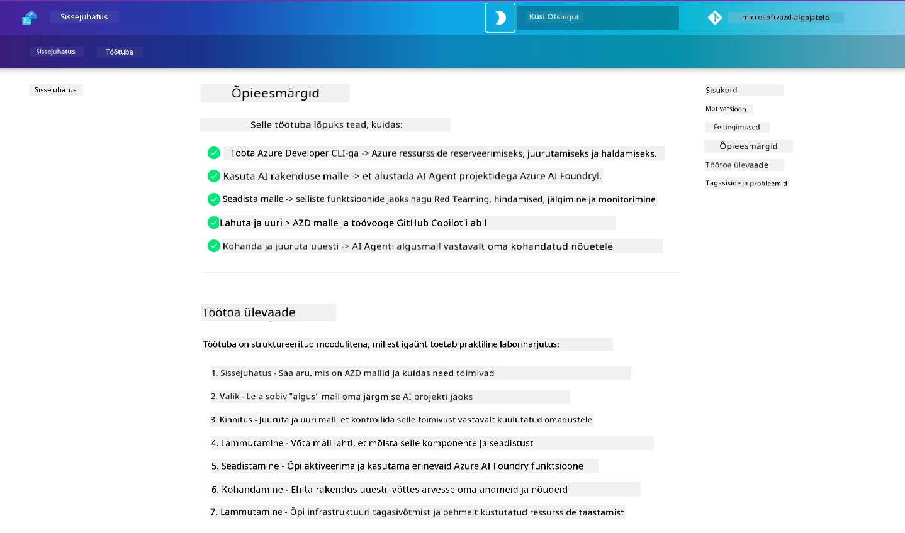

<div align="center">
  <div style="background: linear-gradient(135deg, #0078d4, #106ebe); border-radius: 10px; padding: 20px; margin: 20px 0; box-shadow: 0 4px 15px rgba(0, 120, 212, 0.3); border: 2px solid #005a9e;">
    <h2 style="color: white; margin: 0; font-size: 24px; text-shadow: 1px 1px 2px rgba(0,0,0,0.3);">
      🎯 AZD AI arendajate töötoas
    </h2>
    <p style="color: white; margin: 10px 0 0 0; font-size: 16px; text-shadow: 1px 1px 2px rgba(0,0,0,0.3);">
      <strong>Käed-külge töötuba, kus ehitada tehisintellektil põhinevaid rakendusi Azure Developer CLI abil.</strong><br>
      Läbi vii 7 moodulit, et valda AZD malle ja AI juurutamise töövooge.
    </p>
    <div style="margin-top: 15px;">
      <span style="background: rgba(255,255,255,0.2); padding: 5px 10px; border-radius: 15px; color: white; font-size: 14px;">
        📅 Viimati uuendatud: märts 2026
      </span>
    </div>
  </div>
</div>

# AZD AI arendajate töötoas

Tere tulemast praktilisse töötoasse, kus õpitakse Azure Developer CLI-d (AZD) AI-rakenduste juurutamiseks. See töötuba aitab sul praktiliselt mõista AZD malle 3 sammu kaudu:

1. **Avastus** – leia enda jaoks sobiv mall.
1. **Juurutamine** – juuruta ja kontrolli, et see töötab
1. **Kohandamine** – muuda ja kohanda, et see oleks sinu oma!

Töötoa jooksul tutvustatakse ka põhiarendustööriistu ja töövooge, et aidata sul sujuvamalt lõpust-lõpuni arendusprotsess läbi viia.

<br/>

## Brauseripõhine juhend

Töötoa õppetunnid on Markdowni formaadis. Neid saab otse GitHubis sirvida – või käivitada brauseripõhine eelvaade nagu alloleval ekraanipildil näidatud.



Selle valiku kasutamiseks—tee repositoriumist fork oma profiilile ja käivita GitHub Codespaces. Kui VS Code terminal on aktiivne, tipi see käsk:

See brauseripõhine eelvaade töötab GitHub Codespacesis, arenduskonteinerites või lokaalses kloonis, kus on paigaldatud Python ja MkDocs.

```bash title="" linenums="0"
mkdocs serve > /dev/null 2>&1 &
```

Mõne sekundi pärast näed hüpikdialoogi. Vali valik `Open in browser`. Veebipõhine juhend avaneb nüüd uues brauseri kaardis. Selle eelvaate eelised:

1. **Sisseehitatud otsing** – leia võtmesõnu või õppetunde kiiresti.
1. **Kopeerimisikoon** – hoia kursorit koodiplokkidel, et näha seda valikut
1. **Teemavalik** – vaheta tumeda ja heleda teema vahel
1. **Abi saamine** – klõpsa jaluse Discordi ikooni, et liituda!

<br/>

## Töötoa ülevaade

**Kestus:** 3-4 tundi  
**Tase:** Algaja kuni kesktase  
**Eelteadmised:** Tutvumine Azure’i, AI kontseptsioonide, VS Code’i ja käsureatööriistadega.

See on praktiline töötuba, kus õpid tegevuste kaudu. Kui oled harjutused lõpetanud, soovitame läbida AZD algajatele kursuse, et jätkata õppimist turvalisuse ja tootlikkuse parimate tavade osas.

| Aeg | Moodul  | Eesmärk |
|:---|:---|:---|
| 15 min | [Sissejuhatus](docs/instructions/0-Introduction.md) | Pane paika eesmärgid |
| 30 min | [AI malli valimine](docs/instructions/1-Select-AI-Template.md) | Uuri võimalusi ja vali stardimall | 
| 30 min | [AI malli valideerimine](docs/instructions/2-Validate-AI-Template.md) | Juuruta vaike-lahendus Azure’i |
| 30 min | [AI malli lagundamine](docs/instructions/3-Deconstruct-AI-Template.md) | Uuri struktuuri ja seadistust |
| 30 min | [AI malli konfigureerimine](docs/instructions/4-Configure-AI-Template.md) | Aktiveeri ja proovi funktsioone |
| 30 min | [AI malli kohandamine](docs/instructions/5-Customize-AI-Template.md) | Kohanda malli oma vajadustele |
| 30 min | [I infrastruktuuri eemaldamine](docs/instructions/6-Teardown-Infrastructure.md) | Puhasta ja vabasta ressursid |
| 15 min | [Kokkuvõte ja järgmised sammud](docs/instructions/7-Wrap-up.md) | Õppematerjalid, töötoa väljakutse |

<br/>

## Mida sa õpid

Vaata AZD malli kui õpiharjutuste platsina, kus uurida erinevaid võimalusi ja tööriistu Microsoft Foundry lõpp-lõpuni arenduseks. Selle töötoa lõpuks peaks sul olema intuitiivne arusaam erinevatest tööriistadest ning kontseptsioonidest selles kontekstis.

| Kontseptsioon | Eesmärk |
|:---|:---|
| **Azure Developer CLI** | Mõista tööriistu ja töövooge|
| **AZD mallid**| Mõista projekti struktuuri ja seadistusi|
| **Azure AI Agent**| Juuruta Microsoft Foundry projekt |
| **Azure AI Search**| Võimalda konteksti inseneeri agentidega |
| **Jälgitavus**| Uuri jälgimist, monitooringut ja hindamisi |
| **Red Teaming**| Uuri vastuhakkamistestimist ja leevendusi |

<br/>

## Töötoa ülesehitus

Töötuba on üles ehitatud nii, et juhatab sind mallide leidmisest, juurutamisest, lagundamisest ja kohandamisest mööda – kasutades aluseks ametlikku [Getting Started with AI Agents](https://github.com/Azure-Samples/get-started-with-ai-agents) stardimalli.

### [Moodul 1: AI malli valimine](docs/instructions/1-Select-AI-Template.md) (30 min)

- Mis on AI mallid?
- Kust leida AI malle?
- Kuidas alustada AI agentide loomist?
- **Lab**: Kiirstart Codespacesis või arenduskonteineris

### [Moodul 2: AI malli valideerimine](docs/instructions/2-Validate-AI-Template.md) (30 min)

- Mis on AI malli arhitektuur?
- Mis on AZD arendusprotsess?
- Kuidas saada abi AZD arenduseks?
- **Lab**: Juuruta ja valideeri AI agentide mall

### [Moodul 3: AI malli lagundamine](docs/instructions/3-Deconstruct-AI-Template.md) (30 min)

- Uuri oma keskkonda kaustas `.azure/`
- Uuri oma ressursside ülesehitust kaustas `infra/`
- Uuri AZD seadistust failides `azure.yaml`
- **Lab**: Muuda keskkonnamuutujaid ja juuruta uuesti

### [Moodul 4: AI malli konfigureerimine](docs/instructions/4-Configure-AI-Template.md) (30 min)
- Uuri: Retrieval Augmented Generation’i
- Uuri: Agendi hindamist ja red teamingut
- Uuri: Jälgimist ja monitooringut
- **Lab**: Uuri AI agenti + jälgitavust

### [Moodul 5: AI malli kohandamine](docs/instructions/5-Customize-AI-Template.md) (30 min)
- Määratle: PRD koos stsenaariuminõuetega
- Konfigureeri: Keskkonnamuutujad AZD jaoks
- Rakenda: Elutsükli konksud lisatööde jaoks
- **Lab**: Kohanda mall oma stsenaariumi jaoks

### [Moodul 6: Infrastruktuuri eemaldamine](docs/instructions/6-Teardown-Infrastructure.md) (30 min)
- Korrake: Mis on AZD mallid?
- Korrake: Miks kasutada Azure Developer CLI-d?
- Järgmised sammud: Proovi mõnda teist malli!
- **Lab**: Lõpeta ja puhasta infrastruktuur

<br/>

## Töötoa väljakutse

Tahad end rohkem proovile panna? Siin on mõned projektisoovitused – või jaga meiega oma ideid!!

| Projekt | Kirjeldus |
|:---|:---|
|1. **Lagunda keeruline AI mall** | Kasuta väljapakutud töövoogu ja tööriistu, et juurutada, valideerida ja kohandada teist AI lahenduse malli. _Mida õppisid?_|
|2. **Kohanda oma stsenaariumi jaoks**  | Kirjuta PRD (tootenõuete dokument) teise stsenaariumi jaoks. Kasuta seejärel GitHub Copilotit mallirepos Agent Modelis – ja palu sellel genereerida kohandamise töövoog. _Mida õppisid? Kuidas neid soovitusi paremaks muuta?_|
| | |

## Tagasisidet?

1. Postita selle repole probleem – märgista see mugavuse huvides `Workshop`
1. Liitu Microsoft Foundry Discordiga – loo sidemeid oma eakaaslastega!


| | | 
|:---|:---|
| **📚 Kursuse avaleht**| [AZD algajatele](../README.md)|
| **📖 Dokumentatsioon** | [Alustamine AI mallidega](https://learn.microsoft.com/en-us/azure/ai-foundry/how-to/develop/ai-template-get-started)|
| **🛠️ AI mallid** | [Microsoft Foundry mallid](https://ai.azure.com/templates) |
|**🚀 Järgmised sammud** | [Alusta töötoa läbimist](#töötoa-ülevaade) |
| | |

<br/>

---

**Navigeerimine:** [Peamine kursus](../README.md) | [Sissejuhatus](docs/instructions/0-Introduction.md) | [Moodul 1: Mambi valimine](docs/instructions/1-Select-AI-Template.md)

**Valmis AI rakendusi AZD-ga ehitama?**

[Alusta töötoa läbimist: Sissejuhatus →](docs/instructions/0-Introduction.md)

---

<!-- CO-OP TRANSLATOR DISCLAIMER START -->
**Lahtiütlus**:  
See dokument on tõlgitud kasutades tehisintellektil põhinevat tõlketeenust [Co-op Translator](https://github.com/Azure/co-op-translator). Kuigi püüdleme täpsuse poole, palun arvestage, et automatiseeritud tõlked võivad sisaldada vigu või ebatäpsusi. Algne dokument selle emakeeles tuleks pidada autoriteetseks allikaks. Olulise teabe puhul soovitatakse professionaalset inimtõlget. Me ei vastuta selle tõlke kasutamisest tingitud väärarusaamade või valesti mõistmiste eest.
<!-- CO-OP TRANSLATOR DISCLAIMER END -->