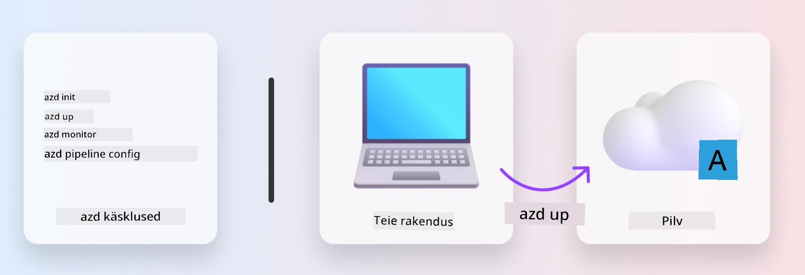
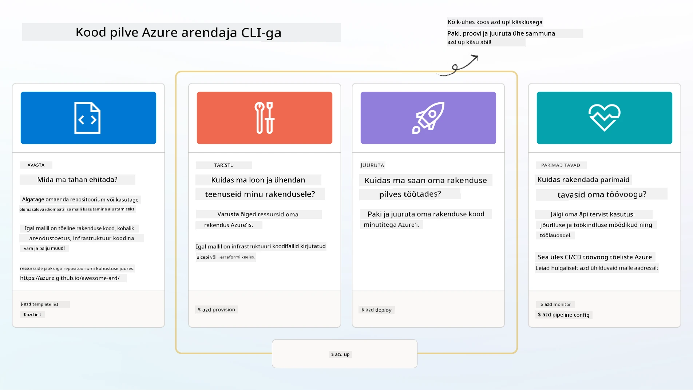

# 1. Vali mall

!!! tip "SELLE MOODULI LÕPUS SUUDAD SA"

    - [ ] Kirjeldada, mis on AZD mallid
    - [ ] Avastada ja kasutada AZD malle tehisintellekti jaoks
    - [ ] Alustada AI Agents malliga
    - [ ] **Labor 1:** AZD kiire algus Codespaces’is või arenduskonteineris

---

## 1. Ehitusmeistri analoogia

Kaasaegse ettevõtte jaoks valmisoleva tehisintellekti rakenduse loomine _algusest peale_ võib olla hirmutav. See on natuke nagu oma uut kodu tellistest ise üles ehitamine. Jah, see on võimalik! Kuid see ei ole kõige efektiivsem viis soovitud tulemuse saavutamiseks!

Selle asemel alustame sageli olemasoleva _disainijoonisega_ ja teeme koos arhitektiga selle isikupärastamiseks vastavalt meie vajadustele. Just seda lähenemist tuleks kasutada nutikate rakenduste loomisel. Esmalt leia hea disaini arhitektuur, mis sobib sinu probleemivaldkonnaga. Seejärel tee koostööd lahenduse arhitektiga, et seda kohandada ja arendada sinu konkreetseks stsenaariumiks.

Kuid kust neid disainijooniseid leida? Ja kuidas leida arhitekt, kes on valmis õpetama, kuidas neid jooniseid ise kohandada ja juurutada? Selles õpitoas vastame nendele küsimustele, tutvustades kolme tehnoloogiat:

1. [Azure Developer CLI](https://aka.ms/azd) – avatud lähtekoodiga tööriist, mis kiirendab arendaja teekonda kohalikust arendusest (build) pilve juurutamiseni (ship).
1. [Microsoft Foundry Templates](https://ai.azure.com/templates) – standardiseeritud avatud lähtekoodiga hoidlad, mis sisaldavad näidiskoodi, infrastruktuuri ja konfiguratsioonifaile AI lahenduse arhitektuuri juurutamiseks.
1. [GitHub Copilot Agent Mode](https://code.visualstudio.com/docs/copilot/chat/chat-agent-mode) – kodeerimisagent, mis põhineb Azure teadmistele ja suudab juhendada meid koodibaasi navigeerimisel ja muudatuste tegemisel – kasutades loomulikku keelt.

Nende tööriistadega taskus saame nüüd _avastada_ sobiva malli, _juurutada_ selle, et veenduda selle toimimises, ja _kohandada_ seda vastavalt meie spetsiifilistele stsenaariumitele. Sukeldume sisse ja õpime, kuidas need töötavad.


---

## 2. Azure Developer CLI

[Azure Developer CLI](https://learn.microsoft.com/en-us/azure/developer/azure-developer-cli/) (või `azd`) on avatud lähtekoodiga käsureatööriist, mis kiirendab sinu koodi pilve teekonda arendajasõbralike käskude komplektiga, mis töötavad järjepidevalt üle sinu IDE (arenduskeskkond) ja CI/CD (devops) keskkondade.

`azd` abil võib sinu juurutamise teekond olla sama lihtne kui:

- `azd init` – algatab uue AI projekti olemasoleva AZD mallist.
- `azd up` – loob infrastruktuuri ja juurutab rakenduse ühes etapis.
- `azd monitor` – pakub reaalajas jälgimist ja diagnostikat sinu juurutatud rakendusele.
- `azd pipeline config` – seadistab CI/CD töövood Azure’i juurutuse automatiseerimiseks.

**🎯 | HARJUTUS**: <br/> Tutvu kohe oma praeguses õpitoas `azd` käsurea tööriistaga. See võib olla GitHub Codespaces, arenduskonteiner või kohalik kloon koos vajalikuga installitud. Alusta selle käsu sisestamisest, et näha, mida tööriist teha suudab:

```bash title="" linenums="0"
azd help
```



---

## 3. AZD mall

Selleks, et `azd` selle saavutaks, peab ta teadma, millist infrastruktuuri luua, milliseid konfiguratsiooni sättida ja millist rakendust juurutada. Siin tulebki mängu [AZD mallid](https://learn.microsoft.com/en-us/azure/developer/azure-developer-cli/azd-templates?tabs=csharp).

AZD mallid on avatud lähtekoodiga hoidlad, mis ühendavad näidiskoodi koos infrastruktuuri ja konfiguratsioonifailidega, mis on vajalikud lahenduse arhitektuuri juurutamiseks.
Kasutades _Infrastructure-as-Code_ (IaC) lähenemist, võimaldavad need mallide ressursimoodulid ja konfiguratsioonisätted olla versioonihalduses (nagu rakenduse lähtekood) – luues korduvkasutatavaid ja järjepidevaid töövooge selle projekti kasutajatele.

AZD malli loomisel või taaskasutamisel _sinu_ stsenaariumi jaoks pööra tähelepanu järgmistele küsimustele:

1. Mida sa ehitad? → Kas on mall, mis sisaldab alguskoodi selle stsenaariumi jaoks?
1. Kuidas on sinu lahendus arhitektuuriliselt üles ehitatud? → Kas on mall, mis sisaldab vajalikke ressursse?
1. Kuidas su lahendus juurutatakse? → Mõtle `azd deploy` koos eel- ja järelprotsesside haakudega!
1. Kuidas seda veelgi optimeerida? → Mõtle sisseehitatud jälgimisele ja automatiseeritud töövoogudele!

**🎯 | HARJUTUS**: <br/> 
Külasta [Awesome AZD](https://azure.github.io/awesome-azd/) galeriid ja kasuta filtreid, et uurida rohkem kui 250 praegu saadaval olevat malli. Vaata, kas leiad endale sobiva stsenaariumi.



---

## 4. AI rakenduse mallid

Tehisintellektil põhinevate rakenduste jaoks pakub Microsoft spetsiaalseid malle, mis sisaldavad **Microsoft Foundry** ja **Foundry Agents**. Need mallid kiirendavad sinu teed intelligentsete, tootmiskõlbulike rakenduste ehitamiseks.

### Microsoft Foundry & Foundry Agents mallid

Vali allpool mall, mida soovid juurutada. Iga mall on saadaval [Awesome AZD](https://azure.github.io/awesome-azd/) lehel ja seda saab algatada ühe käsuga.

| Mall | Kirjeldus | Juurutamise käsk |
|----------|-------------|----------------|
| **[AI vestlus RAG-iga](https://azure.github.io/awesome-azd/?tags=ai&tags=rag)** | Vestlusrakendus tõstmepõhise generatsiooniga, kasutades Microsoft Foundry tehnoloogiat | `azd init -t azure-samples/azure-search-openai-demo` |
| **[Foundry Agent Service Starter](https://azure.github.io/awesome-azd/?tags=ai&tags=agents)** | Ehita AI agente Foundry Agentitega autonoomseks tööülesannete täitmiseks | `azd init -t azure-samples/foundry-agent-service-starter` |
| **[Mitmeagendi orkestreerimine](https://azure.github.io/awesome-azd/?tags=ai&tags=agents)** | Koordineeri mitut Foundry Agent’i keerukate töövoogude jaoks | `azd init -t azure-samples/multi-agent-orchestration` |
| **[AI dokumendi intelligentsus](https://azure.github.io/awesome-azd/?tags=ai&tags=document)** | Ekstraheerimine ja analüüs Microsoft Foundry mudelite abiga dokumentidest | `azd init -t azure-samples/ai-document-processing` |
| **[Vestlus AI bot](https://azure.github.io/awesome-azd/?tags=ai&tags=bot)** | Ehita intelligentseid vestlusroboteid Microsoft Foundry integratsiooniga | `azd init -t azure-samples/ai-chat-protocol` |
| **[AI pildi genereerimine](https://azure.github.io/awesome-azd/?tags=ai&tags=dalle)** | Piltide genereerimine DALL-E abil Microsoft Foundry kaudu | `azd init -t azure-samples/ai-image-generation` |
| **[Semantic Kernel agent](https://azure.github.io/awesome-azd/?tags=ai&tags=semantic-kernel)** | Tehisintellekti agendid, kasutades Semantic Kernel’it ja Foundry Agente | `azd init -t azure-samples/semantic-kernel-agent` |
| **[AutoGen mitmeagent](https://azure.github.io/awesome-azd/?tags=ai&tags=autogen)** | Mitmeagendisüsteemid, kasutades AutoGen raamistikku | `azd init -t azure-samples/autogen-multi-agent` |

### Kiire algus

1. **Sirvi malle**: Külasta lehte [https://azure.github.io/awesome-azd/](https://azure.github.io/awesome-azd/) ja filtreeri märksõnadega `AI`, `Agents` või `Microsoft Foundry`.
2. **Vali mall**: Vali endale sobiv kasutusjuhtumile vastav mall.
3. **Algata**: Käivita valitud malli puhul käsk `azd init`.
4. **Juuruta**: Käivita `azd up`, et hankida infrastruktuur ja juurutada rakendus.

**🎯 | HARJUTUS**: <br/>
Vali ülaltoodud mallidest üks vastavalt oma stsenaariumile:

- **Ehitate vestlusroboti?** → Alusta **AI vestlus RAG-iga** või **Vestlus AI bot**
- **Vajad autonoomseid agente?** → Proovi **Foundry Agent Service Starter** või **Mitmeagendi orkestreerimine**
- **Töötled dokumente?** → Kasuta **AI dokumendi intelligentsus**
- **Soovid AI kodeerimisabi?** → Avastage **Semantic Kernel agent** või **AutoGen mitmeagent**

```bash title="Example: Deploy the AI Chat with RAG template" linenums="0"
azd init -t azure-samples/azure-search-openai-demo
azd up
```

!!! info "Uuri rohkem malle"
    [Awesome AZD galerii](https://azure.github.io/awesome-azd/) sisaldab üle 250 malli. Kasuta filtreid, et leida malle, mis vastavad sinu konkreetsetele keele, raamistu ja Azure teenuste nõuetele.

---

<!-- CO-OP TRANSLATOR DISCLAIMER START -->
**Vastutusest loobumine**:  
See dokument on tõlgitud kasutades AI tõlke teenust [Co-op Translator](https://github.com/Azure/co-op-translator). Kuigi püüdleme täpsuse poole, tuleks arvestada, et automaatsed tõlked võivad sisaldada vigu või ebatäpsusi. Originaaldokument selle emakeeles on autoriteetne allikas. Olulise teabe puhul soovitatakse professionaalset inimtõlget. Me ei vastuta tehniliste arusaamatuste ega valesti mõistmiste eest, mis võivad sellest tõlkest tuleneda.
<!-- CO-OP TRANSLATOR DISCLAIMER END -->