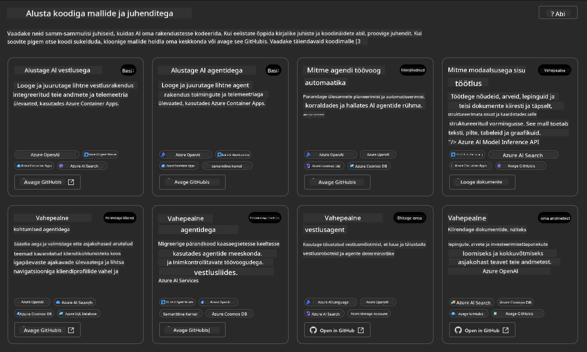
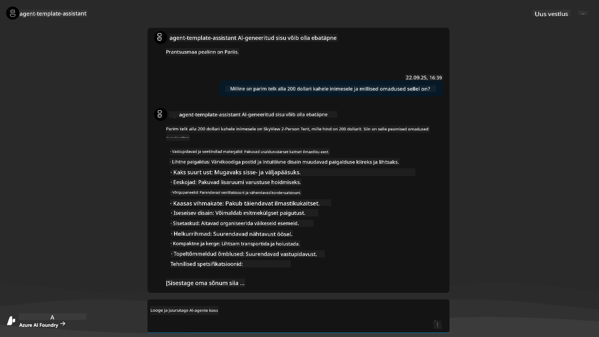
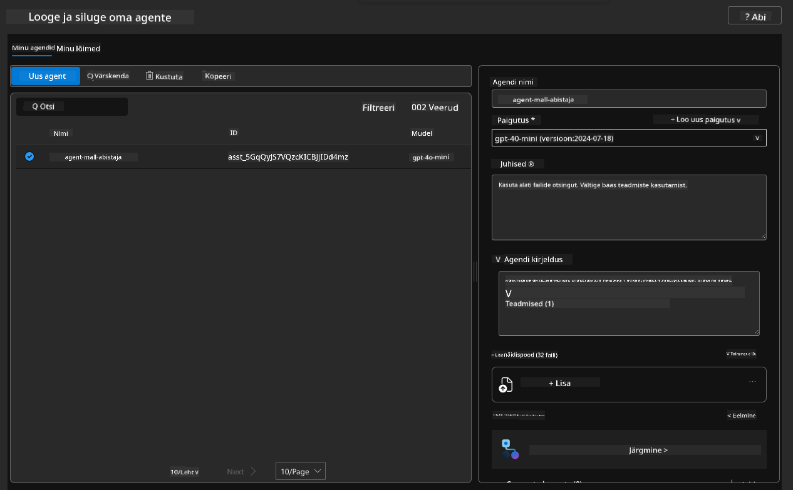
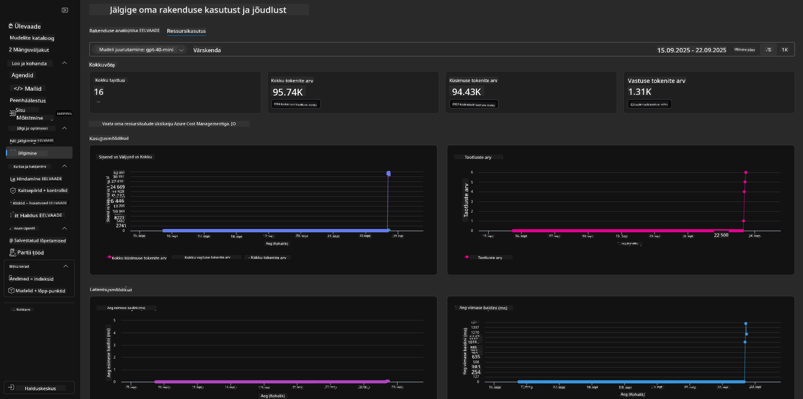

<!--
CO_OP_TRANSLATOR_METADATA:
{
  "original_hash": "7816c6ec50c694c331e7c6092371be4d",
  "translation_date": "2025-10-11T15:45:00+00:00",
  "source_file": "workshop/docs/instructions/2-Validate-AI-Template.md",
  "language_code": "et"
}
-->
# 2. Malli valideerimine

!!! tip "PÄRAST SELLE MODULI LÄBIMIST SAAD"

    - [ ] Analüüsida AI lahenduse arhitektuuri
    - [ ] Mõista AZD juurutamise töövoogu
    - [ ] Kasutada GitHub Copilotit AZD kasutamise abistamiseks
    - [ ] **Lab 2:** Juurutada ja valideerida AI agentide mall

---

## 1. Sissejuhatus

[Azure Developer CLI](https://learn.microsoft.com/en-us/azure/developer/azure-developer-cli/) ehk `azd` on avatud lähtekoodiga käsurea tööriist, mis lihtsustab arendaja töövoogu rakenduste loomisel ja juurutamisel Azure'i. 

[AZD mallid](https://learn.microsoft.com/azure/developer/azure-developer-cli/azd-templates) on standardiseeritud repositooriumid, mis sisaldavad näidisrakenduse koodi, _infrastruktuuri kui koodi_ ressursse ja `azd` konfiguratsioonifaile tervikliku lahenduse arhitektuuri jaoks. Infrastruktuuri ettevalmistamine muutub sama lihtsaks kui `azd provision` käsk - samas kui `azd up` võimaldab infrastruktuuri ettevalmistamist **ja** rakenduse juurutamist ühe korraga!

Seega võib rakenduse arendamise alustamine olla sama lihtne kui leida sobiv _AZD Starter mall_, mis vastab kõige paremini teie rakenduse ja infrastruktuuri vajadustele - ning seejärel kohandada repositooriumi vastavalt teie stsenaariumi nõuetele.

Enne alustamist veenduge, et teil on Azure Developer CLI installitud.

1. Avage VS Code terminal ja sisestage järgmine käsk:

      ```bash title="" linenums="0"
      azd version
      ```

1. Peaksite nägema midagi sellist!

      ```bash title="" linenums="0"
      azd version 1.19.0 (commit b3d68cea969b2bfbaa7b7fa289424428edb93e97)
      ```

**Olete nüüd valmis valima ja juurutama malli azd abil**

---

## 2. Malli valik

Azure AI Foundry platvormil on [soovitatud AZD mallide komplekt](https://learn.microsoft.com/en-us/azure/ai-foundry/how-to/develop/ai-template-get-started), mis hõlmab populaarseid lahenduse stsenaariume nagu _multi-agent töövoo automatiseerimine_ ja _multi-modal sisu töötlemine_. Neid malle saate avastada ka Azure AI Foundry portaalis.

1. Külastage [https://ai.azure.com/templates](https://ai.azure.com/templates)
1. Logige sisse Azure AI Foundry portaali, kui seda küsitakse - näete midagi sellist.



**Basic** valikud on teie algusmallid:

1. [ ] [Get Started with AI Chat](https://github.com/Azure-Samples/get-started-with-ai-chat), mis juurutab lihtsa vestlusrakenduse _teie andmetega_ Azure Container Apps'i. Kasutage seda, et uurida lihtsat AI vestlusrobotite stsenaariumi.
1. [X] [Get Started with AI Agents](https://github.com/Azure-Samples/get-started-with-ai-agents), mis juurutab standardse AI agendi (koos Azure AI Agent Service'iga). Kasutage seda, et tutvuda agentlike AI lahendustega, mis hõlmavad tööriistu ja mudeleid.

Avage teine link uues brauseri vahekaardis (või klõpsake `Open in GitHub` seotud kaardil). Peaksite nägema selle AZD malli repositooriumi. Võtke minut, et uurida README-d. Rakenduse arhitektuur näeb välja selline:


---

## 3. Malli aktiveerimine

Proovime juurutada seda malli ja veenduda, et see on kehtiv. Järgime juhiseid [Getting Started](https://github.com/Azure-Samples/get-started-with-ai-agents?tab=readme-ov-file#getting-started) jaotises.

1. Klõpsake [sellel lingil](https://github.com/codespaces/new/Azure-Samples/get-started-with-ai-agents) - kinnitage vaikimisi toiming `Create codespace`
1. See avab uue brauseri vahekaardi - oodake, kuni GitHub Codespaces seanss on täielikult laaditud
1. Avage Codespaces'is VS Code terminal - sisestage järgmine käsk:

   ```bash title="" linenums="0"
   azd up
   ```

Täitke töövoo sammud, mida see käivitab:

1. Teile kuvatakse Azure'i sisselogimise juhised - järgige autentimise juhiseid
1. Sisestage ainulaadne keskkonna nimi - näiteks kasutasin `nitya-mshack-azd`
1. See loob `.azure/` kausta - näete alamkausta keskkonna nimega
1. Teile kuvatakse tellimuse nime valik - valige vaikimisi
1. Teile kuvatakse asukoha valik - kasutage `East US 2`

Nüüd oodake, kuni ettevalmistamine on lõpule viidud. **See võtab 10-15 minutit**

1. Kui valmis, näete konsoolis EDUKA sõnumit, mis näeb välja selline:
      ```bash title="" linenums="0"
      SUCCESS: Your up workflow to provision and deploy to Azure completed in 10 minutes 17 seconds.
      ```
1. Teie Azure'i portaalis on nüüd ettevalmistatud ressursigrupp selle keskkonna nimega:

      

1. **Olete nüüd valmis valideerima juurutatud infrastruktuuri ja rakendust**.

---

## 4. Malli valideerimine

1. Külastage Azure'i portaali [Resource Groups](https://portal.azure.com/#browse/resourcegroups) lehte - logige sisse, kui seda küsitakse
1. Klõpsake oma keskkonna nimega ressursigrupil - näete ülaltoodud lehte

      - klõpsake Azure Container Apps ressursil
      - klõpsake _Essentials_ sektsiooni (paremal ülal) Application Url lingil

1. Peaksite nägema hostitud rakenduse esikülje kasutajaliidest, mis näeb välja selline:

   

1. Proovige küsida paar [näidisküsimust](https://github.com/Azure-Samples/get-started-with-ai-agents/blob/main/docs/sample_questions.md)

      1. Küsige: ```Mis on Prantsusmaa pealinn?``` 
      1. Küsige: ```Milline on parim telk alla $200 kahele inimesele ja millised omadused sellel on?```

1. Peaksite saama vastuseid, mis on sarnased allpool näidatule. _Aga kuidas see töötab?_ 

      

---

## 5. Agendi valideerimine

Azure Container App juurutab lõpp-punkti, mis ühendub AI agendiga, mis on ettevalmistatud selle malli Azure AI Foundry projektis. Vaatame, mida see tähendab.

1. Naaske Azure'i portaali _Overview_ lehele oma ressursigrupi jaoks

1. Klõpsake loendis `Azure AI Foundry` ressursil

1. Peaksite nägema seda. Klõpsake `Go to Azure AI Foundry Portal` nuppu. 
   

1. Peaksite nägema Foundry projekti lehte oma AI rakenduse jaoks
   

1. Klõpsake `Agents` - näete vaikimisi agenti, mis on teie projektis ettevalmistatud
   

1. Valige see - ja näete agendi üksikasju. Pange tähele järgmist:

      - Agent kasutab vaikimisi failide otsingut (alati)
      - Agendi `Knowledge` näitab, et üles laaditud on 32 faili (failide otsinguks)
      

1. Otsige vasakpoolsest menüüst `Data+indexes` valikut ja klõpsake, et näha üksikasju. 

      - Peaksite nägema 32 andmefaili, mis on üles laaditud teadmiste jaoks.
      - Need vastavad 12 kliendifailile ja 20 toote failile kaustas `src/files` 
      

**Olete valideerinud agendi toimimise!** 

1. Agendi vastused põhinevad nende failide teadmistel. 
1. Nüüd saate esitada küsimusi, mis on seotud nende andmetega, ja saada põhjendatud vastuseid.
1. Näide: `customer_info_10.json` kirjeldab "Amanda Perez" kolme ostu

Naaske brauseri vahekaardile, kus on Container App lõpp-punkt, ja küsige: `Milliseid tooteid Amanda Perez omab?`. Peaksite nägema midagi sellist:


---

## 6. Agendi mänguväljak

Tutvume Azure AI Foundry võimalustega, proovides agenti mänguväljakul. 

1. Naaske Azure AI Foundry lehele `Agents` - valige vaikimisi agent
1. Klõpsake `Try in Playground` valikut - peaksite saama mänguväljaku kasutajaliidese, mis näeb välja selline
1. Küsige sama küsimust: `Milliseid tooteid Amanda Perez omab?`

    

Saate sama (või sarnase) vastuse - kuid näete ka täiendavat teavet, mida saate kasutada oma agentliku rakenduse kvaliteedi, kulude ja jõudluse mõistmiseks. Näiteks:

1. Pange tähele, et vastus viitab andmefailidele, mida kasutati vastuse "põhjendamiseks"
1. Hõljutage kursorit mõne faili sildi kohal - kas andmed vastavad teie päringule ja kuvatud vastusele?

Näete ka _statistika_ rida vastuse all. 

1. Hõljutage kursorit mõne mõõdiku kohal - näiteks Safety. Näete midagi sellist
1. Kas hinnang vastab teie intuitsioonile vastuse ohutuse taseme kohta?

      

---x

## 7. Sisseehitatud jälgitavus

Jälgitavus tähendab rakenduse instrumenteerimist, et genereerida andmeid, mida saab kasutada selle toimimise mõistmiseks, silumiseks ja optimeerimiseks. Selle mõistmiseks:

1. Klõpsake `View Run Info` nuppu - peaksite nägema seda vaadet. See on näide [Agendi jälgimisest](https://learn.microsoft.com/en-us/azure/ai-foundry/how-to/develop/trace-agents-sdk#view-trace-results-in-the-azure-ai-foundry-agents-playground) tegevuses. _Selle vaate saate ka, klõpsates Thread Logs ülemise menüü tasemel_.

   - Saage ülevaade agendi käivitamise sammudest ja tööriistadest
   - Mõistke vastuse jaoks kasutatud kogutokenite arvu (vs. väljundtokenite kasutus)
   - Mõistke latentsust ja kus kulub aega täitmise ajal

      

1. Klõpsake `Metadata` vahekaarti, et näha täiendavaid atribuute käivitamise kohta, mis võivad pakkuda kasulikku konteksti hilisemate probleemide silumiseks.   

      

1. Klõpsake `Evaluations` vahekaarti, et näha automaatseid hinnanguid agendi vastuse kohta. Need hõlmavad ohutuse hinnanguid (nt enesevigastus) ja agendispetsiifilisi hinnanguid (nt kavatsuse lahendamine, ülesande järgimine).

      

1. Viimaks, klõpsake külgriba menüüs `Monitoring` vahekaarti.

      - Valige kuvatud lehel `Resource usage` vahekaart - ja vaadake mõõdikuid.
      - Jälgige rakenduse kasutust kulude (tokenid) ja koormuse (päringud) osas.
      - Jälgige rakenduse latentsust esimese baidini (sisendi töötlemine) ja viimase baidini (väljund).

      

---

## 8. Keskkonnamuutujad

Siiani oleme läbinud juurutamise brauseris - ja valideerinud, et meie infrastruktuur on ettevalmistatud ja rakendus töötab. Kuid rakendusega _koodipõhiselt_ töötamiseks peame konfigureerima oma kohaliku arenduskeskkonna vastavate muutujatega, mis on vajalikud nende ressurssidega töötamiseks. `azd` kasutamine teeb selle lihtsaks.

1. Azure Developer CLI [kasutab keskkonnamuutujaid](https://learn.microsoft.com/en-us/azure/developer/azure-developer-cli/manage-environment-variables?tabs=bash), et salvestada ja hallata rakenduse juurutamise konfiguratsiooniseadeid.

1. Keskkonnamuutujad salvestatakse `.azure/<env-name>/.env` - see piirab need juurutamise ajal kasutatud `env-name` keskkonnaga ja aitab eraldada keskkondi erinevate juurutamise sihtmärkide vahel samas repositooriumis.

1. Keskkonnamuutujad laaditakse automaatselt `azd` käsu poolt, kui see täidab konkreetset käsku (nt `azd up`). Pange tähele, et `azd` ei loe automaatselt _OS-taseme_ keskkonnamuutujaid (nt shellis määratud) - selle asemel kasutage `azd set env` ja `azd get env`, et edastada teavet skriptide sees.

Proovime mõnda käsku:

1. Hankige kõik keskkonnamuutujad, mis on `azd` jaoks selles keskkonnas määratud:

      ```bash title="" linenums="0"
      azd env get-values
      ```
      
      Näete midagi sellist:

      ```bash title="" linenums="0"
      AZURE_AI_AGENT_DEPLOYMENT_NAME="gpt-4o-mini"
      AZURE_AI_AGENT_NAME="agent-template-assistant"
      AZURE_AI_EMBED_DEPLOYMENT_NAME="text-embedding-3-small"
      AZURE_AI_EMBED_DIMENSIONS=100
      ...
      ```

1. Hankige konkreetne väärtus - näiteks tahan teada, kas oleme määranud `AZURE_AI_AGENT_MODEL_NAME` väärtuse

      ```bash title="" linenums="0"
      azd env get-value AZURE_AI_AGENT_MODEL_NAME 
      ```
      
      Näete midagi sellist - seda ei olnud vaikimisi määratud!

      ```bash title="" linenums="0"
      ERROR: key 'AZURE_AI_AGENT_MODEL_NAME' not found in the environment values
      ```

1. Määrake uus keskkonnamuutuja `azd` jaoks. Siin uuendame agendi mudeli nime. _Märkus: kõik tehtud muudatused kajastuvad kohe `.azure/<env-name>/.env` failis.

      ```bash title="" linenums="0"
      azd env set AZURE_AI_AGENT_MODEL_NAME gpt-4.1
      azd env set AZURE_AI_AGENT_MODEL_VERSION 2025-04-14
      azd env set AZURE_AI_AGENT_DEPLOYMENT_CAPACITY 150
      ```

      Nüüd peaksime leidma, et väärtus on määratud:

      ```bash title="" linenums="0"
      azd env get-value AZURE_AI_AGENT_MODEL_NAME 
      ```

1. Pange tähele, et mõned ressursid on püsivad (nt mudeli juurutused) ja vajavad rohkem kui lihtsalt `azd up`, et sundida uuesti juurutamist. Proovime algse juurutamise eemaldamist ja uuesti juurutamist muudetud keskkonnamuutujatega.

1. **Värskenda** Kui olete varem infrastruktuuri juurutanud azd malliga - saate _värskendada_ oma kohalike keskkonnamuutujate olekut, lähtudes Azure'i juurutamise praegusest olekust, kasutades seda käsku:
      ```bash title="" linenums="0"
      azd env refresh
      ```

      See on võimas viis _sünkroonida_ keskkonnamuutujaid mitme kohaliku arenduskeskkonna vahel (nt meeskond, kus on mitu arendajat) – võimaldades juurutatud infrastruktuuril olla keskkonnamuutujate oleku tõepunkt. Meeskonnaliikmed lihtsalt _värskendavad_ muutujaid, et uuesti sünkroonis olla.

---

## 9. Palju õnne 🏆

Sa just lõpetasid tervikliku töövoo, kus sa:

- [X] Valisid AZD mall, mida soovid kasutada
- [X] Käivitasid malli GitHub Codespaces abil
- [X] Juurutasid malli ja kinnitasid, et see töötab

---

**Lahtiütlus**:  
See dokument on tõlgitud AI tõlketeenuse [Co-op Translator](https://github.com/Azure/co-op-translator) abil. Kuigi püüame tagada täpsust, palume arvestada, et automaatsed tõlked võivad sisaldada vigu või ebatäpsusi. Originaaldokumenti selle algses keeles tuleks pidada autoriteetseks allikaks. Olulise teabe puhul soovitame kasutada professionaalset inimtõlget. Me ei vastuta selle tõlke kasutamisest tulenevate arusaamatuste või valesti tõlgenduste eest.