# 2. Kontrolli mall

!!! tip "Selle mooduli lõpuks SUUDA SA"

    - [ ] Analüüsida AI lahenduste arhitektuuri
    - [ ] Mõista AZD juurutusprotsessi
    - [ ] Kasutada GitHub Copilotit abi saamiseks AZD kasutamisel
    - [ ] **Labor 2:** AI agentide malli juurutamine ja valideerimine

---


## 1. Sissejuhatus

[Azure Developer CLI](https://learn.microsoft.com/en-us/azure/developer/azure-developer-cli/) ehk `azd` on avatud lähtekoodiga käsureatööriist, mis lihtsustab arendaja töövoogu rakenduste loomisel ja juurutamisel Azure’i platvormile.

[AZD mallid](https://learn.microsoft.com/azure/developer/azure-developer-cli/azd-templates) on standardiseeritud hoidlad, mis sisaldavad näidiskoodi, _tarkvara infrastruktuuri koodina_ ning `azd` konfiguratsioonifaile koordineeritud lahenduse arhitektuuri jaoks. Infrastruktuuri loomine toimub nii lihtsalt kui `azd provision` käsk - samas `azd up` võimaldab juurutada infrastruktuuri **ja** rakenduse korraga!

Seetõttu võib rakenduse arenduse käivitamine olla sama lihtne kui leida sobiv _AZD Startermall_, mis vastab kõige enam teie rakenduse ja infrastruktuuri vajadustele ning seejärel kohandada hoidlat vastavalt teie stsenaariumile.

Enne alustamist veendume, et teil oleks Azure Developer CLI paigaldatud.

1. Ava VS Code terminal ja sisesta järgmine käsk:

      ```bash title="" linenums="0"
      azd version
      ```

1. Peaks välja tulema midagi sellist!

      ```bash title="" linenums="0"
      azd version 1.19.0 (commit b3d68cea969b2bfbaa7b7fa289424428edb93e97)
      ```

**Nüüd oled valmis valima ja juurutama malli azd-ga**

---

## 2. Malle valik

Microsoft Foundry platvorm sisaldab [soovitatud AZD malle](https://learn.microsoft.com/en-us/azure/ai-foundry/how-to/develop/ai-template-get-started), mis katavad populaarseid lahenduste stsenaariumeid nagu _mitmeagendi töövoo automatiseerimine_ ja _mitmemodaalne sisu töötlemine_. Neid malle saab avastada ka Microsoft Foundry portaali külastades.

1. Külasta [https://ai.azure.com/templates](https://ai.azure.com/templates)
1. Logi sisse Microsoft Foundry portaali, kui see küsitakse – näed midagi sellist.

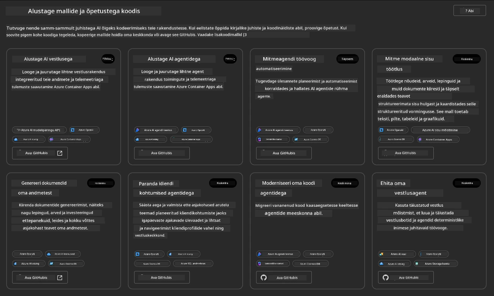


**Basic** valikud on sinu startermallid:

1. [ ] [Alusta AI vestlusega](https://github.com/Azure-Samples/get-started-with-ai-chat), mis juurutab lihtsa vestlusrakenduse _sinu andmetega_ Azure Container Apps keskkonda. Kasuta seda lihtsa AI vestlusroboti stsenaariumi uurimiseks.
1. [X] [Alusta AI agentidega](https://github.com/Azure-Samples/get-started-with-ai-agents), mis samuti juurutab standardse AI agendi (Foundry agentidega). Kasuta seda, et tutvuda agentse AI lahendustega, mis hõlmavad tööriistu ja mudeleid.

Külasta teist lingi uues brauseri vahekaardis (või klõpsa seotud kaardi juures `Open in GitHub`). Näed selle AZD malli hoidlat. Võta minut ja vaata README läbi. Rakenduse arhitektuur näeb välja selline:

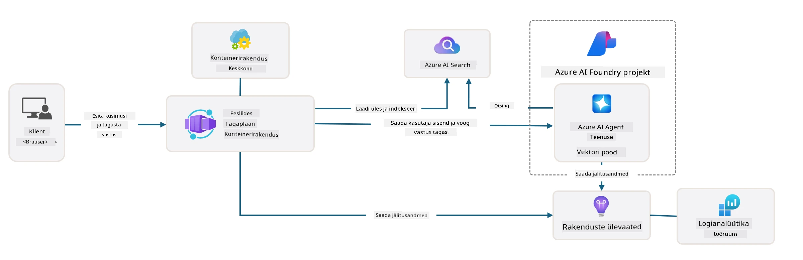

---

## 3. Malli aktiveerimine

Proovime seda malli juurutada ja veenduda, et see oleks kehtiv. Järgime juhiseid jaotises [Getting Started](https://github.com/Azure-Samples/get-started-with-ai-agents?tab=readme-ov-file#getting-started).

1. Klõpsa [seda linki](https://github.com/codespaces/new/Azure-Samples/get-started-with-ai-agents) - kinnita vaikevalik „Create codespace“
1. Avaneb uus brauseri vahekaart – oota, kuni GitHub Codespaces sessioon laeb lõpuni
1. Ava VS Code terminal Codespaces - sisesta järgmine käsk:

   ```bash title="" linenums="0"
   azd up
   ```

Läbiviidavad töövoo sammud:

1. Sind palutakse Azure’i sisse logida – järgi autentimisjuhiseid
1. Sisesta oma unikaalne keskkonna nimi – näiteks mina kasutasin `nitya-mshack-azd`
1. See loob `.azure/` kausta – näed selle alamkausta keskkonna nimega
1. Sind palutakse valida tellimuse nimi – vali vaikimisi
1. Sind palutakse valida asukoht – kasuta `East US 2`

Nüüd oota, kuni provisioning lõpetatakse. **See võtab 10-15 minutit**

1. Kui valmis, näed konsoolis sõnumit SUCCESS järgmiselt:
      ```bash title="" linenums="0"
      SUCCESS: Your up workflow to provision and deploy to Azure completed in 10 minutes 17 seconds.
      ```
1. Sinu Azure portalis on nüüd loodud selle keskkonnanimega ressursside grupp:

      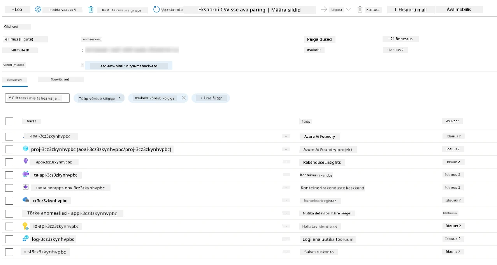

1. **Oled nüüd valmis valideerima juurutatud infrastruktuuri ja rakendust**.

---

## 4. Malli valideerimine

1. Külasta Azure portaali [Resource Groups](https://portal.azure.com/#browse/resourcegroups) lehte – logi sisse kui küsitakse
1. Klikka oma keskkonnanimel olevale RG-le – näed eelpoololevat lehte

      - kliki Azure Container Apps ressursil
      - kliki rakenduse URL-ile _Essentials_ sektsioonis (paremal ülal)

1. Näed võõrustatud rakenduse kasutajaliidest sellisena:

   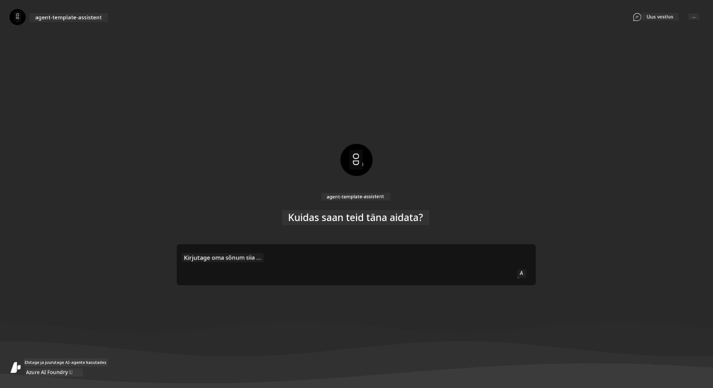

1. Proovi küsida paar [näidisküsimust](https://github.com/Azure-Samples/get-started-with-ai-agents/blob/main/docs/sample_questions.md)

      1. Küsi: ```Mis on Prantsusmaa pealinn?``` 
      1. Küsi: ```Mis on parim telk alla $200 kahe inimese jaoks ja millised on selle omadused?```

1. Saad vastused, mis näevad välja sarnased järgmisega. _Kuidas see toimib?_

      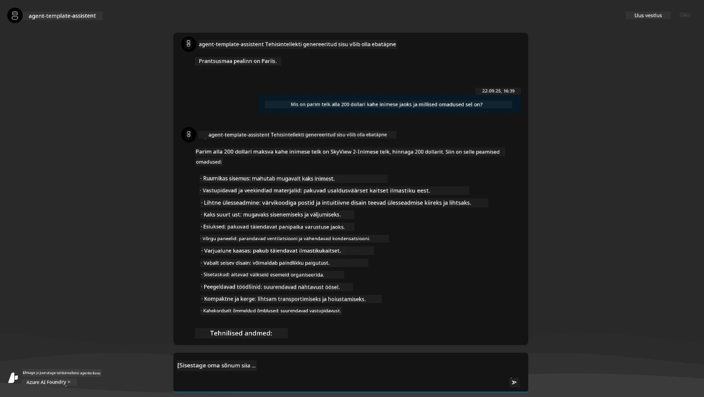

---

## 5. Agendi valideerimine

Azure Container App juurutab lõpp-punkti, mis ühendub AI agendiga, mis loodi Microsoft Foundry projektis selle malli jaoks. Vaatame, mida see tähendab.

1. Tagasi Azure Portaali _Ülevaate_ lehele oma ressursside grupis

1. Kliki loetelus `Microsoft Foundry` ressursile

1. Näed seda. Klõpsa nupule `Go to Microsoft Foundry Portal`. 
   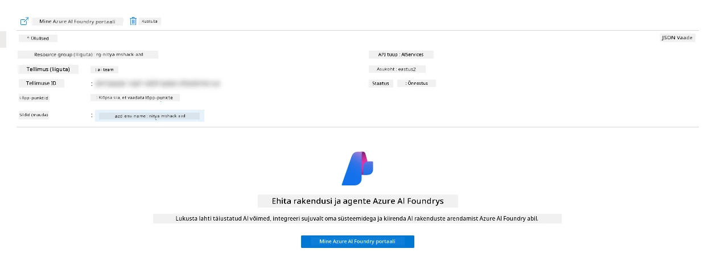

1. Näed Foundry projekti lehte oma AI rakenduse jaoks
   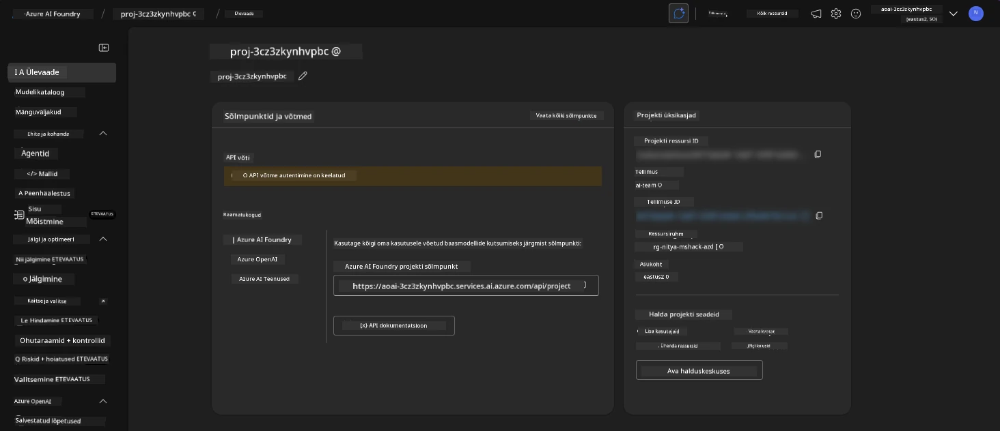

1. Klõpsa `Agents` – näed projekti vaikeseadistusega agenti
   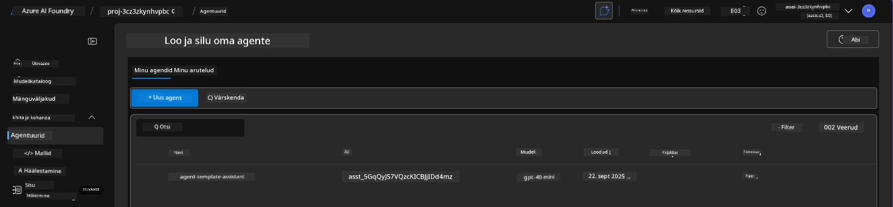

1. Vali see – näed agendi üksikasju. Pane tähele järgmist:

      - Agent kasutab vaikimisi File Search’i (alati)
      - Agendi `Knowledge` näitab, et on üles laaditud 32 faili (failis otsingu jaoks)
      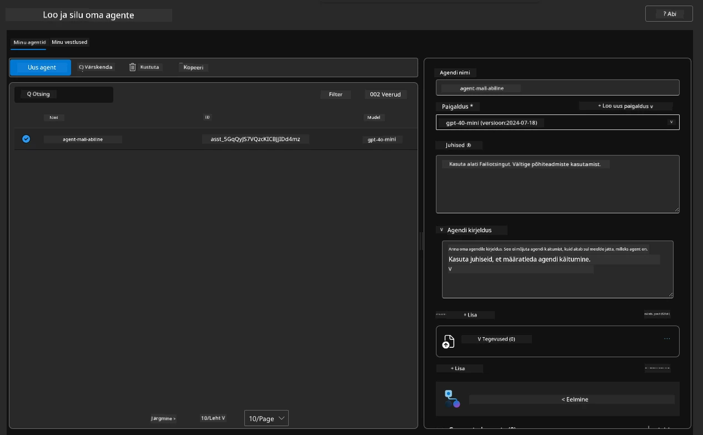

1. Vali vasakpoolsest menüüst `Data+indexes` ja klõpsa detailide vaatamiseks.

      - Näed, et teadmiste all on üles laaditud 32 andmefaili.
      - Need vastavad 12 kliendi failile ja 20 tootefailile kaustas `src/files`
      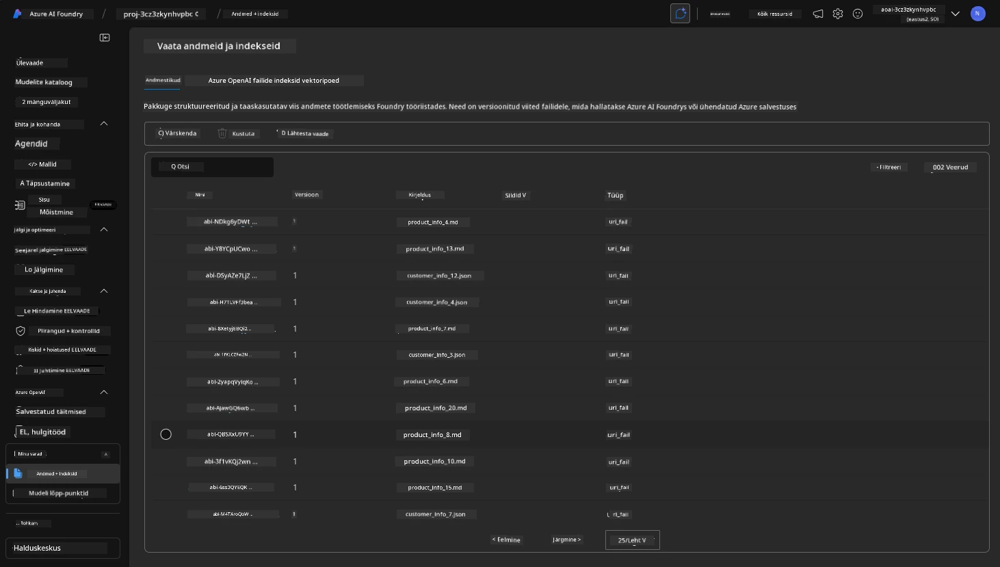

**Sa valideerisid agendi toimimise!**

1. Agendi vastused tuginevad neile teadmisi sisaldavatele failidele.
1. Nüüd võid küsida andmestikku puudutavaid küsimusi ja saada asjakohaseid vastuseid.
1. Näide: `customer_info_10.json` kirjeldab Amanda Perezi tehtud 3 ostu.

Mine tagasi brauseri vahekaardile Container Appi lõpp-punktiga ja küsi: `Milliseid tooteid Amanda Perez omab?`. Näed midagi sellist:

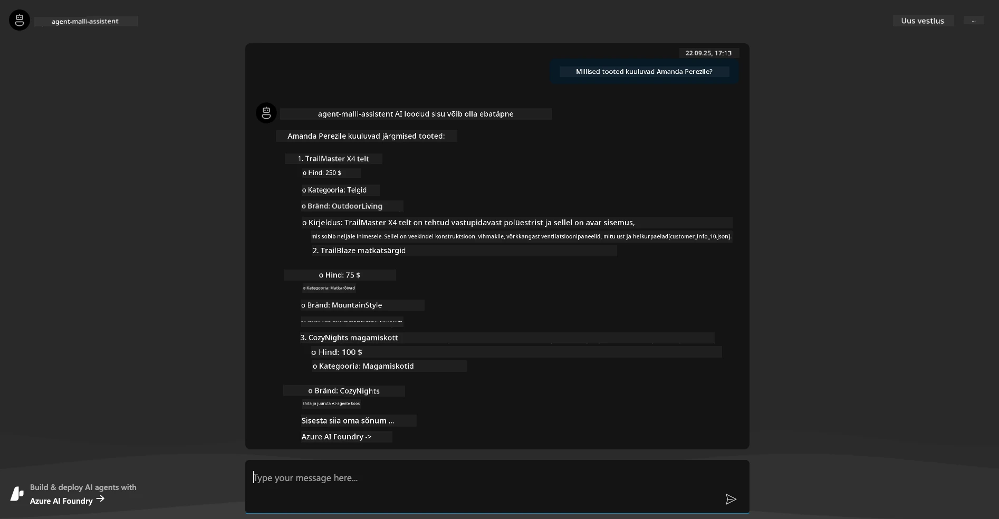

---

## 6. Agendi mänguväljak

Saa veidi parema ettekujutuse Microsoft Foundry võimekusest, proovides agendit Agents Playground’s.

1. Tagasi Microsoft Foundry `Agents` lehele - vali vaikimisi agent
1. Klõpsa valikut `Try in Playground` - näed Playground kasutajaliidest nagu allpool
1. Küsi sama küsimust: `Milliseid tooteid Amanda Perez omab?`

    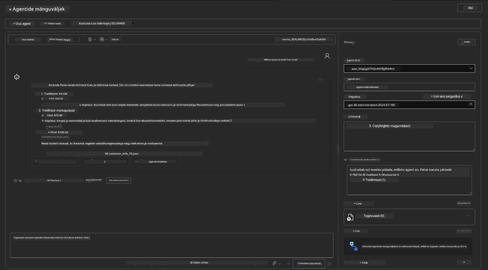

Saad sama (või sarnase) vastuse – aga saad ka lisainfot, mida kasutada, et mõista oma agendi rakenduse kvaliteeti, kulusid ja jõudlust. Näiteks:

1. Pane tähele, et vastus viitab kasutatud andmefailidele, mis “põhinevad” vastusel
1. Hoia hiirt nende failide peal – kas andmed vastavad sinu küsimusele ja näidatud vastusele?

Näed allpool ka _statistika_ rida.

1. Hoia hiirt üle mõne mõõdiku – nt turvalisus. Näed midagi sellist
1. Kas hinnang vastab sinu intuitsioonile vastuse turvalisuse taseme kohta?

      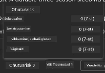

---

## 7. Sisseehitatud jälgitavus

Jälgitavus tähendab, et rakendus on instrumenditud andmete genereerimiseks, mida saab kasutada tema toimimise mõistmiseks, silumiseks ja optimeerimiseks. Selle tunnetamiseks:

1. Klõpsa nuppu `View Run Info` – näed järgmist vaadet. See on näide [Agendi jälitamisest](https://learn.microsoft.com/en-us/azure/ai-foundry/how-to/develop/trace-agents-sdk#view-trace-results-in-the-azure-ai-foundry-agents-playground) tegevuses. _Seda vaadet saad ka menüüst valides Thread Logs_.

   - Saa ülevaade agendi töövoo sammudest ja kasutatud tööriistadest
   - Mõista kogu Tokenite arvu (vt väljundtokenite kasutust) vastuse kohta
   - Mõista latentsust ja kus aeg täitmise ajal kulub

      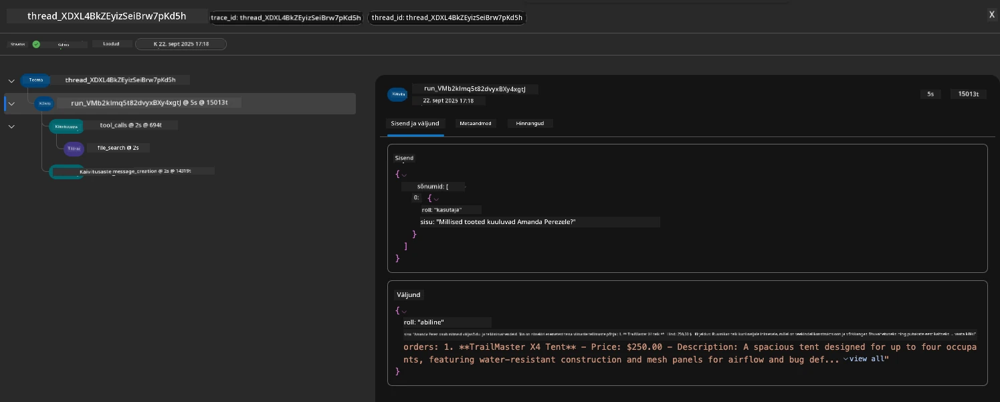

1. Klõpsa vahekaarti `Metadata`, et näha täiendavaid atribuute jooksu kohta, mis võivad hiljem silumisel kasulikud olla.

      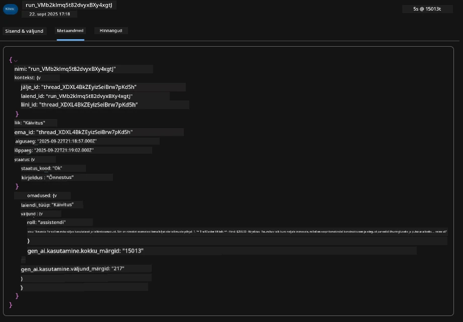


1. Klõpsa vahekaarti `Evaluations`, et näha agendi vastuse automaatseid hinnanguid. Need sisaldavad turvalisuse hindamist (nt enesevigastuse risk) ning agendispetsiifilisi hinnanguid (nt kavatsuse tuvastamine, ülesande järgimine).

      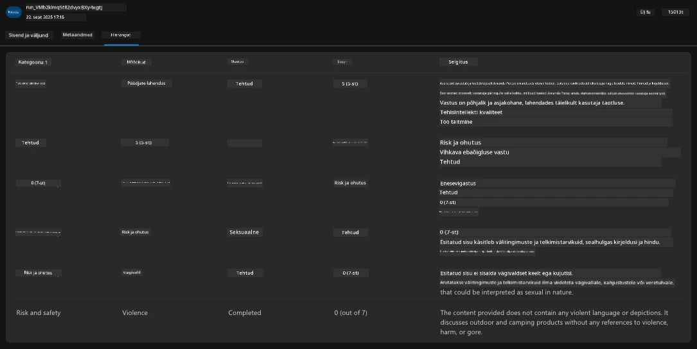

1. Lõpuks, klõpsa külgmenüüs `Monitoring` vahekaarti.

      - Vali kuvataval lehel `Resource usage` vahekaart – ja vaata mõõdikuid.
      - Jälgi rakenduse kasutust kulude (tokenite) ja koormuse (päringute) osas.
      - Jälgi rakenduse latentsust esimese baidi (sisendi töötlemine) ja viimase baidi (väljundi) osas.

      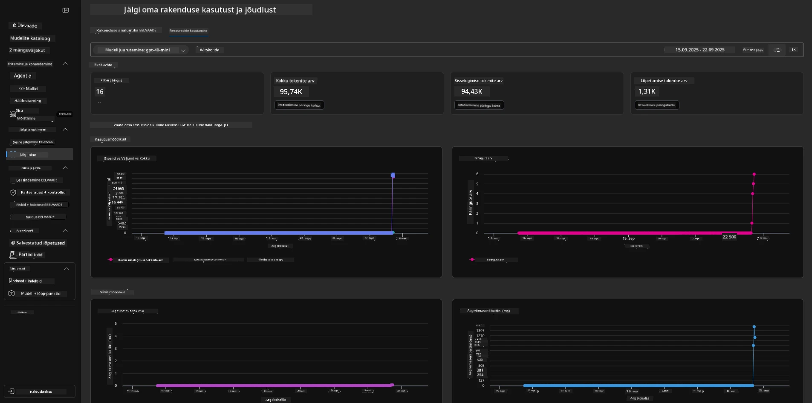

---

## 8. Keskkonnamuutujad

Praeguseks oleme käsitlenud brauseris juurutamist ning veendunud, et meie infrastruktuur on loodud ja rakendus töötab. Kuid, et töötada rakenduse _koodist lähtuvalt_, tuleb meil oma lokaalne arenduskeskkond konfigureerida vastavate muutujatega, mis on vajalikud nende ressurssidega töötamiseks. `azd` kasutamine teeb selle lihtsaks.

1. Azure Developer CLI [kasutab keskkonnamuutujaid](https://learn.microsoft.com/en-us/azure/developer/azure-developer-cli/manage-environment-variables?tabs=bash) rakenduste juurutuste konfiguratsiooniseadete salvestamiseks ja haldamiseks.

1. Keskkonnamuutujad salvestatakse faili `.azure/<env-name>/.env` – see piirab need kindla `env-name` keskkonnaga, mida kasutati juurutamisel, ning aitab hoida keskkonnad isolatsioonis eri juurutusi käsitlevates samades hoidlates.

1. Keskkonnamuutujad laaditakse automaatselt `azd` käsu käivitamisel (nt `azd up`). Pane tähele, et `azd` ei loe automaatselt _OS tasandi_ keskkonnamuutujaid (nt mis on seatud shellis) – selle asemel kasuta `azd set env` ja `azd get env`, et skriptide vahel infot vahetada.

Proovime mõnda käsku:

1. Saada kõik selle keskkonna `azd` jaoks seatud keskkonnamuutujad:

      ```bash title="" linenums="0"
      azd env get-values
      ```
      
      Näed midagi sellist:

      ```bash title="" linenums="0"
      AZURE_AI_AGENT_DEPLOYMENT_NAME="gpt-4o-mini"
      AZURE_AI_AGENT_NAME="agent-template-assistant"
      AZURE_AI_EMBED_DEPLOYMENT_NAME="text-embedding-3-small"
      AZURE_AI_EMBED_DIMENSIONS=100
      ...
      ```

1. Saada konkreetne väärtus – nt tahan teada, kas on seatud `AZURE_AI_AGENT_MODEL_NAME` väärtus

      ```bash title="" linenums="0"
      azd env get-value AZURE_AI_AGENT_MODEL_NAME 
      ```
      
      Näed midagi sellist – see ei olnud vaikimisi seatud!

      ```bash title="" linenums="0"
      ERROR: key 'AZURE_AI_AGENT_MODEL_NAME' not found in the environment values
      ```

1. Sea uus keskkonnamuutuja `azd` jaoks. Siin uuendame agendi mudelinime. _Märkus: kõik tehtud muutused kajastuvad kohe failis `.azure/<env-name>/.env`._

      ```bash title="" linenums="0"
      azd env set AZURE_AI_AGENT_MODEL_NAME gpt-4.1
      azd env set AZURE_AI_AGENT_MODEL_VERSION 2025-04-14
      azd env set AZURE_AI_AGENT_DEPLOYMENT_CAPACITY 150
      ```

      Nüüd peaks väärtus seatud olema:

      ```bash title="" linenums="0"
      azd env get-value AZURE_AI_AGENT_MODEL_NAME 
      ```

1. Pane tähele, et mõned ressursid on püsivad (nt mudelijuurutused) ja neid ei saa sundjuurutada lihtsalt `azd up` käsuga. Proovime algse juurutuse maha võtta ja seejärel juurutada uuesti muudetud keskkonnamuutujatega.

1. **Värskenda** Kui oled varem juurutanud infrastruktuuri azd malliga, võid oma lokaalse keskkonnamuutujate oleku uuendada vastavalt Azure'i juurutuse praegusele olukorrale, kasutades seda käsku:

      ```bash title="" linenums="0"
      azd env refresh
      ```

See on võimas viis sünkroonida keskkonnamuutujaid kahe või enama kohalikus arenduskeskkonnas (nt meeskond mitme arendajaga) – võimaldades juurutatud infrastruktuuril toimida keskkonnamuutujate oleku aluseks. Meeskonnaliikmed lihtsalt _värskendavad_ muutujaid, et taas sünkroonis olla.

---

## 9. Palju õnne 🏆

Sa just lõpetasid kogu töövoo, kus sa:

- [X] Valisid AZD malli, mida soovid kasutada
- [X] Käivitasid malli GitHub Codespacesiga
- [X] Juurutasid malli ja kontrollisid, et see töötab

---

<!-- CO-OP TRANSLATOR DISCLAIMER START -->
**Vastutusest loobumine**:
See dokument on tõlgitud kasutades tehisintellekti tõlketeenust [Co-op Translator](https://github.com/Azure/co-op-translator). Kuigi me püüdleme täpsuse poole, palun arvestage, et automatiseeritud tõlked võivad sisaldada vigu või ebatäpsusi. Originaaldokument selle emakeeles tuleks pidada autoriteetseks allikaks. Olulise info puhul on soovitatav kasutada professionaalset inimtõlget. Me ei vastuta ühegi arusaamatuse või valesti mõistmise eest, mis võib sellest tõlkest tekkida.
<!-- CO-OP TRANSLATOR DISCLAIMER END -->