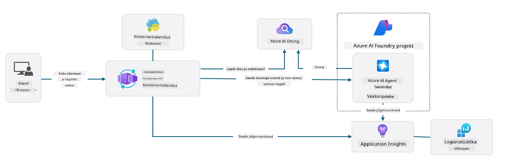

# 3. Purusta mall lahti

!!! tip "SELLE MODUULI LÕPUS SA OLED VÕIMELINE"

    - [ ] Aktiveerima GitHub Copiloti MCP serveritega Azure abiks
    - [ ] Mõistma AZD malli kaustastruktuuri ja komponente
    - [ ] Uurima infrastruktuuri kui koodi (Bicep) organiseerimismustreid
    - [ ] **Labor 3:** Kasutama GitHub Copiloti, et uurida ja mõista hoidla arhitektuuri

---


AZD mallide ja Azure Developer CLI (`azd`) abil saame kiiresti alustada oma AI arendusretke standardiseeritud hoidlatega, mis pakuvad näidiskoodi, infrastruktuuri ja konfiguratsioonifaile – valmis juurutatava _algus_ projektina.

**Kuid nüüd peame mõistma projekti struktuuri ja koodibaasi ning suutma kohandada AZD malli – ilma eelneva kogemuseta või AZD tundmiseta!**

---

## 1. Aktiveeri GitHub Copilot

### 1.1 Paigalda GitHub Copilot Chat

On aeg uurida [GitHub Copilot Agent Mode'is](https://code.visualstudio.com/docs/copilot/chat/chat-agent-mode). Nüüd saame kasutada loomulikku keelt, et kirjeldada oma ülesannet kõrgel tasemel ja saada abi selle täitmisel. Selle labori jaoks kasutame [Copilot Free plaani](https://github.com/github-copilot/signup), mille jaoks on kuine limiit lõpetamistele ja vestlusele.

Laiendus on võimalik paigaldada marketplace’ist, kuid peaks juba olema saadaval sinu Codespaces keskkonnas. _Klõpsa Copiloti ikooni rippmenüüst `Open Chat` - ja sisesta ülesandeks näiteks `What can you do?`_ - võib olla, et palutakse sisse logida. **GitHub Copilot Chat on valmis**.

### 1.2 Paigalda MCP serverid

Agent mode saamiseks vajalik, et tal oleks juurdepääs õigetele tööriistadele, mis aitavad teadmisi hankida või toiminguid teha. Siin võivad abiks olla MCP serverid. Me konfigureerime järgmised serverid:

1. [Azure MCP Server](../../../../../workshop/docs/instructions)
1. [Microsoft Docs MCP Server](../../../../../workshop/docs/instructions)

Nende aktiveerimiseks:

1. Loo fail `.vscode/mcp.json`, kui see puudub
1. Kopeeri järgmine sellesse faili – ja käivita serverid!
   ```json title=".vscode/mcp.json"
   {
      "servers": {
         "Azure MCP Server": {
            "command": "npx",
            "args": [
            "-y",
            "@azure/mcp@latest",
            "server",
            "start"
            ]
         },
         "microsoft.docs.mcp": {
            "type": "http",
            "url": "https://learn.microsoft.com/api/mcp"
         }
      }
   }
   ```

??? warning "Sul võib tekkida viga, et `npx` ei ole paigaldatud (laiendamiseks klõpsa)"

      Selle parandamiseks ava `.devcontainer/devcontainer.json` fail ja lisa see rida features sektsiooni. Seejärel ehita konteiner uuesti. Nüüd peaks `npx` olema paigaldatud.

      ```title="" linenums="0"
         "features": {
            "ghcr.io/devcontainers/features/node:1": {},
            ...
         },
      ```

---

### 1.3 Testi GitHub Copilot Chati

**Esmalt kasuta `az login`, et autoriseeruda Azure’iga VS Code käsurealt.**

Nüüd peaksid saama pärida oma Azure tellimuse staatust ja esitada küsimusi juurutatud ressursside või konfiguratsiooni kohta. Proovi neid päringuid:

1. `List my Azure resource groups`
1. `#foundry list my current deployments`

Samuti võid küsida Azure dokumentatsiooni kohta ja saada vastuseid Microsoft Docs MCP serverilt. Proovi neid päringuid:

1. `#microsoft_docs_search What is Azure Developer CLI?`
1. `#microsoft_docs_search Show me a Python tutorial to chat with deployed model`

Või võid paluda koodinäiteid ülesande täitmiseks. Proovi seda päringut:

1. `Give me a Python code example that uses AAD for an interactive chat client`

"Küsi" režiimis annab see sulle koodi, mida saad kopeerida ja proovida. Agent režiimis võib see veel sammu võrra edasi minna ja luua vajalikud ressursid sinu jaoks – kaasa arvatud seadistusskriptid ja dokumentatsioon – et aidata ülesannet täita.

**Oled nüüd varustatud, et hakata uurima malli hoidlat**

---

## 2. Arhitektuuri lahtiharutamine

??? prompt "KÜSI: Selgita rakenduse arhitektuuri docs/images/architecture.png failis ühe lõiguga"

      See rakendus on Azure’ile üles ehitatud AI-toega vestlusrakendus, mis demonstreerib moodsat agendi-põhist arhitektuuri. Lahendus põhineb Azure Container Apil, mis majutab põhikoodi, mis töötleb kasutaja sisendit ja genereerib nutikaid vastuseid AI agendi kaudu. 
      
      Arhitektuur kasutab aluseks Microsoft Foundry projekti AI võimekuse jaoks, ühendudes Azure AI teenustega, mis pakuvad keelemudeleid (nagu GPT-4o-mini) ja agendi funktsionaalsust. Kasutajate interaktsioonid liiguvad React-põhisest esiküljest FastAPI tagakülje poole, mis suhtleb AI agenditeenusega, et genereerida kontekstipõhiseid vastuseid. 
      
      Süsteem sisaldab teadmiste tagasisaamise võimekust kas failide otsingu või Azure AI Search teenuse kaudu, võimaldades agendil juurdepääsu ja tsitaatide tegemist üleslaaditud dokumentidest. Operatiivseks tipptasemeks hõlmab arhitektuur põhjalikku monitooringut Application Insightsi ja Log Analytics Workspace’i kaudu jälgimiseks, logimiseks ja jõudluse optimeerimiseks. 
      
      Azure Storage pakub blob-ladustust rakenduse andmete ja failide üleslaadimiseks, samas kui Managed Identity tagab turvalise juurdepääsu Azure ressursside vahel ilma kasutajatunnuste salvestamiseta. Kogu lahendus on kujundatud skaleeritavaks ja hooldatavaks, konteineriseeritud rakendus skaleerub automaatselt vastavalt nõudlusele ning pakub sisseehitatud turvalisust, monitooringut ja CI/CD võimekusi Azure hallatud teenuste ökosüsteemi kaudu.



---

## 3. Hoidla struktuur

!!! prompt "KÜSI: Selgita malli kaustastruktuuri. Alusta visuaalse hierarhilise diagrammiga."

??? info "VASTUS: Visuaalne hierarhiline diagramm"

      ```bash title="" 
      get-started-with-ai-agents/
      ├── 📋 Konfiguratsioon ja seadistamine
      │   ├── azure.yaml                    # Azure Developer CLI konfiguratsioon
      │   ├── docker-compose.yaml           # Kohalike arendus konteinerid
      │   ├── pyproject.toml                # Python projekti konfiguratsioon
      │   ├── requirements-dev.txt          # Arendus sõltuvused
      │   └── .devcontainer/                # VS Code arenduskonteineri seadistus
      │
      ├── 🏗️ Infrastruktuur (infra/)
      │   ├── main.bicep                    # Põhi infrastruktuuri mall
      │   ├── api.bicep                     # API spetsiifilised ressursid
      │   ├── main.parameters.json          # Infrastruktuuri parameetrid
      │   └── core/                         # Modulaarne infrastruktuuri komponendid
      │       ├── ai/                       # AI teenuste konfiguratsioonid
      │       ├── host/                     # Hosti infrastruktuur
      │       ├── monitor/                  # Monitooring ja logimine
      │       ├── search/                   # Azure AI Search seadistus
      │       ├── security/                 # Turvalisus ja identiteet
      │       └── storage/                  # Salvestuskonto konfiguratsioonid
      │
      ├── 💻 Rakenduse lähtekood (src/)
      │   ├── api/                          # Tagumine API
      │   │   ├── main.py                   # FastAPI rakenduse sisenemine
      │   │   ├── routes.py                 # API marsruutide definitsioonid
      │   │   ├── search_index_manager.py   # Otsingu funktsionaalsus
      │   │   ├── data/                     # API andmete haldus
      │   │   ├── static/                   # Staatilised veebivara
      │   │   └── templates/                # HTML mallid
      │   ├── frontend/                     # React/TypeScript esikülg
      │   │   ├── package.json              # Node.js sõltuvused
      │   │   ├── vite.config.ts            # Vite ülesehituse konfiguratsioon
      │   │   └── src/                      # Esikülje lähtekood
      │   ├── data/                         # Näidandmete failid
      │   │   └── embeddings.csv            # Eel-arvutatud kujundused
      │   ├── files/                        # Teadmistebaasi failid
      │   │   ├── customer_info_*.json      # Kliendiandmete näidised
      │   │   └── product_info_*.md         # Tootedokumentatsioon
      │   ├── Dockerfile                    # Konteineri konfiguratsioon
      │   └── requirements.txt              # Python sõltuvused
      │
      ├── 🔧 Automatiseerimine ja skriptid (scripts/)
      │   ├── postdeploy.sh/.ps1           # Juurutuse järel seadistamine
      │   ├── setup_credential.sh/.ps1     # Tunnistuse konfiguratsioon
      │   ├── validate_env_vars.sh/.ps1    # Keskkonna muutujate valideerimine
      │   └── resolve_model_quota.sh/.ps1  # Mudeli kvota haldus
      │
      ├── 🧪 Testimine ja hindamine
      │   ├── tests/                        # Ühik- ja integratsioonitestid
      │   │   └── test_search_index_manager.py
      │   ├── evals/                        # Agendi hindamise raamistik
      │   │   ├── evaluate.py               # Hindamise käivitaja
      │   │   ├── eval-queries.json         # Testipäringud
      │   │   └── eval-action-data-path.json
      │   ├── sandbox/                      # Arendusmänguväljak
      │   │   ├── 1-quickstart.py           # Algusnäited
      │   │   └── aad-interactive-chat.py   # Autentimisnäited
      │   └── airedteaming/                 # AI turvalisuse hindamine
      │       └── ai_redteaming.py          # Punase meeskonna testimine
      │
      ├── 📚 Dokumentatsioon (docs/)
      │   ├── deployment.md                 # Juurutuse juhend
      │   ├── local_development.md          # Kohaliku seadistuse juhised
      │   ├── troubleshooting.md            # Levinumad probleemid ja lahendused
      │   ├── azure_account_setup.md        # Azure eeltingimused
      │   └── images/                       # Dokumentatsiooni varad
      │
      └── 📄 Projekti metaandmed
         ├── README.md                     # Projekti ülevaade
         ├── CODE_OF_CONDUCT.md           # Kogukonna juhised
         ├── CONTRIBUTING.md              # Panustamise juhend
         ├── LICENSE                      # Litsentsitingimused
         └── next-steps.md                # Järgmisetappide juhend
      ```

### 3.1 Põhirakenduse arhitektuur

See mall järgib **täisstack veebirakenduse** mustrit, kus on:

- **Tagakülg**: Python FastAPI Azure AI integreerimisega
- **Esikülg**: TypeScript/React koos Vite ülesehitusega
- **Infrastruktuur**: Azure Bicep mallid pilveressursside jaoks
- **Konteineriseerimine**: Docker ühtlaseks juurutuseks

### 3.2 Infra kui kood (bicep)

Infrastruktuuri kiht kasutab **Azure Bicep** malle, mis on organiseeritud modulaarsetena:

   - **`main.bicep`**: Orkestreerib kõik Azure ressursid
   - **`core/` moodulid**: Taaskasutatavad komponendid erinevate teenuste jaoks
      - AI teenused (Azure OpenAI, AI Search)
      - Konteinerite majutamine (Azure Container Apps)
      - Monitooring (Application Insights, Log Analytics)
      - Turvalisus (Key Vault, Managed Identity)

### 3.3 Rakenduse lähtekood (`src/`)

**Tagumine API (`src/api/`)**:

- FastAPI-põhine REST API
- Foundry Agentide integratsioon
- Otsingu indeksi haldus teadmiste tagasisaamiseks
- Failide üleslaadimise ja töötlemise võimalused

**Esikülg (`src/frontend/`)**:

- Moodne React/TypeScript SPA
- Vite kiire arenduse ja optimeeritud ülesehituse jaoks
- Vestluse liides agendi interaktsioonide jaoks

**Teadmistebaas (`src/files/`)**:

- Näidis kliendi- ja tooteandmed
- Töötleb failipõhist teadmiste taasesitamist
- Näited JSON ja Markdown vormingus


### 3.4 DevOps ja automatiseerimine

**Skriptid (`scripts/`)**:

- Platvormideülene PowerShell ja Bash skriptid
- Keskkonna valideerimine ja seadistamine
- Juurutusejärgne konfiguratsioon
- Mudeli kvota haldus

**Azure Developer CLI integratsioon**:

- `azure.yaml` konfiguratsioon `azd` töövoogude jaoks
- Automatiseeritud varustamine ja juurutus
- Keskkonnamuutujate haldus

### 3.5 Testimine ja kvaliteedi tagamine

**Hindamisraamistik (`evals/`)**:

- Agendi jõudluse hindamine
- Päringu-vastuse kvaliteedi testimine
- Automaatne hindamise torujuhe

**AI turvalisus (`airedteaming/`)**:

- Punase meeskonna testimine AI turvalisuse jaoks
- Turvaaukude skaneerimine
- Vastutustundlikud AI tavad

---

## 4. Palju õnne 🏆

Sa kasutasid edukalt GitHub Copilot Chati MCP serveritega, et uurida hoidlat.

- [X] Aktiveerisid GitHub Copiloti Azure jaoks
- [X] Mõistsid rakenduse arhitektuuri
- [X] Uurisid AZD malli struktuuri

See annab sulle ülevaate sellest, millised on selle malli _infrastruktuur kui kood_ varad. Järgmises osas vaatame AZD konfiguratsioonifaili.

---

<!-- CO-OP TRANSLATOR DISCLAIMER START -->
**Vastutusest loobumine**:  
See dokument on tõlgitud, kasutades AI tõlketeenust [Co-op Translator](https://github.com/Azure/co-op-translator). Kuigi püüame täpsust, palun arvestage, et automaatsed tõlked võivad sisaldada vigu või ebatäpsusi. Originaaldokument selle algkeeles tuleks lugeda autoriteetseks allikaks. Tähtsa info puhul soovitatakse kasutada professionaalset inimtõlget. Me ei vastuta selle tõlke kasutamisest tulenevate arusaamatuste või valesti mõistmiste eest.
<!-- CO-OP TRANSLATOR DISCLAIMER END -->