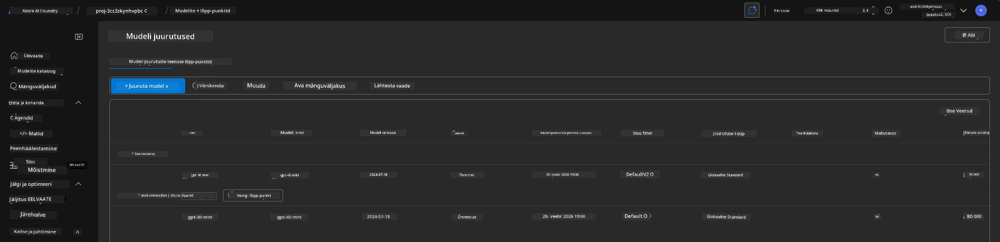
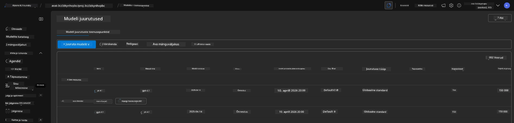

# 6. Tehniline infrastruktuur

!!! tip "SESI MÄÄRATUD MÄÄRATLUSES OLETE SUUTNUD"

    - [ ] Mõista ressursi puhastamise ja kulude haldamise tähtsust
    - [ ] Kasutada `azd down` infrastruktuuri turvaliseks eemaldamiseks
    - [ ] Taastada vajadusel pehme kustutusega kognitiivseid teenuseid
    - [ ] **Lab 6:** Puhastada Azure'i ressursid ja kontrollida eemaldamist

---

## Boonusülesanded

Enne projekti eemaldamist võta mõni minut avatud uurimiseks.

!!! info "Proovi neid uurimiskäsklusi"

    **Katseta GitHub Copilotiga:**
    
    1. Küsi: `Milliseid teisi AZD malle võiksin proovida mitmeagendi stsenaariumide jaoks?`
    2. Küsi: `Kuidas kohandada agendi juhiseid tervishoiu kasutusjuhtumi jaoks?`
    3. Küsi: `Millised keskkonnamuutujad kontrollivad kulude optimeerimist?`
    
    **Uuri Azure'i portaali:**
    
    1. Vaata üle Application Insightsi mõõdikud oma juurutuse jaoks
    2. Kontrolli pakutud ressursside kulude analüüsi
    3. Uuri veel kord Microsoft Foundry portaali agendi mänguväljakut

---

## Infrastruktuuri eemaldamine

1. Infrastruktuuri eemaldamine on sama lihtne kui:
      
      ```bash title="" linenums="0"
      azd down --purge
      ```
1. Lipp `--purge` tagab, et pehme kustutusega kognitiivsed teenused ka eemaldatakse, vabastades nende ressursside poolt hõivatud kvota. Kui protsess on lõpetatud, näed midagi sellist:
      
      ```bash title="" linenums="0"
      ? Total resources to delete: 11, are you sure you want to continue? Yes
      Deleting your resources can take some time.
      (✓) Done: Deleted resource group rg-nitya-mshack-azd
      (✓) Done: Purging Cognitive Account: aoai-3cz3zkynhvpbc

      SUCCESS: Your application was removed from Azure in 11 minutes 4 seconds.
      ```

1. (Valikuline) Kui nüüd uuesti käivitad `azd up`, märkad, et gpt-4.1 mudel juurutatakse, kuna keskkonnamuutuja muudeti (ja salvestati) kohalikus `.azure` kaustas. 

      Siin on mudeli juurutused **enne**:

      

      Ja siin on see **pärast**:
      

---

<!-- CO-OP TRANSLATOR DISCLAIMER START -->
**Vastutusest loobumine**:  
See dokument on tõlgitud AI-tõlketeenuse [Co-op Translator](https://github.com/Azure/co-op-translator) abil. Kuigi püüame täpsust tagada, palun arvestada, et automaatsed tõlked võivad sisaldada vigu või ebatäpsusi. Originaaldokument selle emakeeles tuleks käsitleda autoriteetse allikana. Olulise teabe puhul soovitatakse professionaalset inimtõlget. Me ei vastuta selle tõlge kasutamisega seotud arusaamatuste ega väärarusaamade eest.
<!-- CO-OP TRANSLATOR DISCLAIMER END -->