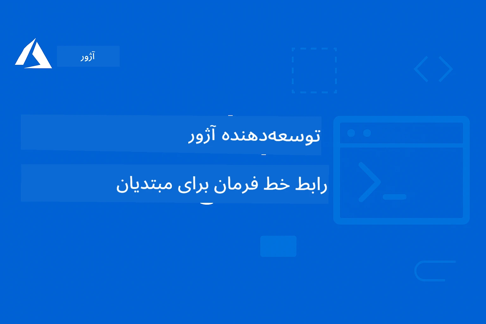

# AZD برای مبتدیان: یک مسیر یادگیری ساختاریافته

 

[](https://GitHub.com/microsoft/azd-for-beginners/watchers/)
[](https://GitHub.com/microsoft/azd-for-beginners/network/)
[](https://GitHub.com/microsoft/azd-for-beginners/stargazers/)

[](https://discord.gg/microsoft-azure)
[](https://discord.gg/nTYy5BXMWG)

## شروع با این دوره

مراحل زیر را برای شروع سفر یادگیری AZD خود دنبال کنید:

1. **فورک مخزن**: کلیک کنید [](https://GitHub.com/microsoft/azd-for-beginners/fork)
2. **کلون مخزن**: `git clone https://github.com/microsoft/azd-for-beginners.git`
3. **به جامعه بپیوندید**: [اجتماعات Azure Discord](https://discord.com/invite/ByRwuEEgH4) برای پشتیبانی تخصصی
4. **مسیر یادگیری خود را انتخاب کنید**: یک فصل زیر را انتخاب کنید که با سطح تجربه شما مطابقت دارد

### پشتیبانی چندزبانه

#### ترجمه‌های خودکار (همیشه به‌روز)

<!-- CO-OP TRANSLATOR LANGUAGES TABLE START -->
[عربی](../ar/README.md) | [بنگالی](../bn/README.md) | [بلغاری](../bg/README.md) | [برمه‌ای (میانمار)](../my/README.md) | [چینی (ساده‌شده)](../zh-CN/README.md) | [چینی (سنتی، هنگ‌کنگ)](../zh-HK/README.md) | [چینی (سنتی، ماکائو)](../zh-MO/README.md) | [چینی (سنتی، تایوان)](../zh-TW/README.md) | [کرواسی](../hr/README.md) | [چک](../cs/README.md) | [دانمارکی](../da/README.md) | [هلندی](../nl/README.md) | [استونی](../et/README.md) | [فنلاندی](../fi/README.md) | [فرانسوی](../fr/README.md) | [آلمانی](../de/README.md) | [یونانی](../el/README.md) | [عبری](../he/README.md) | [هندی](../hi/README.md) | [مجارستانی](../hu/README.md) | [اندونزیایی](../id/README.md) | [ایتالیایی](../it/README.md) | [ژاپنی](../ja/README.md) | [کانادا](../kn/README.md) | [کره‌ای](../ko/README.md) | [لیتوانی](../lt/README.md) | [مالایی](../ms/README.md) | [مالایالام](../ml/README.md) | [مراتی](../mr/README.md) | [نپالی](../ne/README.md) | [پیدجین نیجریایی](../pcm/README.md) | [نروژی](../no/README.md) | [فارسی](./README.md) | [لهستانی](../pl/README.md) | [پرتغالی (برزیل)](../pt-BR/README.md) | [پرتغالی (پرتغال)](../pt-PT/README.md) | [پنجابی (گرموخی)](../pa/README.md) | [رومانیایی](../ro/README.md) | [روسی](../ru/README.md) | [صربی (سیریلیک)](../sr/README.md) | [اسلواک](../sk/README.md) | [اسلونی](../sl/README.md) | [اسپانیایی](../es/README.md) | [سواحیلی](../sw/README.md) | [سوئدی](../sv/README.md) | [تاگالوگ (فیلیپینی)](../tl/README.md) | [تامیلی](../ta/README.md) | [تلگو](../te/README.md) | [تایلندی](../th/README.md) | [ترکی](../tr/README.md) | [اوکراینی](../uk/README.md) | [اردو](../ur/README.md) | [ویتنامی](../vi/README.md)

> **ترجیح می‌دهید به صورت محلی کلون کنید؟**

> این مخزن شامل بیش از ۵۰ ترجمه زبانی است که به طور قابل توجهی اندازه دانلود را افزایش می‌دهد. برای کلون بدون ترجمه‌ها، از sparse checkout استفاده کنید:  
> ```bash
> git clone --filter=blob:none --sparse https://github.com/microsoft/AZD-for-beginners.git
> cd AZD-for-beginners
> git sparse-checkout set --no-cone '/*' '!translations' '!translated_images'
> ```
> این به شما همه چیز مورد نیاز برای اتمام دوره را با دانلود بسیار سریع‌تر می‌دهد.
<!-- CO-OP TRANSLATOR LANGUAGES TABLE END -->

## نمای کلی دوره

با فصول ساختاریافته‌ای که برای یادگیری تدریجی طراحی شده‌اند، CLI توسعه‌دهنده Azure (azd) را به صورت تخصصی بیاموزید. **تمرکز ویژه بر استقرار برنامه‌های هوش مصنوعی با ادغام Microsoft Foundry.**

### چرا این دوره برای توسعه‌دهندگان مدرن ضروری است

بر اساس دیدگاه‌های جامعه Discord مایکروسافت فاندری، **۴۵٪ از توسعه‌دهندگان می‌خواهند از AZD برای بارهای کاری AI استفاده کنند** اما با چالش‌هایی مواجه‌اند مانند:
- معماری‌های پیچیده چندسرویسی هوش مصنوعی
- بهترین روش‌های استقرار AI در محیط تولید
- ادغام و پیکربندی سرویس‌های هوش مصنوعی Azure
- بهینه‌سازی هزینه برای بارهای کاری AI
- رفع مشکلات ویژه در استقرارهای AI

### اهداف یادگیری

با تکمیل این دوره ساختاریافته، شما قادر خواهید بود:
- **تسلط بر اصول AZD**: مفاهیم اصلی، نصب و پیکربندی
- **استقرار برنامه‌های هوش مصنوعی**: استفاده از AZD همراه با خدمات Microsoft Foundry
- **پیاده‌سازی زیرساخت به عنوان کد**: مدیریت منابع Azure با قالب‌های Bicep
- **عیب‌یابی استقرارها**: حل مشکلات رایج و رفع اشکال
- **بهینه‌سازی برای تولید**: امنیت، مقیاس‌پذیری، مانیتورینگ و مدیریت هزینه
- **ساخت راه‌حل‌های چندعاملی**: استقرار معماری‌های پیچیده هوش مصنوعی

## 📚 فصول یادگیری

*مسیر یادگیری خود را بر اساس سطح تجربه و اهداف انتخاب کنید*

### 🚀 فصل ۱: پایه و شروع سریع
**پیش‌نیازها**: اشتراک Azure، دانش پایه خط فرمان  
**مدت زمان**: ۳۰-۴۵ دقیقه  
**سطح سختی**: ⭐

#### آنچه یاد خواهید گرفت
- فهم اصول Azure Developer CLI
- نصب AZD روی پلتفرم خود
- اولین استقرار موفق خود

#### منابع یادگیری
- **🎯 از اینجا شروع کنید**: [Azure Developer CLI چیست؟](../..)
- **📖 نظریه**: [مبانی AZD](docs/getting-started/azd-basics.md) - مفاهیم اصلی و اصطلاحات
- **⚙️ تنظیمات**: [نصب و راه‌اندازی](docs/getting-started/installation.md) - راهنماهای مخصوص پلتفرم
- **🛠️ کار عملی**: [اولین پروژه شما](docs/getting-started/first-project.md) - آموزش گام به گام
- **📋 مرجع سریع**: [برگه تقلب دستورها](resources/cheat-sheet.md)

#### تمرین‌های عملی
```bash
# بررسی سریع نصب
azd version

# برنامه اول خود را مستقر کنید
azd init --template todo-nodejs-mongo
azd up
```
  
**💡 نتیجه فصل**: استقرار موفق یک برنامه وب ساده در Azure با استفاده از AZD

**✅ تایید موفقیت:**  
```bash
# پس از اتمام فصل ۱، باید بتوانید:
azd version              # نسخه نصب شده را نمایش می‌دهد
azd init --template todo-nodejs-mongo  # پروژه را مقداردهی اولیه می‌کند
azd up                  # به Azure مستقر می‌کند
azd show                # آدرس URL برنامه در حال اجرا را نمایش می‌دهد
# برنامه در مرورگر باز و کار می‌کند
azd down --force --purge  # منابع را پاک‌سازی می‌کند
```
  
**📊 زمان صرف شده:** ۳۰-۴۵ دقیقه  
**📈 سطح مهارت بعد از:** توانایی استقرار برنامه‌های پایه به صورت مستقل

**✅ تایید موفقیت:**  
```bash
# پس از اتمام فصل ۱، باید قادر باشید که:
azd version              # نسخه نصب شده را نمایش می‌دهد
azd init --template todo-nodejs-mongo  # پروژه را مقداردهی اولیه می‌کند
azd up                  # در Azure مستقر می‌کند
azd show                # آدرس اینترنتی برنامه در حال اجرا را نمایش می‌دهد
# برنامه در مرورگر باز می‌شود و کار می‌کند
azd down --force --purge  # منابع را پاک‌سازی می‌کند
```
  
**📊 زمان صرف شده:** ۳۰-۴۵ دقیقه  
**📈 سطح مهارت بعد از:** توانایی استقرار برنامه‌های پایه به صورت مستقل

---

### 🤖 فصل ۲: توسعه با اولویت هوش مصنوعی (توصیه شده برای توسعه‌دهندگان AI)
**پیش‌نیازها**: اتمام فصل ۱  
**مدت زمان**: ۱-۲ ساعت  
**سطح سختی**: ⭐⭐

#### آنچه یاد خواهید گرفت
- ادغام Microsoft Foundry با AZD
- استقرار برنامه‌های مجهز به هوش مصنوعی
- فهم پیکربندی‌های سرویس‌های هوش مصنوعی

#### منابع یادگیری
- **🎯 از اینجا شروع کنید**: [ادغام Microsoft Foundry](docs/microsoft-foundry/microsoft-foundry-integration.md)
- **📖 الگوها**: [استقرار مدل هوش مصنوعی](docs/microsoft-foundry/ai-model-deployment.md) - استقرار و مدیریت مدل‌های هوش مصنوعی
- **🛠️ کارگاه**: [کارگاه AI](docs/microsoft-foundry/ai-workshop-lab.md) - آماده‌سازی راه‌حل‌های هوش مصنوعی برای AZD
- **🎥 راهنمای تعاملی**: [مواد کارگاه](workshop/README.md) - یادگیری مبتنی بر مرورگر با MkDocs * محیط DevContainer
- **📋 قالب‌ها**: [قالب‌های Microsoft Foundry](../..)
- **📝 مثال‌ها**: [نمونه‌های استقرار AZD](examples/README.md)

#### تمرین‌های عملی
```bash
# برنامه هوش مصنوعی اول خود را مستقر کنید
azd init --template azure-search-openai-demo
azd up

# قالب‌های هوش مصنوعی اضافی را امتحان کنید
azd init --template openai-chat-app-quickstart
azd init --template agent-openai-python-prompty
```
  
**💡 نتیجه فصل**: استقرار و پیکربندی یک برنامه چت مجهز به هوش مصنوعی با قابلیت‌های RAG

**✅ تایید موفقیت:**  
```bash
# پس از فصل ۲، شما باید قادر باشید:
azd init --template azure-search-openai-demo
azd up
# رابط چت هوش مصنوعی را آزمایش کنید
# سوال بپرسید و پاسخ‌های هوش مصنوعی همراه با منابع دریافت کنید
# بررسی کنید که ادغام جستجو کار می‌کند
azd monitor  # بررسی کنید Application Insights داده‌های تله‌متری را نشان می‌دهد
azd down --force --purge
```
  
**📊 زمان صرف شده:** ۱-۲ ساعت  
**📈 سطح مهارت بعد از:** توانایی استقرار و پیکربندی برنامه‌های AI آماده تولید  
**💰 آگاهی هزینه:** درک هزینه‌های توسعه $۸۰-۱۵۰ در ماه، هزینه‌های تولید $۳۰۰-۳۵۰۰ در ماه

#### 💰 ملاحظات هزینه برای استقرارهای AI

**محیط توسعه (حدود ۸۰-۱۵۰ دلار در ماه):**
- Azure OpenAI (پرداخت به ازای مصرف): $0-50 در ماه (بر اساس مصرف توکن)
- AI Search (سطح پایه): ۷۵ دلار در ماه
- Container Apps (مصرفی): $0-20 در ماه
- ذخیره‌سازی (استاندارد): ۱-۵ دلار در ماه

**محیط تولید (حدود ۳۰۰-۳۵۰۰+ دلار در ماه):**
- Azure OpenAI (PTU برای عملکرد ثابت): $۳,۰۰۰+ در ماه یا پرداخت به ازای مصرف با حجم بالا
- AI Search (سطح استاندارد): ۲۵۰ دلار در ماه
- Container Apps (اختصاصی): ۵۰-۱۰۰ دلار در ماه
- Application Insights: ۵-۵۰ دلار در ماه
- ذخیره‌سازی (پرمیوم): ۱۰-۵۰ دلار در ماه

**💡 نکات بهینه‌سازی هزینه:**
- از **سطح رایگان** Azure OpenAI برای یادگیری استفاده کنید (۵۰,۰۰۰ توکن در ماه شامل می‌شود)
- با اجرای `azd down` منابع را وقتی توسعه فعال نیست آزاد کنید
- با صورتحساب مبتنی بر مصرف شروع کرده و فقط برای تولید به PTU ارتقا دهید
- برای تخمین هزینه‌ها قبل از استقرار از `azd provision --preview` استفاده کنید
- خودکارسازی مقیاس‌بندی را فعال کنید: تنها برای مصرف واقعی پرداخت کنید

**نظارت هزینه:**  
```bash
# بررسی هزینه‌های ماهانه تخمینی
azd provision --preview

# پایش هزینه‌های واقعی در پورتال Azure
az consumption budget list --resource-group <your-rg>
```
  
---

### ⚙️ فصل ۳: پیکربندی و احراز هویت
**پیش‌نیازها**: اتمام فصل ۱  
**مدت زمان**: ۴۵-۶۰ دقیقه  
**سطح سختی**: ⭐⭐

#### آنچه یاد خواهید گرفت
- پیکربندی و مدیریت محیط‌ها
- بهترین شیوه‌های احراز هویت و امنیت
- نام‌گذاری و سازماندهی منابع

#### منابع یادگیری
- **📖 پیکربندی**: [راهنمای پیکربندی](docs/getting-started/configuration.md) - راه‌اندازی محیط
- **🔐 امنیت**: [الگوهای احراز هویت و Managed Identity](docs/getting-started/authsecurity.md) - الگوهای احراز هویت
- **📝 مثال‌ها**: [مثال برنامه پایگاه داده](examples/database-app/README.md) - نمونه‌های پایگاه داده AZD

#### تمرین‌های عملی
- پیکربندی چند محیط (توسعه، آزمایشی، تولید)
- تنظیم احراز هویت managed identity
- پیاده‌سازی پیکربندی‌های مخصوص هر محیط

**💡 نتیجه فصل**: مدیریت چند محیط با احراز هویت و امنیت مناسب

---

### 🏗️ فصل ۴: زیرساخت به‌عنوان کد و استقرار
**پیش‌نیازها**: اتمام فصول ۱ تا ۳  
**مدت زمان**: ۱-۱.۵ ساعت  
**سطح سختی**: ⭐⭐⭐

#### آنچه یاد خواهید گرفت
- الگوهای پیشرفته استقرار
- زیرساخت به‌عنوان کد با Bicep
- استراتژی‌های تأمین منابع

#### منابع یادگیری
- **📖 استقرار**: [راهنمای استقرار](docs/deployment/deployment-guide.md) - گردش‌کارهای کامل
- **🏗️ تأمین منابع**: [تأمین منابع](docs/deployment/provisioning.md) - مدیریت منابع Azure
- **📝 مثال‌ها**: [مثال برنامه کانتینری](../../examples/container-app) - استقرار کانتینری

#### تمرین‌های عملی
- ساخت قالب‌های بایسپ سفارشی
- استقرار برنامه‌های چندسرویسی
- پیاده‌سازی استراتژی‌های استقرار blue-green

**💡 نتیجه فصل**: استقرار برنامه‌های چندسرویسی پیچیده با استفاده از قالب‌های زیرساخت سفارشی

---

### 🎯 فصل ۵: راه‌حل‌های چندعاملی هوش مصنوعی (پیشرفته)
**پیش‌نیازها**: اتمام فصول ۱ تا ۲  
**مدت زمان**: ۲-۳ ساعت  
**سطح سختی**: ⭐⭐⭐⭐
#### آنچه یاد خواهید گرفت
- الگوهای معماری چندعاملی
- هماهنگی و ارکستراسیون عامل‌ها
- استقرارهای آماده تولید هوش مصنوعی

#### منابع یادگیری
- **🤖 پروژه منتخب**: [راهکار چندعاملی خرده‌فروشی](examples/retail-scenario.md) - پیاده‌سازی کامل
- **🛠️ قالب‌های ARM**: [بسته قالب ARM](../../examples/retail-multiagent-arm-template) - استقرار با یک کلیک
- **📖 معماری**: [الگوهای هماهنگی چندعاملی](/docs/pre-deployment/coordination-patterns.md) - الگوها

#### تمرین‌های عملی
```bash
# پیاده‌سازی کامل راه‌حل چندعاملی خرده‌فروشی
cd examples/retail-multiagent-arm-template
./deploy.sh

# بررسی تنظیمات عامل‌ها
az deployment group show --resource-group <rg-name> --name <deployment-name>
```

**💡 نتیجه فصل**: استقرار و مدیریت راهکار هوش مصنوعی چندعاملی آماده تولید با عامل‌های مشتری و موجودی

---

### 🔍 فصل ۶: اعتبارسنجی و برنامه‌ریزی پیش از استقرار
**پیش‌نیازها**: تکمیل فصل ۴  
**مدت زمان**: ۱ ساعت  
**پیچیدگی**: ⭐⭐

#### آنچه یاد خواهید گرفت
- برنامه‌ریزی ظرفیت و اعتبارسنجی منابع
- استراتژی‌های انتخاب SKU
- بررسی‌های پیش‌پرواز و خودکارسازی

#### منابع یادگیری
- **📊 برنامه‌ریزی**: [برنامه‌ریزی ظرفیت](docs/pre-deployment/capacity-planning.md) - اعتبارسنجی منابع
- **💰 انتخاب**: [انتخاب SKU](docs/pre-deployment/sku-selection.md) - گزینه‌های مقرون به صرفه
- **✅ اعتبارسنجی**: [بررسی‌های پیش‌پرواز](docs/pre-deployment/preflight-checks.md) - اسکریپت‌های خودکار

#### تمرین‌های عملی
- اجرای اسکریپت‌های اعتبارسنجی ظرفیت
- بهینه‌سازی انتخاب‌های SKU برای کاهش هزینه
- پیاده‌سازی بررسی‌های پیش‌استقرار خودکار

**💡 نتیجه فصل**: اعتبارسنجی و بهینه‌سازی استقرارها قبل از اجرا

---

### 🚨 فصل ۷: عیب‌یابی و دیباگ
**پیش‌نیازها**: تکمیل هر فصل استقرار  
**مدت زمان**: ۱ تا ۱.۵ ساعت  
**پیچیدگی**: ⭐⭐

#### آنچه یاد خواهید گرفت
- رویکردهای سیستماتیک دیباگ
- مسائل رایج و راه‌حل‌ها
- عیب‌یابی مخصوص هوش مصنوعی

#### منابع یادگیری
- **🔧 مسائل رایج**: [مسائل رایج](docs/troubleshooting/common-issues.md) - سوالات متداول و راه‌حل‌ها
- **🕵️ دیباگ**: [راهنمای دیباگ](docs/troubleshooting/debugging.md) - استراتژی‌های گام‌به‌گام
- **🤖 مسائل هوش مصنوعی**: [عیب‌یابی ویژه هوش مصنوعی](docs/troubleshooting/ai-troubleshooting.md) - مشکلات خدمات هوش مصنوعی

#### تمرین‌های عملی
- تشخیص خطاهای استقرار
- حل مشکلات احراز هویت
- دیباگ اتصال سرویس هوش مصنوعی

**💡 نتیجه فصل**: تشخیص و رفع مستقل مشکلات رایج استقرار

---

### 🏢 فصل ۸: الگوهای تولید و سازمانی
**پیش‌نیازها**: تکمیل فصل‌های ۱ تا ۴  
**مدت زمان**: ۲ تا ۳ ساعت  
**پیچیدگی**: ⭐⭐⭐⭐

#### آنچه یاد خواهید گرفت
- استراتژی‌های استقرار تولید
- الگوهای امنیت سازمانی
- پایش و بهینه‌سازی هزینه

#### منابع یادگیری
- **🏭 تولید**: [بهترین شیوه‌های هوش مصنوعی تولیدی](docs/microsoft-foundry/production-ai-practices.md) - الگوهای سازمانی
- **📝 مثال‌ها**: [مثال میکروسرویس‌ها](../../examples/microservices) - معماری‌های پیچیده
- **📊 پایش**: [ادغام Application Insights](docs/pre-deployment/application-insights.md) - پایش

#### تمرین‌های عملی
- پیاده‌سازی الگوهای امنیت سازمانی
- راه‌اندازی سیستم پایش جامع
- استقرار در تولید با حاکمیت مناسب

**💡 نتیجه فصل**: استقرار برنامه‌های آماده سازمانی با قابلیت‌های کامل تولید

---

## 🎓 مرور کارگاه: تجربه یادگیری عملی

> **⚠️ وضعیت کارگاه: در حال توسعه فعال**  
> مواد کارگاه در حال توسعه و اصلاح هستند. ماژول‌های اصلی عملکرد دارند اما بخش‌های پیشرفته تکمیل نشده‌اند. ما در حال کار برای تکمیل همه محتواها هستیم. [پیگیری پیشرفت →](workshop/README.md)

### مواد تعاملی کارگاه
**یادگیری عملی کامل با ابزارهای تحت وب و تمرینات راهنمایی‌شده**

مواد کارگاه، تجربه یادگیری ساختاربندی شده و تعاملی را ارائه می‌دهد که مکمل دوره‌های فصل‌بندی شده بالا است. این کارگاه برای یادگیری خودسرعت و جلسات رهبری شده طراحی شده است.

#### 🛠️ ویژگی‌های کارگاه
- **رابط تحت وب**: کارگاه کامل بر پایه MkDocs با جستجو، کپی و گزینه‌های تم
- **ادغام GitHub Codespaces**: راه‌اندازی محیط توسعه با یک کلیک
- **مسیر یادگیری ساختاریافته**: ۷ مرحله تمرین راهنمایی‌شده (در مجموع ۳.۵ ساعت)
- **کشف → استقرار → سفارشی‌سازی**: متدولوژی تدریجی
- **محیط تعاملی DevContainer**: ابزارها و وابستگی‌های پیکربندی شده از پیش

#### 📚 ساختار کارگاه
کارگاه بر اساس متدولوژی **کشف → استقرار → سفارشی‌سازی** است:

۱. **فاز کشف** (۴۵ دقیقه)  
   - بررسی قالب‌ها و خدمات Microsoft Foundry  
   - درک الگوهای معماری چندعاملی  
   - مرور نیازمندی‌ها و پیش‌نیازهای استقرار  

۲. **فاز استقرار** (۲ ساعت)  
   - استقرار عملی برنامه‌های هوش مصنوعی با AZD  
   - پیکربندی خدمات و نقاط انتهایی Azure AI  
   - پیاده‌سازی الگوهای امنیت و احراز هویت  

۳. **فاز سفارشی‌سازی** (۴۵ دقیقه)  
   - تغییر برنامه‌ها برای موارد استفاده خاص  
   - بهینه‌سازی برای استقرار تولید  
   - پیاده‌سازی پایش و مدیریت هزینه  

#### 🚀 شروع کار با کارگاه
```bash
# گزینه ۱: گیت‌هاب کد‌اسپیس‌ها (توصیه شده)
# روی "Code" کلیک کنید → "Create codespace on main" در مخزن

# گزینه ۲: توسعه محلی
git clone https://github.com/microsoft/azd-for-beginners.git
cd azd-for-beginners/workshop
# دستورالعمل‌های راه‌اندازی را در workshop/README.md دنبال کنید
```

#### 🎯 نتایج یادگیری کارگاه
با تکمیل کارگاه، شرکت‌کنندگان قادر خواهند بود:
- **استقرار برنامه‌های هوش مصنوعی تولیدی**: استفاده از AZD با خدمات Microsoft Foundry  
- **تسلط بر معماری‌های چندعاملی**: پیاده‌سازی راهکارهای هماهنگ عامل‌های هوش مصنوعی  
- **پیاده‌سازی بهترین شیوه‌های امنیتی**: پیکربندی احراز هویت و کنترل دسترسی  
- **بهینه‌سازی برای مقیاس**: طراحی استقرارهای مقرون به صرفه و عملکردی  
- **عیب‌یابی استقرارها**: رفع مستقل مسائل رایج  

#### 📖 منابع کارگاه
- **🎥 راهنمای تعاملی**: [مواد کارگاه](workshop/README.md) - محیط یادگیری تحت وب  
- **📋 دستورالعمل گام‌به‌گام**: [تمرینات راهنمایی‌شده](../../workshop/docs/instructions) - راهنمای جامع  
- **🛠️ آزمایشگاه کارگاه هوش مصنوعی**: [آزمایشگاه کارگاه AI](docs/microsoft-foundry/ai-workshop-lab.md) - تمرین‌های تخصصی هوش مصنوعی  
- **💡 شروع سریع**: [راهنمای راه‌اندازی کارگاه](workshop/README.md#quick-start) - پیکربندی محیط  

**مناسب برای**: آموزش‌های شرکتی، دوره‌های دانشگاهی، یادگیری خودسرعت، و بوت‌کمپ‌های توسعه‌دهنده.

---

## 📖 Azure Developer CLI چیست؟

Azure Developer CLI (azd) یک رابط خط فرمان متمرکز بر توسعه‌دهنده است که فرایند ساخت و استقرار برنامه‌ها در Azure را تسریع می‌کند. قابلیت‌ها شامل:

- **استقرارهای مبتنی بر قالب** - استفاده از قالب‌های آماده برای الگوهای معمول برنامه‌ها  
- **زیرساخت به عنوان کد** - مدیریت منابع Azure با Bicep یا Terraform  
- **فرایندهای کاری یکپارچه** - فراهم‌سازی، استقرار و پایش برنامه‌ها به‌صورت همزمان  
- **دوستدار توسعه‌دهنده** - بهینه‌سازی برای بهره‌وری و تجربه توسعه‌دهنده  

### **AZD + Microsoft Foundry: مناسب برای استقرارهای هوش مصنوعی**

**چرا AZD برای راهکارهای هوش مصنوعی؟** AZD به چالش‌های اصلی توسعه‌دهندگان هوش مصنوعی پاسخ می‌دهد:

- **قالب‌های آماده هوش مصنوعی** - قالب‌های پیش‌پیکربندی شده برای Azure OpenAI، خدمات شناختی و بارهای کاری ML  
- **استقرارهای امن هوش مصنوعی** - الگوهای امنیت داخلی برای خدمات هوش مصنوعی، کلیدهای API و نقاط انتهایی مدل  
- **الگوهای تولیدی هوش مصنوعی** - بهترین روش‌ها برای استقرارهای مقیاس‌پذیر و مقرون به صرفه برنامه‌های هوش مصنوعی  
- **فرایندهای کاری هوش مصنوعی از ابتدا تا انتها** - از توسعه مدل تا استقرار تولید همراه با پایش مناسب  
- **بهینه‌سازی هزینه** - تخصیص هوشمند منابع و استراتژی‌های مقیاس برای بارهای هوش مصنوعی  
- **ادغام Microsoft Foundry** - اتصال بی‌وقفه به کاتالوگ مدل‌ها و نقاط انتهایی Microsoft Foundry  

---

## 🎯 کتابخانه قالب‌ها و مثال‌ها

### منتخب: قالب‌های Microsoft Foundry
**اگر برنامه‌های هوش مصنوعی را مستقر می‌کنید از اینجا شروع کنید!**

> **توجه:** این قالب‌ها الگوهای مختلف هوش مصنوعی را نشان می‌دهند. برخی نمونه‌های خارجی Azure و برخی پیاده‌سازی‌های محلی هستند.

| قالب | فصل | پیچیدگی | خدمات | نوع |
|----------|---------|------------|----------|------|
| [**شروع با چت هوش مصنوعی**](https://github.com/Azure-Samples/get-started-with-ai-chat) | فصل ۲ | ⭐⭐ | AzureOpenAI + API استنتاج مدل هوش مصنوعی Azure + جستجوی Azure AI + Azure Container Apps + Application Insights | خارجی |
| [**شروع با عامل‌های هوش مصنوعی**](https://github.com/Azure-Samples/get-started-with-ai-agents) | فصل ۲ | ⭐⭐ | سرویس عامل هوش مصنوعی Azure + AzureOpenAI + جستجوی Azure AI + Azure Container Apps + Application Insights| خارجی |
| [**دموی Azure Search + OpenAI**](https://github.com/Azure-Samples/azure-search-openai-demo) | فصل ۲ | ⭐⭐ | AzureOpenAI + جستجوی Azure AI + App Service + ذخیره‌سازی | خارجی |
| [**راه‌اندازی سریع اپ چت OpenAI**](https://github.com/Azure-Samples/openai-chat-app-quickstart) | فصل ۲ | ⭐ | AzureOpenAI + Container Apps + Application Insights | خارجی |
| [**عامل OpenAI Python Prompty**](https://github.com/Azure-Samples/agent-openai-python-prompty) | فصل ۵ | ⭐⭐⭐ | AzureOpenAI + Azure Functions + Prompty | خارجی |
| [**چت RAG Contoso**](https://github.com/Azure-Samples/contoso-chat) | فصل ۸ | ⭐⭐⭐⭐ | AzureOpenAI + جستجوی AI + Cosmos DB + Container Apps | خارجی |
| [**راهکار چندعاملی خرده‌فروشی**](examples/retail-scenario.md) | فصل ۵ | ⭐⭐⭐⭐ | AzureOpenAI + جستجوی AI + ذخیره‌سازی + Container Apps + Cosmos DB | **محلی** |

### منتخب: سناریوهای کامل یادگیری
**قالب برنامه‌های آماده تولید منطبق بر فصل‌های یادگیری**

| قالب | فصل یادگیری | پیچیدگی | نکات کلیدی یادگیری |
|----------|------------------|------------|--------------|
| [**راه‌اندازی سریع اپ چت OpenAI**](https://github.com/Azure-Samples/openai-chat-app-quickstart) | فصل ۲ | ⭐ | الگوهای استقرار پایه هوش مصنوعی |
| [**دموی azure-search-openai**](https://github.com/Azure-Samples/azure-search-openai-demo) | فصل ۲ | ⭐⭐ | پیاده‌سازی RAG با جستجوی Azure AI |
| [**پردازش اسناد AI**](https://github.com/Azure-Samples/ai-document-processing) | فصل ۴ | ⭐⭐ | ادغام هوش مستندات |
| [**عامل OpenAI Python Prompty**](https://github.com/Azure-Samples/agent-openai-python-prompty) | فصل ۵ | ⭐⭐⭐ | چارچوب عامل و فراخوانی تابع |
| [**چت Contoso**](https://github.com/Azure-Samples/contoso-chat) | فصل ۸ | ⭐⭐⭐ | ارکستراسیون هوش مصنوعی سازمانی |
| [**راهکار چندعاملی خرده‌فروشی**](examples/retail-scenario.md) | فصل ۵ | ⭐⭐⭐⭐ | معماری چندعاملی با عامل‌های مشتری و موجودی |

### یادگیری بر اساس نوع مثال

> **📌 مثال‌های محلی در برابر خارجی:**  
> **مثال‌های محلی** (در این مخزن) = آماده استفاده فوری  
> **مثال‌های خارجی** (نمونه‌های Azure) = کلون از مخازن لینک شده

#### مثال‌های محلی (آماده استفاده)
- [**راهکار چندعاملی خرده‌فروشی**](examples/retail-scenario.md) - پیاده‌سازی کامل آماده تولید با قالب‌های ARM  
  - معماری چندعاملی (عامل‌های مشتری + موجودی)  
  - پایش و ارزیابی جامع  
  - استقرار با یک کلیک از طریق قالب ARM

#### مثال‌های محلی - برنامه‌های کانتینری (فصل‌های ۲ تا ۵)
**مثال‌های جامع استقرار کانتینری در این مخزن:**  
- [**مثال‌های برنامه کانتینر**](examples/container-app/README.md) - راهنمای کامل استقرار کانتینری  
  - [API ساده Flask](../../examples/container-app/simple-flask-api) - REST API پایه با قابلیت مقیاس صفر  
  - [معماری میکروسرویس‌ها](../../examples/container-app/microservices) - استقرار چندسرویس آماده تولید  
  - الگوهای شروع سریع، تولید و پیشرفته  
  - راهنمای پایش، امنیت و بهینه‌سازی هزینه  

#### مثال‌های خارجی - برنامه‌های ساده (فصل‌های ۱ و ۲)
**نمونه‌های Azure زیر را کلون کنید تا شروع کنید:**  
- [برنامه وب ساده - Node.js + MongoDB](https://github.com/Azure-Samples/todo-nodejs-mongo) - الگوهای استقرار پایه  
- [وب‌سایت استاتیک - React SPA](https://github.com/Azure-Samples/todo-csharp-sql-swa-func) - استقرار محتوا استاتیک  
- [برنامه کانتینر - Python Flask](https://github.com/Azure-Samples/container-apps-store-api-microservice) - استقرار REST API

#### مثال‌های خارجی - ادغام پایگاه داده (فصل‌های ۳ و ۴)  
- [برنامه پایگاه داده - C# + SQL](https://github.com/Azure-Samples/todo-csharp-sql) - الگوهای اتصال پایگاه داده  
- [توابع + Cosmos DB](https://github.com/Azure-Samples/todo-python-mongo-swa-func) - فرایند داده بدون سرور

#### مثال‌های خارجی - الگوهای پیشرفته (فصل‌های ۴ تا ۸)
- [میکروسرویس‌های جاوا](https://github.com/Azure-Samples/java-microservices-aca-lab) - معماری‌های چندسرویس  
- [شغل‌های برنامه‌های کانتینری](https://github.com/Azure-Samples/container-apps-jobs) - پردازش پس‌زمینه  
- [خط لوله ML سازمانی](https://github.com/Azure-Samples/mlops-v2) - الگوهای آماده تولید ML

### مجموعه قالب‌های خارجی
- [**گالری قالب رسمی AZD**](https://azure.github.io/awesome-azd/) - مجموعه منتخب قالب‌های رسمی و جامعه توسعه‌دهندگان
- [**قالب‌های Azure Developer CLI**](https://learn.microsoft.com/en-us/azure/developer/azure-developer-cli/azd-templates) - مستندات قالب‌های Microsoft Learn  
- [**دایرکتوری نمونه‌ها**](examples/README.md) - نمونه‌های آموزشی محلی با توضیحات دقیق

---

## 📚 منابع و مراجع آموزشی

### مراجع سریع
- [**برگه خلاصه دستورات**](resources/cheat-sheet.md) - دستورات ضروری azd مرتب شده بر اساس فصل  
- [**واژه‌نامه**](resources/glossary.md) - اصطلاحات Azure و azd  
- [**سؤالات متداول**](resources/faq.md) - سؤالات رایج مرتب شده بر اساس فصل‌های آموزشی  
- [**راهنمای مطالعه**](resources/study-guide.md) - تمرینات جامع عملی

### کارگاه‌های عملی
- [**لابراتوار کارگاه هوش مصنوعی**](docs/microsoft-foundry/ai-workshop-lab.md) - قابل استقرار با AZD کردن راه‌حل‌های هوش مصنوعی شما (۲-۳ ساعت)  
- [**راهنمای کارگاه تعاملی**](workshop/README.md) - کارگاه مبتنی بر مرورگر با محیط MkDocs و DevContainer  
- [**مسیر یادگیری ساختاریافته**](../../workshop/docs/instructions) - تمرینات هفت مرحله‌ای راهنمایی شده (کشف → استقرار → سفارشی‌سازی)  
- [**کارگاه AZD برای مبتدیان**](workshop/README.md) - مواد کامل کارگاه عملی با یکپارچه‌سازی GitHub Codespaces

### منابع آموزشی خارجی  
- مستندات Azure Developer CLI  
- مرکز معماری Azure  
- ماشین‌حساب قیمت‌گذاری Azure  
- وضعیت Azure

---

## 🔧 راهنمای سریع رفع اشکال

**مسائل رایجی که تازه‌کارها با آن مواجه‌اند و راه‌حل‌های فوری:**

### ❌ "azd: command not found"

```bash
# ابتدا AZD را نصب کنید
# ویندوز (PowerShell):
winget install microsoft.azd

# مک‌اواس:
brew tap azure/azd && brew install azd

# لینوکس:
curl -fsSL https://aka.ms/install-azd.sh | bash

# نصب را تأیید کنید
azd version
```
  
### ❌ "No subscription found" یا "Subscription not set"

```bash
# فهرست اشتراک‌های موجود
az account list --output table

# تنظیم اشتراک پیش‌فرض
az account set --subscription "<subscription-id-or-name>"

# تنظیم برای محیط AZD
azd env set AZURE_SUBSCRIPTION_ID "<subscription-id>"

# بررسی صحت
az account show
```
  
### ❌ "InsufficientQuota" یا "Quota exceeded"

```bash
# آزمایش منطقه مختلف Azure
azd env set AZURE_LOCATION "westus2"
azd up

# یا استفاده از اندازه‌های کوچکتر SKU در توسعه
# ویرایش infra/main.parameters.json:
{
  "sku": "B1"  // Instead of "P1V2"
}
```
  
### ❌ شکست دستور "azd up" در میانه راه

```bash
# گزینه ۱: پاک کردن و دوباره تلاش کردن
azd down --force --purge
azd up

# گزینه ۲: فقط زیرساخت را اصلاح کنید
azd provision

# گزینه ۳: بررسی لاگ‌های دقیق‌تر
azd show
azd logs
```
  
### ❌ "Authentication failed" یا "Token expired"

```bash
# تأیید هویت مجدد
az logout
az login

azd auth logout
azd auth login

# تأیید هویت را بررسی کنید
az account show
```
  
### ❌ "Resource already exists" یا تعارض نام

```bash
# AZD نام‌های منحصر به فرد ایجاد می‌کند، اما در صورت تداخل:
azd down --force --purge

# سپس با محیط تازه دوباره تلاش کنید
azd env new dev-v2
azd up
```
  
### ❌ استقرار قالب بیش از حد طول می‌کشد

**زمان انتظار معمول:**  
- برنامه وب ساده: ۵-۱۰ دقیقه  
- برنامه با پایگاه داده: ۱۰-۱۵ دقیقه  
- برنامه‌های هوش مصنوعی: ۱۵-۲۵ دقیقه (تأمین OpenAI کند است)

```bash
# بررسی پیشرفت
azd show

# اگر بیش از ۳۰ دقیقه گیر کردید، پورتال آزور را بررسی کنید:
azd monitor
# به دنبال استقرارهای ناموفق بگردید
```
  
### ❌ "Permission denied" یا "Forbidden"

```bash
# نقش Azure خود را بررسی کنید
az role assignment list --assignee $(az account show --query user.name -o tsv)

# حداقل به نقش «سهیم‌کننده» نیاز دارید
# از مدیر Azure خود بخواهید ارائه دهد:
# - سهیم‌کننده (برای منابع)
# - مدیر دسترسی کاربر (برای تخصیص نقش‌ها)
```
  
### ❌ یافت نشدن آدرس برنامه مستقر شده

```bash
# نمایش تمام نقاط انتهایی سرویس
azd show

# یا باز کردن پورتال آژور
azd monitor

# بررسی سرویس خاص
azd env get-values
# جستجو برای متغیرهای *_URL
```
  
### 📚 منابع کامل رفع اشکال

- **راهنمای مسائل رایج:** [راه‌حل‌های دقیق](docs/troubleshooting/common-issues.md)  
- **مسائل خاص هوش مصنوعی:** [رفع اشکال هوش مصنوعی](docs/troubleshooting/ai-troubleshooting.md)  
- **راهنمای اشکال‌زدایی:** [اشکال‌زدایی گام‌به‌گام](docs/troubleshooting/debugging.md)  
- **دریافت کمک:** [Azure Discord](https://discord.gg/microsoft-azure) #azure-developer-cli

---

## 🔧 راهنمای سریع رفع اشکال

**مسائل رایجی که تازه‌کارها با آن مواجه‌اند و راه‌حل‌های فوری:**

<details>
<summary><strong>❌ "azd: command not found"</strong></summary>

```bash
# ابتدا AZD را نصب کنید
# ویندوز (PowerShell):
winget install microsoft.azd

# مک‌اواس:
brew tap azure/azd && brew install azd

# لینوکس:
curl -fsSL https://aka.ms/install-azd.sh | bash

# نصب را بررسی کنید
azd version
```
</details>

<details>
<summary><strong>❌ "No subscription found" یا "Subscription not set"</strong></summary>

```bash
# لیست اشتراک‌های موجود
az account list --output table

# تنظیم اشتراک پیش‌فرض
az account set --subscription "<subscription-id-or-name>"

# تنظیم برای محیط AZD
azd env set AZURE_SUBSCRIPTION_ID "<subscription-id>"

# تأیید کردن
az account show
```
</details>

<details>
<summary><strong>❌ "InsufficientQuota" یا "Quota exceeded"</strong></summary>

```bash
# آزمایش منطقه مختلف Azure
azd env set AZURE_LOCATION "westus2"
azd up

# یا استفاده از اندازه‌های کوچکتر SKU در توسعه
# ویرایش infra/main.parameters.json:
{
  "sku": "B1"  // Instead of "P1V2"
}
```
</details>

<details>
<summary><strong>❌ شکست دستور "azd up" در میانه راه</strong></summary>

```bash
# گزینه ۱: پاک کردن و دوباره تلاش کردن
azd down --force --purge
azd up

# گزینه ۲: فقط زیرساخت را اصلاح کنید
azd provision

# گزینه ۳: بررسی لاگ‌های دقیق
azd show
azd logs
```
</details>

<details>
<summary><strong>❌ "Authentication failed" یا "Token expired"</strong></summary>

```bash
# احراز هویت مجدد
az logout
az login

azd auth logout
azd auth login

# تایید اعتبار سنجی
az account show
```
</details>

<details>
<summary><strong>❌ "Resource already exists" یا تعارض نام</strong></summary>

```bash
# AZD نام‌های منحصر به فرد ایجاد می‌کند، اما اگر تداخل وجود داشته باشد:
azd down --force --purge

# سپس با محیط جدید دوباره تلاش کنید
azd env new dev-v2
azd up
```
</details>

<details>
<summary><strong>❌ استقرار قالب بیش از حد طول می‌کشد</strong></summary>

**زمان انتظار معمول:**  
- برنامه وب ساده: ۵-۱۰ دقیقه  
- برنامه با پایگاه داده: ۱۰-۱۵ دقیقه  
- برنامه‌های هوش مصنوعی: ۱۵-۲۵ دقیقه (تأمین OpenAI کند است)

```bash
# بررسی پیشرفت
azd show

# اگر بیش از ۳۰ دقیقه گیر کردید، پورتال Azure را بررسی کنید:
azd monitor
# به دنبال استقرارهای ناموفق بگردید
```
</details>

<details>
<summary><strong>❌ "Permission denied" یا "Forbidden"</strong></summary>

```bash
# نقش Azure خود را بررسی کنید
az role assignment list --assignee $(az account show --query user.name -o tsv)

# حداقل به نقش «همکار» نیاز دارید
# از مدیر Azure خود بخواهید اعطا کند:
# - همکار (برای منابع)
# - مدیر دسترسی کاربران (برای اختصاص نقش‌ها)
```
</details>

<details>
<summary><strong>❌ یافت نشدن آدرس برنامه مستقر شده</strong></summary>

```bash
# نمایش تمام نقاط پایان سرویس
azd show

# یا باز کردن پورتال آزور
azd monitor

# بررسی سرویس خاص
azd env get-values
# جستجو برای متغیرهای *_URL
```
</details>

### 📚 منابع کامل رفع اشکال

- **راهنمای مسائل رایج:** [راه‌حل‌های دقیق](docs/troubleshooting/common-issues.md)  
- **مسائل خاص هوش مصنوعی:** [رفع اشکال هوش مصنوعی](docs/troubleshooting/ai-troubleshooting.md)  
- **راهنمای اشکال‌زدایی:** [اشکال‌زدایی گام‌به‌گام](docs/troubleshooting/debugging.md)  
- **دریافت کمک:** [Azure Discord](https://discord.gg/microsoft-azure) #azure-developer-cli

---

## 🎓 اتمام دوره و دریافت گواهینامه

### پیگیری پیشرفت  
پیشرفت یادگیری خود را در هر فصل دنبال کنید:

- [ ] **فصل ۱**: مبانی و شروع سریع ✅  
- [ ] **فصل ۲**: توسعه AI-محور ✅  
- [ ] **فصل ۳**: پیکربندی و احراز هویت ✅  
- [ ] **فصل ۴**: زیرساخت به عنوان کد و استقرار ✅  
- [ ] **فصل ۵**: راه‌حل‌های AI چندعاملی ✅  
- [ ] **فصل ۶**: اعتبارسنجی و برنامه‌ریزی قبل از استقرار ✅  
- [ ] **فصل ۷**: رفع اشکال و اشکال‌زدایی ✅  
- [ ] **فصل ۸**: الگوهای تولید و سازمانی ✅

### تأیید یادگیری  
پس از تکمیل هر فصل، دانش خود را با موارد زیر تأیید کنید:  
۱. **تمرین عملی:** تکمیل استقرار عملی فصل  
۲. **بررسی دانش:** بازبینی بخش سؤالات متداول فصل  
۳. **بحث در جامعه:** به اشتراک گذاشتن تجربیات در Azure Discord  
۴. **فصل بعدی:** حرکت به سطح بالاتر پیچیدگی

### مزایای اتمام دوره  
پس از اتمام همه فصل‌ها، شما:  
- **تجربه تولید:** برنامه‌های واقعی هوش مصنوعی مستقر شده در Azure  
- **مهارت‌های حرفه‌ای:** توانایی استقرار سازمانی  
- **پذیرش جامعه:** عضو فعال جامعه توسعه‌دهندگان Azure  
- **پیشرفت شغلی:** تخصص مورد تقاضا در حوزه AZD و استقرار هوش مصنوعی

---

## 🤝 جامعه و پشتیبانی

### دریافت کمک و پشتیبانی  
- **مسائل فنی:** [گزارش خطاها و پیشنهاد ویژگی](https://github.com/microsoft/azd-for-beginners/issues)  
- **سؤالات آموزشی:** [جامعه دیسکورد Microsoft Azure](https://discord.gg/microsoft-azure) و [](https://discord.gg/nTYy5BXMWG)  
- **کمک‌های خاص هوش مصنوعی:** به [](https://discord.gg/nTYy5BXMWG) بپیوندید  
- **مستندات:** [مستندات رسمی Azure Developer CLI](https://learn.microsoft.com/en-us/azure/developer/azure-developer-cli/)

### دیدگاه‌های جامعه از Discord Microsoft Foundry

**نتایج نظرسنجی اخیر از کانال #Azure:**  
- **۴۵٪** توسعه‌دهندگان می‌خواهند از AZD برای بارهای کاری AI استفاده کنند  
- **چالش‌های اصلی:** استقرار چندخدمتی، مدیریت اعتبارنامه، آماده‌سازی برای تولید  
- **بیشترین درخواست‌ها:** قالب‌های مخصوص AI، راهنماهای رفع اشکال، بهترین شیوه‌ها

**با پیوستن به جامعه ما می‌توانید:**  
- تجربیات AZD + AI خود را به اشتراک بگذارید و کمک بگیرید  
- به پیش‌نمایش‌های زودهنگام قالب‌های جدید AI دسترسی پیدا کنید  
- در بهترین شیوه‌های استقرار AI مشارکت کنید  
- بر توسعه ویژگی‌های آینده AI + AZD تأثیر بگذارید

### مشارکت در دوره  
ما استقبال می‌کنیم! لطفاً راهنمای [مشارکت](CONTRIBUTING.md) را بخوانید که شامل:  
- **بهبود محتوا:** ارتقاء فصل‌ها و نمونه‌های موجود  
- **نمونه‌های جدید:** افزودن سناریوها و قالب‌های واقعی  
- **ترجمه:** کمک به حفظ پشتیبانی چند زبانه  
- **گزارش خطا:** افزایش دقت و وضوح  
- **استانداردهای جامعه:** پیروی از دستورالعمل‌های جامع جامعه

---

## 📄 اطلاعات دوره

### مجوز  
این پروژه تحت مجوز MIT است - برای جزییات فایل [LICENSE](../../LICENSE) را ببینید.

### منابع آموزشی مرتبط مایکروسافت

تیم ما دوره‌های جامع آموزشی دیگری تولید می‌کند:

<!-- CO-OP TRANSLATOR OTHER COURSES START -->
### LangChain  
[](https://aka.ms/langchain4j-for-beginners)  
[](https://aka.ms/langchainjs-for-beginners?WT.mc_id=m365-94501-dwahlin)  
[](https://github.com/microsoft/langchain-for-beginners?WT.mc_id=m365-94501-dwahlin)  
---

### Azure / Edge / MCP / Agents  
[](https://github.com/microsoft/AZD-for-beginners?WT.mc_id=academic-105485-koreyst)  
[](https://github.com/microsoft/edgeai-for-beginners?WT.mc_id=academic-105485-koreyst)  
[](https://github.com/microsoft/mcp-for-beginners?WT.mc_id=academic-105485-koreyst)  
[](https://github.com/microsoft/ai-agents-for-beginners?WT.mc_id=academic-105485-koreyst)  

---

### سری هوش مصنوعی مولد  
[](https://github.com/microsoft/generative-ai-for-beginners?WT.mc_id=academic-105485-koreyst)  
[-9333EA?style=for-the-badge&labelColor=E5E7EB&color=9333EA)](https://github.com/microsoft/Generative-AI-for-beginners-dotnet?WT.mc_id=academic-105485-koreyst)  
[-C084FC?style=for-the-badge&labelColor=E5E7EB&color=C084FC)](https://github.com/microsoft/generative-ai-for-beginners-java?WT.mc_id=academic-105485-koreyst)  
[-E879F9?style=for-the-badge&labelColor=E5E7EB&color=E879F9)](https://github.com/microsoft/generative-ai-with-javascript?WT.mc_id=academic-105485-koreyst)

---

### یادگیری اصلی
[](https://aka.ms/ml-beginners?WT.mc_id=academic-105485-koreyst)
[](https://aka.ms/datascience-beginners?WT.mc_id=academic-105485-koreyst)
[](https://aka.ms/ai-beginners?WT.mc_id=academic-105485-koreyst)
[](https://github.com/microsoft/Security-101?WT.mc_id=academic-96948-sayoung)
[](https://aka.ms/webdev-beginners?WT.mc_id=academic-105485-koreyst)
[](https://aka.ms/iot-beginners?WT.mc_id=academic-105485-koreyst)
[](https://github.com/microsoft/xr-development-for-beginners?WT.mc_id=academic-105485-koreyst)

---
 
### سری کوپایلوت
[](https://aka.ms/GitHubCopilotAI?WT.mc_id=academic-105485-koreyst)
[](https://github.com/microsoft/mastering-github-copilot-for-dotnet-csharp-developers?WT.mc_id=academic-105485-koreyst)
[](https://github.com/microsoft/CopilotAdventures?WT.mc_id=academic-105485-koreyst)
<!-- CO-OP TRANSLATOR OTHER COURSES END -->

---

## 🗺️ ناوبری دوره

**🚀 آماده شروع یادگیری هستید؟**

**مبتدی‌ها**: با [فصل ۱: اساس و شروع سریع](../..) شروع کنید  
**توسعه‌دهندگان هوش مصنوعی**: بروید به [فصل ۲: توسعه مبتنی بر هوش مصنوعی](../..)  
**توسعه‌دهندگان با تجربه**: با [فصل ۳: پیکربندی و احراز هویت](../..) شروع کنید

**قدم‌های بعدی**: [شروع فصل ۱ - مبانی AZD](docs/getting-started/azd-basics.md) →

---

<!-- CO-OP TRANSLATOR DISCLAIMER START -->
**سلب مسئولیت**:  
این سند با استفاده از سرویس ترجمه هوش مصنوعی [Co-op Translator](https://github.com/Azure/co-op-translator) ترجمه شده است. در حالی که ما تلاش می‌کنیم دقت را حفظ کنیم، لطفاً توجه داشته باشید که ترجمه‌های خودکار ممکن است شامل اشتباهات یا نواقصی باشند. سند اصلی به زبان بومی خود باید به عنوان منبع معتبر در نظر گرفته شود. برای اطلاعات حساس، ترجمه حرفه‌ای انسانی توصیه می‌شود. ما در قبال هرگونه سوء تفاهم یا برداشت نادرست ناشی از استفاده از این ترجمه مسئولیتی نداریم.
<!-- CO-OP TRANSLATOR DISCLAIMER END -->