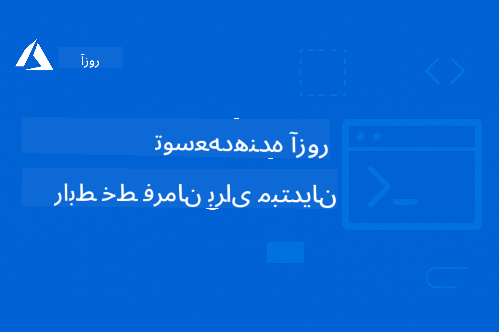

<!--
CO_OP_TRANSLATOR_METADATA:
{
  "original_hash": "6c3d0f9ef66c2cd692a55a2811d9c3e5",
  "translation_date": "2025-09-15T14:48:27+00:00",
  "source_file": "README.md",
  "language_code": "fa"
}
-->
# AZD برای مبتدیان

 

[](https://GitHub.com/microsoft/azd-for-beginners/watchers/)
[](https://GitHub.com/microsoft/azd-for-beginners/network/)
[](https://GitHub.com/microsoft/azd-for-beginners/stargazers/)

[](https://discord.gg/microsoft-azure)

[](https://discord.gg/kzRShWzttr)

برای شروع استفاده از این منابع، مراحل زیر را دنبال کنید:
1. **فورک کردن مخزن**: کلیک کنید [](https://GitHub.com/microsoft/azd-for-beginners/fork)
2. **کلون کردن مخزن**:   `git clone https://github.com/microsoft/azd-for-beginners.git`
3. [**به جوامع دیسکورد Azure بپیوندید و با کارشناسان و توسعه‌دهندگان دیگر ملاقات کنید**](https://discord.com/invite/ByRwuEEgH4)

### پشتیبانی چندزبانه

#### پشتیبانی شده از طریق GitHub Action (خودکار و همیشه به‌روز)

[فرانسوی](../fr/README.md) | [اسپانیایی](../es/README.md) | [آلمانی](../de/README.md) | [روسی](../ru/README.md) | [عربی](../ar/README.md) | [فارسی](./README.md) | [اردو](../ur/README.md) | [چینی (ساده‌شده)](../zh/README.md) | [چینی (سنتی، ماکائو)](../mo/README.md) | [چینی (سنتی، هنگ‌کنگ)](../hk/README.md) | [چینی (سنتی، تایوان)](../tw/README.md) | [ژاپنی](../ja/README.md) | [کره‌ای](../ko/README.md) | [هندی](../hi/README.md) | [بنگالی](../bn/README.md) | [مراتی](../mr/README.md) | [نپالی](../ne/README.md) | [پنجابی (گرمکی)](../pa/README.md) | [پرتغالی (پرتغال)](../pt/README.md) | [پرتغالی (برزیل)](../br/README.md) | [ایتالیایی](../it/README.md) | [لهستانی](../pl/README.md) | [ترکی](../tr/README.md) | [یونانی](../el/README.md) | [تایلندی](../th/README.md) | [سوئدی](../sv/README.md) | [دانمارکی](../da/README.md) | [نروژی](../no/README.md) | [فنلاندی](../fi/README.md) | [هلندی](../nl/README.md) | [عبری](../he/README.md) | [ویتنامی](../vi/README.md) | [اندونزیایی](../id/README.md) | [مالایی](../ms/README.md) | [تاگالوگ (فیلیپینی)](../tl/README.md) | [سواحیلی](../sw/README.md) | [مجاری](../hu/README.md) | [چکی](../cs/README.md) | [اسلواکی](../sk/README.md) | [رومانیایی](../ro/README.md) | [بلغاری](../bg/README.md) | [صربی (سیریلیک)](../sr/README.md) | [کرواتی](../hr/README.md) | [اسلوونیایی](../sl/README.md) | [اوکراینی](../uk/README.md) | [برمه‌ای (میانمار)](../my/README.md)

**اگر مایل به اضافه شدن زبان‌های دیگر هستید، زبان‌های پشتیبانی‌شده [اینجا](https://github.com/Azure/co-op-translator/blob/main/getting_started/supported-languages.md) فهرست شده‌اند**

## مقدمه

به راهنمای جامع برای Azure Developer CLI (azd) خوش آمدید. این مخزن برای کمک به توسعه‌دهندگان در همه سطوح، از دانشجویان تا توسعه‌دهندگان حرفه‌ای، طراحی شده است تا Azure Developer CLI را برای استقرارهای ابری کارآمد یاد بگیرند و تسلط پیدا کنند، **با تمرکز ویژه بر استقرار برنامه‌های هوش مصنوعی با استفاده از Azure AI Foundry**. این منبع آموزشی ساختاریافته تجربه عملی در استقرارهای ابری Azure، رفع مشکلات رایج و اجرای بهترین شیوه‌ها برای استقرار قالب‌های AZD را فراهم می‌کند.

### **چرا این راهنما برای توسعه‌دهندگان هوش مصنوعی مهم است**
بر اساس نظرسنجی اخیر جامعه دیسکورد Azure AI Foundry، **۴۵٪ از توسعه‌دهندگان علاقه‌مند به استفاده از AZD برای بارهای کاری هوش مصنوعی هستند** اما با چالش‌های زیر مواجه‌اند:
- معماری‌های پیچیده چندسرویسی هوش مصنوعی
- بهترین شیوه‌های استقرار هوش مصنوعی در محیط تولید
- یکپارچه‌سازی و پیکربندی خدمات Azure AI
- بهینه‌سازی هزینه برای بارهای کاری هوش مصنوعی
- رفع مشکلات خاص استقرار هوش مصنوعی

## اهداف یادگیری

با کار کردن روی این مخزن، شما:
- اصول و مفاهیم اصلی Azure Developer CLI را یاد خواهید گرفت
- یاد می‌گیرید که منابع Azure را با استفاده از Infrastructure as Code استقرار و فراهم کنید
- مهارت‌های رفع مشکلات برای مسائل رایج استقرار AZD را توسعه می‌دهید
- اعتبارسنجی پیش از استقرار و برنامه‌ریزی ظرفیت را درک می‌کنید
- بهترین شیوه‌های امنیتی و استراتژی‌های بهینه‌سازی هزینه را اجرا می‌کنید
- اعتماد به نفس در استقرار برنامه‌های آماده تولید به Azure را به دست می‌آورید

## نتایج یادگیری

پس از تکمیل این دوره، شما قادر خواهید بود:
- Azure Developer CLI را با موفقیت نصب، پیکربندی و استفاده کنید
- برنامه‌ها را با استفاده از قالب‌های AZD ایجاد و استقرار دهید
- مشکلات مربوط به احراز هویت، زیرساخت و استقرار را رفع کنید
- بررسی‌های پیش از استقرار از جمله برنامه‌ریزی ظرفیت و انتخاب SKU را انجام دهید
- بهترین شیوه‌های نظارت، امنیت و مدیریت هزینه را اجرا کنید
- گردش کارهای AZD را در خطوط CI/CD ادغام کنید

## فهرست مطالب

- [Azure Developer CLI چیست؟](../..)
- [شروع سریع](../..)
- [مسیر یادگیری](../..)
  - [برای توسعه‌دهندگان هوش مصنوعی (شروع از اینجا توصیه می‌شود!)](../..)
  - [برای دانشجویان و مبتدیان](../..)
  - [برای توسعه‌دهندگان](../..)
  - [برای مهندسان DevOps](../..)
- [مستندات](../..)
  - [شروع به کار](../..)
  - [استقرار و فراهم‌سازی](../..)
  - [بررسی‌های پیش از استقرار](../..)
  - [هوش مصنوعی و Azure AI Foundry](../..)
  - [رفع مشکلات](../..)
- [نمونه‌ها و قالب‌ها](../..)
  - [ویژه: قالب‌های Azure AI Foundry](../..)
  - [ویژه: سناریوهای E2E Azure AI Foundry](../..)
  - [قالب‌های اضافی AZD](../..)
  - [آزمایشگاه‌ها و کارگاه‌های عملی](../..)
- [منابع](../..)
- [مشارکت](../..)
- [پشتیبانی](../..)
- [جامعه](../..)

## Azure Developer CLI چیست؟

Azure Developer CLI (azd) یک رابط خط فرمان توسعه‌دهنده‌محور است که فرآیند ساخت و استقرار برنامه‌ها به Azure را تسریع می‌کند. این ابزار ارائه می‌دهد:

- **استقرارهای مبتنی بر قالب** - استفاده از قالب‌های از پیش ساخته‌شده برای الگوهای رایج برنامه
- **Infrastructure as Code** - مدیریت منابع Azure با استفاده از Bicep یا Terraform
- **گردش کارهای یکپارچه** - فراهم‌سازی، استقرار و نظارت بر برنامه‌ها به‌صورت یکپارچه
- **مناسب برای توسعه‌دهندگان** - بهینه‌شده برای بهره‌وری و تجربه توسعه‌دهنده

### **AZD + Azure AI Foundry: مناسب برای استقرارهای هوش مصنوعی**

**چرا AZD برای راه‌حل‌های هوش مصنوعی؟** AZD به چالش‌های اصلی توسعه‌دهندگان هوش مصنوعی پاسخ می‌دهد:

- **قالب‌های آماده هوش مصنوعی** - قالب‌های از پیش پیکربندی‌شده برای Azure OpenAI، خدمات شناختی و بارهای کاری ML
- **استقرارهای امن هوش مصنوعی** - الگوهای امنیتی داخلی برای خدمات هوش مصنوعی، کلیدهای API و نقاط پایانی مدل
- **الگوهای تولید هوش مصنوعی** - بهترین شیوه‌ها برای استقرار برنامه‌های هوش مصنوعی مقیاس‌پذیر و مقرون‌به‌صرفه
- **گردش کارهای انتها به انتها هوش مصنوعی** - از توسعه مدل تا استقرار تولید با نظارت مناسب
- **بهینه‌سازی هزینه** - استراتژی‌های تخصیص منابع هوشمند و مقیاس‌گذاری برای بارهای کاری هوش مصنوعی
- **یکپارچه‌سازی Azure AI Foundry** - اتصال بدون مشکل به کاتالوگ مدل و نقاط پایانی AI Foundry

## شروع سریع

### پیش‌نیازها
- اشتراک Azure
- نصب Azure CLI
- Git (برای کلون کردن قالب‌ها)

### نصب
```bash
# Windows (PowerShell)
powershell -ex AllSigned -c "Invoke-RestMethod 'https://aka.ms/install-azd.ps1' | Invoke-Expression"

# macOS/Linux
curl -fsSL https://aka.ms/install-azd.sh | bash
```

### اولین استقرار شما
```bash
# Initialize a new project
azd init --template todo-nodejs-mongo

# Provision Azure resources and deploy
azd up
```

### اولین استقرار هوش مصنوعی شما
```bash
# Initialize an AI-powered chat application with Azure OpenAI
azd init --template azure-search-openai-demo

# Configure AI services and deploy
azd up

# Or try other AI templates:
azd init --template openai-chat-app-quickstart
azd init --template ai-document-processing
azd init --template contoso-chat
```

## مسیر یادگیری

### برای توسعه‌دهندگان هوش مصنوعی (شروع از اینجا توصیه می‌شود!)
1. **شروع سریع**: قالب [azure-search-openai-demo](https://github.com/Azure-Samples/azure-search-openai-demo) را امتحان کنید
2. **یادگیری اصول**: [AZD Basics](docs/getting-started/azd-basics.md) + [Azure AI Foundry Integration](docs/ai-foundry/azure-ai-foundry-integration.md)
3. **تمرین عملی**: [AI Workshop Lab](docs/ai-foundry/ai-workshop-lab.md) را کامل کنید
4. **آماده تولید**: [Production AI Best Practices](docs/ai-foundry/production-ai-practices.md) را مرور کنید
5. **پیشرفته**: قالب سازمانی [contoso-chat](https://github.com/Azure-Samples/contoso-chat) را استقرار دهید

### برای دانشجویان و مبتدیان
1. با [AZD Basics](docs/getting-started/azd-basics.md) شروع کنید
2. [راهنمای نصب](docs/getting-started/installation.md) را دنبال کنید
3. [پروژه اول شما](docs/getting-started/first-project.md) را کامل کنید
4. با [مثال برنامه وب ساده](../../examples/simple-web-app) تمرین کنید

### برای توسعه‌دهندگان
1. [راهنمای پیکربندی](docs/getting-started/configuration.md) را مرور کنید
2. [راهنمای استقرار](docs/deployment/deployment-guide.md) را مطالعه کنید
3. [مثال برنامه پایگاه داده](../../examples/database-app) را کار کنید
4. [مثال برنامه کانتینر](../../examples/container-app) را بررسی کنید

### برای مهندسان DevOps
1. [فراهم‌سازی منابع](docs/deployment/provisioning.md) را یاد بگیرید
2. [بررسی‌های پیش از پرواز](docs/pre-deployment/preflight-checks.md) را اجرا کنید
3. [برنامه‌ریزی ظرفیت](docs/pre-deployment/capacity-planning.md) را تمرین کنید
4. [مثال پیشرفته میکروسرویس‌ها](../../examples/microservices) را انجام دهید

## مستندات

### شروع به کار
- [**AZD Basics**](docs/getting-started/azd-basics.md) - مفاهیم و اصطلاحات اصلی
- [**نصب و راه‌اندازی**](docs/getting-started/installation.md) - راهنماهای نصب مخصوص پلتفرم
- [**پیکربندی**](docs/getting-started/configuration.md) - تنظیم محیط و احراز هویت
- [**پروژه اول شما**](docs/getting-started/first-project.md) - آموزش گام‌به‌گام

### استقرار و فراهم‌سازی
- [**راهنمای استقرار**](docs/deployment/deployment-guide.md) - گردش کارهای کامل استقرار
- [**فراهم‌سازی منابع**](docs/deployment/provisioning.md) - مدیریت منابع Azure

### بررسی‌های پیش از استقرار
- [**برنامه‌ریزی ظرفیت**](docs/pre-deployment/capacity-planning.md) - اعتبارسنجی ظرفیت منابع Azure
- [**انتخاب SKU**](docs/pre-deployment/sku-selection.md) - انتخاب SKUهای مناسب Azure
- [**بررسی‌های پیش از پرواز**](docs/pre-deployment/preflight-checks.md) - اسکریپت‌های اعتبارسنجی خودکار

### هوش مصنوعی و Azure AI Foundry
- [**یکپارچه‌سازی Azure AI Foundry**](docs/ai-foundry/azure-ai-foundry-integration.md) - اتصال AZD با خدمات Azure AI Foundry
- [**الگوهای استقرار مدل هوش مصنوعی**](docs/ai-foundry/ai-model-deployment.md) - استقرار و مدیریت مدل‌های هوش مصنوعی با AZD
- [**آزمایشگاه کارگاه هوش مصنوعی**](docs/ai-foundry/ai-workshop-lab.md) - آزمایشگاه عملی: آماده‌سازی راه‌حل‌های هوش مصنوعی برای AZD
- [**بهترین شیوه‌های تولید هوش مصنوعی**](docs/ai-foundry/production-ai-practices.md) - امنیت، مقیاس‌پذیری و نظارت برای بارهای کاری هوش مصنوعی

### رفع مشکلات
- [**مشکلات رایج**](docs/troubleshooting/common-issues.md) - مشکلات متداول و راه‌حل‌ها
- [**راهنمای اشکال‌زدایی**](docs/troubleshooting/debugging.md) - استراتژی‌های گام‌به‌گام برای اشکال‌زدایی  
- [**رفع مشکلات خاص هوش مصنوعی**](docs/troubleshooting/ai-troubleshooting.md) - مسائل مربوط به خدمات هوش مصنوعی و استقرار مدل‌ها  

## مثال‌ها و قالب‌ها  

### [ویژه: قالب‌های Azure AI Foundry](https://ai.azure.com/resource/build/templates)  
**اگر قصد استقرار برنامه‌های هوش مصنوعی دارید، از اینجا شروع کنید!**  

| قالب | توضیحات | پیچیدگی | خدمات |
|------|---------|---------|-------|
| [**شروع با چت هوش مصنوعی**](https://github.com/Azure-Samples/get-started-with-ai-chat) | ایجاد و استقرار یک برنامه چت ساده که با داده‌ها و بینش‌های تلومتری شما یکپارچه شده است، با استفاده از Azure Container Apps |⭐⭐ | AzureOpenAI + Azure AI Model Inference API + Azure AI Search + Azure Container Apps + Application Insights |
| [**شروع با عوامل هوش مصنوعی**](https://github.com/Azure-Samples/get-started-with-ai-agents) | ایجاد و استقرار یک برنامه عامل ساده با اقدامات و بینش‌های تلومتری با استفاده از Azure Container Apps. |⭐⭐ | Azure AI Agent Service + AzureOpenAI + Azure AI Search + Azure Container Apps + Application Insights|
| [**اتوماسیون جریان کاری چندعاملی**](https://github.com/Azure-Samples/get-started-with-ai-chat) | بهبود برنامه‌ریزی وظایف و اتوماسیون با هماهنگی و مدیریت گروهی از عوامل هوش مصنوعی. |⭐⭐⭐ | AzureOpenAI + Azure AI Agent Service + Semantic Kernel + Azure CosmosDB + Azure Container Apps|
| [**تولید اسناد از داده‌های شما**](https://github.com/Azure-Samples/get-started-with-ai-chat) | تسریع در تولید اسنادی مانند قراردادها، فاکتورها و پیشنهادات سرمایه‌گذاری با یافتن و خلاصه‌سازی اطلاعات مرتبط از داده‌های شما. |⭐⭐⭐  | AzureOpenAI + Azure AI Search + Azure AI Services + Azure CosmosDB|
| [**بهبود جلسات مشتری با عوامل**](https://github.com/Azure-Samples/get-started-with-ai-chat) | مهاجرت کدهای قدیمی به زبان‌های مدرن با استفاده از تیمی از عوامل. |⭐⭐⭐| AzureOpenAI + Azure AI Search + Azure CosmosDB + Azure SQL Database |
| [**مدرن‌سازی کد شما با عوامل**](https://github.com/Azure-Samples/get-started-with-ai-chat) | ایجاد و استقرار یک برنامه چت ساده که با داده‌ها و بینش‌های تلومتری شما یکپارچه شده است، با استفاده از Azure Container Apps |⭐⭐⭐ | AzureOpenAI + Azure Agent Service + Semantic Kernel + Azure CosmosDB + Azure Container Apps|
| [**ساخت عامل مکالمه‌ای خود**](https://github.com/Azure-Samples/get-started-with-ai-chat) | استفاده از درک پیشرفته مکالمه برای ایجاد و بهبود چت‌بات‌ها و عوامل با جریان‌های کاری قطعی و قابل کنترل انسانی. |⭐⭐⭐ | AI Language + AzureOpenAI + AI Search + Azure Storage + Azure Container Registry|
| [**باز کردن بینش‌ها از داده‌های مکالمه‌ای**](https://github.com/Azure-Samples/get-started-with-ai-chat) | بهبود کارایی مرکز تماس با کشف بینش‌ها از مجموعه‌های بزرگ داده‌های صوتی و متنی با استفاده از قابلیت‌های پیشرفته درک محتوا. |⭐⭐⭐ | AzureOpenAI + AI Search + Semantic Kernel + Azure Agent Service + AI AI Content Understanding|
| [**پردازش محتوای چندحالته**](https://github.com/Azure-Samples/get-started-with-ai-chat) | پردازش سریع و دقیق ادعاها، فاکتورها، قراردادها و سایر اسناد با استخراج اطلاعات از محتوای غیرساختاریافته و نگاشت آن به یک قالب ساختاریافته. این قالب از متن، تصاویر، جداول و نمودارها پشتیبانی می‌کند. |⭐⭐⭐⭐ | AzureOpenAI + Azure Content Understanding + Azure CosmosDB + Azure Container Apps|

### ویژه: سناریوهای انتها به انتهای Azure AI Foundry  
**اگر قصد استقرار برنامه‌های هوش مصنوعی دارید، از اینجا شروع کنید!**  

| قالب | توضیحات | پیچیدگی | خدمات |
|------|---------|---------|-------|
| [**openai-chat-app-quickstart**](https://github.com/Azure-Samples/openai-chat-app-quickstart) | رابط چت ساده با Azure OpenAI | ⭐ | AzureOpenAI + Container Apps |
| [**azure-search-openai-demo**](https://github.com/Azure-Samples/azure-search-openai-demo) | برنامه چت فعال شده با RAG با Azure OpenAI | ⭐⭐ | AzureOpenAI + Search + App Service |
| [**ai-document-processing**](https://github.com/Azure-Samples/ai-document-processing) | تحلیل اسناد با خدمات هوش مصنوعی | ⭐⭐ | Azure Document Intelligence + Functions |
| [**agent-openai-python-prompty**](https://github.com/Azure-Samples/agent-openai-python-prompty) | چارچوب عامل هوش مصنوعی با فراخوانی توابع | ⭐⭐⭐ | AzureOpenAI + Azure Container Apps + Functions |
| [**contoso-chat**](https://github.com/Azure-Samples/contoso-chat) | چت سازمانی با هماهنگی هوش مصنوعی | ⭐⭐⭐ | AzureOpenAI + Azure AI Search + Container Apps |

### قالب‌های اضافی AZD  
- [**دایرکتوری مثال‌ها**](examples/README.md) - مثال‌های عملی، قالب‌ها و سناریوهای واقعی  
- [**قالب‌های AZD Azure-Samples**](https://github.com/Azure-Samples/azd-templates) - قالب‌های نمونه رسمی مایکروسافت  
- [**گالری عالی AZD**](https://azure.github.io/awesome-azd/) - قالب‌های ارائه‌شده توسط جامعه  

### آزمایشگاه‌ها و کارگاه‌های عملی  
- [**آزمایشگاه کارگاه هوش مصنوعی**](docs/ai-foundry/ai-workshop-lab.md) - **جدید**: راه‌حل‌های هوش مصنوعی خود را قابل استقرار با AZD کنید  
- [**کارگاه AZD برای مبتدیان**](workshop/README.md) - تمرکز بر استقرار قالب‌های عوامل هوش مصنوعی AZD  

## منابع  

### مراجع سریع  
- [**برگه تقلب دستورات**](resources/cheat-sheet.md) - دستورات ضروری azd  
- [**واژه‌نامه**](resources/glossary.md) - اصطلاحات Azure و azd  
- [**پرسش‌های متداول**](resources/faq.md) - پرسش‌های رایج  
- [**راهنمای مطالعه**](resources/study-guide.md) - اهداف یادگیری جامع و تمرین‌های عملی  

### منابع خارجی  
- [مستندات CLI توسعه‌دهنده Azure](https://learn.microsoft.com/en-us/azure/developer/azure-developer-cli/)  
- [مرکز معماری Azure](https://learn.microsoft.com/en-us/azure/architecture/)  
- [ماشین حساب قیمت‌گذاری Azure](https://azure.microsoft.com/pricing/calculator/)  
- [وضعیت Azure](https://status.azure.com/)  

## مشارکت  

ما از مشارکت‌ها استقبال می‌کنیم! لطفاً راهنمای [مشارکت](CONTRIBUTING.md) ما را برای جزئیات بخوانید:  
- نحوه ارسال مشکلات و درخواست‌های ویژگی  
- دستورالعمل‌های مشارکت کد  
- بهبود مستندات  
- استانداردهای جامعه  

## پشتیبانی  

- **مشکلات**: [گزارش اشکالات و درخواست ویژگی‌ها](https://github.com/microsoft/azd-for-beginners/issues)  
- **بحث‌ها**: [پرسش و پاسخ و بحث‌های جامعه Discord مایکروسافت Azure](https://discord.gg/microsoft-azure)  
- **پشتیبانی خاص هوش مصنوعی**: به کانال [#Azure](https://discord.gg/microsoft-azure) بپیوندید برای بحث‌های AZD + AI Foundry  
- **ایمیل**: برای پرسش‌های خصوصی  
- **Microsoft Learn**: [مستندات رسمی CLI توسعه‌دهنده Azure](https://learn.microsoft.com/en-us/azure/developer/azure-developer-cli/)  

### بینش‌های جامعه از Discord Azure AI Foundry  

**نتایج نظرسنجی از کانال #Azure:**  
- **۴۵٪** از توسعه‌دهندگان می‌خواهند از AZD برای بارهای کاری هوش مصنوعی استفاده کنند  
- **چالش‌های اصلی**: استقرار چندخدمتی، مدیریت اعتبارنامه‌ها، آمادگی برای تولید  
- **بیشترین درخواست‌ها**: قالب‌های خاص هوش مصنوعی، راهنماهای رفع مشکلات، بهترین شیوه‌ها  

**به جامعه ما بپیوندید تا:**  
- تجربیات خود را با AZD + AI به اشتراک بگذارید و کمک دریافت کنید  
- به پیش‌نمایش‌های اولیه قالب‌های جدید هوش مصنوعی دسترسی پیدا کنید  
- در بهترین شیوه‌های استقرار هوش مصنوعی مشارکت کنید  
- بر توسعه ویژگی‌های آینده هوش مصنوعی + AZD تأثیر بگذارید  

## مجوز  

این پروژه تحت مجوز MIT منتشر شده است - فایل [LICENSE](../../LICENSE) را برای جزئیات ببینید.  

## دوره‌های دیگر  

تیم ما دوره‌های دیگری نیز تولید می‌کند! بررسی کنید:  

- [**جدید** پروتکل زمینه مدل (MCP) برای مبتدیان](https://github.com/microsoft/mcp-for-beginners?WT.mc_id=academic-105485-koreyst)  
- [عوامل هوش مصنوعی برای مبتدیان](https://github.com/microsoft/ai-agents-for-beginners?WT.mc_id=academic-105485-koreyst)  
- [هوش مصنوعی مولد برای مبتدیان با استفاده از .NET](https://github.com/microsoft/Generative-AI-for-beginners-dotnet?WT.mc_id=academic-105485-koreyst)  
- [هوش مصنوعی مولد برای مبتدیان](https://github.com/microsoft/generative-ai-for-beginners?WT.mc_id=academic-105485-koreyst)  
- [هوش مصنوعی مولد برای مبتدیان با استفاده از جاوا](https://github.com/microsoft/generative-ai-for-beginners-java?WT.mc_id=academic-105485-koreyst)  
- [یادگیری ماشین برای مبتدیان](https://aka.ms/ml-beginners?WT.mc_id=academic-105485-koreyst)  
- [علم داده برای مبتدیان](https://aka.ms/datascience-beginners?WT.mc_id=academic-105485-koreyst)  
- [هوش مصنوعی برای مبتدیان](https://aka.ms/ai-beginners?WT.mc_id=academic-105485-koreyst)  
- [امنیت سایبری برای مبتدیان](https://github.com/microsoft/Security-101??WT.mc_id=academic-96948-sayoung)  
- [توسعه وب برای مبتدیان](https://aka.ms/webdev-beginners?WT.mc_id=academic-105485-koreyst)  
- [اینترنت اشیا برای مبتدیان](https://aka.ms/iot-beginners?WT.mc_id=academic-105485-koreyst)  
- [توسعه XR برای مبتدیان](https://github.com/microsoft/xr-development-for-beginners?WT.mc_id=academic-105485-koreyst)  
- [تسلط بر GitHub Copilot برای برنامه‌نویسی جفتی هوش مصنوعی](https://aka.ms/GitHubCopilotAI?WT.mc_id=academic-105485-koreyst)  
- [تسلط بر GitHub Copilot برای توسعه‌دهندگان C#/.NET](https://github.com/microsoft/mastering-github-copilot-for-dotnet-csharp-developers?WT.mc_id=academic-105485-koreyst)  
- [ماجراجویی Copilot خود را انتخاب کنید](https://github.com/microsoft/CopilotAdventures?WT.mc_id=academic-105485-koreyst)  

---

**ناوبری**  
- **درس بعدی**: [مبانی AZD](docs/getting-started/azd-basics.md)  

---

**سلب مسئولیت**:  
این سند با استفاده از سرویس ترجمه هوش مصنوعی [Co-op Translator](https://github.com/Azure/co-op-translator) ترجمه شده است. در حالی که ما تلاش می‌کنیم دقت را حفظ کنیم، لطفاً توجه داشته باشید که ترجمه‌های خودکار ممکن است شامل خطاها یا نادرستی‌ها باشند. سند اصلی به زبان اصلی آن باید به عنوان منبع معتبر در نظر گرفته شود. برای اطلاعات حساس، توصیه می‌شود از ترجمه حرفه‌ای انسانی استفاده کنید. ما مسئولیتی در قبال سوء تفاهم‌ها یا تفسیرهای نادرست ناشی از استفاده از این ترجمه نداریم.