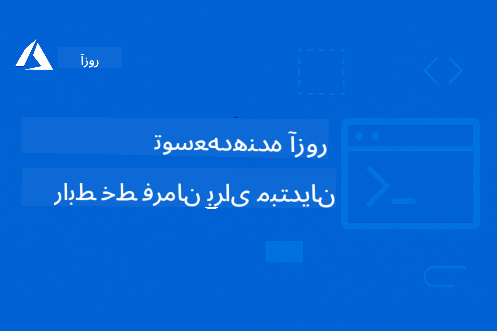

<!--
CO_OP_TRANSLATOR_METADATA:
{
  "original_hash": "068c87cc2641a81ca353ad7064ff326a",
  "translation_date": "2026-01-01T11:01:50+00:00",
  "source_file": "README.md",
  "language_code": "fa"
}
-->
# AZD برای مبتدیان: یک مسیر یادگیری ساختاریافته

 

[](https://GitHub.com/microsoft/azd-for-beginners/watchers/)
[](https://GitHub.com/microsoft/azd-for-beginners/network/)
[](https://GitHub.com/microsoft/azd-for-beginners/stargazers/)

[](https://discord.gg/microsoft-azure)
[](https://discord.gg/nTYy5BXMWG)

## شروع به کار با این دوره

برای آغاز مسیر یادگیری AZD خود این مراحل را دنبال کنید:

1. **انشعاب (Fork) از مخزن**: کلیک کنید [](https://GitHub.com/microsoft/azd-for-beginners/fork)
2. **کلون کردن مخزن**: `git clone https://github.com/microsoft/azd-for-beginners.git`
3. **به جامعه بپیوندید**: [انجمن‌های Discord Azure](https://discord.com/invite/ByRwuEEgH4) برای پشتیبانی تخصصی
4. **مسیر یادگیری خود را انتخاب کنید**: یک فصل زیر را که با سطح تجربه شما همخوانی دارد انتخاب کنید

### پشتیبانی چندزبانه

#### ترجمه‌های خودکار (همیشه به‌روز)

<!-- CO-OP TRANSLATOR LANGUAGES TABLE START -->
[عربی](../ar/README.md) | [بنگالی](../bn/README.md) | [بلغاری](../bg/README.md) | [برمه‌ای (میانمار)](../my/README.md) | [چینی (ساده‌شده)](../zh/README.md) | [چینی (سنتی، هنگ‌کنگ)](../hk/README.md) | [چینی (سنتی، ماکائو)](../mo/README.md) | [چینی (سنتی، تایوان)](../tw/README.md) | [کرواسی](../hr/README.md) | [چک](../cs/README.md) | [دانمارکی](../da/README.md) | [هلندی](../nl/README.md) | [استونیایی](../et/README.md) | [فنلاندی](../fi/README.md) | [فرانسوی](../fr/README.md) | [آلمانی](../de/README.md) | [یونانی](../el/README.md) | [عبری](../he/README.md) | [هندی](../hi/README.md) | [مجارستانی](../hu/README.md) | [اندونزیایی](../id/README.md) | [ایتالیایی](../it/README.md) | [ژاپنی](../ja/README.md) | [کانادا (Kannada)](../kn/README.md) | [کره‌ای](../ko/README.md) | [لیتوانیایی](../lt/README.md) | [مالای](../ms/README.md) | [مالایالام](../ml/README.md) | [مراتی](../mr/README.md) | [نپالی](../ne/README.md) | [پیدجین نیجریه‌ای](../pcm/README.md) | [نروژی](../no/README.md) | [فارسی](./README.md) | [لهستانی](../pl/README.md) | [پرتغالی (برزیل)](../br/README.md) | [پرتغالی (پرتغال)](../pt/README.md) | [پنجابی (Gurmukhi)](../pa/README.md) | [رومانیایی](../ro/README.md) | [روسی](../ru/README.md) | [صربی (سیریلیک)](../sr/README.md) | [اسلواکی](../sk/README.md) | [اسلوونیایی](../sl/README.md) | [اسپانیایی](../es/README.md) | [سواحیلی](../sw/README.md) | [سوئدی](../sv/README.md) | [تاگالوگ (فیلیپینی)](../tl/README.md) | [تامیل](../ta/README.md) | [تلوگویی](../te/README.md) | [تایلندی](../th/README.md) | [ترکی](../tr/README.md) | [اوکراینی](../uk/README.md) | [اردو](../ur/README.md) | [ویتنامی](../vi/README.md)
<!-- CO-OP TRANSLATOR LANGUAGES TABLE END -->

## بررسی اجمالی دوره

با گذراندن فصل‌های ساختاریافته که برای یادگیری تدریجی طراحی شده‌اند، بر Azure Developer CLI (azd) مسلط شوید. تمرکز ویژه بر استقرار برنامه‌های هوش مصنوعی با یکپارچه‌سازی Microsoft Foundry.

### چرا این دوره برای توسعه‌دهندگان مدرن ضروری است

براساس بینش‌های جامعهٔ Discord مایکروسافت فاندری، **۴۵٪ توسعه‌دهندگان می‌خواهند از AZD برای بارهای کاری هوش مصنوعی استفاده کنند** اما با چالش‌هایی مواجه می‌شوند:
- معماری‌های پیچیده چندخدمتی برای هوش مصنوعی
- بهترین روش‌های استقرار هوش مصنوعی در محیط تولید  
- یکپارچه‌سازی و پیکربندی سرویس‌های Azure AI
- بهینه‌سازی هزینه برای بارهای کاری هوش مصنوعی
- عیب‌یابی مسائل خاص استقرار هوش مصنوعی

### اهداف یادگیری

با تکمیل این دورهٔ ساختاریافته، شما:
- **تسلط بر مبانی AZD**: مفاهیم اصلی، نصب و پیکربندی
- **استقرار برنامه‌های هوش مصنوعی**: استفاده از AZD با سرویس‌های Microsoft Foundry
- **پیاده‌سازی زیرساخت به‌عنوان کد**: مدیریت منابع Azure با الگوهای Bicep
- **عیب‌یابی استقرارها**: حل مسائل رایج و دیباگ مشکلات
- **بهینه‌سازی برای تولید**: امنیت، مقیاس، مانیتورینگ و مدیریت هزینه
- **ساخت راهکارهای چندعامل**: استقرار معماری‌های پیچیده هوش مصنوعی

## 📚 فصل‌های یادگیری

*مسیر یادگیری خود را بر اساس سطح تجربه و اهداف انتخاب کنید*

### 🚀 فصل 1: بنیاد و شروع سریع
**پیش‌نیازها**: اشتراک Azure، دانش پایه خط فرمان  
**مدت زمان**: 30-45 دقیقه  
**پیچیدگی**: ⭐

#### آنچه خواهید آموخت
- درک مبانی Azure Developer CLI
- نصب AZD روی پلتفرم خود
- اولین استقرار موفق شما

#### منابع یادگیری
- **🎯 از اینجا شروع کنید**: [Azure Developer CLI چیست؟](../..)
- **📖 تئوری**: [مبانی AZD](docs/getting-started/azd-basics.md) - مفاهیم و اصطلاحات اصلی
- **⚙️ راه‌اندازی**: [نصب و راه‌اندازی](docs/getting-started/installation.md) - راهنماهای مخصوص پلتفرم
- **🛠️ عملی**: [اولین پروژه شما](docs/getting-started/first-project.md) - آموزش گام‌به‌گام
- **📋 مرجع سریع**: [راهنمای سریع دستورات](resources/cheat-sheet.md)

#### تمرین‌های عملی
```bash
# بررسی سریع نصب
azd version

# اولین برنامه خود را مستقر کنید
azd init --template todo-nodejs-mongo
azd up
```

**💡 نتیجه فصل**: استقرار موفق یک برنامهٔ وب ساده در Azure با استفاده از AZD

**✅ اعتبارسنجی موفقیت:**
```bash
# پس از اتمام فصل ۱، باید بتوانید:
azd version              # نسخه نصب‌شده را نشان می‌دهد
azd init --template todo-nodejs-mongo  # پروژه را مقداردهی اولیه می‌کند
azd up                  # در Azure مستقر می‌کند
azd show                # آدرس URL برنامه در حال اجرا را نمایش می‌دهد
# برنامه در مرورگر باز می‌شود و کار می‌کند
azd down --force --purge  # منابع را پاکسازی می‌کند
```

**📊 زمان مورد نیاز:** 30-45 دقیقه  
**📈 سطح مهارت پس از دوره:** قادر به استقرار برنامه‌های پایه به‌صورت مستقل

**✅ اعتبارسنجی موفقیت:**
```bash
# پس از اتمام فصل ۱، باید بتوانید:
azd version              # نسخه نصب‌شده را نمایش می‌دهد
azd init --template todo-nodejs-mongo  # پروژه را مقداردهی اولیه می‌کند
azd up                  # به Azure مستقر می‌کند
azd show                # آدرس URL برنامه در حال اجرا را نمایش می‌دهد
# برنامه در مرورگر باز می‌شود و کار می‌کند
azd down --force --purge  # منابع را پاک‌سازی می‌کند
```

**📊 زمان مورد نیاز:** 30-45 دقیقه  
**📈 سطح مهارت پس از دوره:** قادر به استقرار برنامه‌های پایه به‌صورت مستقل

---

### 🤖 فصل 2: توسعه اول هوش مصنوعی (توصیه‌شده برای توسعه‌دهندگان هوش مصنوعی)
**پیش‌نیازها**: تکمیل فصل 1  
**مدت زمان**: 1-2 ساعت  
**پیچیدگی**: ⭐⭐

#### آنچه خواهید آموخت
- یکپارچه‌سازی Microsoft Foundry با AZD
- استقرار برنامه‌های مجهز به هوش مصنوعی
- درک پیکربندی سرویس‌های هوش مصنوعی

#### منابع یادگیری
- **🎯 از اینجا شروع کنید**: [یکپارچه‌سازی Microsoft Foundry](docs/microsoft-foundry/microsoft-foundry-integration.md)
- **📖 الگوها**: [استقرار مدل‌های هوش مصنوعی](docs/microsoft-foundry/ai-model-deployment.md) - استقرار و مدیریت مدل‌های هوش مصنوعی
- **🛠️ کارگاه**: [آزمایشگاه کارگاه AI](docs/microsoft-foundry/ai-workshop-lab.md) - آماده‌سازی راهکارهای هوش مصنوعی برای AZD
- **🎥 راهنمای تعاملی**: [مواد کارگاه](workshop/README.md) - یادگیری مبتنی بر مرورگر با MkDocs * DevContainer Environment
- **📋 قالب‌ها**: [قالب‌های Microsoft Foundry](../..)
- **📝 نمونه‌ها**: [نمونه‌های استقرار AZD](examples/README.md)

#### تمرین‌های عملی
```bash
# اولین برنامهٔ هوش مصنوعی خود را مستقر کنید
azd init --template azure-search-openai-demo
azd up

# قالب‌های اضافی هوش مصنوعی را امتحان کنید
azd init --template openai-chat-app-quickstart
azd init --template agent-openai-python-prompty
```

**💡 نتیجه فصل**: استقرار و پیکربندی یک برنامهٔ چت مجهز به هوش مصنوعی با قابلیت‌های RAG

**✅ اعتبارسنجی موفقیت:**
```bash
# بعد از فصل ۲ باید قادر باشید:
azd init --template azure-search-openai-demo
azd up
# رابط چت هوش مصنوعی را آزمایش کنید
# سوال بپرسید و پاسخ‌های تولیدشده توسط هوش مصنوعی را همراه با منابع دریافت کنید
# اطمینان حاصل کنید که ادغام جستجو کار می‌کند
azd monitor  # بررسی کنید که Application Insights تله‌متری را نشان می‌دهد
azd down --force --purge
```

**📊 زمان مورد نیاز:** 1-2 ساعت  
**📈 سطح مهارت پس از دوره:** قادر به استقرار و پیکربندی برنامه‌های هوش مصنوعی آمادهٔ تولید  
**💰 آگاهی از هزینه:** آشنایی با هزینه‌های توسعه حدود $80-150/ماه، هزینه‌های تولید $300-3,500/ماه

#### 💰 ملاحظات هزینه برای استقرارهای هوش مصنوعی

**محیط توسعه (تخمین 80-150$/ماه):**
- Azure OpenAI (پرداخت به‌ازای مصرف): $0-50/month (براساس مصرف توکن)
- AI Search (ردهٔ Basic): $75/month
- Container Apps (مصرفی): $0-20/month
- Storage (استاندارد): $1-5/month

**محیط تولید (تخمین 300-3,500+$/ماه):**
- Azure OpenAI (PTU برای عملکرد سازگار): $3,000+/month OR Pay-as-go with high volume
- AI Search (ردهٔ Standard): $250/month
- Container Apps (اختصاصی): $50-100/month
- Application Insights: $5-50/month
- Storage (پرمیوم): $10-50/month

**💡 نکات بهینه‌سازی هزینه:**
- از **سطح رایگان** Azure OpenAI برای یادگیری استفاده کنید (50,000 توکن/ماه شامل شده)
- هنگام عدم توسعه فعال، با اجرای `azd down` منابع را آزاد کنید
- از مدل صورتحساب مبتنی بر مصرف شروع کنید و فقط برای محیط تولید به PTU ارتقا دهید
- از `azd provision --preview` برای برآورد هزینه قبل از استقرار استفاده کنید
- مقیاس‌بندی خودکار را فعال کنید: فقط برای استفادهٔ واقعی پرداخت کنید

**نظارت هزینه:**
```bash
# هزینه‌های ماهانهٔ تخمینی را بررسی کنید
azd provision --preview

# هزینه‌های واقعی را در پرتال Azure نظارت کنید
az consumption budget list --resource-group <your-rg>
```

---

### ⚙️ فصل 3: پیکربندی و احراز هویت
**پیش‌نیازها**: تکمیل فصل 1  
**مدت زمان**: 45-60 دقیقه  
**پیچیدگی**: ⭐⭐

#### آنچه خواهید آموخت
- پیکربندی و مدیریت محیط
- احراز هویت و بهترین روش‌های امنیتی
- نام‌گذاری و سازمان‌دهی منابع

#### منابع یادگیری
- **📖 پیکربندی**: [راهنمای پیکربندی](docs/getting-started/configuration.md) - تنظیم محیط
- **🔐 امنیت**: [الگوهای احراز هویت و هویت مدیریت‌شده](docs/getting-started/authsecurity.md) - الگوهای احراز هویت
- **📝 نمونه‌ها**: [نمونهٔ برنامهٔ پایگاه داده](examples/database-app/README.md) - نمونه‌های پایگاه داده AZD

#### تمرین‌های عملی
- پیکربندی چند محیط (dev, staging, prod)
- راه‌اندازی احراز هویت با Managed Identity
- پیاده‌سازی پیکربندی‌های مخصوص هر محیط

**💡 نتیجه فصل**: مدیریت چندین محیط با احراز هویت و امنیت مناسب

---

### 🏗️ فصل 4: زیرساخت به‌عنوان کد و استقرار
**پیش‌نیازها**: تکمیل فصل‌های 1-3  
**مدت زمان**: 1-1.5 ساعت  
**پیچیدگی**: ⭐⭐⭐

#### آنچه خواهید آموخت
- الگوهای پیشرفتهٔ استقرار
- زیرساخت به‌عنوان کد با Bicep
- استراتژی‌های تأمین منابع

#### منابع یادگیری
- **📖 استقرار**: [راهنمای استقرار](docs/deployment/deployment-guide.md) - گردش‌کارهای کامل
- **🏗️ تأمین**: [تأمین منابع](docs/deployment/provisioning.md) - مدیریت منابع Azure
- **📝 نمونه‌ها**: [نمونهٔ Container App](../../examples/container-app) - استقرارهای کانتینری

#### تمرین‌های عملی
- ایجاد الگوهای Bicep سفارشی
- استقرار برنامه‌های چندخدمتی
- پیاده‌سازی استراتژی‌های استقرار blue-green

**💡 نتیجه فصل**: استقرار برنامه‌های پیچیدهٔ چندخدمتی با استفاده از قالب‌های زیرساخت سفارشی

---

### 🎯 فصل 5: راهکارهای هوش مصنوعی چندعامل (پیشرفته)
**پیش‌نیازها**: تکمیل فصل‌های 1-2  
**مدت زمان**: 2-3 ساعت  
**پیچیدگی**: ⭐⭐⭐⭐

#### آنچه خواهید آموخت
- الگوهای معماری چندعامل
- اورکستراسیون و هماهنگی عامل‌ها
- استقرارهای هوش مصنوعی آمادهٔ تولید

#### منابع یادگیری
- **🤖 پروژهٔ برجسته**: [راهکار چندعامل خرده‌فروشی](examples/retail-scenario.md) - پیاده‌سازی کامل
- **🛠️ قالب‌های ARM**: [بسته قالب ARM](../../examples/retail-multiagent-arm-template) - استقرار با یک کلیک
- **📖 معماری**: [الگوهای هماهنگی چندعاملی](/docs/pre-deployment/coordination-patterns.md) - الگوها

#### تمرین‌های عملی
```bash
# استقرار راه‌حل کامل چندعاملی برای خرده‌فروشی
cd examples/retail-multiagent-arm-template
./deploy.sh

# کاوش پیکربندی‌های عامل
az deployment group show --resource-group <rg-name> --name <deployment-name>
```

**💡 نتیجه فصل**: استقرار و مدیریت یک راهکار هوش مصنوعی چندعاملی آماده تولید با عامل‌های Customer و Inventory

---

### 🔍 فصل 6: اعتبارسنجی و برنامه‌ریزی قبل از استقرار
**پیش‌نیازها**: تکمیل فصل 4  
**مدت زمان**: 1 ساعت  
**پیچیدگی**: ⭐⭐

#### آنچه یاد خواهید گرفت
- برنامه‌ریزی ظرفیت و اعتبارسنجی منابع
- استراتژی‌های انتخاب SKU
- چک‌های پیش‌اجرایی و اتوماسیون

#### منابع آموزشی
- **📊 برنامه‌ریزی**: [برنامه‌ریزی ظرفیت](docs/pre-deployment/capacity-planning.md) - اعتبارسنجی منابع
- **💰 انتخاب**: [انتخاب SKU](docs/pre-deployment/sku-selection.md) - گزینه‌های مقرون‌به‌صرفه
- **✅ اعتبارسنجی**: [بررسی‌های پیش‌اجرایی](docs/pre-deployment/preflight-checks.md) - اسکریپت‌های خودکار

#### تمرین‌های عملی
- اجرای اسکریپت‌های اعتبارسنجی ظرفیت
- بهینه‌سازی انتخاب‌های SKU برای کاهش هزینه
- پیاده‌سازی چک‌های خودکار پیش از استقرار

**💡 نتیجه فصل**: اعتبارسنجی و بهینه‌سازی استقرارها پیش از اجرا

---

### 🚨 فصل 7: عیب‌یابی و رفع خطا
**پیش‌نیازها**: تکمیل هر یک از فصل‌های استقرار  
**مدت زمان**: 1-1.5 ساعت  
**پیچیدگی**: ⭐⭐

#### آنچه یاد خواهید گرفت
- روش‌های نظام‌مند عیب‌یابی
- مشکلات رایج و راه‌حل‌ها
- عیب‌یابی ویژه هوش مصنوعی

#### منابع آموزشی
- **🔧 مشکلات رایج**: [مشکلات رایج](docs/troubleshooting/common-issues.md) - سوالات متداول و راه‌حل‌ها
- **🕵️ عیب‌یابی**: [راهنمای عیب‌یابی](docs/troubleshooting/debugging.md) - راهبردهای گام‌به‌گام
- **🤖 مشکلات AI**: [عیب‌یابی ویژه هوش مصنوعی](docs/troubleshooting/ai-troubleshooting.md) - مشکلات سرویس‌های AI

#### تمرین‌های عملی
- تشخیص شکست‌های استقرار
- رفع مشکلات احراز هویت
- عیب‌یابی اتصال سرویس‌های AI

**💡 نتیجه فصل**: توانایی تشخیص و رفع مستقل مشکلات رایج استقرار

---

### 🏢 فصل 8: الگوهای تولید و سازمانی
**پیش‌نیازها**: تکمیل فصل‌های 1-4  
**مدت زمان**: 2-3 ساعت  
**پیچیدگی**: ⭐⭐⭐⭐

#### آنچه یاد خواهید گرفت
- استراتژی‌های استقرار تولید
- الگوهای امنیتی سازمانی
- نظارت و بهینه‌سازی هزینه

#### منابع آموزشی
- **🏭 تولید**: [بهترین شیوه‌های AI در تولید](docs/microsoft-foundry/production-ai-practices.md) - الگوهای سازمانی
- **📝 مثال‌ها**: [مثال میکروسرویس‌ها](../../examples/microservices) - معماری‌های پیچیده
- **📊 نظارت**: [ادغام Application Insights](docs/pre-deployment/application-insights.md) - نظارت

#### تمرین‌های عملی
- پیاده‌سازی الگوهای امنیتی سازمانی
- راه‌اندازی نظارت جامع
- استقرار در محیط تولید با حاکمیت مناسب

**💡 نتیجه فصل**: استقرار برنامه‌های آماده سازمانی با تمامی قابلیت‌های تولید

---

## 🎓 مرور کارگاه: تجربه یادگیری عملی

> **⚠️ وضعیت کارگاه: در حال توسعه فعال**  
> مواد کارگاه در حال حاضر در حال توسعه و پالایش هستند. ماژول‌های هسته‌ای عملکردی هستند، اما برخی بخش‌های پیشرفته ناقص‌اند. ما فعالانه در حال تکمیل همه محتوا هستیم. [پیشرفت را دنبال کنید →](workshop/README.md)

### مواد کارگاه تعاملی
**یادگیری عملی جامع با ابزارهای مبتنی بر مرورگر و تمرین‌های هدایت‌شده**

مواد کارگاه ما تجربه یادگیری ساختارمند و تعاملی فراهم می‌کند که مکمل برنامه درسی مبتنی بر فصل‌های بالا است. کارگاه برای هر دو حالت یادگیری خودآموز و جلسات با مدرس طراحی شده است.

#### 🛠️ ویژگی‌های کارگاه
- **رابط مبتنی بر مرورگر**: کارگاه کامل مبتنی بر MkDocs با قابلیت‌های جستجو، کپی و تم
- **یکپارچه‌سازی GitHub Codespaces**: راه‌اندازی محیط توسعه با یک کلیک
- **مسیر یادگیری ساختارمند**: تمرین‌های هدایت‌شده 7 مرحله‌ای (در مجموع 3.5 ساعت)
- **کشف → استقرار → سفارشی‌سازی**: روش‌شناسی پیش‌رونده
- **محیط DevContainer تعاملی**: ابزارها و وابستگی‌های از پیش پیکربندی‌شده

#### 📚 ساختار کارگاه
کارگاه از یک روش‌شناسی **کشف → استقرار → سفارشی‌سازی** پیروی می‌کند:

1. **مرحله کشف** (45 دقیقه)
   - بررسی قالب‌ها و سرویس‌های Microsoft Foundry
   - درک الگوهای معماری چندعاملی
   - بازبینی نیازمندی‌ها و پیش‌نیازهای استقرار

2. **مرحله استقرار** (2 ساعت)
   - استقرار عملی برنامه‌های AI با AZD
   - پیکربندی سرویس‌ها و نقاط انتهایی Azure AI
   - پیاده‌سازی الگوهای امنیتی و احراز هویت

3. **مرحله سفارشی‌سازی** (45 دقیقه)
   - تغییر برنامه‌ها برای موارد استفاده خاص
   - بهینه‌سازی برای استقرار در تولید
   - پیاده‌سازی نظارت و مدیریت هزینه

#### 🚀 شروع کار با کارگاه
```bash
# گزینهٔ ۱: GitHub Codespaces (پیشنهادی)
# در مخزن روی «Code» کلیک کرده و «Create codespace on main» را انتخاب کنید.

# گزینهٔ ۲: توسعهٔ محلی
git clone https://github.com/microsoft/azd-for-beginners.git
cd azd-for-beginners/workshop
# دستورالعمل‌های راه‌اندازی را در workshop/README.md دنبال کنید.
```

#### 🎯 نتایج یادگیری کارگاه
با تکمیل کارگاه، شرکت‌کنندگان قادر خواهند بود:
- **استقرار برنامه‌های AI در تولید**: استفاده از AZD با سرویس‌های Microsoft Foundry
- **تسلط بر معماری‌های چندعاملی**: پیاده‌سازی راهکارهای هماهنگ عامل‌های AI
- **پیاده‌سازی بهترین شیوه‌های امنیتی**: پیکربندی احراز هویت و کنترل دسترسی
- **بهینه‌سازی برای مقیاس**: طراحی استقرارهای مقرون‌به‌صرفه و با عملکرد مناسب
- **عیب‌یابی استقرارها**: حل مستقل مشکلات رایج

#### 📖 منابع کارگاه
- **🎥 راهنمای تعاملی**: [مواد کارگاه](workshop/README.md) - محیط یادگیری مبتنی بر مرورگر
- **📋 دستورالعمل‌های گام‌به‌گام**: [تمرین‌های هدایت‌شده](../../workshop/docs/instructions) - راهنمایی‌های دقیق
- **🛠️ آزمایشگاه کارگاه AI**: [AI Workshop Lab](docs/microsoft-foundry/ai-workshop-lab.md) - تمرین‌های متمرکز بر AI
- **💡 شروع سریع**: [راهنمای راه‌اندازی کارگاه](workshop/README.md#quick-start) - پیکربندی محیط

**مناسب برای**: آموزش سازمانی، دوره‌های دانشگاهی، یادگیری خودآموز و بوت‌کمپ‌های توسعه‌دهنده.

---

## 📖 Azure Developer CLI چیست؟

Azure Developer CLI (azd) یک رابط خط فرمان متمرکز بر توسعه‌دهنده است که فرایند ساخت و استقرار برنامه‌ها در Azure را تسریع می‌کند. این ابزار موارد زیر را فراهم می‌کند:

- **استقرار مبتنی بر قالب** - استفاده از قالب‌های از پیش‌ساخته برای الگوهای معمول برنامه‌ها
- **زیرساخت به‌عنوان کد** - مدیریت منابع Azure با استفاده از Bicep یا Terraform  
- **گردش‌کارهای یکپارچه** - فراهم‌سازی، استقرار و نظارت بر برنامه‌ها به‌صورت یکپارچه
- **مناسب توسعه‌دهنده** - بهینه‌شده برای بهره‌وری و تجربه توسعه‌دهنده

### **AZD + Microsoft Foundry: ایده‌آل برای استقرارهای AI**

**چرا AZD برای راهکارهای AI؟** AZD به مهم‌ترین چالش‌هایی که توسعه‌دهندگان AI با آنها روبرو هستند می‌پردازد:

- **قالب‌های آماده AI** - قالب‌های از پیش پیکربندی‌شده برای Azure OpenAI، Cognitive Services و بارهای کاری ML
- **استقرارهای امن AI** - الگوهای امنیتی داخلی برای سرویس‌های AI، کلیدهای API و نقاط انتهایی مدل  
- **الگوهای AI تولیدی** - بهترین شیوه‌ها برای استقرارهای AI مقیاس‌پذیر و مقرون‌به‌صرفه
- **گردش‌کارهای AI از ابتدا تا انتها** - از توسعه مدل تا استقرار در تولید با نظارت مناسب
- **بهینه‌سازی هزینه** - تخصیص هوشمند منابع و راهبردهای مقیاس‌دهی برای بارهای کاری AI
- **یکپارچه‌سازی Microsoft Foundry** - اتصال یکپارچه به کاتالوگ مدل و نقاط انتهایی Microsoft Foundry

---

## 🎯 کتابخانه قالب‌ها و مثال‌ها

### ویژه: قالب‌های Microsoft Foundry
**اگر در حال استقرار برنامه‌های AI هستید از اینجا شروع کنید!**

> **توجه:** این قالب‌ها الگوهای مختلف AI را نشان می‌دهند. برخی از آنها Azure Samples خارجی هستند و برخی دیگر پیاده‌سازی‌های محلی می‌باشند.

| قالب | فصل | پیچیدگی | سرویس‌ها | نوع |
|----------|---------|------------|----------|------|
| [**شروع کار با چت AI**](https://github.com/Azure-Samples/get-started-with-ai-chat) | فصل 2 | ⭐⭐ | AzureOpenAI + Azure AI Model Inference API + Azure AI Search + Azure Container Apps + Application Insights | خارجی |
| [**شروع کار با عامل‌های AI**](https://github.com/Azure-Samples/get-started-with-ai-agents) | فصل 2 | ⭐⭐ | Azure AI Agent Service + AzureOpenAI + Azure AI Search + Azure Container Apps + Application Insights| خارجی |
| [**Azure Search + OpenAI Demo**](https://github.com/Azure-Samples/azure-search-openai-demo) | فصل 2 | ⭐⭐ | AzureOpenAI + Azure AI Search + App Service + Storage | خارجی |
| [**شروع سریع اپ چت OpenAI**](https://github.com/Azure-Samples/openai-chat-app-quickstart) | فصل 2 | ⭐ | AzureOpenAI + Container Apps + Application Insights | خارجی |
| [**Agent OpenAI Python Prompty**](https://github.com/Azure-Samples/agent-openai-python-prompty) | فصل 5 | ⭐⭐⭐ | AzureOpenAI + Azure Functions + Prompty | خارجی |
| [**Contoso Chat RAG**](https://github.com/Azure-Samples/contoso-chat) | فصل 8 | ⭐⭐⭐⭐ | AzureOpenAI + AI Search + Cosmos DB + Container Apps | خارجی |
| [**راهکار چندعاملی خرده‌فروشی**](examples/retail-scenario.md) | فصل 5 | ⭐⭐⭐⭐ | AzureOpenAI + AI Search + Storage + Container Apps + Cosmos DB | **محلی** |

### ویژه: سناریوهای کامل یادگیری
**قالب‌های برنامه آماده تولید مرتبط با فصل‌های آموزشی**

| قالب | فصل آموزشی | پیچیدگی | نکته کلیدی |
|----------|------------------|------------|--------------|
| [**openai-chat-app-quickstart**](https://github.com/Azure-Samples/openai-chat-app-quickstart) | فصل 2 | ⭐ | الگوهای پایه استقرار AI |
| [**azure-search-openai-demo**](https://github.com/Azure-Samples/azure-search-openai-demo) | فصل 2 | ⭐⭐ | پیاده‌سازی RAG با Azure AI Search |
| [**ai-document-processing**](https://github.com/Azure-Samples/ai-document-processing) | فصل 4 | ⭐⭐ | ادغام Document Intelligence |
| [**agent-openai-python-prompty**](https://github.com/Azure-Samples/agent-openai-python-prompty) | فصل 5 | ⭐⭐⭐ | چارچوب عامل و فراخوانی توابع |
| [**contoso-chat**](https://github.com/Azure-Samples/contoso-chat) | فصل 8 | ⭐⭐⭐ | هماهنگی سازمانی AI |
| [**retail-multi-agent-solution**](examples/retail-scenario.md) | فصل 5 | ⭐⭐⭐⭐ | معماری چندعاملی با عامل‌های Customer و Inventory |

### یادگیری بر اساس نوع مثال

> **📌 مثال‌های محلی در مقابل خارجی:**  
> **مثال‌های محلی** (در این ریپو) = آماده استفاده بلافاصله  
> **مثال‌های خارجی** (Azure Samples) = کلون از مخازن مرتبط

#### مثال‌های محلی (آماده استفاده)
- [**راهکار چندعاملی خرده‌فروشی**](examples/retail-scenario.md) - پیاده‌سازی کامل آماده تولید با قالب‌های ARM
  - معماری چندعاملی (عامل‌های Customer + Inventory)
  - نظارت و ارزیابی جامع
  - استقرار یک‌کلیک از طریق قالب ARM

#### مثال‌های محلی - برنامه‌های کانتینری (فصل‌های 2-5)
**مثال‌های کامل استقرار کانتینری در این مخزن:**
- [**مثال‌های Container App**](examples/container-app/README.md) - راهنمای جامع استقرارهای کانتینری
  - [Simple Flask API](../../examples/container-app/simple-flask-api) - API REST پایه با scale-to-zero
  - [Microservices Architecture](../../examples/container-app/microservices) - استقرار چندسرویسی آماده تولید
  - الگوهای شروع سریع، تولید و پیشرفته برای استقرار
  - راهنمایی در مورد نظارت، امنیت و بهینه‌سازی هزینه

#### مثال‌های خارجی - برنامه‌های ساده (فصل‌های 1-2)
**این مخازن Azure Samples را کلون کنید تا شروع کنید:**
- [Simple Web App - Node.js + MongoDB](https://github.com/Azure-Samples/todo-nodejs-mongo) - الگوهای استقرار پایه
- [Static Website - React SPA](https://github.com/Azure-Samples/todo-csharp-sql-swa-func) - استقرار محتوای استاتیک
- [Container App - Python Flask](https://github.com/Azure-Samples/container-apps-store-api-microservice) - استقرار API REST

#### مثال‌های خارجی - یکپارچه‌سازی پایگاه‌داده (فصل‌های 3-4)  
- [Database App - C# + SQL](https://github.com/Azure-Samples/todo-csharp-sql) - الگوهای اتصال به پایگاه‌داده
- [Functions + Cosmos DB](https://github.com/Azure-Samples/todo-python-mongo-swa-func) - گردش‌کار داده بدون سرور

#### مثال‌های خارجی - الگوهای پیشرفته (فصل‌های 4-8)
- [Java Microservices](https://github.com/Azure-Samples/java-microservices-aca-lab) - معماری‌های چندسرویسی
- [Container Apps Jobs](https://github.com/Azure-Samples/container-apps-jobs) - پردازش پس‌زمینه  
- [Enterprise ML Pipeline](https://github.com/Azure-Samples/mlops-v2) - الگوهای ML آماده تولید

### مجموعه‌های قالب خارجی
- [**Official AZD Template Gallery**](https://azure.github.io/awesome-azd/) - مجموعه منتخب قالب‌های رسمی و جامعه
- [**Azure Developer CLI Templates**](https://learn.microsoft.com/en-us/azure/developer/azure-developer-cli/azd-templates) - مستندات قالب‌های Microsoft Learn
- [**Examples Directory**](examples/README.md) - مثال‌های یادگیری محلی با توضیحات مفصل

---

## 📚 منابع یادگیری و مراجع

### مراجع سریع
- [**برگه تقلب فرمان‌ها**](resources/cheat-sheet.md) - فرمان‌های ضروری azd مرتب‌شده بر حسب فصل
- [**واژه‌نامه**](resources/glossary.md) - Azure و azd terminology  
- [**سؤالات متداول**](resources/faq.md) - سؤالات رایج مرتب‌شده بر اساس فصل‌های آموزشی
- [**راهنمای مطالعه**](resources/study-guide.md) - تمرین‌های جامع

### کارگاه‌های عملی
- [**آزمایشگاه کارگاه هوش مصنوعی**](docs/microsoft-foundry/ai-workshop-lab.md) - راه‌حل‌های هوش مصنوعی خود را قابل استقرار با AZD کنید (2-3 hours)
- [**راهنمای کارگاه تعاملی**](workshop/README.md) - کارگاه مبتنی بر مرورگر با MkDocs و محیط DevContainer Environment
- [**مسیر یادگیری ساختاریافته**](../../workshop/docs/instructions) -7-step guided exercises (Discovery → Deployment → Customization)
- [**کارگاه AZD برای مبتدیان**](workshop/README.md) - Complete hands-on workshop materials with GitHub Codespaces integration

### منابع آموزشی خارجی
- [مستندات Azure Developer CLI](https://learn.microsoft.com/en-us/azure/developer/azure-developer-cli/)
- [مرکز معماری Azure](https://learn.microsoft.com/en-us/azure/architecture/)
- [ماشین حساب قیمت‌گذاری Azure](https://azure.microsoft.com/pricing/calculator/)
- [وضعیت Azure](https://status.azure.com/)

---

## 🔧 راهنمای سریع عیب‌یابی

**مشکلات رایجی که مبتدیان با آن مواجه می‌شوند و راه‌حل‌های سریع:**

### ❌ "azd: command not found"

```bash
# ابتدا AZD را نصب کنید
# ویندوز (PowerShell):
winget install microsoft.azd

# مک‌اواس:
brew tap azure/azd && brew install azd

# لینوکس:
curl -fsSL https://aka.ms/install-azd.sh | bash

# نصب را بررسی کنید
azd version
```

### ❌ "No subscription found" or "Subscription not set"

```bash
# فهرست اشتراک‌های موجود
az account list --output table

# تنظیم اشتراک پیش‌فرض
az account set --subscription "<subscription-id-or-name>"

# تنظیم برای محیط AZD
azd env set AZURE_SUBSCRIPTION_ID "<subscription-id>"

# تأیید
az account show
```

### ❌ "InsufficientQuota" or "Quota exceeded"

```bash
# یک منطقهٔ Azure متفاوت را امتحان کنید
azd env set AZURE_LOCATION "westus2"
azd up

# یا در محیط توسعه از SKUهای کوچکتر استفاده کنید
# فایل infra/main.parameters.json را ویرایش کنید:
{
  "sku": "B1"  // Instead of "P1V2"
}
```

### ❌ "azd up" fails halfway through

```bash
# گزینهٔ ۱: پاک‌سازی کنید و دوباره تلاش کنید
azd down --force --purge
azd up

# گزینهٔ ۲: فقط زیرساخت را اصلاح کنید
azd provision

# گزینهٔ ۳: گزارش‌های دقیق را بررسی کنید
azd show
azd logs
```

### ❌ "Authentication failed" or "Token expired"

```bash
# احراز هویت مجدد
az logout
az login

azd auth logout
azd auth login

# اعتبارسنجی احراز هویت
az account show
```

### ❌ "Resource already exists" یا تداخل‌های نامگذاری

```bash
# AZD نام‌های منحصربه‌فرد تولید می‌کند، اما در صورت تداخل:
azd down --force --purge

# در این صورت با یک محیط تازه مجدداً تلاش کنید.
azd env new dev-v2
azd up
```

### ❌ طولانی شدن استقرار قالب

**زمان‌های انتظار معمول:**
- وب‌اپ ساده: 5-10 minutes
- برنامه با پایگاه‌داده: 10-15 minutes
- برنامه‌های هوش مصنوعی: 15-25 minutes (OpenAI provisioning is slow)

```bash
# پیشرفت را بررسی کنید
azd show

# اگر بیش از ۳۰ دقیقه گیر کردید، پورتال Azure را بررسی کنید:
azd monitor
# به دنبال استقرارهای ناموفق بگردید
```

### ❌ "Permission denied" or "Forbidden"

```bash
# نقش Azure خود را بررسی کنید
az role assignment list --assignee $(az account show --query user.name -o tsv)

# شما حداقل به نقش «Contributor» نیاز دارید
# از مدیر Azure خود بخواهید موارد زیر را اعطا کند:
# - Contributor (برای منابع)
# - User Access Administrator (برای انتساب نقش‌ها)
```

### ❌ عدم یافتن آدرس URL برنامه مستقرشده

```bash
# نمایش تمام نقاط انتهایی سرویس
azd show

# یا پورتال Azure را باز کنید
azd monitor

# سرویس مشخص را بررسی کنید
azd env get-values
# به دنبال متغیرهای *_URL بگردید
```

### 📚 منابع کامل عیب‌یابی

- **راهنمای مشکلات رایج:** [راه‌حل‌های دقیق](docs/troubleshooting/common-issues.md)
- **مشکلات ویژه هوش مصنوعی:** [عیب‌یابی AI](docs/troubleshooting/ai-troubleshooting.md)
- **راهنمای اشکال‌زدایی:** [اشکال‌زدایی گام‌به‌گام](docs/troubleshooting/debugging.md)
- **دریافت کمک:** [Azure Discord](https://discord.gg/microsoft-azure) #azure-developer-cli

---

## 🔧 راهنمای سریع عیب‌یابی

**مشکلات رایجی که مبتدیان با آن مواجه می‌شوند و راه‌حل‌های سریع:**

<details>
<summary><strong>❌ "azd: command not found"</strong></summary>

```bash
# ابتدا AZD را نصب کنید
# ویندوز (PowerShell):
winget install microsoft.azd

# مک‌اواس:
brew tap azure/azd && brew install azd

# لینوکس:
curl -fsSL https://aka.ms/install-azd.sh | bash

# نصب را بررسی کنید
azd version
```
</details>

<details>
<summary><strong>❌ "No subscription found" or "Subscription not set"</strong></summary>

```bash
# فهرست اشتراک‌های موجود
az account list --output table

# تنظیم اشتراک پیش‌فرض
az account set --subscription "<subscription-id-or-name>"

# تنظیم برای محیط AZD
azd env set AZURE_SUBSCRIPTION_ID "<subscription-id>"

# تأیید
az account show
```
</details>

<details>
<summary><strong>❌ "InsufficientQuota" or "Quota exceeded"</strong></summary>

```bash
# یک منطقهٔ دیگر در Azure را امتحان کنید
azd env set AZURE_LOCATION "westus2"
azd up

# یا در محیط توسعه از SKUهای کوچک‌تر استفاده کنید
# infra/main.parameters.json را ویرایش کنید:
{
  "sku": "B1"  // Instead of "P1V2"
}
```
</details>

<details>
<summary><strong>❌ "azd up" fails halfway through</strong></summary>

```bash
# گزینه ۱: پاک‌سازی و تلاش مجدد
azd down --force --purge
azd up

# گزینه ۲: فقط اصلاح زیرساخت
azd provision

# گزینه ۳: بررسی گزارش‌های تفصیلی
azd show
azd logs
```
</details>

<details>
<summary><strong>❌ "Authentication failed" or "Token expired"</strong></summary>

```bash
# احراز هویت مجدد
az logout
az login

azd auth logout
azd auth login

# تأیید هویت
az account show
```
</details>

<details>
<summary><strong>❌ "Resource already exists" یا تداخل‌های نامگذاری</strong></summary>

```bash
# AZD نام‌های یکتا تولید می‌کند، اما در صورت بروز تداخل:
azd down --force --purge

# سپس با یک محیط تازه دوباره تلاش کنید
azd env new dev-v2
azd up
```
</details>

<details>
<summary><strong>❌ طولانی شدن استقرار قالب</strong></summary>

**زمان‌های انتظار معمول:**
- وب‌اپ ساده: 5-10 minutes
- برنامه با پایگاه‌داده: 10-15 minutes
- برنامه‌های هوش مصنوعی: 15-25 minutes (OpenAI provisioning is slow)

```bash
# پیشرفت را بررسی کنید
azd show

# اگر بیش از ۳۰ دقیقه گیر کرده‌اید، پورتال Azure را بررسی کنید:
azd monitor
# به دنبال استقرارهای ناموفق بگردید
```
</details>

<details>
<summary><strong>❌ "Permission denied" or "Forbidden"</strong></summary>

```bash
# نقش Azure خود را بررسی کنید
az role assignment list --assignee $(az account show --query user.name -o tsv)

# شما حداقل به نقش «Contributor» نیاز دارید
# از مدیر Azure خود بخواهید موارد زیر را اعطا کند:
# - نقش «Contributor» (برای منابع)
# - نقش «User Access Administrator» (برای تخصیص نقش‌ها)
```
</details>

<details>
<summary><strong>❌ عدم یافتن آدرس URL برنامه مستقرشده</strong></summary>

```bash
# نمایش همه نقاط انتهایی سرویس‌ها
azd show

# یا پورتال آژور را باز کنید
azd monitor

# سرویس مشخص را بررسی کنید
azd env get-values
# به دنبال متغیرهای *_URL بگردید
```
</details>

### 📚 منابع کامل عیب‌یابی

- **راهنمای مشکلات رایج:** [راه‌حل‌های دقیق](docs/troubleshooting/common-issues.md)
- **مشکلات ویژه هوش مصنوعی:** [عیب‌یابی AI](docs/troubleshooting/ai-troubleshooting.md)
- **راهنمای اشکال‌زدایی:** [اشکال‌زدایی گام‌به‌گام](docs/troubleshooting/debugging.md)
- **دریافت کمک:** [Azure Discord](https://discord.gg/microsoft-azure) #azure-developer-cli

---

## 🎓 اتمام دوره و گواهی

### پیگیری پیشرفت
پیشرفت یادگیری خود را در هر فصل پیگیری کنید:

- [ ] **Chapter 1**: مبانی و شروع سریع ✅
- [ ] **Chapter 2**: توسعه محور هوش مصنوعی ✅  
- [ ] **Chapter 3**: پیکربندی و احراز هویت ✅
- [ ] **Chapter 4**: زیرساخت به‌عنوان کد و استقرار ✅
- [ ] **Chapter 5**: راه‌حل‌های چندعاملی هوش مصنوعی ✅
- [ ] **Chapter 6**: اعتبارسنجی و برنامه‌ریزی پیش از استقرار ✅
- [ ] **Chapter 7**: عیب‌یابی و اشکال‌زدایی ✅
- [ ] **Chapter 8**: الگوهای تولید و سازمانی ✅

### تأیید یادگیری
پس از تکمیل هر فصل، دانش خود را با انجام موارد زیر تأیید کنید:
1. **تمرین عملی**: استقرار عملی فصل را تکمیل کنید
2. **سنجش دانش**: بخش سؤالات متداول فصل خود را مرور کنید
3. **بحث جامعه**: تجربه خود را در Azure Discord به اشتراک بگذارید
4. **فصل بعدی**: به سطح پیچیدگی بعدی بروید

### مزایای اتمام دوره
با تکمیل تمام فصل‌ها، شما خواهید داشت:
- **تجربه تولید**: استقرار برنامه‌های واقعی هوش مصنوعی در Azure
- **مهارت‌های حرفه‌ای**: توانمندی‌های استقرار مناسب سازمان  
- **شناسایی در جامعه**: عضو فعال جامعه توسعه‌دهندگان Azure
- **پیشرفت شغلی**: تخصص مورد تقاضا در استقرار AZD و هوش مصنوعی

---

## 🤝 جامعه و پشتیبانی

### دریافت کمک و پشتیبانی
- **مسائل فنی:** [گزارش باگ‌ها و درخواست ویژگی‌ها](https://github.com/microsoft/azd-for-beginners/issues)
- **سؤالات آموزشی:** [جامعه Discord مایکروسافت Azure](https://discord.gg/microsoft-azure) and [](https://discord.gg/nTYy5BXMWG)
- **کمک مرتبط با AI:** Join the [](https://discord.gg/nTYy5BXMWG)
- **مستندات:** [Official Azure Developer CLI documentation](https://learn.microsoft.com/en-us/azure/developer/azure-developer-cli/)

### دیدگاه‌های جامعه از دیسکورد Microsoft Foundry

**نتایج اخیر نظرسنجی از کانال #Azure:**
- **45%** از توسعه‌دهندگان می‌خواهند از AZD برای بارکاری‌های AI استفاده کنند
- **چالش‌های برتر**: استقرار چندسرویسی، مدیریت اعتبارنامه‌ها، آماده‌سازی برای محیط تولید  
- **بیشتر درخواست‌شده‌ها**: قالب‌های ویژه AI، راهنماهای عیب‌یابی، بهترین شیوه‌ها

**برای پیوستن به جامعه ما:**
- تجربیات خود در AZD + AI را به اشتراک بگذارید و کمک بگیرید
- دسترسی به پیش‌نمایش‌های اولیه قالب‌های جدید AI
- مشارکت در بهترین شیوه‌های استقرار AI
- تأثیرگذاری بر توسعه ویژگی‌های آینده AI + AZD

### مشارکت در دوره
از مشارکت‌ها استقبال می‌کنیم! لطفاً برای جزئیات راهنمای [مشارکت](CONTRIBUTING.md) را بخوانید:
- **بهبود محتوا:** تقویت فصل‌ها و مثال‌های موجود
- **مثال‌های جدید:** افزودن سناریوها و قالب‌های دنیای واقعی  
- **ترجمه:** کمک به نگهداری پشتیبانی چندزبانه
- **گزارش باگ:** بهبود دقت و وضوح
- **استانداردهای جامعه:** پیروی از دستورالعمل‌های جامعه فراگیر ما

---

## 📄 اطلاعات دوره

### مجوز
This project is licensed under the MIT License - see the [LICENSE](../../LICENSE) file for details.

### منابع آموزشی مرتبط مایکروسافت

تیم ما دوره‌های آموزشی جامع دیگری تولید می‌کند:

<!-- CO-OP TRANSLATOR OTHER COURSES START -->
### LangChain
[](https://aka.ms/langchain4j-for-beginners)
[](https://aka.ms/langchainjs-for-beginners?WT.mc_id=m365-94501-dwahlin)

---

### Azure / Edge / MCP / Agents
[](https://github.com/microsoft/AZD-for-beginners?WT.mc_id=academic-105485-koreyst)
[](https://github.com/microsoft/edgeai-for-beginners?WT.mc_id=academic-105485-koreyst)
[](https://github.com/microsoft/mcp-for-beginners?WT.mc_id=academic-105485-koreyst)
[](https://github.com/microsoft/ai-agents-for-beginners?WT.mc_id=academic-105485-koreyst)

---
 
### سری هوش مصنوعی مولد
[](https://github.com/microsoft/generative-ai-for-beginners?WT.mc_id=academic-105485-koreyst)
[-9333EA?style=for-the-badge&labelColor=E5E7EB&color=9333EA)](https://github.com/microsoft/Generative-AI-for-beginners-dotnet?WT.mc_id=academic-105485-koreyst)
[-C084FC?style=for-the-badge&labelColor=E5E7EB&color=C084FC)](https://github.com/microsoft/generative-ai-for-beginners-java?WT.mc_id=academic-105485-koreyst)
[-E879F9?style=for-the-badge&labelColor=E5E7EB&color=E879F9)](https://github.com/microsoft/generative-ai-with-javascript?WT.mc_id=academic-105485-koreyst)

---
 
### یادگیری پایه‌ای
[](https://aka.ms/ml-beginners?WT.mc_id=academic-105485-koreyst)
[](https://aka.ms/datascience-beginners?WT.mc_id=academic-105485-koreyst)
[](https://aka.ms/ai-beginners?WT.mc_id=academic-105485-koreyst)
[](https://github.com/microsoft/Security-101?WT.mc_id=academic-96948-sayoung)
[](https://aka.ms/webdev-beginners?WT.mc_id=academic-105485-koreyst)
[](https://aka.ms/iot-beginners?WT.mc_id=academic-105485-koreyst)
[](https://github.com/microsoft/xr-development-for-beginners?WT.mc_id=academic-105485-koreyst)

---
 
### مجموعه Copilot
[](https://aka.ms/GitHubCopilotAI?WT.mc_id=academic-105485-koreyst)
[](https://github.com/microsoft/mastering-github-copilot-for-dotnet-csharp-developers?WT.mc_id=academic-105485-koreyst)
[](https://github.com/microsoft/CopilotAdventures?WT.mc_id=academic-105485-koreyst)
<!-- CO-OP TRANSLATOR OTHER COURSES END -->

---

## 🗺️ ناوبری دوره

**🚀 آماده برای شروع یادگیری؟**

**مبتدیان**: با [فصل 1: پایه و شروع سریع](../..)  
**توسعه‌دهندگان هوش مصنوعی**: به [فصل 2: توسعه با محوریت هوش مصنوعی](../..)  
**توسعه‌دهندگان باتجربه**: با [فصل 3: پیکربندی و احراز هویت](../..) شروع کنید

**گام‌های بعدی**: [شروع فصل 1 - مبانی AZD](docs/getting-started/azd-basics.md) →

---

<!-- CO-OP TRANSLATOR DISCLAIMER START -->
سلب مسئولیت:
این سند با استفاده از سرویس ترجمهٔ هوش مصنوعی Co-op Translator (https://github.com/Azure/co-op-translator) ترجمه شده است. اگرچه ما در پی دقت هستیم، لطفاً توجه داشته باشید که ترجمه‌های خودکار ممکن است حاوی خطاها یا نادرستی‌هایی باشند. سند اصلی به زبان مبدأ باید به‌عنوان منبع معتبر و مرجع رسمی در نظر گرفته شود. برای اطلاعات حیاتی، استفاده از ترجمهٔ حرفه‌ای انسانی توصیه می‌شود. ما در قبال هرگونه سوء‌تفاهم یا تعبیر نادرست ناشی از استفاده از این ترجمه مسئولیتی نداریم.
<!-- CO-OP TRANSLATOR DISCLAIMER END -->