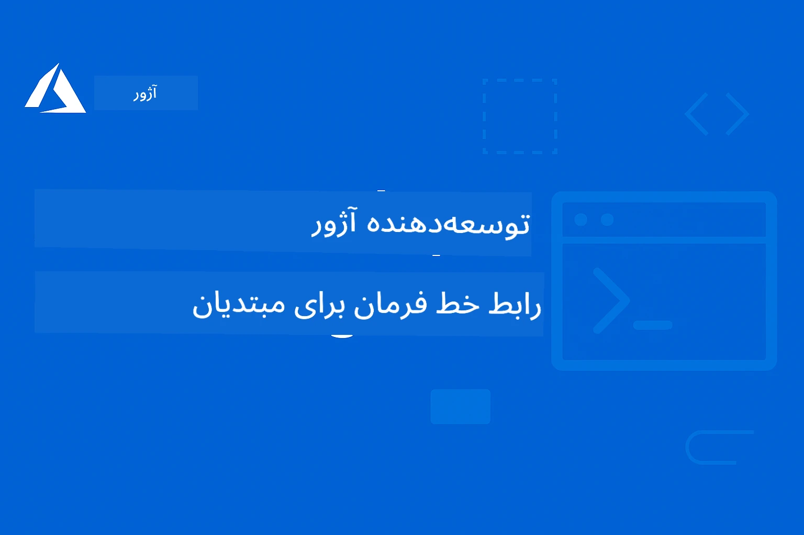

# AZD برای مبتدیان: یک مسیر یادگیری ساختاریافته

 

[](https://GitHub.com/microsoft/azd-for-beginners/watchers/)
[](https://GitHub.com/microsoft/azd-for-beginners/network/)
[](https://GitHub.com/microsoft/azd-for-beginners/stargazers/)

[](https://discord.com/invite/nkVh3dp)
[](https://discord.gg/nTYy5BXMWG)

---

### ترجمه‌های خودکار (همیشه به‌روز)

<!-- CO-OP TRANSLATOR LANGUAGES TABLE START -->
[Arabic](../ar/README.md) | [Bengali](../bn/README.md) | [Bulgarian](../bg/README.md) | [Burmese (Myanmar)](../my/README.md) | [Chinese (Simplified)](../zh-CN/README.md) | [Chinese (Traditional, Hong Kong)](../zh-HK/README.md) | [Chinese (Traditional, Macau)](../zh-MO/README.md) | [Chinese (Traditional, Taiwan)](../zh-TW/README.md) | [Croatian](../hr/README.md) | [Czech](../cs/README.md) | [Danish](../da/README.md) | [Dutch](../nl/README.md) | [Estonian](../et/README.md) | [Finnish](../fi/README.md) | [French](../fr/README.md) | [German](../de/README.md) | [Greek](../el/README.md) | [Hebrew](../he/README.md) | [Hindi](../hi/README.md) | [Hungarian](../hu/README.md) | [Indonesian](../id/README.md) | [Italian](../it/README.md) | [Japanese](../ja/README.md) | [Kannada](../kn/README.md) | [Khmer](../km/README.md) | [Korean](../ko/README.md) | [Lithuanian](../lt/README.md) | [Malay](../ms/README.md) | [Malayalam](../ml/README.md) | [Marathi](../mr/README.md) | [Nepali](../ne/README.md) | [Nigerian Pidgin](../pcm/README.md) | [Norwegian](../no/README.md) | [Persian (Farsi)](./README.md) | [Polish](../pl/README.md) | [Portuguese (Brazil)](../pt-BR/README.md) | [Portuguese (Portugal)](../pt-PT/README.md) | [Punjabi (Gurmukhi)](../pa/README.md) | [Romanian](../ro/README.md) | [Russian](../ru/README.md) | [Serbian (Cyrillic)](../sr/README.md) | [Slovak](../sk/README.md) | [Slovenian](../sl/README.md) | [Spanish](../es/README.md) | [Swahili](../sw/README.md) | [Swedish](../sv/README.md) | [Tagalog (Filipino)](../tl/README.md) | [Tamil](../ta/README.md) | [Telugu](../te/README.md) | [Thai](../th/README.md) | [Turkish](../tr/README.md) | [Ukrainian](../uk/README.md) | [Urdu](../ur/README.md) | [Vietnamese](../vi/README.md)

> **ترجیح می‌دهید به‌صورت محلی کلون کنید؟**
>
> This repository includes 50+ language translations which significantly increases the download size. To clone without translations, use sparse checkout:
>
> **Bash / macOS / Linux:**
> ```bash
> git clone --filter=blob:none --sparse https://github.com/microsoft/AZD-for-beginners.git
> cd AZD-for-beginners
> git sparse-checkout set --no-cone '/*' '!translations' '!translated_images'
> ```
>
> **CMD (Windows):**
> ```cmd
> git clone --filter=blob:none --sparse https://github.com/microsoft/AZD-for-beginners.git
> cd AZD-for-beginners
> git sparse-checkout set --no-cone "/*" "!translations" "!translated_images"
> ```
>
> این به شما همه چیز مورد نیاز برای تکمیل دوره را با دانلود بسیار سریع‌تر می‌دهد.
<!-- CO-OP TRANSLATOR LANGUAGES TABLE END -->

## 🆕 چه چیز جدیدی امروز در azd

Azure Developer CLI فراتر از برنامه‌ها و APIهای وب سنتی رشد کرده است. امروز، azd ابزار واحدی برای استقرار هر برنامه‌ای در Azure است — از جمله برنامه‌های توانمند شده با هوش مصنوعی و عامل‌های هوشمند.

این برای شما چه معنایی دارد:

- **عامل‌های هوش مصنوعی اکنون به‌عنوان بارکاری‌های درجه‌یک در azd پشتیبانی می‌شوند.** می‌توانید پروژه‌های عامل هوش مصنوعی را با همان جریان کاری `azd init` → `azd up` که قبلاً می‌شناسید، مقداردهی اولیه، استقرار و مدیریت کنید.
- **یکپارچه‌سازی Microsoft Foundry** استقرار مدل، میزبانی عامل و پیکربندی سرویس‌های AI را مستقیماً به اکوسیستم قالب‌های azd می‌آورد.
- **جریان کاری اصلی تغییر نکرده است.** خواه در حال استقرار یک برنامه todo، یک میکروسرویس، یا یک راهکار چندعاملی AI باشید، دستورات یکسان هستند.

اگر قبلاً از azd استفاده کرده‌اید، پشتیبانی AI یک گسترش طبیعی است — نه یک ابزار جدا یا مسیر پیشرفته. اگر تازه شروع می‌کنید، یک جریان کاری خواهید آموخت که برای همه چیز کار می‌کند.

---

## 🚀 Azure Developer CLI (azd) چیست؟

**Azure Developer CLI (azd)** یک ابزار خط فرمان مناسب توسعه‌دهنده است که استقرار برنامه‌ها در Azure را ساده می‌کند. به‌جای ایجاد و اتصال دستی ده‌ها منبع Azure، می‌توانید کل برنامه‌ها را با یک دستور مستقر کنید.

### جادوی `azd up`

```bash
# این فرمان واحد همه چیز را انجام می‌دهد:
# ✅ ایجاد همه منابع آزور
# ✅ پیکربندی شبکه و امنیت
# ✅ ساخت کد برنامه شما
# ✅ استقرار در آزور
# ✅ ارائه یک URL عملیاتی به شما
azd up
```

**همین بود!** نیازی به کلیک در Azure Portal نیست، نیازی به یادگیری قالب‌های پیچیده ARM در ابتدا نیست، هیچ پیکربندی دستی لازم نیست — فقط برنامه‌های در حال کار روی Azure.

---

## ❓ Azure Developer CLI در مقابل Azure CLI: چه تفاوتی دارند؟

این متداول‌ترین سؤالی است که مبتدیان می‌پرسند. این پاسخ ساده است:

| ویژگی | **Azure CLI (`az`)** | **Azure Developer CLI (`azd`)** |
|---------|---------------------|--------------------------------|
| **هدف** | مدیریت منابع منفرد Azure | استقرار برنامه‌های کامل |
| **رویکرد** | متمرکز بر زیرساخت | متمرکز بر برنامه |
| **نمونه** | `az webapp create --name myapp...` | `azd up` |
| **منحنی یادگیری** | باید با سرویس‌های Azure آشنا باشید | فقط برنامه‌تان را باید بدانید |
| **مناسب برای** | DevOps، زیرساخت | توسعه‌دهندگان، نمونه‌سازی |

### قیاس ساده

- **Azure CLI** شبیه داشتن تمام ابزارهای لازم برای ساختن یک خانه است — چکش، اره، میخ‌ها. شما می‌توانید هر چیزی بسازید، اما باید ساخت‌وساز را بدانید.
- **Azure Developer CLI** شبیه استخدام یک پیمانکار است — شما آنچه می‌خواهید را توضیح می‌دهید و او ساختن را بر عهده می‌گیرد.

### چه زمانی از هرکدام استفاده کنیم

| سناریو | از این استفاده کنید |
|----------|----------|
| "می‌خواهم وب‌اپ خود را سریع مستقر کنم" | `azd up` |
| "فقط نیاز دارم یک storage account ایجاد کنم" | `az storage account create` |
| "دارم یک برنامه کامل AI می‌سازم" | `azd init --template azure-search-openai-demo` |
| "نیاز دارم یک منبع خاص Azure را اشکال‌زدایی کنم" | `az resource show` |
| "می‌خواهم استقرار آماده تولید در چند دقیقه داشته باشم" | `azd up --environment production` |

### آن‌ها با هم کار می‌کنند!

AZD زیرِ قاب از Azure CLI استفاده می‌کند. می‌توانید هر دو را استفاده کنید:
```bash
# برنامه خود را با AZD مستقر کنید
azd up

# سپس منابع خاص را با Azure CLI به‌طور دقیق تنظیم کنید
az webapp config set --name myapp --always-on true
```

---

## 🌟 قالب‌ها را در Awesome AZD پیدا کنید

از ابتدا شروع نکنید! **Awesome AZD** مجموعه‌ای از قالب‌های آماده برای استقرار است:

| منبع | توضیحات |
|----------|-------------|
| 🔗 [**Awesome AZD Gallery**](https://azure.github.io/awesome-azd/) | مرور بیش از 200 قالب و استقرار با یک کلیک |
| 🔗 [**Submit a Template**](https://github.com/Azure/awesome-azd/issues) | قالب خود را به جامعه ارسال کنید |
| 🔗 [**GitHub Repository**](https://github.com/Azure/awesome-azd) | ستاره دهید و کد منبع را کاوش کنید |

### قالب‌های محبوب AI از Awesome AZD

```bash
# گفتگوی RAG با مدل‌های Microsoft Foundry + جستجوی هوش مصنوعی
azd init --template azure-search-openai-demo

# برنامه سریع گفتگوی هوش مصنوعی
azd init --template openai-chat-app-quickstart

# عوامل هوش مصنوعی با عوامل Foundry
azd init --template get-started-with-ai-agents
```

---

## 🎯 شروع در 3 مرحله

قبل از شروع، مطمئن شوید ماشین شما برای قالبی که می‌خواهید مستقر کنید آماده است:

**Windows:**
```powershell
.\validate-setup.ps1
```

**macOS / Linux:**
```bash
bash ./validate-setup.sh
```

اگر هر بررسی ضروری‌ای شکست خورد، ابتدا آن را رفع کنید و سپس با شروع سریع ادامه دهید.

### مرحله 1: نصب AZD (2 دقیقه)

**Windows:**
```powershell
winget install microsoft.azd
```

**macOS:**
```bash
brew tap azure/azd && brew install azd
```

**Linux:**
```bash
curl -fsSL https://aka.ms/install-azd.sh | bash
```

### مرحله 2: احراز هویت برای AZD

```bash
# اختیاری است اگر می‌خواهید از دستورات Azure CLI به طور مستقیم در این دوره استفاده کنید
az login

# برای جریان‌های کاری AZD الزامی است
azd auth login
```

اگر مطمئن نیستید کدام یک را نیاز دارید، جریان راه‌اندازی کامل را در [نصب و راه‌اندازی](docs/chapter-01-foundation/installation.md#authentication-setup) دنبال کنید.

### مرحله 3: اولین برنامه‌تان را مستقر کنید

```bash
# مقداردهی اولیه از یک الگو
azd init --template todo-nodejs-mongo

# استقرار در آزور (همه چیز را ایجاد می‌کند!)
azd up
```

**🎉 همین بود!** برنامه شما اکنون روی Azure زنده است.

### پاک‌سازی (فراموش نکنید!)

```bash
# Remove all resources when done experimenting
azd down --force --purge
```

---

## 📚 چگونه از این دوره استفاده کنید

این دوره برای **یادگیری تدریجی** طراحی شده است — از جایی شروع کنید که با آن راحت هستید و به‌تدریج پیش بروید:

| تجربه شما | از اینجا شروع کنید |
|-----------------|------------|
| **کاملاً تازه‌وارد به Azure** | [فصل 1: بنیاد](#-chapter-1-foundation--quick-start) |
| **با Azure آشنا، تازه‌کار با AZD** | [فصل 1: بنیاد](#-chapter-1-foundation--quick-start) |
| **می‌خواهید اپلیکیشن‌های AI را مستقر کنید** | [فصل 2: توسعه اول AI](#-chapter-2-ai-first-development-recommended-for-ai-developers) |
| **می‌خواهید تمرین عملی داشته باشید** | [🎓 کارگاه تعاملی](workshop/README.md) - آزمایشگاه هدایت‌شده ۳-۴ ساعته |
| **به الگوهای تولید نیاز دارید** | [فصل 8: تولید و الگوهای سازمانی](#-chapter-8-production--enterprise-patterns) |

### راه‌اندازی سریع

1. **این مخزن را فورک کنید**: [](https://GitHub.com/microsoft/azd-for-beginners/fork)
2. **آن را کلون کنید**: `git clone https://github.com/YOUR-USERNAME/azd-for-beginners.git`
3. **کمک بگیرید**: [جامعه Discord آژور](https://discord.com/invite/ByRwuEEgH4)

> **ترجیح می‌دهید به‌صورت محلی کلون کنید؟**
>
> This repository includes 50+ language translations which significantly increases the download size. To clone without translations, use sparse checkout:
> ```bash
> git clone --filter=blob:none --sparse https://github.com/microsoft/AZD-for-beginners.git
> cd AZD-for-beginners
> git sparse-checkout set --no-cone '/*' '!translations' '!translated_images'
> ```
> این به شما همه چیز مورد نیاز برای تکمیل دوره را با دانلود بسیار سریع‌تر می‌دهد.


## مرور کلی دوره

با طی کردن فصل‌های ساختاریافته که برای یادگیری تدریجی طراحی شده‌اند، بر Azure Developer CLI (azd) مسلط شوید. **تمرکز ویژه بر استقرار برنامه‌های AI با یکپارچه‌سازی Microsoft Foundry.**

### چرا این دوره برای توسعه‌دهندگان مدرن ضروری است

بر اساس دیدگاه‌های جامعه Discord مایکروسافت فاندری، **45% توسعه‌دهندگان می‌خواهند از AZD برای بارهای کاری AI استفاده کنند** اما با چالش‌هایی مواجه می‌شوند از جمله:
- معماری‌های پیچیده چندخدمتی برای AI
- بهترین شیوه‌های استقرار AI در تولید  
- یکپارچه‌سازی و پیکربندی سرویس‌های AI در Azure
- بهینه‌سازی هزینه برای بارهای کاری AI
- رفع‌اشکال مسائل مربوط به استقرارهای خاص AI

### اهداف یادگیری

با تکمیل این دوره ساختاریافته، شما:
- **تسلط بر مبانی AZD**: مفاهیم پایه، نصب و پیکربندی
- **استقرار برنامه‌های AI**: استفاده از AZD با سرویس‌های Microsoft Foundry
- **پیاده‌سازی زیرساخت به‌عنوان کد**: مدیریت منابع Azure با قالب‌های Bicep
- **عیب‌یابی استقرارها**: حل مشکلات رایج و دیباگ
- **بهینه‌سازی برای تولید**: امنیت، مقیاس‌پذیری، مانیتورینگ و مدیریت هزینه
- **ساخت راهکارهای چندعاملی**: استقرار معماری‌های پیچیده AI

## قبل از شروع: حساب‌ها، دسترسی و پیش‌فرض‌ها

قبل از شروع فصل 1، مطمئن شوید موارد زیر مهیا هستند. مراحل نصب در ادامه این راهنما فرض می‌کنند این موارد پایه از قبل تأمین شده‌اند.
- **یک اشتراک Azure**: می‌توانید از یک اشتراک موجود از محل کار یا حساب شخصی خود استفاده کنید، یا یک [نسخه آزمایشی رایگان](https://aka.ms/azurefreetrial) ایجاد کنید تا شروع کنید.
- **اجازه ایجاد منابع Azure**: برای بیشتر تمرین‌ها، باید حداقل دسترسی **Contributor** روی اشتراک یا گروه منابع هدف داشته باشید. بعضی فصل‌ها ممکن است همچنین فرض کنند که می‌توانید گروه‌های منابع، شناسه‌های مدیریت‌شده، و انتصابات RBAC ایجاد کنید.
- [**یک حساب GitHub**](https://github.com): این برای فورک کردن مخزن، پیگیری تغییرات خود و استفاده از GitHub Codespaces برای کارگاه مفید است.
- **پیش‌نیازهای زمان اجرای قالب**: برخی قالب‌ها نیاز به ابزارهای محلی مانند Node.js، Python، Java، یا Docker دارند. قبل از شروع، ابزار اعتبارسنج تنظیمات را اجرا کنید تا کمبود ابزارها را زود متوجه شوید.
- **آشنایی پایه با ترمینال**: لازم نیست متخصص باشید، اما باید با اجرای دستوراتی مانند `git clone`, `azd auth login`, و `azd up` راحت باشید.

> **در حال کار در یک اشتراک سازمانی؟**
> اگر محیط Azure شما توسط یک مدیر مدیریت می‌شود، پیش از زمان تأیید کنید که می‌توانید در اشتراک یا گروه منابعی که قصد استفاده از آن را دارید، منابع مستقر کنید. در غیر این صورت، قبل از شروع درخواست یک اشتراک سندباکس یا دسترسی Contributor کنید.

> **تازه‌کار با Azure؟**
> با نسخه آزمایشی Azure خود یا اشتراک pay-as-you-go در https://aka.ms/azurefreetrial شروع کنید تا بتوانید تمرین‌ها را از ابتدا تا انتها بدون انتظار برای تأییدات سطح تننت انجام دهید.

## 🗺️ نقشه دوره: ناوبری سریع بر اساس فصل

هر فصل دارای README اختصاصی با اهداف آموزشی، شروع سریع، و تمرین‌ها است:

| Chapter | Topic | Lessons | Duration | Complexity |
|---------|-------|---------|----------|------------|
| **[فصل 1: بنیاد](docs/chapter-01-foundation/README.md)** | شروع کار | [مفاهیم پایه AZD](docs/chapter-01-foundation/azd-basics.md) &#124; [نصب](docs/chapter-01-foundation/installation.md) &#124; [اولین پروژه](docs/chapter-01-foundation/first-project.md) | 30-45 دقیقه | ⭐ |
| **[فصل 2: توسعه هوش مصنوعی](docs/chapter-02-ai-development/README.md)** | برنامه‌های AI-اول | [یکپارچگی Foundry](docs/chapter-02-ai-development/microsoft-foundry-integration.md) &#124; [عوامل هوش مصنوعی](docs/chapter-02-ai-development/agents.md) &#124; [استقرار مدل](docs/chapter-02-ai-development/ai-model-deployment.md) &#124; [کارگاه](docs/chapter-02-ai-development/ai-workshop-lab.md) | 1-2 ساعت | ⭐⭐ |
| **[فصل 3: پیکربندی](docs/chapter-03-configuration/README.md)** | احراز هویت و امنیت | [پیکربندی](docs/chapter-03-configuration/configuration.md) &#124; [احراز هویت و امنیت](docs/chapter-03-configuration/authsecurity.md) | 45-60 دقیقه | ⭐⭐ |
| **[فصل 4: زیرساخت](docs/chapter-04-infrastructure/README.md)** | IaC و استقرار | [راهنمای استقرار](docs/chapter-04-infrastructure/deployment-guide.md) &#124; [تأمین منابع](docs/chapter-04-infrastructure/provisioning.md) | 1-1.5 ساعت | ⭐⭐⭐ |
| **[فصل 5: چندعامل](docs/chapter-05-multi-agent/README.md)** | راه‌حل‌های عامل هوش مصنوعی | [سناریوی خرده‌فروشی](examples/retail-scenario.md) &#124; [الگوهای هماهنگی](docs/chapter-06-pre-deployment/coordination-patterns.md) | 2-3 ساعت | ⭐⭐⭐⭐ |
| **[فصل 6: پیش از استقرار](docs/chapter-06-pre-deployment/README.md)** | برنامه‌ریزی و اعتبارسنجی | [بررسی‌های پیش‌پرواز](docs/chapter-06-pre-deployment/preflight-checks.md) &#124; [برنامه‌ریزی ظرفیت](docs/chapter-06-pre-deployment/capacity-planning.md) &#124; [انتخاب SKU](docs/chapter-06-pre-deployment/sku-selection.md) &#124; [Application Insights](docs/chapter-06-pre-deployment/application-insights.md) | 1 ساعت | ⭐⭐ |
| **[فصل 7: رفع اشکال](docs/chapter-07-troubleshooting/README.md)** | دیباگ و رفع خطا | [مسائل رایج](docs/chapter-07-troubleshooting/common-issues.md) &#124; [اشکال‌زدایی](docs/chapter-07-troubleshooting/debugging.md) &#124; [مسائل AI](docs/chapter-07-troubleshooting/ai-troubleshooting.md) | 1-1.5 ساعت | ⭐⭐ |
| **[فصل 8: تولید](docs/chapter-08-production/README.md)** | الگوهای سازمانی | [روش‌های تولید](docs/chapter-08-production/production-ai-practices.md) | 2-3 ساعت | ⭐⭐⭐⭐ |
| **[🎓 کارگاه](workshop/README.md)** | آزمایش عملی | [مقدمه](workshop/docs/instructions/0-Introduction.md) &#124; [انتخاب](workshop/docs/instructions/1-Select-AI-Template.md) &#124; [اعتبارسنجی](workshop/docs/instructions/2-Validate-AI-Template.md) &#124; [بازشکافی](workshop/docs/instructions/3-Deconstruct-AI-Template.md) &#124; [پیکربندی](workshop/docs/instructions/4-Configure-AI-Template.md) &#124; [سفارشی‌سازی](workshop/docs/instructions/5-Customize-AI-Template.md) &#124; [جمع‌آوری منابع](workshop/docs/instructions/6-Teardown-Infrastructure.md) &#124; [جمع‌بندی](workshop/docs/instructions/7-Wrap-up.md) | 3-4 ساعت | ⭐⭐ |

**مدت زمان کل دوره:** ~10-14 ساعت | **پیشرفت مهارت:** مبتدی → آماده برای تولید

---

## 📚 فصل‌های آموزشی

*مسیر یادگیری خود را بر اساس سطح تجربه و اهداف انتخاب کنید*

### 🚀 فصل 1: بنیاد و شروع سریع
**پیش‌نیازها**: اشتراک Azure، دانش پایه خط فرمان  
**مدت زمان**: 30-45 دقیقه  
**پیچیدگی**: ⭐

#### آنچه می‌آموزید
- درک اصول خط فرمان توسعه‌دهنده Azure (AZD)
- نصب AZD روی پلتفرم خود
- اولین استقرار موفق شما

#### منابع یادگیری
- **🎯 از اینجا شروع کنید**: [Azure Developer CLI چیست؟](#what-is-azure-developer-cli)
- **📖 نظریه**: [مفاهیم پایه AZD](docs/chapter-01-foundation/azd-basics.md) - مفاهیم و اصطلاحات اصلی
- **⚙️ تنظیم**: [نصب و راه‌اندازی](docs/chapter-01-foundation/installation.md) - راهنمای مخصوص پلتفرم
- **🛠️ عملی**: [اولین پروژه شما](docs/chapter-01-foundation/first-project.md) - آموزش گام‌به‌گام
- **📋 مرجع سریع**: [برگه تقلب دستورات](resources/cheat-sheet.md)

#### تمرین‌های عملی
```bash
# بررسی سریع نصب
azd version

# اولین برنامهٔ خود را مستقر کنید
azd init --template todo-nodejs-mongo
azd up
```

**💡 نتیجه فصل**: استقرار موفق یک برنامه وب ساده در Azure با استفاده از AZD

**✅ اعتبارسنجی موفقیت:**
```bash
# پس از اتمام فصل ۱، باید بتوانید:
azd version              # نسخهٔ نصب‌شده را نشان می‌دهد
azd init --template todo-nodejs-mongo  # پروژه را مقداردهی اولیه می‌کند
azd up                  # روی Azure مستقر می‌کند
azd show                # آدرس URL برنامه در حال اجرا را نمایش می‌دهد
# برنامه در مرورگر باز می‌شود و کار می‌کند
azd down --force --purge  # منابع را پاک‌سازی می‌کند
```

**📊 زمان مورد نیاز:** 30-45 دقیقه  
**📈 سطح مهارت پس از:** قادر به استقرار برنامه‌های پایه به‌صورت مستقل
**📈 سطح مهارت پس از:** قادر به استقرار برنامه‌های پایه به‌صورت مستقل

---

### 🤖 فصل 2: توسعه AI-اول (پیشنهاد شده برای توسعه‌دهندگان AI)
**پیش‌نیازها**: تکمیل فصل 1  
**مدت زمان**: 1-2 ساعت  
**پیچیدگی**: ⭐⭐

#### آنچه می‌آموزید
- یکپارچگی Microsoft Foundry با AZD
- استقرار برنامه‌های مجهز به هوش مصنوعی
- درک تنظیمات سرویس‌های AI

#### منابع یادگیری
- **🎯 از اینجا شروع کنید**: [یکپارچگی Microsoft Foundry](docs/chapter-02-ai-development/microsoft-foundry-integration.md)
- **🤖 عوامل AI**: [راهنمای عوامل AI](docs/chapter-02-ai-development/agents.md) - استقرار عوامل هوشمند با AZD
- **📖 الگوها**: [استقرار مدل AI](docs/chapter-02-ai-development/ai-model-deployment.md) - استقرار و مدیریت مدل‌های AI
- **🛠️ کارگاه**: [آزمایشگاه کارگاه AI](docs/chapter-02-ai-development/ai-workshop-lab.md) - آماده‌سازی راه‌حل‌های AI برای AZD
- **🎥 راهنمای تعاملی**: [مواد کارگاه](workshop/README.md) - یادگیری مبتنی بر مرورگر با MkDocs * DevContainer Environment
- **📋 قالب‌ها**: [قالب‌های مایکروسافت فاندری برجسته](#منابع-کارگاه)
- **📝 مثال‌ها**: [نمونه‌های استقرار AZD](examples/README.md)

#### تمرین‌های عملی
```bash
# اولین برنامه هوش مصنوعی خود را مستقر کنید
azd init --template azure-search-openai-demo
azd up

# قالب‌های اضافی هوش مصنوعی را امتحان کنید
azd init --template openai-chat-app-quickstart
azd init --template agent-openai-python-prompty
```

**💡 نتیجه فصل**: استقرار و پیکربندی یک برنامه چت مجهز به AI با قابلیت‌های RAG

**✅ اعتبارسنجی موفقیت:**
```bash
# بعد از فصل ۲، باید بتوانید:
azd init --template azure-search-openai-demo
azd up
# رابط چت هوش مصنوعی را آزمایش کنید
# سؤالات بپرسید و پاسخ‌های تولیدشده توسط هوش مصنوعی را همراه با منابع دریافت کنید
# بررسی کنید که ادغام جستجو کار می‌کند
azd monitor  # بررسی کنید که Application Insights داده‌های تله‌متری را نمایش می‌دهد
azd down --force --purge
```

**📊 زمان مورد نیاز:** 1-2 ساعت  
**📈 سطح مهارت پس از:** قادر به استقرار و پیکربندی برنامه‌های AI آماده تولید  
**💰 آگاهی از هزینه:** درک هزینه‌های توسعه ~$80-150/ماه، هزینه‌های تولید ~$300-3500/ماه

#### 💰 ملاحظات هزینه برای استقرارهای AI

**محیط توسعه (تخمینی $80-150/ماه):**
- مدل‌های Microsoft Foundry (پرداخت به ازای مصرف): $0-50/ماه (بر اساس مصرف توکن)
- AI Search (رده پایه): $75/ماه
- Container Apps (مصرفی): $0-20/ماه
- Storage (استاندارد): $1-5/ماه

**محیط تولید (تخمینی $300-3,500+/ماه):**
- مدل‌های Microsoft Foundry (PTU برای عملکرد ثابت): $3,000+/ماه یا پرداخت به ازای مصرف با حجم بالا
- AI Search (رده استاندارد): $250/ماه
- Container Apps (اختصاصی): $50-100/ماه
- Application Insights: $5-50/ماه
- Storage (پرمیوم): $10-50/ماه

**💡 نکات بهینه‌سازی هزینه:**
- برای یادگیری از مدل‌های Microsoft Foundry در **رده رایگان** استفاده کنید (Azure OpenAI شامل 50,000 توکن/ماه)
- برای آزادسازی منابع هنگام عدم توسعه فعال، `azd down` را اجرا کنید
- با صورتحساب مبتنی بر مصرف شروع کنید، فقط برای تولید به PTU ارتقا دهید
- از `azd provision --preview` برای برآورد هزینه‌ها قبل از استقرار استفاده کنید
- مقیاس‌بندی خودکار را فعال کنید: فقط برای مصرف واقعی پرداخت کنید

**نظارت بر هزینه:**
```bash
# هزینه‌های ماهیانهٔ تخمینی را بررسی کنید
azd provision --preview

# هزینه‌های واقعی را در پورتال Azure نظارت کنید
az consumption budget list --resource-group <your-rg>
```

---

### ⚙️ فصل 3: پیکربندی و احراز هویت
**پیش‌نیازها**: تکمیل فصل 1  
**مدت زمان**: 45-60 دقیقه  
**پیچیدگی**: ⭐⭐

#### آنچه می‌آموزید
- پیکربندی و مدیریت محیط‌ها
- بهترین شیوه‌های احراز هویت و امنیت
- نام‌گذاری و سازمان‌دهی منابع

#### منابع یادگیری
- **📖 پیکربندی**: [راهنمای پیکربندی](docs/chapter-03-configuration/configuration.md) - تنظیم محیط
- **🔐 امنیت**: [الگوهای احراز هویت و شناسه مدیریت‌شده](docs/chapter-03-configuration/authsecurity.md) - الگوهای احراز هویت
- **📝 مثال‌ها**: [مثال برنامه پایگاه داده](examples/database-app/README.md) - مثال‌های پایگاه داده AZD

#### تمرین‌های عملی
- پیکربندی چندین محیط (dev, staging, prod)
- راه‌اندازی احراز هویت با شناسه مدیریت‌شده
- پیاده‌سازی پیکربندی‌های مخصوص هر محیط

**💡 نتیجه فصل**: مدیریت چندین محیط با احراز هویت و امنیت مناسب

---

### 🏗️ فصل 4: زیرساخت به‌عنوان کد و استقرار
**پیش‌نیازها**: تکمیل فصل‌های 1-3  
**مدت زمان**: 1-1.5 ساعت  
**پیچیدگی**: ⭐⭐⭐

#### آنچه می‌آموزید
- الگوهای پیشرفته استقرار
- زیرساخت به‌عنوان کد با Bicep
- استراتژی‌های تأمین منابع

#### منابع یادگیری
- **📖 استقرار**: [راهنمای استقرار](docs/chapter-04-infrastructure/deployment-guide.md) - جریان‌های کاری کامل
- **🏗️ تأمین منابع**: [تأمین منابع](docs/chapter-04-infrastructure/provisioning.md) - مدیریت منابع Azure
- **📝 مثال‌ها**: [مثال برنامه Container](../../examples/container-app) - استقرارهای کانتینری

#### تمرین‌های عملی
- ایجاد قالب‌های Bicep سفارشی
- استقرار برنامه‌های چندسرویسی
- پیاده‌سازی استراتژی‌های استقرار blue-green

**💡 نتیجه فصل**: استقرار برنامه‌های پیچیده چندسرویسی با استفاده از قالب‌های زیرساخت سفارشی

---

### 🎯 فصل 5: راه‌حل‌های چندعامل AI (پیشرفته)
**پیش‌نیازها**: تکمیل فصل‌های 1-2  
**مدت زمان**: 2-3 ساعت  
**پیچیدگی**: ⭐⭐⭐⭐

#### آنچه می‌آموزید
- الگوهای معماری چندعامل
- ارکستراسیون و هماهنگی عوامل
- استقرارهای AI آماده تولید

#### منابع یادگیری
- **🤖 پروژه برجسته**: [راه‌حل چندعامل خرده‌فروشی](examples/retail-scenario.md) - پیاده‌سازی کامل
- **🛠️ قالب‌های ARM**: [بسته قالب ARM](../../examples/retail-multiagent-arm-template) - استقرار با یک کلیک
- **📖 معماری**: [الگوهای هماهنگی چندعامل](docs/chapter-06-pre-deployment/coordination-patterns.md) - الگوها

#### تمرین‌های عملی
```bash
# استقرار کامل راه‌حل چندعاملی خرده‌فروشی
cd examples/retail-multiagent-arm-template
./deploy.sh

# بررسی پیکربندی‌های عامل
az deployment group show --resource-group <rg-name> --name <deployment-name>
```

**💡 نتیجه فصل**: استقرار و مدیریت یک راه‌حل چندعامل AI آماده تولید با عوامل مشتری و موجودی

---

### 🔍 فصل 6: اعتبارسنجی و برنامه‌ریزی پیش از استقرار
**پیش‌نیازها**: تکمیل فصل 4  
**مدت زمان**: 1 ساعت  
**پیچیدگی**: ⭐⭐
#### آنچه خواهید آموخت
- برنامه‌ریزی ظرفیت و تایید منابع
- راهبردهای انتخاب SKU
- بررسی‌های پیش‌استقرار و خودکارسازی

#### منابع یادگیری
- **📊 برنامه‌ریزی**: [برنامه‌ریزی ظرفیت](docs/chapter-06-pre-deployment/capacity-planning.md) - تایید منابع
- **💰 انتخاب**: [انتخاب SKU](docs/chapter-06-pre-deployment/sku-selection.md) - انتخاب‌های مقرون‌به‌صرفه
- **✅ اعتبارسنجی**: [بررسی‌های پیش‌استقرار](docs/chapter-06-pre-deployment/preflight-checks.md) - اسکریپت‌های خودکار

#### تمرین‌های عملی
- اسکریپت‌های اعتبارسنجی ظرفیت را اجرا کنید
- انتخاب‌های SKU را برای کاهش هزینه بهینه کنید
- بررسی‌های خودکار پیش‌استقرار را پیاده‌سازی کنید

**💡 نتیجه فصل**: استقرارها را قبل از اجرا اعتبارسنجی و بهینه‌سازی کنید

---

### 🚨 فصل 7: عیب‌یابی و اشکال‌زدایی
**پیش‌نیازها**: تکمیل هر یک از فصل‌های استقرار  
**مدت زمان**: 1-1.5 ساعت  
**پیچیدگی**: ⭐⭐

#### آنچه خواهید آموخت
- رویکردهای سیستماتیک اشکال‌زدایی
- مسائل رایج و راه‌حل‌ها
- عیب‌یابی مخصوص هوش مصنوعی

#### منابع یادگیری
- **🔧 مسائل رایج**: [مسائل رایج](docs/chapter-07-troubleshooting/common-issues.md) - پرسش‌های متداول و راه‌حل‌ها
- **🕵️ دیباگ**: [راهنمای اشکال‌زدایی](docs/chapter-07-troubleshooting/debugging.md) - راهبردهای گام‌به‌گام
- **🤖 مسائل هوش مصنوعی**: [عیب‌یابی مخصوص هوش مصنوعی](docs/chapter-07-troubleshooting/ai-troubleshooting.md) - مشکلات سرویس‌های هوش مصنوعی

#### تمرین‌های عملی
- تشخیص شکست‌های استقرار
- رفع مشکلات احراز هویت
- رفع اشکال در اتصال سرویس‌های هوش مصنوعی

**💡 نتیجه فصل**: تشخیص و حل مستقل مسائل رایج استقرار

---

### 🏢 فصل 8: الگوهای تولید و سازمانی
**پیش‌نیازها**: تکمیل فصل‌های 1 تا 4  
**مدت زمان**: 2-3 ساعت  
**پیچیدگی**: ⭐⭐⭐⭐

#### آنچه خواهید آموخت
- راهبردهای استقرار در محیط تولید
- الگوهای امنیتی سازمانی
- نظارت و بهینه‌سازی هزینه

#### منابع یادگیری
- **🏭 تولید**: [بهترین شیوه‌های AI برای تولید](docs/chapter-08-production/production-ai-practices.md) - الگوهای سازمانی
- **📝 نمونه‌ها**: [مثال میکروسرویس‌ها](../../examples/microservices) - معماری‌های پیچیده
- **📊 نظارت**: [ادغام با Application Insights](docs/chapter-06-pre-deployment/application-insights.md) - نظارت

#### تمرین‌های عملی
- پیاده‌سازی الگوهای امنیتی سازمانی
- راه‌اندازی نظارت جامع
- استقرار در محیط تولید با حاکمیت مناسب

**💡 نتیجه فصل**: استقرار برنامه‌های آماده سازمانی با قابلیت‌های کامل تولید

---

## 🎓 مرور کارگاه: تجربه یادگیری عملی

> **⚠️ وضعیت کارگاه: در حال توسعه فعال**  
> مواد کارگاه در حال حاضر در دست توسعه و پالایش هستند. ماژول‌های اصلی عملیاتی هستند، اما برخی بخش‌های پیشرفته کامل نشده‌اند. ما به‌طور فعال در حال تکمیل تمام محتوا هستیم. [پیشرفت را دنبال کنید →](workshop/README.md)

### مواد کارگاه تعاملی
**آموزش جامع دست‌اول با ابزارهای مبتنی بر مرورگر و تمرین‌های هدایت‌شده**

مواد کارگاه ما تجربه‌ای ساختاریافته و تعاملی فراهم می‌کند که مکمل برنامه درسی مبتنی بر فصل‌های بالا است. این کارگاه برای هر دو حالت یادگیری خودخوان و جلسات با هدایت مدرس طراحی شده است.

#### 🛠️ ویژگی‌های کارگاه
- **رابط مبتنی بر مرورگر**: کارگاه کامل مبتنی بر MkDocs با ویژگی‌های جستجو، کپی و تم
- **ادغام GitHub Codespaces**: راه‌اندازی محیط توسعه با یک کلیک
- **مسیر یادگیری ساختاریافته**: تمرین‌های هدایت‌شده در 8 ماژول (جمعاً 3-4 ساعت)
- **روش‌شناسی پیش‌رونده**: مقدمه → انتخاب → اعتبارسنجی → تجزیه → پیکربندی → سفارشی‌سازی → پاک‌سازی → جمع‌بندی
- **محیط DevContainer تعاملی**: ابزارها و وابستگی‌های پیش‌پیکربندی‌شده

#### 📚 ساختار ماژول‌های کارگاه
The workshop follows an **8-module progressive methodology** that takes you from discovery to deployment mastery:

| ماژول | موضوع | کارهایی که انجام خواهید داد | مدت زمان |
|--------|-------|----------------|----------|
| **0. معرفی** | مرور کارگاه | درک اهداف یادگیری، پیش‌نیازها، و ساختار کارگاه | 15 دقیقه |
| **1. انتخاب** | کشف قالب‌ها | کاوش قالب‌های AZD و انتخاب قالب AI مناسب برای سناریوی شما | 20 دقیقه |
| **2. اعتبارسنجی** | استقرار و بررسی | قالب را با `azd up` مستقر کرده و اعتبارسنجی کنید که زیرساخت کار می‌کند | 30 دقیقه |
| **3. تجزیه** | درک ساختار | از GitHub Copilot برای کاوش معماری قالب، فایل‌های Bicep، و سازمان‌دهی کد استفاده کنید | 30 دقیقه |
| **4. پیکربندی** | بررسی عمیق azure.yaml | بر پیکربندی `azure.yaml`، هوک‌های چرخه عمر و متغیرهای محیطی تسلط پیدا کنید | 30 دقیقه |
| **5. سفارشی‌سازی** | آن را متعلق به خود کنید | جستجوی AI، tracing، ارزیابی را فعال کرده و برای سناریوی خود سفارشی کنید | 45 دقیقه |
| **6. پاک‌سازی** | پاک‌سازی | منابع را به‌طور امن پاک کنید با `azd down --purge` | 15 دقیقه |
| **7. جمع‌بندی** | مراحل بعدی | مرور دستاوردها، مفاهیم کلیدی، و ادامه مسیر یادگیری خود | 15 دقیقه |

**Workshop Flow:**
```
Introduction → Selection → Validation → Deconstruction → Configuration → Customization → Teardown → Wrap-up
     ↓            ↓           ↓              ↓               ↓              ↓            ↓           ↓
  Overview    Find the     Deploy &      Explore        Master         Customize     Clean up    Review &
             right        verify        code &        azure.yaml      for your      resources   next steps
             template                   structure                     scenario
```

#### 🚀 شروع کار با کارگاه
```bash
# گزینهٔ ۱: GitHub Codespaces (توصیه‌شده)
# در مخزن روی «Code» کلیک کنید → «Create codespace on main»

# گزینهٔ ۲: توسعهٔ محلی
git clone https://github.com/microsoft/azd-for-beginners.git
cd azd-for-beginners/workshop
# دستورالعمل‌های راه‌اندازی در workshop/README.md را دنبال کنید
```

#### 🎯 نتایج یادگیری کارگاه
با تکمیل کارگاه، شرکت‌کنندگان قادر خواهند بود:
- **استقرار برنامه‌های AI تولیدی**: از AZD با سرویس‌های Microsoft Foundry استفاده کنید
- **تسلط بر معماری‌های چندعامله**: پیاده‌سازی راه‌حل‌های هماهنگ‌شده عوامل هوش مصنوعی
- **پیاده‌سازی بهترین شیوه‌های امنیتی**: پیکربندی احراز هویت و کنترل دسترسی
- **بهینه‌سازی برای مقیاس**: طراحی استقرارهای مقرون‌به‌صرفه و با عملکرد مناسب
- **عیب‌یابی استقرارها**: حل مستقل مسائل رایج

#### 📖 منابع کارگاه
- **🎥 راهنمای تعاملی**: [مواد کارگاه](workshop/README.md) - محیط یادگیری مبتنی بر مرورگر
- **📋 دستورالعمل‌های مرحله‌به‌مرحله ماژول‌ها**:
  - [0. Introduction](workshop/docs/instructions/0-Introduction.md) - مرور کارگاه و اهداف
  - [1. Selection](workshop/docs/instructions/1-Select-AI-Template.md) - پیدا کردن و انتخاب قالب‌های AI
  - [2. Validation](workshop/docs/instructions/2-Validate-AI-Template.md) - استقرار و بررسی قالب‌ها
  - [3. Deconstruction](workshop/docs/instructions/3-Deconstruct-AI-Template.md) - کاوش معماری قالب
  - [4. Configuration](workshop/docs/instructions/4-Configure-AI-Template.md) - تسلط بر azure.yaml
  - [5. Customization](workshop/docs/instructions/5-Customize-AI-Template.md) - سفارشی‌سازی برای سناریوی شما
  - [6. Teardown](workshop/docs/instructions/6-Teardown-Infrastructure.md) - پاک‌سازی منابع
  - [7. Wrap-up](workshop/docs/instructions/7-Wrap-up.md) - مرور و مراحل بعدی
- **🛠️ لابراتوار کارگاه AI**: [AI Workshop Lab](docs/chapter-02-ai-development/ai-workshop-lab.md) - تمرین‌های متمرکز بر AI
- **💡 شروع سریع**: [راهنمای راه‌اندازی کارگاه](workshop/README.md#quick-start) - پیکربندی محیط

**مناسب برای**: آموزش سازمانی، دوره‌های دانشگاهی، یادگیری خودخوان، و بوت‌کمپ‌های توسعه‌دهنده.

---

## 📖 بررسی عمیق: قابلیت‌های AZD

فراتر از مبانی، AZD امکانات قدرتمندی برای استقرار در محیط تولید فراهم می‌کند:

- **استقرار مبتنی بر قالب‌ها** - استفاده از قالب‌های از پیش‌ساخته برای الگوهای رایج برنامه
- **زیرساخت به‌عنوان کد** - مدیریت منابع Azure با استفاده از Bicep یا Terraform  
- **گردش‌های کاری یکپارچه** - تامین، استقرار، و نظارت بر برنامه‌ها به‌صورت یکپارچه
- **دوستدار توسعه‌دهنده** - بهینه‌شده برای بهره‌وری و تجربه توسعه‌دهنده

### **AZD + Microsoft Foundry: مناسب برای استقرارهای AI**

**چرا AZD برای راه‌حل‌های AI؟** AZD به چالش‌های اصلی توسعه‌دهندگان هوش مصنوعی پاسخ می‌دهد:

- **قالب‌های آماده AI** - قالب‌های پیش‌پیکربندی‌شده برای مدل‌های Microsoft Foundry، Cognitive Services، و بارکاری ML
- **استقرارهای ایمن AI** - الگوهای امنیتی داخلی برای سرویس‌های AI، کلیدهای API، و نقاط انتهایی مدل  
- **الگوهای AI برای تولید** - بهترین شیوه‌ها برای استقرارهای AI مقیاس‌پذیر و مقرون‌به‌صرفه
- **گردش‌های کاری انتها‌به‌انتها برای AI** - از توسعه مدل تا استقرار تولید با نظارت مناسب
- **بهینه‌سازی هزینه** - تخصیص هوشمند منابع و راهبردهای مقیاس‌گذاری برای بارکاری‌های AI
- **ادغام با Microsoft Foundry** - اتصال یکپارچه به کاتالوگ مدل‌ها و نقاط انتهایی Microsoft Foundry

---

## 🎯 کتابخانه قالب‌ها و مثال‌ها

### ویژه: قالب‌های Microsoft Foundry
**اگر در حال استقرار برنامه‌های AI هستید، از اینجا شروع کنید!**

> **توجه:** این قالب‌ها الگوهای مختلف AI را نشان می‌دهند. برخی از آنها Azure Samples خارجی هستند، و برخی دیگر پیاده‌سازی‌های محلی هستند.

| قالب | فصل | پیچیدگی | خدمات | نوع |
|----------|---------|------------|----------|------|
| [**شروع با چت AI**](https://github.com/Azure-Samples/get-started-with-ai-chat) | فصل 2 | ⭐⭐ | AzureOpenAI + Azure AI Model Inference API + Azure AI Search + Azure Container Apps + Application Insights | خارجی |
| [**شروع با عوامل AI**](https://github.com/Azure-Samples/get-started-with-ai-agents) | فصل 2 | ⭐⭐ | Foundry Agents + AzureOpenAI + Azure AI Search + Azure Container Apps + Application Insights| خارجی |
| [**دموی Azure Search + OpenAI**](https://github.com/Azure-Samples/azure-search-openai-demo) | فصل 2 | ⭐⭐ | AzureOpenAI + Azure AI Search + App Service + Storage | خارجی |
| [**شروع سریع برنامه چت OpenAI**](https://github.com/Azure-Samples/openai-chat-app-quickstart) | فصل 2 | ⭐ | AzureOpenAI + Container Apps + Application Insights | خارجی |
| [**Agent OpenAI Python Prompty**](https://github.com/Azure-Samples/agent-openai-python-prompty) | فصل 5 | ⭐⭐⭐ | AzureOpenAI + Azure Functions + Prompty | خارجی |
| [**Contoso Chat RAG**](https://github.com/Azure-Samples/contoso-chat) | فصل 8 | ⭐⭐⭐⭐ | AzureOpenAI + AI Search + Cosmos DB + Container Apps | خارجی |
| [**Retail Multi-Agent Solution**](examples/retail-scenario.md) | فصل 5 | ⭐⭐⭐⭐ | AzureOpenAI + AI Search + Storage + Container Apps + Cosmos DB | **محلی** |

### ویژه: سناریوهای کامل یادگیری
**قالب‌های آماده تولید که به فصل‌های آموزشی نگاشت شده‌اند**

| قالب | فصل آموزشی | پیچیدگی | یادگیری کلیدی |
|----------|------------------|------------|--------------|
| [**openai-chat-app-quickstart**](https://github.com/Azure-Samples/openai-chat-app-quickstart) | فصل 2 | ⭐ | الگوهای پایه استقرار AI |
| [**azure-search-openai-demo**](https://github.com/Azure-Samples/azure-search-openai-demo) | فصل 2 | ⭐⭐ | پیاده‌سازی RAG با Azure AI Search |
| [**ai-document-processing**](https://github.com/Azure-Samples/ai-document-processing) | فصل 4 | ⭐⭐ | ادغام Document Intelligence |
| [**agent-openai-python-prompty**](https://github.com/Azure-Samples/agent-openai-python-prompty) | فصل 5 | ⭐⭐⭐ | چارچوب عامل و فراخوانی توابع |
| [**contoso-chat**](https://github.com/Azure-Samples/contoso-chat) | فصل 8 | ⭐⭐⭐ | ارکستراسیون سازمانی AI |
| [**retail-multi-agent-solution**](examples/retail-scenario.md) | فصل 5 | ⭐⭐⭐⭐ | معماری چندعامل با عوامل مشتری و موجودی |

### یادگیری بر اساس نوع مثال

> **📌 مثال‌های محلی در مقابل خارجی:**  
> **مثال‌های محلی** (در این مخزن) = آماده استفاده بلافاصله  
> **مثال‌های خارجی** (Azure Samples) = کلون از مخازن لینک‌شده

#### مثال‌های محلی (آماده استفاده)
- [**راه‌حل چندعامل خرده‌فروشی**](examples/retail-scenario.md) - پیاده‌سازی کامل آماده تولید با قالب‌های ARM
  - معماری چندعامل (عامل مشتری + عامل موجودی)
  - نظارت و ارزیابی جامع
  - استقرار با یک کلیک از طریق قالب ARM

#### مثال‌های محلی - برنامه‌های کانتینری (فصل‌های 2-5)
**مثال‌های جامع استقرار کانتینر در این مخزن:**
- [**نمونه‌های برنامه کانتینر**](examples/container-app/README.md) - راهنمای کامل برای استقرارهای کانتینری
  - [API ساده Flask](../../examples/container-app/simple-flask-api) - API REST پایه با قابلیت scale-to-zero
  - [معماری میکروسرویس‌ها](../../examples/container-app/microservices) - استقرار چندسرویسی آماده تولید
  - شروع سریع، تولید، و الگوهای استقرار پیشرفته
  - راهنمایی در زمینه نظارت، امنیت، و بهینه‌سازی هزینه

#### مثال‌های خارجی - برنامه‌های ساده (فصل‌های 1-2)
**برای شروع، این مخازن Azure Samples را کلون کنید:**
- [وب‌اپ ساده - Node.js + MongoDB](https://github.com/Azure-Samples/todo-nodejs-mongo) - الگوهای استقرار پایه
- [وب‌سایت استاتیک - React SPA](https://github.com/Azure-Samples/todo-csharp-sql-swa-func) - استقرار محتوای ایستا
- [برنامه کانتینر - Python Flask](https://github.com/Azure-Samples/container-apps-store-api-microservice) - استقرار API REST

#### مثال‌های خارجی - یکپارچه‌سازی پایگاه‌داده (فصل‌های 3-4)
- [اپلیکیشن پایگاه‌داده - C# + SQL](https://github.com/Azure-Samples/todo-csharp-sql) - الگوهای اتصال به پایگاه‌داده
- [Functions + Cosmos DB](https://github.com/Azure-Samples/todo-python-mongo-swa-func) - گردش‌کار داده بدون سرور

#### مثال‌های خارجی - الگوهای پیشرفته (فصل‌های 4-8)
- [Java Microservices](https://github.com/Azure-Samples/java-microservices-aca-lab) - معماری‌های چندسرویسی
- [Container Apps Jobs](https://github.com/Azure-Samples/container-apps-jobs) - پردازش پس‌زمینه  
- [Enterprise ML Pipeline](https://github.com/Azure-Samples/mlops-v2) - الگوهای ML آماده تولید

### مجموعه‌های قالب خارجی
- [**Official AZD Template Gallery**](https://azure.github.io/awesome-azd/) - مجموعه گزینش‌شده‌ای از قالب‌های رسمی و جامعه
- [**Azure Developer CLI Templates**](https://learn.microsoft.com/en-us/azure/developer/azure-developer-cli/azd-templates) - مستندات قالب‌های Microsoft Learn
- [**Examples Directory**](examples/README.md) - مثال‌های محلی برای یادگیری با توضیحات کامل

---

## 📚 منابع یادگیری و مراجع

### مراجع سریع
- [**Command Cheat Sheet**](resources/cheat-sheet.md) - دستورات ضروری azd مرتب‌شده بر اساس فصل
- [**Glossary**](resources/glossary.md) - اصطلاحات Azure و azd  
- [**FAQ**](resources/faq.md) - سؤال‌های متداول مرتب‌شده بر اساس فصل آموزشی
- [**Study Guide**](resources/study-guide.md) - تمرین‌های جامع عملی

### کارگاه‌های عملی
- [**AI Workshop Lab**](docs/chapter-02-ai-development/ai-workshop-lab.md) - تبدیل راه‌حل‌های هوش مصنوعی شما به امکان استقرار با AZD (2-3 ساعت)
- [**Interactive Workshop**](workshop/README.md) - تمرین‌های راهنمای ۸ ماژوله با MkDocs و GitHub Codespaces
  - شامل: مقدمه → انتخاب → اعتبارسنجی → تفکیک → پیکربندی → سفارشی‌سازی → پاک‌سازی → جمع‌بندی

### منابع یادگیری خارجی
- [Azure Developer CLI Documentation](https://learn.microsoft.com/en-us/azure/developer/azure-developer-cli/)
- [Azure Architecture Center](https://learn.microsoft.com/en-us/azure/architecture/)
- [Azure Pricing Calculator](https://azure.microsoft.com/pricing/calculator/)
- [Azure Status](https://status.azure.com/)

### مهارت‌های عامل‌های هوش مصنوعی برای ویرایشگر شما
- [**Microsoft Azure Skills on skills.sh**](https://skills.sh/microsoft/github-copilot-for-azure) - 37 مهارت عامل متن‌باز برای Azure AI، Foundry، استقرار، عیب‌یابی، بهینه‌سازی هزینه و بیشتر. آن‌ها را در GitHub Copilot، Cursor، Claude Code، یا هر عامل پشتیبانی‌شده نصب کنید:
  ```bash
  npx skills add microsoft/github-copilot-for-azure
  ```

---

## 🔧 راهنمای سریع عیب‌یابی

**مشکل‌های رایجی که مبتدیان با آن مواجه می‌شوند و راه‌حل‌های سریع:**

<details>
<summary><strong>❌ "azd: command not found"</strong></summary>

```bash
# ابتدا AZD را نصب کنید
# ویندوز (PowerShell):
winget install microsoft.azd

# مک‌اواس:
brew tap azure/azd && brew install azd

# لینوکس:
curl -fsSL https://aka.ms/install-azd.sh | bash

# نصب را بررسی کنید
azd version
```
</details>

<details>
<summary><strong>❌ "No subscription found" or "Subscription not set"</strong></summary>

```bash
# لیست اشتراک‌های موجود
az account list --output table

# تنظیم اشتراک پیش‌فرض
az account set --subscription "<subscription-id-or-name>"

# تنظیم برای محیط AZD
azd env set AZURE_SUBSCRIPTION_ID "<subscription-id>"

# تأیید
az account show
```
</details>

<details>
<summary><strong>❌ "InsufficientQuota" or "Quota exceeded"</strong></summary>

```bash
# یک منطقهٔ Azure متفاوت را امتحان کنید
azd env set AZURE_LOCATION "westus2"
azd up

# یا در محیط توسعه از SKUهای کوچکتر استفاده کنید
# فایل infra/main.parameters.json را ویرایش کنید:
{
  "sku": "B1"  // Instead of "P1V2"
}
```
</details>

<details>
<summary><strong>❌ "azd up" fails halfway through</strong></summary>

```bash
# گزینه ۱: پاک‌سازی و تلاش مجدد
azd down --force --purge
azd up

# گزینه ۲: فقط زیرساخت را اصلاح کنید
azd provision

# گزینه ۳: وضعیت دقیق را بررسی کنید
azd show

# گزینه ۴: لاگ‌ها را در Azure Monitor بررسی کنید
azd monitor --logs
```
</details>

<details>
<summary><strong>❌ "Authentication failed" or "Token expired"</strong></summary>

```bash
# برای AZD مجدداً احراز هویت کنید
azd auth logout
azd auth login

# اختیاری: اگر دستورات az را اجرا می‌کنید، Azure CLI را نیز به‌روزرسانی کنید
az logout
az login

# احراز هویت را بررسی کنید
az account show
```
</details>

<details>
<summary><strong>❌ "Resource already exists" or naming conflicts</strong></summary>

```bash
# AZD نام‌های یکتا تولید می‌کند، اما در صورت تداخل:
azd down --force --purge

# سپس با یک محیط تازه دوباره تلاش کنید
azd env new dev-v2
azd up
```
</details>

<details>
<summary><strong>❌ Template deployment taking too long</strong></summary>

**زمان‌های انتظار معمول:**
- برنامه وب ساده: ۵-۱۰ دقیقه
- برنامه با پایگاه‌داده: ۱۰-۱۵ دقیقه
- برنامه‌های هوش مصنوعی: ۱۵-۲۵ دقیقه (تهیه منابع OpenAI کند است)

```bash
# پیشرفت را بررسی کنید
azd show

# اگر بیش از ۳۰ دقیقه گیر کرده‌اید، پرتال Azure را بررسی کنید:
azd monitor --overview
# به دنبال استقرارهای ناموفق بگردید
```
</details>

<details>
<summary><strong>❌ "Permission denied" or "Forbidden"</strong></summary>

```bash
# نقش Azure خود را بررسی کنید
az role assignment list --assignee $(az account show --query user.name -o tsv)

# شما حداقل به نقش "Contributor" نیاز دارید
# از ادمین Azure خود بخواهید که اعطا کند:
# - Contributor (برای منابع)
# - User Access Administrator (برای تخصیص نقش‌ها)
```
</details>

<details>
<summary><strong>❌ Can't find deployed application URL</strong></summary>

```bash
# نمایش همه نقاط انتهایی سرویس‌ها
azd show

# یا پورتال Azure را باز کنید
azd monitor

# سرویس خاص را بررسی کنید
azd env get-values
# به دنبال متغیرهای *_URL بگردید
```
</details>

### 📚 منابع کامل عیب‌یابی

- **راهنمای مشکلات متداول:** [راه‌حل‌های دقیق](docs/chapter-07-troubleshooting/common-issues.md)
- **مسائل خاص هوش مصنوعی:** [عیب‌یابی AI](docs/chapter-07-troubleshooting/ai-troubleshooting.md)
- **راهنمای اشکال‌زدایی:** [اشکال‌زدایی گام‌به‌گام](docs/chapter-07-troubleshooting/debugging.md)
- **دریافت کمک:** [Azure Discord](https://discord.gg/microsoft-azure) #azure-developer-cli

---

## 🎓 اتمام دوره و گواهی‌نامه

### پیگیری پیشرفت
پیشرفت یادگیری خود را در هر فصل پیگیری کنید:

- [ ] **فصل 1**: مبانی و شروع سریع ✅
- [ ] **فصل 2**: توسعه با محوریت AI ✅  
- [ ] **فصل 3**: پیکربندی و احراز هویت ✅
- [ ] **فصل 4**: زیرساخت به‌عنوان کد و استقرار ✅
- [ ] **فصل 5**: راه‌حل‌های چندعاملۀ AI ✅
- [ ] **فصل 6**: اعتبارسنجی و برنامه‌ریزی پیش از استقرار ✅
- [ ] **فصل 7**: عیب‌یابی و اشکال‌زدایی ✅
- [ ] **فصل 8**: الگوهای تولیدی و سازمانی ✅

### تأیید یادگیری
پس از اتمام هر فصل، دانش خود را با موارد زیر تأیید کنید:
1. **تمرین عملی**: استقرار عملی فصل را کامل کنید
2. **بررسی دانش**: بخش سؤالات متداول فصل خود را مرور کنید
3. **بحث جامعه‌ای**: تجربیات خود را در Azure Discord به اشتراک بگذارید
4. **فصل بعدی**: به سطح بعدی پیچیدگی بروید

### مزایای اتمام دوره
پس از اتمام همه فصل‌ها، شما خواهید داشت:
- **تجربه تولیدی**: استقرار برنامه‌های واقعی هوش مصنوعی در Azure
- **مهارت‌های حرفه‌ای**: توانمندی‌های استقرار آماده سازمانی  
- **شناخته‌شدن در جامعه**: عضو فعال جامعه توسعه‌دهندگان Azure
- **پیشرفت شغلی**: تخصص‌های پرتقاضا در استقرار AZD و AI

---

## 🤝 جامعه و پشتیبانی

### دریافت کمک و پشتیبانی
- **مشکلات فنی**: [گزارش باگ‌ها و درخواست ویژگی‌ها](https://github.com/microsoft/azd-for-beginners/issues)
- **سؤالات یادگیری**: [Microsoft Azure Discord Community](https://discord.gg/microsoft-azure) و [](https://discord.gg/nTYy5BXMWG)
- **کمک‌های خاص AI**: به [](https://discord.gg/nTYy5BXMWG) بپیوندید
- **مستندات**: [مستندات رسمی Azure Developer CLI](https://learn.microsoft.com/en-us/azure/developer/azure-developer-cli/)

### بینش‌های جامعه از Microsoft Foundry Discord

**نتایج نظرسنجی اخیر از کانال #Azure:**
- **45%** از توسعه‌دهندگان می‌خواهند از AZD برای بارهای کاری AI استفاده کنند
- **چالش‌های برتر**: استقرارهای چندسرویسی، مدیریت اعتبارنامه، آمادگی برای تولید  
- **پُرجستجوترین‌ها**: قالب‌های خاص AI، راهنماهای عیب‌یابی، بهترین شیوه‌ها

**به جامعه ما بپیوندید تا:**
- تجربیات AZD + AI خود را به اشتراک بگذارید و کمک دریافت کنید
- به پیش‌نمایش‌های اولیه قالب‌های جدید AI دسترسی پیدا کنید
- در توسعه بهترین شیوه‌های استقرار AI مشارکت کنید
- در توسعه ویژگی‌های آینده AI + AZD تأثیرگذار باشید

### مشارکت در دوره
ما از مشارکت استقبال می‌کنیم! لطفاً راهنمای [Contributing Guide](CONTRIBUTING.md) را برای جزئیات بخوانید:
- **بهبود محتوا**: تقویت فصل‌ها و مثال‌های موجود
- **مثال‌های جدید**: افزودن سناریوها و قالب‌های دنیای واقعی  
- **ترجمه**: کمک به نگهداری پشتیبانی چندزبانه
- **گزارش باگ**: افزایش دقت و شفافیت
- **استانداردهای جامعه**: پیروی از دستورالعمل‌های جامعه فراگیر ما

---

## 📄 اطلاعات دوره

### مجوز
این پروژه تحت مجوز MIT منتشر شده است - برای جزئیات فایل [LICENSE](../../LICENSE) را ببینید.

### منابع آموزشی مرتبط مایکروسافت

تیم ما دوره‌های آموزشی جامعی دیگری نیز تولید می‌کند:

<!-- CO-OP TRANSLATOR OTHER COURSES START -->
### LangChain
[](https://aka.ms/langchain4j-for-beginners)
[](https://aka.ms/langchainjs-for-beginners?WT.mc_id=m365-94501-dwahlin)
[](https://github.com/microsoft/langchain-for-beginners?WT.mc_id=m365-94501-dwahlin)
---

### Azure / Edge / MCP / Agents
[](https://github.com/microsoft/AZD-for-beginners?WT.mc_id=academic-105485-koreyst)
[](https://github.com/microsoft/edgeai-for-beginners?WT.mc_id=academic-105485-koreyst)
[](https://github.com/microsoft/mcp-for-beginners?WT.mc_id=academic-105485-koreyst)
[](https://github.com/microsoft/ai-agents-for-beginners?WT.mc_id=academic-105485-koreyst)

---
 
### سری هوش مصنوعی مولد
[](https://github.com/microsoft/generative-ai-for-beginners?WT.mc_id=academic-105485-koreyst)
[-9333EA?style=for-the-badge&labelColor=E5E7EB&color=9333EA)](https://github.com/microsoft/Generative-AI-for-beginners-dotnet?WT.mc_id=academic-105485-koreyst)
[-C084FC?style=for-the-badge&labelColor=E5E7EB&color=C084FC)](https://github.com/microsoft/generative-ai-for-beginners-java?WT.mc_id=academic-105485-koreyst)
[-E879F9?style=for-the-badge&labelColor=E5E7EB&color=E879F9)](https://github.com/microsoft/generative-ai-with-javascript?WT.mc_id=academic-105485-koreyst)

---
 
### یادگیری پایه
[](https://aka.ms/ml-beginners?WT.mc_id=academic-105485-koreyst)
[](https://aka.ms/datascience-beginners?WT.mc_id=academic-105485-koreyst)
[](https://aka.ms/ai-beginners?WT.mc_id=academic-105485-koreyst)
[](https://github.com/microsoft/Security-101?WT.mc_id=academic-96948-sayoung)
[](https://aka.ms/webdev-beginners?WT.mc_id=academic-105485-koreyst)
[](https://aka.ms/iot-beginners?WT.mc_id=academic-105485-koreyst)
[](https://github.com/microsoft/xr-development-for-beginners?WT.mc_id=academic-105485-koreyst)

---
 
### سری Copilot
[](https://aka.ms/GitHubCopilotAI?WT.mc_id=academic-105485-koreyst)
[](https://github.com/microsoft/mastering-github-copilot-for-dotnet-csharp-developers?WT.mc_id=academic-105485-koreyst)
[](https://github.com/microsoft/CopilotAdventures?WT.mc_id=academic-105485-koreyst)
<!-- CO-OP TRANSLATOR OTHER COURSES END -->

---

## 🗺️ ناوبری دوره

**🚀 آیا آماده‌اید شروع به یادگیری؟**

**مبتدیان**: شروع کنید با [فصل 1: پایه و شروع سریع](#-chapter-1-foundation--quick-start)  
**توسعه‌دهندگان هوش مصنوعی**: برو به [فصل 2: توسعه مبتنی بر هوش مصنوعی](#-chapter-2-ai-first-development-recommended-for-ai-developers)  
**توسعه‌دهندگان باتجربه**: شروع کنید با [فصل 3: پیکربندی و احراز هویت](#️-chapter-3-configuration--authentication)

**گام‌های بعدی**: [شروع فصل 1 - مبانی AZD](docs/chapter-01-foundation/azd-basics.md) →

---

<!-- CO-OP TRANSLATOR DISCLAIMER START -->
**Disclaimer**:
این سند با استفاده از سرویس ترجمهٔ مبتنی بر هوش مصنوعی [Co-op Translator](https://github.com/Azure/co-op-translator) ترجمه شده است. در حالی که ما در تلاش برای دقت هستیم، لطفاً توجه داشته باشید که ترجمه‌های خودکار ممکن است حاوی خطاها یا نادرستی‌هایی باشند. سند اصلی به زبان مبدأ باید به‌عنوان منبع معتبر در نظر گرفته شود. برای اطلاعات حساس، ترجمهٔ حرفه‌ای انسانی توصیه می‌شود. ما در قبال هرگونه سوءتفاهم یا برداشت نادرست ناشی از استفاده از این ترجمه مسئولیتی نداریم.
<!-- CO-OP TRANSLATOR DISCLAIMER END -->