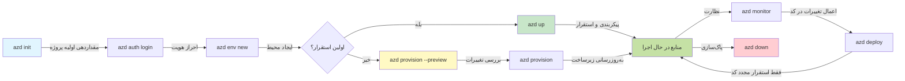
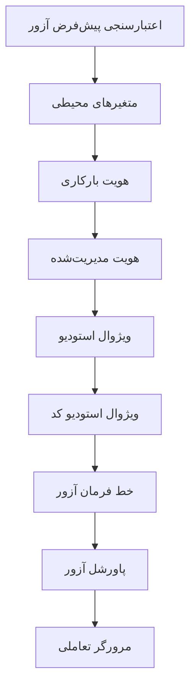

# AZD Basics - آشنایی با Azure Developer CLI

# AZD Basics - مفاهیم و اصول اصلی

**ناوبری فصل:**
- **📚 خانهٔ دوره**: [AZD برای مبتدیان](../../README.md)
- **📖 فصل کنونی**: فصل ۱ - بنیاد و شروع سریع
- **⬅️ قبلی**: [نمای کلی دوره](../../README.md#-chapter-1-foundation--quick-start)
- **➡️ بعدی**: [نصب و راه‌اندازی](installation.md)
- **🚀 فصل بعدی**: [فصل ۲: توسعهٔ مبتنی بر هوش مصنوعی](../chapter-02-ai-development/microsoft-foundry-integration.md)

## مقدمه

این درس شما را با Azure Developer CLI (azd) آشنا می‌کند، یک ابزار قدرتمند خط فرمان که مسیر شما را از توسعهٔ محلی تا استقرار در Azure تسریع می‌بخشد. شما با مفاهیم بنیادی، ویژگی‌های اصلی آشنا خواهید شد و درک می‌کنید که چگونه azd استقرار برنامه‌های بومی ابر را ساده می‌کند.

## اهداف یادگیری

تا پایان این درس، شما خواهید:
- درک کنید Azure Developer CLI چیست و هدف اصلی آن چیست
- مفاهیم اصلی قالب‌ها، محیط‌ها و سرویس‌ها را بیاموزید
- قابلیت‌های کلیدی از جمله توسعهٔ مبتنی بر قالب و زیرساخت به عنوان کد را کاوش کنید
- ساختار پروژه azd و جریان کاری را درک کنید
- برای نصب و پیکربندی azd برای محیط توسعهٔ خود آماده باشید

## نتایج یادگیری

پس از تکمیل این درس، شما قادر خواهید بود:
- نقش azd در جریان‌های کاری توسعهٔ ابری مدرن را توضیح دهید
- اجزای ساختار پروژهٔ azd را شناسایی کنید
- توضیح دهید چگونه قالب‌ها، محیط‌ها و سرویس‌ها با هم کار می‌کنند
- فواید زیرساخت به عنوان کد با azd را درک کنید
- دستورات مختلف azd و اهدافشان را بشناسید

## Azure Developer CLI (azd) چیست؟

Azure Developer CLI (azd) یک ابزار خط فرمان است که برای تسریع مسیر شما از توسعهٔ محلی تا استقرار در Azure طراحی شده است. این ابزار فرایند ساخت، استقرار و مدیریت برنامه‌های بومی ابر روی Azure را ساده می‌کند.

### 🎯 چرا از AZD استفاده کنیم؟ یک مقایسهٔ دنیای واقعی

بیایید استقرار یک برنامهٔ وب ساده با پایگاه داده را مقایسه کنیم:

#### ❌ بدون AZD: استقرار دستی در Azure (30+ minutes)

```bash
# گام 1: ایجاد گروه منابع
az group create --name myapp-rg --location eastus

# گام 2: ایجاد پلن App Service
az appservice plan create --name myapp-plan \
  --resource-group myapp-rg \
  --sku B1 --is-linux

# گام 3: ایجاد برنامه وب
az webapp create --name myapp-web-unique123 \
  --resource-group myapp-rg \
  --plan myapp-plan \
  --runtime "NODE:18-lts"

# گام 4: ایجاد حساب Cosmos DB (10-15 دقیقه)
az cosmosdb create --name myapp-cosmos-unique123 \
  --resource-group myapp-rg \
  --kind MongoDB

# گام 5: ایجاد پایگاه داده
az cosmosdb mongodb database create \
  --account-name myapp-cosmos-unique123 \
  --resource-group myapp-rg \
  --name tododb

# گام 6: ایجاد مجموعه
az cosmosdb mongodb collection create \
  --account-name myapp-cosmos-unique123 \
  --resource-group myapp-rg \
  --database-name tododb \
  --name todos

# گام 7: دریافت رشته اتصال
CONN_STR=$(az cosmosdb keys list \
  --name myapp-cosmos-unique123 \
  --resource-group myapp-rg \
  --type connection-strings \
  --query "connectionStrings[0].connectionString" -o tsv)

# گام 8: پیکربندی تنظیمات برنامه
az webapp config appsettings set \
  --name myapp-web-unique123 \
  --resource-group myapp-rg \
  --settings MONGODB_URI="$CONN_STR"

# گام 9: فعال‌سازی لاگ‌گیری
az webapp log config --name myapp-web-unique123 \
  --resource-group myapp-rg \
  --application-logging filesystem \
  --detailed-error-messages true

# گام 10: راه‌اندازی Application Insights
az monitor app-insights component create \
  --app myapp-insights \
  --location eastus \
  --resource-group myapp-rg

# گام 11: اتصال App Insights به برنامه وب
INSTRUMENTATION_KEY=$(az monitor app-insights component show \
  --app myapp-insights \
  --resource-group myapp-rg \
  --query "instrumentationKey" -o tsv)

az webapp config appsettings set \
  --name myapp-web-unique123 \
  --resource-group myapp-rg \
  --settings APPINSIGHTS_INSTRUMENTATIONKEY="$INSTRUMENTATION_KEY"

# گام 12: ساخت برنامه به‌صورت محلی
npm install
npm run build

# گام 13: ایجاد بسته استقرار
zip -r app.zip . -x "*.git*" "node_modules/*"

# گام 14: استقرار برنامه
az webapp deployment source config-zip \
  --resource-group myapp-rg \
  --name myapp-web-unique123 \
  --src app.zip

# گام 15: صبر کنید و دعا کنید که درست کار کند 🙏
# (هیچ اعتبارسنجی خودکار انجام نمی‌شود، تست دستی لازم است)
```

**مشکلات:**
- ❌ 15+ فرمان برای به‌خاطر سپردن و اجرا به ترتیب
- ❌ 30-45 دقیقه کار دستی
- ❌ آسان بودن خطا (اشتباهات تایپی، پارامترهای نادرست)
- ❌ رشته‌های اتصال در تاریخچهٔ ترمینال آشکار می‌شوند
- ❌ بازگردانی خودکار در صورت بروز خطا وجود ندارد
- ❌ تکرارپذیری برای اعضای تیم دشوار است
- ❌ هر بار متفاوت است (تکرارپذیر نیست)

#### ✅ با AZD: استقرار خودکار (5 commands, 10-15 minutes)

```bash
# مرحله ۱: مقداردهی اولیه از الگو
azd init --template todo-nodejs-mongo

# مرحله ۲: احراز هویت
azd auth login

# مرحله ۳: ایجاد محیط
azd env new dev

# مرحله ۴: پیش‌نمایش تغییرات (اختیاری اما توصیه‌شده)
azd provision --preview

# مرحله ۵: استقرار همه چیز
azd up

# ✨ انجام شد! همه چیز مستقر، پیکربندی و پایش شده است
```

**مزایا:**
- ✅ **5 commands** در مقایسه با 15+ مرحلهٔ دستی
- ✅ **10-15 minutes** زمان کل (عمدتاً انتظار برای Azure)
- ✅ **Zero errors** - خودکار و تست‌شده
- ✅ **Secrets managed securely** via Key Vault
- ✅ **Automatic rollback** on failures
- ✅ **Fully reproducible** - همان نتیجه هر بار
- ✅ **Team-ready** - هر کسی می‌تواند با همان دستورات استقرار دهد
- ✅ **Infrastructure as Code** - قالب‌های Bicep تحت کنترل نسخه
- ✅ **Built-in monitoring** - Application Insights به‌صورت خودکار پیکربندی می‌شود

### 📊 کاهش زمان و خطا

| معیار | استقرار دستی | استقرار با AZD | بهبود |
|:-------|:------------------|:---------------|:------------|
| **فرمان‌ها** | 15+ | 5 | 67% کمتر |
| **زمان** | 30-45 min | 10-15 min | 60% سریع‌تر |
| **نرخ خطا** | ~40% | <5% | 88% کاهش |
| **ثبات** | کم (دستی) | 100% (خودکار) | کامل |
| **آموزش تیم** | 2-4 hours | 30 minutes | 75% سریع‌تر |
| **زمان بازگردانی** | 30+ min (manual) | 2 min (automated) | 93% سریع‌تر |

## مفاهیم اصلی

### قالب‌ها
قالب‌ها پایهٔ azd هستند. آن‌ها شامل می‌شوند:
- **کد برنامه** - کد منبع و وابستگی‌های شما
- **تعاریف زیرساخت** - منابع Azure تعریف‌شده در Bicep یا Terraform
- **فایل‌های پیکربندی** - تنظیمات و متغیرهای محیطی
- **اسکریپت‌های استقرار** - جریان‌های کاری استقرار خودکار

### محیط‌ها
محیط‌ها نمایندهٔ اهداف مختلف استقرار هستند:
- **Development** - برای تست و توسعه
- **Staging** - محیط پیش‌تولید
- **Production** - محیط تولید زنده

هر محیط موارد زیر را به‌طور جداگانه نگهداری می‌کند:
- گروه منابع Azure
- تنظیمات پیکربندی
- وضعیت استقرار

### سرویس‌ها
سرویس‌ها بلوک‌های سازندهٔ برنامهٔ شما هستند:
- **Frontend** - برنامه‌های وب، تک‌صفحه‌ای (SPA)
- **Backend** - APIها، میکروسرویس‌ها
- **Database** - راهکارهای ذخیره‌سازی داده
- **Storage** - ذخیره‌سازی فایل و Blob

## قابلیت‌های کلیدی

### 1. توسعهٔ مبتنی بر قالب
```bash
# قالب‌های موجود را مرور کنید
azd template list

# از یک قالب مقداردهی اولیه کنید
azd init --template <template-name>
```

### 2. زیرساخت به عنوان کد
- **Bicep** - زبان مخصوص حوزهٔ Azure
- **Terraform** - ابزار زیرساخت چندابری
- **ARM Templates** - قالب‌های Azure Resource Manager

### 3. جریان‌های کاری یکپارچه
```bash
# روند کامل استقرار
azd up            # تأمین و استقرار؛ برای راه‌اندازی اولیه به‌صورت خودکار

# 🧪 جدید: پیش‌نمایش تغییرات زیرساخت قبل از استقرار (ایمن)
azd provision --preview    # شبیه‌سازی استقرار زیرساخت بدون ایجاد تغییرات

azd provision     # منابع Azure را ایجاد کنید؛ در صورت به‌روزرسانی زیرساخت از این استفاده کنید
azd deploy        # کد برنامه را مستقر کنید یا پس از به‌روزرسانی مجدداً مستقر کنید
azd down          # پاک‌سازی منابع
```

#### 🛡️ برنامه‌ریزی امن زیرساخت با پیش‌نمایش
فرمان `azd provision --preview` یک قابلیت تحول‌آفرین برای استقرارهای امن است:
- **تحلیل اجرای آزمایشی (Dry-run)** - نشان می‌دهد چه چیزی ایجاد، تغییر یا حذف خواهد شد
- **بدون ریسک** - هیچ تغییر واقعی در محیط Azure شما اعمال نمی‌شود
- **همکاری تیمی** - اشتراک‌گذاری نتایج پیش‌نمایش قبل از استقرار
- **برآورد هزینه** - هزینه‌های منابع را قبل از تعهد درک کنید

```bash
# نمونه‌ای از گردش‌کار پیش‌نمایش
azd provision --preview           # ببینید چه چیزی تغییر خواهد کرد
# خروجی را بررسی کنید، با تیم بحث کنید
azd provision                     # با اطمینان تغییرات را اعمال کنید
```

### 📊 نمودار: جریان توسعهٔ AZD


**توضیح جریان کاری:**
1. **Init** - شروع با قالب یا پروژهٔ جدید
2. **Auth** - احراز هویت با Azure
3. **Environment** - ایجاد یک محیط استقرار جداشده
4. **Preview** - 🆕 همیشه ابتدا تغییرات زیرساخت را پیش‌نمایش کنید (رویۀ ایمن)
5. **Provision** - ایجاد/به‌روزرسانی منابع Azure
6. **Deploy** - ارسال کد برنامهٔ خود
7. **Monitor** - مشاهدهٔ عملکرد برنامه
8. **Iterate** - ایجاد تغییرات و دوباره استقرار کد
9. **Cleanup** - حذف منابع پس از اتمام

### 4. مدیریت محیط‌ها
```bash
# ایجاد و مدیریت محیط‌ها
azd env new <environment-name>
azd env select <environment-name>
azd env list
```

## 📁 ساختار پروژه

یک ساختار معمولی پروژه azd:
```
my-app/
├── .azd/                    # azd configuration
│   └── config.json
├── .azure/                  # Azure deployment artifacts
├── .devcontainer/          # Development container config
├── .github/workflows/      # GitHub Actions
├── .vscode/               # VS Code settings
├── infra/                 # Infrastructure code
│   ├── main.bicep        # Main infrastructure template
│   ├── main.parameters.json
│   └── modules/          # Reusable modules
├── src/                  # Application source code
│   ├── api/             # Backend services
│   └── web/             # Frontend application
├── azure.yaml           # azd project configuration
└── README.md
```

## 🔧 فایل‌های پیکربندی

### azure.yaml
فایل پیکربندی اصلی پروژه:
```yaml
name: my-awesome-app
metadata:
  template: my-template@1.0.0

services:
  web:
    project: ./src/web
    language: js
    host: appservice
  api:
    project: ./src/api
    language: js
    host: appservice

hooks:
  preprovision:
    shell: pwsh
    run: echo "Preparing to provision..."
```

### .azure/config.json
پیکربندی مخصوص محیط:
```json
{
  "version": 1,
  "defaultEnvironment": "dev",
  "environments": {
    "dev": {
      "subscriptionId": "your-subscription-id",
      "location": "eastus"
    }
  }
}
```

## 🎪 جریان‌های کاری رایج همراه با تمرین‌های عملی

> **💡 نکتهٔ یادگیری:** این تمرین‌ها را به ترتیب دنبال کنید تا مهارت‌های AZD خود را به‌تدریج بسازید.

### 🎯 تمرین 1: راه‌اندازی اولین پروژهٔ شما

**هدف:** ایجاد یک پروژهٔ AZD و بررسی ساختار آن

**مراحل:**
```bash
# از یک قالب اثبات‌شده استفاده کنید
azd init --template todo-nodejs-mongo

# فایل‌های تولید‌شده را بررسی کنید
ls -la  # همهٔ فایل‌ها از جمله فایل‌های مخفی را ببینید

# فایل‌های کلیدی ایجاد شده:
# - azure.yaml (پیکربندی اصلی)
# - infra/ (کد زیرساخت)
# - src/ (کد برنامه)
```

**✅ موفقیت:** شما دارای پوشه‌های azure.yaml، infra/ و src/ هستید

---

### 🎯 تمرین 2: استقرار در Azure

**هدف:** تکمیل استقرار از ابتدا تا انتها

**مراحل:**
```bash
# 1. احراز هویت
az login && azd auth login

# 2. ایجاد محیط
azd env new dev
azd env set AZURE_LOCATION eastus

# 3. پیش‌نمایش تغییرات (توصیه‌شده)
azd provision --preview

# 4. استقرار همه چیز
azd up

# 5. تأیید استقرار
azd show    # URL برنامه خود را مشاهده کنید
```

**زمان مورد انتظار:** 10-15 minutes  
**✅ موفقیت:** URL برنامه در مرورگر باز می‌شود

---

### 🎯 تمرین 3: چندین محیط

**هدف:** استقرار در dev و staging

**مراحل:**
```bash
# قبلاً dev را داریم، staging را ایجاد کنید
azd env new staging
azd env set AZURE_LOCATION westus2
azd up

# بین آن‌ها جابه‌جا شوید
azd env list
azd env select dev
```

**✅ موفقیت:** دو گروه منابع جداگانه در Azure Portal

---

### 🛡️ شروع تازه: `azd down --force --purge`

وقتی نیاز به بازنشانی کامل دارید:

```bash
azd down --force --purge
```

**چه‌کاری انجام می‌دهد:**
- `--force`: بدون پرسش‌های تأیید
- `--purge`: حذف تمام حالت محلی و منابع Azure

**زمان استفاده:**
- استقرار در نیمه‌راه شکست خورده
- تغییر پروژه‌ها
- نیاز به شروع تازه

---

## 🎪 مرجع جریان کاری اصلی

### شروع یک پروژهٔ جدید
```bash
# روش ۱: استفاده از قالب موجود
azd init --template todo-nodejs-mongo

# روش ۲: شروع از ابتدا
azd init

# روش ۳: استفاده از پوشه فعلی
azd init .
```

### چرخهٔ توسعه
```bash
# راه‌اندازی محیط توسعه
azd auth login
azd env new dev
azd env select dev

# همه چیز را مستقر کنید
azd up

# تغییرات را اعمال کرده و دوباره مستقر کنید
azd deploy

# پس از اتمام، پاک‌سازی را انجام دهید
azd down --force --purge # دستور در Azure Developer CLI یک **بازنشانی سخت** برای محیط شما است—به‌ویژه وقتی در حال عیب‌یابی استقرارهای ناموفق، پاک‌سازی منابع یتیم یا آماده‌سازی برای یک استقرار تازه هستید، مفید است
```

## درک `azd down --force --purge`
فرمان `azd down --force --purge` راهی قدرتمند برای تخریب کامل محیط azd و همهٔ منابع مرتبط است. در اینجا تفکیکی از کاری که هر فلگ انجام می‌دهد آمده است:
```
--force
```
- پیام‌های تأیید را رد می‌کند.
- مفید برای اتوماسیون یا اسکریپت‌نویسی جایی که ورودی دستی ممکن نیست.
- اطمینان می‌دهد که فرایند نابودی بدون وقفه ادامه یابد، حتی اگر CLI ناسازگاری‌هایی تشخیص دهد.

```
--purge
```
حذف می‌کند **تمام فراداده‌های مرتبط**، از جمله:
وضعیت محیط
پوشهٔ محلی `.azure`
اطلاعات کش‌شدهٔ استقرار
جلوگیری می‌کند از اینکه azd "به خاطر بسپارد" استقرارهای قبلی، که می‌تواند مشکلاتی مانند ناهماهنگی گروه‌های منابع یا ارجاعات قدیمی به رجیستری را به وجود بیاورد.


### چرا از هر دو استفاده کنیم؟
وقتی به‌خاطر وضعیت باقی‌مانده یا استقرارهای جزئی با `azd up` به بن‌بست خورده‌اید، این ترکیب اطمینان می‌دهد که **یک شروع تازه** خواهید داشت.

این به‌ویژه پس از حذف منابع به‌صورت دستی در پرتال Azure یا هنگام تغییر قالب‌ها، محیط‌ها، یا قراردادهای نام‌گذاری گروه منابع مفید است.


### مدیریت چندین محیط
```bash
# ایجاد محیط آزمایشی
azd env new staging
azd env select staging
azd up

# بازگشت به محیط توسعه
azd env select dev

# مقایسه محیط‌ها
azd env list
```

## 🔐 احراز هویت و گواهی‌نامه‌ها

درک احراز هویت برای استقرارهای موفق azd حیاتی است. Azure از روش‌های متعدد احراز هویت استفاده می‌کند و azd از همان زنجیرهٔ گواهی‌نامه‌ای استفاده می‌کند که ابزارهای دیگر Azure به کار می‌گیرند.

### احراز هویت Azure CLI (`az login`)

قبل از استفاده از azd، باید با Azure احراز هویت کنید. رایج‌ترین روش استفاده از Azure CLI است:

```bash
# ورود تعاملی (مرورگر را باز می‌کند)
az login

# ورود با تِنانت مشخص
az login --tenant <tenant-id>

# ورود با حساب سرویس
az login --service-principal -u <app-id> -p <password> --tenant <tenant-id>

# بررسی وضعیت ورود فعلی
az account show

# نمایش اشتراک‌های موجود
az account list --output table

# تنظیم اشتراک پیش‌فرض
az account set --subscription <subscription-id>
```

### جریان احراز هویت
1. **Interactive Login**: مرورگر پیش‌فرض شما را برای احراز هویت باز می‌کند
2. **Device Code Flow**: برای محیط‌هایی بدون دسترسی به مرورگر
3. **Service Principal**: برای اتوماسیون و سناریوهای CI/CD
4. **Managed Identity**: برای برنامه‌های میزبانی‌شده در Azure

### زنجیرهٔ DefaultAzureCredential

`DefaultAzureCredential` یک نوع گواهی‌نامه است که تجربهٔ احراز هویت ساده‌شده‌ای را با تلاش خودکار منابع گواهی‌نامهٔ متعدد به ترتیب مشخص فراهم می‌کند:

#### ترتیب زنجیرهٔ گواهی‌نامه

#### 1. متغیرهای محیطی
```bash
# تنظیم متغیرهای محیطی برای هویت سرویس
export AZURE_CLIENT_ID="<app-id>"
export AZURE_CLIENT_SECRET="<password>"
export AZURE_TENANT_ID="<tenant-id>"
```

#### 2. Workload Identity (Kubernetes/GitHub Actions)
به‌طور خودکار در موارد زیر استفاده می‌شود:
- Azure Kubernetes Service (AKS) با Workload Identity
- GitHub Actions با فدراسیون OIDC
- سایر سناریوهای هویت فدره‌شده

#### 3. هویت مدیریت‌شده
برای منابع Azure مانند:
- ماشین‌های مجازی
- App Service
- Azure Functions
- Container Instances

```bash
# بررسی می‌کند که آیا در یک منبع Azure با هویت مدیریت‌شده در حال اجرا است
az account show --query "user.type" --output tsv
# در صورت استفاده از هویت مدیریت‌شده مقدار "servicePrincipal" را برمی‌گرداند
```

#### 4. یکپارچگی ابزارهای توسعه‌دهنده
- **Visual Studio**: به‌طور خودکار از حساب وارد شده استفاده می‌کند
- **VS Code**: از گواهی‌نامه‌های افزونهٔ Azure Account استفاده می‌کند
- **Azure CLI**: از گواهی‌نامه‌های `az login` استفاده می‌کند (متداول‌ترین برای توسعهٔ محلی)

### تنظیم احراز هویت AZD

```bash
# روش ۱: استفاده از Azure CLI (توصیه‌شده برای توسعه)
az login
azd auth login  # از اعتبارنامه‌های موجود Azure CLI استفاده می‌کند

# روش ۲: احراز هویت مستقیم azd
azd auth login --use-device-code  # برای محیط‌های بدون رابط کاربری گرافیکی

# روش ۳: بررسی وضعیت احراز هویت
azd auth login --check-status

# روش ۴: خروج و احراز هویت مجدد
azd auth logout
azd auth login
```

### بهترین شیوه‌های احراز هویت

#### برای توسعهٔ محلی
```bash
# 1. ورود با Azure CLI
az login

# 2. تأیید اشتراک صحیح
az account show
az account set --subscription "Your Subscription Name"

# 3. استفاده از azd با اعتبارنامه‌های موجود
azd auth login
```

#### برای خطوط لولهٔ CI/CD
```yaml
# GitHub Actions example
- name: Azure Login
  uses: azure/login@v1
  with:
    creds: ${{ secrets.AZURE_CREDENTIALS }}

- name: Deploy with azd
  run: |
    azd auth login --client-id ${{ secrets.AZURE_CLIENT_ID }} \
                    --client-secret ${{ secrets.AZURE_CLIENT_SECRET }} \
                    --tenant-id ${{ secrets.AZURE_TENANT_ID }}
    azd up --no-prompt
```

#### برای محیط‌های تولید
- از **Managed Identity** هنگام اجرای روی منابع Azure استفاده کنید
- از **Service Principal** برای سناریوهای اتوماسیون استفاده کنید
- از ذخیرهٔ گواهی‌نامه‌ها در کد یا فایل‌های پیکربندی خودداری کنید
- برای پیکربندی حساس از **Azure Key Vault** استفاده کنید

### مسائل معمول احراز هویت و راه‌حل‌ها

#### Issue: "No subscription found"
```bash
# راه‌حل: اشتراک پیش‌فرض را تنظیم کنید
az account list --output table
az account set --subscription "<subscription-id>"
azd env set AZURE_SUBSCRIPTION_ID "<subscription-id>"
```

#### Issue: "Insufficient permissions"
```bash
# راه‌حل: نقش‌های مورد نیاز را بررسی و اختصاص دهید
az role assignment list --assignee $(az account show --query user.name --output tsv)

# نقش‌های مورد نیاز رایج:
# - Contributor (برای مدیریت منابع)
# - User Access Administrator (برای اختصاص نقش‌ها)
```

#### Issue: "Token expired"
```bash
# راه‌حل: احراز هویت مجدد
az logout
az login
azd auth logout
azd auth login
```

### احراز هویت در سناریوهای مختلف

#### توسعهٔ محلی
```bash
# حساب توسعه فردی
az login
azd auth login
```

#### توسعهٔ تیمی
```bash
# برای سازمان از یک مستأجر مشخص استفاده کنید
az login --tenant contoso.onmicrosoft.com
azd auth login
```

#### سناریوهای چندمستأجره
```bash
# تغییر بین مستأجران
az login --tenant tenant1.onmicrosoft.com
# استقرار در مستأجر 1
azd up

az login --tenant tenant2.onmicrosoft.com  
# استقرار در مستأجر 2
azd up
```

### ملاحظات امنیتی

1. **ذخیرهٔ گواهی‌نامه**: هرگز گواهی‌نامه‌ها را در کد منبع ذخیره نکنید
2. **محدودسازی دامنه**: برای Service Principalها اصل حداقل امتیاز را اعمال کنید
3. **چرخش توکن**: به‌طور منظم رازهای Service Principal را بچرخانید
4. **ردیابی حسابرسی**: فعالیت‌های احراز هویت و استقرار را پایش کنید
5. **امنیت شبکه**: در صورت امکان از نقاط انتهایی خصوصی استفاده کنید

### عیب‌یابی احراز هویت

```bash
# عیب‌یابی مشکلات احراز هویت
azd auth login --check-status
az account show
az account get-access-token

# دستورات تشخیصی رایج
whoami                          # زمینه کاربر فعلی
az ad signed-in-user show      # جزئیات کاربر Azure AD
az group list                  # تست دسترسی به منبع
```

## درک `azd down --force --purge`

### کشف
```bash
azd template list              # مرور قالب‌ها
azd template show <template>   # جزئیات قالب
azd init --help               # گزینه‌های مقداردهی اولیه
```

### مدیریت پروژه
```bash
azd show                     # نمای کلی پروژه
azd env show                 # محیط فعلی
azd config list             # تنظیمات پیکربندی
```

### پایش
```bash
azd monitor                  # باز کردن مانیتورینگ پورتال Azure
azd monitor --logs           # مشاهده لاگ‌های برنامه
azd monitor --live           # مشاهده متریک‌های زنده
azd pipeline config          # راه‌اندازی CI/CD
```

## بهترین شیوه‌ها

### 1. از نام‌های معنی‌دار استفاده کنید
```bash
# خوب
azd env new production-east
azd init --template web-app-secure

# اجتناب کنید
azd env new env1
azd init --template template1
```

### 2. از قالب‌ها بهره ببرید
- با قالب‌های موجود شروع کنید
- برای نیازهای خود سفارشی‌سازی کنید
- قالب‌های قابل استفادهٔ مجدد برای سازمان خود ایجاد کنید

### 3. جداسازی محیط
- از محیط‌های جدا برای dev/staging/prod استفاده کنید
- هرگز مستقیماً از ماشین محلی به تولید استقرار ندهید
- برای استقرارهای تولید از خطوط لولهٔ CI/CD استفاده کنید

### 4. مدیریت پیکربندی
- از متغیرهای محیطی برای داده‌های حساس استفاده کنید
- پیکربندی را در کنترل نسخه نگه دارید
- تنظیمات مخصوص هر محیط را مستندسازی کنید

## پیشرفت یادگیری

### مبتدی (هفتهٔ 1-2)
1. نصب azd و احراز هویت
2. استقرار یک قالب ساده
3. درک ساختار پروژه
4. یادگیری دستورات پایه (up, down, deploy)

### متوسط (هفتهٔ 3-4)
1. سفارشی‌سازی قالب‌ها
2. مدیریت چندین محیط
3. درک کد زیرساخت
4. راه‌اندازی خطوط لولهٔ CI/CD

### پیشرفته (هفتهٔ 5+)
1. ایجاد قالب‌های سفارشی
2. الگوهای پیشرفتهٔ زیرساخت
3. استقرار در چند منطقه
4. پیکربندی‌های سطح سازمانی

## گام‌های بعدی

**📖 ادامهٔ یادگیری فصل ۱:**
- [نصب و راه‌اندازی](installation.md) - نصب و پیکربندی azd
- [اولین پروژهٔ شما](first-project.md) - آموزش عملی کامل
- [راهنمای پیکربندی](configuration.md) - گزینه‌های پیشرفته پیکربندی

**🎯 برای فصل بعد آماده‌اید؟**
- [فصل ۲: توسعهٔ مبتنی بر هوش مصنوعی](../chapter-02-ai-development/microsoft-foundry-integration.md) - شروع به ساخت برنامه‌های هوش مصنوعی کنید

## منابع اضافی

- [مروری بر Azure Developer CLI](https://learn.microsoft.com/en-us/azure/developer/azure-developer-cli/)
- [گالری قالب‌ها](https://azure.github.io/awesome-azd/)
- [نمونه‌های جامعه](https://github.com/Azure-Samples)

---

## 🙋 سوالات متداول

### سؤالات عمومی

**Q: تفاوت AZD و Azure CLI چیست؟**

A: Azure CLI (`az`) برای مدیریت منابع مستقل Azure است. AZD (`azd`) برای مدیریت کل برنامه‌ها است:

```bash
# Azure CLI - مدیریت منابع در سطح پایین
az webapp create --name myapp --resource-group rg
az sql server create --name myserver --resource-group rg
# ...به دستورات بیشتری نیاز است

# AZD - مدیریت در سطح برنامه
azd up  # تمام برنامه را همراه با همه منابع مستقر می‌کند
```

**به این صورت فکر کنید:**
- `az` = کار با قطعات جداگانه لگو
- `azd` = کار با مجموعه‌های کامل لگو

---

**Q: آیا برای استفاده از AZD نیاز به دانستن Bicep یا Terraform دارم؟**

A: No! Start with templates:
```bash
# از قالب موجود استفاده کنید - نیازی به دانش IaC نیست
azd init --template todo-nodejs-mongo
azd up
```

می‌توانید بعداً Bicep را برای سفارشی‌سازی زیرساخت یاد بگیرید. قالب‌ها مثال‌های کاری ارائه می‌دهند که می‌توانید از آن‌ها بیاموزید.

---

**Q: هزینه اجرای قالب‌های AZD چقدر است؟**

A: هزینه‌ها بسته به قالب متفاوت است. اکثر قالب‌های توسعه بین $50 تا $150 در ماه هزینه دارند:

```bash
# پیش‌نمایش هزینه‌ها قبل از استقرار
azd provision --preview

# همیشه زمانی که استفاده نمی‌کنید پاکسازی کنید
azd down --force --purge  # تمام منابع را حذف می‌کند
```

**نکتهٔ حرفه‌ای:** از لایه‌های رایگان در صورت موجود بودن استفاده کنید:
- App Service: سطح F1 (رایگان)
- Azure OpenAI: ماهانه 50,000 توکن رایگان
- Cosmos DB: سطح رایگان 1000 RU/s

---

**Q: آیا می‌توانم از AZD با منابع موجود Azure استفاده کنم؟**

A: بله، اما شروع از ابتدا آسان‌تر است. AZD وقتی که چرخهٔ کامل را مدیریت کند بهترین عملکرد را دارد. برای منابع موجود:

```bash
# گزینه ۱: وارد کردن منابع موجود (پیشرفته)
azd init
# سپس infra/ را تغییر دهید تا به منابع موجود ارجاع دهد

# گزینه ۲: شروع از نو (توصیه‌شده)
azd init --template matching-your-stack
azd up  # یک محیط جدید ایجاد می‌کند
```

---

**Q: چگونه پروژه‌ام را با هم‌تیمی‌ها به اشتراک بگذارم؟**

A: پروژهٔ AZD را در Git commit کنید (اما پوشهٔ .azure را نه):

```bash
# قبلاً به‌صورت پیش‌فرض در .gitignore قرار دارد
.azure/        # حاوی اسرار و داده‌های محیطی
*.env          # متغیرهای محیطی

# اعضای تیم در آن زمان:
git clone <your-repo>
azd auth login
azd env new <their-name>-dev
azd up
```

همه از همان قالب‌ها زیرساخت یکسانی دریافت می‌کنند.

---

### سؤالات رفع اشکال

**Q: "azd up" در نیمه‌راه متوقف شد. چه کار کنم؟**

A: خطا را بررسی کنید، آن را برطرف کنید، سپس مجدداً تلاش کنید:

```bash
# مشاهده لاگ‌های دقیق
azd show

# راه‌حل‌های رایج:

# 1. در صورت اتمام سهمیه:
azd env set AZURE_LOCATION "westus2"  # منطقه دیگری را امتحان کنید

# 2. در صورت تعارض نام منبع:
azd down --force --purge  # پاکسازی کامل
azd up  # تلاش مجدد

# 3. در صورت انقضای احراز هویت:
az login
azd auth login
azd up
```

**رایج‌ترین مشکل:** انتخاب اشتباه اشتراک Azure
```bash
az account list --output table
az account set --subscription "<correct-subscription>"
```

---

**Q: چگونه تنها تغییرات کد را بدون دوباره‌پیکربندی مستقر کنم؟**

A: به‌جای `azd up` از `azd deploy` استفاده کنید:

```bash
azd up          # اولین بار: تهیه و استقرار (کند)

# کد را تغییر دهید...

azd deploy      # بارهای بعد: فقط استقرار (سریع)
```

مقایسه سرعت:
- `azd up`: 10-15 دقیقه (پیکربندی زیرساخت)
- `azd deploy`: 2-5 دقیقه (فقط کد)

---

**Q: آیا می‌توانم قالب‌های زیرساخت را سفارشی کنم؟**

A: بله! فایل‌های Bicep را در `infra/` ویرایش کنید:

```bash
# پس از اجرای azd init
cd infra/
code main.bicep  # ویرایش در VS Code

# پیش‌نمایش تغییرات
azd provision --preview

# اعمال تغییرات
azd provision
```

**نکته:** ابتدا از کوچک شروع کنید - ابتدا SKUs را تغییر دهید:
```bicep
// infra/main.bicep
sku: {
  name: 'B1'  // Change to 'P1V2' for production
}
```

---

**Q: چگونه همه چیزهایی که AZD ایجاد کرده را حذف کنم؟**

A: یک دستور همهٔ منابع را حذف می‌کند:

```bash
azd down --force --purge

# این موارد را حذف می‌کند:
# - تمام منابع Azure
# - گروه منابع
# - وضعیت محیط محلی
# - داده‌های استقرار کش‌شده
```

**همیشه این را اجرا کنید وقتی:**
- تست یک قالب تمام شده است
- به پروژه‌ای دیگر منتقل می‌شوید
- می‌خواهید از نو شروع کنید

**صرفه‌جویی در هزینه:** حذف منابع استفاده‌نشده = هزینه $0

---

**Q: اگر به‌طور تصادفی منابع را در Azure Portal حذف کردم چه کار کنم؟**

A: وضعیت AZD ممکن است از هماهنگی خارج شود. رویکرد شروع از نو:

```bash
# 1. وضعیت محلی را حذف کنید
azd down --force --purge

# 2. از نو شروع کنید
azd up

# جایگزین: بگذارید AZD تشخیص دهد و اصلاح کند
azd provision  # منابع گمشده را ایجاد خواهد کرد
```

---

### سؤالات پیشرفته

**Q: آیا می‌توانم از AZD در خطوط CI/CD استفاده کنم؟**

A: بله! نمونه‌ای از GitHub Actions:

```yaml
# .github/workflows/deploy.yml
name: Deploy with AZD

on:
  push:
    branches: [main]

jobs:
  deploy:
    runs-on: ubuntu-latest
    steps:
      - uses: actions/checkout@v2
      
      - name: Install azd
        run: curl -fsSL https://aka.ms/install-azd.sh | bash
      
      - name: Azure Login
        run: |
          azd auth login \
            --client-id ${{ secrets.AZURE_CLIENT_ID }} \
            --client-secret ${{ secrets.AZURE_CLIENT_SECRET }} \
            --tenant-id ${{ secrets.AZURE_TENANT_ID }}
      
      - name: Deploy
        run: azd up --no-prompt
```

---

**Q: چگونه با اسرار و داده‌های حساس برخورد کنم؟**

A: AZD به‌طور خودکار با Azure Key Vault یکپارچه می‌شود:

```bash
# مقادیر محرمانه در Key Vault ذخیره می‌شوند، نه در کد
azd env set DATABASE_PASSWORD "$(openssl rand -base64 32)"

# AZD به‌طور خودکار:
# 1. Key Vault را ایجاد می‌کند
# 2. مقدار محرمانه را ذخیره می‌کند
# 3. دسترسی برنامه را از طریق هویت مدیریت‌شده اعطا می‌کند
# 4. در زمان اجرا تزریق می‌کند
```

**هرگز commit نکنید:**
- پوشهٔ `.azure/` (حاوی داده‌های محیط)
- فایل‌های `.env` (اسرار محلی)
- رشته‌های اتصال

---

**Q: آیا می‌توانم در چند منطقه مستقر شوم؟**

A: بله، برای هر منطقه یک محیط ایجاد کنید:

```bash
# محیط شرق ایالات متحده
azd env new prod-eastus
azd env set AZURE_LOCATION eastus
azd up

# محیط غرب اروپا
azd env new prod-westeurope
azd env set AZURE_LOCATION westeurope
azd up

# هر محیط مستقل است
azd env list
```

برای برنامه‌های واقعاً چندمنطقه‌ای، قالب‌های Bicep را سفارشی کنید تا به‌صورت هم‌زمان در چند منطقه مستقر شوند.

---

**Q: اگر گیر کردم از کجا می‌توانم کمک بگیرم؟**

1. **مستندات AZD:** https://learn.microsoft.com/azure/developer/azure-developer-cli/
2. **مسائل GitHub:** https://github.com/Azure/azure-dev/issues
3. **Discord:** [Discord Azure](https://discord.gg/microsoft-azure) - کانال #azure-developer-cli
4. **Stack Overflow:** برچسب `azure-developer-cli`
5. **این دوره:** [راهنمای رفع اشکال](../chapter-07-troubleshooting/common-issues.md)

**نکتهٔ حرفه‌ای:** قبل از پرسیدن، اجرا کنید:
```bash
azd show       # وضعیت فعلی را نشان می‌دهد
azd version    # نسخهٔ شما را نشان می‌دهد
```
این اطلاعات را در سؤال خود قرار دهید تا سریع‌تر کمک بگیرید.

---

## 🎓 مرحله بعدی چیست؟

حالا اصول AZD را متوجه شده‌اید. مسیر خود را انتخاب کنید:

### 🎯 برای مبتدیان:
1. **Next:** [نصب و راه‌اندازی](installation.md) - نصب AZD روی دستگاه شما
2. **سپس:** [اولین پروژهٔ شما](first-project.md) - اولین برنامهٔ خود را مستقر کنید
3. **تمرین:** همهٔ 3 تمرین این درس را کامل کنید

### 🚀 برای توسعه‌دهندگان هوش مصنوعی:
1. **پرش به:** [فصل ۲: توسعهٔ مبتنی بر هوش مصنوعی](../chapter-02-ai-development/microsoft-foundry-integration.md)
2. **استقرار:** با `azd init --template get-started-with-ai-chat` شروع کنید
3. **یاد بگیرید:** هم‌زمان با استقرار بسازید

### 🏗️ برای توسعه‌دهندگان باتجربه:
1. **مرور:** [راهنمای پیکربندی](configuration.md) - تنظیمات پیشرفته
2. **کاوش:** [زیرساخت به‌عنوان کد](../chapter-04-infrastructure/provisioning.md) - بررسی عمیق Bicep
3. **بسازید:** قالب‌های سفارشی برای پشتهٔ خود ایجاد کنید

---

**ناوبری فصل:**
- **📚 صفحهٔ دوره**: [AZD برای مبتدیان](../../README.md)
- **📖 فصل فعلی**: فصل 1 - بنیاد و شروع سریع  
- **⬅️ قبلی**: [مرور دوره](../../README.md#-chapter-1-foundation--quick-start)
- **➡️ بعدی**: [نصب و راه‌اندازی](installation.md)
- **🚀 فصل بعدی**: [فصل ۲: توسعهٔ مبتنی بر هوش مصنوعی](../chapter-02-ai-development/microsoft-foundry-integration.md)

---

<!-- CO-OP TRANSLATOR DISCLAIMER START -->
سلب مسئولیت:
این سند با استفاده از سرویس ترجمه ماشینی مبتنی بر هوش مصنوعی Co-op Translator (https://github.com/Azure/co-op-translator) ترجمه شده است. اگرچه ما در تلاش برای دقت هستیم، لطفاً توجه داشته باشید که ترجمه‌های خودکار ممکن است حاوی خطاها یا نادرستی‌هایی باشند. نسخهٔ اصلی سند به زبان اصلی آن باید به‌عنوان منبع معتبر در نظر گرفته شود. برای اطلاعات حیاتی، توصیه می‌شود از ترجمه‌های حرفه‌ای انسانی استفاده شود. ما در قبال هرگونه سوءتفاهم یا تفسیر نادرست ناشی از استفاده از این ترجمه مسئول نیستیم.
<!-- CO-OP TRANSLATOR DISCLAIMER END -->