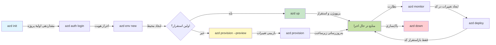
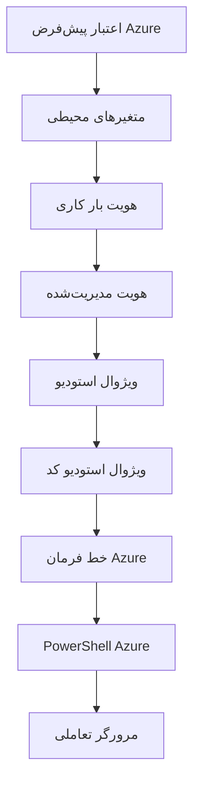

# مبانی AZD - آشنایی با Azure Developer CLI

# مبانی AZD - مفاهیم اصلی و مبانی

**فهرست فصل:**
- **📚 Course Home**: [AZD For Beginners](../../README.md)
- **📖 فصل فعلی**: Chapter 1 - Foundation & Quick Start
- **⬅️ قبلی**: [Course Overview](../../README.md#-chapter-1-foundation--quick-start)
- **➡️ بعدی**: [Installation & Setup](installation.md)
- **🚀 فصل بعدی**: [Chapter 2: AI-First Development](../chapter-02-ai-development/microsoft-foundry-integration.md)

## معرفی

این درس شما را با Azure Developer CLI (azd) آشنا می‌کند، یک ابزار خط فرمان قدرتمند که مسیر شما را از توسعه محلی تا استقرار در Azure سرعت می‌بخشد. شما با مفاهیم بنیادی، ویژگی‌های اصلی آشنا می‌شوید و درک می‌کنید چگونه azd فرآیند استقرار برنامه‌های بومی ابری را ساده می‌کند.

## اهداف یادگیری

تا پایان این درس، شما:
- درک می‌کنید Azure Developer CLI چیست و هدف اصلی آن چیست
- با مفاهیم اصلی قالب‌ها، محیط‌ها و سرویس‌ها آشنا می‌شوید
- ویژگی‌های کلیدی از جمله توسعه مبتنی بر قالب و زیرساخت به‌عنوان کد را بررسی می‌کنید
- ساختار پروژه azd و جریان کاری آن را می‌فهمید
- آماده نصب و پیکربندی azd برای محیط توسعه خود خواهید بود

## دستاوردهای یادگیری

پس از تکمیل این درس، شما قادر خواهید بود:
- نقش azd در جریان‌های کاری مدرن توسعه ابری را توضیح دهید
- اجزای ساختار پروژه azd را شناسایی کنید
- توصیف کنید چگونه قالب‌ها، محیط‌ها و سرویس‌ها با هم کار می‌کنند
- مزایای زیرساخت به‌عنوان کد با azd را درک کنید
- دستورات مختلف azd و اهداف آن‌ها را تشخیص دهید

## Azure Developer CLI (azd) چیست؟

Azure Developer CLI (azd) یک ابزار خط فرمان است که برای تسریع مسیر شما از توسعه محلی تا استقرار در Azure طراحی شده است. این ابزار فرآیند ساخت، استقرار و مدیریت برنامه‌های بومی ابری در Azure را ساده می‌کند.

### با azd چه چیزی می‌توانید مستقر کنید؟

azd از طیف گسترده‌ای از بارکاری‌ها پشتیبانی می‌کند—و این فهرست همچنان در حال رشد است. امروز می‌توانید از azd برای استقرار موارد زیر استفاده کنید:

| نوع بارکاری | نمونه‌ها | همین گردش‌کار؟ |
|---------------|----------|----------------|
| **برنامه‌های سنتی** | Web apps, REST APIs, static sites | ✅ `azd up` |
| **سرویس‌ها و میکروسرویس‌ها** | Container Apps, Function Apps, multi-service backends | ✅ `azd up` |
| **برنامه‌های مبتنی بر هوش مصنوعی** | Chat apps with Microsoft Foundry Models, RAG solutions with AI Search | ✅ `azd up` |
| **عامل‌های هوشمند** | Foundry-hosted agents, multi-agent orchestrations | ✅ `azd up` |

نکته کلیدی این است که **چرخه عمر azd بدون توجه به آنچه مستقر می‌کنید یکسان می‌ماند**. شما یک پروژه را مقداردهی اولیه می‌کنید، زیرساخت را فراهم می‌کنید، کد خود را مستقر می‌کنید، برنامه را مانیتور می‌کنید و پاک‌سازی می‌کنید—چه وب‌سایت ساده باشد چه یک عامل هوش مصنوعی پیچیده.

این تداوم به صورت طراحی شده است. azd قابلیت‌های هوش مصنوعی را به عنوان نوع دیگری از سرویس‌هایی که برنامه شما می‌تواند استفاده کند در نظر می‌گیرد، نه به عنوان چیزی اساساً متفاوت. یک نقطه پایان گفتگو که توسط Microsoft Foundry Models پشتیبانی می‌شود، از دید azd صرفاً یک سرویس دیگر برای پیکربندی و استقرار است.

### 🎯 چرا از AZD استفاده کنیم؟ یک مقایسه واقعی

بیایید استقرار یک برنامه وب ساده با پایگاه داده را مقایسه کنیم:

#### ❌ بدون AZD: استقرار دستی در Azure (بیش از 30 دقیقه)

```bash
# مرحله 1: ایجاد گروه منابع
az group create --name myapp-rg --location eastus

# مرحله 2: ایجاد App Service Plan
az appservice plan create --name myapp-plan \
  --resource-group myapp-rg \
  --sku B1 --is-linux

# مرحله 3: ایجاد Web App
az webapp create --name myapp-web-unique123 \
  --resource-group myapp-rg \
  --plan myapp-plan \
  --runtime "NODE:18-lts"

# مرحله 4: ایجاد حساب Cosmos DB (10-15 دقیقه)
az cosmosdb create --name myapp-cosmos-unique123 \
  --resource-group myapp-rg \
  --kind MongoDB

# مرحله 5: ایجاد پایگاه داده
az cosmosdb mongodb database create \
  --account-name myapp-cosmos-unique123 \
  --resource-group myapp-rg \
  --name tododb

# مرحله 6: ایجاد مجموعه
az cosmosdb mongodb collection create \
  --account-name myapp-cosmos-unique123 \
  --resource-group myapp-rg \
  --database-name tododb \
  --name todos

# مرحله 7: دریافت رشته اتصال
CONN_STR=$(az cosmosdb keys list \
  --name myapp-cosmos-unique123 \
  --resource-group myapp-rg \
  --type connection-strings \
  --query "connectionStrings[0].connectionString" -o tsv)

# مرحله 8: پیکربندی تنظیمات برنامه
az webapp config appsettings set \
  --name myapp-web-unique123 \
  --resource-group myapp-rg \
  --settings MONGODB_URI="$CONN_STR"

# مرحله 9: فعال‌سازی لاگ‌گیری
az webapp log config --name myapp-web-unique123 \
  --resource-group myapp-rg \
  --application-logging filesystem \
  --detailed-error-messages true

# مرحله 10: راه‌اندازی Application Insights
az monitor app-insights component create \
  --app myapp-insights \
  --location eastus \
  --resource-group myapp-rg

# مرحله 11: اتصال App Insights به Web App
INSTRUMENTATION_KEY=$(az monitor app-insights component show \
  --app myapp-insights \
  --resource-group myapp-rg \
  --query "instrumentationKey" -o tsv)

az webapp config appsettings set \
  --name myapp-web-unique123 \
  --resource-group myapp-rg \
  --settings APPINSIGHTS_INSTRUMENTATIONKEY="$INSTRUMENTATION_KEY"

# مرحله 12: ساخت برنامه به صورت محلی
npm install
npm run build

# مرحله 13: ایجاد بسته استقرار
zip -r app.zip . -x "*.git*" "node_modules/*"

# مرحله 14: استقرار برنامه
az webapp deployment source config-zip \
  --resource-group myapp-rg \
  --name myapp-web-unique123 \
  --src app.zip

# مرحله 15: صبر کنید و دعا کنید که کار کند 🙏
# (هیچ اعتبارسنجی خودکار وجود ندارد، تست دستی لازم است)
```

**مشکلات:**
- ❌ بیش از 15 فرمان برای به‌خاطر سپردن و اجرای به ترتیب
- ❌ 30-45 دقیقه کار دستی
- ❌ احتمال خطا زیاد (اشتباهات تایپی، پارامترهای نادرست)
- ❌ رشته‌های اتصال در تاریخچه ترمینال افشا می‌شوند
- ❌ بازگشت خودکار در صورت خطا وجود ندارد
- ❌ تکرارپذیری برای اعضای تیم دشوار است
- ❌ هر بار متفاوت است (قابل تکثیر نیست)

#### ✅ با AZD: استقرار خودکار (5 فرمان، 10-15 دقیقه)

```bash
# مرحله ۱: مقداردهی اولیه از قالب
azd init --template todo-nodejs-mongo

# مرحله ۲: احراز هویت
azd auth login

# مرحله ۳: ایجاد محیط
azd env new dev

# مرحله ۴: پیش‌نمایش تغییرات (اختیاری اما توصیه‌شده)
azd provision --preview

# مرحله ۵: همه‌چیز را مستقر کنید
azd up

# ✨ انجام شد! همه‌چیز مستقر، پیکربندی و نظارت شده است
```

**مزایا:**
- ✅ **5 فرمان** در مقابل بیش از 15 گام دستی
- ✅ **10-15 دقیقه** زمان کلی (بیشتر زمان در حال انتظار برای Azure است)
- ✅ **خطاهای دستی کمتر** - جریان کاری ثابت و مبتنی بر قالب
- ✅ **مدیریت امن اسرار** - بسیاری از قالب‌ها از ذخیره امن اسرار مدیریت‌شده‌ی Azure استفاده می‌کنند
- ✅ **استقرارهای تکرارپذیر** - هر بار همان گردش‌کار
- ✅ **کاملاً بازتولیدپذیر** - هر بار نتیجه یکسان
- ✅ **آماده تیم** - هر کسی می‌تواند با همین فرمان‌ها مستقر کند
- ✅ **زیرساخت به‌عنوان کد** - قالب‌های Bicep تحت کنترل نسخه
- ✅ **نظارت داخلی** - Application Insights به‌صورت خودکار پیکربندی می‌شود

### 📊 کاهش زمان و خطا

| معیار | استقرار دستی | استقرار با AZD | بهبود |
|:-------|:------------------|:---------------|:------------|
| **دستورات** | 15+ | 5 | 67% کمتر |
| **زمان** | 30-45 min | 10-15 min | 60% سریع‌تر |
| **نرخ خطا** | ~40% | <5% | 88% کاهش |
| **ثبات** | کم (دستی) | 100% (خودکار) | کامل |
| **آموزش تیم** | 2-4 hours | 30 minutes | 75% سریع‌تر |
| **زمان بازگردانی** | 30+ min (manual) | 2 min (automated) | 93% سریع‌تر |

## مفاهیم اصلی

### قالب‌ها
قالب‌ها پایه azd هستند. آن‌ها شامل:
- **کد برنامه** - کد منبع و وابستگی‌های شما
- **تعاریف زیرساخت** - منابع Azure تعریف‌شده در Bicep یا Terraform
- **فایل‌های پیکربندی** - تنظیمات و متغیرهای محیطی
- **اسکریپت‌های استقرار** - جریان‌های کاری استقرار خودکار

### محیط‌ها
محیط‌ها نمایانگر اهداف مختلف استقرار هستند:
- **Development** - برای تست و توسعه
- **Staging** - محیط پیش‌تولید
- **Production** - محیط تولید زنده

هر محیط دارای موارد زیر به صورت جداگانه است:
- گروه منابع Azure
- تنظیمات پیکربندی
- وضعیت استقرار

### سرویس‌ها
سرویس‌ها بلوک‌های سازنده برنامه شما هستند:
- **Frontend** - برنامه‌های وب، SPAها
- **Backend** - APIها، میکروسرویس‌ها
- **Database** - راه‌حل‌های ذخیره‌سازی داده
- **Storage** - ذخیره‌سازی فایل و blob storage

## ویژگی‌های کلیدی

### 1. توسعه مبتنی بر قالب
```bash
# مرور قالب‌های موجود
azd template list

# راه‌اندازی از روی یک قالب
azd init --template <template-name>
```

### 2. زیرساخت به‌عنوان کد
- **Bicep** - زبان اختصاصی حوزه Azure
- **Terraform** - ابزار زیرساخت چندابری
- **ARM Templates** - قالب‌های Azure Resource Manager

### 3. گردش‌کارهای یکپارچه
```bash
# گردش‌کار کامل استقرار
azd up            # ایجاد و استقرار؛ این برای راه‌اندازی اولیه بدون دخالت دستی است

# 🧪 جدید: پیش‌نمایش تغییرات زیرساخت قبل از استقرار (ایمن)
azd provision --preview    # شبیه‌سازی استقرار زیرساخت بدون اعمال تغییرات

azd provision     # منابع Azure را ایجاد کنید؛ اگر زیرساخت را به‌روزرسانی می‌کنید، از این استفاده کنید
azd deploy        # کد برنامه را مستقر کنید یا پس از به‌روزرسانی مجدداً آن را مستقر کنید
azd down          # پاک‌سازی منابع
```

#### 🛡️ برنامه‌ریزی ایمن زیرساخت با پیش‌نمایش
فرمان `azd provision --preview` یک تغییر‌دهنده بازی برای استقرارهای ایمن است:
- **تحلیل خشک** - نشان می‌دهد چه چیزی ایجاد، تغییر یا حذف خواهد شد
- **بدون ریسک** - هیچ تغییر واقعی در محیط Azure شما اعمال نمی‌شود
- **همکاری تیمی** - نتایج پیش‌نمایش را قبل از استقرار به اشتراک بگذارید
- **برآورد هزینه** - هزینه منابع را قبل از تعهد درک کنید

```bash
# نمونهٔ گردش‌کار پیش‌نمایش
azd provision --preview           # ببینید چه تغییراتی رخ خواهد داد
# خروجی را بازبینی کنید، با تیم بحث کنید
azd provision                     # با اطمینان تغییرات را اعمال کنید
```

### 📊 تصویری: گردش‌کار توسعه AZD


```mermaid
graph LR
    A[azd init] -->|مقداردهی اولیهٔ پروژه| B[azd auth login]
    B -->|احراز هویت| C[azd env new]
    C -->|ایجاد محیط| D{اولین استقرار؟}
    D -->|بله| E[azd up]
    D -->|خیر| F[azd provision --preview]
    F -->|بازبینی تغییرات| G[azd provision]
    E -->|پروویژن و استقرار| H[منابع در حال اجرا]
    G -->|به‌روزرسانی زیرساخت| H
    H -->|نظارت| I[azd monitor]
    I -->|ایجاد تغییرات در کد| J[azd deploy]
    J -->|فقط بازاستقرار کد| H
    H -->|پاک‌سازی| K[azd down]
    
    style A fill:#e1f5fe
    style E fill:#c8e6c9
    style F fill:#fff9c4
    style H fill:#c5e1a5
    style K fill:#ffcdd2
```

**توضیح گردش‌کار:**
1. **Init** - شروع با قالب یا پروژه جدید
2. **Auth** - احراز هویت در Azure
3. **Environment** - ایجاد محیط استقرار ایزوله
4. **Preview** - 🆕 همیشه ابتدا تغییرات زیرساخت را پیش‌نمایش کنید (عملی امن)
5. **Provision** - ایجاد/به‌روزرسانی منابع Azure
6. **Deploy** - ارسال کد برنامه شما
7. **Monitor** - مشاهده عملکرد برنامه
8. **Iterate** - اعمال تغییرات و استقرار مجدد کد
9. **Cleanup** - حذف منابع هنگام اتمام کار

### 4. مدیریت محیط
```bash
# محیط‌ها را ایجاد و مدیریت کنید
azd env new <environment-name>
azd env select <environment-name>
azd env list
```

### 5. افزونه‌ها و دستورات هوش مصنوعی

azd از یک سیستم افزونه استفاده می‌کند تا قابلیت‌هایی فراتر از CLI اصلی اضافه کند. این موضوع به‌ویژه برای بارکاری‌های هوش مصنوعی مفید است:

```bash
# فهرست افزونه‌های موجود
azd extension list

# نصب افزونهٔ Foundry agents
azd extension install azure.ai.agents

# مقداردهی اولیهٔ پروژهٔ عامل هوش مصنوعی از یک مانیفست
azd ai agent init -m agent-manifest.yaml

# آزمایش یک عامل مستقر (تاخیر و زمان تا اولین بایت را نشان می‌دهد)
azd ai agent invoke

# راه‌اندازی سرور MCP برای توسعه‌ی یاری‌شده توسط هوش مصنوعی (آلفا)
azd mcp start
```

**چرخه عمر عامل، از ابتدا تا انتها.** پس از نصب `azure.ai.agents`، یک جریان کاری واحد شما را از ایده تا عامل در حال اجرا و مانیتور شده هدایت می‌کند. نیازی نیست همه این‌ها را از روز اول داشته باشید—فقط بدانید که وجود دارند:

| مرحله | Command | What it does |
|-------|---------|--------------|
| **Scaffold** | `azd ai agent init -m <manifest>` | Generate an agent project from a manifest |
| **Test** | `azd ai agent invoke` | Call the agent and view response timing |
| **Measure** | `azd ai agent eval generate` | Create an evaluation dataset for the agent |
| **Improve** | `azd ai agent optimize` | Optimize agent instructions against your data |
| **Inspect** | `azd ai agent endpoint show` | View the live endpoint configuration |
| **Clean up** | `azd ai agent delete` | Delete a hosted agent and all its versions |

> افزونه‌ها به‌طور مفصل در [Chapter 2: AI-First Development](../chapter-02-ai-development/agents.md) و مرجع [AZD AI CLI Commands](../chapter-08-production/production-ai-practices.md#azd-ai-cli-commands-and-extensions) پوشش داده شده‌اند.

## 📁 ساختار پروژه

ساختار معمول یک پروژه azd:
```
my-app/
├── .azd/                    # azd configuration
│   └── config.json
├── .azure/                  # Azure deployment artifacts
├── .devcontainer/          # Development container config
├── .github/workflows/      # GitHub Actions
├── .vscode/               # VS Code settings
├── infra/                 # Infrastructure code
│   ├── main.bicep        # Main infrastructure template
│   ├── main.parameters.json
│   └── modules/          # Reusable modules
├── src/                  # Application source code
│   ├── api/             # Backend services
│   └── web/             # Frontend application
├── azure.yaml           # azd project configuration
└── README.md
```

## 🔧 فایل‌های پیکربندی

### azure.yaml
فایل پیکربندی اصلی پروژه:
```yaml
name: my-awesome-app
metadata:
  template: my-template@1.0.0

services:
  web:
    project: ./src/web
    language: js
    host: appservice
  api:
    project: ./src/api
    language: js
    host: appservice

hooks:
  preprovision:
    shell: pwsh
    run: echo "Preparing to provision..."
```

### .azure/config.json
پیکربندی ویژه هر محیط:
```json
{
  "version": 1,
  "defaultEnvironment": "dev",
  "environments": {
    "dev": {
      "subscriptionId": "your-subscription-id",
      "location": "eastus"
    }
  }
}
```

## 🎪 گردش‌کارهای رایج با تمرین‌های عملی

> **💡 نکته یادگیری:** این تمرین‌ها را به‌ترتیب دنبال کنید تا مهارت‌های AZD خود را به‌صورت پیش‌رونده بسازید.

### 🎯 تمرین 1: مقداردهی اولیه اولین پروژه شما

**هدف:** ایجاد یک پروژه AZD و بررسی ساختار آن

**مراحل:**
```bash
# از یک قالب اثبات‌شده استفاده کنید
azd init --template todo-nodejs-mongo

# فایل‌های تولیدشده را بررسی کنید
ls -la  # تمام فایل‌ها از جمله فایل‌های مخفی را مشاهده کنید

# فایل‌های کلیدی ایجادشده:
# - azure.yaml (پیکربندی اصلی)
# - infra/ (کد زیرساخت)
# - src/ (کد برنامه)
```

**✅ موفقیت:** شما دارای دایرکتوری‌های azure.yaml، infra/ و src/ هستید

---

### 🎯 تمرین 2: استقرار در Azure

**هدف:** تکمیل استقرار پایان به پایان

**مراحل:**
```bash
# 1. احراز هویت
az login && azd auth login

# 2. ایجاد محیط
azd env new dev
azd env set AZURE_LOCATION eastus

# 3. پیش‌نمایش تغییرات (توصیه‌شده)
azd provision --preview

# 4. همه را مستقر کنید
azd up

# 5. استقرار را تأیید کنید
azd show    # آدرس URL برنامه‌ی شما را مشاهده کنید
```

**زمان مورد انتظار:** 10-15 دقیقه  
**✅ موفقیت:** آدرس URL برنامه در مرورگر باز می‌شود

---

### 🎯 تمرین 3: محیط‌های چندگانه

**هدف:** استقرار در dev و staging

**مراحل:**
```bash
# dev از قبل وجود دارد، staging را ایجاد کنید
azd env new staging
azd env set AZURE_LOCATION westus2
azd up

# بین آن‌ها جابه‌جا شوید
azd env list
azd env select dev
```

**✅ موفقیت:** دو گروه منابع جداگانه در Azure Portal

---

### 🛡️ پاک‌سازی کامل: `azd down --force --purge`

وقتی نیاز به بازنشانی کامل دارید:

```bash
azd down --force --purge
```

**این چه می‌کند:**
- `--force`: بدون درخواست تأیید
- `--purge`: تمام وضعیت محلی و منابع Azure را حذف می‌کند

**موارد استفاده:**
- اگر استقرار نیمه‌کاره شکست خورده باشد
- هنگام تغییر پروژه‌ها
- نیاز به شروعی تازه

---

## 🎪 مرجع گردش‌کار اصلی

### شروع یک پروژه جدید
```bash
# روش ۱: از قالب موجود استفاده کنید
azd init --template todo-nodejs-mongo

# روش ۲: از ابتدا شروع کنید
azd init

# روش ۳: از پوشه جاری استفاده کنید
azd init .
```

### چرخه توسعه
```bash
# راه‌اندازی محیط توسعه
azd auth login
azd env new dev
azd env select dev

# همه چیز را مستقر کنید
azd up

# تغییرات را اعمال کرده و مجدداً مستقر کنید
azd deploy

# پس از اتمام، پاکسازی کنید
azd down --force --purge # دستور در Azure Developer CLI یک **بازنشانی سخت** برای محیط شما است—مخصوصاً زمانی که در حال عیب‌یابی استقرارهای ناموفق هستید، منابع یتیم را پاکسازی می‌کنید، یا برای یک استقرار مجدد تازه آماده می‌شوید
```

## درک `azd down --force --purge`
فرمان `azd down --force --purge` راهی قدرتمند برای تخریب کامل محیط azd شما و تمام منابع مرتبط است. در اینجا شکستن آنچه هر فلگ انجام می‌دهد آمده است:
```
--force
```
- مراحل تأیید را رد می‌کند.
- برای خودکارسازی یا اسکریپت‌نویسی که ورودی دستی ممکن نیست مفید است.
- اطمینان می‌دهد که تخریب بدون وقفه پیش برود، حتی اگر CLI ناسازگاری‌هایی را تشخیص دهد.

```
--purge
```
حذف می‌کند **تمام متادیتای مرتبط**، از جمله:
وضعیت محیط
پوشه محلی `.azure`
اطلاعات کش‌شده استقرار
جلوگیری می‌کند از اینکه azd "به خاطر بسپارد" استقرارهای قبلی، که می‌تواند باعث مشکلاتی مثل گروه منابع نامطابقت یا ارجاعات رجیستری قدیمی شود.

### چرا از هر دو استفاده کنیم؟
وقتی به‌خاطر وضعیت باقی‌مانده یا استقرارهای جزئی با `azd up` به بن‌بست خورده‌اید، این ترکیب اطمینان می‌دهد که یک **پاک‌سازی کامل** انجام شود.

این روش به‌ویژه پس از حذف دستی منابع در پرتال Azure یا هنگام تغییر قالب‌ها، محیط‌ها یا کنوانسیون‌های نام‌گذاری گروه‌های منابع مفید است.

### مدیریت چند محیط
```bash
# ایجاد محیط پیش‌تولید
azd env new staging
azd env select staging
azd up

# بازگشت به محیط توسعه
azd env select dev

# مقایسه محیط‌ها
azd env list
```

## 🔐 احراز هویت و اطلاعات ورود

درک احراز هویت برای استقرارهای موفق azd حیاتی است. Azure از روش‌های مختلف احراز هویت استفاده می‌کند، و azd از همان زنجیره اعتبار که ابزارهای دیگر Azure استفاده می‌کنند بهره می‌برد.

### احراز هویت Azure CLI (`az login`)

قبل از استفاده از azd، باید با Azure احراز هویت کنید. رایج‌ترین روش استفاده از Azure CLI است:

```bash
# ورود تعاملی (مرورگر را باز می‌کند)
az login

# ورود با مستأجر مشخص
az login --tenant <tenant-id>

# ورود با نماینده سرویس
az login --service-principal -u <app-id> -p <password> --tenant <tenant-id>

# بررسی وضعیت ورود فعلی
az account show

# فهرست اشتراک‌های موجود
az account list --output table

# تنظیم اشتراک پیش‌فرض
az account set --subscription <subscription-id>
```

### روند احراز هویت
1. **ورود تعاملی**: مرورگر پیش‌فرض شما را برای احراز هویت باز می‌کند
2. **Device Code Flow**: برای محیط‌هایی بدون دسترسی به مرورگر
3. **Service Principal**: برای خودکارسازی و سناریوهای CI/CD
4. **Managed Identity**: برای برنامه‌های میزبانی‌شده در Azure

### DefaultAzureCredential Chain

`DefaultAzureCredential` یک نوع اعتبار است که تجربه احراز هویت ساده‌شده‌ای را با تلاش خودکار برای منابع اعتبار مختلف در یک ترتیب مشخص فراهم می‌کند:

#### ترتیب زنجیره اعتبار

```mermaid
graph TD
    A[اعتبار پیش‌فرض Azure] --> B[متغیرهای محیطی]
    B --> C[هویت بار کاری]
    C --> D[هویت مدیریت‌شده]
    D --> E[ویژوال استودیو]
    E --> F[ویژوال استودیو کد]
    F --> G[خط فرمان Azure]
    G --> H[PowerShell Azure]
    H --> I[مرورگر تعاملی]
```

#### 1. متغیرهای محیطی
```bash
# تنظیم متغیرهای محیطی برای نمایندهٔ سرویس
export AZURE_CLIENT_ID="<app-id>"
export AZURE_CLIENT_SECRET="<password>"
export AZURE_TENANT_ID="<tenant-id>"
```

#### 2. Workload Identity (Kubernetes/GitHub Actions)
به‌طور خودکار در موارد زیر استفاده می‌شود:
- Azure Kubernetes Service (AKS) with Workload Identity
- GitHub Actions with OIDC federation
- سایر سناریوهای هویت فدره‌شده

#### 3. Managed Identity
برای منابع Azure مانند:
- ماشین‌های مجازی
- App Service
- Azure Functions
- Container Instances

```bash
# بررسی کنید آیا روی یک منبع Azure با هویت مدیریت‌شده اجرا می‌شود
az account show --query "user.type" --output tsv
# بازمی‌گرداند: "servicePrincipal" در صورت استفاده از هویت مدیریت‌شده
```

#### 4. ادغام ابزارهای توسعه‌دهنده
- **Visual Studio**: به‌طور خودکار از حساب واردشده استفاده می‌کند
- **VS Code**: از اعتبارنامه‌های افزونه Azure Account استفاده می‌کند
- **Azure CLI**: از اعتبارنامه‌های `az login` استفاده می‌کند (رایج‌ترین برای توسعه محلی)

### تنظیم احراز هویت AZD

```bash
# روش ۱: از Azure CLI استفاده کنید (توصیه‌شده برای توسعه)
az login
azd auth login  # از گواهی‌نامه‌های موجود Azure CLI استفاده می‌کند

# روش ۲: احراز هویت مستقیم azd
azd auth login --use-device-code  # برای محیط‌های بدون رابط کاربری گرافیکی

# روش ۳: بررسی وضعیت احراز هویت
azd auth login --check-status

# روش ۴: خروج و احراز هویت مجدد
azd auth logout
azd auth login
```

### بهترین روش‌های احراز هویت

#### برای توسعه محلی
```bash
# ۱. با رابط خط فرمان Azure وارد شوید
az login

# ۲. اشتراک صحیح را تأیید کنید
az account show
az account set --subscription "Your Subscription Name"

# ۳. از azd با اعتبارنامه‌های موجود استفاده کنید
azd auth login
```

#### برای خطوط لوله CI/CD
```yaml
# GitHub Actions example
- name: Azure Login
  uses: azure/login@v1
  with:
    creds: ${{ secrets.AZURE_CREDENTIALS }}

- name: Deploy with azd
  run: |
    azd auth login --client-id ${{ secrets.AZURE_CLIENT_ID }} \
                    --client-secret ${{ secrets.AZURE_CLIENT_SECRET }} \
                    --tenant-id ${{ secrets.AZURE_TENANT_ID }}
    azd up --no-prompt
```

#### برای محیط‌های تولید
- از **Managed Identity** هنگام اجرا روی منابع Azure استفاده کنید
- از **Service Principal** برای سناریوهای خودکارسازی استفاده کنید
- از ذخیره‌سازی اعتبارنامه‌ها در کد یا فایل‌های پیکربندی خودداری کنید
- از **Azure Key Vault** برای پیکربندی‌های حساس استفاده کنید

### مشکلات رایج احراز هویت و راه‌حل‌ها

#### مشکل: "No subscription found"
```bash
# راه‌حل: تنظیم اشتراک پیش‌فرض
az account list --output table
az account set --subscription "<subscription-id>"
azd env set AZURE_SUBSCRIPTION_ID "<subscription-id>"
```

#### مشکل: "Insufficient permissions"
```bash
# راه‌حل: نقش‌های مورد نیاز را بررسی و اختصاص دهید
az role assignment list --assignee $(az account show --query user.name --output tsv)

# نقش‌های رایج مورد نیاز:
# - مشارکت‌کننده (برای مدیریت منابع)
# - مدیر دسترسی کاربران (برای تخصیص نقش‌ها)
```

#### مشکل: "Token expired"
```bash
# راه حل: دوباره احراز هویت کنید
az logout
az login
azd auth logout
azd auth login
```

### احراز هویت در سناریوهای مختلف

#### توسعه محلی
```bash
# حساب توسعه فردی
az login
azd auth login
```

#### توسعه تیمی
```bash
# برای سازمان از تنانت مشخص استفاده کنید
az login --tenant contoso.onmicrosoft.com
azd auth login
```

#### سناریوهای چند مستاجری
```bash
# تغییر بین مستأجران
az login --tenant tenant1.onmicrosoft.com
# استقرار در مستأجر ۱
azd up

az login --tenant tenant2.onmicrosoft.com  
# استقرار در مستأجر ۲
azd up
```

### ملاحظات امنیتی

1. **Credential Storage**: هرگز اعتبارنامه‌ها را در کد منبع ذخیره نکنید
2. **Scope Limitation**: از اصل کمترین امتیاز لازم برای service principals استفاده کنید
3. **Token Rotation**: به‌طور منظم اسرار service principal را دوره‌ای تغییر دهید
4. **Audit Trail**: فعالیت‌های احراز هویت و استقرار را پایش کنید
5. **Network Security**: در صورت امکان از private endpoints استفاده کنید

### رفع اشکال احراز هویت

```bash
# عیب‌یابی مشکلات احراز هویت
azd auth login --check-status
az account show
az account get-access-token

# دستورات تشخیصی رایج
whoami                          # زمینه کاربر فعلی
az ad signed-in-user show      # جزئیات کاربر Microsoft Entra ID
az group list                  # تست دسترسی به منبع
```

## آشنایی با `azd down --force --purge`

### کشف
```bash
azd template list              # مرور قالب‌ها
azd template show <template>   # جزئیات قالب
azd init --help               # گزینه‌های مقداردهی اولیه
```

### مدیریت پروژه
```bash
azd show                     # مروری بر پروژه
azd env list                # محیط‌های در دسترس و پیش‌فرض انتخاب‌شده
azd config show            # تنظیمات پیکربندی
```

### پایش
```bash
azd monitor                  # باز کردن مانیتورینگ پورتال Azure
azd monitor --logs           # مشاهده لاگ‌های برنامه
azd monitor --live           # مشاهده متریک‌های زنده
azd pipeline config          # راه‌اندازی CI/CD
```

## بهترین شیوه‌ها

### 1. استفاده از نام‌های معنادار
```bash
# خوب
azd env new production-east
azd init --template web-app-secure

# اجتناب کنید
azd env new env1
azd init --template template1
```

### 2. استفاده از قالب‌ها
- از قالب‌های موجود شروع کنید
- برای نیازهای خود سفارشی‌سازی کنید
- قالب‌های قابل‌استفاده مجدد برای سازمان خود ایجاد کنید

### 3. ایزوله‌سازی محیط
- از محیط‌های جداگانه برای dev/staging/prod استفاده کنید
- هرگز مستقیماً از ماشین محلی به production استقرار ندهید
- از خطوط لوله CI/CD برای استقرارهای production استفاده کنید

### 4. مدیریت پیکربندی
- از متغیرهای محیطی برای داده‌های حساس استفاده کنید
- پیکربندی را در کنترل نسخه نگه دارید
- تنظیمات مخصوص هر محیط را مستند کنید

## مسیر یادگیری

### مبتدی (هفته 1-2)
1. نصب azd و احراز هویت
2. استقرار یک قالب ساده
3. درک ساختار پروژه
4. یادگیری دستورات پایه (up, down, deploy)

### متوسط (هفته 3-4)
1. سفارشی‌سازی قالب‌ها
2. مدیریت چندین محیط
3. درک کد زیرساخت
4. راه‌اندازی خطوط لوله CI/CD

### پیشرفته (هفته 5+)
1. ایجاد قالب‌های سفارشی
2. الگوهای پیشرفته زیرساخت
3. استقرار در چند منطقه
4. پیکربندی‌های سطح سازمانی

## گام‌های بعدی

**📖 ادامه‌ی یادگیری فصل 1:**
- [نصب و راه‌اندازی](installation.md) - azd را نصب و پیکربندی کنید
- [پروژه اول شما](first-project.md) - آموزش عملی کامل
- [راهنمای پیکربندی](configuration.md) - گزینه‌های پیشرفته پیکربندی

**🎯 آماده فصل بعدی؟**
- [فصل 2: توسعه با محوریت هوش مصنوعی](../chapter-02-ai-development/microsoft-foundry-integration.md) - شروع به ساخت برنامه‌های هوش مصنوعی کنید

## منابع اضافی

- [معرفی Azure Developer CLI](https://learn.microsoft.com/en-us/azure/developer/azure-developer-cli/)
- [گالری قالب‌ها](https://azure.github.io/awesome-azd/)
- [نمونه‌های جامعه](https://github.com/Azure-Samples)

---

## 🙋 سوالات متداول

### سوالات عمومی

**س: تفاوت بین AZD و Azure CLI چیست؟**

پاسخ: Azure CLI (`az`) برای مدیریت منابع منفرد Azure است. AZD (`azd`) برای مدیریت کل برنامه‌ها است:

```bash
# Azure CLI - مدیریت منابع سطح پایین
az webapp create --name myapp --resource-group rg
az sql server create --name myserver --resource-group rg
# ...به دستورات بیشتری نیاز است

# AZD - مدیریت در سطح برنامه
azd up  # تمام برنامه را همراه با همه منابع مستقر می‌کند
```

**این‌طور تصور کنید:**
- `az` = عملیات روی قطعات جداگانه لگو
- `azd` = کار با مجموعه‌های کامل لگو

---

**س: آیا برای استفاده از AZD نیاز به دانستن Bicep یا Terraform دارم؟**

پاسخ: نه! از قالب‌ها شروع کنید:
```bash
# از قالب موجود استفاده کنید - نیازی به دانش IaC نیست
azd init --template todo-nodejs-mongo
azd up
```

می‌توانید بعدها Bicep را برای سفارشی‌سازی زیرساخت یاد بگیرید. قالب‌ها مثال‌های عملیاتی برای یادگیری فراهم می‌کنند.

---

**س: اجرای قالب‌های AZD چقدر هزینه دارد؟**

پاسخ: هزینه‌ها بسته به قالب متفاوت است. اکثر قالب‌های توسعه بین $50-150/month هزینه دارند:

```bash
# هزینه‌ها را قبل از استقرار پیش‌نمایش کنید
azd provision --preview

# همیشه هنگام عدم استفاده پاکسازی کنید
azd down --force --purge  # تمام منابع را حذف می‌کند
```

**نکته حرفه‌ای:** از لایه‌های رایگان در صورت وجود استفاده کنید:
- App Service: لایه F1 (رایگان)
- Microsoft Foundry Models: Azure OpenAI 50,000 توکن در ماه رایگان
- Cosmos DB: لایه رایگان 1000 RU/s

---

**س: آیا می‌توانم AZD را با منابع موجود Azure استفاده کنم؟**

پاسخ: بله، اما شروع از ابتدا ساده‌تر است. AZD بهترین عملکرد را زمانی دارد که چرخه عمر کامل را مدیریت کند. برای منابع موجود:
```bash
# گزینه ۱: وارد کردن منابع موجود (پیشرفته)
azd init
# سپس پوشه infra/ را تغییر دهید تا به منابع موجود ارجاع دهد

# گزینه ۲: شروع از صفر (توصیه‌شده)
azd init --template matching-your-stack
azd up  # یک محیط جدید ایجاد می‌کند.
```

---

**س: چگونه پروژه‌ام را با هم‌تیمی‌ها به اشتراک بگذارم؟**

پاسخ: پروژه AZD را به Git کامیت کنید (اما پوشه .azure را کامیت نکنید):
```bash
# قبلاً به‌صورت پیش‌فرض در .gitignore قرار دارد
.azure/        # حاوی اسرار و داده‌های محیطی
*.env          # متغیرهای محیطی

# اعضای تیم در آن زمان:
git clone <your-repo>
azd auth login
azd env new <their-name>-dev
azd up
```

هر کس زیرساخت یکسانی از همان قالب‌ها دریافت می‌کند.

---

### سوالات رفع اشکال

**س: "azd up" نیمه‌کاره متوقف شد. چه کار کنم؟**

پاسخ: خطا را بررسی کنید، آن را رفع کنید، سپس مجدداً تلاش کنید:
```bash
# مشاهده گزارش‌های دقیق
azd show

# راه‌حل‌های متداول:

# ۱. در صورت تجاوز از سهمیه:
azd env set AZURE_LOCATION "westus2"  # منطقهٔ دیگری را امتحان کنید

# ۲. در صورت تداخل نام منابع:
azd down --force --purge  # شروع از نو
azd up  # دوباره تلاش کنید

# ۳. در صورت منقضی شدن احراز هویت:
az login
azd auth login
azd up
```

**رایج‌ترین مشکل:** اشتراک Azure اشتباه انتخاب شده است
```bash
az account list --output table
az account set --subscription "<correct-subscription>"
```

---

**س: چگونه فقط تغییرات کد را بدون بازپروویژن استقرار دهم؟**

پاسخ: از `azd deploy` به‌جای `azd up` استفاده کنید:
```bash
azd up          # اولین بار: آماده‌سازی + استقرار (کند)

# تغییرات کد را اعمال کنید...

azd deploy      # بارهای بعدی: فقط استقرار (سریع)
```

مقایسه سرعت:
- `azd up`: 10-15 دقیقه (زیرساخت را پروویژن می‌کند)
- `azd deploy`: 2-5 دقیقه (فقط کد)

---

**س: آیا می‌توانم قالب‌های زیرساخت را سفارشی کنم؟**

پاسخ: بله! فایل‌های Bicep در `infra/` را ویرایش کنید:
```bash
# پس از azd init
cd infra/
code main.bicep  # ویرایش در VS Code

# پیش‌نمایش تغییرات
azd provision --preview

# اعمال تغییرات
azd provision
```

**نکته:** از کوچک شروع کنید - ابتدا SKUs را تغییر دهید:
```bicep
// infra/main.bicep
sku: {
  name: 'B1'  // Change to 'P1V2' for production
}
```

---

**س: چگونه همه چیزهایی که AZD ساخته را حذف کنم؟**

پاسخ: یک فرمان همه منابع را حذف می‌کند:
```bash
azd down --force --purge

# موارد زیر را حذف می‌کند:
# - همهٔ منابع Azure
# - گروه منابع
# - وضعیت محیط محلی
# - داده‌های استقرار کش‌شده
```

**همیشه این را اجرا کنید وقتی:**
- وقتی تست یک قالب تمام شده است
- هنگام تغییر به پروژه‌ای دیگر
- وقتی می‌خواهید از ابتدا شروع کنید

**صرفه‌جویی در هزینه:** حذف منابع استفاده‌نشده = $0 هزینه

---

**س: اگر به‌طور تصادفی منابع را در Azure Portal حذف کرده‌اید چه؟**

پاسخ: وضعیت AZD ممکن است همگام‌سازی خود را از دست بدهد. رویکرد پاک‌سازی کامل:
```bash
# ۱. حذف وضعیت محلی
azd down --force --purge

# ۲. از نو شروع کنید
azd up

# جایگزین: اجازه دهید AZD تشخیص دهد و رفع کند
azd provision  # منابع مفقود را ایجاد خواهد کرد
```

---

### سوالات پیشرفته

**س: آیا می‌توانم از AZD در خطوط لوله CI/CD استفاده کنم؟**

پاسخ: بله! مثال GitHub Actions:
```yaml
# .github/workflows/deploy.yml
name: Deploy with AZD

on:
  push:
    branches: [main]

jobs:
  deploy:
    runs-on: ubuntu-latest
    steps:
      - uses: actions/checkout@v2
      
      - name: Install azd
        run: curl -fsSL https://aka.ms/install-azd.sh | bash
      
      - name: Azure Login
        run: |
          azd auth login \
            --client-id ${{ secrets.AZURE_CLIENT_ID }} \
            --client-secret ${{ secrets.AZURE_CLIENT_SECRET }} \
            --tenant-id ${{ secrets.AZURE_TENANT_ID }}
      
      - name: Deploy
        run: azd up --no-prompt
```

---

**س: چگونه با اسرار و داده‌های حساس برخورد کنم؟**

پاسخ: AZD به‌طور خودکار با Azure Key Vault یکپارچه می‌شود:
```bash
# مقادیر محرمانه در Key Vault ذخیره می‌شوند، نه در کد
azd env set DATABASE_PASSWORD "$(openssl rand -base64 32)"

# AZD به‌طور خودکار:
# 1. Key Vault را ایجاد می‌کند
# 2. مقدار محرمانه را ذخیره می‌کند
# 3. از طریق هویت مدیریت‌شده به برنامه دسترسی می‌دهد
# 4. در زمان اجرا تزریق می‌کند
```

**هرگز کامیت نکنید:**
- پوشه `.azure/` (شامل داده‌های محیط)
- فایل‌های `.env` (اسرار محلی)
- رشته‌های اتصال

---

**س: آیا می‌توانم به چندین منطقه استقرار دهم؟**

پاسخ: بله، برای هر منطقه یک محیط ایجاد کنید:
```bash
# محیط شرق ایالات متحده
azd env new prod-eastus
azd env set AZURE_LOCATION eastus
azd up

# محیط غرب اروپا
azd env new prod-westeurope
azd env set AZURE_LOCATION westeurope
azd up

# هر محیط مستقل است
azd env list
```

برای برنامه‌های واقعاً چندمنطقه‌ای، قالب‌های Bicep را برای استقرار همزمان در چند منطقه سفارشی کنید.

---

**س: از کجا می‌توانم کمک بگیرم اگر گیر کردم؟**

1. **مستندات AZD:** https://learn.microsoft.com/azure/developer/azure-developer-cli/
2. **GitHub Issues:** https://github.com/Azure/azure-dev/issues
3. **Discord:** [دیسکورد Azure](https://discord.gg/microsoft-azure) - کانال #azure-developer-cli
4. **Stack Overflow:** تگ `azure-developer-cli`
5. **این دوره:** [راهنمای رفع اشکال](../chapter-07-troubleshooting/common-issues.md)

**نکته حرفه‌ای:** قبل از پرسیدن، اجرا کنید:
```bash
azd show       # وضعیت فعلی را نشان می‌دهد
azd version    # نسخهٔ شما را نشان می‌دهد
```
این اطلاعات را در سؤال خود وارد کنید تا کمک سریع‌تری دریافت کنید.

---

## 🎓 گام بعدی چیست؟

حالا اصول AZD را می‌فهمید. مسیر خود را انتخاب کنید:

### 🎯 برای مبتدی‌ها:
1. **بعدی:** [نصب و راه‌اندازی](installation.md) - AZD را روی ماشین خود نصب کنید
2. **سپس:** [پروژه اول شما](first-project.md) - اولین اپلیکیشن خود را مستقر کنید
3. **تمرین:** هر سه تمرین این درس را کامل کنید

### 🚀 برای توسعه‌دهندگان AI:
1. **برو به:** [فصل 2: توسعه با محوریت هوش مصنوعی](../chapter-02-ai-development/microsoft-foundry-integration.md)
2. **استقرار:** با `azd init --template get-started-with-ai-chat` شروع کنید
3. **یاد بگیرید:** هم‌زمان با استقرار بسازید

### 🏗️ برای توسعه‌دهندگان با تجربه:
1. **مرور:** [راهنمای پیکربندی](configuration.md) - تنظیمات پیشرفته
2. **کاوش:** [زیرساخت به‌عنوان کد](../chapter-04-infrastructure/provisioning.md) - بررسی عمیق Bicep
3. **ساخت:** قالب‌های سفارشی برای استک خود ایجاد کنید

---

**ناوبری فصل:**
- **📚 صفحه دوره**: [AZD برای مبتدی‌ها](../../README.md)
- **📖 فصل جاری**: فصل 1 - بنیاد و شروع سریع  
- **⬅️ قبلی**: [نمای کلی دوره](../../README.md#-chapter-1-foundation--quick-start)
- **➡️ بعدی**: [نصب و راه‌اندازی](installation.md)
- **🚀 فصل بعدی**: [فصل 2: توسعه با محوریت هوش مصنوعی](../chapter-02-ai-development/microsoft-foundry-integration.md)

---

<!-- CO-OP TRANSLATOR DISCLAIMER START -->
**سلب مسئولیت**:
این سند با استفاده از سرویس ترجمه هوش مصنوعی [Co-op Translator](https://github.com/Azure/co-op-translator) ترجمه شده است. در حالی که ما در تلاش برای دقت هستیم، لطفاً توجه داشته باشید که ترجمه‌های خودکار ممکن است شامل خطاها یا نادرستی‌هایی باشند. سند اصلی به زبان مادری خود باید به عنوان منبع معتبر در نظر گرفته شود. برای اطلاعات حیاتی، ترجمه حرفه‌ای انسانی توصیه می‌شود. ما در قبال هرگونه سوء تفاهم یا برداشت نادرست ناشی از استفاده از این ترجمه مسئولیتی نداریم.
<!-- CO-OP TRANSLATOR DISCLAIMER END -->