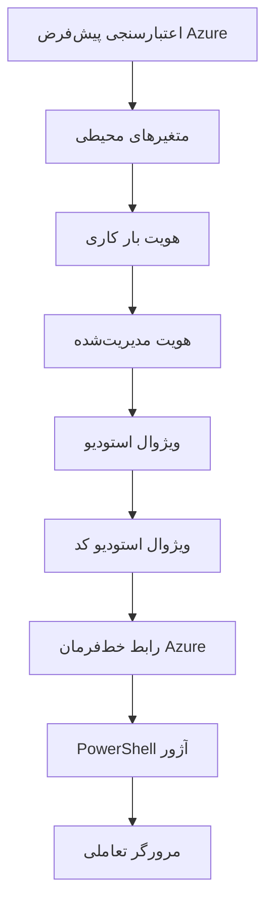

# AZD Basics - درک Azure Developer CLI

# AZD Basics - مفاهیم اصلی و اصول بنیادین

**فهرست فصل‌ها:**
- **📚 Course Home**: [AZD For Beginners](../../README.md)
- **📖 Current Chapter**: فصل 1 - بنیاد و شروع سریع
- **⬅️ Previous**: [Course Overview](../../README.md#-chapter-1-foundation--quick-start)
- **➡️ Next**: [Installation & Setup](installation.md)
- **🚀 Next Chapter**: [Chapter 2: AI-First Development](../chapter-02-ai-development/microsoft-foundry-integration.md)

## مقدمه

این درس شما را با Azure Developer CLI (azd) آشنا می‌کند، یک ابزار خط فرمان قدرتمند که مسیر شما از توسعه محلی تا استقرار در Azure را تسریع می‌بخشد. شما با مفاهیم پایه، ویژگی‌های اصلی آشنا می‌شوید و درک می‌کنید چگونه azd فرایند استقرار برنامه‌های بومی ابر را ساده می‌کند.

## اهداف یادگیری

تا پایان این درس، شما:
- درک می‌کنید Azure Developer CLI چیست و هدف اصلی آن چیست
- با مفاهیم کلیدی قالب‌ها، محیط‌ها و سرویس‌ها آشنا می‌شوید
- ویژگی‌های کلیدی از جمله توسعه مبتنی بر قالب و زیرساخت به‌عنوان کد را بررسی می‌کنید
- ساختار پروژه azd و گردش کار آن را می‌فهمید
- آماده نصب و پیکربندی azd برای محیط توسعه خود می‌شوید

## نتایج یادگیری

پس از تکمیل این درس، شما خواهید توانست:
- نقش azd در جریان‌های کاری توسعه ابری مدرن را توضیح دهید
- اجزای ساختار پروژه azd را شناسایی کنید
- توضیح دهید چگونه قالب‌ها، محیط‌ها و سرویس‌ها با هم کار می‌کنند
- مزایای زیرساخت به‌عنوان کد با azd را درک کنید
- فرمان‌های مختلف azd و کاربردهای آن‌ها را بشناسید

## Azure Developer CLI (azd) چیست؟

Azure Developer CLI (azd) یک ابزار خط فرمان طراحی‌شده برای تسریع مسیر شما از توسعه محلی تا استقرار در Azure است. این ابزار فرایند ساخت، استقرار و مدیریت برنامه‌های بومی ابر را در Azure ساده می‌کند.

### با azd چه چیزهایی را می‌توان مستقر کرد؟

azd از طیف گسترده‌ای از بارهای کاری پشتیبانی می‌کند—و این فهرست همچنان در حال گسترش است. امروز می‌توانید از azd برای استقرار موارد زیر استفاده کنید:

| Workload Type | Examples | Same Workflow? |
|---------------|----------|----------------|
| **Traditional applications** | وب‌اپ‌ها، APIهای REST، سایت‌های ایستا | ✅ `azd up` |
| **Services and microservices** | Container Apps، Function Apps، بک‌اندهای چندخدمتی | ✅ `azd up` |
| **AI-powered applications** | اپلیکیشن‌های گفتگو با مدل‌های Microsoft Foundry، راه‌حل‌های RAG با AI Search | ✅ `azd up` |
| **Intelligent agents** | عامل‌های میزبانی‌شده در Foundry، ارکستراسیون‌های چندعاملی | ✅ `azd up` |

بینش کلیدی این است که **چرخه حیات azd بدون توجه به اینکه چه چیزی را مستقر می‌کنید یکسان می‌ماند**. شما یک پروژه را مقداردهی اولیه می‌کنید، زیرساخت را فراهم می‌کنید، کد خود را مستقر می‌کنید، برنامه‌تان را نظارت می‌کنید و پاکسازی انجام می‌دهید—چه یک وب‌سایت ساده باشد یا یک عامل هوش مصنوعی پیچیده.

این تداوم طراحی‌شده است. azd قابلیت‌های هوش مصنوعی را به عنوان نوع دیگری از سرویس‌هایی که برنامه شما می‌تواند از آن‌ها استفاده کند، وارد می‌کند، نه چیزی به‌طور بنیادی متفاوت. یک نقطه پایانی گفتگویی که توسط مدل‌های Microsoft Foundry پشتیبانی می‌شود، از منظر azd صرفاً یک سرویس دیگر برای پیکربندی و استقرار است.

### 🎯 چرا از AZD استفاده کنیم؟ مقایسه‌ای دنیای واقعی

بیایید استقرار یک وب‌اپ ساده با پایگاه‌داده را مقایسه کنیم:

#### ❌ بدون AZD: استقرار دستی در Azure (بیش از 30 دقیقه)

```bash
# مرحله 1: ایجاد گروه منابع
az group create --name myapp-rg --location eastus

# مرحله 2: ایجاد پلن App Service
az appservice plan create --name myapp-plan \
  --resource-group myapp-rg \
  --sku B1 --is-linux

# مرحله 3: ایجاد برنامه وب
az webapp create --name myapp-web-unique123 \
  --resource-group myapp-rg \
  --plan myapp-plan \
  --runtime "NODE:18-lts"

# مرحله 4: ایجاد حساب Cosmos DB (۱۰–۱۵ دقیقه)
az cosmosdb create --name myapp-cosmos-unique123 \
  --resource-group myapp-rg \
  --kind MongoDB

# مرحله 5: ایجاد پایگاه داده
az cosmosdb mongodb database create \
  --account-name myapp-cosmos-unique123 \
  --resource-group myapp-rg \
  --name tododb

# مرحله 6: ایجاد مجموعه
az cosmosdb mongodb collection create \
  --account-name myapp-cosmos-unique123 \
  --resource-group myapp-rg \
  --database-name tododb \
  --name todos

# مرحله 7: دریافت رشته اتصال
CONN_STR=$(az cosmosdb keys list \
  --name myapp-cosmos-unique123 \
  --resource-group myapp-rg \
  --type connection-strings \
  --query "connectionStrings[0].connectionString" -o tsv)

# مرحله 8: پیکربندی تنظیمات برنامه
az webapp config appsettings set \
  --name myapp-web-unique123 \
  --resource-group myapp-rg \
  --settings MONGODB_URI="$CONN_STR"

# مرحله 9: فعال‌سازی لاگ‌گیری
az webapp log config --name myapp-web-unique123 \
  --resource-group myapp-rg \
  --application-logging filesystem \
  --detailed-error-messages true

# مرحله 10: راه‌اندازی Application Insights
az monitor app-insights component create \
  --app myapp-insights \
  --location eastus \
  --resource-group myapp-rg

# مرحله 11: اتصال App Insights به برنامه وب
INSTRUMENTATION_KEY=$(az monitor app-insights component show \
  --app myapp-insights \
  --resource-group myapp-rg \
  --query "instrumentationKey" -o tsv)

az webapp config appsettings set \
  --name myapp-web-unique123 \
  --resource-group myapp-rg \
  --settings APPINSIGHTS_INSTRUMENTATIONKEY="$INSTRUMENTATION_KEY"

# مرحله 12: ساخت برنامه به‌صورت محلی
npm install
npm run build

# مرحله 13: ایجاد بسته استقرار
zip -r app.zip . -x "*.git*" "node_modules/*"

# مرحله 14: استقرار برنامه
az webapp deployment source config-zip \
  --resource-group myapp-rg \
  --name myapp-web-unique123 \
  --src app.zip

# مرحله 15: منتظر بمانید و دعا کنید که کار کند 🙏
# (هیچ اعتبارسنجی خودکار وجود ندارد، آزمایش دستی مورد نیاز است)
```

**مشکلات:**
- ❌ 15+ فرمان که باید به ترتیب به خاطر سپرده و اجرا شوند
- ❌ 30-45 دقیقه کار دستی
- ❌ احتمال خطا بالا (اشتباهات تایپی، پارامترهای نادرست)
- ❌ رشته‌های اتصال در تاریخچه ترمینال قابل افشا هستند
- ❌ بازگردانی خودکار در صورت خطا وجود ندارد
- ❌ تکرارپذیری سخت برای اعضای تیم
- ❌ هر بار متفاوت است (قابل بازتولید نیست)

#### ✅ با AZD: استقرار خودکار (5 فرمان، 10-15 دقیقه)

```bash
# مرحله 1: مقداردهی اولیه از قالب
azd init --template todo-nodejs-mongo

# مرحله 2: احراز هویت
azd auth login

# مرحله 3: ایجاد محیط
azd env new dev

# مرحله 4: پیش‌نمایش تغییرات (اختیاری اما توصیه‌شده)
azd provision --preview

# مرحله 5: همه چیز را مستقر کنید
azd up

# ✨ تمام شد! همه چیز مستقر، پیکربندی و پایش شده است
```

**مزایا:**
- ✅ **5 فرمان** در مقابل بیش از 15 مرحلهٔ دستی
- ✅ **10-15 دقیقه** زمان کل (عمدتاً انتظار برای Azure)
- ✅ **خطاهای دستی کمتر** - جریان کاری ثابت و مبتنی بر قالب
- ✅ **مدیریت امن اسرار** - بسیاری از قالب‌ها از ذخیره‌سازی اسرار مدیریت‌شده توسط Azure استفاده می‌کنند
- ✅ **استقرارهای تکرارپذیر** - هر بار همان گردش کار
- ✅ **کاملاً بازتولیدپذیر** - همان نتیجه هر بار
- ✅ **آماده برای تیم** - هر کسی می‌تواند با همان فرمان‌ها استقرار دهد
- ✅ **زیرساخت به‌عنوان کد** - قالب‌های Bicep تحت کنترل نسخه
- ✅ **نظارت داخلی** - Application Insights به‌صورت خودکار پیکربندی می‌شود

### 📊 کاهش زمان و خطا

| معیار | استقرار دستی | استقرار با AZD | بهبود |
|:-------|:------------------|:---------------|:------------|
| **فرمان‌ها** | 15+ | 5 | 67% کمتر |
| **زمان** | 30-45 min | 10-15 min | 60% سریع‌تر |
| **نرخ خطا** | ~40% | <5% | 88% کاهش |
| **ثبات** | کم (دستی) | 100% (خودکار) | کامل |
| **آموزش تیم** | 2-4 hours | 30 minutes | 75% سریع‌تر |
| **زمان بازگردانی** | 30+ min (manual) | 2 min (automated) | 93% سریع‌تر |

## مفاهیم اصلی

### قالب‌ها
قالب‌ها پایه و اساس azd هستند. آن‌ها شامل می‌شوند:
- **کد برنامه** - کد منبع و وابستگی‌های شما
- **تعاریف زیرساخت** - منابع Azure تعریف‌شده در Bicep یا Terraform
- **فایل‌های پیکربندی** - تنظیمات و متغیرهای محیطی
- **اسکریپت‌های استقرار** - جریان‌های کاری استقرار خودکار

### محیط‌ها
محیط‌ها نمایانگر اهداف استقرار مختلف هستند:
- **Development** - برای تست و توسعه
- **Staging** - محیط پیش‌تولید
- **Production** - محیط تولید زنده

هر محیط موارد زیر را جداگانه نگه می‌دارد:
- گروه منابع Azure
- تنظیمات پیکربندی
- وضعیت استقرار

### سرویس‌ها
سرویس‌ها بلوک‌های سازنده برنامه شما هستند:
- **Frontend** - برنامه‌های وب، SPAها
- **Backend** - APIها، میکروسرویس‌ها
- **Database** - راه‌حل‌های ذخیره‌سازی داده
- **Storage** - ذخیره فایل و blob

## ویژگی‌های کلیدی

### 1. توسعه مبتنی بر قالب
```bash
# مرور قالب‌های موجود
azd template list

# مقداردهی اولیه از یک قالب
azd init --template <template-name>
```

### 2. زیرساخت به‌عنوان کد
- **Bicep** - زبان مخصوص دامنهٔ Azure
- **Terraform** - ابزار زیرساخت چندابری
- **ARM Templates** - قالب‌های Azure Resource Manager

### 3. جریان‌های کاری یکپارچه
```bash
# روند کامل استقرار
azd up            # تأمین و استقرار — برای راه‌اندازی اولیه بدون دخالت دستی

# 🧪 جدید: پیش‌نمایش تغییرات زیرساخت قبل از استقرار (ایمن)
azd provision --preview    # شبیه‌سازی استقرار زیرساخت بدون ایجاد تغییر

azd provision     # منابع Azure را ایجاد کنید؛ اگر زیرساخت را به‌روزرسانی می‌کنید از این استفاده کنید
azd deploy        # کد برنامه را مستقر کنید یا پس از به‌روزرسانی دوباره مستقر کنید
azd down          # پاک‌سازی منابع
```

#### 🛡️ برنامه‌ریزی ایمن زیرساخت با پیش‌نمایش
فرمان `azd provision --preview` تحولی در استقرارهای ایمن است:
- **تحلیل آزمایشی** - نشان می‌دهد چه چیزی ایجاد، تغییر یا حذف خواهد شد
- **بدون ریسک** - هیچ تغییری در محیط Azure شما اعمال نمی‌شود
- **همکاری تیمی** - نتایج پیش‌نمایش را قبل از استقرار به اشتراک بگذارید
- **برآورد هزینه** - هزینه منابع را قبل از تعهد درک کنید

```bash
# نمونه‌ای از جریان کاری پیش‌نمایش
azd provision --preview           # ببینید چه تغییراتی رخ خواهد داد
# خروجی را بازبینی کنید، با تیم بحث کنید
azd provision                     # تغییرات را با اطمینان اعمال کنید
```

### 📊 مصور: جریان کاری توسعه AZD


```mermaid
graph LR
    A[azd init] -->|راه‌اندازی پروژه| B[azd auth login]
    B -->|احراز هویت| C[azd env new]
    C -->|ایجاد محیط| D{اولین استقرار؟}
    D -->|بله| E[azd up]
    D -->|خیر| F[azd provision --preview]
    F -->|بررسی تغییرات| G[azd provision]
    E -->|تأمین و استقرار| H[منابع در حال اجرا]
    G -->|به‌روزرسانی زیرساخت| H
    H -->|نظارت| I[azd monitor]
    I -->|اعمال تغییرات در کد| J[azd deploy]
    J -->|فقط استقرار مجدد کد| H
    H -->|پاک‌سازی| K[azd down]
    
    style A fill:#e1f5fe
    style E fill:#c8e6c9
    style F fill:#fff9c4
    style H fill:#c5e1a5
    style K fill:#ffcdd2
```
**توضیح جریان کاری:**
1. **Init** - شروع با قالب یا پروژهٔ جدید
2. **Auth** - احراز هویت با Azure
3. **Environment** - ایجاد محیط استقرار ایزوله
4. **Preview** - 🆕 همیشه ابتدا تغییرات زیرساخت را پیش‌نمایش کنید (رویهٔ ایمن)
5. **Provision** - ایجاد/به‌روزرسانی منابع Azure
6. **Deploy** - ارسال کد برنامهٔ خود
7. **Monitor** - مشاهدهٔ عملکرد برنامه
8. **Iterate** - انجام تغییرات و دوباره استقرار کد
9. **Cleanup** - حذف منابع پس از اتمام

### 4. مدیریت محیط
```bash
# ایجاد و مدیریت محیط‌ها
azd env new <environment-name>
azd env select <environment-name>
azd env list
```

### 5. افزونه‌ها و فرمان‌های هوش مصنوعی

azd از یک سیستم افزونه استفاده می‌کند تا قابلیت‌هایی فراتر از CLI اصلی اضافه کند. این موضوع به‌ویژه برای بارهای کاری هوش مصنوعی مفید است:

```bash
# فهرست افزونه‌های موجود
azd extension list

# افزونهٔ Foundry agents را نصب کنید
azd extension install azure.ai.agents

# یک پروژهٔ عامل هوش مصنوعی را از مانیفست راه‌اندازی کنید
azd ai agent init -m agent-manifest.yaml

# سرور MCP را برای توسعهٔ کمک‌شده توسط هوش مصنوعی راه‌اندازی کنید (آلفا)
azd mcp start
```

> افزونه‌ها به‌صورت کامل در [فصل ۲: توسعهٔ مبتنی‌بر هوش مصنوعی](../chapter-02-ai-development/agents.md) و مرجع [فرمان‌های AZD AI CLI](../chapter-08-production/production-ai-practices.md#azd-ai-cli-commands-and-extensions) پوشش داده شده‌اند.

## 📁 ساختار پروژه

یک ساختار معمول پروژه azd:
```
my-app/
├── .azd/                    # azd configuration
│   └── config.json
├── .azure/                  # Azure deployment artifacts
├── .devcontainer/          # Development container config
├── .github/workflows/      # GitHub Actions
├── .vscode/               # VS Code settings
├── infra/                 # Infrastructure code
│   ├── main.bicep        # Main infrastructure template
│   ├── main.parameters.json
│   └── modules/          # Reusable modules
├── src/                  # Application source code
│   ├── api/             # Backend services
│   └── web/             # Frontend application
├── azure.yaml           # azd project configuration
└── README.md
```

## 🔧 فایل‌های پیکربندی

### azure.yaml
فایل پیکربندی اصلی پروژه:
```yaml
name: my-awesome-app
metadata:
  template: my-template@1.0.0

services:
  web:
    project: ./src/web
    language: js
    host: appservice
  api:
    project: ./src/api
    language: js
    host: appservice

hooks:
  preprovision:
    shell: pwsh
    run: echo "Preparing to provision..."
```

### .azure/config.json
پیکربندی مخصوص محیط:
```json
{
  "version": 1,
  "defaultEnvironment": "dev",
  "environments": {
    "dev": {
      "subscriptionId": "your-subscription-id",
      "location": "eastus"
    }
  }
}
```

## 🎪 جریان‌های کاری رایج با تمرین‌های عملی

> **💡 نکتهٔ یادگیری:** این تمرین‌ها را به ترتیب دنبال کنید تا مهارت‌های AZD خود را به‌تدریج بسازید.

### 🎯 تمرین 1: ایجاد اولین پروژهٔ شما

**هدف:** ایجاد یک پروژه AZD و بررسی ساختار آن

**مراحل:**
```bash
# از یک قالب اثبات‌شده استفاده کنید
azd init --template todo-nodejs-mongo

# فایل‌های تولیدشده را بررسی کنید
ls -la  # همه فایل‌ها از جمله فایل‌های مخفی را مشاهده کنید

# فایل‌های کلیدی ایجاد شده:
# - azure.yaml (پیکربندی اصلی)
# - infra/ (کد زیرساخت)
# - src/ (کد برنامه)
```

**✅ موفقیت:** شما دارای azure.yaml، infra/ و src/ هستید

---

### 🎯 تمرین 2: استقرار در Azure

**هدف:** تکمیل استقرار انتها-به-انتها

**مراحل:**
```bash
# 1. احراز هویت
az login && azd auth login

# 2. ایجاد محیط
azd env new dev
azd env set AZURE_LOCATION eastus

# 3. پیش‌نمایش تغییرات (توصیه‌شده)
azd provision --preview

# 4. استقرار همه‌چیز
azd up

# 5. تأیید استقرار
azd show    # آدرس برنامهٔ خود را مشاهده کنید
```

**زمان مورد انتظار:** 10-15 دقیقه  
**✅ موفقیت:** آدرس برنامه در مرورگر باز می‌شود

---

### 🎯 تمرین 3: چندین محیط

**هدف:** استقرار در dev و staging

**مراحل:**
```bash
# قبلاً dev را داریم، staging را ایجاد کنید
azd env new staging
azd env set AZURE_LOCATION westus2
azd up

# بین آن‌ها جابه‌جا شوید
azd env list
azd env select dev
```

**✅ موفقیت:** دو گروه منابع جداگانه در Azure Portal

---

### 🛡️ پاکسازی کامل: `azd down --force --purge`

وقتی نیاز به بازنشانی کامل دارید:

```bash
azd down --force --purge
```

**آنچه انجام می‌دهد:**
- `--force`: هیچ درخواست تأییدی نمایش داده نمی‌شود
- `--purge`: همهٔ وضعیت محلی و منابع Azure را حذف می‌کند

**استفاده در موارد:**
- استقرار نیمه‌کاره یا با خطا
- هنگام تغییر پروژه‌ها
- نیاز به شروعی تازه

---

## 🎪 مرجع جریان کاری اصلی

### Starting a New Project
```bash
# روش ۱: استفاده از قالب موجود
azd init --template todo-nodejs-mongo

# روش ۲: از ابتدا شروع کنید
azd init

# روش ۳: استفاده از پوشه جاری
azd init .
```

### Development Cycle
```bash
# راه‌اندازی محیط توسعه
azd auth login
azd env new dev
azd env select dev

# همه چیز را مستقر کنید
azd up

# تغییرات را اعمال کرده و مجدداً مستقر کنید
azd deploy

# پس از اتمام کار، پاکسازی کنید
azd down --force --purge # این دستور در Azure Developer CLI یک **بازنشانی سخت** برای محیط شما است—به‌ویژه زمانی که در حال عیب‌یابی استقرارهای ناموفق، پاک‌سازی منابع یتیم یا آماده‌سازی برای استقرار تازه هستید.
```

## درک `azd down --force --purge`
فرمان `azd down --force --purge` راهی قدرتمند برای تخریب کامل محیط azd و تمام منابع مرتبط است. در اینجا تجزیه‌و‌تحلیل اینکه هر فلگ چه کاری انجام می‌دهد آمده است:
```
--force
```
- از نمایش درخواست‌های تأیید صرف‌نظر می‌کند.
- مفید برای خودکارسازی یا اسکریپت‌نویسی جایی که ورودی دستی امکان‌پذیر نیست.
- اطمینان می‌دهد که فرایند تخریب بدون وقفه ادامه یابد، حتی اگر CLI ناسازگاری‌هایی کشف کند.

```
--purge
```
حذف می‌کند **تمام فراداده‌های مرتبط**، از جمله:
وضعیت محیط
پوشه محلی `.azure`
اطلاعات کش‌شدهٔ استقرار
از اینکه azd استقرارهای قبلی را "remembering" جلوگیری می‌کند، چیزی که می‌تواند مشکلاتی مانند نامتناسبی گروه‌های منابع یا ارجاعات قدیمی رجیستری را ایجاد کند.

### چرا از هر دو استفاده کنیم؟
وقتی به‌خاطر وضعیت باقیمانده یا استقرارهای ناقص با `azd up` به بن‌بست می‌خورید، این ترکیب یک **شروع تازه** را تضمین می‌کند.

این روش به‌ویژه پس از حذف دستی منابع در پرتال Azure یا هنگام تغییر قالب‌ها، محیط‌ها یا قراردادهای نام‌گذاری گروه منابع مفید است.

### مدیریت چندین محیط
```bash
# ایجاد محیط مرحله‌بندی
azd env new staging
azd env select staging
azd up

# بازگشت به محیط توسعه
azd env select dev

# مقایسه محیط‌ها
azd env list
```

## 🔐 احراز هویت و مدارک

درک احراز هویت برای استقرارهای موفق azd حیاتی است. Azure از روش‌های مختلف احراز هویت استفاده می‌کند و azd از همان زنجیرهٔ اعتبار استفاده می‌کند که ابزارهای دیگر Azure نیز به‌کار می‌برند.

### احراز هویت Azure CLI (`az login`)

قبل از استفاده از azd، باید با Azure احراز هویت کنید. رایج‌ترین روش استفاده از Azure CLI است:

```bash
# ورود تعاملی (مرورگر را باز می‌کند)
az login

# ورود با تِنانت مشخص
az login --tenant <tenant-id>

# ورود با شناسه سرویس
az login --service-principal -u <app-id> -p <password> --tenant <tenant-id>

# بررسی وضعیت ورود فعلی
az account show

# نمایش اشتراک‌های موجود
az account list --output table

# تنظیم اشتراک پیش‌فرض
az account set --subscription <subscription-id>
```

### جریان احراز هویت
1. **Interactive Login**: مرورگر پیش‌فرض شما را برای احراز هویت باز می‌کند
2. **Device Code Flow**: برای محیط‌هایی بدون دسترسی به مرورگر
3. **Service Principal**: برای خودکارسازی و سناریوهای CI/CD
4. **Managed Identity**: برای برنامه‌های میزبانی‌شده در Azure

### زنجیره DefaultAzureCredential

`DefaultAzureCredential` یک نوع اعتبارسنجی است که تجربهٔ احراز هویت ساده‌شده‌ای ارائه می‌دهد با تلاش خودکار منابع مختلف اعتبارسنجی به ترتیبی مشخص:

#### ترتیب زنجیره احراز هویت

```mermaid
graph TD
    A[اعتبارسنجی پیش‌فرض Azure] --> B[متغیرهای محیطی]
    B --> C[هویت بار کاری]
    C --> D[هویت مدیریت‌شده]
    D --> E[ویژوال استودیو]
    E --> F[ویژوال استودیو کد]
    F --> G[رابط خط‌فرمان Azure]
    G --> H[PowerShell آژور]
    H --> I[مرورگر تعاملی]
```
#### 1. متغیرهای محیطی
```bash
# متغیرهای محیطی را برای پرینسیپل سرویس تنظیم کنید
export AZURE_CLIENT_ID="<app-id>"
export AZURE_CLIENT_SECRET="<password>"
export AZURE_TENANT_ID="<tenant-id>"
```

#### 2. Workload Identity (Kubernetes/GitHub Actions)
به‌صورت خودکار در:
- Azure Kubernetes Service (AKS) با Workload Identity
- GitHub Actions با فدراسیون OIDC
- سایر سناریوهای هویت فدرال

#### 3. Managed Identity
برای منابع Azure مانند:
- ماشین‌های مجازی
- App Service
- Azure Functions
- نمونه‌های کانتینر

```bash
# بررسی می‌کند که آیا روی یک منبع Azure با هویت مدیریت‌شده در حال اجرا است
az account show --query "user.type" --output tsv
# بازمی‌گرداند: "servicePrincipal" در صورتی که از هویت مدیریت‌شده استفاده شود
```

#### 4. ادغام با ابزارهای توسعه‌دهنده
- **Visual Studio**: به‌صورت خودکار از حساب واردشده استفاده می‌کند
- **VS Code**: از مدارک افزونهٔ Azure Account استفاده می‌کند
- **Azure CLI**: از مدارک `az login` استفاده می‌کند (رایج‌ترین برای توسعه محلی)

### راه‌اندازی احراز هویت AZD

```bash
# روش ۱: استفاده از Azure CLI (برای توسعه توصیه می‌شود)
az login
azd auth login  # از اعتبارنامه‌های موجود Azure CLI استفاده می‌کند

# روش ۲: احراز هویت مستقیم azd
azd auth login --use-device-code  # برای محیط‌های بدون رابط کاربری

# روش ۳: بررسی وضعیت احراز هویت
azd auth login --check-status

# روش ۴: خروج و احراز هویت مجدد
azd auth logout
azd auth login
```

### بهترین شیوه‌های احراز هویت

#### برای توسعه محلی
```bash
# 1. با Azure CLI وارد شوید
az login

# 2. صحت اشتراک را بررسی کنید
az account show
az account set --subscription "Your Subscription Name"

# 3. از azd با اعتبارنامه‌های موجود استفاده کنید
azd auth login
```

#### برای خطوط CI/CD
```yaml
# GitHub Actions example
- name: Azure Login
  uses: azure/login@v1
  with:
    creds: ${{ secrets.AZURE_CREDENTIALS }}

- name: Deploy with azd
  run: |
    azd auth login --client-id ${{ secrets.AZURE_CLIENT_ID }} \
                    --client-secret ${{ secrets.AZURE_CLIENT_SECRET }} \
                    --tenant-id ${{ secrets.AZURE_TENANT_ID }}
    azd up --no-prompt
```

#### برای محیط‌های تولید
- استفاده از **Managed Identity** هنگام اجرا روی منابع Azure
- استفاده از **Service Principal** برای سناریوهای خودکارسازی
- از ذخیره‌سازی مدارک در کد یا فایل‌های پیکربندی خودداری کنید
- استفاده از **Azure Key Vault** برای پیکربندی‌های حساس

### مشکلات رایج احراز هویت و راه‌حل‌ها

#### مشکل: "No subscription found"
```bash
# راه‌حل: تنظیم اشتراک پیش‌فرض
az account list --output table
az account set --subscription "<subscription-id>"
azd env set AZURE_SUBSCRIPTION_ID "<subscription-id>"
```

#### مشکل: "Insufficient permissions"
```bash
# راه‌حل: نقش‌های مورد نیاز را بررسی و تخصیص دهید
az role assignment list --assignee $(az account show --query user.name --output tsv)

# نقش‌های مورد نیاز رایج:
# - Contributor (برای مدیریت منابع)
# - User Access Administrator (برای تخصیص نقش‌ها)
```

#### مشکل: "Token expired"
```bash
# راه‌حل: احراز هویت مجدد
az logout
az login
azd auth logout
azd auth login
```

### احراز هویت در سناریوهای مختلف

#### توسعه محلی
```bash
# حساب توسعه فردی
az login
azd auth login
```

#### توسعه تیمی
```bash
# برای سازمان از مستأجر خاص استفاده کنید
az login --tenant contoso.onmicrosoft.com
azd auth login
```

#### سناریوهای چند-مستاجری
```bash
# تغییر بین مستأجران
az login --tenant tenant1.onmicrosoft.com
# استقرار در مستأجر ۱
azd up

az login --tenant tenant2.onmicrosoft.com  
# استقرار در مستأجر ۲
azd up
```

### ملاحظات امنیتی
1. **ذخیره اعتبارنامه**: هرگز اعتبارنامه‌ها را در کد منبع ذخیره نکنید
2. **محدودیت حوزه دسترسی**: از اصل کمترین امتیاز لازم برای service principalها استفاده کنید
3. **چرخش توکن**: اسرار service principal را به‌طور منظم چرخش دهید
4. **ردیابی حسابرسی**: فعالیت‌های احراز هویت و استقرار را نظارت کنید
5. **امنیت شبکه**: در صورت امکان از نقاط انتهایی خصوصی استفاده کنید

### رفع اشکال احراز هویت

```bash
# اشکال‌زدایی مشکلات احراز هویت
azd auth login --check-status
az account show
az account get-access-token

# دستورات تشخیصی رایج
whoami                          # زمینه کاربر فعلی
az ad signed-in-user show      # جزئیات کاربر Azure AD
az group list                  # آزمایش دسترسی به منبع
```

## درک `azd down --force --purge`

### کشف
```bash
azd template list              # مرور قالب‌ها
azd template show <template>   # جزئیات قالب
azd init --help               # گزینه‌های مقداردهی اولیه
```

### مدیریت پروژه
```bash
azd show                     # نمای کلی پروژه
azd env list                # محیط‌های در دسترس و پیش‌فرض انتخاب‌شده
azd config show            # تنظیمات پیکربندی
```

### مانیتورینگ
```bash
azd monitor                  # باز کردن مانیتورینگ پورتال Azure
azd monitor --logs           # مشاهده لاگ‌های برنامه
azd monitor --live           # مشاهده متریک‌های زنده
azd pipeline config          # راه‌اندازی CI/CD
```

## بهترین شیوه‌ها

### 1. از نام‌های معنادار استفاده کنید
```bash
# خوب
azd env new production-east
azd init --template web-app-secure

# اجتناب کنید
azd env new env1
azd init --template template1
```

### 2. از قالب‌ها بهره ببرید
- با قالب‌های موجود شروع کنید
- برای نیازهای خود سفارشی‌سازی کنید
- قالب‌های قابل استفاده مجدد برای سازمان خود ایجاد کنید

### 3. جداسازی محیط‌ها
- از محیط‌های جداگانه برای توسعه/آزمایشی/تولید استفاده کنید
- هرگز مستقیماً از ماشین محلی به تولید استقرار ندهید
- از خطوط CI/CD برای استقرار در تولید استفاده کنید

### 4. مدیریت پیکربندی
- از متغیرهای محیطی برای داده‌های حساس استفاده کنید
- پیکربندی را در کنترل نسخه نگه دارید
- تنظیمات مخصوص هر محیط را مستند کنید

## مسیر یادگیری

### مبتدی (هفته 1-2)
1. azd را نصب و احراز هویت کنید
2. یک قالب ساده را استقرار دهید
3. ساختار پروژه را درک کنید
4. دستورات پایه را یاد بگیرید (up, down, deploy)

### متوسط (هفته 3-4)
1. قالب‌ها را سفارشی کنید
2. چندین محیط را مدیریت کنید
3. کد زیرساخت را درک کنید
4. خطوط CI/CD را راه‌اندازی کنید

### پیشرفته (هفته 5+)
1. قالب‌های سفارشی ایجاد کنید
2. الگوهای پیشرفته زیرساخت
3. استقرار در چند منطقه
4. پیکربندی‌های سطح سازمانی

## گام‌های بعدی

**📖 ادامه یادگیری فصل 1:**
- [Installation & Setup](installation.md) - نصب و پیکربندی azd
- [Your First Project](first-project.md) - تکمیل آموزش عملی
- [Configuration Guide](configuration.md) - گزینه‌های پیکربندی پیشرفته

**🎯 آماده فصل بعدی هستید؟**
- [Chapter 2: AI-First Development](../chapter-02-ai-development/microsoft-foundry-integration.md) - شروع به ساخت برنامه‌های هوش مصنوعی

## منابع اضافی

- [Azure Developer CLI Overview](https://learn.microsoft.com/en-us/azure/developer/azure-developer-cli/)
- [Template Gallery](https://azure.github.io/awesome-azd/)
- [Community Samples](https://github.com/Azure-Samples)

---

## 🙋 سوالات متداول

### سوالات عمومی

**س: تفاوت AZD و Azure CLI چیست؟**

پاسخ: Azure CLI (`az`) برای مدیریت منابع منفرد Azure است. AZD (`azd`) برای مدیریت برنامه‌های کامل است:

```bash
# Azure CLI - مدیریت منابع سطح پایین
az webapp create --name myapp --resource-group rg
az sql server create --name myserver --resource-group rg
# ...به دستورات بیشتری نیاز است

# AZD - مدیریت سطح برنامه
azd up  # کل برنامه را همراه با تمام منابع مستقر می‌کند
```

**این‌طور فکر کنید:**
- `az` = عمل بر روی آجرهای منفرد لگو
- `azd` = کار با ست‌های کامل لگو

---

**س: آیا برای استفاده از AZD باید Bicep یا Terraform بلد باشم؟**

پاسخ: نه! با قالب‌ها شروع کنید:
```bash
# از قالب موجود استفاده کنید - نیازی به دانش IaC نیست
azd init --template todo-nodejs-mongo
azd up
```

بعداً می‌توانید برای سفارشی‌سازی زیرساخت Bicep را بیاموزید. قالب‌ها مثال‌های عملی برای یادگیری فراهم می‌کنند.

---

**س: هزینه اجرای قالب‌های AZD چقدر است؟**

پاسخ: هزینه‌ها بسته به قالب متغیر است. اکثر قالب‌های توسعه بین $50-150/ماه هزینه دارند:

```bash
# قبل از استقرار، هزینه‌ها را بررسی کنید
azd provision --preview

# هر زمان از آن استفاده نمی‌کنید، همیشه آن را پاکسازی کنید
azd down --force --purge  # تمام منابع را حذف می‌کند
```

**نکته حرفه‌ای:** از tierهای رایگان در صورت وجود استفاده کنید:
- App Service: F1 (Free) tier
- Microsoft Foundry Models: Azure OpenAI ماهانه 50,000 توکن رایگان
- Cosmos DB: 1000 RU/s tier رایگان

---

**س: آیا می‌توانم از AZD با منابع موجود Azure استفاده کنم؟**

پاسخ: بله، اما شروع تازه آسان‌تر است. AZD وقتی کل چرخه عمر را مدیریت می‌کند بهترین عملکرد را دارد. برای منابع موجود:

```bash
# گزینه ۱: وارد کردن منابع موجود (پیشرفته)
azd init
# سپس پوشه infra/ را طوری تغییر دهید که به منابع موجود ارجاع دهد

# گزینه ۲: شروع از ابتدا (توصیه‌شده)
azd init --template matching-your-stack
azd up  # یک محیط جدید ایجاد می‌کند
```

---

**س: چگونه پروژه‌ام را با هم‌تیمی‌ها به اشتراک بگذارم؟**

پاسخ: پروژه AZD را به Git متعهد کنید (اما پوشه .azure را متعهد نکنید):

```bash
# قبلاً به‌طور پیش‌فرض در .gitignore قرار دارد
.azure/        # حاوی اسرار و داده‌های محیطی
*.env          # متغیرهای محیطی

# سپس اعضای تیم:
git clone <your-repo>
azd auth login
azd env new <their-name>-dev
azd up
```

همه از همان قالب‌ها زیرساخت یکسانی دریافت می‌کنند.

---

### سوالات رفع اشکال

**س: "azd up" نیمه‌راه شکست خورد. چه کار کنم؟**

پاسخ: خطا را بررسی کنید، آن را رفع کنید، سپس مجدداً تلاش کنید:

```bash
# مشاهدهٔ لاگ‌های دقیق
azd show

# راه‌حل‌های متداول:

# ۱. در صورت عبور از سهمیه:
azd env set AZURE_LOCATION "westus2"  # یک منطقهٔ دیگر را امتحان کنید

# ۲. در صورت تداخل نام منبع:
azd down --force --purge  # پاک‌سازی کامل
azd up  # دوباره تلاش کنید

# ۳. در صورت منقضی شدن احراز هویت:
az login
azd auth login
azd up
```

**شایع‌ترین مشکل:** اشتراک Azure نادرست انتخاب شده است
```bash
az account list --output table
az account set --subscription "<correct-subscription>"
```

---

**س: چگونه فقط تغییرات کد را بدون بازتأمین (reprovisioning) استقرار دهم؟**

پاسخ: به‌جای `azd up` از `azd deploy` استفاده کنید:

```bash
azd up          # اولین بار: پیکربندی و استقرار (کند)

# تغییرات کد را اعمال کنید...

azd deploy      # در دفعات بعد: فقط استقرار (سریع)
```

مقایسه سرعت:
- `azd up`: 10-15 دقیقه (تأمین زیرساخت)
- `azd deploy`: 2-5 دقیقه (فقط کد)

---

**س: آیا می‌توانم قالب‌های زیرساخت را سفارشی کنم؟**

پاسخ: بله! فایل‌های Bicep در `infra/` را ویرایش کنید:

```bash
# پس از اجرای azd init
cd infra/
code main.bicep  # ویرایش در VS Code

# پیش‌نمایش تغییرات
azd provision --preview

# اعمال تغییرات
azd provision
```

**نکته:** با تغییر SKUها کوچک شروع کنید:
```bicep
// infra/main.bicep
sku: {
  name: 'B1'  // Change to 'P1V2' for production
}
```

---

**س: چگونه همه چیزهایی که AZD ایجاد کرده را حذف کنم؟**

پاسخ: یک فرمان همه منابع را حذف می‌کند:

```bash
azd down --force --purge

# این موارد را حذف می‌کند:
# - همهٔ منابع Azure
# - گروه منابع
# - وضعیت محیط محلی
# - داده‌های استقرار کش‌شده
```

**همیشه این را اجرا کنید وقتی:**
- تست قالب را تمام کرده‌اید
- به پروژه متفاوتی تغییر می‌دهید
- می‌خواهید از نو شروع کنید

**صرفه‌جویی در هزینه:** حذف منابع بلااستفاده = هزینه $0

---

**س: اگر به‌طور تصادفی منابع را در Azure Portal حذف کردم چه؟**

پاسخ: وضعیت AZD ممکن است از هم‌گام خارج شود. روش شروع مجدد:

```bash
# 1. حذف وضعیت محلی
azd down --force --purge

# 2. از نو شروع کنید
azd up

# جایگزین: اجازه دهید AZD تشخیص دهد و اصلاح کند
azd provision  # منابع مفقود را ایجاد خواهد کرد
```

---

### سوالات پیشرفته

**س: آیا می‌توانم AZD را در خطوط CI/CD استفاده کنم؟**

پاسخ: بله! نمونه GitHub Actions:

```yaml
# .github/workflows/deploy.yml
name: Deploy with AZD

on:
  push:
    branches: [main]

jobs:
  deploy:
    runs-on: ubuntu-latest
    steps:
      - uses: actions/checkout@v2
      
      - name: Install azd
        run: curl -fsSL https://aka.ms/install-azd.sh | bash
      
      - name: Azure Login
        run: |
          azd auth login \
            --client-id ${{ secrets.AZURE_CLIENT_ID }} \
            --client-secret ${{ secrets.AZURE_CLIENT_SECRET }} \
            --tenant-id ${{ secrets.AZURE_TENANT_ID }}
      
      - name: Deploy
        run: azd up --no-prompt
```

---

**س: چگونه اسرار و داده‌های حساس را مدیریت کنم؟**

پاسخ: AZD به‌طور خودکار با Azure Key Vault ادغام می‌شود:

```bash
# رازها در Key Vault ذخیره می‌شوند، نه در کد
azd env set DATABASE_PASSWORD "$(openssl rand -base64 32)"

# AZD به‌طور خودکار:
# 1. Key Vault را ایجاد می‌کند
# 2. راز را ذخیره می‌کند
# 3. از طریق Managed Identity به برنامه دسترسی می‌دهد
# 4. در زمان اجرا آن را تزریق می‌کند
```

**هرگز متعهد نکنید:**
- پوشه `.azure/` (حاوی داده‌های محیط)
- فایل‌های `.env` (اسرار محلی)
- connection strings

---

**س: آیا می‌توانم به چندین منطقه استقرار دهم؟**

پاسخ: بله، برای هر منطقه یک محیط ایجاد کنید:

```bash
# محیط شرق ایالات متحده
azd env new prod-eastus
azd env set AZURE_LOCATION eastus
azd up

# محیط اروپای غربی
azd env new prod-westeurope
azd env set AZURE_LOCATION westeurope
azd up

# هر محیط مستقل است
azd env list
```

برای برنامه‌های واقعاً چندمنطقه‌ای، قالب‌های Bicep را سفارشی کنید تا همزمان به چند منطقه استقرار دهند.

---

**س: اگر گیر کردم کجا می‌توانم کمک بگیرم؟**

1. **مستندات AZD:** https://learn.microsoft.com/azure/developer/azure-developer-cli/
2. **GitHub Issues:** https://github.com/Azure/azure-dev/issues
3. **Discord:** [Azure Discord](https://discord.gg/microsoft-azure) - کانال #azure-developer-cli
4. **Stack Overflow:** تگ `azure-developer-cli`
5. **این دوره:** [Troubleshooting Guide](../chapter-07-troubleshooting/common-issues.md)

**نکته حرفه‌ای:** قبل از پرسش، اجرا کنید:
```bash
azd show       # وضعیت فعلی را نمایش می‌دهد
azd version    # نسخه شما را نمایش می‌دهد
```
این اطلاعات را در پرسش خود بگنجانید تا کمک سریع‌تر شود.

---

## 🎓 قدم بعدی چیست؟

اکنون اصول AZD را می‌دانید. مسیر خود را انتخاب کنید:

### 🎯 برای مبتدیان:
1. **بعدی:** [Installation & Setup](installation.md) - AZD را روی ماشین خود نصب کنید
2. **سپس:** [Your First Project](first-project.md) - اولین برنامه خود را استقرار دهید
3. **تمرین:** تمام 3 تمرین این درس را تکمیل کنید

### 🚀 برای توسعه‌دهندگان هوش مصنوعی:
1. **برو به:** [Chapter 2: AI-First Development](../chapter-02-ai-development/microsoft-foundry-integration.md)
2. **استقرار:** با `azd init --template get-started-with-ai-chat` شروع کنید
3. **یاد بگیرید:** هنگام استقرار بسازید

### 🏗️ برای توسعه‌دهندگان باتجربه:
1. **مرور:** [Configuration Guide](configuration.md) - تنظیمات پیشرفته
2. **کاوش:** [Infrastructure as Code](../chapter-04-infrastructure/provisioning.md) - بررسی عمیق Bicep
3. **ساخت:** قالب‌های سفارشی برای پشته خود ایجاد کنید

---

**ناوبری فصل:**
- **📚 صفحه دوره:** [AZD For Beginners](../../README.md)
- **📖 فصل فعلی:** فصل 1 - مبانی و شروع سریع  
- **⬅️ قبلی:** [Course Overview](../../README.md#-chapter-1-foundation--quick-start)
- **➡️ بعدی:** [Installation & Setup](installation.md)
- **🚀 فصل بعدی:** [Chapter 2: AI-First Development](../chapter-02-ai-development/microsoft-foundry-integration.md)

---

<!-- CO-OP TRANSLATOR DISCLAIMER START -->
**سلب مسئولیت**:
این سند با استفاده از سرویس ترجمهٔ هوش مصنوعی [Co-op Translator](https://github.com/Azure/co-op-translator) ترجمه شده است. در حالی که ما برای دقت تلاش می‌کنیم، لطفاً توجه داشته باشید که ترجمه‌های خودکار ممکن است حاوی خطا یا نادرستی باشند. سند اصلی به زبان بومی‌اش باید به‌عنوان منبع معتبر در نظر گرفته شود. برای اطلاعات حساس، ترجمهٔ حرفه‌ای انسانی توصیه می‌شود. ما مسئول هیچ‌گونه سوءتفاهم یا تفسیر نادرستی که از استفاده از این ترجمه ناشی شود نیستیم.
<!-- CO-OP TRANSLATOR DISCLAIMER END -->