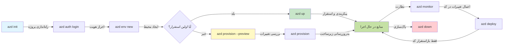
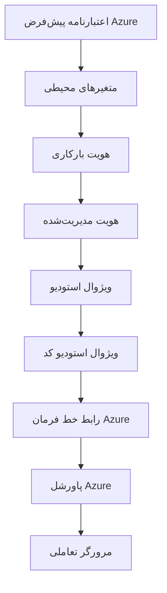

# مبانی AZD - آشنایی با Azure Developer CLI

# مبانی AZD - مفاهیم و اصول بنیادی

**هدایت فصل:**
- **📚 صفحهٔ دوره**: [AZD For Beginners](../../README.md)
- **📖 فصل فعلی**: فصل 1 - پایه و شروع سریع
- **⬅️ قبلی**: [Course Overview](../../README.md#-chapter-1-foundation--quick-start)
- **➡️ بعدی**: [Installation & Setup](installation.md)
- **🚀 فصل بعدی**: [Chapter 2: AI-First Development](../chapter-02-ai-development/microsoft-foundry-integration.md)

## مقدمه

این درس شما را با Azure Developer CLI (azd) آشنا می‌کند، یک ابزار قدرتمند خط فرمان که مسیر شما از توسعهٔ محلی تا استقرار در Azure را تسریع می‌کند. شما مفاهیم بنیادی، ویژگی‌های اصلی و این‌که چگونه azd استقرار برنامه‌های بومی ابری را ساده می‌کند، خواهید آموخت.

## اهداف یادگیری

در پایان این درس، شما خواهید:
- فهمید Azure Developer CLI چیست و هدف اصلی آن چیست
- مفاهیم اصلی قالب‌ها، محیط‌ها و سرویس‌ها را بیاموزید
- ویژگی‌های کلیدی شامل توسعه مبتنی بر قالب و Infrastructure as Code را بررسی کنید
- ساختار پروژه azd و جریان کاری آن را درک کنید
- آماده نصب و پیکربندی azd برای محیط توسعهٔ خود باشید

## خروجی‌های یادگیری

پس از تکمیل این درس، قادر خواهید بود:
- نقش azd را در جریان‌های کاری توسعهٔ مدرن ابری توضیح دهید
- اجزای ساختار پروژهٔ azd را شناسایی کنید
- توضیح دهید که چگونه قالب‌ها، محیط‌ها و سرویس‌ها با هم کار می‌کنند
- مزایای Infrastructure as Code با azd را درک کنید
- فرمان‌های مختلف azd و مقاصد آن‌ها را شناسایی کنید

## Azure Developer CLI (azd) چیست؟

Azure Developer CLI (azd) یک ابزار خط فرمان است که برای تسریع مسیر شما از توسعهٔ محلی تا استقرار در Azure طراحی شده است. این ابزار فرآیند ساخت، استقرار و مدیریت برنامه‌های بومی ابری روی Azure را ساده می‌کند.

### با azd چه چیزهایی را می‌توانید مستقر کنید؟

azd از طیف گسترده‌ای از بار کاری پشتیبانی می‌کند—و فهرست آن همچنان در حال رشد است. امروزه می‌توانید از azd برای استقرار موارد زیر استفاده کنید:

| Workload Type | Examples | Same Workflow? |
|---------------|----------|----------------|
| **Traditional applications** | Web apps, REST APIs, static sites | ✅ `azd up` |
| **Services and microservices** | Container Apps, Function Apps, multi-service backends | ✅ `azd up` |
| **AI-powered applications** | Chat apps with Microsoft Foundry Models, RAG solutions with AI Search | ✅ `azd up` |
| **Intelligent agents** | Foundry-hosted agents, multi-agent orchestrations | ✅ `azd up` |

نکتهٔ کلیدی این است که **چرخهٔ عمر azd فارغ از این‌که چه چیزی را مستقر می‌کنید یکسان باقی می‌ماند**. شما یک پروژه را مقداردهی اولیه می‌کنید، زیرساخت را فراهم می‌کنید، کد خود را مستقر می‌کنید، برنامه را مانیتور می‌کنید و پاک‌سازی می‌کنید—فرقی نمی‌کند سایت ساده‌ای باشد یا یک عامل هوش مصنوعی پیشرفته.

این تداوم به‌صورت طراحی شده وجود دارد. azd قابلیت‌های AI را به‌عنوان نوع دیگری از سرویس که برنامهٔ شما می‌تواند از آن استفاده کند در نظر می‌گیرد، نه چیزی کاملاً متفاوت. یک endpoint گفتگو که توسط Microsoft Foundry Models پشتیبانی می‌شود، از منظر azd فقط یک سرویس دیگر برای پیکربندی و استقرار است.

### 🎯 چرا از AZD استفاده کنیم؟ مقایسهٔ دنیای واقعی

بیایید استقرار یک وب‌اپ ساده با پایگاه‌داده را مقایسه کنیم:

#### ❌ بدون AZD: استقرار دستی در Azure (بیش از 30 دقیقه)

```bash
# مرحله 1: ایجاد گروه منابع
az group create --name myapp-rg --location eastus

# مرحله 2: ایجاد App Service Plan
az appservice plan create --name myapp-plan \
  --resource-group myapp-rg \
  --sku B1 --is-linux

# مرحله 3: ایجاد Web App
az webapp create --name myapp-web-unique123 \
  --resource-group myapp-rg \
  --plan myapp-plan \
  --runtime "NODE:18-lts"

# مرحله 4: ایجاد حساب Cosmos DB (۱۰-۱۵ دقیقه)
az cosmosdb create --name myapp-cosmos-unique123 \
  --resource-group myapp-rg \
  --kind MongoDB

# مرحله 5: ایجاد پایگاه داده
az cosmosdb mongodb database create \
  --account-name myapp-cosmos-unique123 \
  --resource-group myapp-rg \
  --name tododb

# مرحله 6: ایجاد مجموعه
az cosmosdb mongodb collection create \
  --account-name myapp-cosmos-unique123 \
  --resource-group myapp-rg \
  --database-name tododb \
  --name todos

# مرحله 7: دریافت رشته اتصال
CONN_STR=$(az cosmosdb keys list \
  --name myapp-cosmos-unique123 \
  --resource-group myapp-rg \
  --type connection-strings \
  --query "connectionStrings[0].connectionString" -o tsv)

# مرحله 8: پیکربندی تنظیمات برنامه
az webapp config appsettings set \
  --name myapp-web-unique123 \
  --resource-group myapp-rg \
  --settings MONGODB_URI="$CONN_STR"

# مرحله 9: فعال‌سازی لاگ‌گیری
az webapp log config --name myapp-web-unique123 \
  --resource-group myapp-rg \
  --application-logging filesystem \
  --detailed-error-messages true

# مرحله 10: راه‌اندازی Application Insights
az monitor app-insights component create \
  --app myapp-insights \
  --location eastus \
  --resource-group myapp-rg

# مرحله 11: متصل کردن App Insights به Web App
INSTRUMENTATION_KEY=$(az monitor app-insights component show \
  --app myapp-insights \
  --resource-group myapp-rg \
  --query "instrumentationKey" -o tsv)

az webapp config appsettings set \
  --name myapp-web-unique123 \
  --resource-group myapp-rg \
  --settings APPINSIGHTS_INSTRUMENTATIONKEY="$INSTRUMENTATION_KEY"

# مرحله 12: ساخت برنامه به‌صورت محلی
npm install
npm run build

# مرحله 13: ایجاد بسته انتشار
zip -r app.zip . -x "*.git*" "node_modules/*"

# مرحله 14: استقرار برنامه
az webapp deployment source config-zip \
  --resource-group myapp-rg \
  --name myapp-web-unique123 \
  --src app.zip

# مرحله 15: صبر کنید و دعا کنید که کار کند 🙏
# (تأیید خودکار وجود ندارد، آزمایش دستی لازم است)
```

**مشکلات:**
- ❌ بیش از 15 فرمان برای به‌خاطر سپردن و اجرا به‌ترتیب
- ❌ 30-45 دقیقه کار دستی
- ❌ احتمال خطا بالا (اشتباهات تایپی، پارامترهای اشتباه)
- ❌ رشته‌های اتصال در تاریخچهٔ ترمینال نمایان می‌شوند
- ❌ عدم بازگردانی خودکار در صورت وقوع خطا
- ❌ تکرارپذیری دشوار برای اعضای تیم
- ❌ هر بار متفاوت است (غیرقابل بازتولید)

#### ✅ با AZD: استقرار خودکار (5 فرمان، 10-15 دقیقه)

```bash
# مرحله ۱: مقداردهی اولیه از قالب
azd init --template todo-nodejs-mongo

# مرحله ۲: احراز هویت
azd auth login

# مرحله ۳: ایجاد محیط
azd env new dev

# مرحله ۴: پیش‌نمایش تغییرات (اختیاری اما توصیه‌شده)
azd provision --preview

# مرحله ۵: استقرار همه‌چیز
azd up

# ✨ انجام شد! همه‌چیز مستقر، پیکربندی و مانیتور شده است
```

**مزایا:**
- ✅ **5 فرمان** در مقابل بیش از 15 گام دستی
- ✅ **10-15 دقیقه** زمان کل (عمدتاً منتظر ماندن برای Azure)
- ✅ **بدون خطا** - خودکار و تست‌شده
- ✅ **مدیریت امن اسرار** از طریق Key Vault
- ✅ **بازگردانی خودکار** در صورت شکست
- ✅ **کاملاً قابل بازتولید** - همان نتیجه هر بار
- ✅ **آمادهٔ تیم** - هر کسی می‌تواند با همان فرمان‌ها استقرار دهد
- ✅ **Infrastructure as Code** - قالب‌های Bicep تحت کنترل نسخه
- ✅ **مانیتورینگ داخلی** - Application Insights به‌طور خودکار پیکربندی می‌شود

### 📊 کاهش زمان و خطا

| Metric | Manual Deployment | AZD Deployment | Improvement |
|:-------|:------------------|:---------------|:------------|
| **Commands** | 15+ | 5 | 67% کمتر |
| **Time** | 30-45 min | 10-15 min | 60% سریع‌تر |
| **Error Rate** | ~40% | <5% | 88% کاهش |
| **Consistency** | Low (manual) | 100% (automated) | کامل |
| **Team Onboarding** | 2-4 hours | 30 minutes | 75% سریع‌تر |
| **Rollback Time** | 30+ min (manual) | 2 min (automated) | 93% سریع‌تر |

## مفاهیم اصلی

### قالب‌ها
قالب‌ها پایهٔ azd هستند. آن‌ها شامل:
- **کد برنامه** - کد منبع شما و وابستگی‌ها
- **تعاریف زیرساخت** - منابع Azure تعریف‌شده در Bicep یا Terraform
- **فایل‌های پیکربندی** - تنظیمات و متغیرهای محیطی
- **اسکریپت‌های استقرار** - جریان‌های کاری استقرار خودکار

### محیط‌ها
محیط‌ها نمایانگر اهداف استقرار مختلف هستند:
- **Development** - برای تست و توسعه
- **Staging** - محیط پیش‌تولید
- **Production** - محیط تولید زنده

هر محیط نگهداری می‌کند:
- گروه منابع Azure مخصوص خود
- تنظیمات پیکربندی
- وضعیت استقرار

### سرویس‌ها
سرویس‌ها بلوک‌های سازندهٔ برنامهٔ شما هستند:
- **Frontend** - برنامه‌های وب، SPAها
- **Backend** - APIها، میکروسرویس‌ها
- **Database** - راه‌حل‌های ذخیره‌سازی داده
- **Storage** - ذخیره‌سازی فایل و blob

## ویژگی‌های کلیدی

### 1. توسعه مبتنی بر قالب
```bash
# قالب‌های موجود را مرور کنید
azd template list

# از یک قالب مقداردهی اولیه کنید
azd init --template <template-name>
```

### 2. Infrastructure as Code
- **Bicep** - زبان دامنه-خاص Azure
- **Terraform** - ابزار زیرساخت چندابری
- **ARM Templates** - قالب‌های Azure Resource Manager

### 3. جریان‌های کاری یکپارچه
```bash
# گردش کار کامل استقرار
azd up            # تأمین و استقرار — این برای راه‌اندازی اولیه بدون دخالت دستی است

# 🧪 جدید: پیش‌نمایش تغییرات زیرساخت قبل از استقرار (ایمن)
azd provision --preview    # شبیه‌سازی استقرار زیرساخت بدون اعمال تغییرات

azd provision     # برای ایجاد منابع Azure، اگر زیرساخت را به‌روزرسانی می‌کنید از این استفاده کنید
azd deploy        # کد برنامه را مستقر کنید یا پس از به‌روزرسانی مجدداً مستقر کنید
azd down          # پاک‌سازی منابع
```

#### 🛡️ برنامه‌ریزی ایمن زیرساخت با پیش‌نمایش
دستور `azd provision --preview` یک تغییر بزرگ برای استقرارهای ایمن است:
- **تحلیل خشک** - نشان می‌دهد چه چیزی ایجاد، تغییر یا حذف خواهد شد
- **بدون ریسک** - هیچ تغییری واقعاً در محیط Azure شما اعمال نمی‌شود
- **همکاری تیمی** - نتایج پیش‌نمایش را قبل از استقرار به اشتراک بگذارید
- **برآورد هزینه** - هزینهٔ منابع را قبل از تعهد درک کنید

```bash
# نمونه‌ای از گردش‌کار پیش‌نمایش
azd provision --preview           # ببینید چه تغییراتی رخ خواهد داد
# خروجی را بازبینی کنید، با تیم بحث کنید
azd provision                     # تغییرات را با اطمینان اعمال کنید
```

### 📊 نمای تصویری: جریان توسعهٔ AZD


```mermaid
graph LR
    A[azd init] -->|راه‌اندازی پروژه| B[azd auth login]
    B -->|احراز هویت| C[azd env new]
    C -->|ایجاد محیط| D{آیا اولین استقرار؟}
    D -->|بله| E[azd up]
    D -->|خیر| F[azd provision --preview]
    F -->|بررسی تغییرات| G[azd provision]
    E -->|پیکربندی و استقرار| H[منابع در حال اجرا]
    G -->|به‌روزرسانی زیرساخت| H
    H -->|نظارت| I[azd monitor]
    I -->|اعمال تغییرات در کد| J[azd deploy]
    J -->|فقط بازاستقرار کد| H
    H -->|پاک‌سازی| K[azd down]
    
    style A fill:#e1f5fe
    style E fill:#c8e6c9
    style F fill:#fff9c4
    style H fill:#c5e1a5
    style K fill:#ffcdd2
```
**توضیح گردش کار:**
1. **Init** - شروع با قالب یا پروژهٔ جدید
2. **Auth** - احراز هویت با Azure
3. **Environment** - ایجاد محیط استقرار ایزوله
4. **Preview** - 🆕 همیشه ابتدا تغییرات زیرساخت را پیش‌نمایش کنید (روش ایمن)
5. **Provision** - ایجاد/به‌روزرسانی منابع Azure
6. **Deploy** - ارسال کد برنامهٔ خود
7. **Monitor** - مشاهدهٔ عملکرد برنامه
8. **Iterate** - اعمال تغییرات و مجدداً استقرار کد
9. **Cleanup** - حذف منابع پس از اتمام

### 4. مدیریت محیط
```bash
# ایجاد و مدیریت محیط‌ها
azd env new <environment-name>
azd env select <environment-name>
azd env list
```

### 5. افزونه‌ها و فرمان‌های AI

azd از سیستم افزونه برای افزودن قابلیت‌ها فراتر از CLI اصلی استفاده می‌کند. این به‌ویژه برای بارهای کاری AI مفید است:

```bash
# فهرست افزونه‌های موجود
azd extension list

# نصب افزونهٔ Foundry agents
azd extension install azure.ai.agents

# راه‌اندازی پروژهٔ عامل هوش مصنوعی از روی مانیفست
azd ai agent init -m agent-manifest.yaml

# راه‌اندازی سرور MCP برای توسعهٔ با کمک هوش مصنوعی (آلفا)
azd mcp start
```

> افزونه‌ها به‌صورت مفصل در [Chapter 2: AI-First Development](../chapter-02-ai-development/agents.md) و مرجع [AZD AI CLI Commands](../chapter-08-production/production-ai-practices.md#azd-ai-cli-commands-and-extensions) پوشش داده شده‌اند.

## 📁 ساختار پروژه

یک ساختار معمولی پروژهٔ azd:
```
my-app/
├── .azd/                    # azd configuration
│   └── config.json
├── .azure/                  # Azure deployment artifacts
├── .devcontainer/          # Development container config
├── .github/workflows/      # GitHub Actions
├── .vscode/               # VS Code settings
├── infra/                 # Infrastructure code
│   ├── main.bicep        # Main infrastructure template
│   ├── main.parameters.json
│   └── modules/          # Reusable modules
├── src/                  # Application source code
│   ├── api/             # Backend services
│   └── web/             # Frontend application
├── azure.yaml           # azd project configuration
└── README.md
```

## 🔧 فایل‌های پیکربندی

### azure.yaml
فایل پیکربندی اصلی پروژه:
```yaml
name: my-awesome-app
metadata:
  template: my-template@1.0.0

services:
  web:
    project: ./src/web
    language: js
    host: appservice
  api:
    project: ./src/api
    language: js
    host: appservice

hooks:
  preprovision:
    shell: pwsh
    run: echo "Preparing to provision..."
```

### .azure/config.json
پیکربندی مخصوص محیط:
```json
{
  "version": 1,
  "defaultEnvironment": "dev",
  "environments": {
    "dev": {
      "subscriptionId": "your-subscription-id",
      "location": "eastus"
    }
  }
}
```

## 🎪 جریان‌های کاری متداول با تمرین‌های عملی

> **💡 نکتهٔ یادگیری:** این تمرین‌ها را به ترتیب دنبال کنید تا مهارت‌های AZD خود را به‌تدریج بسازید.

### 🎯 تمرین 1: مقداردهی اولیهٔ اولین پروژهٔ خود

**هدف:** ایجاد یک پروژه AZD و بررسی ساختار آن

**مراحل:**
```bash
# از یک قالب اثبات‌شده استفاده کنید
azd init --template todo-nodejs-mongo

# فایل‌های تولیدشده را بررسی کنید
ls -la  # تمام فایل‌ها از جمله فایل‌های مخفی را مشاهده کنید

# فایل‌های کلیدی ایجادشده:
# - azure.yaml (پیکربندی اصلی)
# - infra/ (کد زیرساخت)
# - src/ (کد برنامه)
```

**✅ موفقیت:** شما دارای دایرکتوری‌های azure.yaml، infra/ و src/ هستید

---

### 🎯 تمرین 2: استقرار در Azure

**هدف:** تکمیل استقرار انتها به انتها

**مراحل:**
```bash
# 1. احراز هویت
az login && azd auth login

# 2. ایجاد محیط
azd env new dev
azd env set AZURE_LOCATION eastus

# 3. پیش‌نمایش تغییرات (توصیه می‌شود)
azd provision --preview

# 4. استقرار همه‌چیز
azd up

# 5. تأیید استقرار
azd show    # نشانی اینترنتی برنامه خود را مشاهده کنید
```

**زمان مورد انتظار:** 10-15 دقیقه  
**✅ موفقیت:** URL برنامه در مرورگر باز می‌شود

---

### 🎯 تمرین 3: چندین محیط

**هدف:** استقرار در dev و staging

**مراحل:**
```bash
# اگر قبلاً dev دارید، staging را ایجاد کنید
azd env new staging
azd env set AZURE_LOCATION westus2
azd up

# بین آن‌ها جابجا شوید
azd env list
azd env select dev
```

**✅ موفقیت:** دو گروه منابع جداگانه در Azure Portal

---

### 🛡️ پاک‌سازی کامل: `azd down --force --purge`

وقتی نیاز به بازنشانی کامل دارید:

```bash
azd down --force --purge
```

**چه کاری انجام می‌دهد:**
- `--force`: بدون درخواست تأیید
- `--purge`: حذف تمام وضعیت محلی و منابع Azure

**زمان استفاده:**
- شکست در میانهٔ استقرار
- تغییر پروژه‌ها
- نیاز به شروعی تازه

---

## 🎪 مرجع جریان کاری اصلی

### شروع یک پروژهٔ جدید
```bash
# روش ۱: استفاده از قالب موجود
azd init --template todo-nodejs-mongo

# روش ۲: شروع از ابتدا
azd init

# روش ۳: استفاده از دایرکتوری جاری
azd init .
```

### چرخهٔ توسعه
```bash
# راه‌اندازی محیط توسعه
azd auth login
azd env new dev
azd env select dev

# همه‌چیز را مستقر کنید
azd up

# تغییرات را اعمال کرده و مجدداً مستقر کنید
azd deploy

# پس از اتمام، پاک‌سازی کنید
azd down --force --purge # دستور در Azure Developer CLI یک **بازنشانی سخت** برای محیط شما است — که به‌ویژه هنگام عیب‌یابی استقرارهای ناموفق، پاک‌سازی منابع یتیم یا آماده‌سازی برای استقرار مجدد تازه مفید است.
```

## درک `azd down --force --purge`
دستور `azd down --force --purge` روشی قوی برای نابودی کامل محیط azd و تمام منابع مرتبط است. در این‌جا شکسته‌شدهٔ عملکرد هر فلگ آمده است:
```
--force
```
- از درخواست‌های تأیید عبور می‌کند.
- مفید برای اتوماسیون یا اسکریپت‌نویسی که ورودی دستی ممکن نیست.
- تضمین می‌کند فرایند teardown بدون وقفه ادامه یابد، حتی اگر CLI ناهماهنگی‌ها را تشخیص دهد.

```
--purge
```
حذف می‌کند **تمام متادیتای مرتبط**، از جمله:
Environment state
Local `.azure` folder
Cached deployment info
از به‌یادسپاری azd از استقرارهای قبلی جلوگیری می‌کند، که می‌تواند مشکلاتی مانند عدم تطابق گروه‌های منابع یا ارجاعات رجیستری قدیمی ایجاد کند.


### چرا هر دو را استفاده کنیم؟
وقتی در اجرای `azd up` به دلیل وضعیت باقی‌مانده یا استقرارهای ناقص به بن‌بست می‌خورید، این ترکیب اطمینان می‌دهد که یک **صفحهٔ پاک** دارید.

این به‌ویژه پس از حذف دستی منابع در پورتال Azure یا هنگام تغییر قالب‌ها، محیط‌ها یا قراردادهای نام‌گذاری گروه منابع مفید است.


### مدیریت چندین محیط
```bash
# ایجاد محیط مرحله‌بندی
azd env new staging
azd env select staging
azd up

# بازگشت به محیط توسعه
azd env select dev

# مقایسه محیط‌ها
azd env list
```

## 🔐 احراز هویت و اعتبارنامه‌ها

درک احراز هویت برای استقرارهای موفق azd حیاتی است. Azure از روش‌های متعدد احراز هویت استفاده می‌کند و azd از همان زنجیرهٔ اعتبارنامه‌ای که سایر ابزارهای Azure استفاده می‌کنند بهره می‌برد.

### Azure CLI Authentication (`az login`)

قبل از استفاده از azd، باید با Azure احراز هویت کنید. رایج‌ترین روش استفاده از Azure CLI است:

```bash
# ورود تعاملی (مرورگر را باز می‌کند)
az login

# ورود با مستأجر مشخص
az login --tenant <tenant-id>

# ورود با شناسهٔ سرویس (Service Principal)
az login --service-principal -u <app-id> -p <password> --tenant <tenant-id>

# بررسی وضعیت ورود فعلی
az account show

# فهرست اشتراک‌های موجود
az account list --output table

# تنظیم اشتراک پیش‌فرض
az account set --subscription <subscription-id>
```

### جریان احراز هویت
1. **ورود تعاملی**: مرورگر پیش‌فرض شما را برای احراز هویت باز می‌کند
2. **Device Code Flow**: برای محیط‌هایی که دسترسی به مرورگر ندارند
3. **Service Principal**: برای اتوماسیون و سناریوهای CI/CD
4. **Managed Identity**: برای برنامه‌های میزبانی‌شده در Azure

### DefaultAzureCredential Chain

`DefaultAzureCredential` یک نوع اعتبارنامه است که تجربهٔ احراز هویت را با تلاش خودکار برای منابع مختلف اعتبار در یک ترتیب مشخص ساده می‌کند:

#### ترتیب زنجیرهٔ اعتبار

```mermaid
graph TD
    A[اعتبارنامه پیش‌فرض Azure] --> B[متغیرهای محیطی]
    B --> C[هویت بارکاری]
    C --> D[هویت مدیریت‌شده]
    D --> E[ویژوال استودیو]
    E --> F[ویژوال استودیو کد]
    F --> G[رابط خط فرمان Azure]
    G --> H[پاورشل Azure]
    H --> I[مرورگر تعاملی]
```
#### 1. متغیرهای محیطی
```bash
# متغیرهای محیطی را برای Service Principal تنظیم کنید
export AZURE_CLIENT_ID="<app-id>"
export AZURE_CLIENT_SECRET="<password>"
export AZURE_TENANT_ID="<tenant-id>"
```

#### 2. Workload Identity (Kubernetes/GitHub Actions)
به‌طور خودکار در موارد زیر استفاده می‌شود:
- Azure Kubernetes Service (AKS) با Workload Identity
- GitHub Actions با فدراسیون OIDC
- سایر سناریوهای هویت فدره‌شده

#### 3. Managed Identity
برای منابع Azure مانند:
- Virtual Machines
- App Service
- Azure Functions
- Container Instances

```bash
# بررسی می‌کند که آیا در منبع Azure با هویت مدیریت‌شده اجرا می‌شود
az account show --query "user.type" --output tsv
# بازمی‌گرداند: "servicePrincipal" در صورت استفاده از هویت مدیریت‌شده
```

#### 4. یکپارچه‌سازی ابزارهای توسعه
- **Visual Studio**: به‌طور خودکار از حساب واردشده استفاده می‌کند
- **VS Code**: از اعتبارنامه‌های افزونهٔ Azure Account استفاده می‌کند
- **Azure CLI**: از اعتبارنامه‌های `az login` استفاده می‌کند (رایج‌ترین برای توسعهٔ محلی)

### تنظیم احراز هویت AZD

```bash
# روش 1: استفاده از Azure CLI (توصیه‌شده برای توسعه)
az login
azd auth login  # از اعتبارنامه‌های موجود Azure CLI استفاده می‌کند

# روش 2: احراز هویت مستقیم azd
azd auth login --use-device-code  # برای محیط‌های بدون رابط کاربری

# روش 3: بررسی وضعیت احراز هویت
azd auth login --check-status

# روش 4: خروج و احراز هویت مجدد
azd auth logout
azd auth login
```

### بهترین شیوه‌های احراز هویت

#### برای توسعهٔ محلی
```bash
# 1. ورود با Azure CLI
az login

# 2. تأیید درستی اشتراک
az account show
az account set --subscription "Your Subscription Name"

# 3. استفاده از azd با اعتبارنامه‌های موجود
azd auth login
```

#### برای خط لوله‌های CI/CD
```yaml
# GitHub Actions example
- name: Azure Login
  uses: azure/login@v1
  with:
    creds: ${{ secrets.AZURE_CREDENTIALS }}

- name: Deploy with azd
  run: |
    azd auth login --client-id ${{ secrets.AZURE_CLIENT_ID }} \
                    --client-secret ${{ secrets.AZURE_CLIENT_SECRET }} \
                    --tenant-id ${{ secrets.AZURE_TENANT_ID }}
    azd up --no-prompt
```

#### برای محیط‌های تولید
- از **Managed Identity** هنگام اجرای روی منابع Azure استفاده کنید
- از **Service Principal** برای سناریوهای اتوماسیون استفاده کنید
- از ذخیرهٔ اعتبارنامه‌ها در کد یا فایل‌های پیکربندی خودداری کنید
- از **Azure Key Vault** برای پیکربندی‌های حساس استفاده کنید

### مسائل رایج احراز هویت و راه‌حل‌ها

#### مشکل: "No subscription found"
```bash
# راه‌حل: اشتراک پیش‌فرض را تنظیم کنید
az account list --output table
az account set --subscription "<subscription-id>"
azd env set AZURE_SUBSCRIPTION_ID "<subscription-id>"
```

#### مشکل: "Insufficient permissions"
```bash
# راه‌حل: نقش‌های مورد نیاز را بررسی و اختصاص دهید
az role assignment list --assignee $(az account show --query user.name --output tsv)

# نقش‌های مورد نیاز رایج:
# - مشارکت‌کننده (برای مدیریت منابع)
# - مدیر دسترسی کاربران (برای تخصیص نقش‌ها)
```

#### مشکل: "Token expired"
```bash
# راه‌حل: مجدداً احراز هویت کنید
az logout
az login
azd auth logout
azd auth login
```

### احراز هویت در سناریوهای مختلف

#### توسعهٔ محلی
```bash
# حساب توسعه فردی
az login
azd auth login
```

#### توسعهٔ تیمی
```bash
# برای سازمان از یک تِنانت مشخص استفاده کنید
az login --tenant contoso.onmicrosoft.com
azd auth login
```

#### سناریوهای چندمستاجری
```bash
# تغییر بین مستأجران
az login --tenant tenant1.onmicrosoft.com
# استقرار در مستأجر ۱
azd up

az login --tenant tenant2.onmicrosoft.com  
# استقرار در مستأجر ۲
azd up
```

### ملاحظات امنیتی
1. **ذخیره اعتبارنامه**: هرگز اعتبارنامه‌ها را در کد منبع ذخیره نکنید
2. **محدودسازی دامنه**: از اصل حداقل امتیاز برای service principals استفاده کنید
3. **گردش توکن**: به‌صورت منظم اسرار service principal را بازتعریف (rotate) کنید
4. **ردیابی حسابرسی**: فعالیت‌های احراز هویت و استقرار را مانیتور کنید
5. **امنیت شبکه**: در صورت امکان از endpoints خصوصی استفاده کنید

### رفع اشکال احراز هویت

```bash
# عیب‌یابی مشکلات احراز هویت
azd auth login --check-status
az account show
az account get-access-token

# دستورات تشخیصی رایج
whoami                          # زمینه کاربر فعلی
az ad signed-in-user show      # جزئیات کاربر Azure AD
az group list                  # آزمایش دسترسی به منبع
```

## درک `azd down --force --purge`

### کشف
```bash
azd template list              # مرور قالب‌ها
azd template show <template>   # جزئیات قالب
azd init --help               # گزینه‌های مقداردهی اولیه
```

### مدیریت پروژه
```bash
azd show                     # نمای کلی پروژه
azd env show                 # محیط فعلی
azd config list             # تنظیمات پیکربندی
```

### مانیتورینگ
```bash
azd monitor                  # مانیتورینگ پورتال Azure را باز کنید
azd monitor --logs           # لاگ‌های برنامه را مشاهده کنید
azd monitor --live           # متریک‌های زنده را مشاهده کنید
azd pipeline config          # CI/CD را راه‌اندازی کنید
```

## بهترین شیوه‌ها

### 1. از نام‌های معنادار استفاده کنید
```bash
# خوب
azd env new production-east
azd init --template web-app-secure

# اجتناب کنید
azd env new env1
azd init --template template1
```

### 2. از قالب‌ها استفاده کنید
- از قالب‌های موجود شروع کنید
- برای نیازهای خود سفارشی‌سازی کنید
- قالب‌های قابل استفاده مجدد برای سازمان خود ایجاد کنید

### 3. جداسازی محیط‌ها
- از محیط‌های جداگانه برای dev/staging/prod استفاده کنید
- هرگز مستقیماً از ماشین محلی به تولید استقرار ندهید
- از خطوط CI/CD برای استقرار در تولید استفاده کنید

### 4. مدیریت پیکربندی
- برای داده‌های حساس از متغیرهای محیطی استفاده کنید
- پیکربندی را در کنترل نسخه نگه دارید
- تنظیمات وابسته به محیط را مستند کنید

## پیشرفت یادگیری

### مبتدی (هفته 1-2)
1. azd را نصب کرده و احراز هویت کنید
2. یک قالب ساده را مستقر کنید
3. ساختار پروژه را درک کنید
4. فرمان‌های پایه را یاد بگیرید (up, down, deploy)

### متوسط (هفته 3-4)
1. قالب‌ها را سفارشی کنید
2. چندین محیط را مدیریت کنید
3. کد زیرساخت را درک کنید
4. خطوط لوله CI/CD را راه‌اندازی کنید

### پیشرفته (هفته 5+)
1. قالب‌های سفارشی ایجاد کنید
2. الگوهای پیشرفته زیرساخت
3. استقرار در چند منطقه
4. پیکربندی‌های سطح سازمانی

## گام‌های بعدی

**📖 ادامه فصل ۱:**
- [نصب و راه‌اندازی](installation.md) - azd را نصب و پیکربندی کنید
- [پروژه اول شما](first-project.md) - آموزش عملی کامل
- [راهنمای پیکربندی](configuration.md) - گزینه‌های پیکربندی پیشرفته

**🎯 آماده فصل بعدی؟**
- [فصل ۲: توسعه مبتنی بر هوش مصنوعی](../chapter-02-ai-development/microsoft-foundry-integration.md) - شروع به ساخت برنامه‌های هوش مصنوعی کنید

## منابع اضافی

- [مروری بر Azure Developer CLI](https://learn.microsoft.com/en-us/azure/developer/azure-developer-cli/)
- [گالری قالب‌ها](https://azure.github.io/awesome-azd/)
- [نمونه‌های جامعه](https://github.com/Azure-Samples)

---

## 🙋 سوالات متداول

### سوالات عمومی

**س: تفاوت AZD و Azure CLI چیست؟**

پاسخ: Azure CLI (`az`) برای مدیریت منابع جداگانه Azure است. AZD (`azd`) برای مدیریت کل برنامه‌ها است:

```bash
# Azure CLI - مدیریت منابع سطح پایین
az webapp create --name myapp --resource-group rg
az sql server create --name myserver --resource-group rg
# ...به دستورات بیشتری نیاز است

# AZD - مدیریت در سطح برنامه
azd up  # کل برنامه را همراه با تمام منابع مستقر می‌کند
```

**اینطور تصور کنید:**
- `az` = عملیات روی قطعات لگو به‌طور جداگانه
- `azd` = کار با مجموعه‌های کامل لگو

---

**س: آیا برای استفاده از AZD باید Bicep یا Terraform بلد باشم؟**

پاسخ: نه! با قالب‌ها شروع کنید:
```bash
# از قالب موجود استفاده کنید — نیازی به آشنایی با IaC نیست
azd init --template todo-nodejs-mongo
azd up
```

می‌توانید بعداً Bicep را برای سفارشی‌سازی زیرساخت یاد بگیرید. قالب‌ها مثال‌های کاری برای یادگیری فراهم می‌کنند.

---

**س: هزینه اجرای قالب‌های AZD چقدر است؟**

پاسخ: هزینه‌ها بسته به قالب متفاوت است. اکثر قالب‌های توسعه ماهیانه $50-150 هزینه دارند:

```bash
# قبل از استقرار هزینه‌ها را پیش‌نمایش کنید
azd provision --preview

# همیشه وقتی استفاده نمی‌کنید پاکسازی کنید
azd down --force --purge  # تمام منابع را حذف می‌کند
```

**نکته حرفه‌ای:** از لایه‌های رایگان در صورت وجود استفاده کنید:
- App Service: لایه F1 (رایگان)
- Microsoft Foundry Models: Azure OpenAI، 50,000 توکن در ماه رایگان
- Cosmos DB: لایه رایگان 1000 RU/s

---

**س: آیا می‌توانم از AZD با منابع موجود Azure استفاده کنم؟**

پاسخ: بله، اما راحت‌تر است از ابتدا شروع کنید. AZD زمانی بهتر کار می‌کند که چرخه عمر کامل را مدیریت کند. برای منابع موجود:
```bash
# گزینهٔ ۱: وارد کردن منابع موجود (پیشرفته)
azd init
# سپس پوشهٔ infra/ را تغییر دهید تا به منابع موجود ارجاع دهد

# گزینهٔ ۲: شروعی تازه (توصیه‌شده)
azd init --template matching-your-stack
azd up  # یک محیط جدید ایجاد می‌کند
```

---

**س: چگونه پروژه‌ام را با هم‌تیمی‌ها به اشتراک بگذارم؟**

پاسخ: پروژه AZD را به Git commit کنید (اما پوشه .azure را کامیت نکنید):
```bash
# قبلاً به‌صورت پیش‌فرض در .gitignore قرار دارد
.azure/        # شامل اسرار و داده‌های محیطی است
*.env          # متغیرهای محیطی

# سپس اعضای تیم:
git clone <your-repo>
azd auth login
azd env new <their-name>-dev
azd up
```

همه از همان قالب‌ها زیرساخت یکسانی دریافت می‌کنند.

---

### سوالات رفع اشکال

**س: "azd up" نیمه‌کاره شکست خورد. چه کار کنم؟**

پاسخ: خطا را بررسی کنید، آن را اصلاح کنید، سپس دوباره تلاش کنید:
```bash
# مشاهده گزارش‌های دقیق
azd show

# رفع اشکال‌های رایج:

# 1. در صورت عبور از سهمیه:
azd env set AZURE_LOCATION "westus2"  # از منطقه‌ای دیگر امتحان کنید

# 2. در صورت تداخل نام منبع:
azd down --force --purge  # شروع از صفر
azd up  # دوباره تلاش کنید

# 3. در صورت انقضای احراز هویت:
az login
azd auth login
azd up
```

**متداول‌ترین مشکل:** اشتراک Azure اشتباه انتخاب شده است
```bash
az account list --output table
az account set --subscription "<correct-subscription>"
```

---

**س: چگونه فقط تغییرات کد را بدون تهیه مجدد منابع استقرار دهم؟**

پاسخ: به جای `azd up` از `azd deploy` استفاده کنید:
```bash
azd up          # اولین بار: فراهم‌سازی و استقرار (کند)

# تغییرات کد را اعمال کنید...

azd deploy      # دفعات بعدی: فقط استقرار (سریع)
```

مقایسه سرعت:
- `azd up`: 10-15 دقیقه (زیرساخت را فراهم می‌کند)
- `azd deploy`: 2-5 دقیقه (فقط کد)

---

**س: آیا می‌توانم قالب‌های زیرساخت را سفارشی کنم؟**

پاسخ: بله! فایل‌های Bicep را در `infra/` ویرایش کنید:
```bash
# بعد از اجرای azd init
cd infra/
code main.bicep  # ویرایش در VS Code

# پیش‌نمایش تغییرات
azd provision --preview

# اعمال تغییرات
azd provision
```

**نکته:** از کوچک شروع کنید - ابتدا SKUها را تغییر دهید:
```bicep
// infra/main.bicep
sku: {
  name: 'B1'  // Change to 'P1V2' for production
}
```

---

**س: چگونه همه چیز را که AZD ساخته حذف کنم؟**

پاسخ: یک دستور همه منابع را حذف می‌کند:
```bash
azd down --force --purge

# این موارد را حذف می‌کند:
# - تمام منابع Azure
# - گروه منابع
# - وضعیت محیط محلی
# - داده‌های استقرار کش‌شده
```

**همیشه این را اجرا کنید وقتی:**
- وقتی آزمایش یک قالب تمام شده است
- هنگام انتقال به پروژه‌ای دیگر
- وقتی می‌خواهید از صفر شروع کنید

**صرفه‌جویی هزینه:** حذف منابع استفاده‌نشده = $0 هزینه

---

**س: اگر تصادفاً منابع را در Azure Portal حذف کردم چه؟**

پاسخ: وضعیت AZD ممکن است هماهنگ نباشد. رویکرد پاک‌سازی کامل:
```bash
# ۱. حذف وضعیت محلی
azd down --force --purge

# ۲. شروع از نو
azd up

# گزینهٔ جایگزین: اجازه دهید AZD تشخیص دهد و اصلاح کند
azd provision  # منابع مفقود را ایجاد می‌کند
```

---

### سوالات پیشرفته

**س: آیا می‌توانم از AZD در خطوط CI/CD استفاده کنم؟**

پاسخ: بله! مثال GitHub Actions:
```yaml
# .github/workflows/deploy.yml
name: Deploy with AZD

on:
  push:
    branches: [main]

jobs:
  deploy:
    runs-on: ubuntu-latest
    steps:
      - uses: actions/checkout@v2
      
      - name: Install azd
        run: curl -fsSL https://aka.ms/install-azd.sh | bash
      
      - name: Azure Login
        run: |
          azd auth login \
            --client-id ${{ secrets.AZURE_CLIENT_ID }} \
            --client-secret ${{ secrets.AZURE_CLIENT_SECRET }} \
            --tenant-id ${{ secrets.AZURE_TENANT_ID }}
      
      - name: Deploy
        run: azd up --no-prompt
```

---

**س: چگونه اسرار و داده‌های حساس را مدیریت کنم؟**

پاسخ: AZD به‌صورت خودکار با Azure Key Vault ادغام می‌شود:
```bash
# مقادیر محرمانه در Key Vault ذخیره می‌شوند، نه در کد
azd env set DATABASE_PASSWORD "$(openssl rand -base64 32)"

# AZD به‌طور خودکار:
# 1. Key Vault را ایجاد می‌کند
# 2. مقدار محرمانه را ذخیره می‌کند
# 3. از طریق Managed Identity به اپلیکیشن دسترسی می‌دهد
# 4. در زمان اجرا تزریق می‌کند
```

**هرگز commit نکنید:**
- پوشه `.azure/` (حاوی داده‌های محیط)
- فایل‌های `.env` (اسرار محلی)
- رشته‌های اتصال

---

**س: آیا می‌توانم به چندین منطقه استقرار دهم؟**

پاسخ: بله، برای هر منطقه یک محیط ایجاد کنید:
```bash
# محیط شرق ایالات متحده
azd env new prod-eastus
azd env set AZURE_LOCATION eastus
azd up

# محیط اروپای غربی
azd env new prod-westeurope
azd env set AZURE_LOCATION westeurope
azd up

# هر محیط مستقل است
azd env list
```

برای اپلیکیشن‌های واقعاً چندمنطقه‌ای، قالب‌های Bicep را برای استقرار هم‌زمان در چند منطقه سفارشی کنید.

---

**س: اگر گیر کردم کجا می‌توانم کمک بگیرم؟**

1. **مستندات AZD:** https://learn.microsoft.com/azure/developer/azure-developer-cli/
2. **گزارش‌های GitHub:** https://github.com/Azure/azure-dev/issues
3. **Discord:** [Azure Discord](https://discord.gg/microsoft-azure) - کانال #azure-developer-cli
4. **Stack Overflow:** تگ `azure-developer-cli`
5. **این دوره:** [راهنمای عیب‌یابی](../chapter-07-troubleshooting/common-issues.md)

**نکته حرفه‌ای:** قبل از پرسیدن، اجرا کنید:
```bash
azd show       # نمایش وضعیت فعلی
azd version    # نمایش نسخه شما
```
این اطلاعات را در سوال خود بگنجانید تا کمک سریع‌تری دریافت کنید.

---

## 🎓 مرحله بعدی چیست؟

اکنون اصول AZD را درک می‌کنید. مسیر خود را انتخاب کنید:

### 🎯 برای مبتدیان:
1. **بعدی:** [نصب و راه‌اندازی](installation.md) - AZD را روی ماشین خود نصب کنید
2. **سپس:** [پروژه اول شما](first-project.md) - اولین برنامه خود را مستقر کنید
3. **تمرین:** تمام 3 تمرین این درس را کامل کنید

### 🚀 برای توسعه‌دهندگان هوش مصنوعی:
1. **برو به:** [فصل ۲: توسعه مبتنی بر هوش مصنوعی](../chapter-02-ai-development/microsoft-foundry-integration.md)
2. **استقرار:** با `azd init --template get-started-with-ai-chat` شروع کنید
3. **یاد بگیرید:** هم‌زمان با استقرار، بسازید

### 🏗️ برای توسعه‌دهندگان باتجربه:
1. **مرور:** [راهنمای پیکربندی](configuration.md) - تنظیمات پیشرفته
2. **کاوش:** [زیرساخت به‌عنوان کد](../chapter-04-infrastructure/provisioning.md) - بررسی عمیق Bicep
3. **بسازید:** قالب‌های سفارشی برای پشته خود ایجاد کنید

---

**ناوبری فصل:**
- **📚 خانه دوره**: [AZD برای مبتدیان](../../README.md)
- **📖 فصل جاری**: فصل 1 - بنیاد و شروع سریع  
- **⬅️ قبلی**: [مرور دوره](../../README.md#-chapter-1-foundation--quick-start)
- **➡️ بعدی**: [نصب و راه‌اندازی](installation.md)
- **🚀 فصل بعدی**: [فصل ۲: توسعه مبتنی بر هوش مصنوعی](../chapter-02-ai-development/microsoft-foundry-integration.md)

---

<!-- CO-OP TRANSLATOR DISCLAIMER START -->
**Disclaimer**:
این سند با استفاده از سرویس ترجمهٔ هوش مصنوعی [Co-op Translator](https://github.com/Azure/co-op-translator) ترجمه شده است. در حالی که ما در تلاش برای دقت هستیم، لطفاً توجه داشته باشید که ترجمه‌های خودکار ممکن است دارای خطاها یا نادرستی‌هایی باشند. سند اصلی به زبان مادری خود باید به‌عنوان منبع معتبر تلقی شود. برای اطلاعات حیاتی، ترجمهٔ حرفه‌ای انسانی توصیه می‌شود. ما در قبال هرگونه سوءتفاهم یا تفسیر نادرستی که از استفاده از این ترجمه ناشی شود، مسئول نیستیم.
<!-- CO-OP TRANSLATOR DISCLAIMER END -->