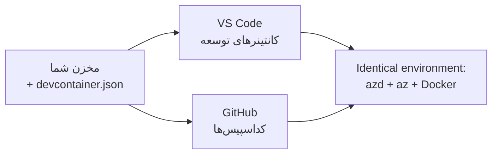

# کانتینرهای توسعه و GitHub Codespaces برای azd

**ناوبری فصل:**
- **📚 صفحه اصلی دوره**: [AZD برای مبتدیان](../../README.md)
- **📖 فصل فعلی**: فصل ۱ - مبانی و شروع سریع
- **⬅️ قبلی**: [اپلیکیشن خودت را بیاور](bring-your-own-app.md)
- **🚀 فصل بعدی**: [فصل ۲: توسعه با محوریت هوش مصنوعی](../chapter-02-ai-development/README.md)

> تأیید شده با `azd 1.27.1` در ژوئیه ۲۰۲۶.

## مقدمه

نصب azd، زمان اجرای زبان مناسب، داکر، و Azure CLI روی هر دستگاه کاری خسته‌کننده است — و این اولین دلیل شکست یک آموزش که "روی دستگاه من کار می‌کند" برای شخص دیگری است. یک **کانتینر توسعه** این مشکل را با توصیف کل زنجیره ابزار شما در یک فایل حل می‌کند. هر کسی که پروژه را در VS Code یا GitHub Codespaces باز کند، دقیقاً همان محیط را دریافت می‌کند، با azd که قبلاً نصب شده است. این درس به شما نشان می‌دهد چگونه یکی به پروژه اضافه کنید.

## اهداف یادگیری

تا پایان این درس، می‌توانید:
- بفهمید کانتینر توسعه چیست و چرا در استفاده از azd مفید است
- یک فایل حداقلی `.devcontainer/devcontainer.json` به پروژه اضافه کنید
- azd، Azure CLI، و داکر را از طریق *ویژگی‌های* کانتینر توسعه بگنجانید
- پروژه را در GitHub Codespaces یا VS Code باز کنید

## نتایج یادگیری

پس از اتمام این درس خواهید توانست:
- یک `devcontainer.json` برای پروژه azd بنویسید
- بدون نصب‌های دستی azd و ابزارهای Azure را اضافه کنید
- دستور `azd up` را از داخل یک کانتینر یا Codespace اجرا کنید

---

## کانتینر توسعه چیست؟

کانتینر توسعه محیط توسعه مبتنی بر داکری است که توسط فایل `.devcontainer/devcontainer.json` در مخزن شما تعریف شده است. وقتی پروژه را باز می‌کنید:

- **VS Code** (با افزونه Dev Containers) کانتینر را ساخته و به آن متصل می‌شود.
- **GitHub Codespaces** همان کانتینر را در فضای ابری ساخته و یک ویرایشگر مبتنی بر مرورگر به شما می‌دهد.

در هر صورت، همه مشارکت‌کنندگان همان ابزارهای یکسان را دارند — بدون نیاز به عیب‌یابی مثل "آیا azd را نصب کردی؟".



---

## گام ۱: ایجاد فایل devcontainer

فایل `.devcontainer/devcontainer.json` را در ریشه پروژه خود ایجاد کنید:

```json
{
  "name": "azd-project",
  "image": "mcr.microsoft.com/devcontainers/base:bookworm",
  "features": {
    "ghcr.io/devcontainers/features/azure-cli:1": {},
    "ghcr.io/azure/azure-dev/azd:latest": {},
    "ghcr.io/devcontainers/features/docker-in-docker:2": {},
    "ghcr.io/devcontainers/features/node:1": {}
  },
  "customizations": {
    "vscode": {
      "extensions": [
        "ms-azuretools.azure-dev",
        "ms-azuretools.vscode-bicep"
      ]
    }
  },
  "forwardPorts": [3000],
  "postCreateCommand": "azd version"
}
```

عملکرد هر بخش:

| کلید | هدف |
|-----|---------|
| `image` | سیستم عامل پایه برای کانتینر |
| `features` | نصب‌کننده‌های پیش‌ساخته — اینجا: Azure CLI، **azd**، داکر و Node.js |
| `customizations.vscode.extensions` | نصب خودکار افزونه‌های azd و Bicep برای VS Code |
| `forwardPorts` | درگاه برنامه شما را به مرورگر شما متصل می‌کند |
| `postCreateCommand` | یک بار پس از ساخت کانتینر اجرا می‌شود (در اینجا، چک سلامتی) |

> ویژگی `ghcr.io/azure/azure-dev/azd:latest` راه رسمی برای دریافت azd در یک کانتینر است. اگر نیاز به قابلیت تکرار دارید، یک نسخه خاص را پین کنید (مثلاً `azd:1.27.1`).

---

## گام ۲: ویژگی را با زبان برنامه‌نویسی اپلیکیشن‌تان مطابقت دهید

`node` را با هر زبانی که اپلیکیشن شما استفاده می‌کند جایگزین کنید:

```jsonc
// Python project
"ghcr.io/devcontainers/features/python:1": {},

// .NET project
"ghcr.io/devcontainers/features/dotnet:2": {},

// Java project
"ghcr.io/devcontainers/features/java:1": {},

// Go project
"ghcr.io/devcontainers/features/go:1": {}
```

اگر `host` شما `containerapp`، `aks` یا هر چیزی است که یک ایمیج کانتینر می‌سازد، `docker-in-docker` را نگه دارید — azd برای ساخت و ارسال ایمیج‌ها به داکر احتیاج دارد.

---

## گام ۳: آن را باز کنید

**در VS Code:**
1. افزونه **Dev Containers** را نصب کنید.
2. پوشه پروژه را باز کنید.
3. وقتی درخواست شد روی **Reopen in Container** کلیک کنید (یا دستور *Dev Containers: Reopen in Container* را اجرا کنید).

**در GitHub Codespaces:**
1. مخزن را به GitHub پوش کنید.
2. روی **Code → Codespaces → Create codespace on main** کلیک کنید.
3. منتظر بمانید تا کانتینر ساخته شود — azd در ترمینال آماده است.

---

## گام ۴: از داخل کانتینر استقرار دهید

کانتینر azd را از قبل نصب دارد، بنابراین روند عادی به خوبی کار می‌کند:

```bash
azd auth login --use-device-code   # کد دستگاه در داخل Codespaces بسیار مفید است
azd up
```

> **چرا `--use-device-code`؟** در یک کانتینر یا Codespace راه دور مرورگر محلی برای هدایت وجود ندارد، بنابراین ورود با کد دستگاه مسیر مطمئن است. شما یک کد را در یک تب مرورگر وارد خواهید کرد تا ورود تکمیل شود.

---

## مشکلات رایج

| مشکل | راه حل |
|---------|-----|
| دستور `azd up` نمی‌تواند ایمیج بسازد | ویژگی `docker-in-docker` را اضافه کنید |
| ورود مرورگر در Codespaces گیر می‌کند | از `azd auth login --use-device-code` استفاده کنید |
| ابزارها بین اعضای تیم متفاوت است | نسخه ویژگی‌ها را پین کنید (مثلاً `azd:1.27.1`) |
| اپلیکیشن در مرورگر قابل دسترسی نیست | پورت را به `forwardPorts` اضافه کنید |

---

## خلاصه

- یک کانتینر توسعه زنجیره ابزار azd شما را برای همه قابل بازتولید می‌کند.
- azd، Azure CLI و داکر را از طریق ویژگی‌های کانتینر توسعه اضافه کنید.
- ویژگی زبان را با اپلیکیشن خود مطابقت دهید و برای میزبان‌های کانتینر `docker-in-docker` را نگه دارید.
- هنگام اجرای داخل Codespaces از ورود با کد دستگاه استفاده کنید.

---

## 🔗 ناوبری

| جهت | منبع |
|-----------|----------|
| **قبلی** | [اپلیکیشن خودت را بیاور](bring-your-own-app.md) |
| **صفحه اصلی فصل** | [فصل ۱: مبانی و شروع سریع](README.md) |
| **فصل بعدی** | [فصل ۲: توسعه با محوریت هوش مصنوعی](../chapter-02-ai-development/README.md) |

## 📖 منابع مرتبط

- [نصب و راه‌اندازی](installation.md)
- [برگه سریع دستورات](../../resources/cheat-sheet.md)
- [مشخصات رسمی Dev Containers](https://containers.dev/)
- [ویژگی Dev Container در azd](https://github.com/Azure/azure-dev/tree/main/ext/devcontainer)

---

<!-- CO-OP TRANSLATOR DISCLAIMER START -->
**سلب مسئولیت**:
این سند با استفاده از سرویس ترجمه هوش مصنوعی [Co-op Translator](https://github.com/Azure/co-op-translator) ترجمه شده است. در حالی که ما در تلاش برای دقت هستیم، لطفاً توجه داشته باشید که ترجمه‌های خودکار ممکن است شامل خطاها یا نادرستی‌هایی باشند. سند اصلی به زبان مادری خود باید به عنوان منبع معتبر در نظر گرفته شود. برای اطلاعات حیاتی، ترجمه حرفه‌ای انسانی توصیه می‌شود. ما در قبال هرگونه سوء تفاهم یا برداشت نادرست ناشی از استفاده از این ترجمه مسئولیتی نداریم.
<!-- CO-OP TRANSLATOR DISCLAIMER END -->