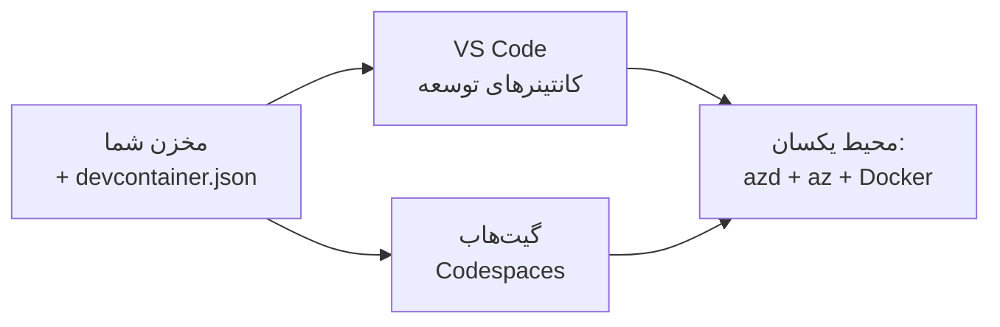

# کانتینرهای توسعه و GitHub Codespaces برای azd

**ناوبری فصل:**
- **📚 صفحه دوره**: [AZD برای مبتدیان](../../README.md)
- **📖 فصل فعلی**: فصل ۱ - پایه و شروع سریع
- **⬅️ قبلی**: [برنامه خود را بیاورید](bring-your-own-app.md)
- **🚀 فصل بعدی**: [فصل ۲: توسعه مبتنی بر هوش مصنوعی](../chapter-02-ai-development/README.md)

> تایید شده در برابر `azd 1.25.6` در ژوئن ۲۰۲۶.

## مقدمه

نصب azd، محیط زمان‌اجرای مناسب زبان، Docker و Azure CLI روی هر دستگاه کاری خسته‌کننده است — و این دلیل شماره یکِ این است که آموزشی که «روی دستگاه من کار می‌کند» برای دیگران شکست می‌خورد. یک **dev container** این مشکل را با توصیف کل زنجیره ابزار شما در یک فایل حل می‌کند. هرکسی که پروژه را در VS Code یا GitHub Codespaces باز کند همان محیط دقیق را دریافت می‌کند، که azd از قبل نصب‌شده است. این درس نشان می‌دهد چگونه یکی اضافه کنید.

## اهداف یادگیری

تا پایان این درس شما قادر خواهید بود:
- درک کنید dev container چیست و چرا به azd کمک می‌کند
- یک فایل حداقلی `.devcontainer/devcontainer.json` به پروژه اضافه کنید
- azd، Azure CLI و Docker را از طریق *ویژگی‌های* Dev Container وارد کنید
- پروژه را در GitHub Codespaces یا VS Code باز کنید

## نتایج یادگیری

پس از تکمیل این درس، شما قادر خواهید بود:
- نگارش یک `devcontainer.json` برای یک پروژه azd
- افزودن azd و ابزارهای Azure بدون نصب‌های دستی
- اجرای `azd up` از داخل یک کانتینر یا Codespace

---

## Dev Container چیست؟

یک dev container یک محیط توسعه مبتنی بر Docker است که توسط فایل `.devcontainer/devcontainer.json` در مخزن شما تعریف می‌شود. وقتی پروژه را باز کنید:

- **VS Code** (با افزونه Dev Containers) کانتینر را می‌سازد و به آن متصل می‌شود.
- **GitHub Codespaces** همان کانتینر را در فضای ابری می‌سازد و یک ویرایشگر مبتنی بر مرورگر به شما می‌دهد.

در هر صورت، هر مشارکت‌کننده ابزارهای یکسانی دریافت می‌کند—هیچ نیاز به رفع اشکال «آیا azd را نصب کردی؟» نیست.



---

## گام ۱: ایجاد فایل devcontainer

فایل `.devcontainer/devcontainer.json` را در ریشه پروژه خود ایجاد کنید:

```json
{
  "name": "azd-project",
  "image": "mcr.microsoft.com/devcontainers/base:bookworm",
  "features": {
    "ghcr.io/devcontainers/features/azure-cli:1": {},
    "ghcr.io/azure/azure-dev/azd:latest": {},
    "ghcr.io/devcontainers/features/docker-in-docker:2": {},
    "ghcr.io/devcontainers/features/node:1": {}
  },
  "customizations": {
    "vscode": {
      "extensions": [
        "ms-azuretools.azure-dev",
        "ms-azuretools.vscode-bicep"
      ]
    }
  },
  "forwardPorts": [3000],
  "postCreateCommand": "azd version"
}
```

هر بخش چه کاری انجام می‌دهد:

| Key | Purpose |
|-----|---------|
| `image` | سیستم‌عامل پایه برای کانتینر |
| `features` | نصب‌کننده‌های از پیش ساخته—اینجا: Azure CLI، **azd**، Docker، و Node.js |
| `customizations.vscode.extensions` | افزونه‌های azd و Bicep برای VS Code را به‌صورت خودکار نصب می‌کند |
| `forwardPorts` | پورت برنامه شما را به مرورگر شما در دسترس قرار می‌دهد |
| `postCreateCommand` | یک‌بار پس از ساخت کانتینر اجرا می‌شود (اینجا، یک بررسی سلامت) |

> ویژگی `ghcr.io/azure/azure-dev/azd:latest` روش رسمی برای دریافت azd در یک کانتینر است. اگر به قابلیت بازتولید نیاز دارید، یک نسخه مشخص را پین کنید (برای مثال `azd:1.25.6`).

---

## گام ۲: ویژگی را با زبان برنامه خود تطبیق دهید

ویژگی `node` را با هر چیزی که برنامه شما استفاده می‌کند جایگزین کنید:

```jsonc
// Python project
"ghcr.io/devcontainers/features/python:1": {},

// .NET project
"ghcr.io/devcontainers/features/dotnet:2": {},

// Java project
"ghcr.io/devcontainers/features/java:1": {},

// Go project
"ghcr.io/devcontainers/features/go:1": {}
```

اگر `host` شما `containerapp`، `aks` یا هر چیزی است که یک تصویر کانتینر می‌سازد، `docker-in-docker` را نگه دارید—azd برای ساخت و ارسال تصاویر به Docker نیاز دارد.

---

## گام ۳: باز کردن آن

**در VS Code:**
1. افزونه **Dev Containers** را نصب کنید.
2. پوشه پروژه را باز کنید.
3. وقتی از شما خواسته شد، روی **Reopen in Container** کلیک کنید (یا *Dev Containers: Reopen in Container* را اجرا کنید).

**در GitHub Codespaces:**
1. مخزن را به GitHub پوش کنید.
2. روی **Code → Codespaces → Create codespace on main** کلیک کنید.
3. منتظر بمانید تا کانتینر ساخته شود—azd در ترمینال آماده خواهد بود.

---

## گام ۴: استقرار از داخل کانتینر

کانتینر azd را از پیش نصب‌شده دارد، بنابراین گردش کار معمول به‌طور عادی کار می‌کند:

```bash
azd auth login --use-device-code   # کد دستگاه در داخل Codespaces مفید است
azd up
```

> **چرا `--use-device-code`؟** در یک کانتینر راه‌دور یا Codespace مرورگر محلی برای هدایت وجود ندارد، بنابراین ورود با device-code مسیر قابل‌اعتمادی است. شما یک کد را در یک تب مرورگر وارد می‌کنید تا فرآیند ورود تکمیل شود.

---

## مشکلات رایج

| مشکل | راه‌حل |
|---------|-----|
| `azd up` نمی‌تواند یک تصویر بسازد | ویژگی `docker-in-docker` را اضافه کنید |
| ورود از طریق مرورگر در Codespaces متوقف می‌شود | از `azd auth login --use-device-code` استفاده کنید |
| ابزارها بین اعضای تیم متفاوت هستند | نسخه‌های ویژگی را پین کنید (مثلاً `azd:1.25.6`) |
| برنامه در مرورگر قابل دسترسی نیست | پورت را به `forwardPorts` اضافه کنید |

---

## خلاصه

- یک dev container زنجیره ابزار azd شما را برای همه قابل بازتولید می‌کند.
- azd، Azure CLI و Docker را از طریق *ویژگی‌های* Dev Container اضافه کنید.
- ویژگی زبان را با برنامه خود منطبق کنید و برای میزبان‌های کانتینری `docker-in-docker` را نگه دارید.
- در هنگام اجرا داخل Codespaces از ورود با device-code استفاده کنید.

---

## 🔗 ناوبری

| جهت | منبع |
|-----------|----------|
| **قبلی** | [برنامه خود را بیاورید](bring-your-own-app.md) |
| **صفحه فصل** | [فصل ۱: پایه و شروع سریع](README.md) |
| **فصل بعدی** | [فصل ۲: توسعه مبتنی بر هوش مصنوعی](../chapter-02-ai-development/README.md) |

## 📖 منابع مرتبط

- [نصب و راه‌اندازی](installation.md)
- [خلاصهٔ دستورات](../../resources/cheat-sheet.md)
- [مشخصات رسمی Dev Containers](https://containers.dev/)
- [ویژگی Dev Container برای azd](https://github.com/Azure/azure-dev/tree/main/ext/devcontainer)

---

<!-- CO-OP TRANSLATOR DISCLAIMER START -->
**سلب مسئولیت**:
این سند با استفاده از سرویس ترجمه هوش مصنوعی [Co-op Translator](https://github.com/Azure/co-op-translator) ترجمه شده است. در حالی که ما در تلاش برای دقت هستیم، لطفاً توجه داشته باشید که ترجمه‌های خودکار ممکن است شامل خطاها یا نادرستی‌هایی باشند. سند اصلی به زبان مادری خود باید به عنوان منبع معتبر در نظر گرفته شود. برای اطلاعات حیاتی، ترجمه حرفه‌ای انسانی توصیه می‌شود. ما در قبال هرگونه سوء تفاهم یا برداشت نادرست ناشی از استفاده از این ترجمه مسئولیتی نداریم.
<!-- CO-OP TRANSLATOR DISCLAIMER END -->