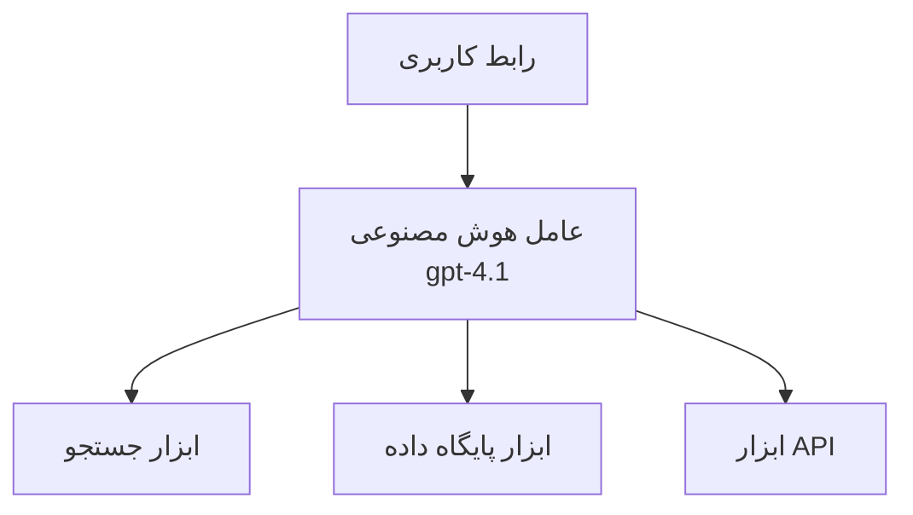
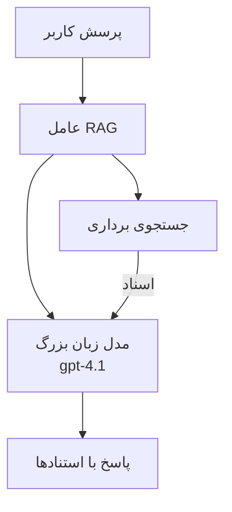
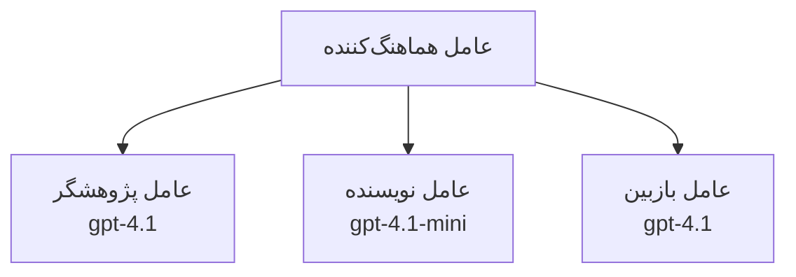

# عامل‌های هوش مصنوعی با Azure Developer CLI

**ناوبری فصل:**
- **📚 خانه دوره**: [AZD برای مبتدیان](../../README.md)
- **📖 فصل جاری**: فصل 2 - توسعه مبتنی بر هوش مصنوعی
- **⬅️ قبلی**: [ادغام Microsoft Foundry](microsoft-foundry-integration.md)
- **➡️ بعدی**: [استقرار مدل هوش مصنوعی](ai-model-deployment.md)
- **🚀 پیشرفته**: [راهکارهای چندعاملی](../../examples/retail-scenario.md)

---

## مقدمه

عامل‌های هوش مصنوعی برنامه‌های خودمختاری هستند که می‌توانند محیط خود را ادراک کنند، تصمیم بگیرند و اقدامات لازم را برای رسیدن به اهداف خاص انجام دهند. بر خلاف چت‌بات‌های ساده که به پرسش‌ها پاسخ می‌دهند، عامل‌ها می‌توانند:

- **از ابزارها استفاده کنند** - فراخوانی APIها، جستجوی پایگاه‌های داده، اجرای کد
- **برنامه‌ریزی و استدلال کنند** - شکستن کارهای پیچیده به مراحل
- **از زمینه یاد بگیرند** - حفظ حافظه و سازگاری رفتار
- **همکاری کنند** - کار با سایر عامل‌ها (سیستم‌های چندعاملی)

این راهنما به شما نشان می‌دهد چگونه عامل‌های هوش مصنوعی را با استفاده از Azure Developer CLI (azd) در Azure مستقر کنید.

> **یادداشت اعتبارسنجی (2026-03-25):** این راهنما در برابر نسخه‌های `azd` `1.23.12` و `azure.ai.agents` `0.1.18-preview` بازبینی شده است. تجربه `azd ai` هنوز مبتنی بر پیش‌نمایش است، بنابراین اگر پرچم‌های نصب‌شده شما متفاوت است، راهنمای افزونه را بررسی کنید.

## اهداف آموزشی

با تکمیل این راهنما، شما قادر خواهید بود:
- درک کنید عامل‌های هوش مصنوعی چیستند و چگونه با چت‌بات‌ها تفاوت دارند
- الگوهای عامل از پیش ساخته‌شده را با استفاده از AZD مستقر کنید
- عامل‌های Foundry را برای عامل‌های سفارشی پیکربندی کنید
- الگوهای پایه‌ای عامل (استفاده از ابزار، RAG، چندعاملی) را پیاده‌سازی کنید
- عامل‌های مستقر را مانیتور و عیب‌یابی کنید

## نتایج یادگیری

پس از تکمیل، شما قادر خواهید بود:
- برنامه‌های عامل هوش مصنوعی را با یک فرمان به Azure مستقر کنید
- ابزارها و قابلیت‌های عامل را پیکربندی کنید
- تولید تقویت‌شده با بازیابی (RAG) را با عامل‌ها پیاده‌سازی کنید
- معماری‌های چندعاملی را برای گردش‌کارهای پیچیده طراحی کنید
- مشکلات رایج استقرار عامل را عیب‌یابی کنید

---

## 🤖 چه چیزی عامل را از یک چت‌بات متمایز می‌کند؟

| ویژگی | چت‌بات | عامل هوش مصنوعی |
|---------|---------|----------|
| **رفتار** | به ورودی‌ها پاسخ می‌دهد | اقدامات خودمختار انجام می‌دهد |
| **ابزارها** | ندارد | می‌تواند APIها را فراخوانی کند، جستجو انجام دهد، کد اجرا کند |
| **حافظه** | فقط مبتنی بر جلسه | حافظه پایدار بین جلسات |
| **برنامه‌ریزی** | پاسخ تک‌مرحله‌ای | استدلال چندمرحله‌ای |
| **همکاری** | یک موجودیت منفرد | می‌تواند با سایر عامل‌ها کار کند |

### مثال ساده

- **چت‌بات** = یک فرد مفید که در میز اطلاعات به سؤالات پاسخ می‌دهد
- **عامل هوش مصنوعی** = یک دستیار شخصی که می‌تواند تماس بگیرد، قرارها را رزرو کند و کارها را برای شما انجام دهد

---

## 🚀 شروع سریع: اولین عامل خود را مستقر کنید

### گزینه 1: قالب عامل‌های Foundry (توصیه‌شده)

```bash
# قالب عامل‌های هوش مصنوعی را مقداردهی اولیه کنید
azd init --template get-started-with-ai-agents

# در Azure مستقر کنید
azd up
```

**چه چیزی مستقر می‌شود:**
- ✅ Foundry Agents
- ✅ مدل‌های Microsoft Foundry (gpt-4.1)
- ✅ Azure AI Search (برای RAG)
- ✅ Azure Container Apps (رابط وب)
- ✅ Application Insights (نظارت)

**زمان:** ~15-20 دقیقه
**هزینه:** ~$100-150/ماه (توسعه)

### گزینه 2: عامل OpenAI با Prompty

```bash
# قالب عامل مبتنی بر Prompty را مقداردهی اولیه کنید
azd init --template agent-openai-python-prompty

# در Azure مستقر کنید
azd up
```

**چه چیزی مستقر می‌شود:**
- ✅ Azure Functions (اجرای عامل بدون سرور)
- ✅ مدل‌های Microsoft Foundry
- ✅ فایل‌های پیکربندی Prompty
- ✅ پیاده‌سازی نمونه عامل

**زمان:** ~10-15 دقیقه
**هزینه:** ~$50-100/ماه (توسعه)

### گزینه 3: عامل چت RAG

```bash
# قالب چت RAG را مقداردهی اولیه کنید
azd init --template azure-search-openai-demo

# روی Azure مستقر کنید
azd up
```

**چه چیزی مستقر می‌شود:**
- ✅ مدل‌های Microsoft Foundry
- ✅ Azure AI Search با داده نمونه
- ✅ خط لوله پردازش اسناد
- ✅ رابط چت با ارجاعات

**زمان:** ~15-25 دقیقه
**هزینه:** ~$80-150/ماه (توسعه)

### گزینه 4: راه‌اندازی AZD AI Agent Init (پیش‌نمایش مبتنی بر مانیفست یا قالب)

اگر فایل مانیفست عامل دارید، می‌توانید از دستور `azd ai` برای اسکافلد یک پروژه Foundry Agent Service مستقیماً استفاده کنید. نسخه‌های اخیر پیش‌نمایش همچنین پشتیبانی از راه‌اندازی مبتنی بر قالب را اضافه کرده‌اند، بنابراین جریان نمایش دقیق ممکن است بسته به نسخه افزونه نصب‌شده شما کمی متفاوت باشد.

```bash
# نصب افزونهٔ عامل‌های هوش مصنوعی
azd extension install azure.ai.agents

# اختیاری: نسخه پیش‌نمایش نصب شده را بررسی کنید
azd extension show azure.ai.agents

# از یک مانیفست عامل مقداردهی اولیه کنید
azd ai agent init -m agent-manifest.yaml

# در آژور مستقر کنید
azd up

# عامل مستقر شده را تست کنید (تاخیر و زمان تا اولین بایت را نشان می‌دهد)
azd ai agent invoke
```

**چه زمانی از `azd ai agent init` در مقابل `azd init --template` استفاده کنید:**

| رویکرد | بهترین کاربرد | چگونه کار می‌کند |
|----------|----------|------|
| `azd init --template` | شروع از یک برنامه نمونه کاری | کل یک مخزن قالب شامل کد + زیرساخت را کلون می‌کند |
| `azd ai agent init -m` | ساخت از مانیفست عامل خودتان | ساختار پروژه را از تعریف عامل شما اسکافلد می‌کند |

> **نکته:** هنگام یادگیری از `azd init --template` استفاده کنید (گزینه‌های 1-3 بالا). هنگام ساخت عامل‌های تولیدی با مانیفست‌های خود، از `azd ai agent init` استفاده کنید.

پس از `azd up`، همان افزونه شما را در باقی چرخه عمر عامل همراهی می‌کند: `azd ai agent invoke` برای آزمایش، `azd ai agent eval generate` و `azd ai agent optimize` برای اندازه‌گیری و بهبود کیفیت، و `azd ai agent delete` برای پاک‌سازی. مرجع کامل را در [AZD AI CLI Commands](../chapter-08-production/production-ai-practices.md#azd-ai-cli-commands-and-extensions) ببینید.

---

## 🏗️ الگوهای معماری عامل

### الگو 1: عامل تک با ابزارها

ساده‌ترین الگوی عامل - یک عامل که می‌تواند از چندین ابزار استفاده کند.



**مناسب برای:**
- ربات‌های پشتیبانی مشتری
- دستیاران پژوهشی
- عامل‌های تحلیل داده

**قالب AZD:** `azure-search-openai-demo`

### الگو 2: عامل RAG (تولید تقویت‌شده با بازیابی)

عاملی که قبل از تولید پاسخ‌ها اسناد مرتبط را بازیابی می‌کند.



**مناسب برای:**
- پایگاه‌های دانش سازمانی
- سیستم‌های پرسش‌وپاسخ مبتنی بر سند
- تحقیقات حقوقی و انطباق

**قالب AZD:** `azure-search-openai-demo`

### الگو 3: سیستم چندعاملی

چندین عامل تخصصی که با هم روی کارهای پیچیده کار می‌کنند.



**مناسب برای:**
- تولید محتوای پیچیده
- گردش‌کارهای چندمرحله‌ای
- کارهایی که به تخصص‌های مختلف نیاز دارند

**بیشتر بیاموزید:** [الگوهای هماهنگی چندعاملی](../chapter-06-pre-deployment/coordination-patterns.md)

---

## ⚙️ پیکربندی ابزارهای عامل

عامل‌ها وقتی می‌توانند از ابزارها استفاده کنند قدرتمند می‌شوند. در اینجا نحوه پیکربندی ابزارهای رایج آمده است:

### پیکربندی ابزار در Foundry Agents

```python
# پیکربندی_عامل.py
from azure.ai.projects import AIProjectClient
from azure.ai.projects.models import FunctionTool, CodeInterpreterTool

# تعریف ابزارهای سفارشی
search_tool = FunctionTool(
    name="search_knowledge_base",
    description="Search the company knowledge base for relevant documents",
    parameters={
        "type": "object",
        "properties": {
            "query": {
                "type": "string",
                "description": "The search query"
            }
        },
        "required": ["query"]
    }
)

# ایجاد عامل با ابزارها
agent = project_client.agents.create_agent(
    model="gpt-4.1",
    name="Support Agent",
    instructions="You are a helpful support agent. Use the search tool to find relevant information.",
    tools=[search_tool, CodeInterpreterTool()]
)
```

### پیکربندی محیط

```bash
# متغیرهای محیطی مخصوص عامل را تنظیم کنید
azd env set AZURE_OPENAI_MODEL "gpt-4.1"
azd env set AGENT_INSTRUCTIONS "You are a helpful assistant..."
azd env set ENABLE_CODE_INTERPRETER "true"
azd env set ENABLE_FILE_SEARCH "true"

# با پیکربندی به‌روزشده مستقر کنید
azd deploy
```

---

## 📊 مانیتورینگ عامل‌ها

### یکپارچه‌سازی Application Insights

تمام قالب‌های عامل AZD شامل Application Insights برای نظارت هستند:

```bash
# باز کردن داشبورد مانیتورینگ
azd monitor --overview

# مشاهده لاگ‌های زنده
azd monitor --logs

# مشاهده متریک‌های زنده
azd monitor --live
```

### شاخص‌های کلیدی برای رصد

| شاخص | توضیح | هدف |
|--------|-------------|--------|
| تأخیر پاسخ | زمان تولید پاسخ | < 5 ثانیه |
| مصرف توکن | توکن‌ها در هر درخواست | برای هزینه نظارت کنید |
| نرخ موفقیت فراخوانی ابزار | درصد اجرای موفق ابزارها | > 95% |
| نرخ خطا | درخواست‌های عامل ناموفق | < 1% |
| رضایت کاربر | امتیازهای بازخورد | > 4.0/5.0 |

### ثبت‌سفارشی برای عامل‌ها

```python
import os
from azure.monitor.opentelemetry import configure_azure_monitor
from opentelemetry import trace

# پیکربندی Azure Monitor با OpenTelemetry
configure_azure_monitor(
    connection_string=os.environ["APPLICATIONINSIGHTS_CONNECTION_STRING"]
)

tracer = trace.get_tracer(__name__)

def log_agent_interaction(user_query, agent_response, tools_used, latency_ms):
    with tracer.start_as_current_span("agent_interaction") as span:
        span.set_attributes({
            "user_query": user_query,
            "response_length": len(agent_response),
            "tools_used": tools_used,
            "latency_ms": latency_ms
        })
```

> **نکته:** بسته‌های مورد نیاز را نصب کنید: `pip install azure-monitor-opentelemetry opentelemetry`

---

## 💰 ملاحظات هزینه

### هزینه‌های تخمینی ماهانه بر اساس الگو

| الگو | محیط توسعه | تولید |
|---------|-----------------|------------|
| عامل تک | $50-100 | $200-500 |
| عامل RAG | $80-150 | $300-800 |
| چندعاملی (2-3 عامل) | $150-300 | $500-1,500 |
| چندعاملی سازمانی | $300-500 | $1,500-5,000+ |

### نکات بهینه‌سازی هزینه

1. **برای کارهای ساده از gpt-4.1-mini استفاده کنید**
   ```bash
   azd env set AZURE_OPENAI_MODEL "gpt-4.1-mini"
   ```

2. **برای پرس‌وجوهای تکراری کشینگ پیاده‌سازی کنید**
   ```python
   from functools import lru_cache
   
   @lru_cache(maxsize=1000)
   def get_cached_response(query_hash):
       return agent.run(query_hash)
   ```

3. **محدودیت توکن در هر اجرا تعیین کنید**
   ```python
   # حداکثر توکن‌های تکمیل را هنگام اجرای عامل تنظیم کنید، نه هنگام ایجاد آن
   run = project_client.agents.create_run(
       thread_id=thread.id,
       agent_id=agent.id,
       max_completion_tokens=1000  # طول پاسخ را محدود کنید
   )
   ```

4. **وقتی استفاده نمی‌شود به صفر مقیاس دهید**
   ```bash
   # برنامه‌های کانتینری به‌طور خودکار تا صفر مقیاس می‌یابند
   azd env set MIN_REPLICAS "0"
   ```

---

## 🔧 عیب‌یابی عامل‌ها

### مشکلات رایج و راه‌حل‌ها

<details>
<summary><strong>❌ عامل به فراخوانی ابزار پاسخ نمی‌دهد</strong></summary>

```bash
# بررسی کنید که ابزارها به درستی ثبت شده‌اند
azd show

# استقرار OpenAI را تأیید کنید
az cognitiveservices account deployment list \
  --name $AZURE_OPENAI_NAME \
  --resource-group $RG_NAME

# لاگ‌های عامل را بررسی کنید
azd monitor --logs
```

**علل رایج:**
- عدم تطابق امضای تابع ابزار
- مجوزهای لازم مفقود است
- نقطه پایان API قابل دسترسی نیست
</details>

<details>
<summary><strong>❌ تأخیر بالا در پاسخ‌های عامل</strong></summary>

```bash
# Application Insights را برای گلوگاه‌ها بررسی کنید
azd monitor --live

# استفاده از یک مدل سریع‌تر را در نظر بگیرید
azd env set AZURE_OPENAI_MODEL "gpt-4.1-mini"
azd deploy
```

**نکات بهینه‌سازی:**
- از پاسخ‌های جریان‌یافته استفاده کنید
- کشینگ پاسخ را پیاده‌سازی کنید
- اندازه پنجره زمینه را کاهش دهید
</details>

<details>
<summary><strong>❌ عامل اطلاعات نادرست یا توهم‌آمیز بازمی‌گرداند</strong></summary>

```python
# با پرامپت‌های سیستمی بهتر بهبود دهید
instructions = """
You are a helpful assistant. IMPORTANT:
- Only answer based on provided context
- If you don't know, say "I don't know"
- Always cite your sources
- Never make up information
"""

# برای پایه‌گذاری، بازیابی را اضافه کنید
agent = project_client.agents.create_agent(
    model="gpt-4.1",
    instructions=instructions,
    tools=[FileSearchTool()]  # پاسخ‌ها را در اسناد پایه‌گذاری کنید
)
```
</details>

<details>
<summary><strong>❌ خطاهای تجاوز از محدودیت توکن</strong></summary>

```python
# پیاده‌سازی مدیریت پنجرهٔ زمینه
def truncate_context(messages, max_tokens=8000, model="gpt-4.1"):
    """Keep only recent messages within token limit."""
    import tiktoken
    encoding = tiktoken.encoding_for_model(model)
    total_tokens = 0
    truncated = []
    
    for msg in reversed(messages):
        msg_tokens = len(encoding.encode(msg.content))
        if total_tokens + msg_tokens > max_tokens:
            break
        truncated.insert(0, msg)
        total_tokens += msg_tokens
    
    return truncated
```
</details>

---

## 🎓 تمرین‌های عملی

### تمرین 1: استقرار یک عامل پایه (20 دقیقه)

**هدف:** اولین عامل هوش مصنوعی خود را با استفاده از AZD مستقر کنید

```bash
# مرحله ۱: مقداردهی اولیه قالب
azd init --template get-started-with-ai-agents

# مرحله ۲: ورود به Azure
azd auth login
# اگر روی چند مستاجر کار می‌کنید، --tenant-id <tenant-id> را اضافه کنید

# مرحله ۳: استقرار
azd up

# مرحله ۴: آزمایش عامل
# خروجی مورد انتظار پس از استقرار:
#   استقرار کامل شد!
#   نقطه انتهایی: https://<app-name>.<region>.azurecontainerapps.io
# آدرس (URL) نشان‌داده‌شده در خروجی را باز کنید و سعی کنید یک سؤال بپرسید

# مرحله ۵: مشاهده مانیتورینگ
azd monitor --overview

# مرحله ۶: پاک‌سازی
azd down --force --purge
```

**معیارهای موفقیت:**
- [ ] عامل به سؤالات پاسخ می‌دهد
- [ ] دسترسی به داشبورد نظارت از طریق `azd monitor` ممکن است
- [ ] منابع با موفقیت پاک‌سازی شده‌اند

### تمرین 2: افزودن یک ابزار سفارشی (30 دقیقه)

**هدف:** یک ابزار سفارشی به عامل اضافه کنید

1. قالب عامل را مستقر کنید:
   ```bash
   azd init --template get-started-with-ai-agents
   azd up
   ```
2. یک تابع ابزار جدید در کد عامل خود ایجاد کنید:
   ```python
   def get_weather(location: str) -> str:
       """Get current weather for a location."""
       # فراخوانی API سرویس هواشناسی
       return f"Weather in {location}: Sunny, 72°F"
   ```
3. ابزار را با عامل ثبت کنید:
   ```python
   from azure.ai.projects.models import FunctionTool

   weather_tool = FunctionTool(
       name="get_weather",
       description="Get current weather for a location",
       parameters={
           "type": "object",
           "properties": {
               "location": {"type": "string", "description": "City name"}
           },
           "required": ["location"]
       }
   )

   agent = project_client.agents.create_agent(
       model="gpt-4.1",
       name="Weather Agent",
       tools=[weather_tool]
   )
   ```
4. دوباره استقرار داده و تست کنید:
   ```bash
   azd deploy
   # پرسش: «هوا در سیاتل چگونه است؟»
   # انتظار می‌رود: عامل get_weather("Seattle") را فراخوانی کند و اطلاعات آب‌و‌هوا را برگرداند
   ```

**معیارهای موفقیت:**
- [ ] عامل پرسش‌های مرتبط با وضعیت هوا را تشخیص می‌دهد
- [ ] ابزار به‌درستی فراخوانی می‌شود
- [ ] پاسخ شامل اطلاعات وضعیت هوا است

### تمرین 3: ساخت یک عامل RAG (45 دقیقه)

**هدف:** عاملی بسازید که از اسناد شما برای پاسخ‌گویی استفاده کند

```bash
# مرحله ۱: قالب RAG را مستقر کنید
azd init --template azure-search-openai-demo
azd up

# مرحله ۲: اسناد خود را بارگذاری کنید
# فایل‌های PDF/TXT را در دایرکتوری data/ قرار دهید، سپس دستور زیر را اجرا کنید:
python scripts/prepdocs.py

# مرحله ۳: با سوالات مخصوص دامنه تست کنید
# نشانی وب‌اپ را از خروجی azd up باز کنید
# دربارهٔ اسناد بارگذاری‌شدهٔ خود سوال بپرسید
# پاسخ‌ها باید شامل ارجاعات استنادی مانند [doc.pdf] باشند
```

**معیارهای موفقیت:**
- [ ] عامل از اسناد آپلودشده پاسخ می‌دهد
- [ ] پاسخ‌ها شامل ارجاعات هستند
- [ ] در سؤالات خارج از حوزه، توهم رخ نمی‌دهد

---

## 📚 گام‌های بعدی

حالا که با عامل‌های هوش مصنوعی آشنا شدید، این موضوعات پیشرفته را کاوش کنید:

| موضوع | توضیح | لینک |
|-------|-------------|------|
| **سیستم‌های چندعاملی** | ساخت سیستم‌هایی با چند عامل همکار | [مثال چندعاملی خرده‌فروشی](../../examples/retail-scenario.md) |
| **الگوهای هماهنگی** | یادگیری الگوهای ارکستراسیون و ارتباطات | [الگوهای هماهنگی](../chapter-06-pre-deployment/coordination-patterns.md) |
| **استقرار تولیدی** | استقرار عامل آماده سازمانی | [تمرین‌های تولیدی هوش مصنوعی](../chapter-08-production/production-ai-practices.md) |
| **ارزیابی عامل** | تست و ارزیابی عملکرد عامل | [عیب‌یابی هوش مصنوعی](../chapter-07-troubleshooting/ai-troubleshooting.md) |
| **آزمایشگاه کارگاه هوش مصنوعی** | عملی: آماده‌سازی راه‌حل هوش مصنوعی برای AZD | [آزمایشگاه کارگاه هوش مصنوعی](ai-workshop-lab.md) |

---

## 📖 منابع اضافی

### مستندات رسمی
- [Microsoft Foundry Agent Service](https://learn.microsoft.com/azure/ai-services/agents/)
- [Microsoft Foundry Agent Service Quickstart](https://learn.microsoft.com/azure/ai-services/agents/quickstart)
- [Semantic Kernel Agent Framework](https://learn.microsoft.com/semantic-kernel/)

### قالب‌های AZD برای عامل‌ها
- [Get Started with AI Agents](https://github.com/Azure-Samples/get-started-with-ai-agents)
- [Agent OpenAI Python Prompty](https://github.com/Azure-Samples/agent-openai-python-prompty)
- [Azure Search OpenAI Demo](https://github.com/Azure-Samples/azure-search-openai-demo)

### منابع جامعه
- [Awesome AZD - Agent Templates](https://azure.github.io/awesome-azd/?tags=ai-agents)
- [Azure AI Discord](https://discord.gg/microsoft-azure)
- [Microsoft Foundry Discord](https://discord.gg/nTYy5BXMWG)

### مهارت‌های عامل برای ویرایشگر شما
- [**Microsoft Azure Agent Skills**](https://skills.sh/microsoft/github-copilot-for-azure) - نصب مهارت‌های قابل استفاده مجدد عامل هوش مصنوعی برای توسعه Azure در GitHub Copilot، Cursor، یا هر عامل پشتیبانی‌شده. شامل مهارت‌ها برای [Azure AI](https://skills.sh/microsoft/github-copilot-for-azure/azure-ai)، [Microsoft Foundry](https://skills.sh/microsoft/github-copilot-for-azure/microsoft-foundry)، [استقرار](https://skills.sh/microsoft/github-copilot-for-azure/azure-deploy)، و [تشخیص‌ها](https://skills.sh/microsoft/github-copilot-for-azure/azure-diagnostics):
  ```bash
  npx skills add microsoft/github-copilot-for-azure
  ```

---

**ناوبری**
- **درس قبلی**: [ادغام Microsoft Foundry](microsoft-foundry-integration.md)
- **درس بعدی**: [استقرار مدل هوش مصنوعی](ai-model-deployment.md)

---

<!-- CO-OP TRANSLATOR DISCLAIMER START -->
**سلب مسئولیت**:
این سند با استفاده از سرویس ترجمه هوش مصنوعی [Co-op Translator](https://github.com/Azure/co-op-translator) ترجمه شده است. در حالی که ما در تلاش برای دقت هستیم، لطفاً توجه داشته باشید که ترجمه‌های خودکار ممکن است شامل خطاها یا نادرستی‌هایی باشند. سند اصلی به زبان مادری خود باید به عنوان منبع معتبر در نظر گرفته شود. برای اطلاعات حیاتی، ترجمه حرفه‌ای انسانی توصیه می‌شود. ما در قبال هرگونه سوء تفاهم یا برداشت نادرست ناشی از استفاده از این ترجمه مسئولیتی نداریم.
<!-- CO-OP TRANSLATOR DISCLAIMER END -->