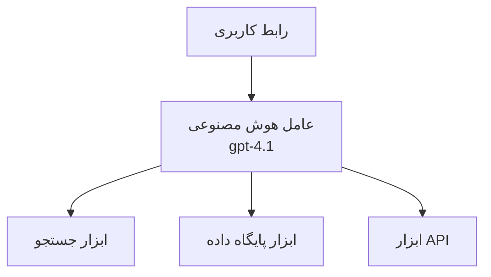
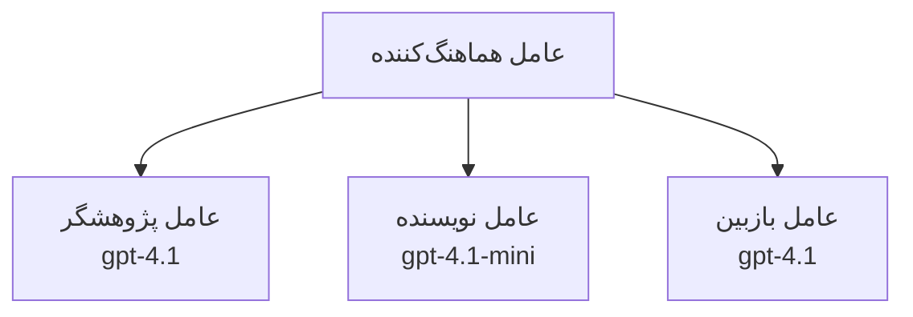

# عوامل هوش مصنوعی با Azure Developer CLI

**ناوبری فصل:**
- **📚 صفحه دوره**: [AZD برای مبتدیان](../../README.md)
- **📖 فصل جاری**: فصل 2 - توسعهٔ مبتنی بر هوش مصنوعی
- **⬅️ قبلی**: [ادغام Microsoft Foundry](microsoft-foundry-integration.md)
- **➡️ بعدی**: [استقرار مدل هوش مصنوعی](ai-model-deployment.md)
- **🚀 پیشرفته**: [راه‌حل‌های چندعاملی](../../examples/retail-scenario.md)

---

## معرفی

عوامل هوش مصنوعی برنامه‌های خودگردان هستند که می‌توانند محیط پیرامون خود را درک کنند، تصمیم بگیرند و برای رسیدن به اهداف خاص اقدام کنند. برخلاف چت‌بات‌های ساده که به درخواست‌ها پاسخ می‌دهند، عوامل می‌توانند:

- **استفاده از ابزارها** - فراخوانی APIها، جستجوی پایگاه‌های داده، اجرای کد
- **برنامه‌ریزی و استدلال** - تقسیم وظایف پیچیده به گام‌ها
- **یادگیری از زمینه** - حفظ حافظه و تطبیق رفتار
- **همکاری** - کار با سایر عوامل (سامانه‌های چندعامله)

این راهنما نشان می‌دهد چگونه با استفاده از Azure Developer CLI (azd) عوامل هوش مصنوعی را در Azure مستقر کنید.

## اهداف یادگیری

با تکمیل این راهنما، شما قادر خواهید بود:
- درک اینکه عوامل هوش مصنوعی چه هستند و چگونه از چت‌بات‌ها متفاوتند
- استقرار قالب‌های ازپیش‌ساختهٔ عامل هوش مصنوعی با استفاده از AZD
- پیکربندی Foundry Agents برای عوامل سفارشی
- اجرای الگوهای پایه‌ای عامل (استفاده از ابزارها، RAG، چندعاملی)
- مانیتورینگ و رفع اشکال عوامل مستقرشده

## نتایج یادگیری

پس از اتمام، شما قادر خواهید بود:
- برنامه‌های عامل هوش مصنوعی را با یک فرمان در Azure مستقر کنید
- ابزارها و قابلیت‌های عامل را پیکربندی کنید
- پیاده‌سازی تولید تقویت‌شده با بازیابی (RAG) توسط عوامل
- طراحی معماری‌های چندعاملی برای گردش‌کارهای پیچیده
- رفع اشکال مشکلات رایج استقرار عامل

---

## 🤖 چه چیزی عامل را از یک چت‌بات متمایز می‌کند؟

| ویژگی | چت‌بات | عامل هوش مصنوعی |
|---------|---------|----------|
| **رفتار** | به درخواست‌ها پاسخ می‌دهد | اقدامات خودگردان انجام می‌دهد |
| **ابزارها** | هیچ‌کدام | قادر به فراخوانی APIها، جستجو، اجرای کد |
| **حافظه** | تنها مبتنی بر جلسه | حافظه پایدار بین جلسات |
| **برنامه‌ریزی** | تک‌پاسخ | استدلال چندمرحله‌ای |
| **همکاری** | واحد منفرد | می‌تواند با سایر عوامل کار کند |

### تشبیه ساده

- **چت‌بات** = شخصی یاری‌دهنده که در یک میز اطلاعاتی به سوالات پاسخ می‌دهد
- **عامل هوش مصنوعی** = دستیار شخصی که می‌تواند تماس بگیرد، قرار ملاقات‌ها را رزرو کند و وظایفی را برای شما انجام دهد

---

## 🚀 شروع سریع: استقرار اولین عامل شما

### گزینهٔ 1: قالب Foundry Agents (توصیه‌شده)

```bash
# قالب عامل‌های هوش مصنوعی را مقداردهی اولیه کنید
azd init --template get-started-with-ai-agents

# در Azure مستقر کنید
azd up
```

**مواردی که مستقر می‌شوند:**
- ✅ Foundry Agents
- ✅ Microsoft Foundry Models (gpt-4.1)
- ✅ Azure AI Search (for RAG)
- ✅ Azure Container Apps (web interface)
- ✅ Application Insights (monitoring)

**زمان:** ~15-20 دقیقه
**هزینه:** ~$100-150/ماه (توسعه)

### گزینهٔ 2: عامل OpenAI با Prompty

```bash
# قالب عامل مبتنی بر Prompty را مقداردهی اولیه کنید
azd init --template agent-openai-python-prompty

# در Azure مستقر کنید
azd up
```

**مواردی که مستقر می‌شوند:**
- ✅ Azure Functions (serverless agent execution)
- ✅ Microsoft Foundry Models
- ✅ Prompty configuration files
- ✅ نمونهٔ پیاده‌سازی عامل

**زمان:** ~10-15 دقیقه
**هزینه:** ~$50-100/ماه (توسعه)

### گزینهٔ 3: عامل چت RAG

```bash
# قالب گفتگوی RAG را مقداردهی اولیه کنید
azd init --template azure-search-openai-demo

# در Azure مستقر کنید
azd up
```

**مواردی که مستقر می‌شوند:**
- ✅ Microsoft Foundry Models
- ✅ Azure AI Search with sample data
- ✅ خط‌لولهٔ پردازش اسناد
- ✅ رابط چت با ارجاعات

**زمان:** ~15-25 دقیقه
**هزینه:** ~$80-150/ماه (توسعه)

### گزینهٔ 4: AZD AI Agent Init (مبتنی بر Manifest)

اگر یک فایل مانفیست عامل دارید، می‌توانید از فرمان `azd ai` برای اسکافولد کردن یک پروژهٔ سرویس Foundry Agent به‌طور مستقیم استفاده کنید:

```bash
# افزونهٔ عامل‌های هوش مصنوعی را نصب کنید
azd extension install azure.ai.agents

# از یک مانیفست عامل مقداردهی اولیه کنید
azd ai agent init -m agent-manifest.yaml

# در Azure مستقر کنید
azd up
```

**چه زمانی از `azd ai agent init` در مقابل `azd init --template` استفاده کنیم:**

| رویکرد | مناسب برای | چگونه کار می‌کند |
|----------|----------|------|
| `azd init --template` | شروع از یک برنامه نمونهٔ کاری | رونوشت (کلون) یک مخزن قالب کامل با کد و زیرساخت |
| `azd ai agent init -m` | ساختن از مانفیست عامل خود | اسکافولد کردن ساختار پروژه از تعریف عامل شما |

> **نکته:** هنگام یادگیری از `azd init --template` استفاده کنید (گزینه‌های 1-3 بالا). هنگام ساخت عوامل تولیدی با مانفیست‌های خود از `azd ai agent init` استفاده کنید. برای مرجع کامل به [فرمان‌های AZD AI CLI](../chapter-08-production/production-ai-practices.md#azd-ai-cli-commands-and-extensions) مراجعه کنید.

---

## 🏗️ الگوهای معماری عامل

### الگو 1: عامل واحد با ابزارها

ساده‌ترین الگوی عامل - یک عامل که می‌تواند از چندین ابزار استفاده کند.


**مناسب برای:**
- بات‌های پشتیبانی مشتری
- دستیاران پژوهشی
- عوامل تحلیل داده

**قالب AZD:** `azure-search-openai-demo`

### الگو 2: عامل RAG (تولید تقویت‌شده با بازیابی)

عاملی که قبل از تولید پاسخ‌ها، اسناد مرتبط را بازیابی می‌کند.

```mermaid
graph TD
    Query[پرس‌وجوی کاربر] --> RAG[عامل RAG]
    RAG --> Vector[جستجوی برداری]
    RAG --> LLM[مدل زبان بزرگ (LLM)<br/>gpt-4.1]
    Vector -- اسناد --> LLM
    LLM --> Response[پاسخ با ارجاعات]
```
**مناسب برای:**
- پایگاه‌های دانش سازمانی
- سیستم‌های پرسش‌وپاسخ اسناد
- مطالعات حقوقی و انطباق

**قالب AZD:** `azure-search-openai-demo`

### الگو 3: سامانهٔ چندعامله

چندین عامل تخصصی که برای وظایف پیچیده با هم کار می‌کنند.


**مناسب برای:**
- تولید محتوای پیچیده
- گردش‌کارهای چندمرحله‌ای
- وظایفی که به تخصص‌های مختلف نیاز دارند

**بیشتر بیاموزید:** [الگوهای هماهنگی چندعامله](../chapter-06-pre-deployment/coordination-patterns.md)

---

## ⚙️ پیکربندی ابزارهای عامل

عوامل زمانی قدرتمند می‌شوند که بتوانند از ابزارها استفاده کنند. در اینجا نحوهٔ پیکربندی ابزارهای متداول آمده است:

### پیکربندی ابزار در Foundry Agents

```python
# agent_config.py
from azure.ai.projects import AIProjectClient
from azure.ai.projects.models import FunctionTool, CodeInterpreterTool

# ابزارهای سفارشی را تعریف کنید
search_tool = FunctionTool(
    name="search_knowledge_base",
    description="Search the company knowledge base for relevant documents",
    parameters={
        "type": "object",
        "properties": {
            "query": {
                "type": "string",
                "description": "The search query"
            }
        },
        "required": ["query"]
    }
)

# عامل را با ابزارها ایجاد کنید
agent = project_client.agents.create_agent(
    model="gpt-4.1",
    name="Support Agent",
    instructions="You are a helpful support agent. Use the search tool to find relevant information.",
    tools=[search_tool, CodeInterpreterTool()]
)
```

### پیکربندی محیط

```bash
# متغیرهای محیطی مخصوص عامل را تنظیم کنید
azd env set AZURE_OPENAI_MODEL "gpt-4.1"
azd env set AGENT_INSTRUCTIONS "You are a helpful assistant..."
azd env set ENABLE_CODE_INTERPRETER "true"
azd env set ENABLE_FILE_SEARCH "true"

# با پیکربندی به‌روز شده مستقر کنید
azd deploy
```

---

## 📊 مانیتورینگ عوامل

### یکپارچه‌سازی Application Insights

تمام قالب‌های عامل AZD شامل Application Insights برای مانیتورینگ هستند:

```bash
# باز کردن داشبورد مانیتورینگ
azd monitor --overview

# مشاهده لاگ‌های زنده
azd monitor --logs

# مشاهده متریک‌های زنده
azd monitor --live
```

### معیارهای کلیدی برای پیگیری

| معیار | توضیحات | هدف |
|--------|-------------|--------|
| تاخیر پاسخ | زمان تولید پاسخ | < 5 ثانیه |
| مصرف توکن | توکن‌ها در هر درخواست | برای هزینه پایش شود |
| نرخ موفقیت فراخوانی ابزار | % اجرای موفق ابزارها | > 95% |
| نرخ خطا | درخواست‌های ناموفق عامل | < 1% |
| رضایت کاربر | امتیازهای بازخورد | > 4.0/5.0 |

### لاگ‌گیری سفارشی برای عوامل

```python
import os
from azure.monitor.opentelemetry import configure_azure_monitor
from opentelemetry import trace

# پیکربندی Azure Monitor با OpenTelemetry
configure_azure_monitor(
    connection_string=os.environ["APPLICATIONINSIGHTS_CONNECTION_STRING"]
)

tracer = trace.get_tracer(__name__)

def log_agent_interaction(user_query, agent_response, tools_used, latency_ms):
    with tracer.start_as_current_span("agent_interaction") as span:
        span.set_attributes({
            "user_query": user_query,
            "response_length": len(agent_response),
            "tools_used": tools_used,
            "latency_ms": latency_ms
        })
```

> **توجه:** بسته‌های مورد نیاز را نصب کنید: `pip install azure-monitor-opentelemetry opentelemetry`

---

## 💰 ملاحظات هزینه

### هزینهٔ ماهیانهٔ تخمینی بر اساس الگو

| الگو | محیط توسعه | تولید |
|---------|-----------------|------------|
| عامل واحد | $50-100 | $200-500 |
| عامل RAG | $80-150 | $300-800 |
| چندعامله (2-3 عامل) | $150-300 | $500-1,500 |
| چندعامله سازمانی | $300-500 | $1,500-5,000+ |

### نکات بهینه‌سازی هزینه

1. **برای وظایف ساده از gpt-4.1-mini استفاده کنید**
   ```bash
   azd env set AZURE_OPENAI_MODEL "gpt-4.1-mini"
   ```

2. **برای پرس‌وجوهای تکراری کش پیاده‌سازی کنید**
   ```python
   from functools import lru_cache
   
   @lru_cache(maxsize=1000)
   def get_cached_response(query_hash):
       return agent.run(query_hash)
   ```

3. **محدودیت توکن برای هر اجرا تعیین کنید**
   ```python
   # مقدار max_completion_tokens را هنگام اجرای عامل تنظیم کنید، نه هنگام ایجاد
   run = project_client.agents.create_run(
       thread_id=thread.id,
       agent_id=agent.id,
       max_completion_tokens=1000  # طول پاسخ را محدود کنید
   )
   ```

4. **هنگام عدم استفاده تا صفر مقیاس دهید**
   ```bash
   # برنامه‌های کانتینری به‌طور خودکار تا صفر مقیاس می‌یابند
   azd env set MIN_REPLICAS "0"
   ```

---

## 🔧 عیب‌یابی عوامل

### مشکلات رایج و راه‌حل‌ها

<details>
<summary><strong>❌ عامل به فراخوانی ابزارها پاسخ نمی‌دهد</strong></summary>

```bash
# بررسی کنید که ابزارها به‌درستی ثبت شده‌اند
azd show

# استقرار OpenAI را تأیید کنید
az cognitiveservices account deployment list \
  --name $AZURE_OPENAI_NAME \
  --resource-group $RG_NAME

# لاگ‌های عامل را بررسی کنید
azd monitor --logs
```

**علل رایج:**
- ناسازگاری امضای تابع ابزار
- مجوزهای لازم از دست رفته
- نقطه پایانی API در دسترس نیست
</details>

<details>
<summary><strong>❌ تأخیر زیاد در پاسخ‌های عامل</strong></summary>

```bash
# Application Insights را برای گلوگاه‌ها بررسی کنید
azd monitor --live

# در نظر بگیرید از مدل سریع‌تری استفاده کنید
azd env set AZURE_OPENAI_MODEL "gpt-4.1-mini"
azd deploy
```

**نکات بهینه‌سازی:**
- از پاسخ‌های جریانی استفاده کنید
- کش پاسخ را پیاده‌سازی کنید
- اندازهٔ پنجرهٔ زمینه را کاهش دهید
</details>

<details>
<summary><strong>❌ عامل اطلاعات نادرست یا خیال‌پردازی‌شده بازمی‌گرداند</strong></summary>

```python
# با پرامپت‌های سیستمی بهتر شود
instructions = """
You are a helpful assistant. IMPORTANT:
- Only answer based on provided context
- If you don't know, say "I don't know"
- Always cite your sources
- Never make up information
"""

# بازیابی را برای پایه‌گذاری اضافه کنید
agent = project_client.agents.create_agent(
    model="gpt-4.1",
    instructions=instructions,
    tools=[FileSearchTool()]  # پاسخ‌ها را بر اسناد پایه‌گذاری کنید
)
```
</details>

<details>
<summary><strong>❌ خطاهای تجاوز از حد توکن</strong></summary>

```python
# پیاده‌سازی مدیریت پنجرهٔ زمینه
def truncate_context(messages, max_tokens=8000, model="gpt-4.1"):
    """Keep only recent messages within token limit."""
    import tiktoken
    encoding = tiktoken.encoding_for_model(model)
    total_tokens = 0
    truncated = []
    
    for msg in reversed(messages):
        msg_tokens = len(encoding.encode(msg.content))
        if total_tokens + msg_tokens > max_tokens:
            break
        truncated.insert(0, msg)
        total_tokens += msg_tokens
    
    return truncated
```
</details>

---

## 🎓 تمرین‌های عملی

### تمرین 1: استقرار یک عامل پایه (20 دقیقه)

**هدف:** استقرار اولین عامل هوش مصنوعی شما با استفاده از AZD

```bash
# مرحله 1: مقداردهی اولیه قالب
azd init --template get-started-with-ai-agents

# مرحله 2: ورود به Azure
azd auth login

# مرحله 3: استقرار
azd up

# مرحله 4: تست عامل
# خروجی مورد انتظار پس از استقرار:
#   استقرار کامل شد!
#   نقطه پایانی: https://<app-name>.<region>.azurecontainerapps.io
# URL نمایش‌داده‌شده در خروجی را باز کنید و سعی کنید یک سؤال بپرسید

# مرحله 5: مشاهده پایش
azd monitor --overview

# مرحله 6: پاک‌سازی
azd down --force --purge
```

**معیارهای موفقیت:**
- [ ] عامل به سوالات پاسخ می‌دهد
- [ ] می‌تواند از طریق `azd monitor` به داشبورد مانیتورینگ دسترسی داشته باشد
- [ ] منابع به‌طور موفقیت‌آمیز پاک‌سازی شدند

### تمرین 2: افزودن یک ابزار سفارشی (30 دقیقه)

**هدف:** گسترش یک عامل با یک ابزار سفارشی

1. قالب عامل را مستقر کنید:
   ```bash
   azd init --template get-started-with-ai-agents
   azd up
   ```
2. یک تابع ابزار جدید در کد عامل خود ایجاد کنید:
   ```python
   def get_weather(location: str) -> str:
       """Get current weather for a location."""
       # فراخوانی API برای سرویس هواشناسی
       return f"Weather in {location}: Sunny, 72°F"
   ```
3. ابزار را با عامل ثبت کنید:
   ```python
   from azure.ai.projects.models import FunctionTool

   weather_tool = FunctionTool(
       name="get_weather",
       description="Get current weather for a location",
       parameters={
           "type": "object",
           "properties": {
               "location": {"type": "string", "description": "City name"}
           },
           "required": ["location"]
       }
   )

   agent = project_client.agents.create_agent(
       model="gpt-4.1",
       name="Weather Agent",
       tools=[weather_tool]
   )
   ```
4. دوباره مستقر و آزمایش کنید:
   ```bash
   azd deploy
   # پرسش: "هوا در سیاتل چگونه است؟"
   # انتظار: عامل تابع get_weather("Seattle") را فراخوانی کرده و اطلاعات هواشناسی را بازمی‌گرداند.
   ```

**معیارهای موفقیت:**
- [ ] عامل پرسش‌های مربوط به آب‌وهوا را تشخیص می‌دهد
- [ ] ابزار به‌درستی فراخوانی می‌شود
- [ ] پاسخ شامل اطلاعات آب‌وهوا است

### تمرین 3: ساخت یک عامل RAG (45 دقیقه)

**هدف:** ایجاد عاملی که از اسناد شما به سوالات پاسخ دهد

```bash
# مرحله ۱: استقرار قالب RAG
azd init --template azure-search-openai-demo
azd up

# مرحله ۲: فایل‌های خود را بارگذاری کنید
# فایل‌های PDF/TXT را در پوشه data/ قرار دهید، سپس اجرا کنید:
python scripts/prepdocs.py

# مرحله ۳: با سوالات مرتبط با حوزه تست کنید
# آدرس برنامه وب را از خروجی azd up باز کنید
# در مورد اسناد آپلودشده خود سوال بپرسید
# پاسخ‌ها باید شامل ارجاعات استنادی مانند [doc.pdf] باشند
```

**معیارهای موفقیت:**
- [ ] عامل از اسناد آپلودشده پاسخ می‌دهد
- [ ] پاسخ‌ها شامل ارجاعات هستند
- [ ] در سوالات خارج از محدوده توهم رخ ندهد

---

## 📚 گام‌های بعدی

حالا که عوامل هوش مصنوعی را درک کردید، این موضوعات پیشرفته را بررسی کنید:

| موضوع | توضیحات | پیوند |
|-------|-------------|------|
| **سیستم‌های چندعامله** | ساخت سیستم‌هایی با چند عامل همکاری‌کننده | [نمونهٔ چندعامله خرده‌فروشی](../../examples/retail-scenario.md) |
| **الگوهای هماهنگی** | یادگیری الگوهای ارکستریشن و ارتباط | [الگوهای هماهنگی](../chapter-06-pre-deployment/coordination-patterns.md) |
| **استقرار در تولید** | استقرار عامل آمادهٔ سازمانی | [روش‌های تولیدی هوش مصنوعی](../chapter-08-production/production-ai-practices.md) |
| **ارزیابی عامل** | تست و ارزیابی عملکرد عامل | [عیب‌یابی هوش مصنوعی](../chapter-07-troubleshooting/ai-troubleshooting.md) |
| **آزمایشگاه کارگاه هوش مصنوعی** | عملی: آماده‌سازی راهکار هوش مصنوعی شما برای AZD | [آزمایشگاه کارگاه هوش مصنوعی](ai-workshop-lab.md) |

---

## 📖 منابع اضافی

### مستندات رسمی
- [سرویس عامل هوش مصنوعی Azure](https://learn.microsoft.com/azure/ai-services/agents/)
- [شروع سریع سرویس Foundry Agent Azure AI](https://learn.microsoft.com/azure/ai-services/agents/quickstart)
- [چارچوب عامل Semantic Kernel](https://learn.microsoft.com/semantic-kernel/)

### قالب‌های AZD برای عوامل
- [شروع به کار با عوامل هوش مصنوعی](https://github.com/Azure-Samples/get-started-with-ai-agents)
- [عامل OpenAI پایتون Prompty](https://github.com/Azure-Samples/agent-openai-python-prompty)
- [دموی Azure Search OpenAI](https://github.com/Azure-Samples/azure-search-openai-demo)

### منابع جامعه
- [Awesome AZD - قالب‌های عامل](https://azure.github.io/awesome-azd/?tags=ai-agents)
- [دی‌سکورد Azure AI](https://discord.gg/microsoft-azure)
- [دی‌سکورد Microsoft Foundry](https://discord.gg/nTYy5BXMWG)

### مهارت‌های عامل برای ویرایشگر شما
- [**مهارت‌های عامل Microsoft Azure**](https://skills.sh/microsoft/github-copilot-for-azure) - مهارت‌های قابل استفاده مجدد عامل هوش مصنوعی برای توسعه در Azure را در GitHub Copilot، Cursor یا هر عامل پشتیبانی‌شده نصب کنید. شامل مهارت‌هایی برای [Azure AI](https://skills.sh/microsoft/github-copilot-for-azure/azure-ai), [Microsoft Foundry](https://skills.sh/microsoft/github-copilot-for-azure/microsoft-foundry), [deployment](https://skills.sh/microsoft/github-copilot-for-azure/azure-deploy), و [diagnostics](https://skills.sh/microsoft/github-copilot-for-azure/azure-diagnostics):
  ```bash
  npx skills add microsoft/github-copilot-for-azure
  ```

---

**ناوبری**
- **درس قبلی**: [ادغام Microsoft Foundry](microsoft-foundry-integration.md)
- **درس بعدی**: [استقرار مدل هوش مصنوعی](ai-model-deployment.md)

---

<!-- CO-OP TRANSLATOR DISCLAIMER START -->
**سلب مسئولیت**:
این سند با استفاده از سرویس ترجمهٔ هوش مصنوعی [Co-op Translator](https://github.com/Azure/co-op-translator) ترجمه شده است. در حالی که ما در تلاش برای دقت هستیم، لطفاً توجه داشته باشید که ترجمه‌های خودکار ممکن است حاوی خطاها یا نادرستی‌هایی باشند. نسخهٔ اصلی سند به زبان مادری آن باید به‌عنوان منبع معتبر در نظر گرفته شود. برای اطلاعات حیاتی، ترجمهٔ حرفه‌ای انسانی توصیه می‌شود. ما مسئول هیچ‌گونه سوءتفاهم یا تفسیر نادرستی که از استفاده از این ترجمه ناشی شود، نیستیم.
<!-- CO-OP TRANSLATOR DISCLAIMER END -->