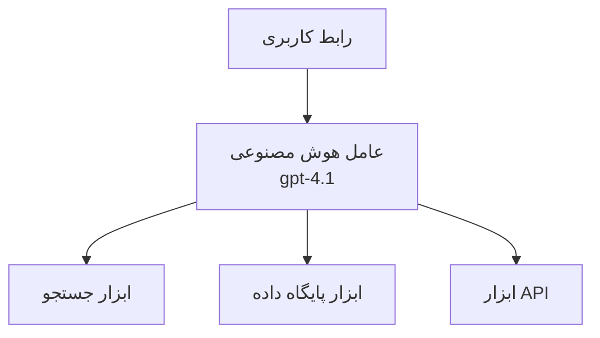
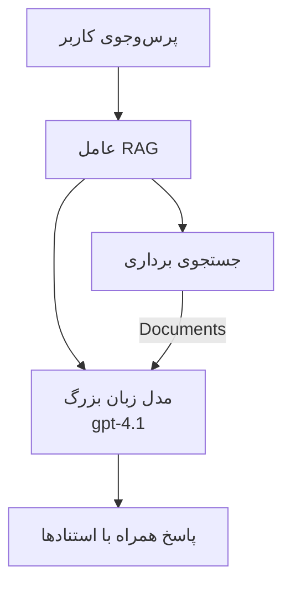
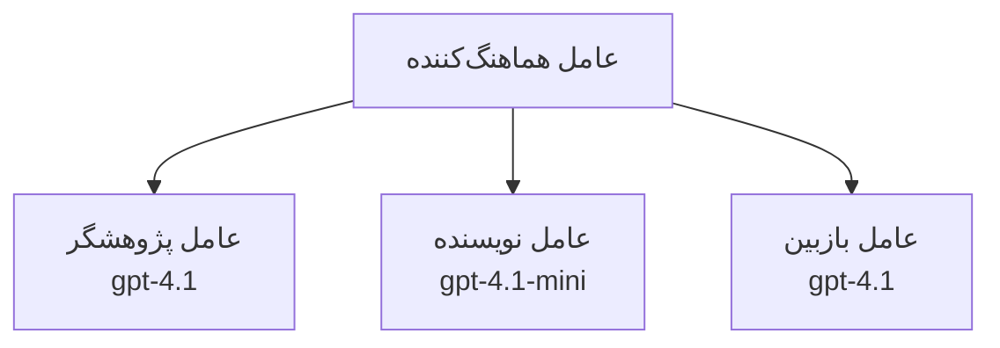

# نمایندگان هوش مصنوعی با Azure Developer CLI

**ناوبری فصل:**
- **📚 صفحه اصلی دوره**: [AZD برای مبتدیان](../../README.md)
- **📖 فصل جاری**: فصل ۲ - توسعه هوش مصنوعی محور
- **⬅️ قبلی**: [ادغام Microsoft Foundry](microsoft-foundry-integration.md)
- **➡️ بعدی**: [استقرار مدل هوش مصنوعی](ai-model-deployment.md)
- **🚀 پیشرفته**: [راه‌حل‌های چندعاملی](../../examples/retail-scenario.md)

---

## معرفی

نمایندگان هوش مصنوعی برنامه‌های خودکار مستقلی هستند که می‌توانند محیط خود را درک کنند، تصمیم بگیرند و اقداماتی انجام دهند تا به اهداف خاصی برسند. برخلاف چت‌بات‌های ساده که فقط به ورودی‌ها پاسخ می‌دهند، نمایندگان می‌توانند:

- **ابزارها را استفاده کنند** - فراخوانی APIها، جستجوی پایگاه‌داده‌ها، اجرای کد
- **برنامه‌ریزی و استدلال کنند** - شکستن وظایف پیچیده به مراحل
- **از زمینه یاد بگیرند** - حفظ حافظه و تطبیق رفتار
- **همکاری کنند** - کار با سایر نمایندگان (سیستم‌های چندعاملی)

این راهنما نشان می‌دهد چگونه نمایندگان هوش مصنوعی را با استفاده از Azure Developer CLI (azd) در Azure مستقر کنید.

> **تذکر اعتبارسنجی (۲۰۲۶-۰۷-۱۳):** این راهنما بر اساس `azd` نسخه `1.27.1` و `azure.ai.agents` نسخه `1.0.0-beta.5` بررسی شده است. تجربه `azd ai` هنوز در حالت پیش‌نمایش است، پس اگر پرچم‌های نصب‌شده شما متفاوت است، راهنمای افزونه را بررسی کنید.

## اهداف یادگیری

با تکمیل این راهنما، شما خواهید:
- درک کنید نمایندگان هوش مصنوعی چه هستند و چگونه با چت‌بات‌ها تفاوت دارند
- قالب‌های نمایندگان از پیش ساخته‌شده را با AZD مستقر کنید
- نمایندگان Foundry را برای نمایندگان سفارشی پیکربندی کنید
- الگوهای پایه نمایندگان (استفاده از ابزار، RAG، چندعاملی) را پیاده‌سازی کنید
- نمایندگان مستقر شده را پایش و اشکال‌زدایی کنید

## نتایج یادگیری

پس از اتمام، شما قادر خواهید بود:
- برنامه‌های نمایندگان هوش مصنوعی را با یک دستور در Azure مستقر کنید
- ابزارها و قابلیت‌های نماینده را پیکربندی کنید
- تولید تقویت‌شده با بازیابی (RAG) را با نمایندگان پیاده‌سازی کنید
- معماری‌های چندعاملی برای گردش‌کارهای پیچیده طراحی کنید
- مشکلات معمول استقرار نمایندگان را رفع کنید

---

## 🤖 چه چیزی نماینده را از چت‌بات متمایز می‌کند؟

| ویژگی | چت‌بات | نماینده هوش مصنوعی |
|---------|---------|----------|
| **رفتار** | به ورودی‌ها پاسخ می‌دهد | اقدامات خودمختار انجام می‌دهد |
| **ابزارها** | هیچ | می‌تواند API فراخوانی کند، جستجو کند، کد اجرا کند |
| **حافظه** | فقط مبتنی بر جلسه | حافظه پایدار بین جلسات |
| **برنامه‌ریزی** | پاسخ تک مرحله‌ای | استدلال چند مرحله‌ای |
| **همکاری** | موجودیت تک | می‌تواند با سایر نمایندگان کار کند |

### تشبیه ساده

- **چت‌بات** = یک شخص مفید که روی میز اطلاعات به سوالات پاسخ می‌دهد
- **نماینده هوش مصنوعی** = یک دستیار شخصی که می‌تواند تماس بگیرد، وقت بگیرد و کارها را برای شما انجام دهد

---

## 🚀 شروع سریع: اولین نماینده‌تان را مستقر کنید

### گزینه ۱: قالب نمایندگان Foundry (توصیه شده)

```bash
# قالب عامل‌های هوش مصنوعی را مقداردهی اولیه کنید
azd init --template get-started-with-ai-agents

# به Azure مستقر کنید
azd up
```

**مواردی که مستقر می‌شوند:**
- ✅ نمایندگان Foundry
- ✅ مدل‌های Microsoft Foundry (gpt-4.1)
- ✅ Azure AI Search (برای RAG)
- ✅ Azure Container Apps (رابط وب)
- ✅ Application Insights (پایش)

**زمان:** حدود ۱۵-۲۰ دقیقه
**هزینه:** حدود ۱۰۰-۱۵۰ دلار در ماه (توسعه)

### گزینه ۲: نماینده OpenAI با Prompty

```bash
# قالب عامل مبتنی بر Prompty را مقداردهی اولیه کنید
azd init --template agent-openai-python-prompty

# به Azure مستقر کنید
azd up
```

**مواردی که مستقر می‌شوند:**
- ✅ Azure Functions (اجرای نماینده بدون سرور)
- ✅ مدل‌های Microsoft Foundry
- ✅ فایل‌های پیکربندی Prompty
- ✅ نمونه پیاده‌سازی نماینده

**زمان:** حدود ۱۰-۱۵ دقیقه
**هزینه:** حدود ۵۰-۱۰۰ دلار در ماه (توسعه)

### گزینه ۳: نماینده چت RAG

```bash
# قالب چت RAG را مقداردهی اولیه کنید
azd init --template azure-search-openai-demo

# در آزور مستقر کنید
azd up
```

**مواردی که مستقر می‌شوند:**
- ✅ مدل‌های Microsoft Foundry
- ✅ Azure AI Search با داده نمونه
- ✅ خط لوله پردازش اسناد
- ✅ رابط چت با منابع

**زمان:** حدود ۱۵-۲۵ دقیقه
**هزینه:** حدود ۸۰-۱۵۰ دلار در ماه (توسعه)

### گزینه ۴: راه‌اندازی نماینده AZD AI (پیش‌نمایش مبتنی بر مشخصات یا قالب)

اگر فایل مشخصات نماینده دارید، می‌توانید با دستور `azd ai` پروژه سرویس نماینده Foundry را مستقیماً ایجاد کنید. نسخه‌های پیش‌نمایش اخیر همچنین از راه‌اندازی مبتنی بر قالب پشتیبانی می‌کنند، بنابراین جریان دستور دقیق ممکن است بسته به نسخه افزونه نصب شده کمی متفاوت باشد.

```bash
# نصب افزونه عوامل هوش مصنوعی
azd extension install azure.ai.agents

# اختیاری: نسخه پیش‌نمایش نصب‌شده را تأیید کنید
azd extension show azure.ai.agents

# مقداردهی اولیه از یک مانیفست عامل
azd ai agent init -m agent-manifest.yaml

# استقرار در Azure
azd up

# آزمایش عامل مستقر شده (تاخیر + زمان دریافت اولین بایت را نشان می‌دهد)
azd ai agent invoke
```

**زمان استفاده از `azd ai agent init` در مقابل `azd init --template`:**

| رویکرد | مناسب‌ترین برای | نحوه عملکرد |
|----------|----------|------|
| `azd init --template` | شروع با یک برنامه نمونه عملی | کلون یک مخزن قالب کامل با کد + زیرساخت |
| `azd ai agent init -m` | ساخت بر اساس مشخصات نماینده خود | ساختار پروژه را از تعریف نماینده شما ایجاد می‌کند |

> **نکته:** هنگام یادگیری از `azd init --template` استفاده کنید (گزینه‌های ۱-۳ بالا). هنگام ساخت نمایندگان تولید با مشخصات خود از `azd ai agent init` استفاده کنید.

پس از `azd up`، همان افزونه شما را در بقیه چرخه عمر نماینده همراهی می‌کند: `azd ai agent invoke` برای تست، `azd ai agent eval generate` و `azd ai agent optimize` برای اندازه‌گیری و بهبود کیفیت، و `azd ai agent delete` برای پاک‌سازی. برای مرجع کامل به [دستورات AZD AI CLI](../chapter-08-production/production-ai-practices.md#azd-ai-cli-commands-and-extensions) مراجعه کنید.

---

## 🏗️ الگوهای معماری نماینده

### الگو ۱: نماینده تک با ابزار

ساده‌ترین الگوی نماینده - یک نماینده که می‌تواند از چند ابزار استفاده کند.



**مناسب برای:**
- ربات‌های پشتیبانی مشتری
- دستیارهای پژوهشی
- نمایندگان تحلیل داده

**قالب AZD:** `azure-search-openai-demo`

### الگو ۲: نماینده RAG (تولید افزوده با بازیابی)

نماینده‌ای که قبل از تولید پاسخ‌ها اسناد مرتبط را بازیابی می‌کند.



**مناسب برای:**
- پایگاه‌های دانش سازمانی
- سیستم‌های پرسش و پاسخ سندی
- پژوهش در زمینه تطبیق و قانونی

**قالب AZD:** `azure-search-openai-demo`

### الگو ۳: سیستم چندعاملی

چند نماینده تخصصی که به‌طور مشترک روی وظایف پیچیده کار می‌کنند.



**مناسب برای:**
- تولید محتوای پیچیده
- گردش‌کارهای چند مرحله‌ای
- وظایف نیازمند تخصص‌های مختلف

**برای اطلاعات بیشتر:** [الگوهای هماهنگی چندعاملی](../chapter-06-pre-deployment/coordination-patterns.md)

---

## ⚙️ پیکربندی ابزارهای نماینده

نمایندگان وقتی می‌توانند از ابزارها استفاده کنند قدرتمند می‌شوند. اینجا نحوه پیکربندی ابزارهای معمول را ببینید:

### پیکربندی ابزار در نمایندگان Foundry

```python
# agent_config.py
from azure.ai.projects import AIProjectClient
from azure.ai.projects.models import FunctionTool, CodeInterpreterTool

# تعریف ابزارهای سفارشی
search_tool = FunctionTool(
    name="search_knowledge_base",
    description="Search the company knowledge base for relevant documents",
    parameters={
        "type": "object",
        "properties": {
            "query": {
                "type": "string",
                "description": "The search query"
            }
        },
        "required": ["query"]
    }
)

# ایجاد عامل با ابزارها
agent = project_client.agents.create_agent(
    model="gpt-4.1",
    name="Support Agent",
    instructions="You are a helpful support agent. Use the search tool to find relevant information.",
    tools=[search_tool, CodeInterpreterTool()]
)
```

### پیکربندی محیط

```bash
# تنظیم متغیرهای محیطی خاص نماینده
azd env set AZURE_OPENAI_MODEL "gpt-4.1"
azd env set AGENT_INSTRUCTIONS "You are a helpful assistant..."
azd env set ENABLE_CODE_INTERPRETER "true"
azd env set ENABLE_FILE_SEARCH "true"

# استقرار با پیکربندی به‌روز شده
azd deploy
```

---

## 📊 پایش نمایندگان

### ادغام Application Insights

همه قالب‌های نماینده AZD شامل Application Insights برای پایش هستند:

```bash
# باز کردن داشبورد مانیتورینگ
azd monitor --overview

# مشاهده لاگ‌های زنده
azd monitor --logs

# مشاهده معیارهای زنده
azd monitor --live
```

### معیارهای کلیدی برای پیگیری

| معیار | توضیح | هدف |
|--------|-------------|--------|
| تأخیر پاسخ | زمان تولید پاسخ | کمتر از ۵ ثانیه |
| میزان استفاده از توکن | توکن‌ها در هر درخواست | پایش برای هزینه |
| نرخ موفقیت فراخوانی ابزار | درصد اجرای موفق ابزار | بیش از ۹۵٪ |
| نرخ خطا | درخواست‌های ناموفق نماینده | کمتر از ۱٪ |
| رضایت کاربر | نمرات بازخورد | بالاتر از ۴.۰ از ۵.۰ |

### ثبت لاگ سفارشی برای نمایندگان

```python
import os
from azure.monitor.opentelemetry import configure_azure_monitor
from opentelemetry import trace

# تنظیم Azure Monitor با OpenTelemetry
configure_azure_monitor(
    connection_string=os.environ["APPLICATIONINSIGHTS_CONNECTION_STRING"]
)

tracer = trace.get_tracer(__name__)

def log_agent_interaction(user_query, agent_response, tools_used, latency_ms):
    with tracer.start_as_current_span("agent_interaction") as span:
        span.set_attributes({
            "user_query": user_query,
            "response_length": len(agent_response),
            "tools_used": tools_used,
            "latency_ms": latency_ms
        })
```

> **توجه:** بسته‌های موردنیاز را نصب کنید: `pip install azure-monitor-opentelemetry opentelemetry`

---

## 💰 ملاحظات هزینه

### هزینه‌های تخمینی ماهانه بر اساس الگو

| الگو | محیط توسعه | تولید |
|---------|-----------------|------------|
| نماینده تک | ۵۰-۱۰۰ دلار | ۲۰۰-۵۰۰ دلار |
| نماینده RAG | ۸۰-۱۵۰ دلار | ۳۰۰-۸۰۰ دلار |
| چند نماینده (۲-۳ نماینده) | ۱۵۰-۳۰۰ دلار | ۵۰۰-۱۵۰۰ دلار |
| چند نماینده سازمانی | ۳۰۰-۵۰۰ دلار | ۱۵۰۰-۵۰۰۰ دلار و بیشتر |

### نکات بهینه‌سازی هزینه

۱. **برای وظایف ساده از gpt-4.1-mini استفاده کنید**
   ```bash
   azd env set AZURE_OPENAI_MODEL "gpt-4.1-mini"
   ```

۲. **کش کردن پرس‌وجوهای تکراری را پیاده‌سازی کنید**
   ```python
   from functools import lru_cache
   
   @lru_cache(maxsize=1000)
   def get_cached_response(query_hash):
       return agent.run(query_hash)
   ```

۳. **محدودیت توکن را برای هر اجرا تنظیم کنید**
   ```python
   # حداکثر توکن‌های تکمیل را هنگام اجرای عامل تنظیم کنید، نه در حین ایجاد
   run = project_client.agents.create_run(
       thread_id=thread.id,
       agent_id=agent.id,
       max_completion_tokens=1000  # طول پاسخ را محدود کنید
   )
   ```

۴. **هنگام عدم استفاده به صفر مقیاس دهید**
   ```bash
   # برنامه‌های کانتینری به‌صورت خودکار تا صفر مقیاس‌بندی می‌شوند
   azd env set MIN_REPLICAS "0"
   ```

---

## 🔧 عیب‌یابی نمایندگان

### مشکلات رایج و راه‌حل‌ها

<details>
<summary><strong>❌ نماینده به فراخوانی ابزار پاسخ نمی‌دهد</strong></summary>

```bash
# بررسی ثبت صحیح ابزارها
azd show

# تأیید استقرار OpenAI
az cognitiveservices account deployment list \
  --name $AZURE_OPENAI_NAME \
  --resource-group $RG_NAME

# بررسی گزارش‌های عامل
azd monitor --logs
```

**علل معمول:**
- عدم تطابق امضای تابع ابزار
- کمبود مجوزهای لازم
- نقطه پایان API در دسترس نیست
</details>

<details>
<summary><strong>❌ تأخیر زیاد در پاسخ‌های نماینده</strong></summary>

```bash
# بررسی Application Insights برای گلوگاه‌ها
azd monitor --live

# استفاده از یک مدل سریع‌تر را در نظر بگیرید
azd env set AZURE_OPENAI_MODEL "gpt-4.1-mini"
azd deploy
```

**نکات بهینه‌سازی:**
- استفاده از پاسخ‌های جریانی
- پیاده‌سازی کش پاسخ‌ها
- کاهش اندازه پنجره زمینه
</details>

<details>
<summary><strong>❌ نماینده اطلاعات نادرست یا توهمی برمی‌گرداند</strong></summary>

```python
# با راهنمایی‌های بهتر سیستم بهبود یابد
instructions = """
You are a helpful assistant. IMPORTANT:
- Only answer based on provided context
- If you don't know, say "I don't know"
- Always cite your sources
- Never make up information
"""

# بازیابی را برای مبناگذاری اضافه کنید
agent = project_client.agents.create_agent(
    model="gpt-4.1",
    instructions=instructions,
    tools=[FileSearchTool()]  # پاسخ‌ها را در اسناد مبنا کنید
)
```
</details>

<details>
<summary><strong>❌ خطاهای تجاوز از محدودیت توکن</strong></summary>

```python
# پیاده‌سازی مدیریت پنجره‌ی زمینه
def truncate_context(messages, max_tokens=8000, model="gpt-4.1"):
    """Keep only recent messages within token limit."""
    import tiktoken
    encoding = tiktoken.encoding_for_model(model)
    total_tokens = 0
    truncated = []
    
    for msg in reversed(messages):
        msg_tokens = len(encoding.encode(msg.content))
        if total_tokens + msg_tokens > max_tokens:
            break
        truncated.insert(0, msg)
        total_tokens += msg_tokens
    
    return truncated
```
</details>

---

## 🎓 تمرین‌های عملی

### تمرین ۱: مستقر کردن نماینده پایه (۲۰ دقیقه)

**هدف:** اولین نماینده هوش مصنوعی خود را با AZD مستقر کنید

```bash
# مرحله ۱: قالب را مقداردهی اولیه کنید
azd init --template get-started-with-ai-agents

# مرحله ۲: وارد Azure شوید
azd auth login
# اگر بین مستاجران کار می‌کنید، --tenant-id <tenant-id> را اضافه کنید

# مرحله ۳: استقرار
azd up

# مرحله ۴: آزمایش عامل
# خروجی مورد انتظار پس از استقرار:
#   استقرار کامل شد!
#   نقطه پایانی: https://<app-name>.<region>.azurecontainerapps.io
# آدرس نمایش داده شده در خروجی را باز کرده و سعی کنید سوالی بپرسید

# مرحله ۵: مشاهده نظارت
azd monitor --overview

# مرحله ۶: پاک‌سازی
azd down --force --purge
```

**معیار موفقیت:**
- [ ] نماینده به سوالات پاسخ دهد
- [ ] دسترسی به داشبورد پایش از طریق `azd monitor` برقرار باشد
- [ ] منابع با موفقیت پاک‌سازی شده باشند

### تمرین ۲: افزودن ابزار سفارشی (۳۰ دقیقه)

**هدف:** افزودن یک ابزار سفارشی به نماینده

۱. قالب نماینده را مستقر کنید:
   ```bash
   azd init --template get-started-with-ai-agents
   azd up
   ```
۲. ایجاد یک تابع ابزار جدید در کد نماینده خود:
   ```python
   def get_weather(location: str) -> str:
       """Get current weather for a location."""
       # تماس API با سرویس آب و هوا
       return f"Weather in {location}: Sunny, 72°F"
   ```
۳. ثبت ابزار در نماینده:
   ```python
   from azure.ai.projects.models import FunctionTool

   weather_tool = FunctionTool(
       name="get_weather",
       description="Get current weather for a location",
       parameters={
           "type": "object",
           "properties": {
               "location": {"type": "string", "description": "City name"}
           },
           "required": ["location"]
       }
   )

   agent = project_client.agents.create_agent(
       model="gpt-4.1",
       name="Weather Agent",
       tools=[weather_tool]
   )
   ```
۴. مجدداً مستقر و تست کنید:
   ```bash
   azd deploy
   # بپرسید: "هوا در سیاتل چگونه است؟"
   # انتظار می‌رود: عامل تابع get_weather("Seattle") را فراخوانی کرده و اطلاعات هوا را بازگرداند
   ```

**معیار موفقیت:**
- [ ] نماینده پرسش‌های مرتبط با هواشناسی را تشخیص دهد
- [ ] ابزار به درستی فراخوانی شود
- [ ] پاسخ شامل اطلاعات هواشناسی باشد

### تمرین ۳: ساخت نماینده RAG (۴۵ دقیقه)

**هدف:** ساخت نماینده‌ای که به سوالات اسناد شما پاسخ دهد

```bash
# مرحله ۱: استقرار قالب RAG
azd init --template azure-search-openai-demo
azd up

# مرحله ۲: مدارک خود را بارگذاری کنید
# فایل‌های PDF/TXT را در پوشه data/ قرار دهید، سپس اجرا کنید:
python scripts/prepdocs.py

# مرحله ۳: با سوالات خاص حوزه تست کنید
# آدرس وب اپ را از خروجی azd up باز کنید
# سوالاتی درباره مدارک بارگذاری شده خود بپرسید
# پاسخ‌ها باید شامل ارجاعات نقل‌قولی مانند [doc.pdf] باشند
```

**معیار موفقیت:**
- [ ] نماینده از اسناد بارگذاری شده پاسخ دهد
- [ ] پاسخ‌ها شامل منابع باشند
- [ ] پاسخ‌های توهمی در سوالات خارج از محدوده وجود نداشته باشد

---

## 📚 مراحل بعدی

حال که نمایندگان هوش مصنوعی را می‌شناسید، این موضوعات پیشرفته را بررسی کنید:

| موضوع | توضیح | لینک |
|-------|-------------|------|
| **سیستم‌های چندعاملی** | ساخت سیستم‌هایی با چند نماینده همکاری‌کننده | [مثال چندعاملی خرده‌فروشی](../../examples/retail-scenario.md) |
| **الگوهای هماهنگی** | یادگیری الگوهای ارکستراسیون و ارتباطات | [الگوهای هماهنگی](../chapter-06-pre-deployment/coordination-patterns.md) |
| **استقرار تولیدی** | استقرار نمایندگان آماده سازمان | [روش‌های هوش مصنوعی در تولید](../chapter-08-production/production-ai-practices.md) |
| **ارزیابی نماینده** | تست و ارزیابی عملکرد نماینده | [عیب‌یابی هوش مصنوعی](../chapter-07-troubleshooting/ai-troubleshooting.md) |
| **کارگاه عملی هوش مصنوعی** | کار عملی: آماده‌سازی راه‌حل هوش مصنوعی برای AZD | [کارگاه عملی هوش مصنوعی](ai-workshop-lab.md) |

---

## 📖 منابع اضافی

### مستندات رسمی
- [سرویس نماینده Microsoft Foundry](https://learn.microsoft.com/azure/ai-services/agents/)
- [شروع سریع سرویس نماینده Microsoft Foundry](https://learn.microsoft.com/azure/ai-services/agents/quickstart)
- [چارچوب نماینده Semantic Kernel](https://learn.microsoft.com/semantic-kernel/)

### قالب‌های AZD برای نمایندگان
- [شروع با نمایندگان هوش مصنوعی](https://github.com/Azure-Samples/get-started-with-ai-agents)
- [نماینده OpenAI Python Prompty](https://github.com/Azure-Samples/agent-openai-python-prompty)
- [نمونه Azure Search OpenAI](https://github.com/Azure-Samples/azure-search-openai-demo)

### منابع جامعه
- [Awesome AZD - قالب‌های نماینده](https://azure.github.io/awesome-azd/?tags=ai-agents)
- [دی‌دیسکورد Azure AI](https://discord.gg/microsoft-azure)
- [دی‌دیسکورد Microsoft Foundry](https://discord.gg/nTYy5BXMWG)

### مهارت‌های نماینده برای ویرایشگر شما
- [**مهارت‌های نماینده Microsoft Azure**](https://skills.sh/microsoft/github-copilot-for-azure) - نصب مهارت‌های قابل استفاده مجدد نماینده هوش مصنوعی برای توسعه Azure در GitHub Copilot، Cursor یا هر نماینده پشتیبانی‌شده. شامل مهارت‌هایی برای [Azure AI](https://skills.sh/microsoft/github-copilot-for-azure/azure-ai)، [Microsoft Foundry](https://skills.sh/microsoft/github-copilot-for-azure/microsoft-foundry)، [استقرار](https://skills.sh/microsoft/github-copilot-for-azure/azure-deploy)، و [تشخیص‌عیب](https://skills.sh/microsoft/github-copilot-for-azure/azure-diagnostics):
  ```bash
  npx skills add microsoft/github-copilot-for-azure
  ```

---

**ناوبری**
- **درس قبلی**: [ادغام Microsoft Foundry](microsoft-foundry-integration.md)
- **درس بعدی**: [استقرار مدل هوش مصنوعی](ai-model-deployment.md)

---

<!-- CO-OP TRANSLATOR DISCLAIMER START -->
**سلب مسئولیت**:
این سند با استفاده از سرویس ترجمه هوش مصنوعی [Co-op Translator](https://github.com/Azure/co-op-translator) ترجمه شده است. در حالی که ما در تلاش برای دقت هستیم، لطفاً توجه داشته باشید که ترجمه‌های خودکار ممکن است شامل خطاها یا نادرستی‌هایی باشند. سند اصلی به زبان مادری خود باید به عنوان منبع معتبر در نظر گرفته شود. برای اطلاعات حیاتی، ترجمه حرفه‌ای انسانی توصیه می‌شود. ما در قبال هرگونه سوء تفاهم یا برداشت نادرست ناشی از استفاده از این ترجمه مسئولیتی نداریم.
<!-- CO-OP TRANSLATOR DISCLAIMER END -->