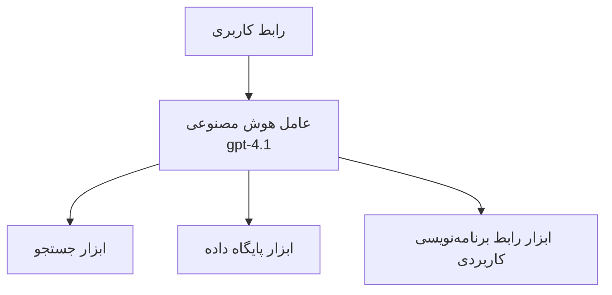
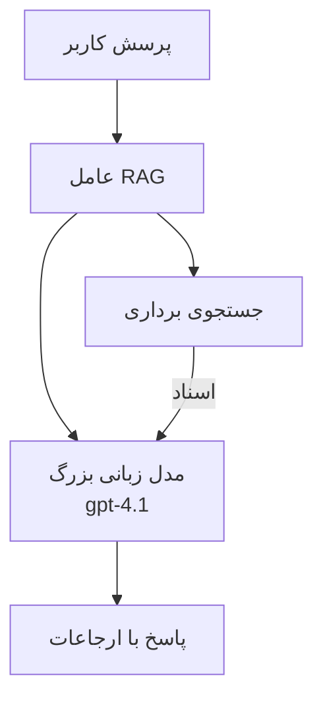
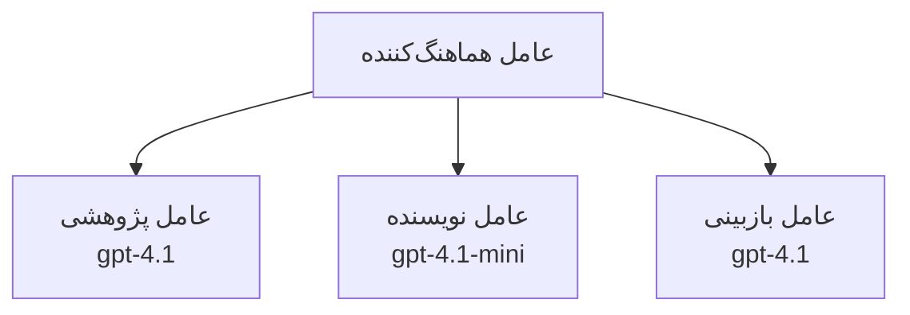

# عوامل هوش مصنوعی با Azure Developer CLI

**فهرست فصل:**
- **📚 صفحه دوره**: [AZD For Beginners](../../README.md)
- **📖 فصل فعلی**: فصل 2 - توسعه مبتنی بر هوش مصنوعی
- **⬅️ قبلی**: [Microsoft Foundry Integration](microsoft-foundry-integration.md)
- **➡️ بعدی**: [AI Model Deployment](ai-model-deployment.md)
- **🚀 پیشرفته**: [Multi-Agent Solutions](../../examples/retail-scenario.md)

---

## مقدمه

عوامل هوش مصنوعی برنامه‌های خودکاری هستند که می‌توانند محیط خود را درک کنند، تصمیم بگیرند و اقدامات را برای رسیدن به اهداف خاص انجام دهند. برخلاف چت‌بات‌های ساده که به دستورات پاسخ می‌دهند، عوامل می‌توانند:

- **استفاده از ابزارها** - فراخوانی APIها، جستجوی پایگاه‌داده‌ها، اجرای کد
- **برنامه‌ریزی و استدلال** - تقسیم وظایف پیچیده به گام‌ها
- **یادگیری از زمینه** - حفظ حافظه و تطبیق رفتار
- **همکاری** - کار با سایر عوامل (سامانه‌های چندعاملی)

این راهنما نشان می‌دهد چگونه عوامل هوش مصنوعی را با استفاده از Azure Developer CLI (azd) در Azure مستقر کنید.

> **یادداشت اعتبارسنجی (2026-03-25):** این راهنما در برابر `azd` `1.23.12` و `azure.ai.agents` `0.1.18-preview` مرور شده است. تجربه `azd ai` هنوز مبتنی بر پیش‌نمایش است، بنابراین اگر پرچم‌های نصب‌شده شما متفاوت است کمک افزونه را بررسی کنید.

## اهداف یادگیری

با تکمیل این راهنما، شما:
- درک کنید عوامل هوش مصنوعی چه هستند و چگونه با چت‌بات‌ها تفاوت دارند
- قالب‌های ازپیش‌ساخته عامل را با استفاده از AZD مستقر کنید
- عوامل Foundry را برای عوامل سفارشی پیکربندی کنید
- الگوهای پایه‌ای عامل (استفاده از ابزار، RAG، چندعاملی) را پیاده‌سازی کنید
- عوامل مستقر را نظارت و عیب‌یابی کنید

## نتایج یادگیری

پس از تکمیل، شما قادر خواهید بود:
- برنامه‌های عامل هوش مصنوعی را با یک فرمان به Azure مستقر کنید
- ابزارها و قابلیت‌های عامل را پیکربندی کنید
- تولید افزوده بر پایه بازیابی (RAG) را با عوامل پیاده‌سازی کنید
- معماری‌های چندعاملی برای جریان‌های کاری پیچیده طراحی کنید
- مشکلات رایج استقرار عامل را رفع عیب کنید

---

## 🤖 چه چیزی یک عامل را از یک چت‌بات متمایز می‌کند؟

| Feature | Chatbot | AI Agent |
|---------|---------|----------|
| **Behavior** | Responds to prompts | Takes autonomous actions |
| **Tools** | None | Can call APIs, search, execute code |
| **Memory** | Session-based only | Persistent memory across sessions |
| **Planning** | Single response | Multi-step reasoning |
| **Collaboration** | Single entity | Can work with other agents |

### تشبیه ساده

- **Chatbot** = یک فرد کمک‌کننده که در میز اطلاعات به سوالات پاسخ می‌دهد
- **AI Agent** = یک دستیار شخصی که می‌تواند تماس بگیرد، قرار ملاقات رزرو کند و وظایف را برای شما انجام دهد

---

## 🚀 شروع سریع: استقرار اولین عامل شما

### گزینه 1: قالب Foundry Agents (توصیه‌شده)

```bash
# قالب عامل‌های هوش مصنوعی را مقداردهی اولیه کنید
azd init --template get-started-with-ai-agents

# استقرار در آژور
azd up
```

**چه مواردی مستقر می‌شوند:**
- ✅ Foundry Agents
- ✅ Microsoft Foundry Models (gpt-4.1)
- ✅ Azure AI Search (برای RAG)
- ✅ Azure Container Apps (رابط وب)
- ✅ Application Insights (مانیتورینگ)

**زمان:** ~15-20 دقیقه
**هزینه:** ~$100-150/ماه (توسعه)

### گزینه 2: عامل OpenAI با Prompty

```bash
# الگوی عامل مبتنی بر Prompty را مقداردهی اولیه کنید
azd init --template agent-openai-python-prompty

# در Azure مستقر کنید
azd up
```

**چه مواردی مستقر می‌شوند:**
- ✅ Azure Functions (اجرای عامل بدون سرور)
- ✅ Microsoft Foundry Models
- ✅ فایل‌های پیکربندی Prompty
- ✅ پیاده‌سازی نمونه عامل

**زمان:** ~10-15 دقیقه
**هزینه:** ~$50-100/ماه (توسعه)

### گزینه 3: عامل چت RAG

```bash
# قالب چت RAG را مقداردهی اولیه کنید
azd init --template azure-search-openai-demo

# در Azure مستقر کنید
azd up
```

**چه مواردی مستقر می‌شوند:**
- ✅ Microsoft Foundry Models
- ✅ Azure AI Search با داده نمونه
- ✅ مسیر پردازش اسناد
- ✅ رابط چت با استنادها

**زمان:** ~15-25 دقیقه
**هزینه:** ~$80-150/ماه (توسعه)

### گزینه 4: AZD AI Agent Init (پیش‌نمایش مبتنی بر مانيفست یا قالب)

اگر فایل مانيفست عامل در اختیار دارید، می‌توانید از فرمان `azd ai` برای اسکافلد کردن مستقیم یک پروژه Foundry Agent Service استفاده کنید. نسخه‌های پیش‌نمایش اخیر همچنین پشتیبانی از مقداردهی اولیه مبتنی بر قالب را اضافه کرده‌اند، بنابراین جریان دقیق درخواست ممکن است بسته به نسخه افزونه نصب‌شده کمی متفاوت باشد.

```bash
# افزونه عامل‌های هوش مصنوعی را نصب کنید
azd extension install azure.ai.agents

# اختیاری: نسخه پیش‌نمایش نصب‌شده را بررسی کنید
azd extension show azure.ai.agents

# از مانیفست عامل مقداردهی اولیه کنید
azd ai agent init -m agent-manifest.yaml

# در آژور مستقر کنید
azd up
```

**زمانی که از `azd ai agent init` در مقابل `azd init --template` استفاده کنید:**

| Approach | Best For | How It Works |
|----------|----------|------|
| `azd init --template` | Starting from a working sample app | Clones a full template repo with code + infra |
| `azd ai agent init -m` | Building from your own agent manifest | Scaffolds project structure from your agent definition |

> **نکته:** از `azd init --template` هنگام یادگیری استفاده کنید (گزینه‌های 1-3 بالا). از `azd ai agent init` هنگام ساخت عوامل تولیدی با مانيفست‌های خود استفاده کنید. فهرست کامل را در [AZD AI CLI Commands](../chapter-08-production/production-ai-practices.md#azd-ai-cli-commands-and-extensions) ببینید.

---

## 🏗️ الگوهای معماری عامل

### الگو 1: عامل واحد با ابزارها

ساده‌ترین الگوی عامل - یک عامل که می‌تواند از ابزارهای متعدد استفاده کند.


**مناسب برای:**
- ربات‌های پشتیبانی مشتری
- دستیاران پژوهشی
- عوامل تحلیل داده

**قالب AZD:** `azure-search-openai-demo`

### الگو 2: عامل RAG (تولید افزوده‌شده با بازیابی)

عاملی که قبل از تولید پاسخ‌ها اسناد مرتبط را بازیابی می‌کند.


**مناسب برای:**
- پایگاه‌های دانش سازمانی
- سیستم‌های پرسش و پاسخ سندی
- تحقیقات حقوقی و انطباق

**قالب AZD:** `azure-search-openai-demo`

### الگو 3: سامانه چندعاملی

چند عامل تخصصی که برای انجام وظایف پیچیده با هم کار می‌کنند.


**مناسب برای:**
- تولید محتوای پیچیده
- جریان‌های کاری چندمرحله‌ای
- وظایفی که به تخصص‌های مختلف نیاز دارند

**بیشتر بیاموزید:** [Multi-Agent Coordination Patterns](../chapter-06-pre-deployment/coordination-patterns.md)

---

## ⚙️ پیکربندی ابزارهای عامل

عامل‌ها زمانی قدرتمند می‌شوند که بتوانند از ابزارها استفاده کنند. در اینجا نحوه پیکربندی ابزارهای رایج آمده است:

### پیکربندی ابزار در Foundry Agents

```python
# agent_config.py
from azure.ai.projects import AIProjectClient
from azure.ai.projects.models import FunctionTool, CodeInterpreterTool

# تعریف ابزارهای سفارشی
search_tool = FunctionTool(
    name="search_knowledge_base",
    description="Search the company knowledge base for relevant documents",
    parameters={
        "type": "object",
        "properties": {
            "query": {
                "type": "string",
                "description": "The search query"
            }
        },
        "required": ["query"]
    }
)

# ایجاد عامل با ابزارها
agent = project_client.agents.create_agent(
    model="gpt-4.1",
    name="Support Agent",
    instructions="You are a helpful support agent. Use the search tool to find relevant information.",
    tools=[search_tool, CodeInterpreterTool()]
)
```

### پیکربندی محیط

```bash
# متغیرهای محیطی مربوط به عامل را تنظیم کنید
azd env set AZURE_OPENAI_MODEL "gpt-4.1"
azd env set AGENT_INSTRUCTIONS "You are a helpful assistant..."
azd env set ENABLE_CODE_INTERPRETER "true"
azd env set ENABLE_FILE_SEARCH "true"

# با پیکربندی به‌روز شده مستقر کنید
azd deploy
```

---

## 📊 نظارت بر عوامل

### ادغام Application Insights

تمام قالب‌های عامل AZD شامل Application Insights برای مانیتورینگ هستند:

```bash
# باز کردن داشبورد مانیتورینگ
azd monitor --overview

# مشاهده لاگ‌هأ زنده
azd monitor --logs

# مشاهده متریک‌هأ زنده
azd monitor --live
```

### معیارهای کلیدی برای پیگیری

| Metric | Description | Target |
|--------|-------------|--------|
| Response Latency | Time to generate response | < 5 ثانیه |
| Token Usage | Tokens per request | برای هزینه نظارت کنید |
| Tool Call Success Rate | % of successful tool executions | > 95% |
| Error Rate | Failed agent requests | < 1% |
| User Satisfaction | Feedback scores | > 4.0/5.0 |

### ثبت لاگ سفارشی برای عامل‌ها

```python
import os
from azure.monitor.opentelemetry import configure_azure_monitor
from opentelemetry import trace

# پیکربندی Azure Monitor با OpenTelemetry
configure_azure_monitor(
    connection_string=os.environ["APPLICATIONINSIGHTS_CONNECTION_STRING"]
)

tracer = trace.get_tracer(__name__)

def log_agent_interaction(user_query, agent_response, tools_used, latency_ms):
    with tracer.start_as_current_span("agent_interaction") as span:
        span.set_attributes({
            "user_query": user_query,
            "response_length": len(agent_response),
            "tools_used": tools_used,
            "latency_ms": latency_ms
        })
```

> **نکته:** بسته‌های موردنیاز را نصب کنید: `pip install azure-monitor-opentelemetry opentelemetry`

---

## 💰 ملاحظات هزینه

### هزینه‌های ماهیانه تخمینی بر اساس الگو

| Pattern | Dev Environment | Production |
|---------|-----------------|------------|
| Single Agent | $50-100 | $200-500 |
| RAG Agent | $80-150 | $300-800 |
| Multi-Agent (2-3 agents) | $150-300 | $500-1,500 |
| Enterprise Multi-Agent | $300-500 | $1,500-5,000+ |

### نکات بهینه‌سازی هزینه

1. **از gpt-4.1-mini برای وظایف ساده استفاده کنید**
   ```bash
   azd env set AZURE_OPENAI_MODEL "gpt-4.1-mini"
   ```

2. **برای پرس‌و‌جوهای تکراری کشینگ پیاده‌سازی کنید**
   ```python
   from functools import lru_cache
   
   @lru_cache(maxsize=1000)
   def get_cached_response(query_hash):
       return agent.run(query_hash)
   ```

3. **برای هر اجرا محدودیت توکن تعیین کنید**
   ```python
   # هنگام اجرای عامل مقدار max_completion_tokens را تنظیم کنید، نه در هنگام ایجاد
   run = project_client.agents.create_run(
       thread_id=thread.id,
       agent_id=agent.id,
       max_completion_tokens=1000  # طول پاسخ را محدود کنید
   )
   ```

4. **هنگام عدم استفاده به صفر مقیاس دهید**
   ```bash
   # برنامه‌های کانتینری به‌طور خودکار تا صفر مقیاس می‌یابند
   azd env set MIN_REPLICAS "0"
   ```

---

## 🔧 رفع اشکال عامل‌ها

### مشکلات رایج و راه‌حل‌ها

<details>
<summary><strong>❌ عامل به تماس‌های ابزار پاسخ نمی‌دهد</strong></summary>

```bash
# بررسی کنید که ابزارها به درستی ثبت شده‌اند
azd show

# استقرار OpenAI را تأیید کنید
az cognitiveservices account deployment list \
  --name $AZURE_OPENAI_NAME \
  --resource-group $RG_NAME

# لاگ‌های عامل را بررسی کنید
azd monitor --logs
```

**علل رایج:**
- مغایرت امضای تابع ابزار
- فقدان مجوزهای موردنیاز
- نقطه انتهایی API قابل دسترسی نیست
</details>

<details>
<summary><strong>❌ تأخیر زیاد در پاسخ‌های عامل</strong></summary>

```bash
# برای شناسایی گلوگاه‌ها، Application Insights را بررسی کنید
azd monitor --live

# استفاده از مدلی سریع‌تر را در نظر بگیرید
azd env set AZURE_OPENAI_MODEL "gpt-4.1-mini"
azd deploy
```

**نکات بهینه‌سازی:**
- از پاسخ‌های جریانی استفاده کنید
- کشینگ پاسخ را پیاده‌سازی کنید
- اندازه پنجره زمینه را کاهش دهید
</details>

<details>
<summary><strong>❌ عامل اطلاعات نادرست یا هالوسینه بازمی‌گرداند</strong></summary>

```python
# با پرامپت‌های سیستمی بهتر بهبود دهید
instructions = """
You are a helpful assistant. IMPORTANT:
- Only answer based on provided context
- If you don't know, say "I don't know"
- Always cite your sources
- Never make up information
"""

# افزودن مکانیزم بازیابی برای پایه‌گذاری
agent = project_client.agents.create_agent(
    model="gpt-4.1",
    instructions=instructions,
    tools=[FileSearchTool()]  # پاسخ‌ها را بر اساس اسناد پایه‌گذاری کنید
)
```
</details>

<details>
<summary><strong>❌ خطاهای تجاوز از محدودیت توکن</strong></summary>

```python
# پیاده‌سازی مدیریت پنجرهٔ زمینه
def truncate_context(messages, max_tokens=8000, model="gpt-4.1"):
    """Keep only recent messages within token limit."""
    import tiktoken
    encoding = tiktoken.encoding_for_model(model)
    total_tokens = 0
    truncated = []
    
    for msg in reversed(messages):
        msg_tokens = len(encoding.encode(msg.content))
        if total_tokens + msg_tokens > max_tokens:
            break
        truncated.insert(0, msg)
        total_tokens += msg_tokens
    
    return truncated
```
</details>

---

## 🎓 تمرین‌های عملی

### تمرین 1: استقرار یک عامل پایه (20 دقیقه)

**هدف:** استقرار اولین عامل هوش مصنوعی خود با استفاده از AZD

```bash
# مرحله ۱: مقداردهی اولیه قالب
azd init --template get-started-with-ai-agents

# مرحله ۲: ورود به Azure
azd auth login
# اگر در چند مستأجر کار می‌کنید، --tenant-id <tenant-id> را اضافه کنید

# مرحله ۳: استقرار
azd up

# مرحله ۴: آزمایش عامل
# خروجی مورد انتظار پس از استقرار:
#   استقرار کامل شد!
#   نقطه پایانی: https://<app-name>.<region>.azurecontainerapps.io
# نشانی نمایش‌داده‌شده در خروجی را باز کنید و سعی کنید یک سؤال بپرسید

# مرحله ۵: مشاهدهٔ مانیتورینگ
azd monitor --overview

# مرحله ۶: پاک‌سازی
azd down --force --purge
```

**معیارهای موفقیت:**
- [ ] عامل به سوالات پاسخ می‌دهد
- [ ] می‌توان از طریق `azd monitor` به داشبورد مانیتورینگ دسترسی داشت
- [ ] منابع با موفقیت پاک‌سازی شدند

### تمرین 2: افزودن یک ابزار سفارشی (30 دقیقه)

**هدف:** گسترش یک عامل با یک ابزار سفارشی

1. Deploy the agent template:
   ```bash
   azd init --template get-started-with-ai-agents
   azd up
   ```
2. یک تابع ابزار جدید در کد عامل خود ایجاد کنید:
   ```python
   def get_weather(location: str) -> str:
       """Get current weather for a location."""
       # فراخوانی API برای سرویس هواشناسی
       return f"Weather in {location}: Sunny, 72°F"
   ```
3. ابزار را در عامل ثبت کنید:
   ```python
   from azure.ai.projects.models import FunctionTool

   weather_tool = FunctionTool(
       name="get_weather",
       description="Get current weather for a location",
       parameters={
           "type": "object",
           "properties": {
               "location": {"type": "string", "description": "City name"}
           },
           "required": ["location"]
       }
   )

   agent = project_client.agents.create_agent(
       model="gpt-4.1",
       name="Weather Agent",
       tools=[weather_tool]
   )
   ```
4. مجدداً مستقر کنید و تست کنید:
   ```bash
   azd deploy
   # پرسش: «هوا در سیاتل چگونه است؟»
   # انتظار: عامل تابع get_weather("Seattle") را فراخوانی می‌کند و اطلاعات آب‌وهوا را بازمی‌گرداند
   ```

**معیارهای موفقیت:**
- [ ] عامل سوالات مربوط به هواشناسی را تشخیص می‌دهد
- [ ] ابزار به‌درستی فراخوانی می‌شود
- [ ] پاسخ شامل اطلاعات آب و هوا است

### تمرین 3: ساخت یک عامل RAG (45 دقیقه)

**هدف:** ایجاد عاملی که به سوالات از اسناد شما پاسخ دهد

```bash
# گام ۱: استقرار قالب RAG
azd init --template azure-search-openai-demo
azd up

# گام ۲: اسناد خود را آپلود کنید
# فایل‌های PDF/TXT را در پوشه data/ قرار دهید، سپس اجرا کنید:
python scripts/prepdocs.py

# گام ۳: با سوالات مربوط به حوزه آزمایش کنید
# URL برنامه وب را از خروجی azd up باز کنید
# درباره اسناد آپلود شده خود سوال بپرسید
# پاسخ‌ها باید شامل ارجاعات استنادی مانند [doc.pdf] باشند
```

**معیارهای موفقیت:**
- [ ] عامل از اسناد بارگذاری‌شده پاسخ می‌دهد
- [ ] پاسخ‌ها شامل استنادها هستند
- [ ] در سوالات خارج از دامنه هالوسینه وجود ندارد

---

## 📚 گام‌های بعدی

اکنون که با عوامل هوش مصنوعی آشنا شدید، این موضوعات پیشرفته را کاوش کنید:

| Topic | Description | Link |
|-------|-------------|------|
| **Multi-Agent Systems** | Build systems with multiple collaborating agents | [Retail Multi-Agent Example](../../examples/retail-scenario.md) |
| **Coordination Patterns** | Learn orchestration and communication patterns | [Coordination Patterns](../chapter-06-pre-deployment/coordination-patterns.md) |
| **Production Deployment** | Enterprise-ready agent deployment | [Production AI Practices](../chapter-08-production/production-ai-practices.md) |
| **Agent Evaluation** | Test and evaluate agent performance | [AI Troubleshooting](../chapter-07-troubleshooting/ai-troubleshooting.md) |
| **AI Workshop Lab** | Hands-on: Make your AI solution AZD-ready | [AI Workshop Lab](ai-workshop-lab.md) |

---

## 📖 منابع اضافی

### مستندات رسمی
- [Azure AI Agent Service](https://learn.microsoft.com/azure/ai-services/agents/)
- [Azure AI Foundry Agent Service Quickstart](https://learn.microsoft.com/azure/ai-services/agents/quickstart)
- [Semantic Kernel Agent Framework](https://learn.microsoft.com/semantic-kernel/)

### قالب‌های AZD برای عوامل
- [Get Started with AI Agents](https://github.com/Azure-Samples/get-started-with-ai-agents)
- [Agent OpenAI Python Prompty](https://github.com/Azure-Samples/agent-openai-python-prompty)
- [Azure Search OpenAI Demo](https://github.com/Azure-Samples/azure-search-openai-demo)

### منابع جامعه
- [Awesome AZD - Agent Templates](https://azure.github.io/awesome-azd/?tags=ai-agents)
- [Azure AI Discord](https://discord.gg/microsoft-azure)
- [Microsoft Foundry Discord](https://discord.gg/nTYy5BXMWG)

### مهارت‌های عامل برای ویرایشگر شما
- [**Microsoft Azure Agent Skills**](https://skills.sh/microsoft/github-copilot-for-azure) - نصب مهارت‌های قابل استفاده مجدد عامل هوش مصنوعی برای توسعه Azure در GitHub Copilot، Cursor، یا هر عامل پشتیبانی‌شده دیگر. شامل مهارت‌هایی برای [Azure AI](https://skills.sh/microsoft/github-copilot-for-azure/azure-ai)، [Microsoft Foundry](https://skills.sh/microsoft/github-copilot-for-azure/microsoft-foundry)، [deployment](https://skills.sh/microsoft/github-copilot-for-azure/azure-deploy)، و [diagnostics](https://skills.sh/microsoft/github-copilot-for-azure/azure-diagnostics):
  ```bash
  npx skills add microsoft/github-copilot-for-azure
  ```

---

**هدایت**
- **درس قبلی**: [Microsoft Foundry Integration](microsoft-foundry-integration.md)
- **درس بعدی**: [AI Model Deployment](ai-model-deployment.md)

---

<!-- CO-OP TRANSLATOR DISCLAIMER START -->
**سلب مسئولیت**:
این سند با استفاده از سرویس ترجمهٔ مبتنی بر هوش مصنوعی [Co-op Translator](https://github.com/Azure/co-op-translator) ترجمه شده است. در حالی که ما در تلاش برای دقت هستیم، لطفاً توجه داشته باشید که ترجمه‌های خودکار ممکن است حاوی خطاها یا نادقیق‌گی‌هایی باشند. نسخهٔ اصلی سند به زبان اصلی آن باید به‌عنوان مرجع معتبر در نظر گرفته شود. برای اطلاعات حساس یا حیاتی، ترجمهٔ حرفه‌ای انسانی توصیه می‌شود. ما در قبال هرگونه سوءتفاهم یا تفسیر نادرستی که از استفاده از این ترجمه ناشی شود، مسئولیتی نداریم.
<!-- CO-OP TRANSLATOR DISCLAIMER END -->