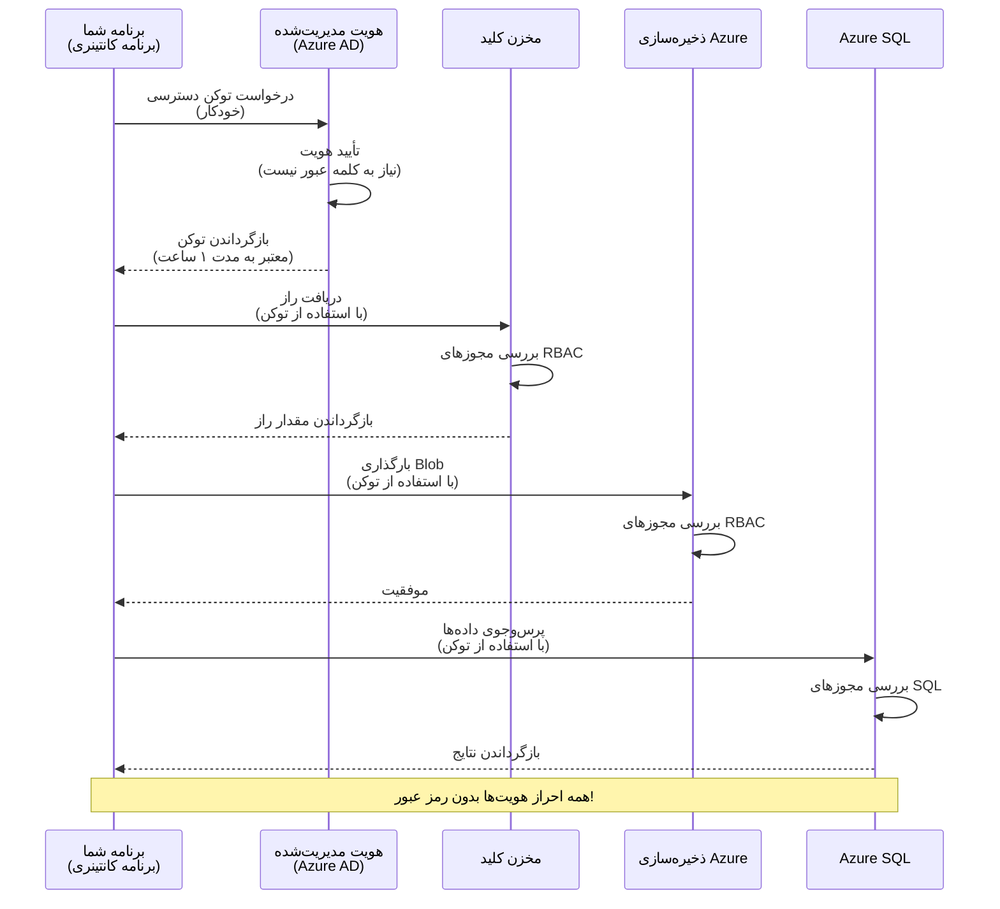
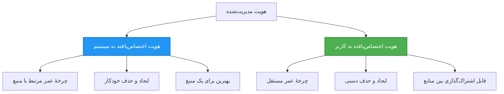

# الگوهای احراز هویت و Managed Identity

⏱️ **زمان تخمینی**: 45-60 دقیقه | 💰 **تأثیر هزینه**: رایگان (بدون هزینه اضافی) | ⭐ **پیچیدگی**: متوسط

**📚 مسیر یادگیری:**
- ← قبلی: [مدیریت پیکربندی](configuration.md) - مدیریت متغیرهای محیطی و اسرار
- 🎯 **شما اینجا هستید**: احراز هویت و امنیت (Managed Identity، Key Vault، الگوهای امن)
- → بعدی: [اولین پروژه](first-project.md) - ساخت اولین برنامه AZD خود
- 🏠 [خانه دوره](../../README.md)

---

## آنچه خواهید آموخت

با تکمیل این درس، شما:
- الگوهای احراز هویت در Azure را درک خواهید کرد (کلیدها، connection stringها، managed identity)
- پیاده‌سازی **Managed Identity** برای احراز هویت بدون رمز عبور را خواهید آموخت
- امن‌سازی اسرار با ادغام **Azure Key Vault**
- پیکربندی کنترل دسترسی مبتنی بر نقش (RBAC) برای استقرارهای AZD
- اعمال بهترین روش‌های امنیتی در Container Apps و سرویس‌های Azure
- مهاجرت از احراز هویت مبتنی بر کلید به مبتنی بر هویت را انجام خواهید داد

## چرا Managed Identity مهم است

### مشکل: احراز هویت سنتی

**قبل از Managed Identity:**
```javascript
// ❌ خطر امنیتی: مقادیر محرمانه به‌صورت سخت‌کدشده در کد
const connectionString = "Server=mydb.database.windows.net;User=admin;Password=P@ssw0rd123";
const storageKey = "xK7mN9pQ2wR5tY8uI0oP3aS6dF1gH4jK...";
const cosmosKey = "C2x7B9n4M1p8Q5w3E6r0T2y5U8i1O4p7...";
```

**مشکلات:**
- 🔴 **افشای اسرار** در کد، فایل‌های پیکربندی، متغیرهای محیطی
- 🔴 **چرخش اعتبارنامه** نیازمند تغییر کد و redeploy است
- 🔴 **مشکلات حسابرسی** - چه کسی، چه زمانی به چه چیزی دسترسی داشته؟
- 🔴 **پراکنده بودن** - اسرار پراکنده در سیستم‌های متعدد
- 🔴 **ریسک‌های انطباق** - عدم موفقیت در ممیزی‌های امنیتی

### راه حل: Managed Identity

**بعد از Managed Identity:**
```javascript
// ✅ ایمن: در کد هیچ اطلاعات محرمانه‌ای وجود ندارد
const credential = new DefaultAzureCredential();
const client = new BlobServiceClient(
  "https://mystorageaccount.blob.core.windows.net",
  credential  // آزور به‌طور خودکار احراز هویت را مدیریت می‌کند
);
```

**مزایا:**
- ✅ **بدون رازها** در کد یا پیکربندی
- ✅ **چرخش خودکار** - توسط Azure مدیریت می‌شود
- ✅ **ردیابی کامل حسابرسی** در لاگ‌های Azure AD
- ✅ **امنیت متمرکز** - مدیریت در پرتال Azure
- ✅ **آماده برای انطباق** - مطابق با استانداردهای امنیتی

**تشبیه**: احراز هویت سنتی مانند حمل چندین کلید فیزیکی برای درهای مختلف است. Managed Identity مانند داشتن یک کارت امنیتی است که براساس هویت شما به‌صورت خودکار دسترسی می‌دهد—بدون کلیدی برای گم شدن، کپی شدن یا چرخش.

---

## نمای کلی معماری

### جریان احراز هویت با Managed Identity


### انواع Managed Identities


| ویژگی | System-Assigned | User-Assigned |
|---------|----------------|---------------|
| **چرخه عمر** | وابسته به منبع | مستقل |
| **ایجاد** | به‌صورت خودکار همراه منبع | ایجاد دستی |
| **حذف** | با حذف منبع حذف می‌شود | پس از حذف منبع باقی می‌ماند |
| **اشتراک‌گذاری** | فقط یک منبع | چندین منبع |
| **مورد استفاده** | سناریوهای ساده | سناریوهای پیچیده چندمنبعی |
| **پیش‌فرض AZD** | ✅ توصیه‌شده | اختیاری |

---

## پیش‌نیازها

### ابزارهای مورد نیاز

باید این ابزارها را از دروس قبلی نصب کرده باشید:

```bash
# تأیید Azure Developer CLI
azd version
# ✅ انتظار می‌رود: نسخه azd 1.0.0 یا بالاتر

# تأیید Azure CLI
az --version
# ✅ انتظار می‌رود: azure-cli 2.50.0 یا بالاتر
```

### نیازمندی‌های Azure

- اشتراک فعال Azure
- دسترسی‌ها برای:
  - ایجاد managed identities
  - اختصاص نقش‌های RBAC
  - ایجاد منابع Key Vault
  - استقرار Container Apps

### پیش‌نیازهای دانش

باید موارد زیر را تکمیل کرده باشید:
- [راهنمای نصب](installation.md) - راه‌اندازی AZD
- [مبانی AZD](azd-basics.md) - مفاهیم اصلی
- [مدیریت پیکربندی](configuration.md) - متغیرهای محیطی

---

## درس 1: درک الگوهای احراز هویت

### الگو 1: Connection Strings (سنتی - اجتناب کنید)

**نحوه کار:**
```bash
# رشته اتصال حاوی اطلاعات ورود
STORAGE_CONNECTION_STRING="DefaultEndpointsProtocol=https;AccountName=myaccount;AccountKey=xK7mN9pQ2wR5..."
COSMOS_CONNECTION_STRING="AccountEndpoint=https://myaccount.documents.azure.com:443/;AccountKey=C2x7..."
SQL_CONNECTION_STRING="Server=myserver.database.windows.net;User=admin;Password=P@ssw0rd..."
```

**مشکلات:**
- ❌ اسرار قابل مشاهده در متغیرهای محیطی
- ❌ لاگ‌شده در سیستم‌های استقرار
- ❌ سخت برای چرخش
- ❌ بدون ردپای حسابرسی از دسترسی

**زمان استفاده:** فقط برای توسعه محلی، هرگز در production.

---

### الگو 2: ارجاع به Key Vault (بهتر)

**نحوه کار:**
```bicep
// Store secret in Key Vault
resource keyVault 'Microsoft.KeyVault/vaults@2023-02-01' = {
  name: 'mykv'
  properties: {
    enableRbacAuthorization: true
  }
}

// Reference in Container App
env: [
  {
    name: 'STORAGE_KEY'
    secretRef: 'storage-key'  // References Key Vault
  }
]
```

**مزایا:**
- ✅ اسرار به‌صورت ایمن در Key Vault ذخیره می‌شوند
- ✅ مدیریت اسرار متمرکز
- ✅ چرخش بدون تغییر در کد

**محدودیت‌ها:**
- ⚠️ هنوز از کلیدها/رمزها استفاده می‌شود
- ⚠️ نیاز به مدیریت دسترسی به Key Vault دارد

**زمان استفاده:** گام انتقال از connection stringها به managed identity.

---

### الگو 3: Managed Identity (بهترین روش)

**نحوه کار:**
```bicep
// Enable managed identity
resource containerApp 'Microsoft.App/containerApps@2023-05-01' = {
  name: 'myapp'
  identity: {
    type: 'SystemAssigned'  // Automatically creates identity
  }
}

// Grant permissions
resource roleAssignment 'Microsoft.Authorization/roleAssignments@2022-04-01' = {
  scope: storageAccount
  properties: {
    roleDefinitionId: storageBlobDataContributorRole
    principalId: containerApp.identity.principalId
  }
}
```

**کد برنامه:**
```javascript
// نیازی به راز نیست!
const { DefaultAzureCredential } = require('@azure/identity');
const { BlobServiceClient } = require('@azure/storage-blob');

const credential = new DefaultAzureCredential();
const blobServiceClient = new BlobServiceClient(
  'https://mystorageaccount.blob.core.windows.net',
  credential
);
```

**مزایا:**
- ✅ هیچ رازی در کد/پیکربندی نیست
- ✅ چرخش اعتبارنامه خودکار
- ✅ ردپای کامل حسابرسی
- ✅ دسترسی‌ها مبتنی بر RBAC
- ✅ آماده برای انطباق

**زمان استفاده:** همیشه، برای برنامه‌های production.

---

## درس 2: پیاده‌سازی Managed Identity با AZD

### پیاده‌سازی گام‌به‌گام

بیایید یک Container App امن بسازیم که از managed identity برای دسترسی به Azure Storage و Key Vault استفاده کند.

### ساختار پروژه

```
secure-app/
├── azure.yaml                 # AZD configuration
├── infra/
│   ├── main.bicep            # Main infrastructure
│   ├── core/
│   │   ├── identity.bicep    # Managed identity setup
│   │   ├── keyvault.bicep    # Key Vault configuration
│   │   └── storage.bicep     # Storage with RBAC
│   └── app/
│       └── container-app.bicep
└── src/
    ├── app.js                # Application code
    ├── package.json
    └── Dockerfile
```

### 1. پیکربندی AZD (azure.yaml)

```yaml
name: secure-app
metadata:
  template: secure-app@1.0.0

services:
  api:
    project: ./src
    language: js
    host: containerapp

# Enable managed identity (AZD handles this automatically)
```

### 2. زیرساخت: فعال‌سازی Managed Identity

**فایل: `infra/main.bicep`**

```bicep
targetScope = 'subscription'

param environmentName string
param location string = 'eastus'

var tags = { 'azd-env-name': environmentName }

// Resource group
resource rg 'Microsoft.Resources/resourceGroups@2021-04-01' = {
  name: 'rg-${environmentName}'
  location: location
  tags: tags
}

// Storage Account
module storage './core/storage.bicep' = {
  name: 'storage'
  scope: rg
  params: {
    name: 'st${uniqueString(rg.id)}'
    location: location
    tags: tags
  }
}

// Key Vault
module keyVault './core/keyvault.bicep' = {
  name: 'keyvault'
  scope: rg
  params: {
    name: 'kv-${uniqueString(rg.id)}'
    location: location
    tags: tags
  }
}

// Container App with Managed Identity
module containerApp './app/container-app.bicep' = {
  name: 'container-app'
  scope: rg
  params: {
    name: 'ca-${environmentName}'
    location: location
    tags: tags
    storageAccountName: storage.outputs.name
    keyVaultName: keyVault.outputs.name
  }
}

// Grant Container App access to Storage
module storageRoleAssignment './core/role-assignment.bicep' = {
  name: 'storage-role'
  scope: rg
  params: {
    principalId: containerApp.outputs.identityPrincipalId
    roleDefinitionId: 'ba92f5b4-2d11-453d-a403-e96b0029c9fe'  // Storage Blob Data Contributor
    targetResourceId: storage.outputs.id
  }
}

// Grant Container App access to Key Vault
module kvRoleAssignment './core/role-assignment.bicep' = {
  name: 'kv-role'
  scope: rg
  params: {
    principalId: containerApp.outputs.identityPrincipalId
    roleDefinitionId: '4633458b-17de-408a-b874-0445c86b69e6'  // Key Vault Secrets User
    targetResourceId: keyVault.outputs.id
  }
}

// Outputs
output AZURE_STORAGE_ACCOUNT_NAME string = storage.outputs.name
output AZURE_KEY_VAULT_NAME string = keyVault.outputs.name
output APP_URL string = containerApp.outputs.url
```

### 3. Container App با هویت اختصاص‌یافته توسط سیستم

**فایل: `infra/app/container-app.bicep`**

```bicep
param name string
param location string
param tags object = {}
param storageAccountName string
param keyVaultName string

resource containerApp 'Microsoft.App/containerApps@2023-05-01' = {
  name: name
  location: location
  tags: tags
  identity: {
    type: 'SystemAssigned'  // 🔑 Enable managed identity
  }
  properties: {
    configuration: {
      ingress: {
        external: true
        targetPort: 3000
      }
    }
    template: {
      containers: [
        {
          name: 'api'
          image: 'myregistry.azurecr.io/api:latest'
          resources: {
            cpu: json('0.5')
            memory: '1Gi'
          }
          env: [
            {
              name: 'AZURE_STORAGE_ACCOUNT_NAME'
              value: storageAccountName
            }
            {
              name: 'AZURE_KEY_VAULT_NAME'
              value: keyVaultName
            }
            // 🔑 No secrets - managed identity handles authentication!
          ]
        }
      ]
    }
  }
}

// Output the identity for RBAC assignments
output identityPrincipalId string = containerApp.identity.principalId
output id string = containerApp.id
output url string = 'https://${containerApp.properties.configuration.ingress.fqdn}'
```

### 4. ماژول اختصاص نقش RBAC

**فایل: `infra/core/role-assignment.bicep`**

```bicep
param principalId string
param roleDefinitionId string  // Azure built-in role ID
param targetResourceId string

resource roleAssignment 'Microsoft.Authorization/roleAssignments@2022-04-01' = {
  name: guid(principalId, roleDefinitionId, targetResourceId)
  scope: resourceId('Microsoft.Resources/resourceGroups', resourceGroup().name)
  properties: {
    roleDefinitionId: subscriptionResourceId('Microsoft.Authorization/roleDefinitions', roleDefinitionId)
    principalId: principalId
    principalType: 'ServicePrincipal'
  }
}

output id string = roleAssignment.id
```

### 5. کد برنامه با Managed Identity

**فایل: `src/app.js`**

```javascript
const express = require('express');
const { DefaultAzureCredential } = require('@azure/identity');
const { BlobServiceClient } = require('@azure/storage-blob');
const { SecretClient } = require('@azure/keyvault-secrets');

const app = express();
const PORT = process.env.PORT || 3000;

// 🔑 اعتبارنامه را مقداردهی اولیه کنید (با هویت مدیریت‌شده به‌صورت خودکار کار می‌کند)
const credential = new DefaultAzureCredential();

// پیکربندی Azure Storage
const storageAccountName = process.env.AZURE_STORAGE_ACCOUNT_NAME;
const blobServiceClient = new BlobServiceClient(
  `https://${storageAccountName}.blob.core.windows.net`,
  credential  // نیازی به کلیدها نیست!
);

// پیکربندی Key Vault
const keyVaultName = process.env.AZURE_KEY_VAULT_NAME;
const secretClient = new SecretClient(
  `https://${keyVaultName}.vault.azure.net`,
  credential  // نیازی به کلیدها نیست!
);

// بررسی سلامت
app.get('/health', (req, res) => {
  res.json({ status: 'healthy', authentication: 'managed-identity' });
});

// بارگذاری فایل در Blob Storage
app.post('/upload', async (req, res) => {
  try {
    const containerClient = blobServiceClient.getContainerClient('uploads');
    await containerClient.createIfNotExists();
    
    const blobName = `file-${Date.now()}.txt`;
    const blockBlobClient = containerClient.getBlockBlobClient(blobName);
    
    await blockBlobClient.upload('Hello from managed identity!', 30);
    
    res.json({
      success: true,
      blobName: blobName,
      message: 'File uploaded using managed identity!'
    });
  } catch (error) {
    console.error('Upload error:', error);
    res.status(500).json({ error: error.message });
  }
});

// دریافت مقدار مخفی از Key Vault
app.get('/secret/:name', async (req, res) => {
  try {
    const secretName = req.params.name;
    const secret = await secretClient.getSecret(secretName);
    
    res.json({
      name: secretName,
      value: secret.value,
      message: 'Secret retrieved using managed identity!'
    });
  } catch (error) {
    console.error('Secret error:', error);
    res.status(500).json({ error: error.message });
  }
});

// فهرست کانتینرهای Blob (دسترسی خواندن را نشان می‌دهد)
app.get('/containers', async (req, res) => {
  try {
    const containers = [];
    for await (const container of blobServiceClient.listContainers()) {
      containers.push(container.name);
    }
    
    res.json({
      containers: containers,
      count: containers.length,
      message: 'Containers listed using managed identity!'
    });
  } catch (error) {
    console.error('List error:', error);
    res.status(500).json({ error: error.message });
  }
});

app.listen(PORT, () => {
  console.log(`Secure API listening on port ${PORT}`);
  console.log('Authentication: Managed Identity (passwordless)');
});
```

**فایل: `src/package.json`**

```json
{
  "name": "secure-app",
  "version": "1.0.0",
  "dependencies": {
    "express": "^4.18.2",
    "@azure/identity": "^4.0.0",
    "@azure/storage-blob": "^12.17.0",
    "@azure/keyvault-secrets": "^4.7.0"
  },
  "scripts": {
    "start": "node app.js"
  }
}
```

### 6. استقرار و تست

```bash
# محیط AZD را مقداردهی اولیه کنید
azd init

# زیرساخت و برنامه را مستقر کنید
azd up

# آدرس URL برنامه را دریافت کنید
APP_URL=$(azd env get-values | grep APP_URL | cut -d '=' -f2 | tr -d '"')

# بررسی وضعیت سلامت را آزمایش کنید
curl $APP_URL/health
```

**✅ خروجی مورد انتظار:**
```json
{
  "status": "healthy",
  "authentication": "managed-identity"
}
```

**آزمایش آپلود بلوک (blob upload):**
```bash
curl -X POST $APP_URL/upload
```

**✅ خروجی مورد انتظار:**
```json
{
  "success": true,
  "blobName": "file-1700404800000.txt",
  "message": "File uploaded using managed identity!"
}
```

**آزمایش لیست‌کردن کانتینرها:**
```bash
curl $APP_URL/containers
```

**✅ خروجی مورد انتظار:**
```json
{
  "containers": ["uploads"],
  "count": 1,
  "message": "Containers listed using managed identity!"
}
```

---

## نقش‌های رایج RBAC در Azure

### شناسه‌های نقشِ تعبیه‌شده برای Managed Identity

| سرویس | Role Name | Role ID | مجوزها |
|---------|-----------|---------|-------------|
| **Storage** | Storage Blob Data Reader | `2a2b9908-6b94-4a3d-8e5a-a7d8f8cc8a12` | خواندن blobها و کانتینرها |
| **Storage** | Storage Blob Data Contributor | `ba92f5b4-2d11-453d-a403-e96b0029c9fe` | خواندن، نوشتن، حذف blobها |
| **Storage** | Storage Queue Data Contributor | `974c5e8b-45b9-4653-ba55-5f855dd0fb88` | خواندن، نوشتن، حذف پیام‌های صف |
| **Key Vault** | Key Vault Secrets User | `4633458b-17de-408a-b874-0445c86b69e6` | خواندن اسرار |
| **Key Vault** | Key Vault Secrets Officer | `b86a8fe4-44ce-4948-aee5-eccb2c155cd7` | خواندن، نوشتن، حذف اسرار |
| **Cosmos DB** | Cosmos DB Built-in Data Reader | `00000000-0000-0000-0000-000000000001` | خواندن داده‌های Cosmos DB |
| **Cosmos DB** | Cosmos DB Built-in Data Contributor | `00000000-0000-0000-0000-000000000002` | خواندن، نوشتن داده‌های Cosmos DB |
| **SQL Database** | SQL DB Contributor | `9b7fa17d-e63e-47b0-bb0a-15c516ac86ec` | مدیریت پایگاه‌های داده SQL |
| **Service Bus** | Azure Service Bus Data Owner | `090c5cfd-751d-490a-894a-3ce6f1109419` | ارسال، دریافت و مدیریت پیام‌ها |

### چگونه شناسه‌های نقش را پیدا کنیم

```bash
# فهرست تمام نقش‌های داخلی
az role definition list --query "[].{Name:roleName, ID:name}" --output table

# جستجوی نقش خاص
az role definition list --query "[?contains(roleName, 'Storage Blob')].{Name:roleName, ID:name}" --output table

# دریافت جزئیات نقش
az role definition list --name "Storage Blob Data Contributor"
```

---

## تمرین‌های عملی

### تمرین 1: فعال‌سازی Managed Identity برای برنامه موجود ⭐⭐ (متوسط)

**هدف**: افزودن managed identity به یک استقرار Container App موجود

**سناریو**: شما یک Container App دارید که از connection stringها استفاده می‌کند. آن را به managed identity تبدیل کنید.

**نقطه شروع**: Container App با این پیکربندی:

```bicep
// ❌ Current: Using connection string
env: [
  {
    name: 'STORAGE_CONNECTION_STRING'
    secretRef: 'storage-connection'
  }
]
```

**مراحل**:

1. **فعال‌سازی managed identity در Bicep:**

```bicep
resource containerApp 'Microsoft.App/containerApps@2023-05-01' = {
  name: 'myapp'
  identity: {
    type: 'SystemAssigned'  // Add this
  }
  // ... rest of configuration
}
```

2. **اعطای دسترسی به Storage:**

```bicep
// Get storage account reference
resource storageAccount 'Microsoft.Storage/storageAccounts@2023-01-01' existing = {
  name: storageAccountName
}

// Assign role
resource roleAssignment 'Microsoft.Authorization/roleAssignments@2022-04-01' = {
  name: guid(containerApp.id, 'ba92f5b4-2d11-453d-a403-e96b0029c9fe', storageAccount.id)
  scope: storageAccount
  properties: {
    roleDefinitionId: subscriptionResourceId('Microsoft.Authorization/roleDefinitions', 'ba92f5b4-2d11-453d-a403-e96b0029c9fe')
    principalId: containerApp.identity.principalId
    principalType: 'ServicePrincipal'
  }
}
```

3. **به‌روزرسانی کد برنامه:**

**قبل (connection string):**
```javascript
const { BlobServiceClient } = require('@azure/storage-blob');

const blobServiceClient = BlobServiceClient.fromConnectionString(
  process.env.STORAGE_CONNECTION_STRING
);
```

**بعد (managed identity):**
```javascript
const { DefaultAzureCredential } = require('@azure/identity');
const { BlobServiceClient } = require('@azure/storage-blob');

const credential = new DefaultAzureCredential();
const blobServiceClient = new BlobServiceClient(
  `https://${process.env.STORAGE_ACCOUNT_NAME}.blob.core.windows.net`,
  credential
);
```

4. **به‌روزرسانی متغیرهای محیطی:**

```bicep
env: [
  {
    name: 'STORAGE_ACCOUNT_NAME'
    value: storageAccountName  // Just the name, no secrets!
  }
  // Remove STORAGE_CONNECTION_STRING
]
```

5. **استقرار و آزمایش:**

```bash
# استقرار مجدد
azd up

# بررسی کنید که هنوز کار می‌کند
curl https://myapp.azurecontainerapps.io/upload
```

**✅ معیارهای موفقیت:**
- ✅ برنامه بدون خطا مستقر می‌شود
- ✅ عملیات Storage کار می‌کند (آپلود، لیست، دانلود)
- ✅ هیچ connection string در متغیرهای محیطی وجود ندارد
- ✅ هویت در پرتال Azure زیر بخش "Identity" قابل مشاهده است

**تأیید:**

```bash
# بررسی کنید هویت مدیریت‌شده فعال است
az containerapp show \
  --name myapp \
  --resource-group rg-myapp \
  --query "identity.type"
# ✅ مورد انتظار: "SystemAssigned"

# تخصیص نقش را بررسی کنید
az role assignment list \
  --assignee $(az containerapp show --name myapp --resource-group rg-myapp --query "identity.principalId" -o tsv) \
  --scope /subscriptions/{sub-id}/resourceGroups/rg-myapp/providers/Microsoft.Storage/storageAccounts/mystorageaccount
# ✅ مورد انتظار: نمایش نقش "Storage Blob Data Contributor"
```

**زمان**: 20-30 دقیقه

---

### تمرین 2: دسترسی چندسرویسی با User-Assigned Identity ⭐⭐⭐ (پیشرفته)

**هدف**: ایجاد یک user-assigned identity که بین چند Container App به اشتراک گذاشته شود

**سناریو**: شما 3 میکروسرویس دارید که همگی نیاز به دسترسی به یک Storage account و Key Vault مشترک دارند.

**مراحل**:

1. **ایجاد user-assigned identity:**

**فایل: `infra/core/identity.bicep`**

```bicep
param name string
param location string
param tags object = {}

resource userAssignedIdentity 'Microsoft.ManagedIdentity/userAssignedIdentities@2023-01-31' = {
  name: name
  location: location
  tags: tags
}

output id string = userAssignedIdentity.id
output principalId string = userAssignedIdentity.properties.principalId
output clientId string = userAssignedIdentity.properties.clientId
```

2. **اختصاص نقش‌ها به user-assigned identity:**

```bicep
// In main.bicep
module userIdentity './core/identity.bicep' = {
  name: 'user-identity'
  scope: rg
  params: {
    name: 'id-${environmentName}'
    location: location
    tags: tags
  }
}

// Grant Storage access
resource storageRoleAssignment 'Microsoft.Authorization/roleAssignments@2022-04-01' = {
  name: guid(userIdentity.outputs.principalId, 'storage-contributor')
  scope: storageAccount
  properties: {
    roleDefinitionId: subscriptionResourceId('Microsoft.Authorization/roleDefinitions', 'ba92f5b4-2d11-453d-a403-e96b0029c9fe')
    principalId: userIdentity.outputs.principalId
    principalType: 'ServicePrincipal'
  }
}

// Grant Key Vault access
resource kvRoleAssignment 'Microsoft.Authorization/roleAssignments@2022-04-01' = {
  name: guid(userIdentity.outputs.principalId, 'kv-secrets-user')
  scope: keyVault
  properties: {
    roleDefinitionId: subscriptionResourceId('Microsoft.Authorization/roleDefinitions', '4633458b-17de-408a-b874-0445c86b69e6')
    principalId: userIdentity.outputs.principalId
    principalType: 'ServicePrincipal'
  }
}
```

3. **اختصاص هویت به چند Container App:**

```bicep
resource apiGateway 'Microsoft.App/containerApps@2023-05-01' = {
  name: 'api-gateway'
  identity: {
    type: 'UserAssigned'
    userAssignedIdentities: {
      '${userIdentity.outputs.id}': {}
    }
  }
  // ... rest of config
}

resource productService 'Microsoft.App/containerApps@2023-05-01' = {
  name: 'product-service'
  identity: {
    type: 'UserAssigned'
    userAssignedIdentities: {
      '${userIdentity.outputs.id}': {}
    }
  }
  // ... rest of config
}

resource orderService 'Microsoft.App/containerApps@2023-05-01' = {
  name: 'order-service'
  identity: {
    type: 'UserAssigned'
    userAssignedIdentities: {
      '${userIdentity.outputs.id}': {}
    }
  }
  // ... rest of config
}
```

4. **کد برنامه (همه سرویس‌ها از همان الگو استفاده می‌کنند):**

```javascript
const { DefaultAzureCredential, ManagedIdentityCredential } = require('@azure/identity');

// برای هویت اختصاصی کاربر، شناسهٔ کلاینت را مشخص کنید
const credential = new ManagedIdentityCredential(
  process.env.AZURE_CLIENT_ID  // شناسهٔ کلاینت هویت اختصاصی کاربر
);

// یا از DefaultAzureCredential استفاده کنید (به‌صورت خودکار تشخیص می‌دهد)
const credential = new DefaultAzureCredential();

const blobServiceClient = new BlobServiceClient(
  `https://${process.env.STORAGE_ACCOUNT_NAME}.blob.core.windows.net`,
  credential
);
```

5. **استقرار و تأیید:**

```bash
azd up

# بررسی شود که همه سرویس‌ها به ذخیره‌سازی دسترسی دارند
curl https://api-gateway.azurecontainerapps.io/upload
curl https://product-service.azurecontainerapps.io/upload
curl https://order-service.azurecontainerapps.io/upload
```

**✅ معیارهای موفقیت:**
- ✅ یک هویت بین 3 سرویس به اشتراک گذاشته شده است
- ✅ همه سرویس‌ها می‌توانند به Storage و Key Vault دسترسی داشته باشند
- ✅ هویت در صورت حذف یک سرویس باقی می‌ماند
- ✅ مدیریت دسترسی‌ها متمرکز است

**مزایای User-Assigned Identity:**
- یک هویت برای مدیریت
- دسترسی‌های سازگار بین سرویس‌ها
- پایایی پس از حذف سرویس
- مناسب برای معماری‌های پیچیده

**زمان**: 30-40 دقیقه

---

### تمرین 3: پیاده‌سازی گردش اسرار در Key Vault ⭐⭐⭐ (پیشرفته)

**هدف**: ذخیره کلیدهای API شخص ثالث در Key Vault و دستیابی به آن‌ها با استفاده از managed identity

**سناریو**: برنامه شما نیاز دارد تا از یک API خارجی (OpenAI، Stripe، SendGrid) که نیازمند کلیدهای API است، فراخوانی کند.

**مراحل**:

1. **ایجاد Key Vault با RBAC:**

**فایل: `infra/core/keyvault.bicep`**

```bicep
param name string
param location string
param tags object = {}

resource keyVault 'Microsoft.KeyVault/vaults@2023-02-01' = {
  name: name
  location: location
  tags: tags
  properties: {
    enableRbacAuthorization: true  // Use RBAC instead of access policies
    sku: {
      family: 'A'
      name: 'standard'
    }
    tenantId: subscription().tenantId
    enableSoftDelete: true
    softDeleteRetentionInDays: 90
  }
}

// Allow Container App to read secrets
output id string = keyVault.id
output name string = keyVault.name
output uri string = keyVault.properties.vaultUri
```

2. **ذخیره اسرار در Key Vault:**

```bash
# نام Key Vault را دریافت کنید
KV_NAME=$(azd env get-values | grep AZURE_KEY_VAULT_NAME | cut -d '=' -f2 | tr -d '"')

# کلیدهای API شخص ثالث را ذخیره کنید
az keyvault secret set \
  --vault-name $KV_NAME \
  --name "OpenAI-ApiKey" \
  --value "sk-proj-xxxxxxxxxxxxx"

az keyvault secret set \
  --vault-name $KV_NAME \
  --name "Stripe-ApiKey" \
  --value "sk_live_xxxxxxxxxxxxx"

az keyvault secret set \
  --vault-name $KV_NAME \
  --name "SendGrid-ApiKey" \
  --value "SG.xxxxxxxxxxxxx"
```

3. **کد برنامه برای واکشی اسرار:**

**فایل: `src/config.js`**

```javascript
const { DefaultAzureCredential } = require('@azure/identity');
const { SecretClient } = require('@azure/keyvault-secrets');

class Config {
  constructor() {
    this.credential = new DefaultAzureCredential();
    this.secretClient = new SecretClient(
      `https://${process.env.AZURE_KEY_VAULT_NAME}.vault.azure.net`,
      this.credential
    );
    this.cache = {};
  }

  async getSecret(secretName) {
    // ابتدا کش را بررسی کنید
    if (this.cache[secretName]) {
      return this.cache[secretName];
    }

    try {
      const secret = await this.secretClient.getSecret(secretName);
      this.cache[secretName] = secret.value;
      console.log(`✅ Retrieved secret: ${secretName}`);
      return secret.value;
    } catch (error) {
      console.error(`❌ Failed to get secret ${secretName}:`, error.message);
      throw error;
    }
  }

  async getOpenAIKey() {
    return this.getSecret('OpenAI-ApiKey');
  }

  async getStripeKey() {
    return this.getSecret('Stripe-ApiKey');
  }

  async getSendGridKey() {
    return this.getSecret('SendGrid-ApiKey');
  }
}

module.exports = new Config();
```

4. **استفاده از اسرار در برنامه:**

**فایل: `src/app.js`**

```javascript
const express = require('express');
const config = require('./config');
const { OpenAI } = require('openai');

const app = express();

// OpenAI را با کلیدی از Key Vault مقداردهی اولیه کنید
let openaiClient;

async function initializeServices() {
  const openaiKey = await config.getOpenAIKey();
  openaiClient = new OpenAI({ apiKey: openaiKey });
  console.log('✅ Services initialized with secrets from Key Vault');
}

// هنگام راه‌اندازی فراخوانی شود
initializeServices().catch(console.error);

app.post('/chat', async (req, res) => {
  try {
    const completion = await openaiClient.chat.completions.create({
      model: 'gpt-4',
      messages: [{ role: 'user', content: 'Hello!' }]
    });
    
    res.json({
      response: completion.choices[0].message.content,
      authentication: 'Key from Key Vault via Managed Identity'
    });
  } catch (error) {
    res.status(500).json({ error: error.message });
  }
});

app.listen(3000, () => {
  console.log('Secure API with Key Vault integration running');
});
```

5. **استقرار و تست:**

```bash
azd up

# تست کنید که کلیدهای API کار می‌کنند
curl -X POST https://myapp.azurecontainerapps.io/chat \
  -H "Content-Type: application/json" \
  -d '{"message":"Hello AI"}'
```

**✅ معیارهای موفقیت:**
- ✅ هیچ کلید API در کد یا متغیرهای محیطی نیست
- ✅ برنامه کلیدها را از Key Vault واکشی می‌کند
- ✅ APIهای شخص ثالث به‌درستی کار می‌کنند
- ✅ امکان چرخش کلیدها بدون تغییر کد وجود دارد

**چرخش یک راز:**

```bash
# راز را در Key Vault به‌روزرسانی کنید
az keyvault secret set \
  --vault-name $KV_NAME \
  --name "OpenAI-ApiKey" \
  --value "sk-proj-NEW_KEY_HERE"

# برای دریافت کلید جدید، برنامه را مجدداً راه‌اندازی کنید
az containerapp revision restart \
  --name myapp \
  --resource-group rg-myapp
```

**زمان**: 25-35 دقیقه

---

## نقطه بررسی دانش

### 1. الگوهای احراز هویت ✓

درک خود را بسنجید:

- [ ] **Q1**: سه الگوی اصلی احراز هویت چه هستند؟ 
  - **A**: Connection strings (سنتی)، ارجاعات Key Vault (انتقال)، Managed Identity (بهترین)

- [ ] **Q2**: چرا managed identity بهتر از connection stringها است؟
  - **A**: هیچ رازی در کد نیست، چرخش خودکار، ردپای کامل حسابرسی، دسترسی‌های مبتنی بر RBAC

- [ ] **Q3**: چه زمانی از user-assigned identity به‌جای system-assigned استفاده می‌کنید؟
  - **A**: وقتی هویت باید بین چند منبع مشترک باشد یا چرخه عمر هویت مستقل از چرخه عمر منبع باشد

**تأیید عملی:**
```bash
# بررسی کنید برنامه شما از چه نوع هویتی استفاده می‌کند
az containerapp show \
  --name myapp \
  --resource-group rg-myapp \
  --query "identity.type"

# تمام انتساب‌های نقش برای این هویت را فهرست کنید
az role assignment list \
  --assignee $(az containerapp show --name myapp --resource-group rg-myapp --query "identity.principalId" -o tsv)
```

---

### 2. RBAC و مجوزها ✓

درک خود را بسنجید:

- [ ] **Q1**: شناسه نقش "Storage Blob Data Contributor" چیست؟
  - **A**: `ba92f5b4-2d11-453d-a403-e96b0029c9fe`

- [ ] **Q2**: "Key Vault Secrets User" چه مجوزهایی می‌دهد؟
  - **A**: دسترسی فقط خواندنی به اسرار (نمی‌تواند ایجاد، به‌روزرسانی یا حذف کند)

- [ ] **Q3**: چگونه به یک Container App دسترسی به Azure SQL می‌دهید؟
  - **A**: اختصاص نقش "SQL DB Contributor" یا پیکربندی احراز هویت Azure AD برای SQL

**تأیید عملی:**
```bash
# پیدا کردن نقش مشخص
az role definition list --name "Storage Blob Data Contributor"

# بررسی نقش‌هایی که به هویت شما اختصاص داده شده‌اند
PRINCIPAL_ID=$(az containerapp show --name myapp --resource-group rg-myapp --query "identity.principalId" -o tsv)
az role assignment list --assignee $PRINCIPAL_ID --output table
```

---

### 3. ادغام با Key Vault ✓
- [ ] **Q1**: چگونه برای Key Vault به‌جای سیاست‌های دسترسی، RBAC را فعال می‌کنید؟
  - **A**: مقدار `enableRbacAuthorization: true` را در Bicep تنظیم کنید

- [ ] **Q2**: کدام کتابخانهٔ Azure SDK احراز هویت managed identity را مدیریت می‌کند؟
  - **A**: `@azure/identity` با کلاس `DefaultAzureCredential`

- [ ] **Q3**: اسرار Key Vault چه مدت در کش باقی می‌مانند؟
  - **A**: وابسته به برنامه؛ استراتژی کش خود را پیاده‌سازی کنید

**تأیید عملی:**
```bash
# دسترسی به Key Vault را آزمایش کنید
az keyvault secret show \
  --vault-name $KV_NAME \
  --name "OpenAI-ApiKey" \
  --query "value"

# بررسی کنید که RBAC فعال است
az keyvault show \
  --name $KV_NAME \
  --query "properties.enableRbacAuthorization"
# ✅ مقدار مورد انتظار: true
```

---

## بهترین شیوه‌های امنیتی

### ✅ انجام دهید:

1. **همیشه در محیط production از managed identity استفاده کنید**
   ```bicep
   identity: {
     type: 'SystemAssigned'
   }
   ```

2. **از نقش‌های RBAC با حداقل امتیاز استفاده کنید**
   - در صورت امکان از نقش "Reader" استفاده کنید
   - مگر در صورت ضرورت از "Owner" یا "Contributor" اجتناب کنید

3. **کلیدهای شخص ثالث را در Key Vault ذخیره کنید**
   ```javascript
   const apiKey = await secretClient.getSecret('ThirdPartyApiKey');
   ```

4. **ثبت گزارش‌های حسابرسی را فعال کنید**
   ```bicep
   diagnosticSettings: {
     logs: [{ category: 'AuditEvent', enabled: true }]
   }
   ```

5. **برای محیط‌های dev، staging و prod از هویت‌های متفاوت استفاده کنید**
   ```bash
   azd env new dev
   azd env new staging
   azd env new prod
   ```

6. **اسرار را به‌طور منظم دوره‌ای تعویض کنید**
   - برای اسرار Key Vault تاریخ انقضا تعیین کنید
   - تعویض را با Azure Functions خودکار کنید

### ❌ انجام ندهید:

1. **هرگز اسرار را به‌صورت هاردکد قرار ندهید**
   ```javascript
   // ❌ بد
   const apiKey = "sk-proj-xxxxxxxxxxxxx";
   ```

2. **در محیط تولید (production) از connection strings استفاده نکنید**
   ```javascript
   // ❌ بد
   BlobServiceClient.fromConnectionString(process.env.STORAGE_CONNECTION_STRING)
   ```

3. **مجوزهای بیش از حد ندهید**
   ```bicep
   // ❌ BAD - too much access
   roleDefinitionId: 'Owner'
   
   // ✅ GOOD - least privilege
   roleDefinitionId: 'Storage Blob Data Reader'
   ```

4. **اسرار را ثبت لاگ نکنید**
   ```javascript
   // ❌ بد
   console.log('API Key:', apiKey);
   
   // ✅ خوب
   console.log('API Key retrieved successfully');
   ```

5. **هویت‌های محیط production را بین محیط‌ها به اشتراک نگذارید**
   ```bicep
   // ❌ BAD - same identity for dev and prod
   // ✅ GOOD - separate identities per environment
   ```

---

## راهنمای رفع اشکال

### مشکل: دریافت خطای "Unauthorized" هنگام دسترسی به Azure Storage

**نشانه‌ها:**
```
Error: Unauthorized (403)
AuthorizationPermissionMismatch: This request is not authorized to perform this operation
```

**تشخیص:**

```bash
# بررسی کنید آیا شناسهٔ مدیریت‌شده فعال است
az containerapp show \
  --name myapp \
  --resource-group rg-myapp \
  --query "identity.type"
# ✅ مورد انتظار: "SystemAssigned" یا "UserAssigned"

# بررسی انتساب نقش‌ها
PRINCIPAL_ID=$(az containerapp show --name myapp --resource-group rg-myapp --query "identity.principalId" -o tsv)
az role assignment list --assignee $PRINCIPAL_ID

# مورد انتظار: باید "Storage Blob Data Contributor" یا نقش مشابه را ببینید
```

**راه‌حل‌ها:**

1. **نقش RBAC صحیح را اعطا کنید:**
```bash
STORAGE_ID=$(az storage account show --name mystorageaccount --resource-group rg-myapp --query "id" -o tsv)
az role assignment create \
  --assignee $PRINCIPAL_ID \
  --role "Storage Blob Data Contributor" \
  --scope $STORAGE_ID
```

2. **در انتظار انتشار بمانید (می‌تواند 5-10 دقیقه طول بکشد):**
```bash
# وضعیت انتساب نقش را بررسی کنید
az role assignment list --assignee $PRINCIPAL_ID --scope $STORAGE_ID
```

3. **اطمینان حاصل کنید کد برنامه از اعتبارنامهٔ صحیح استفاده می‌کند:**
```javascript
// مطمئن شوید که از DefaultAzureCredential استفاده می‌کنید
const credential = new DefaultAzureCredential();
```

---

### مشکل: دسترسی به Key Vault رد شد

**نشانه‌ها:**
```
Error: Forbidden (403)
The user, group or application does not have secrets get permission
```

**تشخیص:**

```bash
# بررسی کنید که RBAC در Key Vault فعال است
az keyvault show \
  --name $KV_NAME \
  --query "properties.enableRbacAuthorization"
# ✅ انتظار می‌رود: true

# بررسی تخصیص نقش‌ها
az role assignment list \
  --assignee $PRINCIPAL_ID \
  --scope /subscriptions/{sub-id}/resourceGroups/rg-myapp/providers/Microsoft.KeyVault/vaults/$KV_NAME
```

**راه‌حل‌ها:**

1. **RBAC را روی Key Vault فعال کنید:**
```bash
az keyvault update \
  --name $KV_NAME \
  --enable-rbac-authorization true
```

2. **نقش Key Vault Secrets User را اعطا کنید:**
```bash
KV_ID=$(az keyvault show --name $KV_NAME --query "id" -o tsv)
az role assignment create \
  --assignee $PRINCIPAL_ID \
  --role "Key Vault Secrets User" \
  --scope $KV_ID
```

---

### مشکل: DefaultAzureCredential در محیط محلی شکست می‌خورد

**نشانه‌ها:**
```
Error: DefaultAzureCredential failed to retrieve a token
CredentialUnavailableError: No credential available
```

**تشخیص:**

```bash
# بررسی کنید که آیا وارد شده‌اید
az account show

# احراز هویت Azure CLI را بررسی کنید
az ad signed-in-user show
```

**راه‌حل‌ها:**

1. **به Azure CLI وارد شوید:**
```bash
az login
```

2. **اشتراک Azure را تنظیم کنید:**
```bash
az account set --subscription "Your Subscription Name"
```

3. **برای توسعه محلی، از متغیرهای محیطی استفاده کنید:**
```bash
export AZURE_TENANT_ID="your-tenant-id"
export AZURE_CLIENT_ID="your-client-id"
export AZURE_CLIENT_SECRET="your-client-secret"
```

4. **یا در محیط محلی از اعتبارنامهٔ متفاوت استفاده کنید:**
```javascript
const { DefaultAzureCredential, AzureCliCredential } = require('@azure/identity');

// برای توسعه محلی از AzureCliCredential استفاده کنید
const credential = process.env.NODE_ENV === 'production' 
  ? new DefaultAzureCredential()
  : new AzureCliCredential();
```

---

### مشکل: تخصیص نقش زمان زیادی برای انتشار نیاز دارد

**نشانه‌ها:**
- نقش با موفقیت اختصاص داده شد
- هنوز خطاهای 403 دریافت می‌کنید
- دسترسی متناوب (گاهی کار می‌کند، گاهی نه)

**توضیح:**
تغییرات Azure RBAC ممکن است 5-10 دقیقه طول بکشد تا در سراسر جهان منتشر شوند.

**راه‌حل:**

```bash
# منتظر بمانید و دوباره تلاش کنید
echo "Waiting for RBAC propagation..."
sleep 300  # ۵ دقیقه صبر کنید

# دسترسی را آزمایش کنید
curl https://myapp.azurecontainerapps.io/upload

# اگر هنوز خطا رخ می‌دهد، برنامه را مجدداً راه‌اندازی کنید
az containerapp revision restart \
  --name myapp \
  --resource-group rg-myapp
```

---

## ملاحظات هزینه

### هزینه‌های Managed Identity

| منبع | هزینه |
|----------|------|
| **Managed Identity** | 🆓 **رایگان** - بدون هزینه |
| **RBAC Role Assignments** | 🆓 **رایگان** - بدون هزینه |
| **Azure AD Token Requests** | 🆓 **رایگان** - شامل می‌شود |
| **Key Vault Operations** | $0.03 برای هر 10,000 عملیات |
| **Key Vault Storage** | $0.024 برای هر راز در ماه |

**Managed identity هزینه‌ها را با روش‌های زیر کاهش می‌دهد:**
- ✅ حذف عملیات Key Vault برای احراز هویت سرویس به سرویس
- ✅ کاهش حوادث امنیتی (بدون افشای اعتبارنامه‌ها)
- ✅ کاهش سربار عملیاتی (بدون چرخش دستی)

**نمونهٔ مقایسه هزینه (ماهانه):**

| سناریو | رشته‌های اتصال | Managed Identity | صرفه‌جویی |
|----------|-------------------|-----------------|---------|
| اپلیکیشن کوچک (1M درخواست) | ~$50 (Key Vault + عملیات) | ~$0 | $50/ماه |
| اپلیکیشن متوسط (10M درخواست) | ~$200 | ~$0 | $200/ماه |
| اپلیکیشن بزرگ (100M درخواست) | ~$1,500 | ~$0 | $1,500/ماه |

---

## اطلاعات بیشتر

### مستندات رسمی
- [Managed Identity در Azure](https://learn.microsoft.com/entra/identity/managed-identities-azure-resources/overview)
- [RBAC در Azure](https://learn.microsoft.com/azure/role-based-access-control/overview)
- [Key Vault در Azure](https://learn.microsoft.com/azure/key-vault/general/overview)
- [DefaultAzureCredential](https://learn.microsoft.com/dotnet/api/azure.identity.defaultazurecredential)

### مستندات SDK
- [@azure/identity (Node.js)](https://www.npmjs.com/package/@azure/identity)
- [Azure.Identity (C#)](https://www.nuget.org/packages/Azure.Identity/)
- [azure-identity (Python)](https://pypi.org/project/azure-identity/)

### گام‌های بعدی در این دوره
- ← قبلی: [Configuration Management](configuration.md)
- → بعدی: [پروژهٔ اول](first-project.md)
- 🏠 [صفحهٔ دوره](../../README.md)

### مثال‌های مرتبط
- [Azure OpenAI Chat Example](../../../../examples/azure-openai-chat) - از managed identity برای Azure OpenAI استفاده می‌کند
- [Microservices Example](../../../../examples/microservices) - الگوهای احراز هویت چندسرویسی

---

## خلاصه

**آنچه آموختید:**
- ✅ سه الگوی احراز هویت (connection strings، Key Vault، managed identity)
- ✅ نحوه فعال‌سازی و پیکربندی managed identity در AZD
- ✅ تخصیص نقش‌های RBAC برای سرویس‌های Azure
- ✅ یکپارچه‌سازی Key Vault برای اسرار شخص ثالث
- ✅ هویت‌های تخصیص‌شده توسط کاربر در مقابل هویت‌های تخصیص‌شده سیستم
- ✅ بهترین رویه‌های امنیتی و رفع اشکال

**نکات کلیدی:**
1. **همیشه در محیط production از managed identity استفاده کنید** - بدون اسرار، چرخش خودکار
2. **از نقش‌های RBAC با حداقل امتیاز استفاده کنید** - تنها مجوزهای لازم را اعطا کنید
3. **کلیدهای شخص ثالث را در Key Vault ذخیره کنید** - مدیریت متمرکز اسرار
4. **برای هر محیط هویت‌های جداگانه داشته باشید** - جداسازی توسعه، staging و production
5. **ثبت گزارش‌های حسابرسی را فعال کنید** - پیگیری اینکه چه کسی چه چیزی را دسترسی داشته است

**گام‌های بعدی:**
1. تمرین‌های عملی بالا را تکمیل کنید
2. یک برنامهٔ موجود را از connection strings به managed identity مهاجرت دهید
3. اولین پروژهٔ AZD خود را با امنیت از روز اول بسازید: [پروژهٔ اول](first-project.md)

---

<!-- CO-OP TRANSLATOR DISCLAIMER START -->
سلب مسئولیت:
این سند با استفاده از سرویس ترجمهٔ هوش مصنوعی Co-op Translator (https://github.com/Azure/co-op-translator) ترجمه شده است. در حالی که ما در تلاش برای دقت هستیم، لطفاً توجه داشته باشید که ترجمه‌های خودکار ممکن است شامل خطاها یا نادرستی‌هایی باشند. سند اصلی به زبان مبدأ باید به‌عنوان منبع معتبر در نظر گرفته شود. برای اطلاعات حساس یا حیاتی، ترجمهٔ حرفه‌ای توسط انسان توصیه می‌شود. ما در قبال هرگونه سوءتفاهم یا تفسیر نادرست ناشی از استفاده از این ترجمه مسئولیتی نداریم.
<!-- CO-OP TRANSLATOR DISCLAIMER END -->