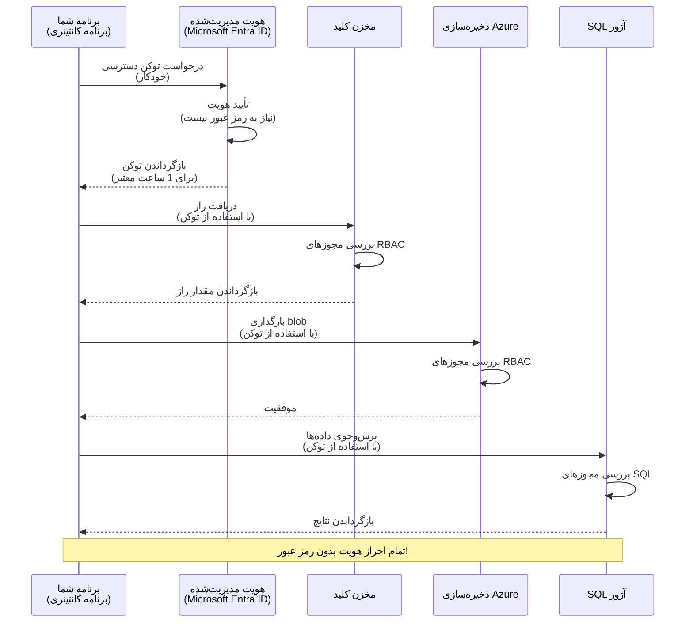
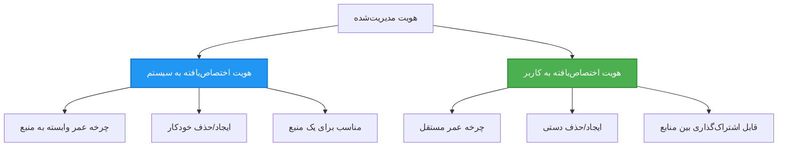

# الگوهای احراز هویت و Managed Identity

⏱️ **زمان تخمینی**: 45-60 دقیقه | 💰 **تأثیر هزینه**: رایگان (بدون هزینهٔ اضافی) | ⭐ **پیچیدگی**: متوسط

**📚 مسیر یادگیری:**
- ← قبلی: [مدیریت پیکربندی](configuration.md) - مدیریت متغیرهای محیطی و اسرار
- 🎯 **شما اینجا هستید**: احراز هویت و امنیت (Managed Identity، Key Vault، الگوهای امن)
- → بعدی: [پروژهٔ اول](first-project.md) - ساخت اولین برنامه AZD شما
- 🏠 [صفحهٔ دوره](../../README.md)

---

## آنچه خواهید آموخت

با اتمام این درس، شما:
- الگوهای احراز هویت در Azure را درک خواهید کرد (کلیدها، connection stringها، Managed Identity)
- پیاده‌سازی **Managed Identity** برای احراز هویت بدون رمز عبور را انجام خواهید داد
- اسرار را با ادغام **Azure Key Vault** ایمن خواهید کرد
- پیکربندی کنترل دسترسی مبتنی بر نقش (RBAC) برای استقرارهای AZD را انجام خواهید داد
- بهترین شیوه‌های امنیتی را در Container Apps و سرویس‌های Azure اعمال خواهید کرد
- از احراز هویت مبتنی بر کلید به احراز هویت مبتنی بر هویت مهاجرت خواهید کرد

## چرا Managed Identity اهمیت دارد

### مسئله: احراز هویت سنتی

**قبل از Managed Identity:**
```javascript
// ❌ خطر امنیتی: اسرار به‌صورت سخت‌کد شده در کد
const connectionString = "Server=mydb.database.windows.net;User=admin;Password=P@ssw0rd123";
const storageKey = "xK7mN9pQ2wR5tY8uI0oP3aS6dF1gH4jK...";
const cosmosKey = "C2x7B9n4M1p8Q5w3E6r0T2y5U8i1O4p7...";
```

**مشکلات:**
- 🔴 **افشای اسرار** در کد، فایل‌های پیکربندی، متغیرهای محیطی
- 🔴 **چرخش اعتبارنامه** نیازمند تغییر کد و استقرار مجدد است
- 🔴 **مشکلات ممیزی** - چه کسی چه چیزی را و چه زمانی دسترسی داشت؟
- 🔴 **پراکنده شدن** - اسرار در سیستم‌های مختلف پخش شده‌اند
- 🔴 **ریسک‌های انطباق** - در آزمون‌های امنیتی شکست می‌خورد

### راه‌حل: Managed Identity

**بعد از Managed Identity:**
```javascript
// ✅ ایمن: هیچ راز یا اطلاعات محرمانه‌ای در کد وجود ندارد
const credential = new DefaultAzureCredential();
const client = new BlobServiceClient(
  "https://mystorageaccount.blob.core.windows.net",
  credential  // آژور به‌طور خودکار احراز هویت را مدیریت می‌کند
);
```

**مزایا:**
- ✅ **هیچ اسراری** در کد یا پیکربندی وجود ندارد
- ✅ **چرخش خودکار** - Azure این کار را مدیریت می‌کند
- ✅ **ردپای کامل ممیزی** در لاگ‌های Microsoft Entra ID
- ✅ **امنیت متمرکز** - مدیریت در Azure Portal
- ✅ **آمادهٔ انطباق** - مطابق با استانداردهای امنیتی است

**تشبیه**: احراز هویت سنتی مثل حمل کردن چندین کلید فیزیکی برای درهای مختلف است. Managed Identity مانند داشتن یک کارت شناسایی است که به‌صورت خودکار بر اساس اینکه شما چه کسی هستید دسترسی می‌دهد—هیچ کلیدی برای گم شدن، کپی یا چرخش وجود ندارد.

---

## نمای کلی معماری

### جریان احراز هویت با Managed Identity


```mermaid
sequenceDiagram
    participant App as برنامه شما<br/>(برنامه کانتینری)
    participant MI as هویت مدیریت‌شده<br/>(Microsoft Entra ID)
    participant KV as مخزن کلید
    participant Storage as ذخیره‌سازی Azure
    participant DB as SQL آژور
    
    App->>MI: درخواست توکن دسترسی<br/>(خودکار)
    MI->>MI: تأیید هویت<br/>(نیاز به رمز عبور نیست)
    MI-->>App: بازگرداندن توکن<br/>(برای 1 ساعت معتبر)
    
    App->>KV: دریافت راز<br/>(با استفاده از توکن)
    KV->>KV: بررسی مجوزهای RBAC
    KV-->>App: بازگرداندن مقدار راز
    
    App->>Storage: بارگذاری blob<br/>(با استفاده از توکن)
    Storage->>Storage: بررسی مجوزهای RBAC
    Storage-->>App: موفقیت
    
    App->>DB: پرس‌وجوی داده‌ها<br/>(با استفاده از توکن)
    DB->>DB: بررسی مجوزهای SQL
    DB-->>App: بازگرداندن نتایج
    
    Note over App,DB: تمام احراز هویت بدون رمز عبور!
```

### انواع Managed Identity


```mermaid
graph TB
    MI[هویت مدیریت‌شده]
    SystemAssigned[هویت اختصاص‌یافته به سیستم]
    UserAssigned[هویت اختصاص‌یافته به کاربر]
    
    MI --> SystemAssigned
    MI --> UserAssigned
    
    SystemAssigned --> SA1[چرخه عمر وابسته به منبع]
    SystemAssigned --> SA2[ایجاد/حذف خودکار]
    SystemAssigned --> SA3[مناسب برای یک منبع]
    
    UserAssigned --> UA1[چرخه عمر مستقل]
    UserAssigned --> UA2[ایجاد/حذف دستی]
    UserAssigned --> UA3[قابل اشتراک‌گذاری بین منابع]
    
    style SystemAssigned fill:#2196F3,stroke:#1976D2,stroke-width:2px,color:#fff
    style UserAssigned fill:#4CAF50,stroke:#388E3C,stroke-width:2px,color:#fff
```

| Feature | System-Assigned | User-Assigned |
|---------|----------------|---------------|
| **Lifecycle** | وابسته به منبع | مستقل |
| **Creation** | خودکار همراه با منبع | ایجاد دستی |
| **Deletion** | با حذف منبع حذف می‌شود | پس از حذف منبع باقی می‌ماند |
| **Sharing** | فقط یک منبع | چندین منبع |
| **Use Case** | سناریوهای ساده | سناریوهای پیچیده چندمنبعی |
| **AZD Default** | ✅ توصیه‌شده | اختیاری |

---

## پیش‌نیازها

### ابزارهای موردنیاز

شما باید قبلاً این موارد را از درس‌های قبلی نصب کرده باشید:

```bash
# تأیید Azure Developer CLI
azd version
# ✅ انتظار می‌رود: azd نسخه 1.0.0 یا بالاتر

# تأیید Azure CLI
az --version
# ✅ انتظار می‌رود: azure-cli نسخه 2.50.0 یا بالاتر
```

### نیازمندی‌های Azure

- اشتراک فعال Azure
- دسترسی‌ها برای:
  - ایجاد Managed Identityها
  - اختصاص نقش‌های RBAC
  - ایجاد منابع Key Vault
  - استقرار Container Apps

### پیش‌نیازهای دانش

شما باید موارد زیر را تکمیل کرده باشید:
- [راهنمای نصب](installation.md) - نصب AZD
- [مبانی AZD](azd-basics.md) - مفاهیم اصلی
- [مدیریت پیکربندی](configuration.md) - متغیرهای محیطی

---

## درس ۱: درک الگوهای احراز هویت

### الگو ۱: Connection Strings (سنتی - اجتناب شود)

**نحوهٔ کار:**
```bash
# رشته اتصال شامل اعتبارنامه‌ها است
STORAGE_CONNECTION_STRING="DefaultEndpointsProtocol=https;AccountName=myaccount;AccountKey=xK7mN9pQ2wR5..."
COSMOS_CONNECTION_STRING="AccountEndpoint=https://myaccount.documents.azure.com:443/;AccountKey=C2x7..."
SQL_CONNECTION_STRING="Server=myserver.database.windows.net;User=admin;Password=P@ssw0rd..."
```

**مشکلات:**
- ❌ اسرار در متغیرهای محیطی قابل مشاهده هستند
- ❌ در سیستم‌های استقرار لاگ می‌شوند
- ❌ چرخش دشوار است
- ❌ هیچ ردپای ممیزی از دسترسی وجود ندارد

**زمان استفاده:** فقط برای توسعهٔ محلی، هرگز در محیط تولید.

---

### الگو ۲: ارجاع به Key Vault (بهتر)

**نحوهٔ کار:**
```bicep
// Store secret in Key Vault
resource keyVault 'Microsoft.KeyVault/vaults@2023-02-01' = {
  name: 'mykv'
  properties: {
    enableRbacAuthorization: true
  }
}

// Reference in Container App
env: [
  {
    name: 'STORAGE_KEY'
    secretRef: 'storage-key'  // References Key Vault
  }
]
```

**مزایا:**
- ✅ اسرار به‌صورت ایمن در Key Vault ذخیره می‌شوند
- ✅ مدیریت متمرکز اسرار
- ✅ چرخش بدون تغییر کد

**محدودیت‌ها:**
- ⚠️ هنوز از کلیدها/پسوردها استفاده می‌کند
- ⚠️ نیاز به مدیریت دسترسی به Key Vault دارد

**زمان استفاده:** گامی انتقالی از connection strings به managed identity.

---

### الگو ۳: Managed Identity (بهترین شیوه)

**نحوهٔ کار:**
```bicep
// Enable managed identity
resource containerApp 'Microsoft.App/containerApps@2023-05-01' = {
  name: 'myapp'
  identity: {
    type: 'SystemAssigned'  // Automatically creates identity
  }
}

// Grant permissions
resource roleAssignment 'Microsoft.Authorization/roleAssignments@2022-04-01' = {
  scope: storageAccount
  properties: {
    roleDefinitionId: storageBlobDataContributorRole
    principalId: containerApp.identity.principalId
  }
}
```

**کد برنامه:**
```javascript
// نیازی به اسرار نیست!
const { DefaultAzureCredential } = require('@azure/identity');
const { BlobServiceClient } = require('@azure/storage-blob');

const credential = new DefaultAzureCredential();
const blobServiceClient = new BlobServiceClient(
  'https://mystorageaccount.blob.core.windows.net',
  credential
);
```

**مزایا:**
- ✅ هیچ اسراری در کد/پیکربندی نیست
- ✅ چرخش خودکار اعتبارنامه
- ✅ ردپای کامل ممیزی
- ✅ مجوزهای مبتنی بر RBAC
- ✅ آمادهٔ انطباق

**زمان استفاده:** همیشه، برای برنامه‌های تولیدی.

---

### الگو ۴: Service Principals (CI/CD و اتوماسیون)

Managed identity استاندارد طلا است برای منابعی که داخل Azure اجرا می‌شوند. اما در مورد چیزهایی که خارج از Azure اجرا می‌شوند—مثل یک خط لوله CI/CD روی یک عامل بیلد، یا یک اسکریپت روی لپ‌تاپ شما که نمی‌تواند از ورود تعاملی استفاده کند—چه؟ در این موارد یک **service principal** به کار می‌آید: یک هویت غیرانسانی با اعتبارنامهٔ مخصوص به خود که یک فرآیند خودکار می‌تواند با آن وارد شود.

**نحوهٔ کار:**

یک service principal ایجاد کنید که در محدودهٔ یک resource group باشد (کمترین سطح دسترسی):

```bash
az ad sp create-for-rbac \
  --name "myapp-cicd" \
  --role contributor \
  --scopes /subscriptions/<sub-id>/resourceGroups/<rg-name>
```

این دستور یک client ID، client secret و tenant ID چاپ می‌کند. azd می‌تواند با آن‌ها به‌صورت غیرتعاملی وارد شود:

```bash
azd auth login \
  --client-id "<appId>" \
  --client-secret "<password>" \
  --tenant-id "<tenant>"
```

**به‌جای استفاده از اسرار طولانی‌مدت، ترجیحاً از اعتبارنامه‌های فدرِیت‌شده (OIDC) استفاده کنید.** به‌جای یک client secret با طول عمر زیاد، یک اعتبارنامهٔ فدرِیت‌شده پیکربندی کنید تا خط لوله توکن کوتاه‌مدتی را مبادله کند—بدون هیچ راز قابل نشت یا چرخش:

```bash
azd auth login \
  --client-id "<appId>" \
  --federated-credential-provider "github" \
  --tenant-id "<tenant>"
```

> `azd pipeline config` این کار را به‌صورت خودکار برای شما تنظیم می‌کند. راهنمای گام‌به‌گام CI/CD را در [فصل ۸](../chapter-08-production/production-ai-practices.md) ببینید.

**مزایا:**
- ✅ خارج از Azure کار می‌کند (عامل‌های بیلد، on-prem، دیگر ابرها)
- ✅ می‌تواند محدود به یک resource group با یک نقش شود
- ✅ نسخهٔ فدرِیت‌شده (OIDC) از هیچ راز ذخیره‌شده‌ای استفاده نمی‌کند

**ملاحظات:**
- ⚠️ نسخهٔ مبتنی بر راز نیازمند ذخیره و چرخش دقیق است
- ⚠️ اگر راز لو برود، هر آنچه SP توانایی انجامش را دارد ممکن می‌شود—دامنه‌ها را محدود نگه دارید

**زمان استفاده:** خط لوله‌های CI/CD و اتوماسیونی که نمی‌توانند از managed identity استفاده کنند. همیشه نسخهٔ **فدرِیت/ OIDC** را به جای client secret انتخاب کنید، و هرگاه بار کاری داخل Azure اجرا می‌شود Managed Identity را ترجیح دهید.

**ذخیرهٔ امن اعتبارنامه‌ها:**
- هرگز اسرار را در مخزن کد commit نکنید—از مخزن اسرار خط لوله خود استفاده کنید (GitHub Actions secrets، Azure DevOps variable groups / Key Vault).
- SP را محدود به کوچک‌ترین نقش و resource group مورد نیاز کنید.
- انقضا تعیین کنید و چرخش انجام دهید، یا با OIDC راز را کاملاً حذف کنید.

---

## درس ۲: پیاده‌سازی Managed Identity با AZD

### پیاده‌سازی گام‌به‌گام

بیایید یک Container App امن ایجاد کنیم که از Managed Identity برای دسترسی به Azure Storage و Key Vault استفاده کند.

### ساختار پروژه

```
secure-app/
├── azure.yaml                 # AZD configuration
├── infra/
│   ├── main.bicep            # Main infrastructure
│   ├── core/
│   │   ├── identity.bicep    # Managed identity setup
│   │   ├── keyvault.bicep    # Key Vault configuration
│   │   └── storage.bicep     # Storage with RBAC
│   └── app/
│       └── container-app.bicep
└── src/
    ├── app.js                # Application code
    ├── package.json
    └── Dockerfile
```

### 1. پیکربندی AZD (azure.yaml)

```yaml
name: secure-app
metadata:
  template: secure-app@1.0.0

services:
  api:
    project: ./src
    language: js
    host: containerapp

# Enable managed identity (AZD handles this automatically)
```

### 2. زیرساخت: فعال کردن Managed Identity

**File: `infra/main.bicep`**

```bicep
targetScope = 'subscription'

param environmentName string
param location string = 'eastus'

var tags = { 'azd-env-name': environmentName }

// Resource group
resource rg 'Microsoft.Resources/resourceGroups@2021-04-01' = {
  name: 'rg-${environmentName}'
  location: location
  tags: tags
}

// Storage Account
module storage './core/storage.bicep' = {
  name: 'storage'
  scope: rg
  params: {
    name: 'st${uniqueString(rg.id)}'
    location: location
    tags: tags
  }
}

// Key Vault
module keyVault './core/keyvault.bicep' = {
  name: 'keyvault'
  scope: rg
  params: {
    name: 'kv-${uniqueString(rg.id)}'
    location: location
    tags: tags
  }
}

// Container App with Managed Identity
module containerApp './app/container-app.bicep' = {
  name: 'container-app'
  scope: rg
  params: {
    name: 'ca-${environmentName}'
    location: location
    tags: tags
    storageAccountName: storage.outputs.name
    keyVaultName: keyVault.outputs.name
  }
}

// Grant Container App access to Storage
module storageRoleAssignment './core/role-assignment.bicep' = {
  name: 'storage-role'
  scope: rg
  params: {
    principalId: containerApp.outputs.identityPrincipalId
    roleDefinitionId: 'ba92f5b4-2d11-453d-a403-e96b0029c9fe'  // Storage Blob Data Contributor
    targetResourceId: storage.outputs.id
  }
}

// Grant Container App access to Key Vault
module kvRoleAssignment './core/role-assignment.bicep' = {
  name: 'kv-role'
  scope: rg
  params: {
    principalId: containerApp.outputs.identityPrincipalId
    roleDefinitionId: '4633458b-17de-408a-b874-0445c86b69e6'  // Key Vault Secrets User
    targetResourceId: keyVault.outputs.id
  }
}

// Outputs
output AZURE_STORAGE_ACCOUNT_NAME string = storage.outputs.name
output AZURE_KEY_VAULT_NAME string = keyVault.outputs.name
output APP_URL string = containerApp.outputs.url
```

### 3. Container App با Identity تخصیص‌شده به سیستم

**File: `infra/app/container-app.bicep`**

```bicep
param name string
param location string
param tags object = {}
param storageAccountName string
param keyVaultName string

resource containerApp 'Microsoft.App/containerApps@2023-05-01' = {
  name: name
  location: location
  tags: tags
  identity: {
    type: 'SystemAssigned'  // 🔑 Enable managed identity
  }
  properties: {
    configuration: {
      ingress: {
        external: true
        targetPort: 3000
      }
    }
    template: {
      containers: [
        {
          name: 'api'
          image: 'myregistry.azurecr.io/api:latest'
          resources: {
            cpu: json('0.5')
            memory: '1Gi'
          }
          env: [
            {
              name: 'AZURE_STORAGE_ACCOUNT_NAME'
              value: storageAccountName
            }
            {
              name: 'AZURE_KEY_VAULT_NAME'
              value: keyVaultName
            }
            // 🔑 No secrets - managed identity handles authentication!
          ]
        }
      ]
    }
  }
}

// Output the identity for RBAC assignments
output identityPrincipalId string = containerApp.identity.principalId
output id string = containerApp.id
output url string = 'https://${containerApp.properties.configuration.ingress.fqdn}'
```

### 4. ماژول اختصاص نقش RBAC

**File: `infra/core/role-assignment.bicep`**

```bicep
param principalId string
param roleDefinitionId string  // Azure built-in role ID
param targetResourceId string

resource roleAssignment 'Microsoft.Authorization/roleAssignments@2022-04-01' = {
  name: guid(principalId, roleDefinitionId, targetResourceId)
  scope: resourceId('Microsoft.Resources/resourceGroups', resourceGroup().name)
  properties: {
    roleDefinitionId: subscriptionResourceId('Microsoft.Authorization/roleDefinitions', roleDefinitionId)
    principalId: principalId
    principalType: 'ServicePrincipal'
  }
}

output id string = roleAssignment.id
```

### 5. کد برنامه با Managed Identity

**File: `src/app.js`**

```javascript
const express = require('express');
const { DefaultAzureCredential } = require('@azure/identity');
const { BlobServiceClient } = require('@azure/storage-blob');
const { SecretClient } = require('@azure/keyvault-secrets');

const app = express();
const PORT = process.env.PORT || 3000;

// 🔑 مقداردهی اولیه اعتبارنامه (به‌صورت خودکار با هویت مدیریت‌شده کار می‌کند)
const credential = new DefaultAzureCredential();

// پیکربندی ذخیره‌سازی Azure
const storageAccountName = process.env.AZURE_STORAGE_ACCOUNT_NAME;
const blobServiceClient = new BlobServiceClient(
  `https://${storageAccountName}.blob.core.windows.net`,
  credential  // نیازی به کلیدها نیست!
);

// پیکربندی Key Vault
const keyVaultName = process.env.AZURE_KEY_VAULT_NAME;
const secretClient = new SecretClient(
  `https://${keyVaultName}.vault.azure.net`,
  credential  // نیازی به کلیدها نیست!
);

// بررسی سلامت
app.get('/health', (req, res) => {
  res.json({ status: 'healthy', authentication: 'managed-identity' });
});

// بارگذاری فایل در Blob Storage
app.post('/upload', async (req, res) => {
  try {
    const containerClient = blobServiceClient.getContainerClient('uploads');
    await containerClient.createIfNotExists();
    
    const blobName = `file-${Date.now()}.txt`;
    const blockBlobClient = containerClient.getBlockBlobClient(blobName);
    
    await blockBlobClient.upload('Hello from managed identity!', 30);
    
    res.json({
      success: true,
      blobName: blobName,
      message: 'File uploaded using managed identity!'
    });
  } catch (error) {
    console.error('Upload error:', error);
    res.status(500).json({ error: error.message });
  }
});

// دریافت راز از Key Vault
app.get('/secret/:name', async (req, res) => {
  try {
    const secretName = req.params.name;
    const secret = await secretClient.getSecret(secretName);
    
    res.json({
      name: secretName,
      value: secret.value,
      message: 'Secret retrieved using managed identity!'
    });
  } catch (error) {
    console.error('Secret error:', error);
    res.status(500).json({ error: error.message });
  }
});

// فهرست کانتینرهای Blob (نشان‌دهندهٔ دسترسی خواندن)
app.get('/containers', async (req, res) => {
  try {
    const containers = [];
    for await (const container of blobServiceClient.listContainers()) {
      containers.push(container.name);
    }
    
    res.json({
      containers: containers,
      count: containers.length,
      message: 'Containers listed using managed identity!'
    });
  } catch (error) {
    console.error('List error:', error);
    res.status(500).json({ error: error.message });
  }
});

app.listen(PORT, () => {
  console.log(`Secure API listening on port ${PORT}`);
  console.log('Authentication: Managed Identity (passwordless)');
});
```

**File: `src/package.json`**

```json
{
  "name": "secure-app",
  "version": "1.0.0",
  "dependencies": {
    "express": "^4.18.2",
    "@azure/identity": "^4.0.0",
    "@azure/storage-blob": "^12.17.0",
    "@azure/keyvault-secrets": "^4.7.0"
  },
  "scripts": {
    "start": "node app.js"
  }
}
```

### 6. استقرار و تست

```bash
# محیط AZD را مقداردهی اولیه کنید
azd init

# زیرساخت و برنامه را مستقر کنید
azd up

# آدرس برنامه را دریافت کنید
APP_URL=$(azd env get-values | grep APP_URL | cut -d '=' -f2 | tr -d '"')

# تست بررسی سلامت را اجرا کنید
curl $APP_URL/health
```

**✅ خروجی مورد انتظار:**
```json
{
  "status": "healthy",
  "authentication": "managed-identity"
}
```

**تست آپلود blob:**
```bash
curl -X POST $APP_URL/upload
```

**✅ خروجی مورد انتظار:**
```json
{
  "success": true,
  "blobName": "file-1700404800000.txt",
  "message": "File uploaded using managed identity!"
}
```

**تست لیست‌کردن container:**
```bash
curl $APP_URL/containers
```

**✅ خروجی مورد انتظار:**
```json
{
  "containers": ["uploads"],
  "count": 1,
  "message": "Containers listed using managed identity!"
}
```

---

## نقش‌های رایج RBAC در Azure

### شناسه‌های نقش پیش‌فرض برای Managed Identity

| Service | Role Name | Role ID | Permissions |
|---------|-----------|---------|-------------|
| **Storage** | Storage Blob Data Reader | `2a2b9908-6b94-4a3d-8e5a-a7d8f8cc8a12` | خواندن blobها و containerها |
| **Storage** | Storage Blob Data Contributor | `ba92f5b4-2d11-453d-a403-e96b0029c9fe` | خواندن، نوشتن، حذف blobها |
| **Storage** | Storage Queue Data Contributor | `974c5e8b-45b9-4653-ba55-5f855dd0fb88` | خواندن، نوشتن، حذف پیام‌های صف |
| **Key Vault** | Key Vault Secrets User | `4633458b-17de-408a-b874-0445c86b69e6` | خواندن اسرار |
| **Key Vault** | Key Vault Secrets Officer | `b86a8fe4-44ce-4948-aee5-eccb2c155cd7` | خواندن، نوشتن، حذف اسرار |
| **Cosmos DB** | Cosmos DB Built-in Data Reader | `00000000-0000-0000-0000-000000000001` | خواندن داده‌های Cosmos DB |
| **Cosmos DB** | Cosmos DB Built-in Data Contributor | `00000000-0000-0000-0000-000000000002` | خواندن و نوشتن داده‌های Cosmos DB |
| **SQL Database** | SQL DB Contributor | `9b7fa17d-e63e-47b0-bb0a-15c516ac86ec` | مدیریت پایگاه‌های دادهٔ SQL |
| **Service Bus** | Azure Service Bus Data Owner | `090c5cfd-751d-490a-894a-3ce6f1109419` | ارسال، دریافت و مدیریت پیام‌ها |

### نحوهٔ یافتن شناسه‌های نقش

```bash
# فهرست تمام نقش‌های داخلی
az role definition list --query "[].{Name:roleName, ID:name}" --output table

# جستجو برای نقش خاص
az role definition list --query "[?contains(roleName, 'Storage Blob')].{Name:roleName, ID:name}" --output table

# دریافت جزئیات نقش
az role definition list --name "Storage Blob Data Contributor"
```

---

## تمرین‌های عملی

### تمرین ۱: فعال‌سازی Managed Identity برای اپ موجود ⭐⭐ (متوسط)

**هدف**: افزودن Managed Identity به استقرار موجود یک Container App

**سناریو**: شما یک Container App دارید که از connection stringها استفاده می‌کند. آن را به Managed Identity تبدیل کنید.

**نقطهٔ آغاز**: Container App با این پیکربندی:

```bicep
// ❌ Current: Using connection string
env: [
  {
    name: 'STORAGE_CONNECTION_STRING'
    secretRef: 'storage-connection'
  }
]
```

**مراحل**:

1. **فعال‌سازی Managed Identity در Bicep:**

```bicep
resource containerApp 'Microsoft.App/containerApps@2023-05-01' = {
  name: 'myapp'
  identity: {
    type: 'SystemAssigned'  // Add this
  }
  // ... rest of configuration
}
```

2. **دادن دسترسی Storage:**

```bicep
// Get storage account reference
resource storageAccount 'Microsoft.Storage/storageAccounts@2023-01-01' existing = {
  name: storageAccountName
}

// Assign role
resource roleAssignment 'Microsoft.Authorization/roleAssignments@2022-04-01' = {
  name: guid(containerApp.id, 'ba92f5b4-2d11-453d-a403-e96b0029c9fe', storageAccount.id)
  scope: storageAccount
  properties: {
    roleDefinitionId: subscriptionResourceId('Microsoft.Authorization/roleDefinitions', 'ba92f5b4-2d11-453d-a403-e96b0029c9fe')
    principalId: containerApp.identity.principalId
    principalType: 'ServicePrincipal'
  }
}
```

3. **به‌روزرسانی کد برنامه:**

**قبل (connection string):**
```javascript
const { BlobServiceClient } = require('@azure/storage-blob');

const blobServiceClient = BlobServiceClient.fromConnectionString(
  process.env.STORAGE_CONNECTION_STRING
);
```

**بعد (managed identity):**
```javascript
const { DefaultAzureCredential } = require('@azure/identity');
const { BlobServiceClient } = require('@azure/storage-blob');

const credential = new DefaultAzureCredential();
const blobServiceClient = new BlobServiceClient(
  `https://${process.env.STORAGE_ACCOUNT_NAME}.blob.core.windows.net`,
  credential
);
```

4. **به‌روزرسانی متغیرهای محیطی:**

```bicep
env: [
  {
    name: 'STORAGE_ACCOUNT_NAME'
    value: storageAccountName  // Just the name, no secrets!
  }
  // Remove STORAGE_CONNECTION_STRING
]
```

5. **استقرار و تست:**

```bash
# استقرار مجدد
azd up

# تست کنید که هنوز کار می‌کند
curl https://myapp.azurecontainerapps.io/upload
```

**✅ معیارهای موفقیت:**
- ✅ برنامه بدون خطا استقرار می‌یابد
- ✅ عملیات Storage کار می‌کنند (آپلود، لیست، دانلود)
- ✅ هیچ connection string در متغیرهای محیطی وجود ندارد
- ✅ هویت در Azure Portal در زیر برگهٔ "Identity" قابل مشاهده است

**تأیید:**

```bash
# بررسی فعال بودن هویت مدیریت‌شده
az containerapp show \
  --name myapp \
  --resource-group rg-myapp \
  --query "identity.type"
# ✅ مورد انتظار: "SystemAssigned"

# بررسی انتساب نقش
az role assignment list \
  --assignee $(az containerapp show --name myapp --resource-group rg-myapp --query "identity.principalId" -o tsv) \
  --scope /subscriptions/{sub-id}/resourceGroups/rg-myapp/providers/Microsoft.Storage/storageAccounts/mystorageaccount
# ✅ مورد انتظار: نمایش نقش "Storage Blob Data Contributor"
```

**زمان**: 20-30 دقیقه

---

### تمرین ۲: دسترسی چندسرویسی با User-Assigned Identity ⭐⭐⭐ (پیشرفته)

**هدف**: ایجاد یک User-Assigned Identity که بین چند Container App به‌اشتراک گذاشته شود

**سناریو**: شما 3 میکروسرویس دارید که همه به یک حساب Storage و Key Vault نیاز دارند.

**مراحل**:

1. **ایجاد user-assigned identity:**

**File: `infra/core/identity.bicep`**

```bicep
param name string
param location string
param tags object = {}

resource userAssignedIdentity 'Microsoft.ManagedIdentity/userAssignedIdentities@2023-01-31' = {
  name: name
  location: location
  tags: tags
}

output id string = userAssignedIdentity.id
output principalId string = userAssignedIdentity.properties.principalId
output clientId string = userAssignedIdentity.properties.clientId
```

2. **اختصاص نقش‌ها به user-assigned identity:**

```bicep
// In main.bicep
module userIdentity './core/identity.bicep' = {
  name: 'user-identity'
  scope: rg
  params: {
    name: 'id-${environmentName}'
    location: location
    tags: tags
  }
}

// Grant Storage access
resource storageRoleAssignment 'Microsoft.Authorization/roleAssignments@2022-04-01' = {
  name: guid(userIdentity.outputs.principalId, 'storage-contributor')
  scope: storageAccount
  properties: {
    roleDefinitionId: subscriptionResourceId('Microsoft.Authorization/roleDefinitions', 'ba92f5b4-2d11-453d-a403-e96b0029c9fe')
    principalId: userIdentity.outputs.principalId
    principalType: 'ServicePrincipal'
  }
}

// Grant Key Vault access
resource kvRoleAssignment 'Microsoft.Authorization/roleAssignments@2022-04-01' = {
  name: guid(userIdentity.outputs.principalId, 'kv-secrets-user')
  scope: keyVault
  properties: {
    roleDefinitionId: subscriptionResourceId('Microsoft.Authorization/roleDefinitions', '4633458b-17de-408a-b874-0445c86b69e6')
    principalId: userIdentity.outputs.principalId
    principalType: 'ServicePrincipal'
  }
}
```

3. **اختصاص هویت به چند Container App:**

```bicep
resource apiGateway 'Microsoft.App/containerApps@2023-05-01' = {
  name: 'api-gateway'
  identity: {
    type: 'UserAssigned'
    userAssignedIdentities: {
      '${userIdentity.outputs.id}': {}
    }
  }
  // ... rest of config
}

resource productService 'Microsoft.App/containerApps@2023-05-01' = {
  name: 'product-service'
  identity: {
    type: 'UserAssigned'
    userAssignedIdentities: {
      '${userIdentity.outputs.id}': {}
    }
  }
  // ... rest of config
}

resource orderService 'Microsoft.App/containerApps@2023-05-01' = {
  name: 'order-service'
  identity: {
    type: 'UserAssigned'
    userAssignedIdentities: {
      '${userIdentity.outputs.id}': {}
    }
  }
  // ... rest of config
}
```

4. **کد برنامه (تمام سرویس‌ها از همان الگو استفاده می‌کنند):**

```javascript
const { DefaultAzureCredential, ManagedIdentityCredential } = require('@azure/identity');

// برای هویت تخصیص‌یافته به کاربر، شناسهٔ کلاینت را مشخص کنید
const credential = new ManagedIdentityCredential(
  process.env.AZURE_CLIENT_ID  // شناسهٔ کلاینت هویت تخصیص‌یافته به کاربر
);

// یا از DefaultAzureCredential استفاده کنید (به‌صورت خودکار تشخیص می‌دهد)
const credential = new DefaultAzureCredential();

const blobServiceClient = new BlobServiceClient(
  `https://${process.env.STORAGE_ACCOUNT_NAME}.blob.core.windows.net`,
  credential
);
```

5. **استقرار و تأیید:**

```bash
azd up

# تست کنید که همه سرویس‌ها بتوانند به ذخیره‌سازی دسترسی پیدا کنند
curl https://api-gateway.azurecontainerapps.io/upload
curl https://product-service.azurecontainerapps.io/upload
curl https://order-service.azurecontainerapps.io/upload
```

**✅ معیارهای موفقیت:**
- ✅ یک هویت بین 3 سرویس به‌اشتراک گذاشته شده است
- ✅ همه سرویس‌ها می‌توانند به Storage و Key Vault دسترسی داشته باشند
- ✅ هویت در صورت حذف یکی از سرویس‌ها باقی می‌ماند
- ✅ مدیریت مجوز متمرکز

**مزایای User-Assigned Identity:**
- یک هویت برای مدیریت
- مجوزهای یکسان بین سرویس‌ها
- باقی ماندن پس از حذف سرویس
- مناسب‌تر برای معماری‌های پیچیده

**زمان**: 30-40 دقیقه

---

### تمرین ۳: پیاده‌سازی چرخش اسرار Key Vault ⭐⭐⭐ (پیشرفته)

**هدف**: ذخیرهٔ کلیدهای API شخص ثالث در Key Vault و دسترسی به آن‌ها با استفاده از Managed Identity

**سناریو**: برنامهٔ شما نیاز دارد به یک API خارجی (OpenAI, Stripe, SendGrid) که به کلیدهای API نیاز دارد فراخوانی شود.

**مراحل**:

1. **ایجاد Key Vault با RBAC:**

**File: `infra/core/keyvault.bicep`**

```bicep
param name string
param location string
param tags object = {}

resource keyVault 'Microsoft.KeyVault/vaults@2023-02-01' = {
  name: name
  location: location
  tags: tags
  properties: {
    enableRbacAuthorization: true  // Use RBAC instead of access policies
    sku: {
      family: 'A'
      name: 'standard'
    }
    tenantId: subscription().tenantId
    enableSoftDelete: true
    softDeleteRetentionInDays: 90
  }
}

// Allow Container App to read secrets
output id string = keyVault.id
output name string = keyVault.name
output uri string = keyVault.properties.vaultUri
```

2. **ذخیرهٔ اسرار در Key Vault:**

```bash
# نام Key Vault را دریافت کنید
KV_NAME=$(azd env get-values | grep AZURE_KEY_VAULT_NAME | cut -d '=' -f2 | tr -d '"')

# ذخیره کلیدهای API شخص ثالث
az keyvault secret set \
  --vault-name $KV_NAME \
  --name "OpenAI-ApiKey" \
  --value "sk-proj-xxxxxxxxxxxxx"

az keyvault secret set \
  --vault-name $KV_NAME \
  --name "Stripe-ApiKey" \
  --value "sk_live_xxxxxxxxxxxxx"

az keyvault secret set \
  --vault-name $KV_NAME \
  --name "SendGrid-ApiKey" \
  --value "SG.xxxxxxxxxxxxx"
```

3. **کد برنامه برای واکشی اسرار:**

**File: `src/config.js`**

```javascript
const { DefaultAzureCredential } = require('@azure/identity');
const { SecretClient } = require('@azure/keyvault-secrets');

class Config {
  constructor() {
    this.credential = new DefaultAzureCredential();
    this.secretClient = new SecretClient(
      `https://${process.env.AZURE_KEY_VAULT_NAME}.vault.azure.net`,
      this.credential
    );
    this.cache = {};
  }

  async getSecret(secretName) {
    // ابتدا کش را بررسی کنید
    if (this.cache[secretName]) {
      return this.cache[secretName];
    }

    try {
      const secret = await this.secretClient.getSecret(secretName);
      this.cache[secretName] = secret.value;
      console.log(`✅ Retrieved secret: ${secretName}`);
      return secret.value;
    } catch (error) {
      console.error(`❌ Failed to get secret ${secretName}:`, error.message);
      throw error;
    }
  }

  async getOpenAIKey() {
    return this.getSecret('OpenAI-ApiKey');
  }

  async getStripeKey() {
    return this.getSecret('Stripe-ApiKey');
  }

  async getSendGridKey() {
    return this.getSecret('SendGrid-ApiKey');
  }
}

module.exports = new Config();
```

4. **استفاده از اسرار در برنامه:**

**File: `src/app.js`**

```javascript
const express = require('express');
const config = require('./config');
const { OpenAI } = require('openai');

const app = express();

// OpenAI را با کلیدی از Key Vault مقداردهی اولیه کنید
let openaiClient;

async function initializeServices() {
  const openaiKey = await config.getOpenAIKey();
  openaiClient = new OpenAI({ apiKey: openaiKey });
  console.log('✅ Services initialized with secrets from Key Vault');
}

// در هنگام راه‌اندازی فراخوانی شود
initializeServices().catch(console.error);

app.post('/chat', async (req, res) => {
  try {
    const completion = await openaiClient.chat.completions.create({
      model: 'gpt-4.1',
      messages: [{ role: 'user', content: 'Hello!' }]
    });
    
    res.json({
      response: completion.choices[0].message.content,
      authentication: 'Key from Key Vault via Managed Identity'
    });
  } catch (error) {
    res.status(500).json({ error: error.message });
  }
});

app.listen(3000, () => {
  console.log('Secure API with Key Vault integration running');
});
```

5. **استقرار و تست:**

```bash
azd up

# تست اینکه کلیدهای API کار می‌کنند
curl -X POST https://myapp.azurecontainerapps.io/chat \
  -H "Content-Type: application/json" \
  -d '{"message":"Hello AI"}'
```

**✅ معیارهای موفقیت:**
- ✅ در کد یا متغیرهای محیطی کلید API وجود نداشته باشد
- ✅ برنامه کلیدها را از Key Vault بازیابی می‌کند
- ✅ APIهای شخص ثالث به‌درستی کار می‌کنند
- ✅ امکان چرخش کلیدها بدون تغییر کد وجود دارد

**چرخش یک secret:**

```bash
# به‌روزرسانی راز در خزانه کلید
az keyvault secret set \
  --vault-name $KV_NAME \
  --name "OpenAI-ApiKey" \
  --value "sk-proj-NEW_KEY_HERE"

# برنامه را مجدداً راه‌اندازی کنید تا کلید جدید بارگذاری شود
az containerapp revision restart \
  --name myapp \
  --resource-group rg-myapp
```

**زمان**: 25-35 دقیقه

---

## نقطه بررسی دانش

### 1. الگوهای احراز هویت ✓

دانش خود را بسنجید:

- [ ] **Q1**: سه الگوی اصلی احراز هویت چه هستند؟ 
  - **A**: connection strings (قدیمی)، Key Vault references (در حال گذار)، Managed Identity (بهترین)

- [ ] **Q2**: چرا managed identity بهتر از connection strings است؟
  - **A**: بدون اسرار در کد، چرخش خودکار، سابقه کامل حسابرسی، مجوزهای RBAC

- [ ] **Q3**: چه زمانی باید از user-assigned identity به‌جای system-assigned استفاده کنید؟
  - **A**: وقتی نیاز به اشتراک‌گذاری هویت بین چندین منبع دارید یا چرخه عمر هویت مستقل از چرخه عمر منبع است

**تأیید عملی:**
```bash
# بررسی کنید برنامه شما از چه نوع هویتی استفاده می‌کند
az containerapp show \
  --name myapp \
  --resource-group rg-myapp \
  --query "identity.type"

# تمام تخصیص‌های نقش برای هویت را فهرست کنید
az role assignment list \
  --assignee $(az containerapp show --name myapp --resource-group rg-myapp --query "identity.principalId" -o tsv)
```

---

### 2. RBAC و مجوزها ✓

دانش خود را بسنجید:

- [ ] **Q1**: شناسه نقش (role ID) برای "Storage Blob Data Contributor" چیست؟
  - **A**: `ba92f5b4-2d11-453d-a403-e96b0029c9fe`

- [ ] **Q2**: نقش "Key Vault Secrets User" چه مجوزهایی فراهم می‌کند؟
  - **A**: دسترسی فقط‌خواندنی به secrets (قادر به ایجاد، به‌روزرسانی یا حذف نیست)

- [ ] **Q3**: چگونه به یک Container App دسترسی به Azure SQL اعطا می‌کنید؟
  - **A**: اختصاص نقش "SQL DB Contributor" یا پیکربندی Microsoft Entra ID authentication برای SQL

**تأیید عملی:**
```bash
# نقش مشخص را پیدا کنید
az role definition list --name "Storage Blob Data Contributor"

# بررسی کنید چه نقش‌هایی به هویت شما اختصاص داده شده‌اند
PRINCIPAL_ID=$(az containerapp show --name myapp --resource-group rg-myapp --query "identity.principalId" -o tsv)
az role assignment list --assignee $PRINCIPAL_ID --output table
```

---

### 3. یکپارچه‌سازی Key Vault ✓

دانش خود را بسنجید:

- [ ] **Q1**: چگونه RBAC را برای Key Vault به‌جای access policies فعال می‌کنید؟
  - **A**: تنظیم `enableRbacAuthorization: true` در Bicep

- [ ] **Q2**: کدام کتابخانه Azure SDK احراز هویت managed identity را مدیریت می‌کند؟
  - **A**: `@azure/identity` با کلاس `DefaultAzureCredential`

- [ ] **Q3**: رازهای Key Vault چقدر در کش باقی می‌مانند؟
  - **A**: وابسته به برنامه؛ استراتژی کش خود را پیاده‌سازی کنید

**تأیید عملی:**
```bash
# دسترسی به Key Vault را آزمایش کنید
az keyvault secret show \
  --vault-name $KV_NAME \
  --name "OpenAI-ApiKey" \
  --query "value"

# بررسی کنید که RBAC فعال است
az keyvault show \
  --name $KV_NAME \
  --query "properties.enableRbacAuthorization"
# ✅ انتظار: درست
```

---

## بهترین شیوه‌های امنیتی

### ✅ انجام دهید:

1. **همیشه در محیط تولید از managed identity استفاده کنید**
   ```bicep
   identity: {
     type: 'SystemAssigned'
   }
   ```

2. **استفاده از نقش‌های RBAC با کمترین امتیاز لازم**
   - وقتی ممکن است از نقش "Reader" استفاده کنید
   - از نقش‌های "Owner" یا "Contributor" مگر در صورت ضرورت اجتناب کنید

3. **کلیدهای شخص ثالث را در Key Vault ذخیره کنید**
   ```javascript
   const apiKey = await secretClient.getSecret('ThirdPartyApiKey');
   ```

4. **فعال‌سازی لاگ‌های حسابرسی**
   ```bicep
   diagnosticSettings: {
     logs: [{ category: 'AuditEvent', enabled: true }]
   }
   ```

5. **برای dev/staging/prod از هویت‌های جداگانه استفاده کنید**
   ```bash
   azd env new dev
   azd env new staging
   azd env new prod
   ```

6. **رازها را به‌صورت منظم بچرخانید**
   - تعیین تاریخ انقضا برای secrets در Key Vault
   - خودکارسازی چرخش با Azure Functions

### ❌ انجام ندهید:

1. **هرگز secrets را در کد هاردکد نکنید**
   ```javascript
   // بد ❌
   const apiKey = "sk-proj-xxxxxxxxxxxxx";
   ```

2. **در محیط تولید از connection strings استفاده نکنید**
   ```javascript
   // ❌ بد
   BlobServiceClient.fromConnectionString(process.env.STORAGE_CONNECTION_STRING)
   ```

3. **مجوزهای افراطی اعطا نکنید**
   ```bicep
   // ❌ BAD - too much access
   roleDefinitionId: 'Owner'
   
   // ✅ GOOD - least privilege
   roleDefinitionId: 'Storage Blob Data Reader'
   ```

4. **رازها را لاگ نکنید**
   ```javascript
   // ❌ بد
   console.log('API Key:', apiKey);
   
   // ✅ خوب
   console.log('API Key retrieved successfully');
   ```

5. **هویت‌های تولید را بین محیط‌ها به‌اشتراک نگذارید**
   ```bicep
   // ❌ BAD - same identity for dev and prod
   // ✅ GOOD - separate identities per environment
   ```

---

## راهنمای عیب‌یابی

### مشکل: هنگام دسترسی به Azure Storage خطای "Unauthorized"

**نشانه‌ها:**
```
Error: Unauthorized (403)
AuthorizationPermissionMismatch: This request is not authorized to perform this operation
```

**تشخیص:**

```bash
# بررسی کنید که هویت مدیریت‌شده فعال است
az containerapp show \
  --name myapp \
  --resource-group rg-myapp \
  --query "identity.type"
# ✅ انتظار می‌رود: "SystemAssigned" یا "UserAssigned"

# بررسی انتساب نقش‌ها
PRINCIPAL_ID=$(az containerapp show --name myapp --resource-group rg-myapp --query "identity.principalId" -o tsv)
az role assignment list --assignee $PRINCIPAL_ID

# انتظار می‌رود: باید "Storage Blob Data Contributor" یا نقش مشابه را ببینید
```

**راه‌حل‌ها:**

1. **اعطای نقش RBAC صحیح:**
```bash
STORAGE_ID=$(az storage account show --name mystorageaccount --resource-group rg-myapp --query "id" -o tsv)
az role assignment create \
  --assignee $PRINCIPAL_ID \
  --role "Storage Blob Data Contributor" \
  --scope $STORAGE_ID
```

2. **صبر برای انتشار (می‌تواند 5-10 دقیقه طول بکشد):**
```bash
# وضعیت تخصیص نقش را بررسی کنید
az role assignment list --assignee $PRINCIPAL_ID --scope $STORAGE_ID
```

3. **بررسی اینکه کد برنامه از credential صحیح استفاده می‌کند:**
```javascript
// اطمینان حاصل کنید که از DefaultAzureCredential استفاده می‌کنید
const credential = new DefaultAzureCredential();
```

---

### مشکل: دسترسی به Key Vault رد شده است

**نشانه‌ها:**
```
Error: Forbidden (403)
The user, group or application does not have secrets get permission
```

**تشخیص:**

```bash
# بررسی اینکه کنترل دسترسی مبتنی بر نقش (RBAC) برای مخزن کلید فعال است
az keyvault show \
  --name $KV_NAME \
  --query "properties.enableRbacAuthorization"
# ✅ مورد انتظار: true

# بررسی تخصیص نقش‌ها
az role assignment list \
  --assignee $PRINCIPAL_ID \
  --scope /subscriptions/{sub-id}/resourceGroups/rg-myapp/providers/Microsoft.KeyVault/vaults/$KV_NAME
```

**راه‌حل‌ها:**

1. **فعال‌سازی RBAC روی Key Vault:**
```bash
az keyvault update \
  --name $KV_NAME \
  --enable-rbac-authorization true
```

2. **اعطای نقش Key Vault Secrets User:**
```bash
KV_ID=$(az keyvault show --name $KV_NAME --query "id" -o tsv)
az role assignment create \
  --assignee $PRINCIPAL_ID \
  --role "Key Vault Secrets User" \
  --scope $KV_ID
```

---

### مشکل: DefaultAzureCredential به‌صورت محلی شکست می‌خورد

**نشانه‌ها:**
```
Error: DefaultAzureCredential failed to retrieve a token
CredentialUnavailableError: No credential available
```

**تشخیص:**

```bash
# بررسی کنید که وارد سیستم شده‌اید
az account show

# احراز هویت Azure CLI را بررسی کنید
az ad signed-in-user show
```

**راه‌حل‌ها:**

1. **ورود به Azure CLI:**
```bash
az login
```

2. **انتخاب اشتراک Azure:**
```bash
az account set --subscription "Your Subscription Name"
```

3. **برای توسعه محلی از متغیرهای محیطی استفاده کنید:**
```bash
export AZURE_TENANT_ID="your-tenant-id"
export AZURE_CLIENT_ID="your-client-id"
export AZURE_CLIENT_SECRET="your-client-secret"
```

4. **یا از credential متفاوتی به‌صورت محلی استفاده کنید:**
```javascript
const { DefaultAzureCredential, AzureCliCredential } = require('@azure/identity');

// برای توسعهٔ محلی از AzureCliCredential استفاده کنید
const credential = process.env.NODE_ENV === 'production' 
  ? new DefaultAzureCredential()
  : new AzureCliCredential();
```

---

### مشکل: تخصیص نقش بیش از حد زمان می‌برد تا منتشر شود

**نشانه‌ها:**
- نقش با موفقیت اختصاص داده شده
- همچنان خطاهای 403 دریافت می‌کنید
- دسترسی متناوب (گاهی کار می‌کند، گاهی نه)

**توضیح:**
تغییرات Azure RBAC می‌توانند 5-10 دقیقه طول بکشند تا در سطح جهانی منتشر شوند.

**راه‌حل:**

```bash
# صبر کنید و دوباره تلاش کنید
echo "Waiting for RBAC propagation..."
sleep 300  # ۵ دقیقه صبر کنید

# دسترسی را بررسی کنید
curl https://myapp.azurecontainerapps.io/upload

# اگر هنوز مشکل دارید، برنامه را مجدداً راه‌اندازی کنید
az containerapp revision restart \
  --name myapp \
  --resource-group rg-myapp
```

---

## ملاحظات هزینه

### هزینه‌های Managed Identity

| Resource | Cost |
|----------|------|
| **هویت مدیریت‌شده (Managed Identity)** | 🆓 **رایگان** - بدون هزینه |
| **تخصیص نقش‌های RBAC** | 🆓 **رایگان** - بدون هزینه |
| **درخواست‌های توکن Microsoft Entra ID** | 🆓 **رایگان** - شامل شده |
| **عملیات Key Vault** | $0.03 برای هر 10,000 عملیات |
| **ذخیره‌سازی Key Vault** | $0.024 برای هر secret در ماه |

**هویت مدیریت‌شده با این روش‌ها صرفه‌جویی می‌کند:**
- ✅ حذف نیاز به عملیات Key Vault برای احراز هویت سرویس‌به‌سرویس
- ✅ کاهش حوادث امنیتی (عدم نشت مدارک)
- ✅ کاهش سربار عملیاتی (عدم نیاز به چرخش دستی)

**مثال مقایسه هزینه (ماهانه):**

| Scenario | Connection Strings | Managed Identity | Savings |
|----------|-------------------|-----------------|---------|
| اپلیکیشن کوچک (1M درخواست) | ~$50 (Key Vault + عملیات) | ~$0 | $50/ماه |
| اپلیکیشن متوسط (10M درخواست) | ~$200 | ~$0 | $200/ماه |
| اپلیکیشن بزرگ (100M درخواست) | ~$1,500 | ~$0 | $1,500/ماه |

---

## اطلاعات بیشتر

### مستندات رسمی
- [Azure Managed Identity](https://learn.microsoft.com/entra/identity/managed-identities-azure-resources/overview)
- [Azure RBAC](https://learn.microsoft.com/azure/role-based-access-control/overview)
- [Azure Key Vault](https://learn.microsoft.com/azure/key-vault/general/overview)
- [DefaultAzureCredential](https://learn.microsoft.com/dotnet/api/azure.identity.defaultazurecredential)

### مستندات SDK
- [@azure/identity (Node.js)](https://www.npmjs.com/package/@azure/identity)
- [Azure.Identity (C#)](https://www.nuget.org/packages/Azure.Identity/)
- [azure-identity (Python)](https://pypi.org/project/azure-identity/)

### مراحل بعدی در این دوره
- ← قبلی: [مدیریت پیکربندی](configuration.md)
- → بعدی: [اولین پروژه](first-project.md)
- 🏠 [صفحه اصلی دوره](../../README.md)

### مثال‌های مرتبط
- [نمونه چت Microsoft Foundry Models](../../../../examples/azure-openai-chat) - از managed identity برای Microsoft Foundry Models استفاده می‌کند
- [نمونه‌های میکروسرویس‌ها](../../../../examples/microservices) - الگوهای احراز هویت چندسرویسی

---

## خلاصه

**آموختید:**
- ✅ سه الگوی احراز هویت (connection strings، Key Vault، managed identity)
- ✅ چگونگی فعال‌سازی و پیکربندی managed identity در AZD
- ✅ تخصیص نقش‌های RBAC برای سرویس‌های Azure
- ✅ یکپارچه‌سازی Key Vault برای اسرار شخص ثالث
- ✅ هویت‌های user-assigned در مقابل system-assigned
- ✅ بهترین شیوه‌های امنیتی و عیب‌یابی

**نکات کلیدی:**
1. **همیشه در تولید از managed identity استفاده کنید** - صفر رمز، چرخش خودکار
2. **از نقش‌های RBAC با کمترین امتیاز لازم استفاده کنید** - فقط مجوزهای ضروری را اعطا کنید
3. **کلیدهای شخص ثالث را در Key Vault ذخیره کنید** - مدیریت متمرکز اسرار
4. **برای هر محیط هویت جداگانه داشته باشید** - جداسازی dev، staging، prod
5. **فعال‌سازی لاگ‌های حسابرسی** - دنبال کردن اینکه چه کسی به چه چیزی دسترسی داشته است

**مراحل بعدی:**
1. تمرین‌های عملی بالا را کامل کنید
2. یک اپ موجود را از connection strings به managed identity مهاجرت دهید
3. اولین پروژه AZD خود را با امنیت از روز اول بسازید: [اولین پروژه](first-project.md)

---

<!-- CO-OP TRANSLATOR DISCLAIMER START -->
**سلب مسئولیت**:
این سند با استفاده از سرویس ترجمه هوش مصنوعی [Co-op Translator](https://github.com/Azure/co-op-translator) ترجمه شده است. در حالی که ما در تلاش برای دقت هستیم، لطفاً توجه داشته باشید که ترجمه‌های خودکار ممکن است شامل خطاها یا نادرستی‌هایی باشند. سند اصلی به زبان مادری خود باید به عنوان منبع معتبر در نظر گرفته شود. برای اطلاعات حیاتی، ترجمه حرفه‌ای انسانی توصیه می‌شود. ما در قبال هرگونه سوء تفاهم یا برداشت نادرست ناشی از استفاده از این ترجمه مسئولیتی نداریم.
<!-- CO-OP TRANSLATOR DISCLAIMER END -->