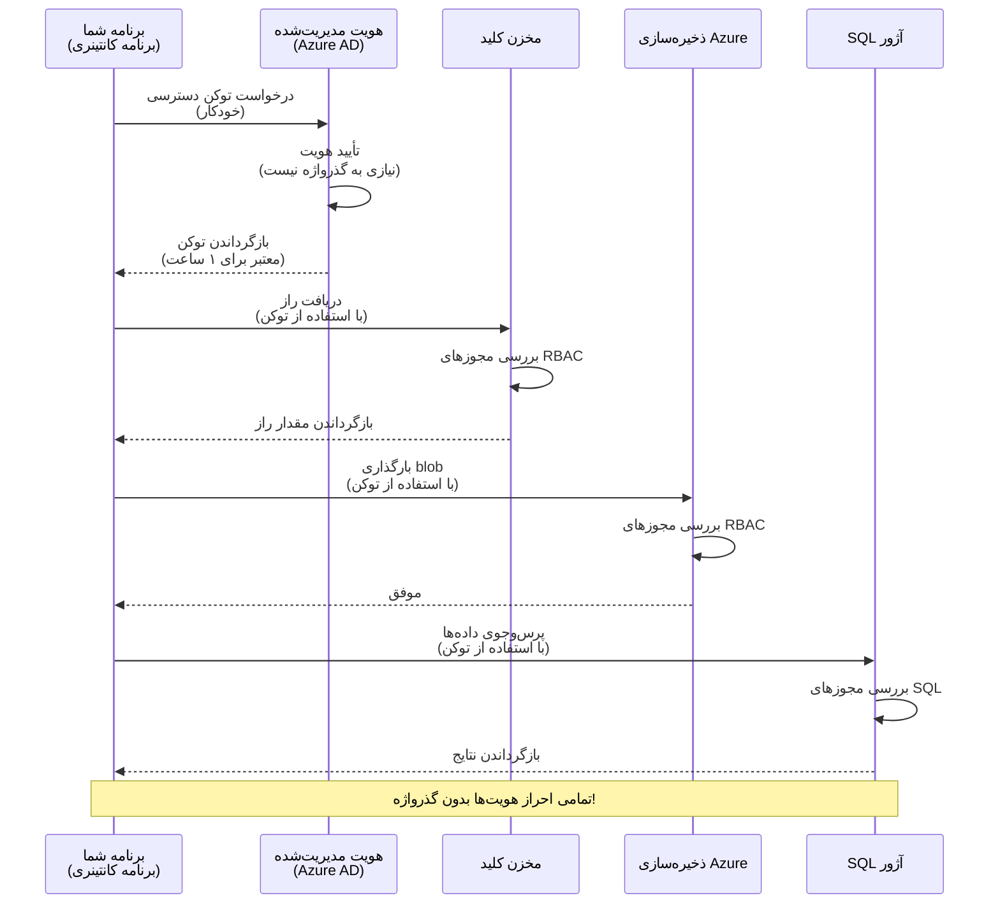
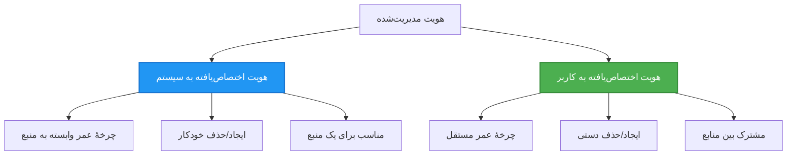

# الگوهای احراز هویت و هویت مدیریت‌شده

⏱️ **زمان تقریبی**: 45-60 دقیقه | 💰 **هزینه**: رایگان (بدون هزینه اضافی) | ⭐ **سطح پیچیدگی**: متوسط

**📚 مسیر یادگیری:**
- ← قبلی: [مدیریت پیکربندی](configuration.md) - مدیریت متغیرهای محیطی و اسرار
- 🎯 **شما اینجا هستید**: احراز هویت و امنیت (هویت مدیریت‌شده، Key Vault، الگوهای امن)
- → بعدی: [پروژه اول](first-project.md) - اولین برنامه AZD خود را بسازید
- 🏠 [صفحه اصلی دوره](../../README.md)

---

## آنچه یاد می‌گیرید

با تکمیل این درس، شما:
- درک الگوهای احراز هویت در Azure (کلیدها، رشته‌های اتصال، هویت مدیریت‌شده) را خواهید داشت
- پیاده‌سازی **هویت مدیریت‌شده** برای احراز هویت بدون رمز را انجام خواهید داد
- امن‌سازی اسرار با یکپارچه‌سازی **Azure Key Vault** را یاد خواهید گرفت
- پیکربندی **کنترل دسترسی مبتنی بر نقش (RBAC)** برای استقرارهای AZD را انجام خواهید داد
- بهترین شیوه‌های امنیتی را در Container Apps و سرویس‌های Azure اعمال خواهید کرد
- مهاجرت از احراز هویت مبتنی بر کلید به احراز هویت مبتنی بر هویت را انجام خواهید داد

## چرا هویت مدیریت‌شده مهم است

### مشکل: احراز هویت سنتی

**قبل از هویت مدیریت‌شده:**
```javascript
// ❌ خطر امنیتی: رازهای سخت‌کدشده در کد
const connectionString = "Server=mydb.database.windows.net;User=admin;Password=P@ssw0rd123";
const storageKey = "xK7mN9pQ2wR5tY8uI0oP3aS6dF1gH4jK...";
const cosmosKey = "C2x7B9n4M1p8Q5w3E6r0T2y5U8i1O4p7...";
```

**مشکلات:**
- 🔴 **اسرار در معرض دید** در کد، فایل‌های پیکربندی، متغیرهای محیطی
- 🔴 **چرخش مدارک** نیاز به تغییر کد و استقرار مجدد دارد
- 🔴 **کابوس حسابرسی** - چه کسی، چه زمانی و چه دسترسی‌هایی داشته است؟
- 🔴 **پراکنده شدن** - اسرار در سیستم‌های متعدد پخش شده‌اند
- 🔴 **ریسک‌های تطبیقی** - مردود شدن در ممیزی‌های امنیتی

### راه‌حل: هویت مدیریت‌شده

**بعد از هویت مدیریت‌شده:**
```javascript
// ✅ ایمن: هیچ اطلاعات محرمانه‌ای در کد وجود ندارد
const credential = new DefaultAzureCredential();
const client = new BlobServiceClient(
  "https://mystorageaccount.blob.core.windows.net",
  credential  // آژور به‌طور خودکار احراز هویت را مدیریت می‌کند
);
```

**مزایا:**
- ✅ **هیچ راز**ی در کد یا پیکربندی نیست
- ✅ **چرخش خودکار** - مدیریت توسط Azure انجام می‌شود
- ✅ **ردپای کامل حسابرسی** در لاگ‌های Azure AD
- ✅ **امنیت مرکزی** - مدیریت در Azure Portal
- ✅ **آماده رعایت قوانین** - منطبق با استانداردهای امنیتی

**مثال**: احراز هویت سنتی مثل حمل چندین کلید فیزیکی برای در‌های مختلف است. هویت مدیریت‌شده مثل داشتن یک کارت امنیتی است که به‌طور خودکار بر اساس هویت شما دسترسی می‌دهد—بدون کلیدی برای گم شدن، کپی شدن یا چرخش.

---

## نمای کلی معماری

### جریان احراز هویت با هویت مدیریت‌شده


```mermaid
sequenceDiagram
    participant App as برنامه شما<br/>(برنامه کانتینری)
    participant MI as هویت مدیریت‌شده<br/>(Azure AD)
    participant KV as مخزن کلید
    participant Storage as ذخیره‌سازی Azure
    participant DB as SQL آژور
    
    App->>MI: درخواست توکن دسترسی<br/>(خودکار)
    MI->>MI: تأیید هویت<br/>(نیازی به گذرواژه نیست)
    MI-->>App: بازگرداندن توکن<br/>(معتبر برای ۱ ساعت)
    
    App->>KV: دریافت راز<br/>(با استفاده از توکن)
    KV->>KV: بررسی مجوزهای RBAC
    KV-->>App: بازگرداندن مقدار راز
    
    App->>Storage: بارگذاری blob<br/>(با استفاده از توکن)
    Storage->>Storage: بررسی مجوزهای RBAC
    Storage-->>App: موفق
    
    App->>DB: پرس‌وجوی داده‌ها<br/>(با استفاده از توکن)
    DB->>DB: بررسی مجوزهای SQL
    DB-->>App: بازگرداندن نتایج
    
    Note over App,DB: تمامی احراز هویت‌ها بدون گذرواژه!
```
### انواع هویت‌های مدیریت‌شده


```mermaid
graph TB
    MI[هویت مدیریت‌شده]
    SystemAssigned[هویت اختصاص‌یافته به سیستم]
    UserAssigned[هویت اختصاص‌یافته به کاربر]
    
    MI --> SystemAssigned
    MI --> UserAssigned
    
    SystemAssigned --> SA1[چرخهٔ عمر وابسته به منبع]
    SystemAssigned --> SA2[ایجاد/حذف خودکار]
    SystemAssigned --> SA3[مناسب برای یک منبع]
    
    UserAssigned --> UA1[چرخهٔ عمر مستقل]
    UserAssigned --> UA2[ایجاد/حذف دستی]
    UserAssigned --> UA3[مشترک بین منابع]
    
    style SystemAssigned fill:#2196F3,stroke:#1976D2,stroke-width:2px,color:#fff
    style UserAssigned fill:#4CAF50,stroke:#388E3C,stroke-width:2px,color:#fff
```
| Feature | System-Assigned | User-Assigned |
|---------|----------------|---------------|
| **Lifecycle** | وابسته به منبع | مستقل |
| **Creation** | خودکار با منبع | ایجاد دستی |
| **Deletion** | با حذف منبع حذف می‌شود | پس از حذف منبع باقی می‌ماند |
| **Sharing** | فقط یک منبع | چندین منبع |
| **Use Case** | سناریوهای ساده | سناریوهای پیچیده چندمنبعی |
| **AZD Default** | ✅ پیشنهاد شده | اختیاری |

---

## پیش‌نیازها

### ابزارهای مورد نیاز

شما باید این موارد را از درس‌های قبلی نصب کرده باشید:

```bash
# بررسی Azure Developer CLI
azd version
# ✅ انتظار می‌رود: نسخه azd 1.0.0 یا بالاتر

# بررسی Azure CLI
az --version
# ✅ انتظار می‌رود: azure-cli 2.50.0 یا بالاتر
```

### نیازمندی‌های Azure

- اشتراک فعال Azure
- دسترسی برای:
  - ایجاد هویت‌های مدیریت‌شده
  - اختصاص نقش‌های RBAC
  - ایجاد منابع Key Vault
  - استقرار Container Apps

### پیش‌نیازهای دانش

شما باید موارد زیر را تکمیل کرده باشید:
- [راهنمای نصب](installation.md) - راه‌اندازی AZD
- [مبانی AZD](azd-basics.md) - مفاهیم اصلی
- [مدیریت پیکربندی](configuration.md) - متغیرهای محیطی

---

## درس 1: آشنایی با الگوهای احراز هویت

### الگو 1: رشته‌های اتصال (قدیمی - اجتناب شود)

**نحوه کار:**
```bash
# رشتهٔ اتصال شامل اعتبارنامه‌ها است
STORAGE_CONNECTION_STRING="DefaultEndpointsProtocol=https;AccountName=myaccount;AccountKey=xK7mN9pQ2wR5..."
COSMOS_CONNECTION_STRING="AccountEndpoint=https://myaccount.documents.azure.com:443/;AccountKey=C2x7..."
SQL_CONNECTION_STRING="Server=myserver.database.windows.net;User=admin;Password=P@ssw0rd..."
```

**مشکلات:**
- ❌ اسرار در متغیرهای محیطی قابل مشاهده هستند
- ❌ در سیستم‌های استقرار ثبت می‌شود
- ❌ سخت برای چرخش
- ❌ ردپای حسابرسی دسترسی وجود ندارد

**زمان استفاده:** فقط برای توسعه محلی، هرگز در محیط تولید.

---

### الگو 2: ارجاعات Key Vault (بهتر)

**نحوه کار:**
```bicep
// Store secret in Key Vault
resource keyVault 'Microsoft.KeyVault/vaults@2023-02-01' = {
  name: 'mykv'
  properties: {
    enableRbacAuthorization: true
  }
}

// Reference in Container App
env: [
  {
    name: 'STORAGE_KEY'
    secretRef: 'storage-key'  // References Key Vault
  }
]
```

**مزایا:**
- ✅ اسرار به‌طور امن در Key Vault ذخیره می‌شوند
- ✅ مدیریت متمرکز اسرار
- ✅ چرخش بدون تغییر کد

**محدودیت‌ها:**
- ⚠️ هنوز از کلیدها/رمزها استفاده می‌کند
- ⚠️ نیاز به مدیریت دسترسی Key Vault دارد

**زمان استفاده:** گام انتقال از رشته‌های اتصال به هویت مدیریت‌شده.

---

### الگو 3: هویت مدیریت‌شده (بهترین رویه)

**نحوه کار:**
```bicep
// Enable managed identity
resource containerApp 'Microsoft.App/containerApps@2023-05-01' = {
  name: 'myapp'
  identity: {
    type: 'SystemAssigned'  // Automatically creates identity
  }
}

// Grant permissions
resource roleAssignment 'Microsoft.Authorization/roleAssignments@2022-04-01' = {
  scope: storageAccount
  properties: {
    roleDefinitionId: storageBlobDataContributorRole
    principalId: containerApp.identity.principalId
  }
}
```

**کد برنامه:**
```javascript
// نیازی به اسرار نیست!
const { DefaultAzureCredential } = require('@azure/identity');
const { BlobServiceClient } = require('@azure/storage-blob');

const credential = new DefaultAzureCredential();
const blobServiceClient = new BlobServiceClient(
  'https://mystorageaccount.blob.core.windows.net',
  credential
);
```

**مزایا:**
- ✅ هیچ راز در کد/پیکربندی نیست
- ✅ چرخش خودکار مدارک
- ✅ ردپای کامل حسابرسی
- ✅ مجوزها مبتنی بر RBAC
- ✅ آماده رعایت قوانین

**زمان استفاده:** همیشه، برای برنامه‌های تولیدی.

---

## درس 2: پیاده‌سازی هویت مدیریت‌شده با AZD

### پیاده‌سازی گام‌به‌گام

بیایید یک Container App امن بسازیم که از هویت مدیریت‌شده برای دسترسی به Azure Storage و Key Vault استفاده کند.

### ساختار پروژه

```
secure-app/
├── azure.yaml                 # AZD configuration
├── infra/
│   ├── main.bicep            # Main infrastructure
│   ├── core/
│   │   ├── identity.bicep    # Managed identity setup
│   │   ├── keyvault.bicep    # Key Vault configuration
│   │   └── storage.bicep     # Storage with RBAC
│   └── app/
│       └── container-app.bicep
└── src/
    ├── app.js                # Application code
    ├── package.json
    └── Dockerfile
```

### 1. پیکربندی AZD (azure.yaml)

```yaml
name: secure-app
metadata:
  template: secure-app@1.0.0

services:
  api:
    project: ./src
    language: js
    host: containerapp

# Enable managed identity (AZD handles this automatically)
```

### 2. زیرساخت: فعال‌سازی هویت مدیریت‌شده

**فایل: `infra/main.bicep`**

```bicep
targetScope = 'subscription'

param environmentName string
param location string = 'eastus'

var tags = { 'azd-env-name': environmentName }

// Resource group
resource rg 'Microsoft.Resources/resourceGroups@2021-04-01' = {
  name: 'rg-${environmentName}'
  location: location
  tags: tags
}

// Storage Account
module storage './core/storage.bicep' = {
  name: 'storage'
  scope: rg
  params: {
    name: 'st${uniqueString(rg.id)}'
    location: location
    tags: tags
  }
}

// Key Vault
module keyVault './core/keyvault.bicep' = {
  name: 'keyvault'
  scope: rg
  params: {
    name: 'kv-${uniqueString(rg.id)}'
    location: location
    tags: tags
  }
}

// Container App with Managed Identity
module containerApp './app/container-app.bicep' = {
  name: 'container-app'
  scope: rg
  params: {
    name: 'ca-${environmentName}'
    location: location
    tags: tags
    storageAccountName: storage.outputs.name
    keyVaultName: keyVault.outputs.name
  }
}

// Grant Container App access to Storage
module storageRoleAssignment './core/role-assignment.bicep' = {
  name: 'storage-role'
  scope: rg
  params: {
    principalId: containerApp.outputs.identityPrincipalId
    roleDefinitionId: 'ba92f5b4-2d11-453d-a403-e96b0029c9fe'  // Storage Blob Data Contributor
    targetResourceId: storage.outputs.id
  }
}

// Grant Container App access to Key Vault
module kvRoleAssignment './core/role-assignment.bicep' = {
  name: 'kv-role'
  scope: rg
  params: {
    principalId: containerApp.outputs.identityPrincipalId
    roleDefinitionId: '4633458b-17de-408a-b874-0445c86b69e6'  // Key Vault Secrets User
    targetResourceId: keyVault.outputs.id
  }
}

// Outputs
output AZURE_STORAGE_ACCOUNT_NAME string = storage.outputs.name
output AZURE_KEY_VAULT_NAME string = keyVault.outputs.name
output APP_URL string = containerApp.outputs.url
```

### 3. Container App با هویت اختصاص‌یافته سیستم

**فایل: `infra/app/container-app.bicep`**

```bicep
param name string
param location string
param tags object = {}
param storageAccountName string
param keyVaultName string

resource containerApp 'Microsoft.App/containerApps@2023-05-01' = {
  name: name
  location: location
  tags: tags
  identity: {
    type: 'SystemAssigned'  // 🔑 Enable managed identity
  }
  properties: {
    configuration: {
      ingress: {
        external: true
        targetPort: 3000
      }
    }
    template: {
      containers: [
        {
          name: 'api'
          image: 'myregistry.azurecr.io/api:latest'
          resources: {
            cpu: json('0.5')
            memory: '1Gi'
          }
          env: [
            {
              name: 'AZURE_STORAGE_ACCOUNT_NAME'
              value: storageAccountName
            }
            {
              name: 'AZURE_KEY_VAULT_NAME'
              value: keyVaultName
            }
            // 🔑 No secrets - managed identity handles authentication!
          ]
        }
      ]
    }
  }
}

// Output the identity for RBAC assignments
output identityPrincipalId string = containerApp.identity.principalId
output id string = containerApp.id
output url string = 'https://${containerApp.properties.configuration.ingress.fqdn}'
```

### 4. ماژول اختصاص نقش RBAC

**فایل: `infra/core/role-assignment.bicep`**

```bicep
param principalId string
param roleDefinitionId string  // Azure built-in role ID
param targetResourceId string

resource roleAssignment 'Microsoft.Authorization/roleAssignments@2022-04-01' = {
  name: guid(principalId, roleDefinitionId, targetResourceId)
  scope: resourceId('Microsoft.Resources/resourceGroups', resourceGroup().name)
  properties: {
    roleDefinitionId: subscriptionResourceId('Microsoft.Authorization/roleDefinitions', roleDefinitionId)
    principalId: principalId
    principalType: 'ServicePrincipal'
  }
}

output id string = roleAssignment.id
```

### 5. کد برنامه با هویت مدیریت‌شده

**فایل: `src/app.js`**

```javascript
const express = require('express');
const { DefaultAzureCredential } = require('@azure/identity');
const { BlobServiceClient } = require('@azure/storage-blob');
const { SecretClient } = require('@azure/keyvault-secrets');

const app = express();
const PORT = process.env.PORT || 3000;

// 🔑 مقداردهی اعتبار (به‌طور خودکار با هویت مدیریت‌شده کار می‌کند)
const credential = new DefaultAzureCredential();

// پیکربندی Azure Storage
const storageAccountName = process.env.AZURE_STORAGE_ACCOUNT_NAME;
const blobServiceClient = new BlobServiceClient(
  `https://${storageAccountName}.blob.core.windows.net`,
  credential  // نیازی به کلید نیست!
);

// پیکربندی Key Vault
const keyVaultName = process.env.AZURE_KEY_VAULT_NAME;
const secretClient = new SecretClient(
  `https://${keyVaultName}.vault.azure.net`,
  credential  // نیازی به کلید نیست!
);

// بررسی سلامت
app.get('/health', (req, res) => {
  res.json({ status: 'healthy', authentication: 'managed-identity' });
});

// بارگذاری فایل در Blob Storage
app.post('/upload', async (req, res) => {
  try {
    const containerClient = blobServiceClient.getContainerClient('uploads');
    await containerClient.createIfNotExists();
    
    const blobName = `file-${Date.now()}.txt`;
    const blockBlobClient = containerClient.getBlockBlobClient(blobName);
    
    await blockBlobClient.upload('Hello from managed identity!', 30);
    
    res.json({
      success: true,
      blobName: blobName,
      message: 'File uploaded using managed identity!'
    });
  } catch (error) {
    console.error('Upload error:', error);
    res.status(500).json({ error: error.message });
  }
});

// بازیابی راز از Key Vault
app.get('/secret/:name', async (req, res) => {
  try {
    const secretName = req.params.name;
    const secret = await secretClient.getSecret(secretName);
    
    res.json({
      name: secretName,
      value: secret.value,
      message: 'Secret retrieved using managed identity!'
    });
  } catch (error) {
    console.error('Secret error:', error);
    res.status(500).json({ error: error.message });
  }
});

// فهرست کانتینرهای blob (نشان‌دهندهٔ دسترسی خواندن)
app.get('/containers', async (req, res) => {
  try {
    const containers = [];
    for await (const container of blobServiceClient.listContainers()) {
      containers.push(container.name);
    }
    
    res.json({
      containers: containers,
      count: containers.length,
      message: 'Containers listed using managed identity!'
    });
  } catch (error) {
    console.error('List error:', error);
    res.status(500).json({ error: error.message });
  }
});

app.listen(PORT, () => {
  console.log(`Secure API listening on port ${PORT}`);
  console.log('Authentication: Managed Identity (passwordless)');
});
```

**فایل: `src/package.json`**

```json
{
  "name": "secure-app",
  "version": "1.0.0",
  "dependencies": {
    "express": "^4.18.2",
    "@azure/identity": "^4.0.0",
    "@azure/storage-blob": "^12.17.0",
    "@azure/keyvault-secrets": "^4.7.0"
  },
  "scripts": {
    "start": "node app.js"
  }
}
```

### 6. استقرار و آزمایش

```bash
# محیط AZD را مقداردهی اولیه کنید
azd init

# زیرساخت و برنامه را مستقر کنید
azd up

# URL برنامه را دریافت کنید
APP_URL=$(azd env get-values | grep APP_URL | cut -d '=' -f2 | tr -d '"')

# بررسی سلامت را انجام دهید
curl $APP_URL/health
```

**✅ خروجی مورد انتظار:**
```json
{
  "status": "healthy",
  "authentication": "managed-identity"
}
```

**تست بارگذاری blob:**
```bash
curl -X POST $APP_URL/upload
```

**✅ خروجی مورد انتظار:**
```json
{
  "success": true,
  "blobName": "file-1700404800000.txt",
  "message": "File uploaded using managed identity!"
}
```

**تست فهرست کانتینرها:**
```bash
curl $APP_URL/containers
```

**✅ خروجی مورد انتظار:**
```json
{
  "containers": ["uploads"],
  "count": 1,
  "message": "Containers listed using managed identity!"
}
```

---

## نقش‌های متداول RBAC در Azure

### شناسه‌های نقش پیش‌فرض برای هویت مدیریت‌شده

| Service | Role Name | Role ID | Permissions |
|---------|-----------|---------|-------------|
| **Storage** | Storage Blob Data Reader | `2a2b9908-6b94-4a3d-8e5a-a7d8f8cc8a12` | خواندن blobها و کانتینرها |
| **Storage** | Storage Blob Data Contributor | `ba92f5b4-2d11-453d-a403-e96b0029c9fe` | خواندن، نوشتن و حذف blobها |
| **Storage** | Storage Queue Data Contributor | `974c5e8b-45b9-4653-ba55-5f855dd0fb88` | خواندن، نوشتن و حذف پیام‌های صف |
| **Key Vault** | Key Vault Secrets User | `4633458b-17de-408a-b874-0445c86b69e6` | خواندن اسرار |
| **Key Vault** | Key Vault Secrets Officer | `b86a8fe4-44ce-4948-aee5-eccb2c155cd7` | خواندن، نوشتن و حذف اسرار |
| **Cosmos DB** | Cosmos DB Built-in Data Reader | `00000000-0000-0000-0000-000000000001` | خواندن داده‌های Cosmos DB |
| **Cosmos DB** | Cosmos DB Built-in Data Contributor | `00000000-0000-0000-0000-000000000002` | خواندن و نوشتن داده‌های Cosmos DB |
| **SQL Database** | SQL DB Contributor | `9b7fa17d-e63e-47b0-bb0a-15c516ac86ec` | مدیریت پایگاه‌های داده SQL |
| **Service Bus** | Azure Service Bus Data Owner | `090c5cfd-751d-490a-894a-3ce6f1109419` | ارسال، دریافت و مدیریت پیام‌ها |

### چگونه شناسه نقش‌ها را پیدا کنیم

```bash
# تمام نقش‌های از پیش‌تعریف‌شده را فهرست کنید
az role definition list --query "[].{Name:roleName, ID:name}" --output table

# برای نقش مشخص جستجو کنید
az role definition list --query "[?contains(roleName, 'Storage Blob')].{Name:roleName, ID:name}" --output table

# جزئیات نقش را دریافت کنید
az role definition list --name "Storage Blob Data Contributor"
```

---

## تمرین‌های عملی

### تمرین 1: فعال‌سازی هویت مدیریت‌شده برای برنامه موجود ⭐⭐ (متوسط)

**هدف**: افزودن هویت مدیریت‌شده به یک استقرار Container App موجود

**سناریو**: شما یک Container App دارید که از رشته‌های اتصال استفاده می‌کند. آن را به هویت مدیریت‌شده تبدیل کنید.

**نقطه شروع**: Container App با این پیکربندی:

```bicep
// ❌ Current: Using connection string
env: [
  {
    name: 'STORAGE_CONNECTION_STRING'
    secretRef: 'storage-connection'
  }
]
```

**مراحل**:

1. **فعال‌سازی هویت مدیریت‌شده در Bicep:**

```bicep
resource containerApp 'Microsoft.App/containerApps@2023-05-01' = {
  name: 'myapp'
  identity: {
    type: 'SystemAssigned'  // Add this
  }
  // ... rest of configuration
}
```

2. **دادن دسترسی به Storage:**

```bicep
// Get storage account reference
resource storageAccount 'Microsoft.Storage/storageAccounts@2023-01-01' existing = {
  name: storageAccountName
}

// Assign role
resource roleAssignment 'Microsoft.Authorization/roleAssignments@2022-04-01' = {
  name: guid(containerApp.id, 'ba92f5b4-2d11-453d-a403-e96b0029c9fe', storageAccount.id)
  scope: storageAccount
  properties: {
    roleDefinitionId: subscriptionResourceId('Microsoft.Authorization/roleDefinitions', 'ba92f5b4-2d11-453d-a403-e96b0029c9fe')
    principalId: containerApp.identity.principalId
    principalType: 'ServicePrincipal'
  }
}
```

3. **به‌روزرسانی کد برنامه:**

**قبل (رشته اتصال):**
```javascript
const { BlobServiceClient } = require('@azure/storage-blob');

const blobServiceClient = BlobServiceClient.fromConnectionString(
  process.env.STORAGE_CONNECTION_STRING
);
```

**بعد (هویت مدیریت‌شده):**
```javascript
const { DefaultAzureCredential } = require('@azure/identity');
const { BlobServiceClient } = require('@azure/storage-blob');

const credential = new DefaultAzureCredential();
const blobServiceClient = new BlobServiceClient(
  `https://${process.env.STORAGE_ACCOUNT_NAME}.blob.core.windows.net`,
  credential
);
```

4. **به‌روزرسانی متغیرهای محیطی:**

```bicep
env: [
  {
    name: 'STORAGE_ACCOUNT_NAME'
    value: storageAccountName  // Just the name, no secrets!
  }
  // Remove STORAGE_CONNECTION_STRING
]
```

5. **استقرار و آزمایش:**

```bash
# استقرار مجدد
azd up

# بررسی کنید که هنوز کار می‌کند
curl https://myapp.azurecontainerapps.io/upload
```

**✅ معیارهای موفقیت:**
- ✅ برنامه بدون خطا مستقر می‌شود
- ✅ عملیات Storage کار می‌کند (بارگذاری، فهرست، دانلود)
- ✅ هیچ رشته اتصال در متغیرهای محیطی وجود ندارد
- ✅ هویت در پرتال Azure در بخش "Identity" قابل مشاهده است

**تأیید:**

```bash
# بررسی کنید که هویت مدیریت‌شده فعال است
az containerapp show \
  --name myapp \
  --resource-group rg-myapp \
  --query "identity.type"
# ✅ انتظار می‌رود: "SystemAssigned"

# بررسی انتساب نقش
az role assignment list \
  --assignee $(az containerapp show --name myapp --resource-group rg-myapp --query "identity.principalId" -o tsv) \
  --scope /subscriptions/{sub-id}/resourceGroups/rg-myapp/providers/Microsoft.Storage/storageAccounts/mystorageaccount
# ✅ انتظار می‌رود نقش "Storage Blob Data Contributor" را نمایش دهد
```

**زمان**: 20-30 دقیقه

---

### تمرین 2: دسترسی چندسرویسی با هویت اختصاص‌یافته به کاربر ⭐⭐⭐ (پیشرفته)

**هدف**: ایجاد یک هویت اختصاص‌یافته به کاربر که بین چند Container App به اشتراک گذاشته شود

**سناریو**: شما 3 میکروسرویس دارید که همه نیاز به دسترسی به همان حساب Storage و Key Vault دارند.

**مراحل**:

1. **ایجاد هویت اختصاص‌یافته به کاربر:**

**فایل: `infra/core/identity.bicep`**

```bicep
param name string
param location string
param tags object = {}

resource userAssignedIdentity 'Microsoft.ManagedIdentity/userAssignedIdentities@2023-01-31' = {
  name: name
  location: location
  tags: tags
}

output id string = userAssignedIdentity.id
output principalId string = userAssignedIdentity.properties.principalId
output clientId string = userAssignedIdentity.properties.clientId
```

2. **اختصاص نقش‌ها به هویت اختصاص‌یافته به کاربر:**

```bicep
// In main.bicep
module userIdentity './core/identity.bicep' = {
  name: 'user-identity'
  scope: rg
  params: {
    name: 'id-${environmentName}'
    location: location
    tags: tags
  }
}

// Grant Storage access
resource storageRoleAssignment 'Microsoft.Authorization/roleAssignments@2022-04-01' = {
  name: guid(userIdentity.outputs.principalId, 'storage-contributor')
  scope: storageAccount
  properties: {
    roleDefinitionId: subscriptionResourceId('Microsoft.Authorization/roleDefinitions', 'ba92f5b4-2d11-453d-a403-e96b0029c9fe')
    principalId: userIdentity.outputs.principalId
    principalType: 'ServicePrincipal'
  }
}

// Grant Key Vault access
resource kvRoleAssignment 'Microsoft.Authorization/roleAssignments@2022-04-01' = {
  name: guid(userIdentity.outputs.principalId, 'kv-secrets-user')
  scope: keyVault
  properties: {
    roleDefinitionId: subscriptionResourceId('Microsoft.Authorization/roleDefinitions', '4633458b-17de-408a-b874-0445c86b69e6')
    principalId: userIdentity.outputs.principalId
    principalType: 'ServicePrincipal'
  }
}
```

3. **اختصاص هویت به چند Container App:**

```bicep
resource apiGateway 'Microsoft.App/containerApps@2023-05-01' = {
  name: 'api-gateway'
  identity: {
    type: 'UserAssigned'
    userAssignedIdentities: {
      '${userIdentity.outputs.id}': {}
    }
  }
  // ... rest of config
}

resource productService 'Microsoft.App/containerApps@2023-05-01' = {
  name: 'product-service'
  identity: {
    type: 'UserAssigned'
    userAssignedIdentities: {
      '${userIdentity.outputs.id}': {}
    }
  }
  // ... rest of config
}

resource orderService 'Microsoft.App/containerApps@2023-05-01' = {
  name: 'order-service'
  identity: {
    type: 'UserAssigned'
    userAssignedIdentities: {
      '${userIdentity.outputs.id}': {}
    }
  }
  // ... rest of config
}
```

4. **کد برنامه (همه سرویس‌ها از همان الگو استفاده می‌کنند):**

```javascript
const { DefaultAzureCredential, ManagedIdentityCredential } = require('@azure/identity');

// برای هویت اختصاص‌یافته توسط کاربر، شناسهٔ مشتری را مشخص کنید
const credential = new ManagedIdentityCredential(
  process.env.AZURE_CLIENT_ID  // شناسهٔ مشتریِ هویت اختصاص‌یافته توسط کاربر
);

// یا از DefaultAzureCredential استفاده کنید (به‌صورت خودکار تشخیص می‌دهد)
const credential = new DefaultAzureCredential();

const blobServiceClient = new BlobServiceClient(
  `https://${process.env.STORAGE_ACCOUNT_NAME}.blob.core.windows.net`,
  credential
);
```

5. **استقرار و تأیید:**

```bash
azd up

# بررسی کنید که همه سرویس‌ها بتوانند به ذخیره‌سازی دسترسی پیدا کنند
curl https://api-gateway.azurecontainerapps.io/upload
curl https://product-service.azurecontainerapps.io/upload
curl https://order-service.azurecontainerapps.io/upload
```

**✅ معیارهای موفقیت:**
- ✅ یک هویت بین 3 سرویس به اشتراک گذاشته می‌شود
- ✅ همه سرویس‌ها می‌توانند به Storage و Key Vault دسترسی داشته باشند
- ✅ هویت در صورت حذف یک سرویس باقی می‌ماند
- ✅ مدیریت دسترسی متمرکز است

**مزایای هویت اختصاص‌یافته به کاربر:**
- یک هویت برای مدیریت
- مجوزهای یکنواخت بین سرویس‌ها
- بقای هویت پس از حذف سرویس
- مناسب‌تر برای معماری‌های پیچیده

**زمان**: 30-40 دقیقه

---

### تمرین 3: پیاده‌سازی چرخش اسرار Key Vault ⭐⭐⭐ (پیشرفته)

**هدف**: ذخیره کلیدهای API شخص ثالث در Key Vault و دسترسی به آن‌ها با استفاده از هویت مدیریت‌شده

**سناریو**: برنامه شما نیاز دارد تا به یک API خارجی (OpenAI، Stripe، SendGrid) که نیاز به کلیدهای API دارد، فراخوانی کند.

**مراحل**:

1. **ایجاد Key Vault با RBAC:**

**فایل: `infra/core/keyvault.bicep`**

```bicep
param name string
param location string
param tags object = {}

resource keyVault 'Microsoft.KeyVault/vaults@2023-02-01' = {
  name: name
  location: location
  tags: tags
  properties: {
    enableRbacAuthorization: true  // Use RBAC instead of access policies
    sku: {
      family: 'A'
      name: 'standard'
    }
    tenantId: subscription().tenantId
    enableSoftDelete: true
    softDeleteRetentionInDays: 90
  }
}

// Allow Container App to read secrets
output id string = keyVault.id
output name string = keyVault.name
output uri string = keyVault.properties.vaultUri
```

2. **ذخیره اسرار در Key Vault:**

```bash
# نام مخزن کلید را دریافت کنید
KV_NAME=$(azd env get-values | grep AZURE_KEY_VAULT_NAME | cut -d '=' -f2 | tr -d '"')

# کلیدهای API طرف ثالث را ذخیره کنید
az keyvault secret set \
  --vault-name $KV_NAME \
  --name "OpenAI-ApiKey" \
  --value "sk-proj-xxxxxxxxxxxxx"

az keyvault secret set \
  --vault-name $KV_NAME \
  --name "Stripe-ApiKey" \
  --value "sk_live_xxxxxxxxxxxxx"

az keyvault secret set \
  --vault-name $KV_NAME \
  --name "SendGrid-ApiKey" \
  --value "SG.xxxxxxxxxxxxx"
```

3. **کد برنامه برای بازیابی اسرار:**

**فایل: `src/config.js`**

```javascript
const { DefaultAzureCredential } = require('@azure/identity');
const { SecretClient } = require('@azure/keyvault-secrets');

class Config {
  constructor() {
    this.credential = new DefaultAzureCredential();
    this.secretClient = new SecretClient(
      `https://${process.env.AZURE_KEY_VAULT_NAME}.vault.azure.net`,
      this.credential
    );
    this.cache = {};
  }

  async getSecret(secretName) {
    // ابتدا کش را بررسی کنید
    if (this.cache[secretName]) {
      return this.cache[secretName];
    }

    try {
      const secret = await this.secretClient.getSecret(secretName);
      this.cache[secretName] = secret.value;
      console.log(`✅ Retrieved secret: ${secretName}`);
      return secret.value;
    } catch (error) {
      console.error(`❌ Failed to get secret ${secretName}:`, error.message);
      throw error;
    }
  }

  async getOpenAIKey() {
    return this.getSecret('OpenAI-ApiKey');
  }

  async getStripeKey() {
    return this.getSecret('Stripe-ApiKey');
  }

  async getSendGridKey() {
    return this.getSecret('SendGrid-ApiKey');
  }
}

module.exports = new Config();
```

4. **استفاده از اسرار در برنامه:**

**فایل: `src/app.js`**

```javascript
const express = require('express');
const config = require('./config');
const { OpenAI } = require('openai');

const app = express();

// OpenAI را با کلیدی که از مخزن کلید گرفته شده مقداردهی اولیه کنید
let openaiClient;

async function initializeServices() {
  const openaiKey = await config.getOpenAIKey();
  openaiClient = new OpenAI({ apiKey: openaiKey });
  console.log('✅ Services initialized with secrets from Key Vault');
}

// هنگام راه‌اندازی فراخوانی شود
initializeServices().catch(console.error);

app.post('/chat', async (req, res) => {
  try {
    const completion = await openaiClient.chat.completions.create({
      model: 'gpt-4.1',
      messages: [{ role: 'user', content: 'Hello!' }]
    });
    
    res.json({
      response: completion.choices[0].message.content,
      authentication: 'Key from Key Vault via Managed Identity'
    });
  } catch (error) {
    res.status(500).json({ error: error.message });
  }
});

app.listen(3000, () => {
  console.log('Secure API with Key Vault integration running');
});
```

5. **استقرار و آزمایش:**

```bash
azd up

# بررسی اینکه کلیدهای API کار می‌کنند
curl -X POST https://myapp.azurecontainerapps.io/chat \
  -H "Content-Type: application/json" \
  -d '{"message":"Hello AI"}'
```

**✅ معیارهای موفقیت:**
- ✅ هیچ کلید API در کد یا متغیرهای محیطی نیست
- ✅ برنامه کلیدها را از Key Vault بازیابی می‌کند
- ✅ APIهای شخص ثالث به‌درستی کار می‌کنند
- ✅ می‌توان کلیدها را بدون تغییر کد چرخاند

**چرخش یک راز:**

```bash
# مقدار محرمانه را در Key Vault به‌روزرسانی کنید
az keyvault secret set \
  --vault-name $KV_NAME \
  --name "OpenAI-ApiKey" \
  --value "sk-proj-NEW_KEY_HERE"

# برای استفاده از کلید جدید برنامه را راه‌اندازی مجدد کنید
az containerapp revision restart \
  --name myapp \
  --resource-group rg-myapp
```

**زمان**: 25-35 دقیقه

---

## نقطه بررسی دانش

### 1. الگوهای احراز هویت ✓

درک خود را آزمایش کنید:

- [ ] **Q1**: سه الگوی اصلی احراز هویت چه هستند؟ 
  - **A**: رشته‌های اتصال (قدیمی)، ارجاعات Key Vault (گذر)، هویت مدیریت‌شده (بهترین)
- [ ] **Q2**: چرا هویت مدیریت‌شده بهتر از رشته‌های اتصال است؟
  - **A**: هیچ راز در کد نیست، چرخش خودکار، ردپای کامل حسابرسی، مجوزهای مبتنی بر RBAC
- [ ] **Q3**: چه زمانی از هویت اختصاص‌یافته به کاربر به‌جای هویت اختصاص‌یافته سیستم استفاده می‌کنید؟
  - **A**: وقتی هویت باید بین چند منبع به اشتراک گذاشته شود یا چرخه عمر هویت مستقل از چرخه عمر منبع باشد

**تأیید عملی:**
```bash
# بررسی کنید که برنامه شما از چه نوع هویتی استفاده می‌کند
az containerapp show \
  --name myapp \
  --resource-group rg-myapp \
  --query "identity.type"

# همه انتساب‌های نقش مربوط به آن هویت را فهرست کنید
az role assignment list \
  --assignee $(az containerapp show --name myapp --resource-group rg-myapp --query "identity.principalId" -o tsv)
```

---

### 2. RBAC و مجوزها ✓

درک خود را آزمایش کنید:

- [ ] **Q1**: شناسه نقش برای "Storage Blob Data Contributor" چیست؟
  - **A**: `ba92f5b4-2d11-453d-a403-e96b0029c9fe`
- [ ] **Q2**: نقش "Key Vault Secrets User" چه مجوزی می‌دهد؟
  - **A**: دسترسی فقط خواندنی به اسرار (نمی‌تواند ایجاد، به‌روزرسانی یا حذف کند)
- [ ] **Q3**: چگونه به یک Container App دسترسی به Azure SQL می‌دهید؟
  - **A**: اختصاص نقش "SQL DB Contributor" یا پیکربندی احراز هویت Azure AD برای SQL

**تأیید عملی:**
```bash
# یافتن نقش مشخص
az role definition list --name "Storage Blob Data Contributor"

# بررسی اینکه چه نقش‌هایی به هویت شما تخصیص داده شده‌اند
PRINCIPAL_ID=$(az containerapp show --name myapp --resource-group rg-myapp --query "identity.principalId" -o tsv)
az role assignment list --assignee $PRINCIPAL_ID --output table
```

---

### 3. یکپارچه‌سازی Key Vault ✓
- [ ] **Q1**: چگونه RBAC را برای Key Vault به جای سیاست‌های دسترسی فعال می‌کنید؟
  - **A**: مقدار `enableRbacAuthorization: true` را در Bicep تنظیم کنید

- [ ] **Q2**: کدام کتابخانه Azure SDK احراز هویت managed identity را انجام می‌دهد؟
  - **A**: `@azure/identity` با کلاس `DefaultAzureCredential`

- [ ] **Q3**: اسرار Key Vault چه مدت در کش باقی می‌مانند؟
  - **A**: وابسته به برنامه؛ استراتژی کش اختصاصی خود را پیاده‌سازی کنید

**Hands-On Verification:**
```bash
# آزمایش دسترسی به مخزن کلید
az keyvault secret show \
  --vault-name $KV_NAME \
  --name "OpenAI-ApiKey" \
  --query "value"

# بررسی فعال بودن RBAC
az keyvault show \
  --name $KV_NAME \
  --query "properties.enableRbacAuthorization"
# ✅ انتظار: درست
```

---

## بهترین شیوه‌های امنیتی

### ✅ انجام شود:

1. **همیشه در تولید از managed identity استفاده کنید**
   ```bicep
   identity: {
     type: 'SystemAssigned'
   }
   ```

2. **از نقش‌های RBAC با حداقل سطح دسترسی استفاده کنید**
   - تا حد امکان از نقش "Reader" استفاده کنید
   - از نقش "Owner" یا "Contributor" مگر در صورت ضروری اجتناب کنید

3. **کلیدهای ثالث را در Key Vault نگهداری کنید**
   ```javascript
   const apiKey = await secretClient.getSecret('ThirdPartyApiKey');
   ```

4. **فعال‌سازی ثبت حسابرسی (audit logging)**
   ```bicep
   diagnosticSettings: {
     logs: [{ category: 'AuditEvent', enabled: true }]
   }
   ```

5. **برای dev/staging/prod از هویت‌های متفاوت استفاده کنید**
   ```bash
   azd env new dev
   azd env new staging
   azd env new prod
   ```

6. **اسرار را به‌طور منظم بچرخانید**
   - برای اسرار Key Vault تاریخ انقضاء تنظیم کنید
   - چرخش را با Azure Functions خودکار کنید

### ❌ انجام ندهید:

1. **هرگز اسرار را به‌صورت هاردکد قرار ندهید**
   ```javascript
   // بد ❌
   const apiKey = "sk-proj-xxxxxxxxxxxxx";
   ```

2. **در تولید از connection strings استفاده نکنید**
   ```javascript
   // ❌ بد
   BlobServiceClient.fromConnectionString(process.env.STORAGE_CONNECTION_STRING)
   ```

3. **به مجوزهای بیش از حد اجازه ندهید**
   ```bicep
   // ❌ BAD - too much access
   roleDefinitionId: 'Owner'
   
   // ✅ GOOD - least privilege
   roleDefinitionId: 'Storage Blob Data Reader'
   ```

4. **اسرار را لاگ نکنید**
   ```javascript
   // ❌ بد
   console.log('API Key:', apiKey);
   
   // ✅ خوب
   console.log('API Key retrieved successfully');
   ```

5. **هویت‌های تولید را بین محیط‌ها به‌اشتراک نگذارید**
   ```bicep
   // ❌ BAD - same identity for dev and prod
   // ✅ GOOD - separate identities per environment
   ```

---

## راهنمای عیب‌یابی

### مشکل: «Unauthorized» هنگام دسترسی به Azure Storage

**نشانه‌ها:**
```
Error: Unauthorized (403)
AuthorizationPermissionMismatch: This request is not authorized to perform this operation
```

**تشخیص:**

```bash
# بررسی کنید آیا هویت مدیریت‌شده فعال است
az containerapp show \
  --name myapp \
  --resource-group rg-myapp \
  --query "identity.type"
# ✅ انتظار: "SystemAssigned" یا "UserAssigned"

# بررسی انتساب‌های نقش
PRINCIPAL_ID=$(az containerapp show --name myapp --resource-group rg-myapp --query "identity.principalId" -o tsv)
az role assignment list --assignee $PRINCIPAL_ID

# انتظار: باید "Storage Blob Data Contributor" یا نقش مشابهی را ببینید
```

**راه‌حل‌ها:**

1. **نقش RBAC درست را اعطا کنید:**
```bash
STORAGE_ID=$(az storage account show --name mystorageaccount --resource-group rg-myapp --query "id" -o tsv)
az role assignment create \
  --assignee $PRINCIPAL_ID \
  --role "Storage Blob Data Contributor" \
  --scope $STORAGE_ID
```

2. **منتظر انتشار تغییرات بمانید (ممکن است ۵–۱۰ دقیقه طول بکشد):**
```bash
# وضعیت انتساب نقش را بررسی کنید
az role assignment list --assignee $PRINCIPAL_ID --scope $STORAGE_ID
```

3. **تأیید کنید کد برنامه از Credential صحیح استفاده می‌کند:**
```javascript
// اطمینان حاصل کنید که از DefaultAzureCredential استفاده می‌کنید
const credential = new DefaultAzureCredential();
```

---

### مشکل: دسترسی به Key Vault رد شد

**نشانه‌ها:**
```
Error: Forbidden (403)
The user, group or application does not have secrets get permission
```

**تشخیص:**

```bash
# بررسی فعال بودن RBAC در Key Vault
az keyvault show \
  --name $KV_NAME \
  --query "properties.enableRbacAuthorization"
# ✅ مورد انتظار: درست

# بررسی انتساب نقش‌ها
az role assignment list \
  --assignee $PRINCIPAL_ID \
  --scope /subscriptions/{sub-id}/resourceGroups/rg-myapp/providers/Microsoft.KeyVault/vaults/$KV_NAME
```

**راه‌حل‌ها:**

1. **RBAC را در Key Vault فعال کنید:**
```bash
az keyvault update \
  --name $KV_NAME \
  --enable-rbac-authorization true
```

2. **نقش Key Vault Secrets User را اعطا کنید:**
```bash
KV_ID=$(az keyvault show --name $KV_NAME --query "id" -o tsv)
az role assignment create \
  --assignee $PRINCIPAL_ID \
  --role "Key Vault Secrets User" \
  --scope $KV_ID
```

---

### مشکل: DefaultAzureCredential به‌صورت محلی خطا می‌دهد

**نشانه‌ها:**
```
Error: DefaultAzureCredential failed to retrieve a token
CredentialUnavailableError: No credential available
```

**تشخیص:**

```bash
# بررسی کنید که وارد شده‌اید
az account show

# احراز هویت Azure CLI را بررسی کنید
az ad signed-in-user show
```

**راه‌حل‌ها:**

1. **وارد Azure CLI شوید:**
```bash
az login
```

2. **اشتراک Azure را تنظیم کنید:**
```bash
az account set --subscription "Your Subscription Name"
```

3. **برای توسعه محلی از متغیرهای محیطی استفاده کنید:**
```bash
export AZURE_TENANT_ID="your-tenant-id"
export AZURE_CLIENT_ID="your-client-id"
export AZURE_CLIENT_SECRET="your-client-secret"
```

4. **یا از Credential دیگری به‌صورت محلی استفاده کنید:**
```javascript
const { DefaultAzureCredential, AzureCliCredential } = require('@azure/identity');

// برای توسعه محلی از AzureCliCredential استفاده کنید
const credential = process.env.NODE_ENV === 'production' 
  ? new DefaultAzureCredential()
  : new AzureCliCredential();
```

---

### مشکل: تخصیص نقش زمان زیادی برای انتشار می‌گیرد

**نشانه‌ها:**
- نقش با موفقیت تخصیص داده شده است
- همچنان خطاهای 403 دریافت می‌کنید
- دسترسی ناپایدار (گاهی کار می‌کند، گاهی نه)

**توضیح:**
تغییرات Azure RBAC ممکن است ۵–۱۰ دقیقه طول بکشد تا در سطح جهانی منتشر شوند.

**راه‌حل:**

```bash
# صبر کنید و دوباره تلاش کنید
echo "Waiting for RBAC propagation..."
sleep 300  # ۵ دقیقه صبر کنید

# دسترسی را آزمایش کنید
curl https://myapp.azurecontainerapps.io/upload

# اگر هنوز کار نمی‌کند، برنامه را مجدداً راه‌اندازی کنید
az containerapp revision restart \
  --name myapp \
  --resource-group rg-myapp
```

---

## ملاحظات هزینه

### هزینه‌های Managed Identity

| Resource | Cost |
|----------|------|
| **هویت مدیریت‌شده (Managed Identity)** | 🆓 **FREE** - No charge |
| **تخصیص نقش‌های RBAC** | 🆓 **FREE** - No charge |
| **درخواست‌های توکن Azure AD** | 🆓 **FREE** - Included |
| **عملیات Key Vault** | $0.03 per 10,000 operations |
| **ذخیره‌سازی Key Vault** | $0.024 per secret per month |

**هویت مدیریت‌شده باعث صرفه‌جویی هزینه می‌شود از طریق:**
- ✅ حذف عملیات Key Vault برای احراز هویت سرویس به سرویس
- ✅ کاهش رخدادهای امنیتی (بدون افشای اعتبارنامه‌ها)
- ✅ کاهش سربار عملیاتی (نداشتن نیاز به چرخش دستی)

**مثال مقایسه هزینه (ماهانه):**

| Scenario | Connection Strings | Managed Identity | Savings |
|----------|-------------------|-----------------|---------|
| Small app (1M requests) | ~$50 (Key Vault + ops) | ~$0 | $50/month |
| Medium app (10M requests) | ~$200 | ~$0 | $200/month |
| Large app (100M requests) | ~$1,500 | ~$0 | $1,500/month |

---

## بیشتر بدانید

### مستندات رسمی
- [Azure Managed Identity](https://learn.microsoft.com/entra/identity/managed-identities-azure-resources/overview)
- [Azure RBAC](https://learn.microsoft.com/azure/role-based-access-control/overview)
- [Azure Key Vault](https://learn.microsoft.com/azure/key-vault/general/overview)
- [DefaultAzureCredential](https://learn.microsoft.com/dotnet/api/azure.identity.defaultazurecredential)

### مستندات SDK
- [@azure/identity (Node.js)](https://www.npmjs.com/package/@azure/identity)
- [Azure.Identity (C#)](https://www.nuget.org/packages/Azure.Identity/)
- [azure-identity (Python)](https://pypi.org/project/azure-identity/)

### گام‌های بعدی در این دوره
- ← قبلی: [مدیریت پیکربندی](configuration.md)
- → بعدی: [پروژه اول](first-project.md)
- 🏠 [صفحه دوره](../../README.md)

### مثال‌های مرتبط
- [Microsoft Foundry Models Chat Example](../../../../examples/azure-openai-chat) - از managed identity برای Microsoft Foundry Models استفاده می‌کند
- [Microservices Example](../../../../examples/microservices) - الگوهای احراز هویت چندسرویسی

---

## خلاصه

**شما آموختید:**
- ✅ سه الگوی احراز هویت (connection strings، Key Vault، managed identity)
- ✅ نحوه فعال‌سازی و پیکربندی managed identity در AZD
- ✅ تخصیص نقش‌های RBAC برای سرویس‌های Azure
- ✅ ادغام Key Vault برای اسرار ثالث
- ✅ هویت‌های اختصاص‌یافته به کاربر در برابر هویت‌های اختصاص‌یافته سیستم
- ✅ بهترین شیوه‌های امنیتی و عیب‌یابی

**نکات کلیدی:**
1. **همیشه در تولید از managed identity استفاده کنید** - صفر اسرار، چرخش خودکار
2. **از نقش‌های RBAC با حداقل سطح دسترسی استفاده کنید** - تنها مجوزهای لازم را اعطا کنید
3. **کلیدهای ثالث را در Key Vault نگهداری کنید** - مدیریت متمرکز اسرار
4. **هویت‌ها را برای هر محیط جدا کنید** - جداسازی dev، staging، prod
5. **ثبت حسابرسی را فعال کنید** - پیگیری اینکه چه کسی چه چیزی را دسترسی داشته است

**گام‌های بعدی:**
1. تمرین‌های عملی بالا را کامل کنید
2. یک برنامه موجود را از connection strings به managed identity مهاجرت دهید
3. اولین پروژه AZD خود را از روز اول با امنیت بسازید: [اولین پروژه](first-project.md)

---

<!-- CO-OP TRANSLATOR DISCLAIMER START -->
**سلب مسئولیت**:
این سند با استفاده از سرویس ترجمه‌ی مبتنی بر هوش مصنوعی [Co-op Translator](https://github.com/Azure/co-op-translator) ترجمه شده است. در حالی که ما در تلاش برای دقت هستیم، لطفاً توجه داشته باشید که ترجمه‌های خودکار ممکن است حاوی اشتباهات یا نادرستی‌هایی باشند. سند اصلی به زبان اصلی باید به‌عنوان مرجع معتبر در نظر گرفته شود. برای اطلاعات حیاتی، ترجمه حرفه‌ای انسانی توصیه می‌شود. ما در قبال هر گونه سوتفاهم یا برداشت نادرستی که از استفاده از این ترجمه ناشی شود، مسئولیتی نداریم.
<!-- CO-OP TRANSLATOR DISCLAIMER END -->