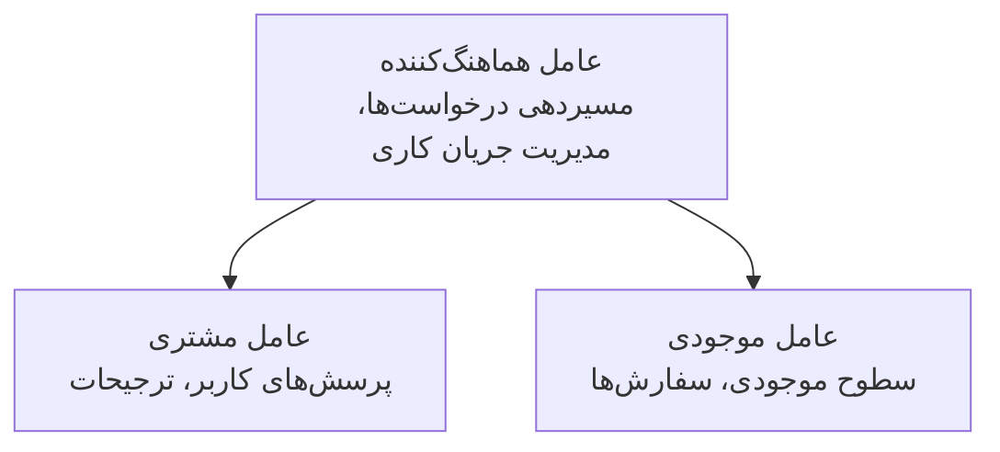

# فصل 5: راه‌حل‌های چندعاملهٔ هوش مصنوعی

**📚 Course**: [AZD For Beginners](../../README.md) | **⏱️ Duration**: 2-3 hours | **⭐ Complexity**: پیشرفته

---

## مرور کلی

این فصل الگوهای معماری پیشرفتهٔ چندعامل، ارکستراسیون عامل‌ها و استقرارهای آمادهٔ تولید برای سناریوهای پیچیده را پوشش می‌دهد.

> اعتبارسنجی شده با `azd 1.23.12` در مارس 2026.

## اهداف یادگیری

با تکمیل این فصل، شما:
- الگوهای معماری چندعامله را خواهید فهمید
- سیستم‌های هماهنگ‌شدهٔ عامل‌های هوش مصنوعی را مستقر خواهید کرد
- پیاده‌سازی ارتباط عامل-به-عامل را انجام خواهید داد
- راه‌حل‌های چندعاملهٔ آمادهٔ تولید بسازید

---

## 📚 درس‌ها

| # | Lesson | Description | Time |
|---|--------|-------------|------|
| 1 | [Retail Multi-Agent Solution](../../examples/retail-scenario.md) | مرور کامل پیاده‌سازی | 90 دقیقه |
| 2 | [Coordination Patterns](../chapter-06-pre-deployment/coordination-patterns.md) | استراتژی‌های ارکستراسیون عامل‌ها | 30 دقیقه |
| 3 | [ARM Template Deployment](../../examples/retail-multiagent-arm-template/README.md) | استقرار با یک کلیک | 30 دقیقه |

---

## 🚀 شروع سریع

```bash
# گزینهٔ ۱: استقرار از یک قالب
azd init --template agent-openai-python-prompty
azd up

# گزینهٔ ۲: استقرار از مانفیست عامل (نیاز به افزونهٔ azure.ai.agents دارد)
azd extension install azure.ai.agents
azd ai agent init -m agent-manifest.yaml
azd up
```

> **کدام رویکرد؟** از `azd init --template` برای شروع از یک نمونهٔ کاری استفاده کنید. وقتی منشور عامل خود را دارید از `azd ai agent init` استفاده کنید. برای جزئیات کامل به [مرجع AZD AI CLI](../chapter-08-production/production-ai-practices.md#azd-ai-cli-commands-and-extensions) مراجعه کنید.

---

## 🤖 معماری چندعامله


---

## 🎯 راه‌حل برجسته: راه‌حل چندعاملهٔ خرده‌فروشی

[راه‌حل چندعاملهٔ خرده‌فروشی](../../examples/retail-scenario.md) نشان می‌دهد:

- **عامل مشتری**: تعاملات کاربر و ترجیحات را مدیریت می‌کند
- **عامل موجودی**: مدیریت موجودی و پردازش سفارشات
- **ارکستراتور**: هماهنگی بین عامل‌ها را انجام می‌دهد
- **حافظهٔ مشترک**: مدیریت زمینهٔ بین عاملی

### سرویس‌های مورد استفاده

| Service | Purpose |
|---------|---------|
| Microsoft Foundry Models | درک زبان |
| Azure AI Search | فهرست محصولات |
| Cosmos DB | وضعیت و حافظهٔ عامل |
| Container Apps | میزبانی عامل |
| Application Insights | نظارت |

---

## 🔗 ناوبری

| Direction | Chapter |
|-----------|---------|
| **Previous** | [فصل ۴: زیرساخت](../chapter-04-infrastructure/README.md) |
| **Next** | [فصل ۶: پیش‌استقرار](../chapter-06-pre-deployment/README.md) |

---

## 📖 منابع مرتبط

- [راهنمای عوامل هوش مصنوعی](../chapter-02-ai-development/agents.md)
- [روش‌های تولیدی هوش مصنوعی](../chapter-08-production/production-ai-practices.md)
- [عیب‌یابی هوش مصنوعی](../chapter-07-troubleshooting/ai-troubleshooting.md)

---

<!-- CO-OP TRANSLATOR DISCLAIMER START -->
**سلب مسئولیت**:
این سند با استفاده از سرویس ترجمهٔ هوش مصنوعی [Co-op Translator](https://github.com/Azure/co-op-translator) ترجمه شده است. هرچند ما برای دقت تلاش می‌کنیم، لطفاً توجه داشته باشید که ترجمه‌های خودکار ممکن است دارای خطا یا نادرستی باشند. سند اصلی به زبان مادری باید به عنوان منبع معتبر در نظر گرفته شود. برای اطلاعات حیاتی، ترجمهٔ حرفه‌ای انسانی توصیه می‌شود. ما در قبال هرگونه سوءتفاهم یا تفسیر نادرست ناشی از استفاده از این ترجمه مسئولیتی نداریم.
<!-- CO-OP TRANSLATOR DISCLAIMER END -->