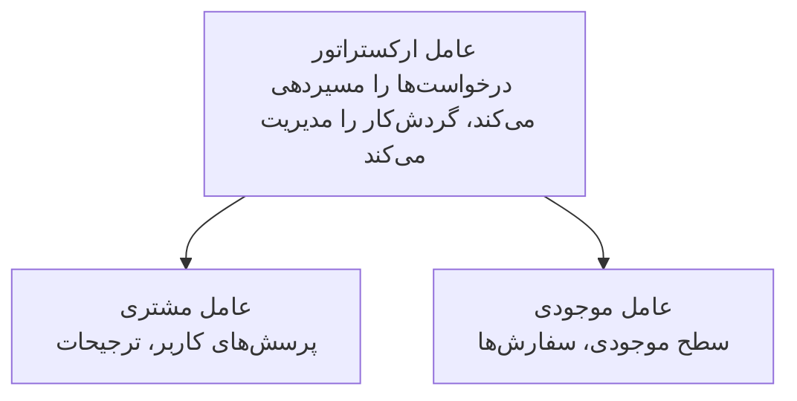

# فصل 5: راهکارهای هوش مصنوعی چندعاملی

**📚 دوره**: [AZD برای مبتدیان](../../README.md) | **⏱️ مدت زمان**: 2-3 ساعت | **⭐ پیچیدگی**: پیشرفته

---

## مرور کلی

این فصل الگوهای پیشرفته معماری چندعاملی، ارکستراسیون عامل‌ها و استقرارهای آماده تولید برای سناریوهای پیچیده را پوشش می‌دهد.

## اهداف یادگیری

با تکمیل این فصل، شما قادر خواهید بود:
- درک الگوهای معماری چندعاملی
- استقرار سیستم‌های عامل هماهنگ‌شده هوش مصنوعی
- پیاده‌سازی ارتباط عامل به عامل
- ساخت راهکارهای چندعاملی آماده تولید

---

## 📚 درس‌ها

| # | درس | توضیحات | زمان |
|---|--------|-------------|------|
| 1 | [راهکار چندعاملی خرده‌فروشی](../../examples/retail-scenario.md) | راهنمای پیاده‌سازی کامل | 90 دقیقه |
| 2 | [الگوهای هماهنگی](../chapter-06-pre-deployment/coordination-patterns.md) | استراتژی‌های ارکستراسیون عامل | 30 دقیقه |
| 3 | [استقرار قالب ARM](../../examples/retail-multiagent-arm-template/README.md) | استقرار با یک کلیک | 30 دقیقه |

---

## 🚀 شروع سریع

```bash
# گزینه 1: استقرار از قالب
azd init --template agent-openai-python-prompty
azd up

# گزینه 2: استقرار از مانیفست عامل (نیازمند افزونه azure.ai.agents)
azd extension install azure.ai.agents
azd ai agent init -m agent-manifest.yaml
azd up
```

> **کدام روش؟** از `azd init --template` استفاده کنید تا از یک نمونه کاری شروع کنید. از `azd ai agent init` زمانی استفاده کنید که مانفیست عامل خود را دارید. برای جزئیات کامل به [مرجع AZD AI CLI](../chapter-08-production/production-ai-practices.md#azd-ai-cli-commands-and-extensions) مراجعه کنید.

---

## 🤖 معماری چندعاملی


---

## 🎯 راهکار برجسته: سیستم چندعاملی خرده‌فروشی

راهکار [راهکار چندعاملی خرده‌فروشی](../../examples/retail-scenario.md) نشان می‌دهد:

- **عامل مشتری**: تعاملات کاربر و ترجیحات را مدیریت می‌کند
- **عامل موجودی**: موجودی و پردازش سفارش‌ها را مدیریت می‌کند
- **هماهنگ‌کننده**: هماهنگی بین عامل‌ها را انجام می‌دهد
- **حافظه مشترک**: مدیریت زمینه بین عامل‌ها

### سرویس‌های استفاده‌شده

| سرویس | هدف |
|---------|---------|
| Microsoft Foundry Models | درک زبان |
| Azure AI Search | فهرست محصولات |
| Cosmos DB | حالت و حافظه عامل |
| Container Apps | میزبانی عامل‌ها |
| Application Insights | نظارت |

---

## 🔗 ناوبری

| جهت | فصل |
|-----------|---------|
| **قبلی** | [فصل 4: زیرساخت](../chapter-04-infrastructure/README.md) |
| **بعدی** | [فصل 6: پیش از استقرار](../chapter-06-pre-deployment/README.md) |

---

## 📖 منابع مرتبط

- [راهنمای عامل‌های هوش مصنوعی](../chapter-02-ai-development/agents.md)
- [شیوه‌های تولیدی هوش مصنوعی](../chapter-08-production/production-ai-practices.md)
- [عیب‌یابی هوش مصنوعی](../chapter-07-troubleshooting/ai-troubleshooting.md)

---

<!-- CO-OP TRANSLATOR DISCLAIMER START -->
**Disclaimer**:
این سند با استفاده از سرویس ترجمهٔ هوش مصنوعی [Co-op Translator](https://github.com/Azure/co-op-translator) ترجمه شده است. در حالی که ما برای دقت تلاش می‌کنیم، لطفاً توجه داشته باشید که ترجمه‌های خودکار ممکن است حاوی خطاها یا نادرستی‌ها باشند. سند اصلی به زبان مبدأ باید به‌عنوان منبع معتبر در نظر گرفته شود. برای اطلاعات حیاتی، استفاده از ترجمهٔ حرفه‌ای انسانی توصیه می‌شود. ما در قبال هرگونه سوءتفاهم یا تفسیر نادرست ناشی از استفاده از این ترجمه مسئولیتی نداریم.
<!-- CO-OP TRANSLATOR DISCLAIMER END -->