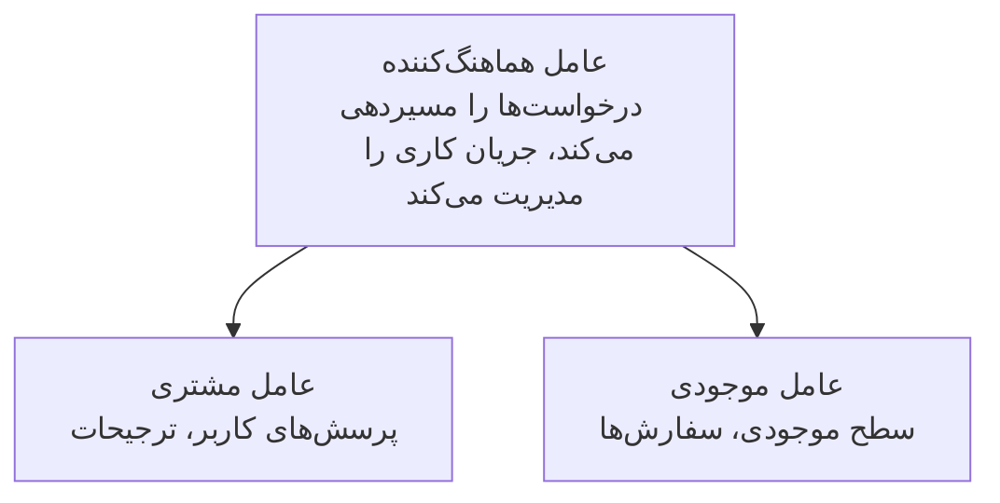

# فصل 5: راه‌حل‌های هوش مصنوعی چندعاملی

**📚 دوره**: [AZD For Beginners](../../README.md) | **⏱️ مدت**: 2-3 hours | **⭐ پیچیدگی**: پیشرفته

---

## مرور کلی

این فصل الگوهای پیشرفته معماری چندعاملی، ارکستراسیون عامل‌ها و استقرارهای آماده تولید برای سناریوهای پیچیده را پوشش می‌دهد.

> اعتبارسنجی شده با `azd 1.25.6` در June 2026.

## اهداف یادگیری

با اتمام این فصل، شما:
- درک الگوهای معماری چندعاملی را خواهید داشت
- سیستم‌های هماهنگ‌شده عامل‌های هوشمند را مستقر خواهید کرد
- ارتباط عامل‌به‌عامل را پیاده‌سازی خواهید کرد
- راه‌حل‌های چندعاملی آماده تولید را بسازید

---

## 📚 دروس

| # | Lesson | Description | Time |
|---|--------|-------------|------|
| 1 | [Multi-Agent Basics](multi-agent-basics.md) | عملی: استقرار یک برنامه چندعاملی کاری با `azd up` | 45 دقیقه |
| 2 | [Coordination Patterns](../chapter-06-pre-deployment/coordination-patterns.md) | استراتژی‌های ارکستراسیون عامل (ادامه در فصل ۶) | 30 دقیقه |
| 3 | [ARM Template Deployment](../../examples/retail-multiagent-arm-template/README.md) | مثال استقرار با یک کلیک | 30 دقیقه |

> **با درس ۱ شروع کنید.** این تنها درسی است که به‌طور کامل عملی و قابل استقرار در این فصل است. درس ۲ در فصل ۶ قرار دارد (با برنامه‌ریزی پیش‌استقرار مشترک است)، و [راه‌حل چندعامل خرده‌فروشی](../../examples/retail-scenario.md) یک الگوی معماری است — یک مرجع طراحی، نه یک قالب تک‌فرمانی.

---

## 🚀 شروع سریع

```bash
# گزینه ۱: استقرار از یک قالب
azd init --template agent-openai-python-prompty
azd up

# گزینه ۲: استقرار از مانیفست عامل (به افزونه azure.ai.agents نیاز دارد)
azd extension install azure.ai.agents
azd ai agent init -m agent-manifest.yaml
azd up
```

> **کدام رویکرد؟** از `azd init --template` برای شروع از یک نمونه کاری استفاده کنید. وقتی خودتان مانیفست عامل دارید از `azd ai agent init` استفاده کنید. برای جزئیات کامل به [AZD AI CLI reference](../chapter-08-production/production-ai-practices.md#azd-ai-cli-commands-and-extensions) مراجعه کنید.

---

## 🤖 معماری چندعاملی



---

## 🎯 راه‌حل برجسته: خرده‌فروشی چندعاملی

[راه‌حل چندعامل خرده‌فروشی](../../examples/retail-scenario.md) نشان می‌دهد:

- **عامل مشتری**: تعاملات کاربر و ترجیحات را مدیریت می‌کند
- **عامل موجودی**: موجودی و پردازش سفارشات را مدیریت می‌کند
- **هماهنگ‌کننده**: بین عامل‌ها هماهنگی ایجاد می‌کند
- **حافظه اشتراکی**: مدیریت زمینه بین عامل‌ها

### سرویس‌های استفاده‌شده

| سرویس | هدف |
|---------|---------|
| Microsoft Foundry Models | درک زبان |
| Azure AI Search | فهرست محصولات |
| Cosmos DB | وضعیت و حافظه عامل |
| Container Apps | میزبانی عامل |
| Application Insights | نظارت |

---

## 🔗 ناوبری

| جهت | فصل |
|-----------|---------|
| **قبلی** | [فصل 4: زیرساخت](../chapter-04-infrastructure/README.md) |
| **بعدی** | [فصل 6: پیش‌استقرار](../chapter-06-pre-deployment/README.md) |

---

## 📖 منابع مرتبط

- [AI Agents Guide](../chapter-02-ai-development/agents.md)
- [Production AI Practices](../chapter-08-production/production-ai-practices.md)
- [AI Troubleshooting](../chapter-07-troubleshooting/ai-troubleshooting.md)

---

<!-- CO-OP TRANSLATOR DISCLAIMER START -->
**سلب مسئولیت**:
این سند با استفاده از سرویس ترجمه هوش مصنوعی [Co-op Translator](https://github.com/Azure/co-op-translator) ترجمه شده است. در حالی که ما در تلاش برای دقت هستیم، لطفاً توجه داشته باشید که ترجمه‌های خودکار ممکن است شامل خطاها یا نادرستی‌هایی باشند. سند اصلی به زبان مادری خود باید به عنوان منبع معتبر در نظر گرفته شود. برای اطلاعات حیاتی، ترجمه حرفه‌ای انسانی توصیه می‌شود. ما در قبال هرگونه سوء تفاهم یا برداشت نادرست ناشی از استفاده از این ترجمه مسئولیتی نداریم.
<!-- CO-OP TRANSLATOR DISCLAIMER END -->