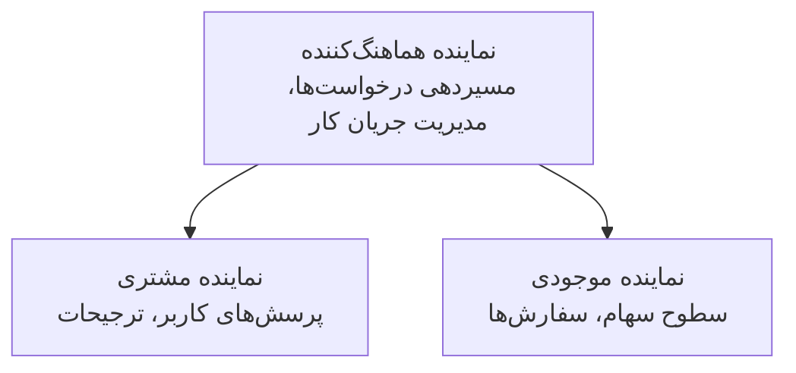

# فصل ۵: راه‌حل‌های هوش مصنوعی چندعاملۀ

**📚 دوره**: [مقدمات AZD](../../README.md) | **⏱️ مدت زمان**: ۲-۳ ساعت | **⭐ سطح دشواری**: پیشرفته

---

## نمای کلی

این فصل الگوهای پیشرفته معماری چندعاملۀ، هماهنگی عوامل، و استقرارهای آماده تولید هوش مصنوعی برای سناریوهای پیچیده را پوشش می‌دهد.

> اعتبارسنجی شده با `azd 1.27.1` در ژوئیه ۲۰۲۶.

## اهداف یادگیری

با اتمام این فصل، شما خواهید توانست:
- الگوهای معماری چندعاملۀ را درک کنید
- سیستم‌های هماهنگ‌شده عوامل هوش مصنوعی را مستقر کنید
- ارتباط بین عوامل را پیاده‌سازی کنید
- راه‌حل‌های چندعاملۀ آماده تولید بسازید

---

## 📚 درس‌ها

| # | درس | توضیحات | زمان |
|---|--------|-------------|------|
| ۱ | [مبانی چندعاملۀ](multi-agent-basics.md) | عملی: استقرار یک اپ چندعاملۀ کاری با `azd up` | ۴۵ دقیقه |
| ۲ | [الگوهای هماهنگی](../chapter-06-pre-deployment/coordination-patterns.md) | راهبردهای هماهنگی عوامل (ادامه در فصل ۶) | ۳۰ دقیقه |
| ۳ | [استقرار قالب ARM](../../examples/retail-multiagent-arm-template/README.md) | نمونه استقرار با یک کلیک | ۳۰ دقیقه |

> **با درس ۱ شروع کنید.** این تنها درس کاملاً عملی و قابل استقرار در این فصل است. درس ۲ در فصل ۶ قرار دارد (که با برنامه‌ریزی پیش‌استقرار مشترک است)، و [راه‌حل چندعاملۀ خرده‌فروشی](../../examples/retail-scenario.md) یک نقشه معماری — یک مرجع طراحی است، نه قالب اجرا با یک فرمان.

---

## 🚀 شروع سریع

```bash
# گزینه ۱: استقرار از قالب
azd init --template agent-openai-python-prompty
azd up

# گزینه ۲: استقرار از مانفیست عامل (نیاز به افزونه azure.ai.agents دارد)
azd extension install azure.ai.agents
azd ai agent init -m agent-manifest.yaml
azd up
```

> **کدام رویکرد؟** برای شروع از نمونه عملی، از `azd init --template` استفاده کنید. وقتی فایل مانیفست عامل خود را دارید، از `azd ai agent init` استفاده کنید. برای جزئیات کامل به [مراجع AZD AI CLI](../chapter-08-production/production-ai-practices.md#azd-ai-cli-commands-and-extensions) مراجعه کنید.

---

## 🤖 معماری چندعاملۀ



---

## 🎯 راه‌حل ویژه: چندعاملۀ خرده‌فروشی

[راه‌حل چندعاملۀ خرده‌فروشی](../../examples/retail-scenario.md) نشان می‌دهد:

- **عامل مشتری**: مدیریت تعاملات و ترجیحات کاربر
- **عامل موجودی**: مدیریت انبار و پردازش سفارشات
- **هماهنگ‌کننده**: هماهنگی بین عوامل
- **حافظۀ مشترک**: مدیریت متن بین عوامل

### سرویس‌های استفاده شده

| سرویس | کاربرد |
|---------|---------|
| Microsoft Foundry Models | درک زبان |
| Azure AI Search | فهرست محصولات |
| Cosmos DB | وضعیت و حافظۀ عامل |
| Container Apps | میزبانی عوامل |
| Application Insights | مانیتورینگ |

---

## 🔗 ناوبری

| جهت | فصل |
|-----------|---------|
| **قبلی** | [فصل ۴: زیرساخت](../chapter-04-infrastructure/README.md) |
| **بعدی** | [فصل ۶: پیش‌استقرار](../chapter-06-pre-deployment/README.md) |

---

## 📖 منابع مرتبط

- [راهنمای عوامل هوش مصنوعی](../chapter-02-ai-development/agents.md)
- [روش‌های تولید هوش مصنوعی](../chapter-08-production/production-ai-practices.md)
- [عیب‌یابی هوش مصنوعی](../chapter-07-troubleshooting/ai-troubleshooting.md)

---

<!-- CO-OP TRANSLATOR DISCLAIMER START -->
**سلب مسئولیت**:
این سند با استفاده از سرویس ترجمه هوش مصنوعی [Co-op Translator](https://github.com/Azure/co-op-translator) ترجمه شده است. در حالی که ما در تلاش برای دقت هستیم، لطفاً توجه داشته باشید که ترجمه‌های خودکار ممکن است شامل خطاها یا نادرستی‌هایی باشند. سند اصلی به زبان مادری خود باید به عنوان منبع معتبر در نظر گرفته شود. برای اطلاعات حیاتی، ترجمه حرفه‌ای انسانی توصیه می‌شود. ما در قبال هرگونه سوء تفاهم یا برداشت نادرست ناشی از استفاده از این ترجمه مسئولیتی نداریم.
<!-- CO-OP TRANSLATOR DISCLAIMER END -->