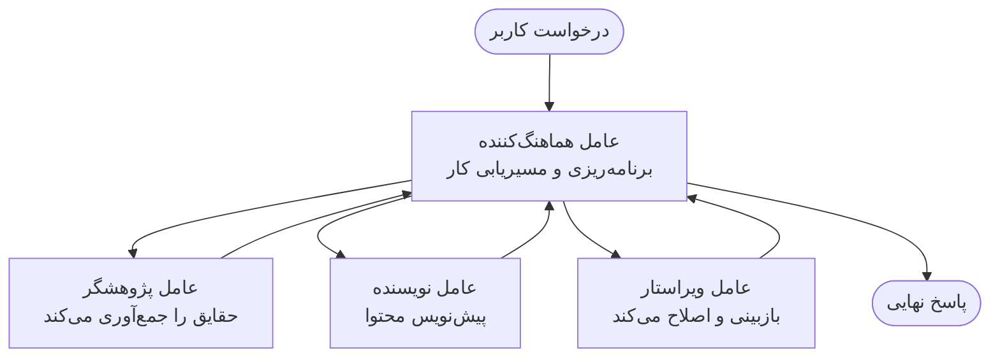

# مبانی چندعاملـی - استقرار اولین سامانه هماهنگ‌شده هوش مصنوعی شما

**ناوبری فصل:**
- **📚 صفحه دوره**: [AZD For Beginners](../../README.md)
- **📖 فصل جاری**: فصل ۵ - راهکارهای هوش مصنوعی چندعاملـی
- **⬅️ قبلی**: [Chapter 4: Infrastructure](../chapter-04-infrastructure/README.md)
- **➡️ بعدی**: [Coordination Patterns](../chapter-06-pre-deployment/coordination-patterns.md)

> تایید شده با `azd 1.25.6` در ژوئن 2026.

## مقدمه

در فصل‌های قبلی یک برنامهٔ تکی را مستقر کردید — و در فصل ۲ یک عامل هوش مصنوعی تکی را مستقر نمودید. این درس گام بعدی را برمی‌دارد: استقرار یک **سامانه چندعاملـی**، جایی که چندین عامل تخصصی با هم کار می‌کنند تا مسئله‌ای را حل کنند که یک عامل تنها نمی‌تواند به‌خوبی از عهدهٔ آن برآید.

خبر خوب برای مبتدیان: **نیازی به فرمان‌های جدید نیست.** یک راهکار چندعاملـی همچنان یک پروژهٔ azd است. شما `azd init`، `azd up`، تست و سپس `azd down` خواهید کرد — دقیقاً همان گردش‌کار که قبلاً می‌شناسید. آنچه تغییر می‌کند شکل برنامه درون پروژه است.

## اهداف یادگیری

تا پایان این درس، شما خواهید توانست:
- بفهمید «چندعاملـی» یعنی چه و کی ارزش پیچیدگی اضافی را دارد
- نقش‌های رایج در یک سامانه چندعاملـی را بشناسید (هماهنگ‌کننده + متخصصان)
- یک قالب چندعاملـی واقعی و کارا را با `azd up` مستقر کنید
- منابع Azure که پشتیبان یک اپ چندعاملـی هستند را درک کنید
- بدانید چطور راهکار را به‌صورت ایمن بررسی، سفارشی و حذف کنید

## نتایج یادگیری

پس از اتمام این درس، قادر خواهید بود:
- تفاوت بین یک عامل تکی و یک سامانهٔ چندعاملـی را توضیح دهید
- بین یک عامل تکی با ابزارها و طراحی چندعاملـی واقعی انتخاب کنید
- یک قالب چندعاملـی را از ابتدا تا انتها با azd مستقر و آزمایش کنید
- مشخص کنید هر عامل کجا اجرا می‌شود و چگونه با هم ارتباط دارند
- همهٔ منابع را پاک کنید تا از ایجاد هزینهٔ مداوم جلوگیری شود

---

## سامانه چندعاملـی چیست؟

یک عامل هوش مصنوعی تکی یک مدل است با مجموعه‌ای دستورالعمل‌ها و (اختیاری) برخی ابزارها. این برای وظایف متمرکز خوب عمل می‌کند. اما وقتی یک وظیفه رشد می‌کند — تحقیق، سپس نوشتن، سپس ویرایش، سپس بررسی حقایق — قرار دادن همهٔ چیزها در یک پرامپت باعث می‌شود عامل کندتر، کم‌اعتمادتر و سخت‌تر برای اشکال‌زدایی شود.

یک **سامانه چندعاملـی** کار را به متخصصانی تقسیم می‌کند که هر کدام یک کار را خوب انجام می‌دهند، و یک هماهنگ‌کننده آن‌ها را مدیریت می‌کند:



### دو نقش که همیشه خواهید دید

| Role | Job | Example |
|------|-----|---------|
| **Orchestrator** | تصمیم می‌گیرد *چه اتفاقی بعدی می‌افتد* و کار را بین عوامل مسیردهی می‌کند | "اول تحقیق، سپس نوشتن، سپس ویرایش" |
| **Specialist** | یک کار متمرکز را انجام می‌دهد و نتیجه‌ای برمی‌گرداند | یک «محقق» که تنها حقایق را جمع‌آوری می‌کند |

### واقعاً به چند عامل نیاز دارید؟

از ساده شروع کنید. سراغ چندعاملـی **فقط** زمانی بروید که یکی از این موارد برقرار باشد:

- ✅ وظیفه دارای **مراحل متمایز** است که از دستورالعمل‌های متفاوت سود می‌برند (تحقیق در مقابل نوشتن در مقابل بررسی)
- ✅ می‌خواهید متخصصان به‌صورت **موازی** اجرا شوند تا در زمان صرفه‌جویی شود
- ✅ گام‌های مختلف به **ابزارها یا منابع دادهٔ متفاوت** نیاز دارند
- ✅ نیاز دارید هر مرحله به‌طور **مستقل قابل تست و اشکال‌زدایی** باشد

اگر وظیفهٔ شما یک پرسش و پاسخ ساده یا یک فراخوان ابزار ساده است، یک **عامل تکی با ابزارها** (فصل ۲) ساده‌تر، ارزان‌تر و آسان‌تر برای اداره است.

> **نکته برای مبتدیان:** «بیشتر بودن عوامل» به معنی «بهتر بودن» نیست. هر عامل تاخیر، هزینه و یک مورد جدید برای نظارت اضافه می‌کند. فقط وقتی مشکل به‌وضوح به بخش‌هایی تقسیم می‌شود، عوامل بیشتری اضافه کنید.

---

## دو روش برای ساخت چندعاملـی در Azure

| Approach | What it is | Best for |
|----------|-----------|----------|
| **Single agent + tools** | یک عامل Foundry که توابع/ابزارها را فراخوانی می‌کند | گردش‌کارهای ساده، شروع سریع |
| **Multiple coordinated agents** | چندین عامل با یک هماهنگ‌کننده | مراحل متمایز، کار موازی، تخصصی‌سازی |

این درس روی روش دوم با استفاده از یک **قالب آماده** تمرکز دارد، تا بتوانید یک سامانه چندعاملـی واقعی در کار را ببینید قبل از اینکه خودتان بسازید.

---

## عملی: استقرار یک اپ چندعاملـی کارا

ما **Contoso Creative Writer** را مستقر خواهیم کرد، یک نمونهٔ رسمی Azure که از چند عامل (محقق، نویسنده، ویراستار) استفاده می‌کند و برای تولید یک مقاله هماهنگ می‌شوند. این یک اپ چندعاملـی عالی برای شروع است چون نقش‌ها آسان برای درک‌اند.

### گام ۱: مقداردهی اولیهٔ قالب

```bash
# یک پوشه کاری ایجاد کنید
mkdir creative-writer && cd creative-writer

# از قالب رسمی چندعامله مقداردهی اولیه کنید
azd init --template contoso-creative-writer
```

> هر زمان می‌توانید قالب‌های چندعاملـی بیشتر را در [Awesome AZD AI gallery](https://azure.github.io/awesome-azd/?tags=ai) مرور کنید. گزینه‌های مناسب برای مبتدیان شامل `get-started-with-ai-agents` و `azure-ai-travel-agents` هستند.

### گام ۲: احراز هویت

```bash
# الزامی برای گردش‌کارهای azd
azd auth login
```

### گام ۳: ایجاد یک محیط

```bash
azd env new dev
```

### گام ۴: پیش‌نمایش، سپس استقرار

```bash
# قبل از صرف هر هزینه‌ای ببینید چه چیزی ایجاد خواهد شد (توصیه می‌شود)
azd provision --preview

# زیرساخت را فراهم کرده و همه عامل‌ها را در یک مرحله مستقر کنید
azd up
```

`azd up` برای انتخاب اشتراک و منطقه از شما سوال می‌پرسد، سپس منابع Azure را تهیه کرده و برنامه را مستقر می‌کند. استقرارهای مرتبط با هوش مصنوعی می‌تواند طولانی‌تر از یک برنامهٔ وب ساده باشد — اگر در حال مستقر کردن مدل‌های بزرگ‌تر هستید، می‌توانید زمان تایم‌اوت استقرار را افزایش دهید:

```bash
azd deploy --timeout 1800
```

> **هشدار دربارهٔ هزینه و ظرفیت:** برنامه‌های چندعاملـی مدل‌های هوش مصنوعی را مستقر می‌کنند که از سهمیه مصرف می‌کنند و هزینه در پی دارند. اگر `azd up` به‌خاطر سهمیهٔ مدل شکست خورد، برای رفع منطقه و سهمیه به [AI Troubleshooting](../chapter-07-troubleshooting/ai-troubleshooting.md) مراجعه کنید و به فصل ۶ [Capacity Planning](../chapter-06-pre-deployment/capacity-planning.md) رجوع نمایید.

---

## درک آنچه مستقر کرده‌اید

یک اپ چندعاملـی معمولی مثل این مجموعه‌ای از منابع Azure را تهیه می‌کند که مستقیماً با مسئولیت‌ها در نمودار بالا مطابقت دارند:

| Resource | Why it's there |
|----------|----------------|
| **Microsoft Foundry / Models** | میزبان مدل‌های زبانی است که هر عامل از آنها استفاده می‌کند |
| **Azure AI Search** | به عامل محقق دادهٔ زمینه‌ای برای جستجو می‌دهد |
| **Container Apps** (or App Service) | میزبان هماهنگ‌کننده و کد عوامل است |
| **Cosmos DB** (in some samples) | حالت/حافظهٔ مشترکی را که بین عوامل منتقل می‌شود ذخیره می‌کند |
| **Application Insights** | ردیابی درخواست‌ها *در میان* عوامل را انجام می‌دهد تا بتوانید جریان را اشکال‌زدایی کنید |

### چگونه عوامل با هم صحبت می‌کنند

در اکثر نمونه‌های چندعاملـی azd، **هماهنگ‌کننده در کد برنامهٔ شما اجرا می‌شود** (برای مثال با استفاده از فریمورکی مانند Semantic Kernel یا Microsoft Agent Framework). هماهنگ‌کننده هر عامل متخصص را به نوبت فراخوانی می‌کند، نتایج را منتقل می‌کند و پاسخ نهایی را می‌سازد. عوامل زمینهٔ مشترک را از طریق موارد زیر به اشتراک می‌گذارند:

- **فراخوانی‌های تابع/ابزار** — هماهنگ‌کننده یک متخصص را فراخوانی می‌کند و نتیجه‌ای دریافت می‌کند
- **حافظهٔ مشترک** — یک پایگاه‌داده (اغلب Cosmos DB) حالت را نگه می‌دارد که هر دو عامل می‌توانند بخوانند
- **پیام‌ها/رویدادها** — برایcoupling looser، عوامل از طریق صف یا Service Bus ارتباط برقرار می‌کنند

> **چرا این برای اشکال‌زدایی مهم است:** چون هر مرحله جداست، Application Insights نشان می‌دهد کدام عامل کند یا دچار خطا شده است. این یکی از دلایل اصلی تقسیم کار بین عوامل است.

---

## تأیید استقرار

قبل از ادامه مطمئن شوید سیستم واقعاً کار می‌کند:

```bash
# نمایش نقاط پایانی مستقر شده
azd show

# باز کردن داشبورد مانیتورینگ برنامه
azd monitor

# اگر چیزی غیرطبیعی به نظر می‌رسد، لاگ‌ها را دنبال کنید
azd monitor --logs
```

سپس URL برنامه را که از `azd show` می‌گیرید باز کنید و یک درخواست بفرستید که همهٔ عوامل را فعال کند (برای Creative Writer، از آن بخواهید یک مقالهٔ کوتاه در مورد یک موضوع بنویسد). در **transaction search** در Application Insights، باید ببینید درخواست در میان مراحل محقق، نویسنده و ویراستار پخش شده است.

**معیارهای موفقیت:**
- ✅ `azd show` یک نقطهٔ دسترسی قابل رسیدن فهرست می‌کند
- ✅ یک درخواست نتیجه‌ای تولید می‌کند که واضحاً از چندین مرحله گذشته است
- ✅ Application Insights ردیابی‌هایی برای بیش از یک مرحلهٔ عامل نشان می‌دهد

---

## سفارشی‌سازی: افزودن یا تنظیم یک عامل

از آنجا که هر عامل تنها دستورالعمل‌ها به‌علاوه ابزارها است، سفارشی‌سازی در دسترس است:

1. **تعاریف عامل را پیدا کنید** در قالب (اغلب یک مجموعه فایل `prompts/`، `agents/`، یا `*.prompty`).
2. **دستورالعمل‌های یک عامل را تنظیم کنید** — برای مثال، به عامل ویراستار بگویید یک لحن یا شمارۀ کلمهٔ مشخص را اعمال کند.
3. **تنها کد را مجدداً مستقر کنید** (زیرساخت بدون تغییر باقی می‌ماند):

   ```bash
   azd deploy
   ```

برای پیش رفتن بیشتر و ساخت عوامل از مانیفست *خودتان*، از افزونهٔ عامل و چرخهٔ عمر کامل آن استفاده کنید:

```bash
azd extension install azure.ai.agents
azd ai agent init -m agent-manifest.yaml
azd up
azd ai agent invoke      # تست، با اندازه‌گیری زمان پاسخ
```

فصل [Chapter 2: Agents](../chapter-02-ai-development/agents.md) و مرجع [AZD AI CLI](../chapter-08-production/production-ai-practices.md#azd-ai-cli-commands-and-extensions) را برای چرخهٔ کامل عامل (`invoke`, `eval generate`, `optimize`, `delete`) ببینید.

---

## پاک‌سازی

برنامه‌های چندعاملـی چند سرویس قابل صورتحساب اجرا می‌کنند. وقتی کارتان تمام شد همه چیز را حذف کنید:

```bash
azd down --force --purge
```

فلگ `--purge` همچنین منابع AI حذف‌شدهٔ نرم (soft-deleted) را حذف می‌کند (مثل Foundry/Azure AI Services accounts) تا مانع یک استقرار مجدد در آینده نشوند یا هزینه‌ ایجاد نکنند.

---

## نکته‌ای دربارهٔ سامانه‌های چندعاملـی در محیط تولید

[Retail Multi-Agent Solution](../../examples/retail-scenario.md) در این مخزن یک **نقشهٔ معماری** است، نه یک قالب یک-فرمانی — این سند توضیح می‌دهد یک سامانهٔ خرده‌فروشی تولیدی چگونه *می‌تواند* ساخته شود (و صراحت دارد که ساخت کامل یک تلاش قابل‌توجه است). از آن به‌عنوان مرجع طراحی *پس از* اینکه یک نمونهٔ کاری را اینجا مستقر کردید استفاده کنید. برای نگرانی‌های تولیدی (پایداری، هزینه، نظارت، حاکمیت)، به فصل [Chapter 8: Production AI Practices](../chapter-08-production/production-ai-practices.md) مراجعه کنید.

---

## خلاصه

- یک سامانهٔ چندعاملـی کار را بین متخصصان تقسیم می‌کند که توسط یک هماهنگ‌کننده مدیریت می‌شوند.
- تنها وقتی از آن استفاده کنید که وظیفه دارای مراحل متمایز، موازی‌سازی یا ابزارهای متفاوت در هر مرحله باشد — در غیر این صورت یک عامل تکی را ترجیح دهید.
- گردش‌کار azd بدون تغییر است: `azd init` → `azd up` → تست → `azd down`.
- یک قالب واقعی مانند `contoso-creative-writer` به شما امکان می‌دهد امروز یک اپ چندعاملـی کاری را ببینید و سفارشی کنید.
- ردیابی Application Insights در میان عوامل یکی از بزرگ‌ترین مزایای عملی طراحی چندعاملـی است.

---

## 🔗 ناوبری

| Direction | Lesson |
|-----------|--------|
| **قبلی** | [Chapter 4: Infrastructure](../chapter-04-infrastructure/README.md) |
| **بعدی** | [Coordination Patterns](../chapter-06-pre-deployment/coordination-patterns.md) |

## 📖 منابع مرتبط

- [AI Agents Guide](../chapter-02-ai-development/agents.md)
- [Coordination Patterns](../chapter-06-pre-deployment/coordination-patterns.md)
- [Production AI Practices](../chapter-08-production/production-ai-practices.md)
- [AI Troubleshooting](../chapter-07-troubleshooting/ai-troubleshooting.md)

---

<!-- CO-OP TRANSLATOR DISCLAIMER START -->
**سلب مسئولیت**:
این سند با استفاده از سرویس ترجمه هوش مصنوعی [Co-op Translator](https://github.com/Azure/co-op-translator) ترجمه شده است. در حالی که ما در تلاش برای دقت هستیم، لطفاً توجه داشته باشید که ترجمه‌های خودکار ممکن است شامل خطاها یا نادرستی‌هایی باشند. سند اصلی به زبان مادری خود باید به عنوان منبع معتبر در نظر گرفته شود. برای اطلاعات حیاتی، ترجمه حرفه‌ای انسانی توصیه می‌شود. ما در قبال هرگونه سوء تفاهم یا برداشت نادرست ناشی از استفاده از این ترجمه مسئولیتی نداریم.
<!-- CO-OP TRANSLATOR DISCLAIMER END -->