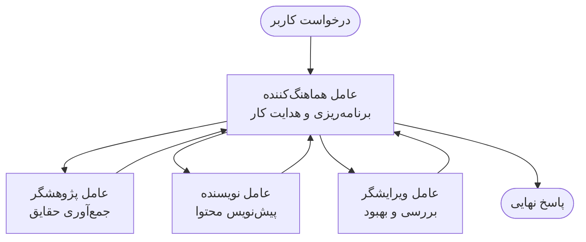

# مبانی چندعاملی — استقرار اولین سیستم هماهنگ هوش مصنوعی خود

**ناوبری فصل:**
- **📚 صفحه دوره**: [AZD برای مبتدیان](../../README.md)
- **📖 فصل جاری**: فصل ۵ - راهکارهای هوش مصنوعی چندعاملی
- **⬅️ قبلی**: [فصل ۴: زیرساخت](../chapter-04-infrastructure/README.md)
- **➡️ بعدی**: [الگوهای هماهنگی](../chapter-06-pre-deployment/coordination-patterns.md)

> اعتبارسنجی شده با `azd 1.27.1` در ژوئیه ۲۰۲۶.

## مقدمه

در فصل‌های قبلی شما یک برنامه واحد را مستقر کردید — و در فصل ۲ یک عامل هوش مصنوعی واحد را مستقر کردید. این درس گام بعدی را برمی‌دارد: استقرار یک **سیستم چندعاملی**، جایی که چندین عامل متخصص با هم کار می‌کنند تا مشکلی را حل کنند که هیچ عامل تکی به تنهایی نمی‌توانست به خوبی انجام بدهد.

خبر خوب برای مبتدیان: **شما نیاز به دستورات جدید ندارید.** یک راهکار چندعاملی هنوز یک پروژه azd است. شما `azd init`، `azd up`، تست، و `azd down` انجام می‌دهید—دقیقاً همان روند کاری که قبلاً می‌شناسید. آنچه تغییر می‌کند *شکل* برنامه در داخل است.

## اهداف یادگیری

در پایان این درس، شما:
- درک می‌کنید «چندعاملی» به چه معناست و کی ارزش پیچیدگی اضافه را دارد
- نقش‌های رایج در یک سیستم چندعاملی (هماهنگ‌کننده + متخصص‌ها) را می‌شناسید
- یک قالب چندعاملی واقعی و عملی را با `azd up` مستقر می‌کنید
- منابع Azure پشتیبان یک برنامه چندعاملی را درک می‌کنید
- می‌دانید چگونه راهکار را به شکل ایمن تأیید، سفارشی و حذف کنید

## نتایج یادگیری

پس از تکمیل این درس، شما قادر خواهید بود:
- تفاوت بین یک عامل تکی و یک سیستم چندعاملی را توضیح دهید
- بین یک عامل تکی با ابزارها و یک طراحی چندعاملی واقعی یکی را انتخاب کنید
- یک قالب چندعاملی را از اول تا آخر با azd مستقر و تست کنید
- تشخیص دهید هر عامل کجا اجرا می‌شود و چگونه ارتباط برقرار می‌کنند
- تمام منابع را پاک کنید تا از هزینه‌های مستمر جلوگیری شود

---

## سیستم چندعاملی چیست؟

یک عامل هوش مصنوعی تکی یک مدل با مجموعه‌ای از دستورالعمل‌ها و (اختیاری) چند ابزار است. این برای کارهای متمرکز خوب عمل می‌کند. اما هرچه کار بزرگتر شود — تحقیق، سپس نوشتن، سپس ویرایش، سپس بررسی صحت — قراردادن همه چیز در یک درخواست باعث کندتر شدن، کمتر قابل اطمینان شدن و دشوار تر شدن اشکال‌زدایی عامل می‌شود.

یک **سیستم چندعاملی** کار را به متخصصانی تقسیم می‌کند که هر کدام کار مشخصی را خوب انجام می‌دهند، هماهنگ شده توسط یک هماهنگ‌کننده:



### دو نقشی که همیشه می‌بینید

| نقش | وظیفه | مثال |
|------|-----|---------|
| **هماهنگ‌کننده** | تصمیم می‌گیرد *چه اتفاقی بیفتد* و کار را بین عوامل تقسیم می‌کند | "ابتدا تحقیق، سپس نوشتن، سپس ویرایش" |
| **متخصص** | یک کار متمرکز انجام می‌دهد و نتیجه می‌دهد | یک "پژوهشگر" که فقط حقایق را جمع‌آوری می‌کند |

### واقعاً به چند عامل نیاز دارید؟

ساده شروع کنید. فقط وقتی به چندعاملی نیاز دارید که یکی از موارد زیر صادق باشد:

- ✅ کار دارای **مراحل متمایز** است که از دستورالعمل‌های متفاوت سود می‌برد (تحقیق در مقابل نوشتن در مقابل بازبینی)
- ✅ می‌خواهید متخصص‌ها **هم‌زمان** اجرا شوند تا زمان صرفه‌جویی شود
- ✅ مراحل مختلف به **ابزارها یا منابع داده متفاوتی** نیاز دارند
- ✅ نیاز دارید هر مرحله به ‌صورت **مستقل قابل تست و اشکال‌زدایی** باشد

اگر کار شما یک پرسش و پاسخ تکی یا یک فراخوانی ساده ابزار است، یک **عامل تکی با ابزارها** (فصل ۲) ساده‌تر، ارزان‌تر و آسان‌تر برای اجرای آن است.

> **نکته برای مبتدیان:** «عامل‌های بیشتر» به معنی «بهتر» نیست. هر عامل بارگذاری، هزینه و یک مورد جدید برای نظارت اضافه می‌کند. عامل‌ها را فقط وقتی اضافه کنید که مشکل به وضوح به بخش‌هایی تقسیم شود.

---

## دو روش برای ساخت سیستم چندعاملی در Azure

| رویکرد | چیست | بهترین برای |
|----------|-----------|----------|
| **عامل تکی + ابزارها** | یک عامل Foundry که توابع/ابزارها را فراخوانی می‌کند | گردش‌کارهای ساده، شروع کار |
| **چند عامل هماهنگ** | چندین عامل با یک هماهنگ‌کننده | مراحل متمایز، کار موازی، تخصصی بودن |

این درس روی روش دوم با استفاده از یک **قالب آماده** تمرکز دارد، تا بتوانید یک سیستم چندعاملی واقعی را قبل از ساختن خودتان ببینید.

---

## عملی: استقرار یک برنامه چندعاملی عملی

ما برنامه رسمی Azure به نام **Contoso Creative Writer** را مستقر می‌کنیم، که از چندین عامل (پژوهشگر، نویسنده، ویراستار) به صورت هماهنگ شده برای تولید یک مقاله استفاده می‌کند. این برنامه چندعاملی اولیه عالی است چون نقش‌ها آسان برای درک هستند.

### مرحله ۱: قالب را مقداردهی اولیه کنید

```bash
# ایجاد یک پوشه کاری
mkdir creative-writer && cd creative-writer

# مقداردهی اولیه از الگوی چندعامله رسمی
azd init --template contoso-creative-writer
```

> هر زمان قالب‌های چندعاملی بیشتری را در [گالری Awesome AZD AI](https://azure.github.io/awesome-azd/?tags=ai) مرور کنید. گزینه‌های دیگر برای مبتدیان شامل `get-started-with-ai-agents` و `azure-ai-travel-agents` است.

### مرحله ۲: احراز هویت

```bash
# مورد نیاز برای جریان‌های کاری azd
azd auth login
```

### مرحله ۳: ایجاد یک محیط

```bash
azd env new dev
```

### مرحله ۴: پیش‌نمایش، سپس استقرار

```bash
# ببینید چه چیزی قبل از خرج کردن ایجاد خواهد شد (توصیه شده)
azd provision --preview

# زیرساخت را تهیه کرده و همه عامل‌ها را در یک مرحله مستقر کنید
azd up
```

`azd up` از شما اشتراک و منطقه را می‌پرسد، سپس منابع Azure را تامین می‌کند و برنامه را مستقر می‌کند. استقرارهای هوش مصنوعی ممکن است طولانی‌تر از یک برنامه وب ساده باشند — اگر مدل‌های بزرگ‌تری را مستقر می‌کنید، می‌توانید زمان تایم‌اوت استقرار را افزایش دهید:

```bash
azd deploy --timeout 1800
```

> **هشدار در مورد هزینه و ظرفیت:** برنامه‌های چندعاملی مدل‌های هوش مصنوعی را مستقر می‌کنند که سهمیه مصرف کرده و هزینه ایجاد می‌کنند. اگر `azd up` به دلیل سهمیه مدل شکست خورد، راهنمای [عیب‌یابی هوش مصنوعی](../chapter-07-troubleshooting/ai-troubleshooting.md) را برای منطقه و رفع محدودیت‌ها ببینید و فصل ۶ [برنامه‌ریزی ظرفیت](../chapter-06-pre-deployment/capacity-planning.md).

---

## درک چیزی که مستقر کردید

یک برنامه چندعاملی معمولی مانند این، مجموعه‌ای از منابع Azure را تامین می‌کند که مستقیماً با مسئولیت‌های نمودار بالا مطابقت دارند:

| منبع | دلیل وجودش |
|----------|----------------|
| **Microsoft Foundry / مدل‌ها** | مدل‌های زبانی که هر عامل استفاده می‌کند را میزبانی می‌کند |
| **Azure AI Search** | به عامل پژوهشگر داده‌های واقعی برای جستجو می‌دهد |
| **Container Apps** (یا App Service) | کد هماهنگ‌کننده و عوامل را میزبانی می‌کند |
| **Cosmos DB** (در برخی نمونه‌ها) | حالت/حافظه مشترکی که بین عوامل رد و بدل می‌شود را ذخیره می‌کند |
| **Application Insights** | ردگیری درخواست‌ها *بین* عوامل را انجام می‌دهد تا بتوانید جریان را اشکال‌زدایی کنید |

### چگونه عوامل با هم صحبت می‌کنند

در اکثر نمونه‌های چندعاملی azd، **هماهنگ‌کننده در کد برنامه شما اجرا می‌شود** (برای مثال، با استفاده از چارچوبی مثل Semantic Kernel یا Microsoft Agent Framework). هماهنگ‌کننده هر عامل متخصص را به نوبت فراخوانی می‌کند، نتایج را منتقل می‌کند و پاسخ نهایی را جمع‌آوری می‌کند. عوامل بستر را از طریق:

- **فراخوانی توابع/ابزارها** — هماهنگ‌کننده به یک متخصص فراخوانی می‌کند و نتیجه را دریافت می‌کند
- **حافظه مشترک** — یک دیتابیس (معمولاً Cosmos DB) حالت را نگه می‌دارد که هر دو عامل می‌توانند بخوانند
- **پیام‌ها/رویدادها** — برای اتصال سست‌تر، عوامل از طریق صف یا Service Bus ارتباط برقرار می‌کنند

> **چرا این برای اشکال‌زدایی مهم است:** چون هر مرحله جدا است، Application Insights نشان می‌دهد کدام عامل کند بوده یا شکست خورده است. این یکی از دلایل اصلی تقسیم کار بین عوامل است.

---

## تایید استقرار

اطمینان حاصل کنید که سیستم واقعاً کار می‌کند قبل از ادامه:

```bash
# نقاط پایانی مستقر شده را نمایش دهید
azd show

# داشبورد نظارت برنامه را باز کنید
azd monitor

# اگر چیزی اشتباه به نظر می‌رسد، لاگ‌ها را دنبال کنید
azd monitor --logs
```

سپس آدرس برنامه را که از `azd show` گرفته‌اید باز کنید و یک درخواست بفرستید که تمام عوامل را درگیر کند (برای Creative Writer، از آن بخواهید یک مقاله کوتاه در یک موضوع بنویسد). در جستجوی تراکنش Application Insights، باید ببینید درخواست در مراحل پژوهشگر، نویسنده و ویراستار پخش شده است.

**معیارهای موفقیت:**
- ✅ `azd show` یک نقطه انتهایی قابل دسترس فهرست می‌کند
- ✅ یک درخواست نتیجه‌ای تولید می‌کند که به وضوح از چندین مرحله عبور کرده است
- ✅ Application Insights ردگیری برای بیش از یک مرحله عامل را نشان می‌دهد

---

## سفارشی‌سازی: اضافه کردن یا تنظیم یک عامل

چون هر عامل فقط دستورالعمل به علاوه ابزار است، سفارشی‌سازی قابل دسترس است:

1. **تعاریف عامل را در قالب پیدا کنید** (اغلب یک مجموعه فایل `prompts/`، `agents/` یا `*.prompty`).
2. **دستورالعمل‌های یک عامل را تنظیم کنید** — مثلاً به عامل ویراستار بگویید لحن یا تعداد کلمات مشخصی را رعایت کند.
3. **فقط کد را دوباره مستقر کنید** (زیرساخت تغییر نمی‌کند):

   ```bash
   azd deploy
   ```

برای پیشروی بیشتر و ساخت عوامل از *فایل اعلامیه* خودتان، از افزونه عامل و چرخه عمر کامل آن استفاده کنید:

```bash
azd extension install azure.ai.agents
azd ai agent init -m agent-manifest.yaml
azd up
azd ai agent invoke      # آزمایش، با زمان‌بندی پاسخ
```

فصل [۲: عوامل](../chapter-02-ai-development/agents.md) و [مرجع CLI هوش مصنوعی AZD](../chapter-08-production/production-ai-practices.md#azd-ai-cli-commands-and-extensions) را برای چرخه عمر کامل عامل (`invoke`، `eval generate`، `optimize`، `delete`) ببینید.

---

## پاک‌سازی

برنامه‌های چندعاملی چندین سرویس قابل صورتحساب اجرا می‌کنند. وقتی کارتان تمام شد همه را پاک کنید:

```bash
azd down --force --purge
```

فلگ `--purge` همچنین منابع AI حذف‌نشدنی نرم را حذف می‌کند (مانند Foundry/حساب‌های Azure AI Services) تا در استقرار دوباره آینده مشکل ایجاد نکنند یا هزینه اضافه به بار نیاورند.

---

## نکته‌ای درباره سیستم‌های چندعاملی تولیدی

[راهکار چندعاملی خرده‌فروشی](../../examples/retail-scenario.md) در این مخزن یک **نقشه معماری** است، نه یک قالب یک‌دستوری — این اسناد چگونگی ساخت یک سیستم خرده‌فروشی تولیدی را نشان می‌دهد (و صراحت دارد که ساخت کامل کاری جدی است). از آن به عنوان مرجع طراحی *بعد از* استقرار یک نمونه عملی در اینجا استفاده کنید. برای نگرانی‌های تولیدی (پایداری، هزینه، نظارت، حاکمیت)، به فصل [۸: عملیات هوش مصنوعی](../chapter-08-production/production-ai-practices.md) مراجعه کنید.

---

## خلاصه

- یک سیستم چندعاملی کار را بین متخصصانی که توسط یک هماهنگ‌کننده سازماندهی شده‌اند تقسیم می‌کند.
- فقط وقتی کار دارای مراحل متمایز، موازی‌کاری یا ابزارهای متفاوت برای هر مرحله است از آن استفاده کنید — در غیر این صورت یک عامل تکی را ترجیح دهید.
- روند کاری azd بدون تغییر است: `azd init` → `azd up` → تست → `azd down`.
- یک قالب واقعی مثل `contoso-creative-writer` به شما نشان می‌دهد و اجازه می‌دهد امروز یک برنامه چندعاملی عملی را سفارشی کنید.
- ردیابی Application Insights بین عوامل یکی از بزرگ‌ترین مزایای عملی طراحی چندعاملی است.

---

## 🔗 ناوبری

| جهت | درس |
|-----------|--------|
| **قبلی** | [فصل ۴: زیرساخت](../chapter-04-infrastructure/README.md) |
| **بعدی** | [الگوهای هماهنگی](../chapter-06-pre-deployment/coordination-patterns.md) |

## 📖 منابع مرتبط

- [راهنمای عوامل هوش مصنوعی](../chapter-02-ai-development/agents.md)
- [الگوهای هماهنگی](../chapter-06-pre-deployment/coordination-patterns.md)
- [عملیات هوش مصنوعی](../chapter-08-production/production-ai-practices.md)
- [عیب‌یابی هوش مصنوعی](../chapter-07-troubleshooting/ai-troubleshooting.md)

---

<!-- CO-OP TRANSLATOR DISCLAIMER START -->
**سلب مسئولیت**:
این سند با استفاده از سرویس ترجمه هوش مصنوعی [Co-op Translator](https://github.com/Azure/co-op-translator) ترجمه شده است. در حالی که ما در تلاش برای دقت هستیم، لطفاً توجه داشته باشید که ترجمه‌های خودکار ممکن است شامل خطاها یا نادرستی‌هایی باشند. سند اصلی به زبان مادری خود باید به عنوان منبع معتبر در نظر گرفته شود. برای اطلاعات حیاتی، ترجمه حرفه‌ای انسانی توصیه می‌شود. ما در قبال هرگونه سوء تفاهم یا برداشت نادرست ناشی از استفاده از این ترجمه مسئولیتی نداریم.
<!-- CO-OP TRANSLATOR DISCLAIMER END -->