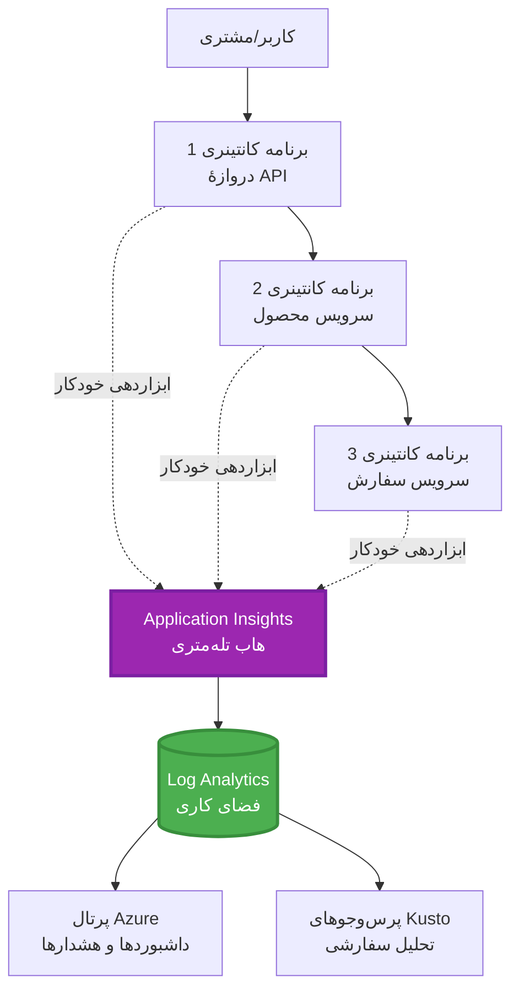
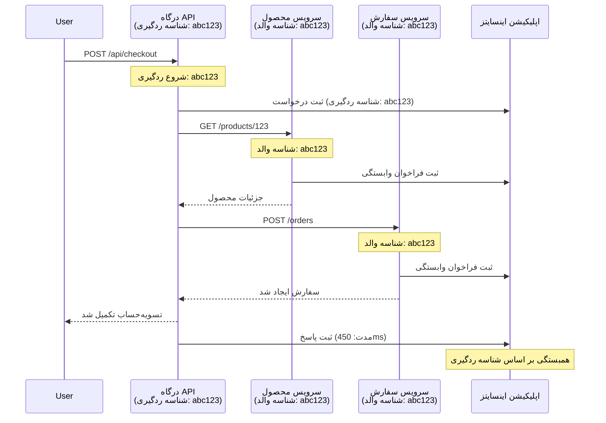

# یکپارچه‌سازی Application Insights با AZD

⏱️ **زمان تخمینی**: 40-50 دقیقه | 💰 **تأثیر هزینه**: ~$5-15/ماه | ⭐ **پیچیدگی**: متوسط

**📚 مسیر یادگیری:**
- ← قبلی: [بررسی‌های پیش‌پرواز](preflight-checks.md) - اعتبارسنجی پیش از استقرار
- 🎯 **شما اینجا هستید**: یکپارچه‌سازی Application Insights (نظارت، تِلِمتری، اشکال‌زدایی)
- → بعدی: [راهنمای استقرار](../chapter-04-infrastructure/deployment-guide.md) - استقرار به Azure
- 🏠 [خانه دوره](../../README.md)

---

## آنچه خواهید آموخت

با تکمیل این درس، شما:
- یکپارچه‌سازی خودکار **Application Insights** را در پروژه‌های AZD انجام می‌دهید
- پیکربندی **ردیابی توزیع‌شده** (distributed tracing) برای میکروسرویس‌ها را انجام می‌دهید
- پیاده‌سازی **تِلِمتری سفارشی** (متریک‌ها، رویدادها، وابستگی‌ها) را انجام می‌دهید
- راه‌اندازی **متریک‌های زنده** برای مانیتورینگ بلادرنگ
- ساخت **هشدارها و داشبوردها** از استقرارهای AZD
- اشکال‌زدایی مسائل در محیط تولید با **پرس‌و‌جوهای تِلِمتری**
- بهینه‌سازی **هزینه‌ها و استراتژی‌های نمونه‌برداری**
- مانیتور کردن **برنامه‌های AI/LLM** (توکن‌ها، تأخیر، هزینه‌ها)

## چرا Application Insights همراه با AZD اهمیت دارد

### چالش: قابل‌مشاهده بودن در محیط تولید

**بدون Application Insights:**
```
❌ No visibility into production behavior
❌ Manual log aggregation across services
❌ Reactive debugging (wait for customer complaints)
❌ No performance metrics
❌ Cannot trace requests across services
❌ Unknown failure rates and bottlenecks
```

**با Application Insights + AZD:**
```
✅ Automatic telemetry collection
✅ Centralized logs from all services
✅ Proactive issue detection
✅ End-to-end request tracing
✅ Performance metrics and insights
✅ Real-time dashboards
✅ AZD provisions everything automatically
```

**تشبیه**: Application Insights مانند داشتن یک ضبط‌کننده جعبه سیاه به‌علاوه داشبورد کابین خلبان برای برنامه شما است. شما همه چیز را به‌صورت بلادرنگ می‌بینید و می‌توانید هر حادثه‌ای را بازپخش کنید.

---

## نمای کلی معماری

### Application Insights در معماری AZD


```mermaid
graph TB
    User[کاربر/مشتری]
    App1[برنامه کانتینری 1<br/>دروازهٔ API]
    App2[برنامه کانتینری 2<br/>سرویس محصول]
    App3[برنامه کانتینری 3<br/>سرویس سفارش]
    
    AppInsights[Application Insights<br/>هاب تله‌متری]
    LogAnalytics[(Log Analytics<br/>فضای کاری)]
    
    Portal[پرتال Azure<br/>داشبوردها و هشدارها]
    Query[پرس‌وجوهای Kusto<br/>تحلیل سفارشی]
    
    User --> App1
    App1 --> App2
    App2 --> App3
    
    App1 -.->|ابزاردهی خودکار| AppInsights
    App2 -.->|ابزاردهی خودکار| AppInsights
    App3 -.->|ابزاردهی خودکار| AppInsights
    
    AppInsights --> LogAnalytics
    LogAnalytics --> Portal
    LogAnalytics --> Query
    
    style AppInsights fill:#9C27B0,stroke:#7B1FA2,stroke-width:3px,color:#fff
    style LogAnalytics fill:#4CAF50,stroke:#388E3C,stroke-width:3px,color:#fff
```
### چه چیزهایی به‌صورت خودکار مانیتور می‌شوند

| نوع تله‌متری | چه چیزی را ضبط می‌کند | مورد استفاده |
|----------------|------------------|----------|
| **Requests** | درخواست‌های HTTP، کدهای وضعیت، مدت‌زمان | نظارت عملکرد API |
| **Dependencies** | تماس‌های خارجی (پایگاه‌داده، APIها، ذخیره‌سازی) | شناسایی گلوگاه‌ها |
| **Exceptions** | خطاهای هندل‌نشده با دنبالۀ تماس (stack trace) | اشکال‌زدایی شکست‌ها |
| **Custom Events** | رویدادهای کسب‌وکار (ثبت‌نام، خرید) | تحلیل و قیف‌ها |
| **Metrics** | کانترهای عملکرد، متریک‌های سفارشی | برنامه‌ریزی ظرفیت |
| **Traces** | پیام‌های لاگ با سطح شدت | اشکال‌زدایی و حسابرسی |
| **Availability** | تست‌های آپ‌تایم و زمان پاسخ | نظارت SLA |

---

## پیش‌نیازها

### ابزارهای مورد نیاز

```bash
# تأیید Azure Developer CLI
azd version
# ✅ انتظار می‌رود: نسخه azd 1.0.0 یا بالاتر

# تأیید Azure CLI
az --version
# ✅ انتظار می‌رود: نسخه azure-cli 2.50.0 یا بالاتر
```

### نیازمندی‌های Azure

- اشتراک فعال Azure
- مجوزهای لازم برای ایجاد:
  - منابع Application Insights
  - فضای کاری Log Analytics
  - Container Apps
  - Resource groups

### پیش‌نیازهای دانش

شما باید موارد زیر را تکمیل کرده باشید:
- [مبانی AZD](../chapter-01-foundation/azd-basics.md) - مفاهیم اصلی AZD
- [پیکربندی](../chapter-03-configuration/configuration.md) - تنظیم محیط
- [اولین پروژه](../chapter-01-foundation/first-project.md) - استقرار پایه

---

## درس 1: Application Insights خودکار با AZD

### چگونه AZD Application Insights را فراهم می‌کند

AZD به‌طور خودکار Application Insights را هنگام استقرار ایجاد و پیکربندی می‌کند. بیایید ببینیم چگونه کار می‌کند.

### ساختار پروژه

```
monitored-app/
├── azure.yaml                     # AZD configuration
├── infra/
│   ├── main.bicep                # Main infrastructure
│   ├── core/
│   │   └── monitoring.bicep      # Application Insights + Log Analytics
│   └── app/
│       └── api.bicep             # Container App with monitoring
└── src/
    ├── app.py                    # Application with telemetry
    ├── requirements.txt
    └── Dockerfile
```

---

### مرحله 1: پیکربندی AZD (azure.yaml)

**فایل: `azure.yaml`**

```yaml
name: monitored-app
metadata:
  template: monitored-app@1.0.0

services:
  api:
    project: ./src
    language: python
    host: containerapp

# AZD automatically provisions monitoring!
```

**همین بود!** AZD به‌صورت پیش‌فرض Application Insights را ایجاد می‌کند. برای مانیتورینگ پایه نیازی به پیکربندی اضافی نیست.

---

### مرحله 2: زیرساخت مانیتورینگ (Bicep)

**فایل: `infra/core/monitoring.bicep`**

```bicep
param logAnalyticsName string
param applicationInsightsName string
param location string = resourceGroup().location
param tags object = {}

// Log Analytics Workspace (required for Application Insights)
resource logAnalytics 'Microsoft.OperationalInsights/workspaces@2022-10-01' = {
  name: logAnalyticsName
  location: location
  tags: tags
  properties: {
    sku: {
      name: 'PerGB2018'  // Pay-as-you-go pricing
    }
    retentionInDays: 30  // Keep logs for 30 days
    features: {
      enableLogAccessUsingOnlyResourcePermissions: true
    }
  }
}

// Application Insights
resource applicationInsights 'Microsoft.Insights/components@2020-02-02' = {
  name: applicationInsightsName
  location: location
  tags: tags
  kind: 'web'
  properties: {
    Application_Type: 'web'
    WorkspaceResourceId: logAnalytics.id
    IngestionMode: 'LogAnalytics'
    publicNetworkAccessForIngestion: 'Enabled'
    publicNetworkAccessForQuery: 'Enabled'
  }
}

// Outputs for Container Apps
output logAnalyticsWorkspaceId string = logAnalytics.id
output logAnalyticsWorkspaceName string = logAnalytics.name
output applicationInsightsConnectionString string = applicationInsights.properties.ConnectionString
output applicationInsightsInstrumentationKey string = applicationInsights.properties.InstrumentationKey
output applicationInsightsName string = applicationInsights.name
```

---

### مرحله 3: اتصال Container App به Application Insights

**فایل: `infra/app/api.bicep`**

```bicep
param name string
param location string
param tags object = {}
param containerAppsEnvironmentName string
param applicationInsightsConnectionString string

resource containerApp 'Microsoft.App/containerApps@2023-05-01' = {
  name: name
  location: location
  tags: tags
  properties: {
    configuration: {
      ingress: {
        external: true
        targetPort: 8000
      }
      secrets: [
        {
          name: 'appinsights-connection-string'
          value: applicationInsightsConnectionString
        }
      ]
    }
    template: {
      containers: [
        {
          name: 'api'
          image: 'myregistry.azurecr.io/api:latest'
          resources: {
            cpu: json('0.5')
            memory: '1Gi'
          }
          env: [
            {
              name: 'APPLICATIONINSIGHTS_CONNECTION_STRING'
              secretRef: 'appinsights-connection-string'
            }
            {
              name: 'APPLICATIONINSIGHTS_ENABLED'
              value: 'true'
            }
          ]
        }
      ]
    }
  }
}

output uri string = 'https://${containerApp.properties.configuration.ingress.fqdn}'
```

---

### مرحله 4: کد برنامه با تِلِمتری

**فایل: `src/app.py`**

```python
from flask import Flask, request, jsonify
from opencensus.ext.azure.log_exporter import AzureLogHandler
from opencensus.ext.azure.trace_exporter import AzureExporter
from opencensus.ext.flask.flask_middleware import FlaskMiddleware
from opencensus.trace.samplers import ProbabilitySampler
import logging
import os

app = Flask(__name__)

# رشتهٔ اتصال Application Insights را دریافت کنید
connection_string = os.environ.get('APPLICATIONINSIGHTS_CONNECTION_STRING')

if connection_string:
    # پی‌گیری توزیع‌شده را پیکربندی کنید
    middleware = FlaskMiddleware(
        app,
        exporter=AzureExporter(connection_string=connection_string),
        sampler=ProbabilitySampler(rate=1.0)  # ۱۰۰٪ نمونه‌گیری برای توسعه
    )
    
    # پیکربندی ثبت لاگ
    logger = logging.getLogger(__name__)
    logger.addHandler(AzureLogHandler(connection_string=connection_string))
    logger.setLevel(logging.INFO)
    
    print("✅ Application Insights enabled")
else:
    logger = logging.getLogger(__name__)
    logger.setLevel(logging.INFO)
    print("⚠️ Application Insights not configured")

@app.route('/health')
def health():
    logger.info('Health check endpoint called')
    return jsonify({'status': 'healthy', 'monitoring': 'enabled'})

@app.route('/api/products')
def get_products():
    logger.info('Fetching products')
    
    # شبیه‌سازی فراخوانی پایگاه‌داده (به‌طور خودکار به‌عنوان وابستگی پی‌گیری می‌شود)
    products = [
        {'id': 1, 'name': 'Laptop', 'price': 999.99},
        {'id': 2, 'name': 'Mouse', 'price': 29.99},
        {'id': 3, 'name': 'Keyboard', 'price': 79.99}
    ]
    
    logger.info(f'Returned {len(products)} products')
    return jsonify(products)

@app.route('/api/error-test')
def error_test():
    """Test error tracking"""
    logger.error('Testing error tracking')
    try:
        raise ValueError('This is a test exception')
    except Exception as e:
        logger.exception('Exception occurred in error-test endpoint')
        return jsonify({'error': str(e)}), 500

@app.route('/api/slow')
def slow_endpoint():
    """Test performance tracking"""
    import time
    logger.info('Slow endpoint called')
    time.sleep(3)  # شبیه‌سازی عملیات کند
    logger.warning('Endpoint took 3 seconds to respond')
    return jsonify({'message': 'Slow operation completed'})

if __name__ == '__main__':
    app.run(host='0.0.0.0', port=8000)
```

**فایل: `src/requirements.txt`**

```txt
Flask==3.0.0
opencensus-ext-azure==1.1.13
opencensus-ext-flask==0.8.1
gunicorn==21.2.0
```

---

### مرحله 5: استقرار و تأیید

```bash
# مقداردهی اولیه AZD
azd init

# استقرار (به‌طور خودکار Application Insights را فراهم می‌کند)
azd up

# دریافت آدرس برنامه
APP_URL=$(azd env get-values | grep API_URL | cut -d '=' -f2 | tr -d '"')

# تولید تله‌متری
curl $APP_URL/health
curl $APP_URL/api/products
curl $APP_URL/api/error-test
curl $APP_URL/api/slow
```

**✅ خروجی مورد انتظار:**
```json
{
  "status": "healthy",
  "monitoring": "enabled"
}
```

---

### مرحله 6: مشاهده تِلِمتری در پورتال Azure

```bash
# دریافت جزئیات Application Insights
azd env get-values | grep APPLICATIONINSIGHTS

# باز کردن در پورتال Azure
az monitor app-insights component show \
  --app $(azd env get-values | grep APPLICATIONINSIGHTS_NAME | cut -d '=' -f2 | tr -d '"') \
  --resource-group $(azd env get-values | grep AZURE_RESOURCE_GROUP | cut -d '=' -f2 | tr -d '"') \
  --query "appId" -o tsv
```

**به پورتال Azure → Application Insights → Transaction Search بروید**

شما باید ببینید:
- ✅ درخواست‌های HTTP با کدهای وضعیت
- ✅ مدت‌زمان درخواست (بیش از 3 ثانیه برای `/api/slow`)
- ✅ جزئیات استثناها از `/api/error-test`
- ✅ پیام‌های لاگ سفارشی

---

## درس 2: تِلِمتری و رویدادهای سفارشی

### ردیابی رویدادهای کسب‌وکاری

بیایید تِلِمتری سفارشی برای رویدادهای حساس کسب‌وکار اضافه کنیم.

**فایل: `src/telemetry.py`**

```python
from opencensus.ext.azure import metrics_exporter
from opencensus.stats import aggregation as aggregation_module
from opencensus.stats import measure as measure_module
from opencensus.stats import stats as stats_module
from opencensus.stats import view as view_module
from opencensus.tags import tag_map as tag_map_module
from opencensus.ext.azure.log_exporter import AzureLogHandler
from opencensus.ext.azure.trace_exporter import AzureExporter
from opencensus.trace import tracer as tracer_module
import logging
import os

class TelemetryClient:
    """Custom telemetry client for Application Insights"""
    
    def __init__(self, connection_string=None):
        self.connection_string = connection_string or os.environ.get('APPLICATIONINSIGHTS_CONNECTION_STRING')
        
        if not self.connection_string:
            print("⚠️ Application Insights connection string not found")
            return
        
        # راه‌اندازی لاگر
        self.logger = logging.getLogger(__name__)
        self.logger.addHandler(AzureLogHandler(connection_string=self.connection_string))
        self.logger.setLevel(logging.INFO)
        
        # راه‌اندازی صادرکننده متریک‌ها
        self.stats = stats_module.stats
        self.view_manager = self.stats.view_manager
        self.stats_recorder = self.stats.stats_recorder
        
        exporter = metrics_exporter.new_metrics_exporter(
            connection_string=self.connection_string
        )
        self.view_manager.register_exporter(exporter)
        
        # راه‌اندازی رهگیر
        self.tracer = tracer_module.Tracer(
            exporter=AzureExporter(connection_string=self.connection_string)
        )
        
        print("✅ Custom telemetry client initialized")
    
    def track_event(self, event_name: str, properties: dict = None):
        """Track custom business event"""
        properties = properties or {}
        self.logger.info(
            f"CustomEvent: {event_name}",
            extra={
                'custom_dimensions': {
                    'event_name': event_name,
                    **properties
                }
            }
        )
    
    def track_metric(self, metric_name: str, value: float, properties: dict = None):
        """Track custom metric"""
        properties = properties or {}
        self.logger.info(
            f"CustomMetric: {metric_name} = {value}",
            extra={
                'custom_dimensions': {
                    'metric_name': metric_name,
                    'value': value,
                    **properties
                }
            }
        )
    
    def track_dependency(self, name: str, dependency_type: str, duration: float, success: bool):
        """Track external dependency call"""
        with self.tracer.span(name=name) as span:
            span.add_attribute('dependency.type', dependency_type)
            span.add_attribute('duration', duration)
            span.add_attribute('success', success)

# کلاینت تله‌متری سراسری
telemetry = TelemetryClient()
```

### بروزرسانی برنامه با رویدادهای سفارشی

**فایل: `src/app.py` (توسعه‌یافته)**

```python
from flask import Flask, request, jsonify
from telemetry import telemetry
import time
import random

app = Flask(__name__)

@app.route('/api/purchase', methods=['POST'])
def purchase():
    """Track purchase event with custom telemetry"""
    data = request.json
    product_id = data.get('product_id')
    quantity = data.get('quantity', 1)
    price = data.get('price', 0)
    
    # ردیابی رویداد کسب‌وکار
    telemetry.track_event('Purchase', {
        'product_id': product_id,
        'quantity': quantity,
        'total_amount': price * quantity,
        'user_id': request.headers.get('X-User-Id', 'anonymous')
    })
    
    # ردیابی معیار درآمد
    telemetry.track_metric('Revenue', price * quantity, {
        'product_id': product_id,
        'currency': 'USD'
    })
    
    return jsonify({
        'order_id': f'ORD-{random.randint(1000, 9999)}',
        'status': 'confirmed',
        'total': price * quantity
    })

@app.route('/api/search')
def search():
    """Track search queries"""
    query = request.args.get('q', '')
    
    start_time = time.time()
    
    # شبیه‌سازی جستجو (در عمل یک پرس‌وجوی واقعی پایگاه‌داده خواهد بود)
    results = [{'id': 1, 'name': f'Result for {query}'}]
    
    duration = (time.time() - start_time) * 1000  # تبدیل به میلی‌ثانیه
    
    # ردیابی رویداد جستجو
    telemetry.track_event('Search', {
        'query': query,
        'results_count': len(results),
        'duration_ms': duration
    })
    
    # ردیابی معیار عملکرد جستجو
    telemetry.track_metric('SearchDuration', duration, {
        'query_length': len(query)
    })
    
    return jsonify({'results': results, 'count': len(results)})

@app.route('/api/external-call')
def external_call():
    """Track external API dependency"""
    import requests
    
    start_time = time.time()
    success = True
    
    try:
        # شبیه‌سازی فراخوانی API خارجی
        response = requests.get('https://api.example.com/data', timeout=5)
        result = response.json()
    except Exception as e:
        success = False
        result = {'error': str(e)}
    
    duration = (time.time() - start_time) * 1000
    
    # ردیابی وابستگی
    telemetry.track_dependency(
        name='ExternalAPI',
        dependency_type='HTTP',
        duration=duration,
        success=success
    )
    
    return jsonify(result)

if __name__ == '__main__':
    app.run(host='0.0.0.0', port=8000)
```

### آزمون تِلِمتری سفارشی

```bash
# ردیابی رویداد خرید
curl -X POST $APP_URL/api/purchase \
  -H "Content-Type: application/json" \
  -H "X-User-Id: user123" \
  -d '{"product_id": 1, "quantity": 2, "price": 29.99}'

# ردیابی رویداد جستجو
curl "$APP_URL/api/search?q=laptop"

# ردیابی وابستگی خارجی
curl $APP_URL/api/external-call
```

**مشاهده در پورتال Azure:**

به Application Insights → Logs بروید، سپس اجرا کنید:

```kusto
// View purchase events
traces
| where customDimensions.event_name == "Purchase"
| project 
    timestamp,
    product_id = tostring(customDimensions.product_id),
    total_amount = todouble(customDimensions.total_amount),
    user_id = tostring(customDimensions.user_id)
| order by timestamp desc

// View revenue metrics
traces
| where customDimensions.metric_name == "Revenue"
| summarize TotalRevenue = sum(todouble(customDimensions.value)) by bin(timestamp, 1h)
| render timechart

// View search performance
traces
| where customDimensions.event_name == "Search"
| summarize 
    AvgDuration = avg(todouble(customDimensions.duration_ms)),
    SearchCount = count()
  by bin(timestamp, 5m)
| render timechart
```

---

## درس 3: ردیابی توزیع‌شده برای میکروسرویس‌ها

### فعال‌سازی ردیابی بین‌خدماتی

برای میکروسرویس‌ها، Application Insights به‌طور خودکار درخواست‌ها را بین سرویس‌ها مرتبط می‌کند.

**فایل: `infra/main.bicep`**

```bicep
targetScope = 'subscription'

param environmentName string
param location string = 'eastus'

var tags = { 'azd-env-name': environmentName }

resource rg 'Microsoft.Resources/resourceGroups@2021-04-01' = {
  name: 'rg-${environmentName}'
  location: location
  tags: tags
}

// Monitoring (shared by all services)
module monitoring './core/monitoring.bicep' = {
  name: 'monitoring'
  scope: rg
  params: {
    logAnalyticsName: 'log-${environmentName}'
    applicationInsightsName: 'appi-${environmentName}'
    location: location
    tags: tags
  }
}

// API Gateway
module apiGateway './app/api-gateway.bicep' = {
  name: 'api-gateway'
  scope: rg
  params: {
    name: 'ca-gateway-${environmentName}'
    location: location
    tags: union(tags, { 'azd-service-name': 'gateway' })
    applicationInsightsConnectionString: monitoring.outputs.applicationInsightsConnectionString
  }
}

// Product Service
module productService './app/product-service.bicep' = {
  name: 'product-service'
  scope: rg
  params: {
    name: 'ca-products-${environmentName}'
    location: location
    tags: union(tags, { 'azd-service-name': 'products' })
    applicationInsightsConnectionString: monitoring.outputs.applicationInsightsConnectionString
  }
}

// Order Service
module orderService './app/order-service.bicep' = {
  name: 'order-service'
  scope: rg
  params: {
    name: 'ca-orders-${environmentName}'
    location: location
    tags: union(tags, { 'azd-service-name': 'orders' })
    applicationInsightsConnectionString: monitoring.outputs.applicationInsightsConnectionString
  }
}

output APPLICATIONINSIGHTS_CONNECTION_STRING string = monitoring.outputs.applicationInsightsConnectionString
output GATEWAY_URL string = apiGateway.outputs.uri
```

### مشاهده تراکنش سرتاسر (End-to-End)


```mermaid
sequenceDiagram
    participant User
    participant Gateway as درگاه API<br/>(شناسه ردگیری: abc123)
    participant Product as سرویس محصول<br/>(شناسه والد: abc123)
    participant Order as سرویس سفارش<br/>(شناسه والد: abc123)
    participant AppInsights as اپلیکیشن اینسایتز
    
    User->>Gateway: POST /api/checkout
    Note over Gateway: شروع ردگیری: abc123
    Gateway->>AppInsights: ثبت درخواست (شناسه ردگیری: abc123)
    
    Gateway->>Product: GET /products/123
    Note over Product: شناسه والد: abc123
    Product->>AppInsights: ثبت فراخوان وابستگی
    Product-->>Gateway: جزئیات محصول
    
    Gateway->>Order: POST /orders
    Note over Order: شناسه والد: abc123
    Order->>AppInsights: ثبت فراخوان وابستگی
    Order-->>Gateway: سفارش ایجاد شد
    
    Gateway-->>User: تسویه‌حساب تکمیل شد
    Gateway->>AppInsights: ثبت پاسخ (مدت: 450ms)
    
    Note over AppInsights: همبستگی بر اساس شناسه ردگیری
```
**پرس‌و‌جوی تراکنش سرتاسر:**

```kusto
// Find complete request flow
let traceId = "abc123...";  // Get from response header
dependencies
| union requests
| where operation_Id == traceId
| project 
    timestamp,
    type = itemType,
    name,
    duration,
    success,
    cloud_RoleName
| order by timestamp asc
```

---

## درس 4: متریک‌های زنده و مانیتورینگ بلادرنگ

### فعال‌سازی Live Metrics Stream

متریک‌های زنده تِلِمتری بلادرنگ با تأخیر کمتر از 1 ثانیه فراهم می‌کنند.

**دسترسی به متریک‌های زنده:**

```bash
# دریافت منبع Application Insights
APPI_NAME=$(azd env get-values | grep APPLICATIONINSIGHTS_NAME | cut -d '=' -f2 | tr -d '"')

# دریافت گروه منابع
RG_NAME=$(azd env get-values | grep AZURE_RESOURCE_GROUP | cut -d '=' -f2 | tr -d '"')

echo "Navigate to: Azure Portal → Resource Groups → $RG_NAME → $APPI_NAME → Live Metrics"
```

**آنچه در بلادرنگ می‌بینید:**
- ✅ نرخ درخواست‌های ورودی (requests/sec)
- ✅ تماس‌های وابستگی خروجی
- ✅ شمار استثناها
- ✅ استفاده CPU و حافظه
- ✅ شمار سرورهای فعال
- ✅ نمونه‌ای از تِلِمتری

### تولید بار برای آزمون

```bash
# برای مشاهده معیارهای زنده، بار ایجاد کنید
for i in {1..100}; do
  curl $APP_URL/api/products &
  curl $APP_URL/api/search?q=test$i &
done

# معیارهای زنده را در پورتال Azure مشاهده کنید
# باید افزایش نرخ درخواست‌ها را مشاهده کنید
```

---

## تمرین‌های عملی

### تمرین 1: تنظیم هشدارها ⭐⭐ (متوسط)

**هدف**: ایجاد هشدار برای نرخ خطای بالا و پاسخ‌های کند.

**مراحل:**

1. **ایجاد هشدار برای نرخ خطا:**

```bash
# شناسهٔ منبع Application Insights را دریافت کنید
APPI_ID=$(az monitor app-insights component show \
  --app $APPI_NAME \
  --resource-group $RG_NAME \
  --query "id" -o tsv)

# هشدار متریک برای درخواست‌های ناموفق ایجاد کنید
az monitor metrics alert create \
  --name "High-Error-Rate" \
  --resource-group $RG_NAME \
  --scopes $APPI_ID \
  --condition "count requests/failed > 10" \
  --window-size 5m \
  --evaluation-frequency 1m \
  --description "Alert when error rate exceeds 10 per 5 minutes"
```

2. **ایجاد هشدار برای پاسخ‌های کند:**

```bash
az monitor metrics alert create \
  --name "Slow-Responses" \
  --resource-group $RG_NAME \
  --scopes $APPI_ID \
  --condition "avg requests/duration > 3000" \
  --window-size 5m \
  --evaluation-frequency 1m \
  --description "Alert when average response time exceeds 3 seconds"
```

3. **ایجاد هشدار از طریق Bicep (ترجیحاً برای AZD):**

**فایل: `infra/core/alerts.bicep`**

```bicep
param applicationInsightsId string
param actionGroupId string = ''
param location string = resourceGroup().location

// High error rate alert
resource errorRateAlert 'Microsoft.Insights/metricAlerts@2018-03-01' = {
  name: 'high-error-rate'
  location: 'global'
  properties: {
    description: 'Alert when error rate exceeds threshold'
    severity: 2
    enabled: true
    scopes: [
      applicationInsightsId
    ]
    evaluationFrequency: 'PT1M'
    windowSize: 'PT5M'
    criteria: {
      'odata.type': 'Microsoft.Azure.Monitor.SingleResourceMultipleMetricCriteria'
      allOf: [
        {
          name: 'Error rate'
          metricName: 'requests/failed'
          operator: 'GreaterThan'
          threshold: 10
          timeAggregation: 'Count'
        }
      ]
    }
    actions: actionGroupId != '' ? [
      {
        actionGroupId: actionGroupId
      }
    ] : []
  }
}

// Slow response alert
resource slowResponseAlert 'Microsoft.Insights/metricAlerts@2018-03-01' = {
  name: 'slow-responses'
  location: 'global'
  properties: {
    description: 'Alert when response time is too high'
    severity: 3
    enabled: true
    scopes: [
      applicationInsightsId
    ]
    evaluationFrequency: 'PT1M'
    windowSize: 'PT5M'
    criteria: {
      'odata.type': 'Microsoft.Azure.Monitor.SingleResourceMultipleMetricCriteria'
      allOf: [
        {
          name: 'Response duration'
          metricName: 'requests/duration'
          operator: 'GreaterThan'
          threshold: 3000
          timeAggregation: 'Average'
        }
      ]
    }
  }
}

output errorAlertId string = errorRateAlert.id
output slowResponseAlertId string = slowResponseAlert.id
```

4. **آزمون هشدارها:**

```bash
# ایجاد خطاها
for i in {1..20}; do
  curl $APP_URL/api/error-test
done

# تولید پاسخ‌های کند
for i in {1..10}; do
  curl $APP_URL/api/slow
done

# وضعیت هشدار را بررسی کنید (۵ تا ۱۰ دقیقه صبر کنید)
az monitor metrics alert list \
  --resource-group $RG_NAME \
  --query "[].{Name:name, Enabled:enabled, State:properties.enabled}" \
  --output table
```

**✅ معیارهای موفقیت:**
- ✅ هشدارها با موفقیت ایجاد شده‌اند
- ✅ هشدارها هنگام عبور از آستانه‌ها فعال می‌شوند
- ✅ می‌توان تاریخچه هشدارها را در پورتال Azure مشاهده کرد
- ✅ با استقرار AZD یکپارچه شده‌اند

**زمان**: 20-25 دقیقه

---

### تمرین 2: ساخت داشبورد سفارشی ⭐⭐ (متوسط)

**هدف**: ساخت داشبوردی که متریک‌های کلیدی برنامه را نمایش دهد.

**مراحل:**

1. **ایجاد داشبورد از طریق پورتال Azure:**

به مسیر بروید: پورتال Azure → Dashboards → New Dashboard

2. **افزودن کاشی‌ها برای متریک‌های کلیدی:**

- شمار درخواست‌ها (24 ساعت گذشته)
- میانگین زمان پاسخ
- نرخ خطا
- 5 عملیات کند برتر
- توزیع جغرافیایی کاربران

3. **ایجاد داشبورد از طریق Bicep:**

**فایل: `infra/core/dashboard.bicep`**

```bicep
param dashboardName string
param applicationInsightsId string
param location string = resourceGroup().location

resource dashboard 'Microsoft.Portal/dashboards@2020-09-01-preview' = {
  name: dashboardName
  location: location
  properties: {
    lenses: [
      {
        order: 0
        parts: [
          // Request count
          {
            position: { x: 0, y: 0, rowSpan: 4, colSpan: 6 }
            metadata: {
              type: 'Extension/Microsoft_OperationsManagementSuite_Workspace/PartType/LogsDashboardPart'
              inputs: [
                {
                  name: 'resourceId'
                  value: applicationInsightsId
                }
                {
                  name: 'query'
                  value: '''
                    requests
                    | summarize RequestCount = count() by bin(timestamp, 1h)
                    | render timechart
                  '''
                }
              ]
            }
          }
          // Error rate
          {
            position: { x: 6, y: 0, rowSpan: 4, colSpan: 6 }
            metadata: {
              type: 'Extension/Microsoft_OperationsManagementSuite_Workspace/PartType/LogsDashboardPart'
              inputs: [
                {
                  name: 'resourceId'
                  value: applicationInsightsId
                }
                {
                  name: 'query'
                  value: '''
                    requests
                    | summarize 
                        Total = count(),
                        Failed = countif(success == false)
                    | extend ErrorRate = (Failed * 100.0) / Total
                    | project ErrorRate
                  '''
                }
              ]
            }
          }
        ]
      }
    ]
  }
}

output dashboardId string = dashboard.id
```

4. **استقرار داشبورد:**

```bash
# به main.bicep اضافه کنید
module dashboard './core/dashboard.bicep' = {
  name: 'dashboard'
  scope: rg
  params: {
    dashboardName: 'dashboard-${environmentName}'
    applicationInsightsId: monitoring.outputs.applicationInsightsId
    location: location
  }
}

# استقرار
azd up
```

**✅ معیارهای موفقیت:**
- ✅ داشبورد متریک‌های کلیدی را نمایش می‌دهد
- ✅ قابل سنجاق کردن به صفحه اصلی پورتال Azure است
- ✅ به‌صورت بلادرنگ به‌روز می‌شود
- ✅ از طریق AZD قابل استقرار است

**زمان**: 25-30 دقیقه

---

### تمرین 3: مانیتور کردن برنامه AI/LLM ⭐⭐⭐ (پیشرفته)

**هدف**: ردیابی استفاده از Microsoft Foundry Models (توکن‌ها، هزینه‌ها، تأخیر).

**مراحل:**

1. **ایجاد پوشش مانیتورینگ AI:**

**فایل: `src/ai_telemetry.py`**

```python
from telemetry import telemetry
from openai import AzureOpenAI
import time

class MonitoredAzureOpenAI:
    """Microsoft Foundry Models client with automatic telemetry"""
    
    def __init__(self, api_key, endpoint, api_version="2024-02-01"):
        self.client = AzureOpenAI(
            api_key=api_key,
            api_version=api_version,
            azure_endpoint=endpoint
        )
    
    def chat_completion(self, model: str, messages: list, **kwargs):
        """Track chat completion with telemetry"""
        start_time = time.time()
        
        try:
            # فراخوانی مدل‌های Microsoft Foundry
            response = self.client.chat.completions.create(
                model=model,
                messages=messages,
                **kwargs
            )
            
            duration = (time.time() - start_time) * 1000  # میلی‌ثانیه
            
            # استخراج میزان استفاده
            usage = response.usage
            prompt_tokens = usage.prompt_tokens
            completion_tokens = usage.completion_tokens
            total_tokens = usage.total_tokens
            
            # محاسبه هزینه (قیمت‌گذاری gpt-4.1)
            prompt_cost = (prompt_tokens / 1000) * 0.03  # $0.03 به ازای هر ۱۰۰۰ توکن
            completion_cost = (completion_tokens / 1000) * 0.06  # $0.06 به ازای هر ۱۰۰۰ توکن
            total_cost = prompt_cost + completion_cost
            
            # ردیابی رویداد سفارشی
            telemetry.track_event('OpenAI_Request', {
                'model': model,
                'prompt_tokens': prompt_tokens,
                'completion_tokens': completion_tokens,
                'total_tokens': total_tokens,
                'duration_ms': duration,
                'cost_usd': total_cost,
                'success': True
            })
            
            # ردیابی معیارها
            telemetry.track_metric('OpenAI_Tokens', total_tokens, {
                'model': model,
                'type': 'total'
            })
            
            telemetry.track_metric('OpenAI_Cost', total_cost, {
                'model': model,
                'currency': 'USD'
            })
            
            telemetry.track_metric('OpenAI_Duration', duration, {
                'model': model
            })
            
            return response
            
        except Exception as e:
            duration = (time.time() - start_time) * 1000
            
            telemetry.track_event('OpenAI_Request', {
                'model': model,
                'duration_ms': duration,
                'success': False,
                'error': str(e)
            })
            
            raise
```

2. **استفاده از کلاینت مانیتورشده:**

```python
from flask import Flask, request, jsonify
from ai_telemetry import MonitoredAzureOpenAI
import os

app = Flask(__name__)

# کلاینت OpenAI نظارت‌شده را مقداردهی اولیه کنید
openai_client = MonitoredAzureOpenAI(
    api_key=os.environ['AZURE_OPENAI_API_KEY'],
    endpoint=os.environ['AZURE_OPENAI_ENDPOINT']
)

@app.route('/api/chat', methods=['POST'])
def chat():
    data = request.json
    user_message = data.get('message')
    
    # با نظارت خودکار فراخوانی کنید
    response = openai_client.chat_completion(
        model='gpt-4.1',
        messages=[
            {'role': 'user', 'content': user_message}
        ]
    )
    
    return jsonify({
        'response': response.choices[0].message.content,
        'tokens': response.usage.total_tokens
    })
```

3. **پرس‌و‌جوی متریک‌های AI:**

```kusto
// Total AI spend over time
traces
| where customDimensions.event_name == "OpenAI_Request"
| where customDimensions.success == "True"
| summarize TotalCost = sum(todouble(customDimensions.cost_usd)) by bin(timestamp, 1h)
| render timechart

// Token usage by model
traces
| where customDimensions.event_name == "OpenAI_Request"
| summarize 
    TotalTokens = sum(toint(customDimensions.total_tokens)),
    RequestCount = count()
  by Model = tostring(customDimensions.model)

// Average latency
traces
| where customDimensions.event_name == "OpenAI_Request"
| summarize AvgDuration = avg(todouble(customDimensions.duration_ms))
| project AvgDurationSeconds = AvgDuration / 1000

// Cost per request
traces
| where customDimensions.event_name == "OpenAI_Request"
| extend Cost = todouble(customDimensions.cost_usd)
| summarize 
    TotalCost = sum(Cost),
    RequestCount = count(),
    AvgCostPerRequest = avg(Cost)
```

**✅ معیارهای موفقیت:**
- ✅ هر فراخوانی OpenAI به‌طور خودکار ردیابی می‌شود
- ✅ مصرف توکن و هزینه‌ها قابل مشاهده است
- ✅ تأخیر مانیتور می‌شود
- ✅ می‌توان هشدارهای بودجه‌ای تنظیم کرد

**زمان**: 35-45 دقیقه

---

## بهینه‌سازی هزینه

### استراتژی‌های نمونه‌برداری

با نمونه‌برداری تِلِمتری هزینه‌ها را کنترل کنید:

```python
from opencensus.trace.samplers import ProbabilitySampler

# ‎توسعه: نمونه‌برداری ۱۰۰٪
sampler = ProbabilitySampler(rate=1.0)

# ‎تولید: نمونه‌برداری ۱۰٪ (کاهش هزینه‌ها تا ۹۰٪)
sampler = ProbabilitySampler(rate=0.1)

# ‎نمونه‌برداری تطبیقی (به‌طور خودکار تنظیم می‌شود)
from opencensus.trace.samplers import AdaptiveSampler
sampler = AdaptiveSampler()
```

**در Bicep:**

```bicep
resource applicationInsights 'Microsoft.Insights/components@2020-02-02' = {
  name: applicationInsightsName
  properties: {
    SamplingPercentage: 10  // 10% sampling
  }
}
```

### نگهداری داده‌ها

```bicep
resource logAnalytics 'Microsoft.OperationalInsights/workspaces@2022-10-01' = {
  name: logAnalyticsName
  properties: {
    retentionInDays: 30  // Minimum (cheapest)
    // Options: 30, 31, 60, 90, 120, 180, 270, 365, 550, 730
  }
}
```

### برآورد هزینه ماهانه

| حجم داده | نگهداری | هزینه ماهانه |
|-------------|-----------|--------------|
| 1 GB/month | 30 days | ~$2-5 |
| 5 GB/month | 30 days | ~$10-15 |
| 10 GB/month | 90 days | ~$25-40 |
| 50 GB/month | 90 days | ~$100-150 |

**پلن رایگان**: 5 GB/ماه شامل می‌شود

---

## نقطه بررسی دانش

### 1. یکپارچه‌سازی پایه ✓

درک خود را آزمون کنید:

- [ ] **Q1**: چگونه AZD Application Insights را فراهم می‌کند؟
  - **A**: به‌صورت خودکار از طریق قالب‌های Bicep در `infra/core/monitoring.bicep`

- [ ] **Q2**: کدام متغیر محیطی Application Insights را فعال می‌کند؟
  - **A**: `APPLICATIONINSIGHTS_CONNECTION_STRING`

- [ ] **Q3**: سه نوع اصلی تِلِمتری کدام‌اند؟
  - **A**: Requests (فراخوانی‌های HTTP)، Dependencies (تماس‌های خارجی)، Exceptions (خطاها)

**تأیید عملی:**
```bash
# بررسی کنید که Application Insights پیکربندی شده است
azd env get-values | grep APPLICATIONINSIGHTS

# اطمینان حاصل کنید که تله‌متری در حال ارسال است
az monitor app-insights metrics show \
  --app $APPI_NAME \
  --resource-group $RG_NAME \
  --metric "requests/count"
```

---

### 2. تِلِمتری سفارشی ✓

درک خود را آزمون کنید:

- [ ] **Q1**: چگونه رویدادهای کسب‌وکار سفارشی را ردیابی می‌کنید؟
  - **A**: از logger با `custom_dimensions` یا `TelemetryClient.track_event()` استفاده کنید

- [ ] **Q2**: تفاوت بین رویدادها و متریک‌ها چیست؟
  - **A**: رویدادها وقوع‌های گسسته هستند، متریک‌ها اندازه‌گیری‌های عددی‌اند

- [ ] **Q3**: چگونه تِلِمتری را بین سرویس‌ها همبسته می‌کنید؟
  - **A**: Application Insights به‌صورت خودکار از `operation_Id` برای همبستگی استفاده می‌کند

**تأیید عملی:**
```kusto
// Verify custom events
traces
| where customDimensions.event_name != ""
| summarize count() by tostring(customDimensions.event_name)
```

---

### 3. مانیتورینگ تولید ✓

درک خود را آزمون کنید:

- [ ] **Q1**: نمونه‌برداری چیست و چرا از آن استفاده می‌شود؟
  - **A**: نمونه‌برداری حجم داده (و هزینه) را با ضبط تنها درصدی از تِلِمتری کاهش می‌دهد

- [ ] **Q2**: چگونه هشدارها را راه‌اندازی می‌کنید؟
  - **A**: از هشدارهای متریک در Bicep یا پورتال Azure بر اساس متریک‌های Application Insights استفاده کنید

- [ ] **Q3**: تفاوت بین Log Analytics و Application Insights چیست؟
  - **A**: Application Insights داده‌ها را در فضای کاری Log Analytics ذخیره می‌کند؛ App Insights نماهای مخصوص برنامه را فراهم می‌کند

**تأیید عملی:**
```bash
# پیکربندی نمونه‌برداری را بررسی کنید
az monitor app-insights component show \
  --app $APPI_NAME \
  --resource-group $RG_NAME \
  --query "properties.SamplingPercentage"
```

---

## بهترین شیوه‌ها

### ✅ انجام دهید:

1. **از شناسه‌های همبستگی (correlation IDs) استفاده کنید**
   ```python
   logger.info('Processing order', extra={
       'custom_dimensions': {
           'order_id': order_id,
           'user_id': user_id
       }
   })
   ```

2. **برای متریک‌های حیاتی هشدار تنظیم کنید**
   ```bicep
   // Error rate, slow responses, availability
   ```

3. **از لاگ‌گذاری ساختاریافته استفاده کنید**
   ```python
   # ✅ خوب: ساختارمند
   logger.info('User signup', extra={'custom_dimensions': {'user_id': 123}})
   
   # ❌ بد: بدون ساختار
   logger.info(f'User 123 signed up')
   ```

4. **وابستگی‌ها را مانیتور کنید**
   ```python
   # به‌طور خودکار فراخوانی‌های پایگاه‌داده، درخواست‌های HTTP و غیره را ردیابی کنید.
   ```

5. **در طول استقرارها از Live Metrics استفاده کنید**

### ❌ انجام ندهید:

1. **داده‌های حساس را لاگ نکنید**
   ```python
   # ❌ بد
   logger.info(f'Login: {username}:{password}')
   
   # ✅ خوب
   logger.info('Login attempt', extra={'custom_dimensions': {'username': username}})
   ```

2. **در محیط تولید از نمونه‌برداری 100% استفاده نکنید**
   ```python
   # ❌ گران
   sampler = ProbabilitySampler(rate=1.0)
   
   # ✅ مقرون‌به‌صرفه
   sampler = ProbabilitySampler(rate=0.1)
   ```

3. **صف‌های نامه‌های مرده (dead letter queues) را نادیده نگیرید**

4. **فراموش نکنید محدودیت‌های نگهداری داده را تنظیم کنید**

---

## عیب‌یابی

### مشکل: هیچ تِلِمتری ظاهر نمی‌شود

**تشخیص:**
```bash
# مطمئن شوید که رشتهٔ اتصال تنظیم شده است
azd env get-values | grep APPLICATIONINSIGHTS

# لاگ‌های برنامه را از طریق Azure Monitor بررسی کنید
azd monitor --logs

# یا از Azure CLI برای Container Apps استفاده کنید:
az containerapp logs show --name $APP_NAME --resource-group $RG_NAME --tail 50
```

**راه‌حل:**
```bash
# رشته اتصال را در برنامه کانتینری بررسی کنید
az containerapp show \
  --name $APP_NAME \
  --resource-group $RG_NAME \
  --query "properties.template.containers[0].env" \
  | grep -i applicationinsights
```

---

### مشکل: هزینه‌های بالا

**تشخیص:**
```bash
# بررسی فرآیند دریافت داده‌ها
az monitor app-insights metrics show \
  --app $APPI_NAME \
  --resource-group $RG_NAME \
  --metric "availabilityResults/count"
```

**راه‌حل:**
- نرخ نمونه‌برداری را کاهش دهید
- دوره نگهداری را کاهش دهید
- لاگ‌گذاری پرحجم را حذف کنید

---

## اطلاعات بیشتر

### مستندات رسمی
- [نمای کلی Application Insights](https://learn.microsoft.com/azure/azure-monitor/app/app-insights-overview)
- [Application Insights برای Python](https://learn.microsoft.com/azure/azure-monitor/app/opencensus-python)
- [زبان پرس‌وجوی Kusto](https://learn.microsoft.com/azure/data-explorer/kusto/query/)
- [مانیتورینگ AZD](https://learn.microsoft.com/azure/developer/azure-developer-cli/monitor-your-app)

### گام‌های بعدی در این دوره
- ← قبلی: [بررسی‌های پیش‌پرواز](preflight-checks.md)
- → بعدی: [راهنمای استقرار](../chapter-04-infrastructure/deployment-guide.md)
- 🏠 [خانه دوره](../../README.md)

### مثال‌های مرتبط
- [نمونه Microsoft Foundry Models](../../../../examples/azure-openai-chat) - تِلِمتری AI
- [نمونه میکروسرویس‌ها](../../../../examples/microservices) - ردیابی توزیع‌شده

---

## خلاصه

**شما آموخته‌اید:**
- ✅ فراهم‌سازی خودکار Application Insights با AZD
- ✅ تِلِمتری سفارشی (رویدادها، متریک‌ها، وابستگی‌ها)
- ✅ ردیابی توزیع‌شده در میان میکروسرویس‌ها
- ✅ متریک‌های زنده و مانیتورینگ بلادرنگ
- ✅ هشدارها و داشبوردها
- ✅ مانیتورینگ برنامه‌های AI/LLM
- ✅ استراتژی‌های بهینه‌سازی هزینه

**نکات کلیدی:**
1. **AZD به طور خودکار مانیتورینگ را فراهم می‌کند** - نیازی به تنظیم دستی نیست
2. **از لاگ‌گذاری ساختاریافته استفاده کنید** - پرس‌وجو را آسان‌تر می‌کند
3. **رویدادهای کسب‌وکار را دنبال کنید** - نه فقط معیارهای فنی
4. **هزینه‌های هوش مصنوعی را پایش کنید** - توکن‌ها و هزینه‌ها را پیگیری کنید
5. **هشدارها را تنظیم کنید** - پیشگیرانه باشید، نه واکنشی
6. **هزینه‌ها را بهینه کنید** - از نمونه‌گیری و محدودیت‌های نگهداری استفاده کنید

**قدم‌های بعدی:**
1. تمرین‌های عملی را کامل کنید
2. Application Insights را به پروژه‌های AZD خود اضافه کنید
3. داشبوردهای سفارشی برای تیم خود ایجاد کنید
4. [راهنمای استقرار](../chapter-04-infrastructure/deployment-guide.md) را مطالعه کنید

---

<!-- CO-OP TRANSLATOR DISCLAIMER START -->
**سلب مسئولیت**:
این سند با استفاده از سرویس ترجمهٔ هوش مصنوعی [Co-op Translator](https://github.com/Azure/co-op-translator) ترجمه شده است. در حالی که ما در تلاش برای دقت هستیم، لطفاً توجه داشته باشید که ترجمه‌های خودکار ممکن است دارای خطاها یا ناصحیحی‌هایی باشند. سند اصلی به زبان مادری آن باید به‌عنوان منبع معتبر در نظر گرفته شود. برای اطلاعات حیاتی، ترجمهٔ حرفه‌ای انسانی توصیه می‌شود. ما در قبال هرگونه سوءتفاهم یا تفسیر نادرستی که از استفاده از این ترجمه ناشی شود، مسئول نیستیم.
<!-- CO-OP TRANSLATOR DISCLAIMER END -->