# یکپارچه‌سازی Application Insights با AZD

⏱️ **زمان تخمینی**: 40-50 دقیقه | 💰 **تأثیر هزینه**: ~$5-15/ماه | ⭐ **پیچیدگی**: متوسط

**📚 مسیر یادگیری:**
- ← Previous: [چک‌های پیش‌پرواز](preflight-checks.md) - اعتبارسنجی پیش از استقرار
- 🎯 **در اینجا هستید**: یکپارچه‌سازی Application Insights (مانیتورینگ، تله‌متری، عیب‌یابی)
- → Next: [راهنمای استقرار](../chapter-04-infrastructure/deployment-guide.md) - استقرار در Azure
- 🏠 [صفحه اصلی دوره](../../README.md)

---

## آنچه یاد خواهید گرفت

با تکمیل این درس، شما می‌توانید:
- Application Insights را به‌صورت خودکار در پروژه‌های AZD یکپارچه کنید
- ردیابی توزیعی را برای میکروسرویس‌ها پیکربندی کنید
- تله‌متری سفارشی (متریک‌ها، رویدادها، وابستگی‌ها) را پیاده‌سازی کنید
- متریک‌های زنده را برای مانیتورینگ زمان‌واقعی راه‌اندازی کنید
- اعلان‌ها و داشبوردها را از استقرارهای AZD ایجاد کنید
- با استفاده از پرس‌وجوهای تله‌متری مشکلات تولید را دیباگ کنید
- استراتژی‌های هزینه و نمونه‌گیری را بهینه کنید
- برنامه‌های AI/LLM را مانیتور کنید (توکن‌ها، تأخیر، هزینه‌ها)

## چرا Application Insights با AZD اهمیت دارد

### چالش: قابلیت مشاهده در تولید

**بدون Application Insights:**
```
❌ No visibility into production behavior
❌ Manual log aggregation across services
❌ Reactive debugging (wait for customer complaints)
❌ No performance metrics
❌ Cannot trace requests across services
❌ Unknown failure rates and bottlenecks
```

**با Application Insights + AZD:**
```
✅ Automatic telemetry collection
✅ Centralized logs from all services
✅ Proactive issue detection
✅ End-to-end request tracing
✅ Performance metrics and insights
✅ Real-time dashboards
✅ AZD provisions everything automatically
```

**قیاس‌مثال**: Application Insights شبیه داشتن یک «صندوق سیاه» ضبط پرواز + داشبورد کابین برای برنامه شما است. شما همه چیز را در زمان واقعی می‌بینید و می‌توانید هر حادثه‌ای را بازپخش کنید.

---

## نمای کلی معماری

### Application Insights در معماری AZD

```mermaid
graph TB
    User[کاربر/کلاینت]
    App1[اپ کانتینری ۱<br/>دروازهٔ API]
    App2[اپ کانتینری ۲<br/>سرویس محصول]
    App3[اپ کانتینری ۳<br/>سرویس سفارش]
    
    AppInsights[اپلیکیشن اینسایتس<br/>هاب تله‌متری]
    LogAnalytics[(تجزیه و تحلیل لاگ‌ها<br/>فضای کاری)]
    
    Portal[پرتال آزور<br/>داشبوردها و هشدارها]
    Query[کوئری‌های Kusto<br/>تحلیل سفارشی]
    
    User --> App1
    App1 --> App2
    App2 --> App3
    
    App1 -.->|ابزاردهی خودکار| AppInsights
    App2 -.->|ابزاردهی خودکار| AppInsights
    App3 -.->|ابزاردهی خودکار| AppInsights
    
    AppInsights --> LogAnalytics
    LogAnalytics --> Portal
    LogAnalytics --> Query
    
    style AppInsights fill:#9C27B0,stroke:#7B1FA2,stroke-width:3px,color:#fff
    style LogAnalytics fill:#4CAF50,stroke:#388E3C,stroke-width:3px,color:#fff
```


### چه مواردی به‌صورت خودکار مانیتور می‌شوند

| Telemetry Type | What It Captures | Use Case |
|----------------|------------------|----------|
| **Requests** | درخواست‌های HTTP، کدهای وضعیت، مدت زمان | مانیتورینگ عملکرد API |
| **Dependencies** | فراخوانی‌های خارجی (DB، APIها، ذخیره‌سازی) | شناسایی گلوگاه‌ها |
| **Exceptions** | خطاهای هندل‌نشده با استک‌ترِیس | دیباگ کردن شکست‌ها |
| **Custom Events** | رویدادهای کسب‌وکاری (ثبت‌نام، خرید) | تحلیل و قیف‌ها |
| **Metrics** | کانترهای عملکرد، متریک‌های سفارشی | برنامه‌ریزی ظرفیت |
| **Traces** | پیام‌های لاگ با شدت | دیباگ و حسابرسی |
| **Availability** | تست‌های زمان‌پاسخ و زمان در دسترس بودن | مانیتورینگ SLA |

---

## پیش‌نیازها

### ابزارهای مورد نیاز

```bash
# بررسی Azure Developer CLI
azd version
# ✅ انتظار می‌رود: نسخه azd 1.0.0 یا بالاتر

# بررسی Azure CLI
az --version
# ✅ انتظار می‌رود: نسخه azure-cli 2.50.0 یا بالاتر
```

### نیازمندی‌های Azure

- اشتراک Azure فعال
- دسترسی برای ایجاد:
  - منابع Application Insights
  - فضای کاری Log Analytics
  - Container Apps
  - Resource groups

### پیش‌نیازهای دانشی

شما باید موارد زیر را تکمیل کرده باشید:
- [مبانی AZD](../chapter-01-foundation/azd-basics.md) - مفاهیم اصلی AZD
- [پیکربندی](../chapter-03-configuration/configuration.md) - تنظیم محیط
- [اولین پروژه](../chapter-01-foundation/first-project.md) - استقرار پایه

---

## درس 1: Application Insights خودکار با AZD

### چگونه AZD Application Insights را تأمین می‌کند

AZD به‌طور خودکار Application Insights را هنگام استقرار ایجاد و پیکربندی می‌کند. بیایید ببینیم چگونه کار می‌کند.

### ساختار پروژه

```
monitored-app/
├── azure.yaml                     # AZD configuration
├── infra/
│   ├── main.bicep                # Main infrastructure
│   ├── core/
│   │   └── monitoring.bicep      # Application Insights + Log Analytics
│   └── app/
│       └── api.bicep             # Container App with monitoring
└── src/
    ├── app.py                    # Application with telemetry
    ├── requirements.txt
    └── Dockerfile
```

---

### مرحله 1: پیکربندی AZD (azure.yaml)

**فایل: `azure.yaml`**

```yaml
name: monitored-app
metadata:
  template: monitored-app@1.0.0

services:
  api:
    project: ./src
    language: python
    host: containerapp

# AZD automatically provisions monitoring!
```

**همین!** AZD به‌صورت پیش‌فرض Application Insights را ایجاد می‌کند. برای مانیتورینگ پایه نیازی به پیکربندی اضافی نیست.

---

### مرحله 2: زیرساخت مانیتورینگ (Bicep)

**فایل: `infra/core/monitoring.bicep`**

```bicep
param logAnalyticsName string
param applicationInsightsName string
param location string = resourceGroup().location
param tags object = {}

// Log Analytics Workspace (required for Application Insights)
resource logAnalytics 'Microsoft.OperationalInsights/workspaces@2022-10-01' = {
  name: logAnalyticsName
  location: location
  tags: tags
  properties: {
    sku: {
      name: 'PerGB2018'  // Pay-as-you-go pricing
    }
    retentionInDays: 30  // Keep logs for 30 days
    features: {
      enableLogAccessUsingOnlyResourcePermissions: true
    }
  }
}

// Application Insights
resource applicationInsights 'Microsoft.Insights/components@2020-02-02' = {
  name: applicationInsightsName
  location: location
  tags: tags
  kind: 'web'
  properties: {
    Application_Type: 'web'
    WorkspaceResourceId: logAnalytics.id
    IngestionMode: 'LogAnalytics'
    publicNetworkAccessForIngestion: 'Enabled'
    publicNetworkAccessForQuery: 'Enabled'
  }
}

// Outputs for Container Apps
output logAnalyticsWorkspaceId string = logAnalytics.id
output logAnalyticsWorkspaceName string = logAnalytics.name
output applicationInsightsConnectionString string = applicationInsights.properties.ConnectionString
output applicationInsightsInstrumentationKey string = applicationInsights.properties.InstrumentationKey
output applicationInsightsName string = applicationInsights.name
```

---

### مرحله 3: اتصال Container App به Application Insights

**فایل: `infra/app/api.bicep`**

```bicep
param name string
param location string
param tags object = {}
param containerAppsEnvironmentName string
param applicationInsightsConnectionString string

resource containerApp 'Microsoft.App/containerApps@2023-05-01' = {
  name: name
  location: location
  tags: tags
  properties: {
    configuration: {
      ingress: {
        external: true
        targetPort: 8000
      }
      secrets: [
        {
          name: 'appinsights-connection-string'
          value: applicationInsightsConnectionString
        }
      ]
    }
    template: {
      containers: [
        {
          name: 'api'
          image: 'myregistry.azurecr.io/api:latest'
          resources: {
            cpu: json('0.5')
            memory: '1Gi'
          }
          env: [
            {
              name: 'APPLICATIONINSIGHTS_CONNECTION_STRING'
              secretRef: 'appinsights-connection-string'
            }
            {
              name: 'APPLICATIONINSIGHTS_ENABLED'
              value: 'true'
            }
          ]
        }
      ]
    }
  }
}

output uri string = 'https://${containerApp.properties.configuration.ingress.fqdn}'
```

---

### مرحله 4: کد برنامه با تله‌متری

**فایل: `src/app.py`**

```python
from flask import Flask, request, jsonify
from opencensus.ext.azure.log_exporter import AzureLogHandler
from opencensus.ext.azure.trace_exporter import AzureExporter
from opencensus.ext.flask.flask_middleware import FlaskMiddleware
from opencensus.trace.samplers import ProbabilitySampler
import logging
import os

app = Flask(__name__)

# دریافت رشتهٔ اتصال Application Insights
connection_string = os.environ.get('APPLICATIONINSIGHTS_CONNECTION_STRING')

if connection_string:
    # پیکربندی ردیابی توزیع‌شده
    middleware = FlaskMiddleware(
        app,
        exporter=AzureExporter(connection_string=connection_string),
        sampler=ProbabilitySampler(rate=1.0)  # نمونه‌برداری ۱۰۰٪ برای توسعه
    )
    
    # پیکربندی لاگ‌گیری
    logger = logging.getLogger(__name__)
    logger.addHandler(AzureLogHandler(connection_string=connection_string))
    logger.setLevel(logging.INFO)
    
    print("✅ Application Insights enabled")
else:
    logger = logging.getLogger(__name__)
    logger.setLevel(logging.INFO)
    print("⚠️ Application Insights not configured")

@app.route('/health')
def health():
    logger.info('Health check endpoint called')
    return jsonify({'status': 'healthy', 'monitoring': 'enabled'})

@app.route('/api/products')
def get_products():
    logger.info('Fetching products')
    
    # شبیه‌سازی فراخوانی پایگاه‌داده (به‌طور خودکار به‌عنوان وابستگی ردیابی می‌شود)
    products = [
        {'id': 1, 'name': 'Laptop', 'price': 999.99},
        {'id': 2, 'name': 'Mouse', 'price': 29.99},
        {'id': 3, 'name': 'Keyboard', 'price': 79.99}
    ]
    
    logger.info(f'Returned {len(products)} products')
    return jsonify(products)

@app.route('/api/error-test')
def error_test():
    """Test error tracking"""
    logger.error('Testing error tracking')
    try:
        raise ValueError('This is a test exception')
    except Exception as e:
        logger.exception('Exception occurred in error-test endpoint')
        return jsonify({'error': str(e)}), 500

@app.route('/api/slow')
def slow_endpoint():
    """Test performance tracking"""
    import time
    logger.info('Slow endpoint called')
    time.sleep(3)  # شبیه‌سازی عملیات کند
    logger.warning('Endpoint took 3 seconds to respond')
    return jsonify({'message': 'Slow operation completed'})

if __name__ == '__main__':
    app.run(host='0.0.0.0', port=8000)
```

**فایل: `src/requirements.txt`**

```txt
Flask==3.0.0
opencensus-ext-azure==1.1.13
opencensus-ext-flask==0.8.1
gunicorn==21.2.0
```

---

### مرحله 5: مستقر کردن و تأیید

```bash
# راه‌اندازی AZD
azd init

# استقرار (به‌طور خودکار Application Insights را فراهم می‌کند)
azd up

# دریافت URL برنامه
APP_URL=$(azd env get-values | grep API_URL | cut -d '=' -f2 | tr -d '"')

# تولید تله‌متری
curl $APP_URL/health
curl $APP_URL/api/products
curl $APP_URL/api/error-test
curl $APP_URL/api/slow
```

**✅ خروجی مورد انتظار:**
```json
{
  "status": "healthy",
  "monitoring": "enabled"
}
```

---

### مرحله 6: مشاهده تله‌متری در پورتال Azure

```bash
# دریافت جزئیات Application Insights
azd env get-values | grep APPLICATIONINSIGHTS

# باز کردن در پورتال Azure
az monitor app-insights component show \
  --app $(azd env get-values | grep APPLICATIONINSIGHTS_NAME | cut -d '=' -f2 | tr -d '"') \
  --resource-group $(azd env get-values | grep AZURE_RESOURCE_GROUP | cut -d '=' -f2 | tr -d '"') \
  --query "appId" -o tsv
```

**به پورتال Azure → Application Insights → Transaction Search بروید**

شما باید ببینید:
- ✅ درخواست‌های HTTP با کدهای وضعیت
- ✅ مدت زمان درخواست (بیش از 3 ثانیه برای `/api/slow`)
- ✅ جزئیات استثناها از `/api/error-test`
- ✅ پیام‌های لاگ سفارشی

---

## درس 2: تله‌متری و رویدادهای سفارشی

### ردیابی رویدادهای کسب‌وکاری

بیایید تله‌متری سفارشی برای رویدادهای حیاتی کسب‌وکاری اضافه کنیم.

**فایل: `src/telemetry.py`**

```python
from opencensus.ext.azure import metrics_exporter
from opencensus.stats import aggregation as aggregation_module
from opencensus.stats import measure as measure_module
from opencensus.stats import stats as stats_module
from opencensus.stats import view as view_module
from opencensus.tags import tag_map as tag_map_module
from opencensus.ext.azure.log_exporter import AzureLogHandler
from opencensus.ext.azure.trace_exporter import AzureExporter
from opencensus.trace import tracer as tracer_module
import logging
import os

class TelemetryClient:
    """Custom telemetry client for Application Insights"""
    
    def __init__(self, connection_string=None):
        self.connection_string = connection_string or os.environ.get('APPLICATIONINSIGHTS_CONNECTION_STRING')
        
        if not self.connection_string:
            print("⚠️ Application Insights connection string not found")
            return
        
        # راه‌اندازی لاگر
        self.logger = logging.getLogger(__name__)
        self.logger.addHandler(AzureLogHandler(connection_string=self.connection_string))
        self.logger.setLevel(logging.INFO)
        
        # راه‌اندازی صادرکننده معیارها
        self.stats = stats_module.stats
        self.view_manager = self.stats.view_manager
        self.stats_recorder = self.stats.stats_recorder
        
        exporter = metrics_exporter.new_metrics_exporter(
            connection_string=self.connection_string
        )
        self.view_manager.register_exporter(exporter)
        
        # راه‌اندازی ردیاب
        self.tracer = tracer_module.Tracer(
            exporter=AzureExporter(connection_string=self.connection_string)
        )
        
        print("✅ Custom telemetry client initialized")
    
    def track_event(self, event_name: str, properties: dict = None):
        """Track custom business event"""
        properties = properties or {}
        self.logger.info(
            f"CustomEvent: {event_name}",
            extra={
                'custom_dimensions': {
                    'event_name': event_name,
                    **properties
                }
            }
        )
    
    def track_metric(self, metric_name: str, value: float, properties: dict = None):
        """Track custom metric"""
        properties = properties or {}
        self.logger.info(
            f"CustomMetric: {metric_name} = {value}",
            extra={
                'custom_dimensions': {
                    'metric_name': metric_name,
                    'value': value,
                    **properties
                }
            }
        )
    
    def track_dependency(self, name: str, dependency_type: str, duration: float, success: bool):
        """Track external dependency call"""
        with self.tracer.span(name=name) as span:
            span.add_attribute('dependency.type', dependency_type)
            span.add_attribute('duration', duration)
            span.add_attribute('success', success)

# کلاینت جهانی تله‌متری
telemetry = TelemetryClient()
```

### به‌روزرسانی برنامه با رویدادهای سفارشی

**فایل: `src/app.py` (افزایش‌یافته)**

```python
from flask import Flask, request, jsonify
from telemetry import telemetry
import time
import random

app = Flask(__name__)

@app.route('/api/purchase', methods=['POST'])
def purchase():
    """Track purchase event with custom telemetry"""
    data = request.json
    product_id = data.get('product_id')
    quantity = data.get('quantity', 1)
    price = data.get('price', 0)
    
    # ردیابی رویداد کسب‌وکار
    telemetry.track_event('Purchase', {
        'product_id': product_id,
        'quantity': quantity,
        'total_amount': price * quantity,
        'user_id': request.headers.get('X-User-Id', 'anonymous')
    })
    
    # ردیابی معیار درآمد
    telemetry.track_metric('Revenue', price * quantity, {
        'product_id': product_id,
        'currency': 'USD'
    })
    
    return jsonify({
        'order_id': f'ORD-{random.randint(1000, 9999)}',
        'status': 'confirmed',
        'total': price * quantity
    })

@app.route('/api/search')
def search():
    """Track search queries"""
    query = request.args.get('q', '')
    
    start_time = time.time()
    
    # شبیه‌سازی جستجو (در عمل یک پرس‌وجوی واقعی پایگاه‌داده خواهد بود)
    results = [{'id': 1, 'name': f'Result for {query}'}]
    
    duration = (time.time() - start_time) * 1000  # تبدیل به میلی‌ثانیه
    
    # ردیابی رویداد جستجو
    telemetry.track_event('Search', {
        'query': query,
        'results_count': len(results),
        'duration_ms': duration
    })
    
    # ردیابی معیار عملکرد جستجو
    telemetry.track_metric('SearchDuration', duration, {
        'query_length': len(query)
    })
    
    return jsonify({'results': results, 'count': len(results)})

@app.route('/api/external-call')
def external_call():
    """Track external API dependency"""
    import requests
    
    start_time = time.time()
    success = True
    
    try:
        # شبیه‌سازی فراخوانی API خارجی
        response = requests.get('https://api.example.com/data', timeout=5)
        result = response.json()
    except Exception as e:
        success = False
        result = {'error': str(e)}
    
    duration = (time.time() - start_time) * 1000
    
    # ردیابی وابستگی
    telemetry.track_dependency(
        name='ExternalAPI',
        dependency_type='HTTP',
        duration=duration,
        success=success
    )
    
    return jsonify(result)

if __name__ == '__main__':
    app.run(host='0.0.0.0', port=8000)
```

### آزمایش تله‌متری سفارشی

```bash
# ردیابی رویداد خرید
curl -X POST $APP_URL/api/purchase \
  -H "Content-Type: application/json" \
  -H "X-User-Id: user123" \
  -d '{"product_id": 1, "quantity": 2, "price": 29.99}'

# ردیابی رویداد جستجو
curl "$APP_URL/api/search?q=laptop"

# ردیابی وابستگی خارجی
curl $APP_URL/api/external-call
```

**مشاهده در پورتال Azure:**

به Application Insights → Logs بروید، سپس اجرا کنید:

```kusto
// View purchase events
traces
| where customDimensions.event_name == "Purchase"
| project 
    timestamp,
    product_id = tostring(customDimensions.product_id),
    total_amount = todouble(customDimensions.total_amount),
    user_id = tostring(customDimensions.user_id)
| order by timestamp desc

// View revenue metrics
traces
| where customDimensions.metric_name == "Revenue"
| summarize TotalRevenue = sum(todouble(customDimensions.value)) by bin(timestamp, 1h)
| render timechart

// View search performance
traces
| where customDimensions.event_name == "Search"
| summarize 
    AvgDuration = avg(todouble(customDimensions.duration_ms)),
    SearchCount = count()
  by bin(timestamp, 5m)
| render timechart
```

---

## درس 3: ردیابی توزیعی برای میکروسرویس‌ها

### فعال‌سازی ردیابی بین‌خدماتی

برای میکروسرویس‌ها، Application Insights به‌طور خودکار درخواست‌ها را بین سرویس‌ها هم‌بسته می‌کند.

**فایل: `infra/main.bicep`**

```bicep
targetScope = 'subscription'

param environmentName string
param location string = 'eastus'

var tags = { 'azd-env-name': environmentName }

resource rg 'Microsoft.Resources/resourceGroups@2021-04-01' = {
  name: 'rg-${environmentName}'
  location: location
  tags: tags
}

// Monitoring (shared by all services)
module monitoring './core/monitoring.bicep' = {
  name: 'monitoring'
  scope: rg
  params: {
    logAnalyticsName: 'log-${environmentName}'
    applicationInsightsName: 'appi-${environmentName}'
    location: location
    tags: tags
  }
}

// API Gateway
module apiGateway './app/api-gateway.bicep' = {
  name: 'api-gateway'
  scope: rg
  params: {
    name: 'ca-gateway-${environmentName}'
    location: location
    tags: union(tags, { 'azd-service-name': 'gateway' })
    applicationInsightsConnectionString: monitoring.outputs.applicationInsightsConnectionString
  }
}

// Product Service
module productService './app/product-service.bicep' = {
  name: 'product-service'
  scope: rg
  params: {
    name: 'ca-products-${environmentName}'
    location: location
    tags: union(tags, { 'azd-service-name': 'products' })
    applicationInsightsConnectionString: monitoring.outputs.applicationInsightsConnectionString
  }
}

// Order Service
module orderService './app/order-service.bicep' = {
  name: 'order-service'
  scope: rg
  params: {
    name: 'ca-orders-${environmentName}'
    location: location
    tags: union(tags, { 'azd-service-name': 'orders' })
    applicationInsightsConnectionString: monitoring.outputs.applicationInsightsConnectionString
  }
}

output APPLICATIONINSIGHTS_CONNECTION_STRING string = monitoring.outputs.applicationInsightsConnectionString
output GATEWAY_URL string = apiGateway.outputs.uri
```

### مشاهده تراکنش از ابتدا تا انتها

```mermaid
sequenceDiagram
    participant User
    participant Gateway as دروازهٔ API<br/>(شناسه ردیابی: abc123)
    participant Product as سرویس محصول<br/>(شناسه والد: abc123)
    participant Order as سرویس سفارش<br/>(شناسه والد: abc123)
    participant AppInsights as بینش برنامه
    
    User->>Gateway: POST /api/checkout
    Note over Gateway: شروع ردیابی: abc123
    Gateway->>AppInsights: ثبت درخواست (شناسه ردیابی: abc123)
    
    Gateway->>Product: GET /products/123
    Note over Product: شناسه والد: abc123
    Product->>AppInsights: ثبت فراخوان وابستگی
    Product-->>Gateway: جزئیات محصول
    
    Gateway->>Order: POST /orders
    Note over Order: شناسه والد: abc123
    Order->>AppInsights: ثبت فراخوان وابستگی
    Order-->>Gateway: سفارش ایجاد شد
    
    Gateway-->>User: تسویه‌حساب تکمیل شد
    Gateway->>AppInsights: ثبت پاسخ (مدت: 450ms)
    
    Note over AppInsights: همبستگی بر اساس شناسه ردیابی
```


**پرس‌وجوی ردیابی انتها-به-انتها:**

```kusto
// Find complete request flow
let traceId = "abc123...";  // Get from response header
dependencies
| union requests
| where operation_Id == traceId
| project 
    timestamp,
    type = itemType,
    name,
    duration,
    success,
    cloud_RoleName
| order by timestamp asc
```

---

## درس 4: متریک‌های زنده و مانیتورینگ زمان‌واقعی

### فعال‌سازی جریان متریک‌های زنده

متریک‌های زنده تله‌متری زمان‌واقعی با تأخیر کمتر از 1 ثانیه ارائه می‌دهد.

**دسترسی به Live Metrics:**

```bash
# دریافت منبع Application Insights
APPI_NAME=$(azd env get-values | grep APPLICATIONINSIGHTS_NAME | cut -d '=' -f2 | tr -d '"')

# دریافت گروه منابع
RG_NAME=$(azd env get-values | grep AZURE_RESOURCE_GROUP | cut -d '=' -f2 | tr -d '"')

echo "Navigate to: Azure Portal → Resource Groups → $RG_NAME → $APPI_NAME → Live Metrics"
```

**آنچه در زمان واقعی می‌بینید:**
- ✅ نرخ درخواست‌های ورودی (درخواست‌ها/ثانیه)
- ✅ فراخوانی‌های وابستگی خروجی
- ✅ شمار استثناها
- ✅ استفاده از CPU و حافظه
- ✅ شمار سرورهای فعال
- ✅ نمونه‌ای از تله‌متری

### تولید بار برای تست

```bash
# بار تولید کنید تا معیارهای زنده را ببینید
for i in {1..100}; do
  curl $APP_URL/api/products &
  curl $APP_URL/api/search?q=test$i &
done

# معیارهای زنده را در پرتال آزور مشاهده کنید
# باید افزایش ناگهانی نرخ درخواست‌ها را مشاهده کنید
```

---

## تمرین‌های عملی

### تمرین 1: راه‌اندازی هشدارها ⭐⭐ (متوسط)

**هدف**: ایجاد هشدار برای نرخ خطای بالا و پاسخ‌های کند.

**مراحل:**

1. **ایجاد هشدار برای نرخ خطا:**

```bash
# شناسهٔ منبع Application Insights را دریافت کنید
APPI_ID=$(az monitor app-insights component show \
  --app $APPI_NAME \
  --resource-group $RG_NAME \
  --query "id" -o tsv)

# هشدار متریک برای درخواست‌های ناموفق ایجاد کنید
az monitor metrics alert create \
  --name "High-Error-Rate" \
  --resource-group $RG_NAME \
  --scopes $APPI_ID \
  --condition "count requests/failed > 10" \
  --window-size 5m \
  --evaluation-frequency 1m \
  --description "Alert when error rate exceeds 10 per 5 minutes"
```

2. **ایجاد هشدار برای پاسخ‌های کند:**

```bash
az monitor metrics alert create \
  --name "Slow-Responses" \
  --resource-group $RG_NAME \
  --scopes $APPI_ID \
  --condition "avg requests/duration > 3000" \
  --window-size 5m \
  --evaluation-frequency 1m \
  --description "Alert when average response time exceeds 3 seconds"
```

3. **ایجاد هشدار از طریق Bicep (ترجیحی برای AZD):**

**فایل: `infra/core/alerts.bicep`**

```bicep
param applicationInsightsId string
param actionGroupId string = ''
param location string = resourceGroup().location

// High error rate alert
resource errorRateAlert 'Microsoft.Insights/metricAlerts@2018-03-01' = {
  name: 'high-error-rate'
  location: 'global'
  properties: {
    description: 'Alert when error rate exceeds threshold'
    severity: 2
    enabled: true
    scopes: [
      applicationInsightsId
    ]
    evaluationFrequency: 'PT1M'
    windowSize: 'PT5M'
    criteria: {
      'odata.type': 'Microsoft.Azure.Monitor.SingleResourceMultipleMetricCriteria'
      allOf: [
        {
          name: 'Error rate'
          metricName: 'requests/failed'
          operator: 'GreaterThan'
          threshold: 10
          timeAggregation: 'Count'
        }
      ]
    }
    actions: actionGroupId != '' ? [
      {
        actionGroupId: actionGroupId
      }
    ] : []
  }
}

// Slow response alert
resource slowResponseAlert 'Microsoft.Insights/metricAlerts@2018-03-01' = {
  name: 'slow-responses'
  location: 'global'
  properties: {
    description: 'Alert when response time is too high'
    severity: 3
    enabled: true
    scopes: [
      applicationInsightsId
    ]
    evaluationFrequency: 'PT1M'
    windowSize: 'PT5M'
    criteria: {
      'odata.type': 'Microsoft.Azure.Monitor.SingleResourceMultipleMetricCriteria'
      allOf: [
        {
          name: 'Response duration'
          metricName: 'requests/duration'
          operator: 'GreaterThan'
          threshold: 3000
          timeAggregation: 'Average'
        }
      ]
    }
  }
}

output errorAlertId string = errorRateAlert.id
output slowResponseAlertId string = slowResponseAlert.id
```

4. **آزمایش هشدارها:**

```bash
# خطاها را تولید کنید
for i in {1..20}; do
  curl $APP_URL/api/error-test
done

# پاسخ‌های کند تولید کنید
for i in {1..10}; do
  curl $APP_URL/api/slow
done

# وضعیت هشدار را بررسی کنید (۵–۱۰ دقیقه صبر کنید)
az monitor metrics alert list \
  --resource-group $RG_NAME \
  --query "[].{Name:name, Enabled:enabled, State:properties.enabled}" \
  --output table
```

**✅ معیارهای موفقیت:**
- ✅ هشدارها با موفقیت ایجاد شده‌اند
- ✅ هشدارها هنگام عبور از آستانه‌ها فعال می‌شوند
- ✅ می‌توانید تاریخچه هشدارها را در پورتال Azure مشاهده کنید
- ✅ با استقرار AZD یکپارچه شده‌اند

**زمان**: 20-25 دقیقه

---

### تمرین 2: ایجاد داشبورد سفارشی ⭐⭐ (متوسط)

**هدف**: ساخت یک داشبورد که متریک‌های کلیدی برنامه را نشان دهد.

**مراحل:**

1. **ایجاد داشبورد از طریق پورتال Azure:**

به: Azure Portal → Dashboards → New Dashboard بروید

2. **افزودن کاشی‌ها برای متریک‌های کلیدی:**

- تعداد درخواست‌ها (24 ساعت گذشته)
- میانگین زمان پاسخ
- نرخ خطا
- 5 عملیات کند برتر
- توزیع جغرافیایی کاربران

3. **ایجاد داشبورد از طریق Bicep:**

**فایل: `infra/core/dashboard.bicep`**

```bicep
param dashboardName string
param applicationInsightsId string
param location string = resourceGroup().location

resource dashboard 'Microsoft.Portal/dashboards@2020-09-01-preview' = {
  name: dashboardName
  location: location
  properties: {
    lenses: [
      {
        order: 0
        parts: [
          // Request count
          {
            position: { x: 0, y: 0, rowSpan: 4, colSpan: 6 }
            metadata: {
              type: 'Extension/Microsoft_OperationsManagementSuite_Workspace/PartType/LogsDashboardPart'
              inputs: [
                {
                  name: 'resourceId'
                  value: applicationInsightsId
                }
                {
                  name: 'query'
                  value: '''
                    requests
                    | summarize RequestCount = count() by bin(timestamp, 1h)
                    | render timechart
                  '''
                }
              ]
            }
          }
          // Error rate
          {
            position: { x: 6, y: 0, rowSpan: 4, colSpan: 6 }
            metadata: {
              type: 'Extension/Microsoft_OperationsManagementSuite_Workspace/PartType/LogsDashboardPart'
              inputs: [
                {
                  name: 'resourceId'
                  value: applicationInsightsId
                }
                {
                  name: 'query'
                  value: '''
                    requests
                    | summarize 
                        Total = count(),
                        Failed = countif(success == false)
                    | extend ErrorRate = (Failed * 100.0) / Total
                    | project ErrorRate
                  '''
                }
              ]
            }
          }
        ]
      }
    ]
  }
}

output dashboardId string = dashboard.id
```

4. **استقرار داشبورد:**

```bash
# به main.bicep اضافه کنید
module dashboard './core/dashboard.bicep' = {
  name: 'dashboard'
  scope: rg
  params: {
    dashboardName: 'dashboard-${environmentName}'
    applicationInsightsId: monitoring.outputs.applicationInsightsId
    location: location
  }
}

# استقرار دهید
azd up
```

**✅ معیارهای موفقیت:**
- ✅ داشبورد متریک‌های کلیدی را نمایش می‌دهد
- ✅ امکان سنجاق کردن به صفحه اصلی پورتال Azure وجود دارد
- ✅ به‌صورت زمان‌واقعی به‌روزرسانی می‌شود
- ✅ قابل استقرار از طریق AZD است

**زمان**: 25-30 دقیقه

---

### تمرین 3: مانیتورینگ برنامه AI/LLM ⭐⭐⭐ (پیشرفته)

**هدف**: ردیابی استفاده از Azure OpenAI (توکن‌ها، هزینه‌ها، تأخیر).

**مراحل:**

1. **ایجاد wrapper برای مانیتورینگ AI:**

**فایل: `src/ai_telemetry.py`**

```python
from telemetry import telemetry
from openai import AzureOpenAI
import time

class MonitoredAzureOpenAI:
    """Azure OpenAI client with automatic telemetry"""
    
    def __init__(self, api_key, endpoint, api_version="2024-02-01"):
        self.client = AzureOpenAI(
            api_key=api_key,
            api_version=api_version,
            azure_endpoint=endpoint
        )
    
    def chat_completion(self, model: str, messages: list, **kwargs):
        """Track chat completion with telemetry"""
        start_time = time.time()
        
        try:
            # فراخوانی Azure OpenAI
            response = self.client.chat.completions.create(
                model=model,
                messages=messages,
                **kwargs
            )
            
            duration = (time.time() - start_time) * 1000  # میلی‌ثانیه
            
            # استخراج میزان استفاده
            usage = response.usage
            prompt_tokens = usage.prompt_tokens
            completion_tokens = usage.completion_tokens
            total_tokens = usage.total_tokens
            
            # محاسبه هزینه (قیمت‌گذاری GPT-4)
            prompt_cost = (prompt_tokens / 1000) * 0.03  # ۰.۰۳ دلار به ازای هر ۱۰۰۰ توکن
            completion_cost = (completion_tokens / 1000) * 0.06  # ۰.۰۶ دلار به ازای هر ۱۰۰۰ توکن
            total_cost = prompt_cost + completion_cost
            
            # ردیابی رویداد سفارشی
            telemetry.track_event('OpenAI_Request', {
                'model': model,
                'prompt_tokens': prompt_tokens,
                'completion_tokens': completion_tokens,
                'total_tokens': total_tokens,
                'duration_ms': duration,
                'cost_usd': total_cost,
                'success': True
            })
            
            # ردیابی معیارها
            telemetry.track_metric('OpenAI_Tokens', total_tokens, {
                'model': model,
                'type': 'total'
            })
            
            telemetry.track_metric('OpenAI_Cost', total_cost, {
                'model': model,
                'currency': 'USD'
            })
            
            telemetry.track_metric('OpenAI_Duration', duration, {
                'model': model
            })
            
            return response
            
        except Exception as e:
            duration = (time.time() - start_time) * 1000
            
            telemetry.track_event('OpenAI_Request', {
                'model': model,
                'duration_ms': duration,
                'success': False,
                'error': str(e)
            })
            
            raise
```

2. **استفاده از کلاینت مانیتور شده:**

```python
from flask import Flask, request, jsonify
from ai_telemetry import MonitoredAzureOpenAI
import os

app = Flask(__name__)

# کلاینت OpenAI تحت نظارت را مقداردهی اولیه کنید
openai_client = MonitoredAzureOpenAI(
    api_key=os.environ['AZURE_OPENAI_API_KEY'],
    endpoint=os.environ['AZURE_OPENAI_ENDPOINT']
)

@app.route('/api/chat', methods=['POST'])
def chat():
    data = request.json
    user_message = data.get('message')
    
    # با نظارت خودکار فراخوانی کنید
    response = openai_client.chat_completion(
        model='gpt-4',
        messages=[
            {'role': 'user', 'content': user_message}
        ]
    )
    
    return jsonify({
        'response': response.choices[0].message.content,
        'tokens': response.usage.total_tokens
    })
```

3. **پرس‌وجوی متریک‌های AI:**

```kusto
// Total AI spend over time
traces
| where customDimensions.event_name == "OpenAI_Request"
| where customDimensions.success == "True"
| summarize TotalCost = sum(todouble(customDimensions.cost_usd)) by bin(timestamp, 1h)
| render timechart

// Token usage by model
traces
| where customDimensions.event_name == "OpenAI_Request"
| summarize 
    TotalTokens = sum(toint(customDimensions.total_tokens)),
    RequestCount = count()
  by Model = tostring(customDimensions.model)

// Average latency
traces
| where customDimensions.event_name == "OpenAI_Request"
| summarize AvgDuration = avg(todouble(customDimensions.duration_ms))
| project AvgDurationSeconds = AvgDuration / 1000

// Cost per request
traces
| where customDimensions.event_name == "OpenAI_Request"
| extend Cost = todouble(customDimensions.cost_usd)
| summarize 
    TotalCost = sum(Cost),
    RequestCount = count(),
    AvgCostPerRequest = avg(Cost)
```

**✅ معیارهای موفقیت:**
- ✅ هر فراخوانی OpenAI به‌صورت خودکار ردیابی می‌شود
- ✅ استفاده توکن و هزینه‌ها قابل مشاهده است
- ✅ تأخیر مانیتور می‌شود
- ✅ امکان تعیین هشدار بودجه وجود دارد

**زمان**: 35-45 دقیقه

---

## بهینه‌سازی هزینه

### استراتژی‌های نمونه‌گیری

با نمونه‌گیری تله‌متری، هزینه‌ها را کنترل کنید:

```python
from opencensus.trace.samplers import ProbabilitySampler

# توسعه: نمونه‌برداری ۱۰۰٪
sampler = ProbabilitySampler(rate=1.0)

# تولید: نمونه‌برداری ۱۰٪ (هزینه‌ها را تا ۹۰٪ کاهش می‌دهد)
sampler = ProbabilitySampler(rate=0.1)

# نمونه‌برداری تطبیقی (به‌صورت خودکار تنظیم می‌شود)
from opencensus.trace.samplers import AdaptiveSampler
sampler = AdaptiveSampler()
```

**در Bicep:**

```bicep
resource applicationInsights 'Microsoft.Insights/components@2020-02-02' = {
  name: applicationInsightsName
  properties: {
    SamplingPercentage: 10  // 10% sampling
  }
}
```

### نگهداری داده‌ها

```bicep
resource logAnalytics 'Microsoft.OperationalInsights/workspaces@2022-10-01' = {
  name: logAnalyticsName
  properties: {
    retentionInDays: 30  // Minimum (cheapest)
    // Options: 30, 31, 60, 90, 120, 180, 270, 365, 550, 730
  }
}
```

### برآورد هزینه ماهانه

| Data Volume | Retention | Monthly Cost |
|-------------|-----------|--------------|
| 1 GB/month | 30 days | ~$2-5 |
| 5 GB/month | 30 days | ~$10-15 |
| 10 GB/month | 90 days | ~$25-40 |
| 50 GB/month | 90 days | ~$100-150 |

**سطح رایگان**: 5 GB/ماه شامل

---

## نقطه بررسی دانش

### 1. یکپارچه‌سازی پایه ✓

توانایی خود را امتحان کنید:

- [ ] **سوال 1**: AZD چگونه Application Insights را تأمین می‌کند؟
  - **پاسخ**: به‌صورت خودکار از طریق قالب‌های Bicep در `infra/core/monitoring.bicep`

- [ ] **سوال 2**: کدام متغیر محیطی Application Insights را فعال می‌کند؟
  - **پاسخ**: `APPLICATIONINSIGHTS_CONNECTION_STRING`

- [ ] **سوال 3**: سه نوع اصلی تله‌متری چیستند؟
  - **پاسخ**: Requests (درخواست‌های HTTP)، Dependencies (فراخوانی‌های خارجی)، Exceptions (خطاها)

**تأیید عملی:**
```bash
# اطمینان حاصل کنید که Application Insights پیکربندی شده است
azd env get-values | grep APPLICATIONINSIGHTS

# اطمینان حاصل کنید که داده‌های تله‌متری در حال ارسال هستند
az monitor app-insights metrics show \
  --app $APPI_NAME \
  --resource-group $RG_NAME \
  --metric "requests/count"
```

---

### 2. تله‌متری سفارشی ✓

توانایی خود را امتحان کنید:

- [ ] **سوال 1**: چگونه رویدادهای کسب‌وکاری سفارشی را ردیابی می‌کنید؟
  - **پاسخ**: از logger با `custom_dimensions` یا `TelemetryClient.track_event()` استفاده کنید

- [ ] **سوال 2**: تفاوت بین events و metrics چیست؟
  - **پاسخ**: رویدادها وقوع‌های گسسته هستند، متریک‌ها اندازه‌گیری‌های عددی هستند

- [ ] **سوال 3**: چگونه تله‌متری را در بین سرویس‌ها همبسته می‌کنید؟
  - **پاسخ**: Application Insights به‌طور خودکار از `operation_Id` برای همبستگی استفاده می‌کند

**تأیید عملی:**
```kusto
// Verify custom events
traces
| where customDimensions.event_name != ""
| summarize count() by tostring(customDimensions.event_name)
```

---

### 3. مانیتورینگ تولید ✓

توانایی خود را امتحان کنید:

- [ ] **سوال 1**: نمونه‌گیری چیست و چرا از آن استفاده می‌کنید؟
  - **پاسخ**: نمونه‌گیری حجم داده‌ها (و هزینه) را با ثبت تنها درصدی از تله‌متری کاهش می‌دهد

- [ ] **سوال 2**: چگونه هشدارها را تنظیم می‌کنید؟
  - **پاسخ**: از هشدارهای متریک در Bicep یا پورتال Azure بر اساس متریک‌های Application Insights استفاده کنید

- [ ] **سوال 3**: تفاوت بین Log Analytics و Application Insights چیست؟
  - **پاسخ**: Application Insights داده‌ها را در یک Log Analytics workspace ذخیره می‌کند؛ App Insights نماهای مخصوص به برنامه را ارائه می‌دهد

**تأیید عملی:**
```bash
# تنظیمات نمونه‌برداری را بررسی کنید
az monitor app-insights component show \
  --app $APPI_NAME \
  --resource-group $RG_NAME \
  --query "properties.SamplingPercentage"
```

---

## بهترین شیوه‌ها

### ✅ انجام دهید:

1. **از شناسه‌های همبستگی استفاده کنید**
   ```python
   logger.info('Processing order', extra={
       'custom_dimensions': {
           'order_id': order_id,
           'user_id': user_id
       }
   })
   ```

2. **برای متریک‌های حیاتی هشدار تنظیم کنید**
   ```bicep
   // Error rate, slow responses, availability
   ```

3. **از لاگ‌گذاری ساختاریافته استفاده کنید**
   ```python
   # ✅ خوب: ساختارمند
   logger.info('User signup', extra={'custom_dimensions': {'user_id': 123}})
   
   # ❌ بد: بدون‌ساختار
   logger.info(f'User 123 signed up')
   ```

4. **وابستگی‌ها را مانیتور کنید**
   ```python
   # تماس‌های پایگاه‌داده، درخواست‌های HTTP و غیره را به‌طور خودکار ردیابی می‌کند.
   ```

5. **در طول استقرارها از متریک‌های زنده استفاده کنید**

### ❌ انجام ندهید:

1. **داده‌های حساس را لاگ نکنید**
   ```python
   # بد ❌
   logger.info(f'Login: {username}:{password}')
   
   # خوب ✅
   logger.info('Login attempt', extra={'custom_dimensions': {'username': username}})
   ```

2. **در تولید از نمونه‌گیری 100٪ استفاده نکنید**
   ```python
   # ❌ گران‌قیمت
   sampler = ProbabilitySampler(rate=1.0)
   
   # ✅ مقرون‌به‌صرفه
   sampler = ProbabilitySampler(rate=0.1)
   ```

3. **صف‌های dead letter را نادیده نگیرید**

4. **فراموش نکنید محدودیت نگهداری داده را تنظیم کنید**

---

## عیب‌یابی

### مشکل: تله‌متری ظاهر نمی‌شود

**تشخیص:**
```bash
# بررسی کنید که رشتهٔ اتصال تنظیم شده است
azd env get-values | grep APPLICATIONINSIGHTS

# لاگ‌های برنامه را از طریق Azure Monitor بررسی کنید
azd monitor --logs

# یا برای Container Apps از Azure CLI استفاده کنید:
az containerapp logs show --name $APP_NAME --resource-group $RG_NAME --tail 50
```

**راه‌حل:**
```bash
# رشتهٔ اتصال را در برنامهٔ کانتینر بررسی کنید
az containerapp show \
  --name $APP_NAME \
  --resource-group $RG_NAME \
  --query "properties.template.containers[0].env" \
  | grep -i applicationinsights
```

---

### مشکل: هزینه‌های بالا

**تشخیص:**
```bash
# بررسی دریافت داده‌ها
az monitor app-insights metrics show \
  --app $APPI_NAME \
  --resource-group $RG_NAME \
  --metric "availabilityResults/count"
```

**راه‌حل:**
- نرخ نمونه‌گیری را کاهش دهید
- دوره نگهداری را کوتاه‌تر کنید
- لاگ‌گذاری پرجزئیات را حذف کنید

---

## بیشتر بیاموزید

### مستندات رسمی
- [مروری بر Application Insights](https://learn.microsoft.com/azure/azure-monitor/app/app-insights-overview)
- [Application Insights برای Python](https://learn.microsoft.com/azure/azure-monitor/app/opencensus-python)
- [زبان پرس‌وجوی Kusto](https://learn.microsoft.com/azure/data-explorer/kusto/query/)
- [مانیتورینگ AZD](https://learn.microsoft.com/azure/developer/azure-developer-cli/monitor-your-app)

### مراحل بعدی در این دوره
- ← Previous: [چک‌های پیش‌پرواز](preflight-checks.md)
- → Next: [راهنمای استقرار](../chapter-04-infrastructure/deployment-guide.md)
- 🏠 [صفحه اصلی دوره](../../README.md)

### مثال‌های مرتبط
- [نمونه Azure OpenAI](../../../../examples/azure-openai-chat) - تله‌متری هوش مصنوعی
- [مثال میکروسرویس‌ها](../../../../examples/microservices) - ردیابی توزیعی

---

## خلاصه

**آنچه یاد گرفتید:**
- ✅ تأمین خودکار Application Insights با AZD
- ✅ تله‌متری سفارشی (رویدادها، متریک‌ها، وابستگی‌ها)
- ✅ ردیابی توزیعی در میان میکروسرویس‌ها
- ✅ متریک‌های زنده و مانیتورینگ بلادرنگ
- ✅ هشدارها و داشبوردها
- ✅ نظارت بر برنامه‌های AI/LLM
- ✅ استراتژی‌های بهینه‌سازی هزینه

**نکات کلیدی:**
1. **AZD به‌صورت خودکار نظارت را فراهم می‌کند** - نیازی به تنظیم دستی نیست
2. **از لاگ‌گذاری ساختاریافته استفاده کنید** - انجام پرس‌وجو را آسان‌تر می‌کند
3. **رویدادهای کسب‌وکار را دنبال کنید** - نه فقط متریک‌های فنی
4. **هزینه‌های AI را مانیتور کنید** - توکن‌ها و هزینه‌ها را پیگیری کنید
5. **هشدارها را تنظیم کنید** - پیش‌گیرانه عمل کنید، نه واکنشی
6. **هزینه‌ها را بهینه کنید** - از نمونه‌برداری و محدودیت‌های نگهداری استفاده کنید

**گام‌های بعدی:**
1. تمرین‌های عملی را تکمیل کنید
2. Application Insights را به پروژه‌های AZD خود اضافه کنید
3. داشبوردهای سفارشی برای تیم خود ایجاد کنید
4. مطالعه کنید [راهنمای استقرار](../chapter-04-infrastructure/deployment-guide.md)

---

<!-- CO-OP TRANSLATOR DISCLAIMER START -->
سلب مسئولیت:
این سند با استفاده از سرویس ترجمهٔ مبتنی بر هوش مصنوعی [Co-op Translator](https://github.com/Azure/co-op-translator) ترجمه شده است. در حالی که ما در تلاش برای دقت هستیم، لطفاً توجه داشته باشید که ترجمه‌های خودکار ممکن است حاوی خطاها یا نادرستی‌هایی باشند. نسخهٔ اصلی سند به زبان مبدأ باید به‌عنوان مرجع معتبر در نظر گرفته شود. برای اطلاعات حساس یا حیاتی، استفاده از ترجمهٔ حرفه‌ای انسانی توصیه می‌شود. ما در قبال هرگونه سوءتفاهم یا تفسیر نادرستی که ناشی از استفاده از این ترجمه باشد، مسئولیتی نداریم.
<!-- CO-OP TRANSLATOR DISCLAIMER END -->