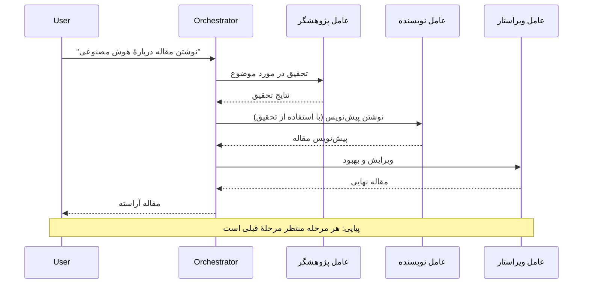
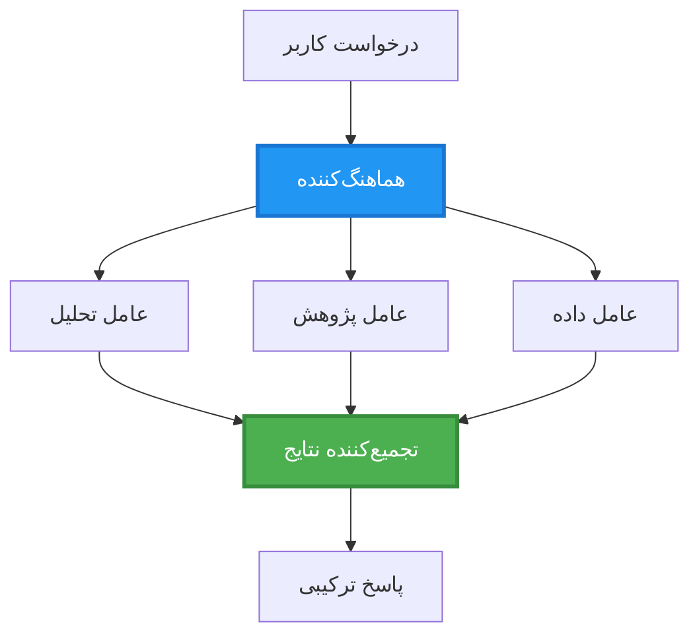
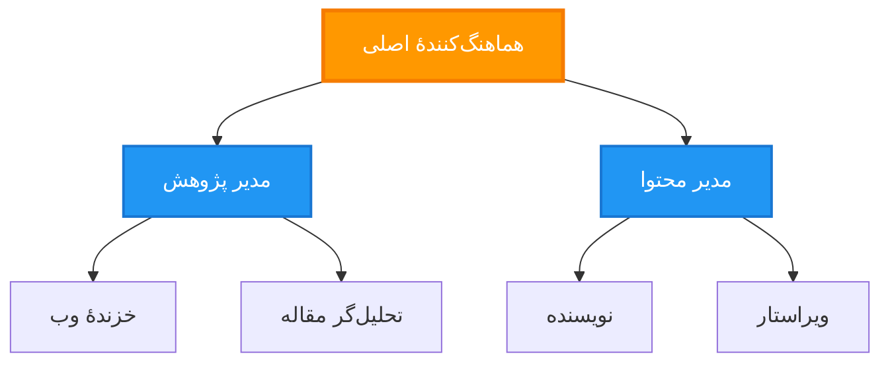
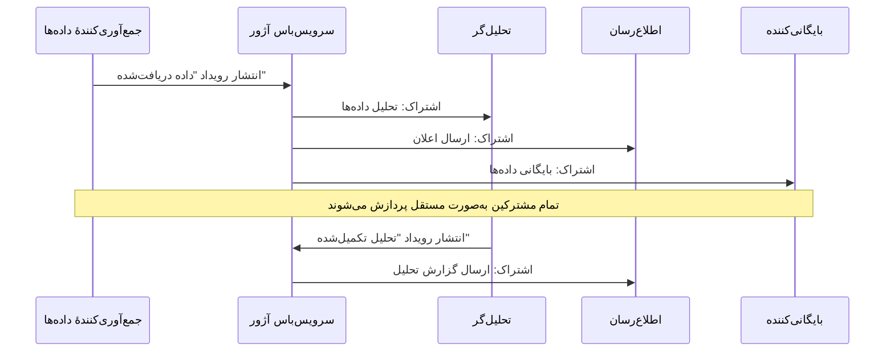
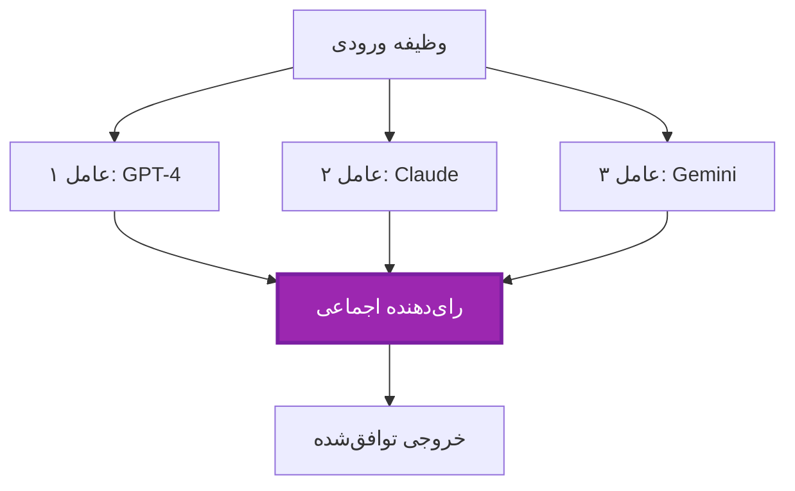
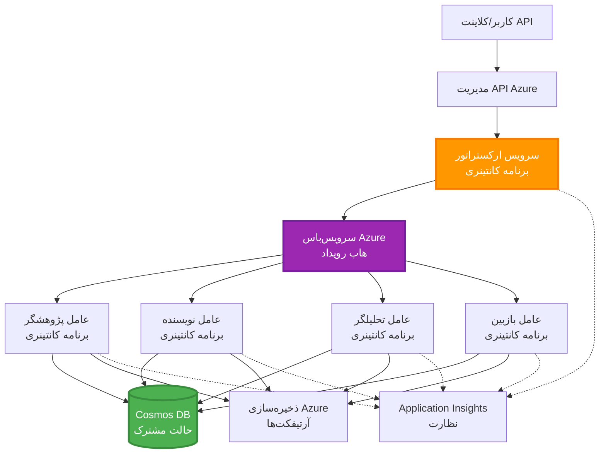

# الگوهای هماهنگی چندعاملی

⏱️ **زمان تقریبی**: 60-75 minutes | 💰 **هزینه تقریبی**: ~$100-300/month | ⭐ **پیچیدگی**: Advanced

**📚 مسیر یادگیری:**
- ← Previous: [برنامه‌ریزی ظرفیت](capacity-planning.md) - سایزبندی منابع و استراتژی‌های مقیاس‌دهی
- 🎯 **شما اینجا هستید**: الگوهای هماهنگی چندعاملی (ارکستراسیون، ارتباطات، مدیریت حالت)
- → Next: [انتخاب SKU](sku-selection.md) - انتخاب سرویس‌های مناسب Azure
- 🏠 [صفحه‌ی دوره](../../README.md)

---

## آنچه خواهید آموخت

با تکمیل این درس، شما:
- درک الگوهای **معماری چندعاملی** و زمان مناسب برای استفاده از آنها
- پیاده‌سازی **الگوهای ارکستراسیون** (متمرکز، غیرمتمرکز، سلسله‌مراتبی)
- طراحی استراتژی‌های **ارتباط بین عامل‌ها** (همزمان، غیرهمزمان، رویدادمحور)
- مدیریت **حالت مشترک** در میان عامل‌های توزیع‌شده
- استقرار **سامانه‌های چندعاملی** روی Azure با AZD
- اعمال **الگوهای هماهنگی** برای سناریوهای واقعی هوش مصنوعی
- نظارت و رفع اشکال سامانه‌های چندعاملی توزیع‌شده

## چرا هماهنگی چندعاملی اهمیت دارد

### تکامل: از عامل منفرد تا چندعاملی

**عامل منفرد (ساده):**
```
User → Agent → Response
```
- ✅ فهم و پیاده‌سازی آسان
- ✅ سریع برای وظایف ساده
- ❌ محدود به توانایی‌های یک مدل
- ❌ قابلیت اجرای موازی وظایف پیچیده را ندارد
- ❌ فاقد تخصص

**سامانه چندعاملی (پیشرفته):**
```
           ┌─────────────┐
           │ Orchestrator│
           └──────┬──────┘
        ┌─────────┼─────────┐
        │         │         │
    ┌───▼──┐  ┌──▼───┐  ┌──▼────┐
    │Agent1│  │Agent2│  │Agent3 │
    │(Plan)│  │(Code)│  │(Review)│
    └──────┘  └──────┘  └───────┘
```
- ✅ عامل‌های تخصصی برای وظایف مشخص
- ✅ اجرای موازی برای افزایش سرعت
- ✅ ماژولار و قابل نگهداری
- ✅ بهتر در جریان‌های کاری پیچیده
- ⚠️ نیازمند منطق هماهنگی

**تشبیه**: عامل منفرد مانند یک نفر است که همه وظایف را انجام می‌دهد. چندعاملی مانند یک تیم است که هر عضو مهارت‌های تخصصی دارد (پژوهشگر، برنامه‌نویس، بازبین، نویسنده) و با هم کار می‌کنند.

---

## الگوهای اصلی هماهنگی

### الگو 1: هماهنگی ترتیبی (زنجیره مسؤولیت)

**زمان استفاده**: وظایف باید به ترتیب مشخص تکمیل شوند، هر عامل بر پایه خروجی قبلی کار می‌کند.


**مزایا:**
- ✅ جریان داده واضح
- ✅ ساده برای رفع اشکال
- ✅ ترتیب اجرای قابل پیش‌بینی

**محدودیت‌ها:**
- ❌ کندتر (بدون موازی‌سازی)
- ❌ یک خطا کل زنجیره را مسدود می‌کند
- ❌ نمی‌تواند وظایف وابسته به هم را مدیریت کند

**نمونه‌های کاربردی:**
- خط لوله تولید محتوا (پژوهش → نوشتن → ویرایش → انتشار)
- تولید کد (برنامه‌ریزی → پیاده‌سازی → تست → استقرار)
- تولید گزارش (جمع‌آوری داده → تحلیل → بصری‌سازی → خلاصه)

---

### الگو 2: هماهنگی موازی (پخش-تجمیع / Fan-Out/Fan-In)

**زمان استفاده**: وظایف مستقل می‌توانند به‌صورت هم‌زمان اجرا شوند، نتایج در پایان ترکیب می‌شوند.


**مزایا:**
- ✅ سریع (اجرای موازی)
- ✅ پایدار در برابر خطا (نتایج جزئی قابل قبول)
- ✅ قابلیت مقیاس‌پذیری افقی

**محدودیت‌ها:**
- ⚠️ ممکن است نتایج خارج از ترتیب برسند
- ⚠️ نیاز به منطق تجمیع دارد
- ⚠️ مدیریت وضعیت پیچیده

**نمونه‌های کاربردی:**
- جمع‌آوری داده از منابع متعدد (APIs + پایگاه‌داده‌ها + وب‌اسکرپینگ)
- تحلیل رقابتی (چندین مدل راه‌حل تولید می‌کنند، بهترین انتخاب می‌شود)
- خدمات ترجمه (ترجمه هم‌زمان به چند زبان)

---

### الگو 3: هماهنگی سلسله‌مراتبی (مدیر-کارگر)

**زمان استفاده**: جریان‌های کاری پیچیده با زیروظایف، نیاز به واگذاری دارند.


**مزایا:**
- ✅ مدیریت جریان‌های کاری پیچیده
- ✅ ماژولار و قابل نگهداری
- ✅ حدود مسئولیت‌های واضح

**محدودیت‌ها:**
- ⚠️ معماری پیچیده‌تر
- ⚠️ تاخیر بیشتر (چندین لایه هماهنگی)
- ⚠️ نیازمند ارکستراسیون پیچیده

**نمونه‌های کاربردی:**
- پردازش اسناد سازمانی (رده‌بندی → ارجاع → پردازش → بایگانی)
- خطوط داده چندمرحله‌ای (دریافت → پاک‌سازی → تبدیل → تحلیل → گزارش)
- جریان‌های کاری اتوماسیون پیچیده (برنامه‌ریزی → تخصیص منابع → اجرا → مانیتورینگ)

---

### الگو 4: هماهنگی رویدادمحور (انتشار-اشتراک)

**زمان استفاده**: عامل‌ها باید به رویدادها واکنش نشان دهند، اتصال ضعیف مطلوب است.


**مزایا:**
- ✅ وابستگی ضعیف بین عامل‌ها
- ✅ افزودن عامل‌های جدید آسان است (فقط مشترک شوند)
- ✅ پردازش غیرهمزمان
- ✅ مقاوم (پایداری پیام)

**محدودیت‌ها:**
- ⚠️ سازگاری نهایی
- ⚠️ رفع اشکال پیچیده
- ⚠️ چالش‌های ترتیب پیام

**نمونه‌های کاربردی:**
- سامانه‌های مانیتورینگ زمان واقعی (هشدارها، داشبوردها، لاگ‌ها)
- اطلاع‌رسانی چندکاناله (ایمیل، SMS، پوش، Slack)
- خطوط پردازش داده (چند مصرف‌کننده برای یک داده)

---

### الگو 5: هماهنگی مبتنی بر اجماع (رأی‌گیری/اکثریت)

**زمان استفاده**: نیاز به توافق چند عامل قبل از ادامه.


**مزایا:**
- ✅ دقت بالاتر (چند نظر)
- ✅ پایدار در برابر خطا (نارسایی اقلیت قابل قبول)
- ✅ اطمینان از کیفیت به‌صورت تعبیه‌شده

**محدودیت‌ها:**
- ❌ گران‌قیمت (فراخوانی چندین مدل)
- ❌ کندتر (انتظار برای همه عامل‌ها)
- ⚠️ نیاز به حل تعارض

**نمونه‌های کاربردی:**
- نظارت بر محتوا (چندین مدل محتوا را بازبینی می‌کنند)
- بازبینی کد (چندین linter/تحلیلگر)
- تشخیص پزشکی (چندین مدل هوش مصنوعی، تایید متخصص)

---

## مرور کلی معماری

### سامانه کامل چندعاملی روی Azure


**اجزای کلیدی:**

| مولفه | هدف | سرویس Azure |
|-----------|---------|---------------|
| **API Gateway** | نقطهٔ ورود، محدودسازی نرخ، احراز هویت | API Management |
| **Orchestrator** | هماهنگ‌کننده جریان‌های کاری عامل‌ها | Container Apps |
| **Message Queue** | ارتباط غیرهمزمان | Service Bus / Event Hubs |
| **Agents** | عامل‌های تخصصی هوش مصنوعی | Container Apps / Functions |
| **State Store** | حالت مشترک، پیگیری وظایف | Cosmos DB |
| **Artifact Storage** | اسناد، نتایج، لاگ‌ها | Blob Storage |
| **Monitoring** | ردیابی توزیع‌شده، لاگ‌ها | Application Insights |

---

## پیش‌نیازها

### ابزارهای موردنیاز

```bash
# بررسی Azure Developer CLI
azd version
# ✅ انتظار می‌رود: azd نسخهٔ 1.0.0 یا بالاتر

# بررسی Azure CLI
az --version
# ✅ انتظار می‌رود: azure-cli نسخه 2.50.0 یا بالاتر

# بررسی Docker (برای تست محلی)
docker --version
# ✅ انتظار می‌رود: Docker نسخهٔ 20.10 یا بالاتر
```

### نیازمندی‌های Azure

- اشتراک فعال Azure
- دسترسی برای ایجاد:
  - Container Apps
  - Service Bus namespaces
  - Cosmos DB accounts
  - Storage accounts
  - Application Insights

### پیش‌نیازهای دانشی

شما باید موارد زیر را کامل کرده باشید:
- [مدیریت پیکربندی](../chapter-03-configuration/configuration.md)
- [احراز هویت و امنیت](../chapter-03-configuration/authsecurity.md)
- [مثال میکروسرویس‌ها](../../../../examples/microservices)

---

## راهنمای پیاده‌سازی

### ساختار پروژه

```
multi-agent-system/
├── azure.yaml                    # AZD configuration
├── infra/
│   ├── main.bicep               # Main infrastructure
│   ├── core/
│   │   ├── servicebus.bicep     # Message queue
│   │   ├── cosmos.bicep         # State store
│   │   ├── storage.bicep        # Artifact storage
│   │   └── monitoring.bicep     # Application Insights
│   └── app/
│       ├── orchestrator.bicep   # Orchestrator service
│       └── agent.bicep          # Agent template
└── src/
    ├── orchestrator/            # Orchestration logic
    │   ├── app.py
    │   ├── workflows.py
    │   └── Dockerfile
    ├── agents/
    │   ├── research/            # Research agent
    │   ├── writer/              # Writer agent
    │   ├── analyst/             # Analyst agent
    │   └── reviewer/            # Reviewer agent
    └── shared/
        ├── state_manager.py     # Shared state logic
        └── message_handler.py   # Message handling
```

---

## درس 1: الگوی هماهنگی ترتیبی

### پیاده‌سازی: خط لوله تولید محتوا

بیایید یک خط لوله ترتیبی بسازیم: پژوهش → نوشتن → ویرایش → انتشار

### 1. AZD Configuration

**فایل: `azure.yaml`**

```yaml
name: content-pipeline
metadata:
  template: multi-agent-sequential@1.0.0

services:
  orchestrator:
    project: ./src/orchestrator
    language: python
    host: containerapp
  
  research-agent:
    project: ./src/agents/research
    language: python
    host: containerapp
  
  writer-agent:
    project: ./src/agents/writer
    language: python
    host: containerapp
  
  editor-agent:
    project: ./src/agents/editor
    language: python
    host: containerapp
```

### 2. Infrastructure: Service Bus for Coordination

**فایل: `infra/core/servicebus.bicep`**

```bicep
param name string
param location string
param tags object = {}

resource serviceBusNamespace 'Microsoft.ServiceBus/namespaces@2022-10-01-preview' = {
  name: name
  location: location
  tags: tags
  sku: {
    name: 'Standard'
    tier: 'Standard'
  }
  properties: {
    minimumTlsVersion: '1.2'
  }
}

// Queue for orchestrator → research agent
resource researchQueue 'Microsoft.ServiceBus/namespaces/queues@2022-10-01-preview' = {
  parent: serviceBusNamespace
  name: 'research-tasks'
  properties: {
    maxDeliveryCount: 3
    lockDuration: 'PT5M'
    deadLetteringOnMessageExpiration: true
  }
}

// Queue for research agent → writer agent
resource writerQueue 'Microsoft.ServiceBus/namespaces/queues@2022-10-01-preview' = {
  parent: serviceBusNamespace
  name: 'writer-tasks'
  properties: {
    maxDeliveryCount: 3
    lockDuration: 'PT5M'
  }
}

// Queue for writer agent → editor agent
resource editorQueue 'Microsoft.ServiceBus/namespaces/queues@2022-10-01-preview' = {
  parent: serviceBusNamespace
  name: 'editor-tasks'
  properties: {
    maxDeliveryCount: 3
    lockDuration: 'PT5M'
  }
}

output namespace string = serviceBusNamespace.name
output connectionString string = listKeys('${serviceBusNamespace.id}/AuthorizationRules/RootManageSharedAccessKey', serviceBusNamespace.apiVersion).primaryConnectionString
```

### 3. Shared State Manager

**فایل: `src/shared/state_manager.py`**

```python
from azure.cosmos import CosmosClient, PartitionKey
from datetime import datetime
import os

class StateManager:
    """Manages shared state across agents using Cosmos DB"""
    
    def __init__(self):
        endpoint = os.environ['COSMOS_ENDPOINT']
        key = os.environ['COSMOS_KEY']
        
        self.client = CosmosClient(endpoint, key)
        self.database = self.client.get_database_client('agent-state')
        self.container = self.database.get_container_client('tasks')
    
    def create_task(self, task_id: str, task_type: str, input_data: dict):
        """Create a new task"""
        task = {
            'id': task_id,
            'type': task_type,
            'status': 'pending',
            'input': input_data,
            'created_at': datetime.utcnow().isoformat(),
            'steps': []
        }
        self.container.create_item(task)
        return task
    
    def update_task_step(self, task_id: str, step_name: str, result: dict):
        """Update task with completed step"""
        task = self.container.read_item(task_id, partition_key=task_id)
        
        task['steps'].append({
            'name': step_name,
            'completed_at': datetime.utcnow().isoformat(),
            'result': result
        })
        
        self.container.replace_item(task_id, task)
        return task
    
    def complete_task(self, task_id: str, final_result: dict):
        """Mark task as complete"""
        task = self.container.read_item(task_id, partition_key=task_id)
        task['status'] = 'completed'
        task['result'] = final_result
        task['completed_at'] = datetime.utcnow().isoformat()
        self.container.replace_item(task_id, task)
        return task
    
    def get_task(self, task_id: str):
        """Retrieve task state"""
        return self.container.read_item(task_id, partition_key=task_id)
```

### 4. Orchestrator Service

**فایل: `src/orchestrator/app.py`**

```python
from flask import Flask, request, jsonify
from azure.servicebus import ServiceBusClient, ServiceBusMessage
import json
import uuid
import os
from shared.state_manager import StateManager

app = Flask(__name__)
state_manager = StateManager()

# اتصال سرویس‌باس
servicebus_connection_str = os.environ['SERVICEBUS_CONNECTION_STRING']
servicebus_client = ServiceBusClient.from_connection_string(servicebus_connection_str)

@app.route('/health', methods=['GET'])
def health():
    return jsonify({'status': 'healthy', 'service': 'orchestrator'})

@app.route('/create-content', methods=['POST'])
def create_content():
    """
    Sequential workflow: Research → Write → Edit → Publish
    """
    data = request.json
    topic = data.get('topic')
    
    if not topic:
        return jsonify({'error': 'Topic required'}), 400
    
    # ایجاد وظیفه در ذخیره‌ساز وضعیت
    task_id = str(uuid.uuid4())
    task = state_manager.create_task(
        task_id=task_id,
        task_type='content_creation',
        input_data={'topic': topic}
    )
    
    # ارسال پیام به عامل پژوهشی (گام اول)
    sender = servicebus_client.get_queue_sender('research-tasks')
    message = ServiceBusMessage(
        body=json.dumps({
            'task_id': task_id,
            'topic': topic,
            'next_queue': 'writer-tasks'  # کجا نتایج را ارسال کنیم
        }),
        content_type='application/json'
    )
    
    with sender:
        sender.send_messages(message)
    
    return jsonify({
        'task_id': task_id,
        'status': 'started',
        'workflow': 'sequential',
        'steps': ['research', 'write', 'edit', 'publish'],
        'message': 'Content creation pipeline initiated'
    }), 202

@app.route('/task/<task_id>', methods=['GET'])
def get_task_status(task_id):
    """Check task status"""
    try:
        task = state_manager.get_task(task_id)
        return jsonify(task)
    except Exception as e:
        return jsonify({'error': str(e)}), 404

if __name__ == '__main__':
    app.run(host='0.0.0.0', port=8080)
```

### 5. Research Agent

**فایل: `src/agents/research/app.py`**

```python
from azure.servicebus import ServiceBusClient, ServiceBusMessage
from openai import AzureOpenAI
import json
import os
import time
from shared.state_manager import StateManager

# کلاینت‌ها را مقداردهی اولیه کنید
state_manager = StateManager()
servicebus_client = ServiceBusClient.from_connection_string(
    os.environ['SERVICEBUS_CONNECTION_STRING']
)

openai_client = AzureOpenAI(
    api_key=os.environ['AZURE_OPENAI_API_KEY'],
    api_version="2024-02-01",
    azure_endpoint=os.environ['AZURE_OPENAI_ENDPOINT']
)

def process_research_task(message_data):
    """Process research request and pass to writer"""
    task_id = message_data['task_id']
    topic = message_data['topic']
    next_queue = message_data['next_queue']
    
    print(f"🔬 Researching: {topic}")
    
    # برای پژوهش، Azure OpenAI را فراخوانی کنید
    response = openai_client.chat.completions.create(
        model="gpt-4",
        messages=[
            {"role": "system", "content": "You are a research assistant. Provide comprehensive research on the given topic."},
            {"role": "user", "content": f"Research this topic thoroughly: {topic}"}
        ],
        max_tokens=1500
    )
    
    research_results = response.choices[0].message.content
    
    # وضعیت را به‌روزرسانی کنید
    state_manager.update_task_step(
        task_id=task_id,
        step_name='research',
        result={'research': research_results}
    )
    
    # به عامل بعدی (نویسنده) ارسال کنید
    sender = servicebus_client.get_queue_sender(next_queue)
    message = ServiceBusMessage(
        body=json.dumps({
            'task_id': task_id,
            'topic': topic,
            'research': research_results,
            'next_queue': 'editor-tasks'
        }),
        content_type='application/json'
    )
    
    with sender:
        sender.send_messages(message)
    
    print(f"✅ Research complete for task {task_id}")

def main():
    """Listen to research queue"""
    receiver = servicebus_client.get_queue_receiver('research-tasks')
    
    print("🔬 Research Agent started, listening for tasks...")
    
    with receiver:
        while True:
            messages = receiver.receive_messages(max_wait_time=5)
            for message in messages:
                try:
                    message_data = json.loads(str(message))
                    process_research_task(message_data)
                    receiver.complete_message(message)
                except Exception as e:
                    print(f"❌ Error processing message: {e}")
                    receiver.abandon_message(message)

if __name__ == '__main__':
    main()
```

### 6. Writer Agent

**فایل: `src/agents/writer/app.py`**

```python
from azure.servicebus import ServiceBusClient, ServiceBusMessage
from openai import AzureOpenAI
import json
import os
from shared.state_manager import StateManager

state_manager = StateManager()
servicebus_client = ServiceBusClient.from_connection_string(
    os.environ['SERVICEBUS_CONNECTION_STRING']
)

openai_client = AzureOpenAI(
    api_key=os.environ['AZURE_OPENAI_API_KEY'],
    api_version="2024-02-01",
    azure_endpoint=os.environ['AZURE_OPENAI_ENDPOINT']
)

def process_writing_task(message_data):
    """Write article based on research"""
    task_id = message_data['task_id']
    topic = message_data['topic']
    research = message_data['research']
    next_queue = message_data['next_queue']
    
    print(f"✍️ Writing article: {topic}")
    
    # Azure OpenAI را برای نوشتن مقاله فراخوانی کنید
    response = openai_client.chat.completions.create(
        model="gpt-4",
        messages=[
            {"role": "system", "content": "You are a professional writer. Write engaging, well-structured articles."},
            {"role": "user", "content": f"Based on this research:\n\n{research}\n\nWrite a comprehensive article about: {topic}"}
        ],
        max_tokens=2000
    )
    
    article_draft = response.choices[0].message.content
    
    # وضعیت را به‌روزرسانی کنید
    state_manager.update_task_step(
        task_id=task_id,
        step_name='writing',
        result={'draft': article_draft}
    )
    
    # ارسال به ویراستار
    sender = servicebus_client.get_queue_sender(next_queue)
    message = ServiceBusMessage(
        body=json.dumps({
            'task_id': task_id,
            'topic': topic,
            'draft': article_draft
        }),
        content_type='application/json'
    )
    
    with sender:
        sender.send_messages(message)
    
    print(f"✅ Article draft complete for task {task_id}")

def main():
    """Listen to writer queue"""
    receiver = servicebus_client.get_queue_receiver('writer-tasks')
    
    print("✍️ Writer Agent started, listening for tasks...")
    
    with receiver:
        while True:
            messages = receiver.receive_messages(max_wait_time=5)
            for message in messages:
                try:
                    message_data = json.loads(str(message))
                    process_writing_task(message_data)
                    receiver.complete_message(message)
                except Exception as e:
                    print(f"❌ Error: {e}")
                    receiver.abandon_message(message)

if __name__ == '__main__':
    main()
```

### 7. Editor Agent

**فایل: `src/agents/editor/app.py`**

```python
from azure.servicebus import ServiceBusClient
from openai import AzureOpenAI
import json
import os
from shared.state_manager import StateManager

state_manager = StateManager()
servicebus_client = ServiceBusClient.from_connection_string(
    os.environ['SERVICEBUS_CONNECTION_STRING']
)

openai_client = AzureOpenAI(
    api_key=os.environ['AZURE_OPENAI_API_KEY'],
    api_version="2024-02-01",
    azure_endpoint=os.environ['AZURE_OPENAI_ENDPOINT']
)

def process_editing_task(message_data):
    """Edit and finalize article"""
    task_id = message_data['task_id']
    topic = message_data['topic']
    draft = message_data['draft']
    
    print(f"📝 Editing article: {topic}")
    
    # برای ویرایش، Azure OpenAI را فراخوانی کنید
    response = openai_client.chat.completions.create(
        model="gpt-4",
        messages=[
            {"role": "system", "content": "You are an expert editor. Improve grammar, clarity, and structure."},
            {"role": "user", "content": f"Edit and improve this article:\n\n{draft}"}
        ],
        max_tokens=2000
    )
    
    final_article = response.choices[0].message.content
    
    # وظیفه را به‌عنوان تکمیل‌شده علامت‌گذاری کنید
    state_manager.complete_task(
        task_id=task_id,
        final_result={
            'topic': topic,
            'final_article': final_article,
            'word_count': len(final_article.split())
        }
    )
    
    print(f"✅ Article finalized for task {task_id}")

def main():
    """Listen to editor queue"""
    receiver = servicebus_client.get_queue_receiver('editor-tasks')
    
    print("📝 Editor Agent started, listening for tasks...")
    
    with receiver:
        while True:
            messages = receiver.receive_messages(max_wait_time=5)
            for message in messages:
                try:
                    message_data = json.loads(str(message))
                    process_editing_task(message_data)
                    receiver.complete_message(message)
                except Exception as e:
                    print(f"❌ Error: {e}")
                    receiver.abandon_message(message)

if __name__ == '__main__':
    main()
```

### 8. Deploy and Test

```bash
# راه‌اندازی و استقرار
azd init
azd up

# دریافت آدرس URL ارکستراتور
ORCHESTRATOR_URL=$(azd env get-values | grep ORCHESTRATOR_URL | cut -d '=' -f2 | tr -d '"')

# ایجاد محتوا
curl -X POST $ORCHESTRATOR_URL/create-content \
  -H "Content-Type: application/json" \
  -d '{"topic": "The Future of AI in Healthcare"}'
```

**✅ خروجی مورد انتظار:**
```json
{
  "task_id": "a1b2c3d4-e5f6-7890-abcd-ef1234567890",
  "status": "started",
  "workflow": "sequential",
  "steps": ["research", "write", "edit", "publish"],
  "message": "Content creation pipeline initiated"
}
```

**پیشرفت وظیفه را بررسی کنید:**
```bash
TASK_ID="a1b2c3d4-e5f6-7890-abcd-ef1234567890"
curl $ORCHESTRATOR_URL/task/$TASK_ID
```

**✅ خروجی مورد انتظار (تکمیل شده):**
```json
{
  "id": "a1b2c3d4-e5f6-7890-abcd-ef1234567890",
  "type": "content_creation",
  "status": "completed",
  "steps": [
    {
      "name": "research",
      "completed_at": "2025-11-19T10:30:00Z",
      "result": {"research": "..."}
    },
    {
      "name": "writing",
      "completed_at": "2025-11-19T10:32:00Z",
      "result": {"draft": "..."}
    }
  ],
  "result": {
    "topic": "The Future of AI in Healthcare",
    "final_article": "...",
    "word_count": 1500
  }
}
```

---

## درس 2: الگوی هماهنگی موازی

### پیاده‌سازی: تجمیع‌کننده پژوهش چندمنبعی

بیایید سیستمی موازی بسازیم که اطلاعات را هم‌زمان از چند منبع جمع‌آوری کند.

### ارکستراتور موازی

**فایل: `src/orchestrator/parallel_workflow.py`**

```python
from flask import Flask, request, jsonify
from azure.servicebus import ServiceBusClient, ServiceBusMessage
import json
import uuid
import os
from shared.state_manager import StateManager

app = Flask(__name__)
state_manager = StateManager()

servicebus_client = ServiceBusClient.from_connection_string(
    os.environ['SERVICEBUS_CONNECTION_STRING']
)

@app.route('/research-parallel', methods=['POST'])
def research_parallel():
    """
    Parallel workflow: Multiple agents work simultaneously
    """
    data = request.json
    query = data.get('query')
    
    task_id = str(uuid.uuid4())
    task = state_manager.create_task(
        task_id=task_id,
        task_type='parallel_research',
        input_data={
            'query': query,
            'agents': ['web', 'academic', 'news', 'social']
        }
    )
    
    # توزیع هم‌زمان: ارسال به همهٔ عامل‌ها
    agents = [
        ('web-research-queue', 'web'),
        ('academic-research-queue', 'academic'),
        ('news-research-queue', 'news'),
        ('social-research-queue', 'social')
    ]
    
    for queue_name, agent_type in agents:
        sender = servicebus_client.get_queue_sender(queue_name)
        message = ServiceBusMessage(
            body=json.dumps({
                'task_id': task_id,
                'query': query,
                'agent_type': agent_type,
                'result_queue': 'aggregation-queue'
            }),
            content_type='application/json'
        )
        
        with sender:
            sender.send_messages(message)
    
    return jsonify({
        'task_id': task_id,
        'status': 'started',
        'workflow': 'parallel',
        'agents_dispatched': 4,
        'message': 'Parallel research initiated'
    }), 202

if __name__ == '__main__':
    app.run(host='0.0.0.0', port=8080)
```

### منطق تجمیع

**فایل: `src/agents/aggregator/app.py`**

```python
from azure.servicebus import ServiceBusClient
import json
import os
from collections import defaultdict
from shared.state_manager import StateManager

state_manager = StateManager()
servicebus_client = ServiceBusClient.from_connection_string(
    os.environ['SERVICEBUS_CONNECTION_STRING']
)

# ردیابی نتایج برای هر وظیفه
task_results = defaultdict(list)
expected_agents = 4  # وب، آکادمیک، اخبار، اجتماعی

def process_result(message_data):
    """Aggregate results from parallel agents"""
    task_id = message_data['task_id']
    agent_type = message_data['agent_type']
    result = message_data['result']
    
    # ذخیره نتیجه
    task_results[task_id].append({
        'agent': agent_type,
        'data': result
    })
    
    print(f"📊 Received result from {agent_type} agent ({len(task_results[task_id])}/{expected_agents})")
    
    # بررسی کنید که آیا همه عامل‌ها تکمیل شده‌اند (fan-in)
    if len(task_results[task_id]) == expected_agents:
        print(f"✅ All agents completed for task {task_id}. Aggregating...")
        
        # ترکیب نتایج
        aggregated = {
            'query': message_data['query'],
            'sources': task_results[task_id],
            'summary': generate_summary(task_results[task_id])
        }
        
        # علامت‌گذاری به‌عنوان تکمیل‌شده
        state_manager.complete_task(task_id, aggregated)
        
        # پاک‌سازی
        del task_results[task_id]
        
        print(f"✅ Aggregation complete for task {task_id}")

def generate_summary(results):
    """Generate summary from all sources"""
    summaries = [r['data'].get('summary', '') for r in results]
    return '\n\n'.join(summaries)

def main():
    """Listen to aggregation queue"""
    receiver = servicebus_client.get_queue_receiver('aggregation-queue')
    
    print("📊 Aggregator started, listening for results...")
    
    with receiver:
        while True:
            messages = receiver.receive_messages(max_wait_time=5)
            for message in messages:
                try:
                    message_data = json.loads(str(message))
                    process_result(message_data)
                    receiver.complete_message(message)
                except Exception as e:
                    print(f"❌ Error: {e}")
                    receiver.abandon_message(message)

if __name__ == '__main__':
    main()
```

**مزایای الگوی موازی:**
- ⚡ **۴ برابر سریع‌تر** (عامل‌ها هم‌زمان اجرا می‌شوند)
- 🔄 **پایدار در برابر خطا** (نتایج جزئی قابل قبول)
- 📈 **قابلیت مقیاس‌پذیری** (به‌سادگی عامل‌های بیشتری اضافه کنید)

---

## تمرین‌های عملی

### تمرین 1: افزودن مدیریت تایم‌اوت ⭐⭐ (متوسط)

**هدف**: پیاده‌سازی منطق تایم‌اوت تا تجمیع‌کننده برای عامل‌های کند بی‌نهایت انتظار نکشد.

**مراحل**:

1. **افزودن ردیابی تایم‌اوت به تجمیع‌کننده:**

```python
from datetime import datetime, timedelta

task_timeouts = {}  # شناسهٔ وظیفه -> زمان انقضا

def process_result(message_data):
    task_id = message_data['task_id']
    
    # تنظیم مهلت زمانی برای اولین نتیجه
    if task_id not in task_timeouts:
        task_timeouts[task_id] = datetime.utcnow() + timedelta(seconds=30)
    
    task_results[task_id].append({
        'agent': message_data['agent_type'],
        'data': message_data['result']
    })
    
    # بررسی اینکه کامل شده یا زمان آن به پایان رسیده است
    if len(task_results[task_id]) == expected_agents or \
       datetime.utcnow() > task_timeouts[task_id]:
        
        print(f"📊 Aggregating with {len(task_results[task_id])}/{expected_agents} results")
        
        aggregated = {
            'query': message_data['query'],
            'sources': task_results[task_id],
            'completed_agents': len(task_results[task_id]),
            'timed_out': len(task_results[task_id]) < expected_agents
        }
        
        state_manager.complete_task(task_id, aggregated)
        
        # پاک‌سازی
        del task_results[task_id]
        del task_timeouts[task_id]
```

2. **آزمایش با تأخیر مصنوعی:**

```python
# در یکی از عامل‌ها، با افزودن تأخیر پردازش کند را شبیه‌سازی کنید
import time
time.sleep(35)  # از محدودیت زمانی ۳۰ ثانیه‌ای فراتر می‌رود
```

3. **استقرار و تأیید:**

```bash
azd deploy aggregator

# ارسال وظیفه
curl -X POST $ORCHESTRATOR_URL/research-parallel \
  -H "Content-Type: application/json" \
  -d '{"query": "AI safety research"}'

# نتایج را پس از ۳۰ ثانیه بررسی کنید
curl $ORCHESTRATOR_URL/task/$TASK_ID
```

**✅ معیارهای موفقیت:**
- ✅ وظیفه پس از 30 ثانیه کامل می‌شود حتی اگر عامل‌ها ناقص باشند
- ✅ پاسخ نشان‌دهنده نتایج جزئی است (`"timed_out": true`)
- ✅ نتایج در دسترس بازگردانده می‌شوند (3 از 4 عامل)

**زمان**: 20-25 دقیقه

---

### تمرین 2: پیاده‌سازی منطق تکرار مجدد ⭐⭐⭐ (پیشرفته)

**هدف**: تلاش خودکار برای وظایف عامل‌های ناموفق قبل از قطع تلاش

**مراحل**:

1. **افزودن ردیابی تلاش مجدد به ارکستراتور:**

```python
from dataclasses import dataclass
from typing import Dict

@dataclass
class RetryConfig:
    max_retries: int = 3
    backoff_seconds: int = 5

retry_counts: Dict[str, int] = {}  # شناسه پیام -> تعداد تلاش‌ها

def send_with_retry(queue_name: str, message_data: dict, retry_config: RetryConfig):
    """Send message with retry metadata"""
    message_id = message_data.get('message_id', str(uuid.uuid4()))
    message_data['message_id'] = message_id
    message_data['retry_count'] = retry_counts.get(message_id, 0)
    message_data['max_retries'] = retry_config.max_retries
    
    sender = servicebus_client.get_queue_sender(queue_name)
    message = ServiceBusMessage(
        body=json.dumps(message_data),
        content_type='application/json',
        message_id=message_id
    )
    
    with sender:
        sender.send_messages(message)
```

2. **افزودن هندلر تلاش مجدد به عامل‌ها:**

```python
def process_with_retry(message, receiver, process_func):
    """Process message with automatic retry on failure"""
    try:
        message_data = json.loads(str(message))
        
        # پردازش پیام
        process_func(message_data)
        
        # موفقیت - انجام شد
        receiver.complete_message(message)
        
    except Exception as e:
        message_id = message.message_id
        retry_count = message_data.get('retry_count', 0)
        max_retries = message_data.get('max_retries', 3)
        
        if retry_count < max_retries:
            # تلاش مجدد: رها کنید و با افزایش شمارش دوباره در صف قرار دهید
            print(f"⚠️ Retry {retry_count + 1}/{max_retries} for message {message_id}")
            
            message_data['retry_count'] = retry_count + 1
            
            # ارسال مجدد به همان صف با تأخیر
            time.sleep(5 * (retry_count + 1))  # افزایش تأخیر به‌صورت نمایی
            send_with_retry(queue_name, message_data, RetryConfig())
            
            receiver.complete_message(message)  # حذف نسخهٔ اصلی
        else:
            # حداکثر تلاش‌ها سپری شد - انتقال به صف پیام‌های مرده
            print(f"❌ Max retries exceeded for message {message_id}")
            receiver.dead_letter_message(
                message,
                reason="MaxRetriesExceeded",
                error_description=str(e)
            )
```

3. **نظارت بر صف پیام‌های مرده (dead letter queue):**

```python
def monitor_dead_letters():
    """Check dead letter queue for failed messages"""
    receiver = servicebus_client.get_queue_receiver(
        'research-queue',
        sub_queue='deadletter'
    )
    
    with receiver:
        messages = receiver.receive_messages(max_wait_time=5)
        for message in messages:
            print(f"☠️ Dead letter: {message.message_id}")
            print(f"Reason: {message.dead_letter_reason}")
            print(f"Description: {message.dead_letter_error_description}")
```

**✅ معیارهای موفقیت:**
- ✅ وظایف ناموفق به‌طور خودکار دوباره تلاش می‌شوند (حداکثر 3 بار)
- ✅ عقب‌نشینی نمایی بین تلاش‌ها (5s, 10s, 15s)
- ✅ پس از حداکثر تلاش‌ها، پیام‌ها به صف پیام‌های مرده (dead letter queue) می‌روند
- ✅ می‌توان صف پیام‌های مرده را مانیتور و بازپخش کرد

**زمان**: 30-40 دقیقه

---

### تمرین 3: پیاده‌سازی مدار شکن ⭐⭐⭐ (پیشرفته)

**هدف**: جلوگیری از شکست‌های آبشاری با متوقف کردن درخواست‌ها به عامل‌های ناکام

**مراحل**:

1. **ایجاد کلاس مدار شکن:**

```python
from enum import Enum
from datetime import datetime, timedelta

class CircuitState(Enum):
    CLOSED = "closed"      # عملیات عادی
    OPEN = "open"          # در حال خرابی، درخواست‌ها را رد می‌کند
    HALF_OPEN = "half_open"  # در حال آزمایش برای بازیابی

class CircuitBreaker:
    def __init__(self, failure_threshold=5, timeout_seconds=60):
        self.failure_threshold = failure_threshold
        self.timeout_seconds = timeout_seconds
        self.failure_count = 0
        self.last_failure_time = None
        self.state = CircuitState.CLOSED
    
    def call(self, func):
        """Execute function with circuit breaker protection"""
        if self.state == CircuitState.OPEN:
            # بررسی اینکه تایم‌اوت منقضی شده است
            if datetime.utcnow() - self.last_failure_time > timedelta(seconds=self.timeout_seconds):
                self.state = CircuitState.HALF_OPEN
                print("🔄 Circuit breaker: HALF_OPEN (testing)")
            else:
                raise Exception(f"Circuit breaker OPEN for agent. Try again in {self.timeout_seconds}s")
        
        try:
            result = func()
            
            # موفقیت
            if self.state == CircuitState.HALF_OPEN:
                self.state = CircuitState.CLOSED
                self.failure_count = 0
                print("✅ Circuit breaker: CLOSED (recovered)")
            
            return result
            
        except Exception as e:
            self.failure_count += 1
            self.last_failure_time = datetime.utcnow()
            
            if self.failure_count >= self.failure_threshold:
                self.state = CircuitState.OPEN
                print(f"🔴 Circuit breaker: OPEN (too many failures)")
            
            raise e
```

2. **اعمال به فراخوانی‌های عامل‌ها:**

```python
# در ارکستراتور
agent_circuits = {
    'web': CircuitBreaker(failure_threshold=5, timeout_seconds=60),
    'academic': CircuitBreaker(failure_threshold=5, timeout_seconds=60),
    'news': CircuitBreaker(failure_threshold=5, timeout_seconds=60),
    'social': CircuitBreaker(failure_threshold=5, timeout_seconds=60)
}

def send_to_agent(agent_type, message_data):
    """Send with circuit breaker protection"""
    circuit = agent_circuits[agent_type]
    
    try:
        circuit.call(lambda: send_message(agent_type, message_data))
    except Exception as e:
        print(f"⚠️ Skipping {agent_type} agent: {e}")
        # با سایر عامل‌ها ادامه دهید
```

3. **آزمایش مدار شکن:**

```bash
# شبیه‌سازی خطاهای مکرر (متوقف کردن یک عامل)
az containerapp stop --name web-research-agent --resource-group rg-agents

# ارسال چندین درخواست
for i in {1..10}; do
  curl -X POST $ORCHESTRATOR_URL/research-parallel \
    -H "Content-Type: application/json" \
    -d '{"query": "test query '$i'"}'
  sleep 2
done

# لاگ‌ها را بررسی کنید - باید پس از ۵ خطا باز شدن مدار را ببینید
# برای لاگ‌های برنامه کانتینری از Azure CLI استفاده کنید:
az containerapp logs show --name orchestrator --resource-group $RG_NAME --tail 50
```

**✅ معیارهای موفقیت:**
- ✅ پس از 5 شکست، مدار باز می‌شود (درخواست‌ها رد می‌شوند)
- ✅ پس از 60 ثانیه، مدار نیمه‌باز می‌شود (آزمایش بازیابی)
- ✅ سایر عامل‌ها به‌طور عادی به کار خود ادامه می‌دهند
- ✅ مدار هنگام بازیابی عامل به‌طور خودکار بسته می‌شود

**زمان**: 40-50 دقیقه

---

## مانیتورینگ و رفع اشکال

### ردیابی توزیع‌شده با Application Insights

**فایل: `src/shared/tracing.py`**

```python
from opencensus.ext.azure.log_exporter import AzureLogHandler
from opencensus.ext.azure.trace_exporter import AzureExporter
from opencensus.trace import config_integration
from opencensus.trace.tracer import Tracer
from opencensus.trace.samplers import AlwaysOnSampler
import logging
import os

# پیکربندی ردیابی
config_integration.trace_integrations(['requests', 'logging'])

connection_string = os.environ.get('APPLICATIONINSIGHTS_CONNECTION_STRING')

# ایجاد ردیاب
tracer = Tracer(
    exporter=AzureExporter(connection_string=connection_string),
    sampler=AlwaysOnSampler()
)

# پیکربندی لاگ‌گیری
logger = logging.getLogger(__name__)
logger.addHandler(AzureLogHandler(connection_string=connection_string))
logger.setLevel(logging.INFO)

def trace_agent_call(agent_name, task_id, operation):
    """Trace agent operations"""
    with tracer.span(name=f'{agent_name}.{operation}') as span:
        span.add_attribute('agent', agent_name)
        span.add_attribute('task_id', task_id)
        span.add_attribute('operation', operation)
        
        try:
            result = operation()
            span.add_attribute('status', 'success')
            return result
        except Exception as e:
            span.add_attribute('status', 'error')
            span.add_attribute('error', str(e))
            raise
```

### کوئری‌های Application Insights

**ردیابی جریان‌های کاری چندعاملی:**

```kusto
// Trace complete workflow for a task
traces
| where customDimensions.task_id == "a1b2c3d4-..."
| project timestamp, message, customDimensions.agent, customDimensions.operation
| order by timestamp asc
```

**مقایسه عملکرد عامل‌ها:**

```kusto
// Compare agent execution times
dependencies
| where name contains "agent"
| summarize 
    avg_duration = avg(duration),
    p95_duration = percentile(duration, 95),
    count = count()
  by agent = tostring(customDimensions.agent)
| order by avg_duration desc
```

**تحلیل خطا:**

```kusto
// Find which agents fail most
exceptions
| where customDimensions.agent != ""
| summarize 
    failure_count = count(),
    unique_errors = dcount(outerMessage)
  by agent = tostring(customDimensions.agent)
| order by failure_count desc
```

---

## تحلیل هزینه

### هزینه‌های سامانه چندعاملی (برآورد ماهانه)

| مولفه | پیکربندی | هزینه |
|-----------|--------------|------|
| **Orchestrator** | 1 Container App (1 vCPU, 2GB) | $30-50 |
| **4 Agents** | 4 Container Apps (0.5 vCPU, 1GB each) | $60-120 |
| **Service Bus** | Standard tier, 10M messages | $10-20 |
| **Cosmos DB** | Serverless, 5GB storage, 1M RUs | $25-50 |
| **Blob Storage** | 10GB storage, 100K operations | $5-10 |
| **Application Insights** | 5GB ingestion | $10-15 |
| **Azure OpenAI** | GPT-4, 10M tokens | $100-300 |
| **مجموع** | | **$240-565/month** |

### راهکارهای بهینه‌سازی هزینه

1. **هرجا ممکن است از سرورلس استفاده کنید:**
   ```bicep
   // Cosmos DB serverless (no minimum cost)
   properties: {
     databaseAccountOfferType: 'Standard'
     capabilities: [{ name: 'EnableServerless' }]
   }
   ```

2. **مقیاس‌دهی عامل‌ها به صفر در حالت بیکار:**
   ```bicep
   scale: {
     minReplicas: 0  // Scale to zero when no messages
     maxReplicas: 10
   }
   ```

3. **استفاده از دسته‌بندی پیام‌ها برای Service Bus:**
   ```python
   # پیام‌ها را به‌صورت دسته‌ای ارسال کنید (ارزان‌تر)
   sender.send_messages([message1, message2, message3])
   ```

4. **کش‌کردن نتایج پرکاربرد:**
   ```python
   # از Azure Cache for Redis استفاده کنید
   if cache.exists(query_hash):
       return cache.get(query_hash)
   ```

---

## بهترین روش‌ها

### ✅ انجام دهید:

1. **از عملیات idempotent استفاده کنید**
   ```python
   # عامل می‌تواند همان پیام را چندین بار به‌طور ایمن پردازش کند
   def process_task(task_id):
       if state_manager.task_exists(task_id):
           print(f"Task {task_id} already processed, skipping")
           return
       # در حال پردازش وظیفه...
   ```

2. **پیاده‌سازی ثبت لاگ جامع**
   ```python
   logger.info(f"Agent: {agent_name}, Task: {task_id}, Action: {action}")
   ```

3. **استفاده از شناسه‌های همبستگی (correlation IDs)**
   ```python
   # شناسه task_id را در کل جریان کاری منتقل کنید
   message_data = {
       'task_id': task_id,  # شناسه همبستگی
       'timestamp': datetime.utcnow().isoformat()
   }
   ```

4. **تنظیم TTL پیام (time-to-live)**
   ```bicep
   properties: {
     defaultMessageTimeToLive: 'PT1H'  // 1 hour max
   }
   ```

5. **نظارت بر صف‌های dead letter**
   ```python
   # پایش منظم پیام‌های ناموفق
   monitor_dead_letters()
   ```

### ❌ انجام ندهید:

1. **وابستگی‌های دایره‌ای ایجاد نکنید**
   ```python
   # ❌ بد: عامل A → عامل B → عامل A (حلقه بی‌پایان)
   # ✅ خوب: یک گراف جهت‌دار بدون چرخه (DAG) واضح تعریف کنید
   ```

2. **تردهای عامل را مسدود نکنید**
   ```python
   # ❌ بد: انتظار همزمان
   while not task_complete:
       time.sleep(1)
   
   # ✅ خوب: از کال‌بک‌های صف پیام استفاده کنید
   ```

3. **خطاهای جزئی را نادیده نگیرید**
   ```python
   # ❌ بد: در صورت شکست یک عامل، کل جریان کار را متوقف کنید
   # ✅ خوب: نتایج جزئی را همراه با نشانگرهای خطا بازگردانید
   ```

4. **از تلاش‌های نامحدود استفاده نکنید**
   ```python
   # ❌ بد: تلاش مجدد تا ابد
   # ✅ خوب: max_retries = 3، سپس ارسال به صف پیام‌های مرده
   ```

---
## راهنمای رفع اشکال

### مشکل: پیام‌ها در صف گیر کرده‌اند

**نشانه‌ها:**
- پیام‌ها در صف جمع می‌شوند
- عامل‌ها پردازش نمی‌کنند
- وضعیت وظیفه در حالت "pending" گیر کرده است

**تشخیص:**
```bash
# عمق صف را بررسی کنید
az servicebus queue show \
  --namespace-name mybus \
  --name research-tasks \
  --query "countDetails"

# لاگ‌های عامل را با استفاده از Azure CLI بررسی کنید
az containerapp logs show --name research-agent --resource-group $RG_NAME --tail 50
```

**راه‌حل‌ها:**

1. **افزایش تعداد نسخه‌های عامل:**
   ```bash
   az containerapp update \
     --name research-agent \
     --min-replicas 3 \
     --max-replicas 10
   ```

2. **بررسی صف نامه‌های مرده:**
   ```bash
   az servicebus queue show \
     --namespace-name mybus \
     --name research-tasks \
     --query "countDetails.deadLetterMessageCount"
   ```

---

### مشکل: تسک تایم‌اوت می‌شود یا هرگز تکمیل نمی‌شود

**نشانه‌ها:**
- وضعیت تسک در حالت "in_progress" باقی می‌ماند
- بعضی از عامل‌ها کار را تکمیل می‌کنند، برخی تکمیل نمی‌کنند
- هیچ پیام خطایی

**تشخیص:**
```bash
# وضعیت وظیفه را بررسی کنید
curl $ORCHESTRATOR_URL/task/$TASK_ID

# Application Insights را بررسی کنید
# اجرای پرس‌وجو: traces | where customDimensions.task_id == "..."
```

**راه‌حل‌ها:**

1. **پیاده‌سازی تایم‌اوت در تجمیع‌کننده (تمرین 1)**

2. **بررسی شکست عامل‌ها با استفاده از Azure Monitor:**
   ```bash
   # مشاهدهٔ لاگ‌ها از طریق azd monitor
   azd monitor --logs
   
   # یا از Azure CLI برای بررسی لاگ‌های برنامهٔ کانتینری مشخص استفاده کنید
   az containerapp logs show --name <agent-name> --resource-group $RG_NAME --follow | grep "ERROR\|FAIL"
   ```

3. **اطمینان از اجرای همه عامل‌ها:**
   ```bash
   az containerapp list \
     --resource-group rg-agents \
     --query "[].{name:name, status:properties.runningStatus}"
   ```

---

## بیشتر بیاموزید

### مستندات رسمی
- [Azure Service Bus](https://learn.microsoft.com/azure/service-bus-messaging/service-bus-messaging-overview)
- [Cosmos DB](https://learn.microsoft.com/azure/cosmos-db/introduction)
- [Container Apps DAPR](https://learn.microsoft.com/azure/container-apps/dapr-overview)
- [الگوهای طراحی چندعامله](https://learn.microsoft.com/azure/architecture/guide/ai/multi-agent-systems)

### گام‌های بعدی در این دوره
- ← قبلی: [Capacity Planning](capacity-planning.md)
- → بعدی: [انتخاب SKU](sku-selection.md)
- 🏠 [صفحه اصلی دوره](../../README.md)

### نمونه‌های مرتبط
- [مثال میکروسرویس‌ها](../../../../examples/microservices) - الگوهای ارتباط سرویس
- [مثال Azure OpenAI](../../../../examples/azure-openai-chat) - یکپارچه‌سازی هوش مصنوعی

---

## خلاصه

**آنچه آموختید:**
- ✅ پنج الگوی هماهنگی (ترتیبی، موازی، سلسله‌مراتبی، مبتنی بر رویداد، اجماع)
- ✅ معماری چندعامله روی Azure (Service Bus، Cosmos DB، Container Apps)
- ✅ مدیریت وضعیت در میان عامل‌های توزیع‌شده
- ✅ مدیریت تایم‌اوت، تلاش‌های مجدد و قطع‌کننده‌های مدار
- ✅ پایش و اشکال‌زدایی سیستم‌های توزیع‌شده
- ✅ استراتژی‌های بهینه‌سازی هزینه

**نکات کلیدی:**
1. **الگوی مناسب را انتخاب کنید** - ترتیبی برای جریان‌های کاری مرتب، موازی برای سرعت، مبتنی بر رویداد برای انعطاف‌پذیری
2. **وضعیت را به‌دقت مدیریت کنید** - از Cosmos DB یا معادل آن برای وضعیت مشترک استفاده کنید
3. **خطاها را به‌خوبی مدیریت کنید** - تایم‌اوت‌ها، تلاش‌های مجدد، قطع‌کننده‌ها، صف‌های نامه‌های مرده
4. **همه چیز را پایش کنید** - ردیابی توزیع‌شده برای اشکال‌زدایی ضروری است
5. **هزینه‌ها را بهینه کنید** - مقیاس‌پذیری تا صفر، استفاده از بدون‌سرور، پیاده‌سازی کش

**گام‌های بعدی:**
1. تکمیل تمرین‌های عملی
2. ساخت یک سیستم چندعامله برای مورد استفاده خود
3. مطالعه [انتخاب SKU](sku-selection.md) برای بهینه‌سازی عملکرد و هزینه

---

<!-- CO-OP TRANSLATOR DISCLAIMER START -->
سلب مسئولیت:
این سند با استفاده از سرویس ترجمه‌ی هوش مصنوعی Co-op Translator (https://github.com/Azure/co-op-translator) ترجمه شده است. در حالی که ما در تلاش برای دقت هستیم، لطفاً آگاه باشید که ترجمه‌های خودکار ممکن است حاوی خطاها یا نادرستی‌هایی باشند. سند اصلی به زبان مبدأ باید به‌عنوان منبع معتبر در نظر گرفته شود. برای اطلاعات حیاتی یا بسیار مهم، توصیه می‌شود از ترجمهٔ حرفه‌ای انسانی استفاده شود. ما در قبال هرگونه سوءتفاهم یا برداشت نادرستی که از استفاده از این ترجمه ناشی شود، مسئولیتی نداریم.
<!-- CO-OP TRANSLATOR DISCLAIMER END -->