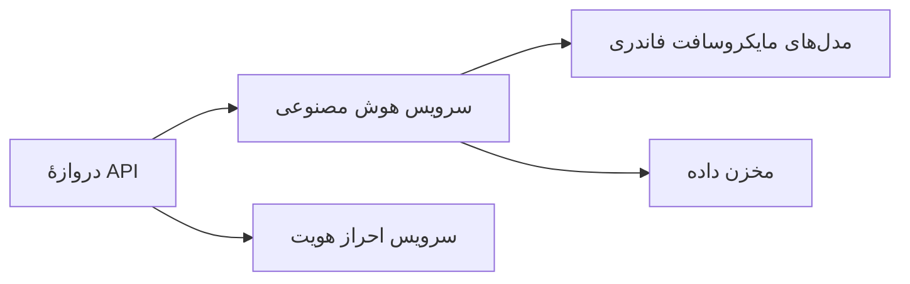
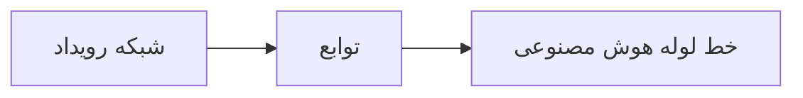

# فصل ۸: الگوهای تولید و سازمانی

**📚 دوره**: [AZD برای مبتدیان](../../README.md) | **⏱️ مدت**: 2-3 ساعت | **⭐ پیچیدگی**: پیشرفته

---

## مرور کلی

این فصل الگوهای استقرار مناسب برای سازمان، سخت‌سازی امنیت، پایش و بهینه‌سازی هزینه برای بارکاری‌های تولیدی هوش مصنوعی را پوشش می‌دهد.

## اهداف یادگیری

با تکمیل این فصل، شما:
- استقرار برنامه‌های مقاوم در چند منطقه
- پیاده‌سازی الگوهای امنیتی سازمانی
- پیکربندی مانیتورینگ جامع
- بهینه‌سازی هزینه‌ها در مقیاس
- راه‌اندازی خطوط CI/CD با AZD

---

## 📚 درس‌ها

| # | درس | توضیحات | زمان |
|---|--------|-------------|------|
| 1 | [Production AI Practices](production-ai-practices.md) | الگوهای استقرار سازمانی | 90 دقیقه |

---

## 🚀 چک‌لیست تولید

- [ ] استقرار چندمنطقه‌ای برای تاب‌آوری
- [ ] هویت مدیریت‌شده برای احراز هویت (بدون کلیدها)
- [ ] Application Insights برای مانیتورینگ
- [ ] بودجه‌ها و هشدارهای هزینه پیکربندی شده
- [ ] اسکن امنیتی فعال شده
- [ ] یکپارچه‌سازی خط‌لوله CI/CD
- [ ] طرح بازیابی از فاجعه

---

## 🏗️ الگوهای معماری

### الگو ۱: میکروسرویس‌های هوش مصنوعی


### الگو ۲: هوش مصنوعی رویدادمحور


---

## 🔐 بهترین شیوه‌های امنیتی

```bicep
// Use managed identity
identity: {
  type: 'SystemAssigned'
}

// Private endpoints for AI services
properties: {
  publicNetworkAccess: 'Disabled'
  networkAcls: {
    defaultAction: 'Deny'
  }
}
```

---

## 💰 بهینه‌سازی هزینه

| استراتژی | صرفه‌جویی |
|----------|---------|
| مقیاس تا صفر (Container Apps) | 60-80% |
| استفاده از سطوح مصرف برای توسعه | 50-70% |
| مقیاس‌بندی برنامه‌ریزی‌شده | 30-50% |
| ظرفیت رزروشده | 20-40% |

```bash
# هشدارهای بودجه را تنظیم کنید
az consumption budget create \
  --budget-name "AI-Budget" \
  --amount 500 \
  --category Cost \
  --time-grain Monthly
```

---

## 📊 پیکربندی مانیتورینگ

```bash
# نمایش زنده لاگ‌ها
azd monitor --logs

# بررسی Application Insights
azd monitor

# مشاهده معیارها
az monitor metrics list --resource <resource-id>
```

---

## 🔗 ناوبری

| جهت | فصل |
|-----------|---------|
| **قبلی** | [فصل ۷: رفع اشکال](../chapter-07-troubleshooting/README.md) |
| **پایان دوره** | [صفحه اصلی دوره](../../README.md) |

---

## 📖 منابع مرتبط

- [راهنمای عامل‌های هوش مصنوعی](../chapter-02-ai-development/agents.md)
- [Application Insights](../chapter-06-pre-deployment/application-insights.md)
- [راهکارهای چندعامله](../chapter-05-multi-agent/README.md)
- [مثال میکروسرویس‌ها](../../examples/microservices/README.md)

---

<!-- CO-OP TRANSLATOR DISCLAIMER START -->
**سلب مسئولیت**:
این سند با استفاده از سرویس ترجمهٔ هوش مصنوعی [Co-op Translator](https://github.com/Azure/co-op-translator) ترجمه شده است. در حالی که ما در تلاش برای دقت هستیم، لطفاً توجه داشته باشید که ترجمه‌های خودکار ممکن است حاوی خطاها یا نادرستی‌هایی باشند. سند اصلی به زبان مبدأ باید به‌عنوان منبع معتبر در نظر گرفته شود. برای اطلاعات حیاتی، ترجمهٔ حرفه‌ای توسط مترجم انسانی توصیه می‌شود. ما مسئول هیچ‌گونه سوءتفاهم یا تفسیر نادرستی که از استفاده از این ترجمه ناشی شود، نیستیم.
<!-- CO-OP TRANSLATOR DISCLAIMER END -->