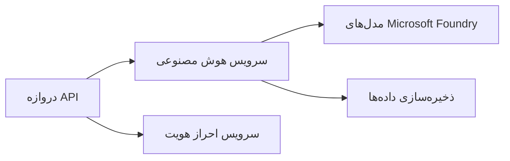

# فصل ۸: الگوهای تولید و سازمانی

**📚 دوره**: [AZD برای مبتدیان](../../README.md) | **⏱️ مدت زمان**: ۲-۳ ساعت | **⭐ پیچیدگی**: پیشرفته

---

## مرور کلی

این فصل الگوهای استقرار مناسب سازمانی، سخت‌سازی امنیت، نظارت و بهینه‌سازی هزینه‌ها برای بارهای کاری هوش مصنوعی در محیط تولید را پوشش می‌دهد.

> مورد تایید `azd 1.27.1` در جولای ۲۰۲۶.

## اهداف یادگیری

با تکمیل این فصل، شما قادر خواهید بود:
- استقرار برنامه‌های مقاوم چندمنطقه‌ای
- پیاده‌سازی الگوهای امنیتی سازمانی
- پیکربندی نظارت جامع
- بهینه‌سازی هزینه‌ها در مقیاس
- راه‌اندازی خطوط CI/CD با AZD

---

## 📚 درس‌ها

| # | درس | توضیحات | زمان |
|---|--------|-------------|------|
| 1 | [تمرین‌های هوش مصنوعی در تولید](production-ai-practices.md) | الگوهای استقرار سازمانی | ۹۰ دقیقه |

---

## 🚀 فهرست بررسی تولید

- [ ] استقرار چندمنطقه‌ای برای مقاومت
- [ ] هویت مدیریت‌شده برای احراز هویت (بدون کلید)
- [ ] Application Insights برای نظارت
- [ ] بودجه‌ها و هشدارهای هزینه پیکربندی شده
- [ ] اسکن امنیتی فعال شده
- [ ] یکپارچه‌سازی خط لوله CI/CD
- [ ] طرح بازیابی از بلایای احتمالی

---

## 🏗️ الگوهای معماری

### الگو ۱: میکروسرویس‌های هوش مصنوعی



### الگو ۲: هوش مصنوعی رویداد محور


---

## 🔐 بهترین روش‌های امنیتی

```bicep
// Use managed identity
identity: {
  type: 'SystemAssigned'
}

// Private endpoints for AI services
properties: {
  publicNetworkAccess: 'Disabled'
  networkAcls: {
    defaultAction: 'Deny'
  }
}
```

---

## 💰 بهینه‌سازی هزینه‌ها

| استراتژی | صرفه‌جویی |
|----------|---------|
| مقیاس به صفر (برنامه‌های کانتینری) | ۶۰-۸۰٪ |
| استفاده از لایه‌های مصرفی برای توسعه | ۵۰-۷۰٪ |
| مقیاس‌بندی برنامه‌ریزی شده | ۳۰-۵۰٪ |
| ظرفیت رزرو شده | ۲۰-۴۰٪ |

```bash
# تنظیم هشدارهای بودجه
az consumption budget create \
  --budget-name "AI-Budget" \
  --amount 500 \
  --category Cost \
  --time-grain Monthly
```

---

## 📊 تنظیمات نظارت

```bash
# پخش لاگ‌ها
azd monitor --logs

# بررسی Application Insights
azd monitor --overview

# مشاهده معیارها
az monitor metrics list --resource <resource-id>
```

---

## 🔗 ناوبری

| جهت | فصل |
|-----------|---------|
| **قبلی** | [فصل ۷: عیب‌یابی](../chapter-07-troubleshooting/README.md) |
| **پایان دوره** | [صفحه اصلی دوره](../../README.md) |

---

## 📖 منابع مرتبط

- [راهنمای عامل‌های هوش مصنوعی](../chapter-02-ai-development/agents.md)
- [Application Insights](../chapter-06-pre-deployment/application-insights.md)
- [راه‌حل‌های چندعامله](../chapter-05-multi-agent/README.md)
- [نمونه میکروسرویس‌ها](../../examples/microservices/README.md)

---

<!-- CO-OP TRANSLATOR DISCLAIMER START -->
**سلب مسئولیت**:
این سند با استفاده از سرویس ترجمه هوش مصنوعی [Co-op Translator](https://github.com/Azure/co-op-translator) ترجمه شده است. در حالی که ما در تلاش برای دقت هستیم، لطفاً توجه داشته باشید که ترجمه‌های خودکار ممکن است شامل خطاها یا نادرستی‌هایی باشند. سند اصلی به زبان مادری خود باید به عنوان منبع معتبر در نظر گرفته شود. برای اطلاعات حیاتی، ترجمه حرفه‌ای انسانی توصیه می‌شود. ما در قبال هرگونه سوء تفاهم یا برداشت نادرست ناشی از استفاده از این ترجمه مسئولیتی نداریم.
<!-- CO-OP TRANSLATOR DISCLAIMER END -->