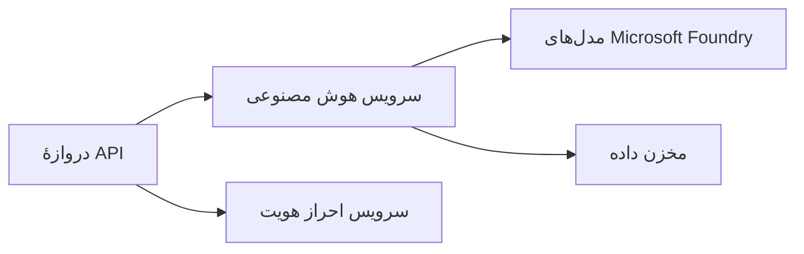
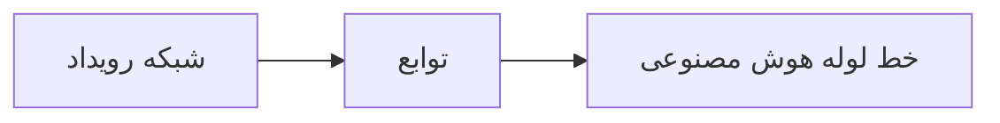

# فصل 8: الگوهای تولید و سازمانی

**📚 دوره**: [AZD برای مبتدیان](../../README.md) | **⏱️ مدت زمان**: 2-3 ساعت | **⭐ پیچیدگی**: پیشرفته

---

## مرور کلی

این فصل الگوهای استقرار آماده سازمان، سخت‌سازی امنیت، نظارت و بهینه‌سازی هزینه برای بارهای کاری هوش مصنوعی در محیط تولید را پوشش می‌دهد.

> تأیید شده با `azd 1.25.6` در ژوئن 2026.

## اهداف یادگیری

با تکمیل این فصل، شما قادر خواهید بود:
- استقرار برنامه‌های مقاوم در چند منطقه
- پیاده‌سازی الگوهای امنیتی سازمانی
- پیکربندی مانیتورینگ جامع
- بهینه‌سازی هزینه‌ها در مقیاس
- راه‌اندازی خط‌های CI/CD با AZD

---

## 📚 درس‌ها

| # | درس | توضیحات | زمان |
|---|--------|-------------|------|
| 1 | [شیوه‌های تولیدی هوش مصنوعی](production-ai-practices.md) | الگوهای استقرار سازمانی | 90 دقیقه |

---

## 🚀 چک‌لیست تولید

- [ ] استقرار چندمنطقه‌ای برای تاب‌آوری
- [ ] هویت مدیریت‌شده برای احراز هویت (بدون کلیدها)
- [ ] Application Insights برای مانیتورینگ
- [ ] بودجه‌ها و هشدارهای هزینه پیکربندی شده
- [ ] اسکن امنیتی فعال
- [ ] ادغام خط لوله CI/CD
- [ ] برنامه بازیابی از فاجعه

---

## 🏗️ الگوهای معماری

### الگو 1: میکروسرویس‌های هوش مصنوعی



### الگو 2: هوش مصنوعی رویدادمحور



---

## 🔐 بهترین روش‌های امنیتی

```bicep
// Use managed identity
identity: {
  type: 'SystemAssigned'
}

// Private endpoints for AI services
properties: {
  publicNetworkAccess: 'Disabled'
  networkAcls: {
    defaultAction: 'Deny'
  }
}
```

---

## 💰 بهینه‌سازی هزینه

| استراتژی | صرفه‌جویی |
|----------|---------|
| مقیاس‌دهی تا صفر (Container Apps) | 60-80% |
| استفاده از سطوح مصرف برای توسعه | 50-70% |
| مقیاس‌دهی زمان‌بندی‌شده | 30-50% |
| ظرفیت رزرو شده | 20-40% |

```bash
# هشدارهای بودجه را تنظیم کنید
az consumption budget create \
  --budget-name "AI-Budget" \
  --amount 500 \
  --category Cost \
  --time-grain Monthly
```

---

## 📊 تنظیمات مانیتورینگ

```bash
# پخش زنده لاگ‌ها
azd monitor --logs

# بررسی Application Insights
azd monitor --overview

# مشاهدهٔ معیارها
az monitor metrics list --resource <resource-id>
```

---

## 🔗 ناوبری

| جهت | فصل |
|-----------|---------|
| **قبلی** | [فصل 7: عیب‌یابی](../chapter-07-troubleshooting/README.md) |
| **پایان دوره** | [صفحه دوره](../../README.md) |

---

## 📖 منابع مرتبط

- [راهنمای عوامل هوش مصنوعی](../chapter-02-ai-development/agents.md)
- [Application Insights](../chapter-06-pre-deployment/application-insights.md)
- [راه‌حل‌های چندعامل](../chapter-05-multi-agent/README.md)
- [نمونه میکروسرویس‌ها](../../examples/microservices/README.md)

---

<!-- CO-OP TRANSLATOR DISCLAIMER START -->
**سلب مسئولیت**:
این سند با استفاده از سرویس ترجمه هوش مصنوعی [Co-op Translator](https://github.com/Azure/co-op-translator) ترجمه شده است. در حالی که ما در تلاش برای دقت هستیم، لطفاً توجه داشته باشید که ترجمه‌های خودکار ممکن است شامل خطاها یا نادرستی‌هایی باشند. سند اصلی به زبان مادری خود باید به عنوان منبع معتبر در نظر گرفته شود. برای اطلاعات حیاتی، ترجمه حرفه‌ای انسانی توصیه می‌شود. ما در قبال هرگونه سوء تفاهم یا برداشت نادرست ناشی از استفاده از این ترجمه مسئولیتی نداریم.
<!-- CO-OP TRANSLATOR DISCLAIMER END -->