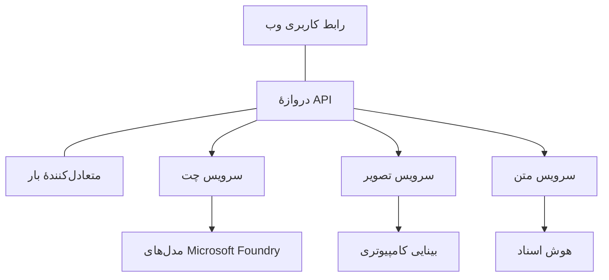

# بهترین شیوه‌ها برای بارهای کاری تولیدی هوش مصنوعی با AZD

**هدایت فصل:**
- **📚 صفحه دوره**: [AZD برای مبتدیان](../../README.md)
- **📖 فصل جاری**: فصل 8 - الگوهای تولیدی و سازمانی
- **⬅️ فصل قبلی**: [فصل 7: رفع اشکال](../chapter-07-troubleshooting/debugging.md)
- **⬅️ همچنین مرتبط**: [کارگاه آموزش هوش مصنوعی](ai-workshop-lab.md)
- **🎯 تکمیل دوره**: [AZD برای مبتدیان](../../README.md)

## نمای کلی

این راهنما بهترین شیوه‌ها را برای استقرار بارهای کاری آماده تولید هوش مصنوعی با استفاده از Azure Developer CLI (AZD) به‌صورت جامع ارائه می‌دهد. بر اساس بازخورد جامعه Microsoft Foundry در Discord و استقرارهای واقعی مشتریان، این شیوه‌ها به متداول‌ترین چالش‌ها در سیستم‌های هوش مصنوعی تولیدی می‌پردازند.

## چالش‌های کلیدی که مطرح شده‌اند

بر اساس نتایج نظرسنجی جامعه، این‌ها مهم‌ترین چالش‌هایی هستند که توسعه‌دهندگان با آن مواجه‌اند:

- **45%** در استقرارهای هوش مصنوعی چندسرویسی مشکل دارند
- **38%** مسائل مربوط به مدیریت اعتبارنامه و اسرار دارند  
- **35%** آماده‌سازی برای تولید و مقیاس‌دهی را دشوار می‌دانند
- **32%** به استراتژی‌های بهتر بهینه‌سازی هزینه نیاز دارند
- **29%** نیاز به بهبود مانیتورینگ و رفع اشکال دارند

## الگوهای معماری برای هوش مصنوعی تولیدی

### الگوی 1: معماری هوش مصنوعی مبتنی بر میکروسرویس‌ها

**چه زمانی استفاده شود**: برنامه‌های پیچیده هوش مصنوعی با قابلیت‌های متعدد



**پیاده‌سازی AZD**:

```yaml
# azure.yaml
name: enterprise-ai-platform
services:
  web:
    project: ./web
    host: staticwebapp
  api-gateway:
    project: ./api-gateway
    host: containerapp
  chat-service:
    project: ./services/chat
    host: containerapp
  vision-service:
    project: ./services/vision
    host: containerapp
  text-service:
    project: ./services/text
    host: containerapp
```

### الگوی 2: پردازش هوش مصنوعی رویداد‌محور

**چه زمانی استفاده شود**: پردازش دسته‌ای، تحلیل اسناد، جریان‌های کاری غیرهمزمان

```bicep
// Event Hub for AI processing pipeline
resource eventHub 'Microsoft.EventHub/namespaces@2023-01-01-preview' = {
  name: eventHubNamespaceName
  location: location
  sku: {
    name: 'Standard'
    tier: 'Standard'
    capacity: 1
  }
}

// Service Bus for reliable message processing
resource serviceBus 'Microsoft.ServiceBus/namespaces@2022-10-01-preview' = {
  name: serviceBusNamespaceName
  location: location
  sku: {
    name: 'Premium'
    tier: 'Premium'
    capacity: 1
  }
}

// Function App for processing
resource functionApp 'Microsoft.Web/sites@2023-01-01' = {
  name: functionAppName
  location: location
  kind: 'functionapp,linux'
  properties: {
    siteConfig: {
      appSettings: [
        {
          name: 'FUNCTIONS_EXTENSION_VERSION'
          value: '~4'
        }
        {
          name: 'AZURE_OPENAI_ENDPOINT'
          value: '@Microsoft.KeyVault(VaultName=${keyVault.name};SecretName=openai-endpoint)'
        }
      ]
    }
  }
}
```

## ملاحظات سلامت عامل‌های هوش مصنوعی

وقتی یک برنامه وب سنتی خراب می‌شود، علائم آشنا هستند: صفحه بارگزاری نمی‌شود، یک API خطا برمی‌گرداند، یا یک استقرار شکست می‌خورد. برنامه‌های مبتنی بر هوش مصنوعی می‌توانند به همان روش‌ها خراب شوند—اما آن‌ها همچنین ممکن است به شکلی ظریف‌تر بدعمل کنند که پیام خطای واضحی تولید نکند.

این بخش به شما کمک می‌کند یک مدل ذهنی برای مانیتورینگ بارهای کاری هوش مصنوعی بسازید تا بدانید در مواقعی که چیزها درست به نظر نمی‌رسند، کجا را باید بررسی کنید.

### چگونه سلامت عامل با سلامت برنامه سنتی تفاوت دارد

یک برنامه سنتی یا کار می‌کند یا کار نمی‌کند. یک عامل هوش مصنوعی ممکن است ظاهراً کار کند اما نتایج ضعیفی تولید کند. سلامت عامل را در دو لایه در نظر بگیرید:

| لایه | چه چیزی را باید رصد کرد | کجا باید نگاه کرد |
|-------|--------------|---------------|
| **سلامت زیرساخت** | آیا سرویس در حال اجراست؟ آیا منابع تامین شده‌اند؟ آیا نقاط انتهایی در دسترس هستند؟ | `azd monitor`, Azure Portal وضعیت منابع، لاگ‌های کانتینر/برنامه |
| **سلامت رفتار** | آیا عامل به‌درستی پاسخ می‌دهد؟ آیا پاسخ‌ها به‌موقع هستند؟ آیا مدل به‌درستی فراخوانی می‌شود؟ | ردیابی‌های Application Insights، معیارهای تاخیر فراخوانی مدل، لاگ‌های کیفیت پاسخ |

سلامت زیرساخت آشناست—برای هر اپ azd یکسان است. سلامت رفتار لایه جدیدی است که بارهای کاری هوش مصنوعی معرفی می‌کنند.

### کجا را بررسی کنیم وقتی برنامه‌های هوش مصنوعی طبق انتظار رفتار نمی‌کنند

اگر برنامه هوش مصنوعی شما نتایجی که انتظار دارید تولید نمی‌کند، این یک چک‌لیست مفهومی است:

1. **با اصول شروع کنید.** آیا برنامه در حال اجراست؟ آیا می‌تواند به وابستگی‌های خود دسترسی پیدا کند؟ مانند هر برنامه دیگری `azd monitor` و وضعیت منابع را بررسی کنید.
2. **اتصال به مدل را بررسی کنید.** آیا برنامه شما با موفقیت مدل هوش مصنوعی را فراخوانی می‌کند؟ فراخوانی‌های مدل که شکست می‌خورند یا تایم‌اوت می‌شوند، شایع‌ترین علت مشکلات برنامه‌های هوش مصنوعی هستند و در لاگ‌های برنامه شما ظاهر خواهند شد.
3. **نگاه کنید مدل چه چیزی دریافت کرده است.** پاسخ‌های هوش مصنوعی به ورودی وابسته‌اند (پرومپت و هر زمینه بازیابی‌شده). اگر خروجی اشتباه است، معمولاً ورودی اشتباه است. بررسی کنید آیا برنامه شما داده‌های درستی را به مدل می‌فرستد یا خیر.
4. **تاخیر پاسخ را بازبینی کنید.** فراخوانی‌های مدل هوش مصنوعی کندتر از فراخوانی‌های معمول API هستند. اگر برنامه شما کند به‌نظر می‌رسد، بررسی کنید آیا زمان پاسخ مدل افزایش یافته است—این می‌تواند نشان‌دهنده محدودسازی، محدودیت‌های ظرفیت، یا تراکم در سطح منطقه باشد.
5. **به سیگنال‌های هزینه توجه کنید.** جهش‌های غیرمنتظره در مصرف توکن یا فراخوانی‌های API می‌تواند نشان‌دهنده یک حلقه، پرومپت پیکربندی‌شده نادرست، یا تلاش‌های مجدد بیش‌ازحد باشد.

لازم نیست فوراً ابزارهای مشاهده‌پذیری را به‌خوبی بشناسید. نکته کلیدی این است که برنامه‌های هوش مصنوعی یک لایه رفتار اضافی برای مانیتور کردن دارند، و مانیتورینگ داخلی azd (`azd monitor`) نقطه شروعی برای بررسی هر دو لایه در اختیار شما می‌گذارد.

---

## بهترین شیوه‌های امنیتی

### 1. مدل امنیتی صفر-اعتماد

**استراتژی پیاده‌سازی**:
- هیچ ارتباط سرویس-به-سرویس بدون احراز هویت مجاز نیست
- همه فراخوانی‌های API از شناسه‌های مدیریت‌شده استفاده کنند
- ایزولاسیون شبکه با Private Endpoints
- کنترل‌های دسترسی با حداقل امتیازات

```bicep
// Managed Identity for each service
resource chatServiceIdentity 'Microsoft.ManagedIdentity/userAssignedIdentities@2023-01-31' = {
  name: 'chat-service-identity'
  location: location
}

// Role assignments with minimal permissions
resource openAIUserRole 'Microsoft.Authorization/roleAssignments@2022-04-01' = {
  scope: openAIAccount
  name: guid(openAIAccount.id, chatServiceIdentity.id, openAIUserRoleDefinitionId)
  properties: {
    roleDefinitionId: subscriptionResourceId('Microsoft.Authorization/roleDefinitions', '5e0bd9bd-7b93-4f28-af87-19fc36ad61bd')
    principalId: chatServiceIdentity.properties.principalId
    principalType: 'ServicePrincipal'
  }
}
```

### 2. مدیریت امن اسرار

**الگوی یکپارچه‌سازی Key Vault**:

```bicep
// Key Vault with proper access policies
resource keyVault 'Microsoft.KeyVault/vaults@2023-02-01' = {
  name: keyVaultName
  location: location
  properties: {
    tenantId: tenant().tenantId
    sku: {
      family: 'A'
      name: 'premium'  // Use premium for production
    }
    enableRbacAuthorization: true  // Use RBAC instead of access policies
    enablePurgeProtection: true    // Prevent accidental deletion
    enableSoftDelete: true
    softDeleteRetentionInDays: 90
  }
}

// Store all AI service credentials
resource openAIKeySecret 'Microsoft.KeyVault/vaults/secrets@2023-02-01' = {
  parent: keyVault
  name: 'openai-api-key'
  properties: {
    value: openAIAccount.listKeys().key1
    attributes: {
      enabled: true
    }
  }
}
```

### 3. امنیت شبکه

**پیکربندی Private Endpoint**:

```bicep
// Virtual Network for AI services
resource virtualNetwork 'Microsoft.Network/virtualNetworks@2023-04-01' = {
  name: vnetName
  location: location
  properties: {
    addressSpace: {
      addressPrefixes: ['10.0.0.0/16']
    }
    subnets: [
      {
        name: 'ai-services-subnet'
        properties: {
          addressPrefix: '10.0.1.0/24'
          privateEndpointNetworkPolicies: 'Disabled'
        }
      }
      {
        name: 'app-services-subnet'
        properties: {
          addressPrefix: '10.0.2.0/24'
          delegations: [
            {
              name: 'Microsoft.Web/serverFarms'
              properties: {
                serviceName: 'Microsoft.Web/serverFarms'
              }
            }
          ]
        }
      }
    ]
  }
}

// Private endpoints for all AI services
resource openAIPrivateEndpoint 'Microsoft.Network/privateEndpoints@2023-04-01' = {
  name: '${openAIAccountName}-pe'
  location: location
  properties: {
    subnet: {
      id: virtualNetwork.properties.subnets[0].id
    }
    privateLinkServiceConnections: [
      {
        name: 'openai-connection'
        properties: {
          privateLinkServiceId: openAIAccount.id
          groupIds: ['account']
        }
      }
    ]
  }
}
```

## عملکرد و مقیاس‌پذیری

### 1. استراتژی‌های خودکار مقیاس‌پذیری

**مقیاس‌پذیری خودکار Container Apps**:

```bicep
resource containerApp 'Microsoft.App/containerApps@2023-05-01' = {
  name: containerAppName
  location: location
  properties: {
    configuration: {
      ingress: {
        external: true
        targetPort: 8000
        transport: 'http'
      }
    }
    template: {
      scale: {
        minReplicas: 2  // Always have 2 instances minimum
        maxReplicas: 50 // Scale up to 50 for high load
        rules: [
          {
            name: 'http-scaling'
            http: {
              metadata: {
                concurrentRequests: '20'  // Scale when >20 concurrent requests
              }
            }
          }
          {
            name: 'cpu-scaling'
            custom: {
              type: 'cpu'
              metadata: {
                type: 'Utilization'
                value: '70'  // Scale when CPU >70%
              }
            }
          }
        ]
      }
    }
  }
}
```

### 2. استراتژی‌های کش کردن

**Redis Cache برای پاسخ‌های هوش مصنوعی**:

```bicep
// Redis Premium for production workloads
resource redisCache 'Microsoft.Cache/redis@2023-04-01' = {
  name: redisCacheName
  location: location
  properties: {
    sku: {
      name: 'Premium'
      family: 'P'
      capacity: 1
    }
    enableNonSslPort: false
    minimumTlsVersion: '1.2'
    redisConfiguration: {
      'maxmemory-policy': 'allkeys-lru'
    }
    // Enable clustering for high availability
    redisVersion: '6.0'
    shardCount: 2
  }
}

// Cache configuration in application
var cacheConnectionString = '${redisCache.properties.hostName}:6380,password=${redisCache.listKeys().primaryKey},ssl=True,abortConnect=False'
```

### 3. بالانس بار و مدیریت ترافیک

**Application Gateway با WAF**:

```bicep
// Application Gateway with Web Application Firewall
resource applicationGateway 'Microsoft.Network/applicationGateways@2023-04-01' = {
  name: appGatewayName
  location: location
  properties: {
    sku: {
      name: 'WAF_v2'
      tier: 'WAF_v2'
      capacity: 2
    }
    webApplicationFirewallConfiguration: {
      enabled: true
      firewallMode: 'Prevention'
      ruleSetType: 'OWASP'
      ruleSetVersion: '3.2'
    }
    // Backend pools for AI services
    backendAddressPools: [
      {
        name: 'ai-services-pool'
        properties: {
          backendAddresses: [
            {
              fqdn: '${containerApp.properties.configuration.ingress.fqdn}'
            }
          ]
        }
      }
    ]
  }
}
```

## 💰 بهینه‌سازی هزینه

### 1. تنظیم صحیح منابع

**پیکربندی‌های مخصوص محیط**:

```bash
# محیط توسعه
azd env new development
azd env set AZURE_OPENAI_SKU "S0"
azd env set AZURE_OPENAI_CAPACITY 10
azd env set AZURE_SEARCH_SKU "basic"
azd env set CONTAINER_CPU 0.5
azd env set CONTAINER_MEMORY 1.0

# محیط تولید
azd env new production
azd env set AZURE_OPENAI_SKU "S0"
azd env set AZURE_OPENAI_CAPACITY 100
azd env set AZURE_SEARCH_SKU "standard"
azd env set CONTAINER_CPU 2.0
azd env set CONTAINER_MEMORY 4.0
```

### 2. مانیتورینگ هزینه و بودجه‌ها

```bicep
// Cost management and budgets
resource budget 'Microsoft.Consumption/budgets@2023-05-01' = {
  name: 'ai-workload-budget'
  properties: {
    timePeriod: {
      startDate: '2024-01-01'
      endDate: '2024-12-31'
    }
    timeGrain: 'Monthly'
    amount: 2000  // $2000 monthly budget
    category: 'Cost'
    notifications: {
      warning: {
        enabled: true
        operator: 'GreaterThan'
        threshold: 80
        contactEmails: [
          'finance@company.com'
          'engineering@company.com'
        ]
        contactRoles: [
          'Owner'
          'Contributor'
        ]
      }
      critical: {
        enabled: true
        operator: 'GreaterThan'
        threshold: 95
        contactEmails: [
          'cto@company.com'
        ]
      }
    }
  }
}
```

### 3. بهینه‌سازی استفاده از توکن

**مدیریت هزینه OpenAI**:

```typescript
// بهینه‌سازی توکن در سطح برنامه
class TokenOptimizer {
  private readonly maxTokens = 4000;
  private readonly reserveTokens = 500;
  
  optimizePrompt(userInput: string, context: string): string {
    const availableTokens = this.maxTokens - this.reserveTokens;
    const estimatedTokens = this.estimateTokens(userInput + context);
    
    if (estimatedTokens > availableTokens) {
      // زمینه را کوتاه کنید، نه ورودی کاربر
      context = this.truncateContext(context, availableTokens - this.estimateTokens(userInput));
    }
    
    return `${context}\n\nUser: ${userInput}`;
  }
  
  private estimateTokens(text: string): number {
    // تخمین تقریبی: ۱ توکن ≈ ۴ کاراکتر
    return Math.ceil(text.length / 4);
  }
}
```

## مانیتورینگ و مشاهده‌پذیری

### 1. Application Insights جامع

```bicep
// Application Insights with advanced features
resource applicationInsights 'Microsoft.Insights/components@2020-02-02' = {
  name: applicationInsightsName
  location: location
  kind: 'web'
  properties: {
    Application_Type: 'web'
    WorkspaceResourceId: logAnalyticsWorkspace.id
    SamplingPercentage: 100  // Full sampling for AI apps
    DisableIpMasking: false  // Enable for security
  }
}

// Custom metrics for AI operations
resource aiMetricAlerts 'Microsoft.Insights/metricAlerts@2018-03-01' = {
  name: 'ai-high-error-rate'
  location: 'global'
  properties: {
    description: 'Alert when AI service error rate is high'
    severity: 2
    enabled: true
    scopes: [
      applicationInsights.id
    ]
    evaluationFrequency: 'PT1M'
    windowSize: 'PT5M'
    criteria: {
      'odata.type': 'Microsoft.Azure.Monitor.SingleResourceMultipleMetricCriteria'
      allOf: [
        {
          name: 'high-error-rate'
          metricName: 'requests/failed'
          operator: 'GreaterThan'
          threshold: 10
          timeAggregation: 'Count'
        }
      ]
    }
  }
}
```

### 2. مانیتورینگ مخصوص هوش مصنوعی

**داشبوردهای سفارشی برای معیارهای هوش مصنوعی**:

```json
// Dashboard configuration for AI workloads
{
  "dashboard": {
    "name": "AI Application Monitoring",
    "tiles": [
      {
        "name": "OpenAI Request Volume",
        "query": "requests | where name contains 'openai' | summarize count() by bin(timestamp, 5m)"
      },
      {
        "name": "AI Response Latency",
        "query": "requests | where name contains 'openai' | summarize avg(duration) by bin(timestamp, 5m)"
      },
      {
        "name": "Token Usage",
        "query": "customMetrics | where name == 'openai_tokens_used' | summarize sum(value) by bin(timestamp, 1h)"
      },
      {
        "name": "Cost per Hour",
        "query": "customMetrics | where name == 'openai_cost' | summarize sum(value) by bin(timestamp, 1h)"
      }
    ]
  }
}
```

### 3. بررسی سلامت و مانیتورینگ زمانِ در دسترس بودن

```bicep
// Application Insights availability tests
resource availabilityTest 'Microsoft.Insights/webtests@2022-06-15' = {
  name: 'ai-app-availability-test'
  location: location
  tags: {
    'hidden-link:${applicationInsights.id}': 'Resource'
  }
  properties: {
    SyntheticMonitorId: 'ai-app-availability-test'
    Name: 'AI Application Availability Test'
    Description: 'Tests AI application endpoints'
    Enabled: true
    Frequency: 300  // 5 minutes
    Timeout: 120    // 2 minutes
    Kind: 'ping'
    Locations: [
      {
        Id: 'us-east-2-azr'
      }
      {
        Id: 'us-west-2-azr'
      }
    ]
    Configuration: {
      WebTest: '''
        <WebTest Name="AI Health Check" 
                 Id="8d2de8d2-a2b0-4c2e-9a0d-8f9c9a0b8c8d" 
                 Enabled="True" 
                 CssProjectStructure="" 
                 CssIteration="" 
                 Timeout="120" 
                 WorkItemIds="" 
                 xmlns="http://microsoft.com/schemas/VisualStudio/TeamTest/2010" 
                 Description="" 
                 CredentialUserName="" 
                 CredentialPassword="" 
                 PreAuthenticate="True" 
                 Proxy="default" 
                 StopOnError="False" 
                 RecordedResultFile="" 
                 ResultsLocale="">
          <Items>
            <Request Method="GET" 
                     Guid="a5f10126-e4cd-570d-961c-cea43999a200" 
                     Version="1.1" 
                     Url="${webApp.properties.defaultHostName}/health" 
                     ThinkTime="0" 
                     Timeout="120" 
                     ParseDependentRequests="True" 
                     FollowRedirects="True" 
                     RecordResult="True" 
                     Cache="False" 
                     ResponseTimeGoal="0" 
                     Encoding="utf-8" 
                     ExpectedHttpStatusCode="200" 
                     ExpectedResponseUrl="" 
                     ReportingName="" 
                     IgnoreHttpStatusCode="False" />
          </Items>
        </WebTest>
      '''
    }
  }
}
```

## بازیابی از فاجعه و دسترسی بالا

### 1. استقرار چندمنطقه‌ای

```yaml
# azure.yaml - Multi-region configuration
name: ai-app-multiregion
services:
  api-primary:
    project: ./api
    host: containerapp
    env:
      - AZURE_REGION=eastus
  api-secondary:
    project: ./api
    host: containerapp
    env:
      - AZURE_REGION=westus2
```

```bicep
// Traffic Manager for global load balancing
resource trafficManager 'Microsoft.Network/trafficManagerProfiles@2022-04-01' = {
  name: trafficManagerProfileName
  location: 'global'
  properties: {
    profileStatus: 'Enabled'
    trafficRoutingMethod: 'Priority'
    dnsConfig: {
      relativeName: trafficManagerProfileName
      ttl: 30
    }
    monitorConfig: {
      protocol: 'HTTPS'
      port: 443
      path: '/health'
      intervalInSeconds: 30
      toleratedNumberOfFailures: 3
      timeoutInSeconds: 10
    }
    endpoints: [
      {
        name: 'primary-endpoint'
        type: 'Microsoft.Network/trafficManagerProfiles/azureEndpoints'
        properties: {
          targetResourceId: primaryAppService.id
          endpointStatus: 'Enabled'
          priority: 1
        }
      }
      {
        name: 'secondary-endpoint'
        type: 'Microsoft.Network/trafficManagerProfiles/azureEndpoints'
        properties: {
          targetResourceId: secondaryAppService.id
          endpointStatus: 'Enabled'
          priority: 2
        }
      }
    ]
  }
}
```

### 2. پشتیبان‌گیری و بازیابی داده‌ها

```bicep
// Backup configuration for critical data
resource backupVault 'Microsoft.DataProtection/backupVaults@2023-05-01' = {
  name: backupVaultName
  location: location
  identity: {
    type: 'SystemAssigned'
  }
  properties: {
    storageSettings: [
      {
        datastoreType: 'VaultStore'
        type: 'LocallyRedundant'
      }
    ]
  }
}

// Backup policy for AI models and data
resource backupPolicy 'Microsoft.DataProtection/backupVaults/backupPolicies@2023-05-01' = {
  parent: backupVault
  name: 'ai-data-backup-policy'
  properties: {
    policyRules: [
      {
        backupParameters: {
          backupType: 'Full'
          objectType: 'AzureBackupParams'
        }
        trigger: {
          schedule: {
            repeatingTimeIntervals: [
              'R/2024-01-01T02:00:00+00:00/P1D'  // Daily at 2 AM
            ]
          }
          objectType: 'ScheduleBasedTriggerContext'
        }
        dataStore: {
          datastoreType: 'VaultStore'
          objectType: 'DataStoreInfoBase'
        }
        name: 'BackupDaily'
        objectType: 'AzureBackupRule'
      }
    ]
  }
}
```

## DevOps و یکپارچه‌سازی CI/CD

### 1. جریان کاری GitHub Actions

```yaml
# .github/workflows/deploy-ai-app.yml
name: Deploy AI Application

on:
  push:
    branches: [main]
  pull_request:
    branches: [main]

jobs:
  test:
    runs-on: ubuntu-latest
    steps:
      - uses: actions/checkout@v4
      
      - name: Setup Python
        uses: actions/setup-python@v4
        with:
          python-version: '3.11'
          
      - name: Install dependencies
        run: |
          pip install -r requirements.txt
          pip install pytest
          
      - name: Run tests
        run: pytest tests/
        
      - name: AI Safety Tests
        run: |
          python scripts/test_ai_safety.py
          python scripts/validate_prompts.py

  deploy-staging:
    needs: test
    if: github.event_name == 'pull_request'
    runs-on: ubuntu-latest
    steps:
      - uses: actions/checkout@v4
      
      - name: Setup AZD
        uses: Azure/setup-azd@v2
        
      - name: Login to Azure
        uses: azure/login@v1
        with:
          creds: ${{ secrets.AZURE_CREDENTIALS }}
          
      - name: Deploy to Staging
        run: |
          azd env select staging
          azd deploy

  deploy-production:
    needs: test
    if: github.ref == 'refs/heads/main'
    runs-on: ubuntu-latest
    steps:
      - uses: actions/checkout@v4
      
      - name: Setup AZD
        uses: Azure/setup-azd@v2
        
      - name: Login to Azure
        uses: azure/login@v1
        with:
          creds: ${{ secrets.AZURE_CREDENTIALS }}
          
      - name: Deploy to Production
        run: |
          azd env select production
          azd deploy
          
      - name: Run Production Health Checks
        run: |
          python scripts/health_check.py --env production
```

### 2. اعتبارسنجی زیرساخت

```bash
# scripts/validate_infrastructure.sh
#!/bin/bash

echo "Validating AI infrastructure deployment..."

# بررسی کنید که همه سرویس‌های مورد نیاز در حال اجرا هستند
services=("openai" "search" "storage" "keyvault")
for service in "${services[@]}"; do
    echo "Checking $service..."
    if ! az resource list --resource-type "Microsoft.CognitiveServices/accounts" --query "[?contains(name, '$service')]" -o tsv; then
        echo "ERROR: $service not found"
        exit 1
    fi
done

# اعتبارسنجی استقرار مدل‌های OpenAI
echo "Validating OpenAI model deployments..."
models=$(az cognitiveservices account deployment list --name $AZURE_OPENAI_NAME --resource-group $AZURE_RESOURCE_GROUP --query "[].name" -o tsv)
if [[ ! $models == *"gpt-4.1-mini"* ]]; then
  echo "ERROR: Required model gpt-4.1-mini not deployed"
    exit 1
fi

# تست اتصال سرویس هوش مصنوعی
echo "Testing AI service connectivity..."
python scripts/test_connectivity.py

echo "Infrastructure validation completed successfully!"
```

## چک‌لیست آمادگی تولید

### امنیت ✅
- [ ] همه سرویس‌ها از شناسه‌های مدیریت‌شده استفاده می‌کنند
- [ ] اسرار در Key Vault ذخیره شده‌اند
- [ ] Private Endpoints پیکربندی شده‌اند
- [ ] گروه‌های امنیت شبکه پیاده‌سازی شده‌اند
- [ ] RBAC با حداقل امتیازات
- [ ] WAF در نقاط انتهایی عمومی فعال است

### عملکرد ✅
- [ ] مقیاس‌پذیری خودکار پیکربندی شده است
- [ ] کش پیاده‌سازی شده است
- [ ] بالانس بار تنظیم شده است
- [ ] CDN برای محتوای ایستا
- [ ] استخرهای اتصال دیتابیس
- [ ] بهینه‌سازی مصرف توکن

### مانیتورینگ ✅
- [ ] Application Insights پیکربندی شده است
- [ ] معیارهای سفارشی تعریف شده‌اند
- [ ] قوانین هشداردهی تنظیم شده‌اند
- [ ] داشبورد ایجاد شده است
- [ ] بررسی‌های سلامت پیاده‌سازی شده‌اند
- [ ] سیاست‌های نگهداری لاگ

### قابلیت اطمینان ✅
- [ ] استقرار چندمنطقه‌ای
- [ ] برنامه پشتیبان‌گیری و بازیابی
- [ ] مدارشکن‌ها پیاده‌سازی شده‌اند
- [ ] سیاست‌های تلاش مجدد پیکربندی شده‌اند
- [ ] کاهش تدریجی و کنترل‌شده
- [ ] نقاط انتهایی بررسی سلامت

### مدیریت هزینه ✅
- [ ] هشدارهای بودجه پیکربندی شده‌اند
- [ ] تنظیم صحیح منابع
- [ ] تخفیف‌های توسعه/آزمایش اعمال شده
- [ ] رزرو نمونه‌ها خریداری شده
- [ ] داشبورد مانیتورینگ هزینه
- [ ] بازبینی‌های منظم هزینه

### انطباق ✅
- [ ] الزامات محل نگهداری داده رعایت شده‌اند
- [ ] لاگ‌گذاری ممیزی فعال شده است
- [ ] سیاست‌های انطباق اعمال شده‌اند
- [ ] خطوط پایه امنیتی پیاده‌سازی شده‌اند
- [ ] ارزیابی‌های امنیتی منظم
- [ ] برنامه پاسخ به حادثه

## معیارهای عملکرد

### معیارهای معمول در تولید

| معیار | هدف | مانیتورینگ |
|--------|--------|------------|
| **زمان پاسخ** | < 2 ثانیه | Application Insights |
| **قابلیت دسترسی** | 99.9% | مانیتورینگ زمانِ در دسترس بودن |
| **نرخ خطا** | < 0.1% | لاگ‌های برنامه |
| **مصرف توکن** | < $500/ماه | مدیریت هزینه |
| **کاربران همزمان** | 1000+ | تست بار |
| **زمان بازیابی** | < 1 ساعت | آزمایش‌های بازیابی از فاجعه |

### تست بار

```bash
# اسکریپت تست بار برای برنامه‌های هوش مصنوعی
python scripts/load_test.py \
  --endpoint https://your-ai-app.azurewebsites.net \
  --concurrent-users 100 \
  --duration 300 \
  --ramp-up 60
```

## 🤝 بهترین شیوه‌های جامعه

بر اساس بازخورد جامعه Microsoft Foundry در Discord:

### برترین توصیه‌ها از جامعه:

1. **کوچک شروع کنید، به‌تدریج مقیاس دهید**: با SKU‌های پایه شروع کنید و بر اساس استفاده واقعی مقیاس دهید
2. **همه‌چیز را مانیتور کنید**: از روز اول مانیتورینگ جامع راه‌اندازی کنید
3. **امنیت را خودکار کنید**: از زیرساخت به‌عنوان کد برای امنیت یکسان استفاده کنید
4. **به‌خوبی تست کنید**: تست‌های مخصوص هوش مصنوعی را در خط لوله خود بگنجانید
5. **برای هزینه‌ها برنامه‌ریزی کنید**: مصرف توکن را مانیتور کنید و زود هشدارهای بودجه را تنظیم کنید

### تله‌های رایج که باید اجتناب شوند:

- ❌ قرار دادن کلیدهای API به‌صورت سخت‌کد در کد
- ❌ راه‌اندازی نکردن مانیتورینگ مناسب
- ❌ نادیده گرفتن بهینه‌سازی هزینه
- ❌ تست نکردن سناریوهای خطا
- ❌ استقرار بدون بررسی‌های سلامت

## دستورات و افزونه‌های AZD AI

AZD مجموعه‌ای رو به رشد از دستورات و افزونه‌های مخصوص هوش مصنوعی دارد که جریان‌های کاری هوش مصنوعی در تولید را ساده می‌کنند. این ابزارها فاصله بین توسعه محلی و استقرار تولید برای بارهای کاری هوش مصنوعی را پر می‌کنند.

### افزونه‌های AZD برای هوش مصنوعی

AZD از یک سیستم افزونه برای افزودن قابلیت‌های مخصوص هوش مصنوعی استفاده می‌کند. افزونه‌ها را نصب و مدیریت کنید با:

```bash
# فهرست تمام افزونه‌های در دسترس (شامل هوش مصنوعی)
azd extension list

# مشاهده جزئیات افزونه‌های نصب‌شده
azd extension show azure.ai.agents

# نصب افزونه Foundry Agents
azd extension install azure.ai.agents

# نصب افزونه تنظیم دقیق
azd extension install azure.ai.finetune

# نصب افزونه مدل‌های سفارشی
azd extension install azure.ai.models

# به‌روزرسانی همه افزونه‌های نصب‌شده
azd extension upgrade --all
```

**افزونه‌های AI موجود:**

| افزونه | هدف | وضعیت |
|-----------|---------|--------|
| `azure.ai.agents` | مدیریت Foundry Agent Service | پیش‌نمایش |
| `azure.ai.skills` | مهارت‌های قابل استفاده مجدد برای عوامل | پیش‌نمایش |
| `azure.ai.connections` | اتصالات Foundry (منابع داده، ابزارها) | پیش‌نمایش |
| `azure.ai.finetune` | تنظیم مجدد مدل در Foundry | پیش‌نمایش |
| `azure.ai.models` | مدل‌های سفارشی Foundry | پیش‌نمایش |
| `azure.coding-agent` | پیکربندی عامل کدنویسی | موجود |

> افزونه `azure.ai.agents` به‌سرعت تکامل می‌یابد. این دوره در برابر نسخه `0.1.40-preview` اعتبارسنجی شده است. برای گرفتن آخرین مجموعه دستورات `azd extension upgrade --all` را اجرا کنید، و برای تأیید نسخه نصب‌شده خود `azd extension show azure.ai.agents` را اجرا کنید.

**افزونه‌های جدیدتر `skills` و `connections` چه هستند؟**

دو افزونه پیش‌نمایش همراه با ابزارهای عامل ظاهر شدند که حتی برای مبتدیان هم درک آن‌ها ارزشمند است:

- **`azure.ai.skills`** — یک **مهارت** یک قابلیت قابل استفاده مجدد (یک ابزار یا رفتار بسته‌بندی‌شده) است که می‌توانید به یک یا چند عامل الصاق کنید به‌جای این‌که هر بار آن را دوباره پیاده‌سازی کنید. به آن به‌عنوان یک بلوک ساخت مشترک فکر کنید: یک مهارت "جستجو در مستندات" یا "یافتن سفارش" را یک‌بار تعریف کنید، سپس در عوامل مختلف دوباره استفاده کنید. این کار سیستم‌های چندعامله (فصل 5) را یکپارچه نگه می‌دارد و از کپی-پیست جلوگیری می‌کند.
- **`azure.ai.connections`** — یک **اتصال** یک لینک مدیریت‌شده از پروژه Foundry شما به یک منبع خارجی است که عوامل شما به آن نیاز دارند—یک منبع داده (مانند Azure AI Search)، یک نقطه انتهایی ابزار، یا سرویس دیگری. اتصالات مرکزیت می‌دهند به اینکه *کجا* و *چگونه* عوامل به داده‌ها دسترسی دارند، بنابراین اعتبارنامه‌ها و نقاط انتهایی در یک مکان تحت حاکمیت زندگی می‌کنند به‌جای پراکنده‌شدن در کد.

برای استقرار اولین عوامل خود به این‌ها نیاز ندارید—در حین یادگیری با `azure.ai.agents` ادامه دهید. زمانی که دیدید همان ابزار را در عوامل مختلف دوباره تکرار می‌کنید به `skills` مراجعه کنید، و زمانی که چندین عامل یک منبع داده مشترک دارند از `connections` استفاده کنید.

### راه‌اندازی پروژه‌های عامل با `azd ai agent init`

دستور `azd ai agent init` یک پروژه عامل هوش مصنوعی آماده تولید را که با Microsoft Foundry Agent Service یکپارچه است اسکافولد می‌کند:

```bash
# یک پروژهٔ جدید عامل را از مانیفست عامل مقداردهی اولیه کنید
azd ai agent init -m <manifest-path-or-uri>

# یک پروژهٔ مشخص Foundry را مقداردهی اولیه کرده و هدف‌گذاری کنید
azd ai agent init -m agent-manifest.yaml --project-id <foundry-project-id>

# با یک دایرکتوری منبع سفارشی مقداردهی اولیه کنید
azd ai agent init -m agent-manifest.yaml --src ./agents/my-agent

# Container Apps را به‌عنوان میزبان هدف قرار دهید
azd ai agent init -m agent-manifest.yaml --host containerapp
```

**پرچم‌های کلیدی:**

| فلگ | توضیحات |
|------|-------------|
| `-m, --manifest` | مسیر یا URI به یک manifest عامل برای اضافه کردن به پروژه شما |
| `-p, --project-id` | شناسه پروژه موجود Microsoft Foundry برای محیط azd شما |
| `-s, --src` | دایرکتوری برای دانلود تعریف عامل (به‌صورت پیش‌فرض `src/<agent-id>`) |
| `--host` | بازنویسی میزبان پیش‌فرض (مثلاً `containerapp`) |
| `-e, --environment` | محیط azd برای استفاده |

نکته تولید: از `--project-id` استفاده کنید تا مستقیماً به یک پروژه Foundry موجود متصل شوید، طوری که کد عامل و منابع ابری شما از ابتدا به هم پیوند داشته باشند.

### مدیریت چرخه عمر عامل

فراتر از `init`، افزونه `azure.ai.agents` دستورات مربوط به چرخه عمر کامل یک عامل میزبانی‌شده—تست، ارزیابی، بهینه‌سازی، و بازنشستگی آن—را فراهم می‌کند:

```bash
# عامل مستقر را فراخوانی کرده و زمان پاسخ‌دهی سرور را مشاهده کنید
# (کل تأخیر و زمان تا اولین بایت)
azd ai agent invoke

# پیکربندی نقطهٔ پایانی زنده را قبل از تغییر نمایش دهید
azd ai agent endpoint show

# یک مجموعه‌دادهٔ ارزیابی برای عامل تولید کنید
azd ai agent eval generate --dataset ./eval/dataset.jsonl

# دستورالعمل‌های عامل را بر اساس داده‌های ارزیابی خود بهینه کنید
# (به یک optimization_model در پروژهٔ عامل نیاز دارد)
azd ai agent optimize

# منبع مستقر شدهٔ عامل میزبانی‌شده مبتنی بر کد را دانلود کنید
# (با اعتبارسنجی SHA-256)
azd ai agent code download

# یک عامل میزبان و همه نسخه‌های آن را حذف کنید
# (--force جلسات فعال را خاتمه می‌دهد)
azd ai agent delete --force
```

**چرخه عمر در یک نگاه:**

| مرحله | دستور | استفاده در تولید |
|-------|---------|----------------|
| تست | `azd ai agent invoke` | اعتبارسنجی پاسخ‌ها و اندازه‌گیری تاخیر قبل از انتشار |
| بازبینی | `azd ai agent endpoint show` | بررسی احراز هویت/پیکربندی نقطه انتهایی؛ شناسایی تغییرات مخرب زودهنگام |
| اندازه‌گیری | `azd ai agent eval generate` | ساخت مجموعه ارزیابی قابل تکرار از ردیابی‌های واقعی |
| بهبود | `azd ai agent optimize` | تنظیم دستورالعمل‌ها بر اساس کیفیت اندازه‌گیری‌شده |
| بازیابی | `azd ai agent code download` | بازیابی سورس دقیق مستقرشده برای حسابرسی/بازگشت |
| بازنشستگی | `azd ai agent delete --force` | از کار انداختن یک عامل و نسخه‌های آن به‌صورت پاک |

> این‌ها دستورات پیش‌نمایش هستند و ممکن است بین نسخه‌های افزونه تغییر کنند. برای دیدن زیر‌دستورات دقیق موجود در نسخه نصب‌شده خود `azd ai agent --help` را اجرا کنید.

### پروتکل زمینه مدل (MCP) با `azd mcp`
AZD includes built-in MCP server support (Alpha), enabling AI agents and tools to interact with your Azure resources through a standardized protocol:

```bash
# سرور MCP را برای پروژهٔ خود راه‌اندازی کنید
azd mcp start

# قوانین رضایت فعلی Copilot برای اجرای ابزار را بازبینی کنید
azd copilot consent list
```

MCP سرور زمینه پروژه‌ی azd شما — محیط‌ها، سرویس‌ها و منابع Azure — را در اختیار ابزارهای توسعه مجهز به هوش مصنوعی قرار می‌دهد. این امکان را فراهم می‌سازد:

- **استقرار مبتنی بر کمک هوش مصنوعی**: اجازه دهید عامل‌های کدنویسی وضعیت پروژه‌ی شما را پرس‌وجو کرده و استقرارها را راه‌اندازی کنند
- **کشف منابع**: ابزارهای هوش مصنوعی می‌توانند منابع Azure مورد استفاده پروژه‌ی شما را کشف کنند
- **مدیریت محیط‌ها**: عامل‌ها می‌توانند بین محیط‌های dev/staging/production جابجا شوند

### تولید زیرساخت با `azd infra generate`

برای بارهای کاری AI در محیط تولید، به‌جای تکیه بر تأمین خودکار می‌توانید زیرساخت را به‌صورت Infrastructure as Code تولید و سفارشی کنید:

```bash
# از تعریف پروژهٔ خود فایل‌های Bicep و Terraform تولید کنید
azd infra generate
```

این کار IaC را روی دیسک می‌نویسد تا بتوانید:
- قبل از استقرار زیرساخت را بازبینی و ممیزی کنید
- سیاست‌های امنیتی سفارشی اضافه کنید (قواعد شبکه، endpointهای خصوصی)
- با فرآیندهای بازبینی IaC موجود یکپارچه شوید
- تغییرات زیرساخت را جدا از کد برنامه در کنترل نسخه نگه دارید

### هوک‌های چرخه عمر در محیط تولید

هوک‌های AZD به شما اجازه می‌دهند منطق سفارشی را در هر مرحله از چرخه عمر استقرار تزریق کنید — که برای جریان‌های کاری AI در تولید حیاتی است:

```yaml
# azure.yaml - Production hooks example
name: ai-production-app
hooks:
  preprovision:
    shell: sh
    run: scripts/validate-quotas.sh    # Check AI model quota before provisioning
  postprovision:
    shell: sh
    run: scripts/configure-networking.sh  # Set up private endpoints
  predeploy:
    shell: sh
    run: scripts/run-ai-safety-tests.sh  # Run prompt safety checks
  postdeploy:
    shell: sh
    run: scripts/smoke-test.sh           # Verify agent responses post-deploy
services:
  agent-api:
    project: ./src/agent
    host: containerapp
    hooks:
      predeploy:
        shell: sh
        run: scripts/validate-model-access.sh  # Per-service hook
```

```bash
# در حین توسعه یک هوک مشخص را به‌صورت دستی اجرا کنید
azd hooks run predeploy
```

**هوک‌های پیشنهادی برای محیط تولید در بارهای کاری هوش مصنوعی:**

| هوک | کاربرد |
|------|----------|
| `preprovision` | اعتبارسنجی سهمیه‌های اشتراک برای ظرفیت مدل‌های AI |
| `postprovision` | پیکربندی endpointهای خصوصی، استقرار وزن‌های مدل |
| `predeploy` | اجرای تست‌های ایمنی AI، اعتبارسنجی الگوهای prompt |
| `postdeploy` | تست ساده پاسخ‌های عامل، بررسی اتصال مدل |

### پیکربندی خط لوله CI/CD

از `azd pipeline config` برای اتصال پروژه‌ی خود به GitHub Actions یا Azure Pipelines با احراز هویت امن Azure استفاده کنید:

```bash
# پیکربندی خط لوله CI/CD (تعاملی)
azd pipeline config

# پیکربندی با یک ارائه‌دهنده مشخص
azd pipeline config --provider github
```

این دستور:
- یک service principal با کمترین دسترسی لازم ایجاد می‌کند
- اعتبارنامه‌های فدراسیون را پیکربندی می‌کند (بدون رازهای ذخیره‌شده)
- فایل تعریف خط لوله شما را تولید یا به‌روز می‌کند
- متغیرهای مورد نیاز را در سیستم CI/CD شما تنظیم می‌کند

#### گام‌به‌گام: نخستین خط لوله GitHub Actions شما

در اینجا راهنمای کامل از یک پروژه‌ی عملی azd تا استقرار خودکار در هر push آمده است.

**1. Make sure your project is on GitHub**

```bash
git init
git add .
git commit -m "Initial azd project"
gh repo create my-ai-app --private --source=. --push
```

**2. Run pipeline config**

```bash
azd pipeline config --provider github
```

azd به‌صورت تعاملی:
- از شما می‌پرسد کدام اشتراک Azure و کدام محیط را هدف قرار دهد
- یک Entra **app registration + service principal** برای خط لوله ایجاد می‌کند
- **federated credentials (OIDC)** را تنظیم می‌کند — بنابراین GitHub با توکن‌های کوتاه‌مدت به Azure احراز هویت می‌کند و **هیچ راز ذخیره‌شده‌ای وجود ندارد**
- متغیرهای مورد نیاز را به مخزن GitHub شما push می‌کند (`AZURE_CLIENT_ID`, `AZURE_TENANT_ID`, `AZURE_SUBSCRIPTION_ID`, `AZURE_ENV_NAME`, `AZURE_LOCATION`)

**3. Understand the generated workflow**

azd فایل `.github/workflows/azure-dev.yml` را اضافه می‌کند. بخش‌های کلیدی شبیه به این هستند:

```yaml
# .github/workflows/azure-dev.yml
on:
  push:
    branches: [ main ]
  workflow_dispatch:        # lets you run it manually too

permissions:
  id-token: write           # required for OIDC federated login
  contents: read

jobs:
  build:
    runs-on: ubuntu-latest
    env:
      AZURE_CLIENT_ID: ${{ vars.AZURE_CLIENT_ID }}
      AZURE_TENANT_ID: ${{ vars.AZURE_TENANT_ID }}
      AZURE_SUBSCRIPTION_ID: ${{ vars.AZURE_SUBSCRIPTION_ID }}
      AZURE_ENV_NAME: ${{ vars.AZURE_ENV_NAME }}
      AZURE_LOCATION: ${{ vars.AZURE_LOCATION }}
    steps:
      - uses: actions/checkout@v4
      - name: Install azd
        uses: Azure/setup-azd@v2
      - name: Log in with OIDC
        run: azd auth login --client-id "$AZURE_CLIENT_ID" --federated-credential-provider "github" --tenant-id "$AZURE_TENANT_ID"
      - name: Provision infrastructure
        run: azd provision --no-prompt
      - name: Deploy application
        run: azd deploy --no-prompt
```

**4. Verify it works**

```bash
# یک تغییر را ارسال کنید تا خط لوله فعال شود
git commit -am "Trigger pipeline" --allow-empty
git push
```

تب **Actions** را در مخزن GitHub خود باز کنید و مشاهده کنید که workflow به‌طور خودکار `azd provision` و `azd deploy` را اجرا می‌کند.

> **چرا اعتبارنامه‌های فدراسیون مهم‌اند:** در گذشته خط لوله‌ها یک client secret را در GitHub ذخیره می‌کردند. اعتبارنامه‌های فدراسیون OIDC آن راز را به‌طور کامل حذف می‌کنند — GitHub در زمان اجرا یک توکن کوتاه‌مدت درخواست می‌کند، که هم ایمن‌تر است و هم نیازی به چرخش یا نشت نیست. این تنظیم پیش‌فرضی است که `azd pipeline config` انجام می‌دهد.

> **رازها در مقابل متغیرها:** شناسه‌های غیرحساس (`AZURE_CLIENT_ID` و غیره) در **variables** مخزن قرار می‌گیرند. اگر برنامه‌ی شما واقعاً به یک راز در زمان ساخت نیاز دارد، آن را به‌عنوان یک GitHub **secret** اضافه کرده و با `${{ secrets.NAME }}` ارجاع دهید — اما ترجیح دهید در زمان اجرا از Key Vault + managed identity استفاده کنید (ببینید [فصل 3](../chapter-03-configuration/authsecurity.md)).

**فرآیند تولیدی با pipeline config:**

```bash
# 1. محیط تولید را راه‌اندازی کنید
azd env new production
azd env set AZURE_OPENAI_CAPACITY 100

# 2. خط لوله را پیکربندی کنید
azd pipeline config --provider github

# 3. خط لوله در هر بار ارسال به شاخهٔ main دستور azd deploy را اجرا می‌کند
```

#### گام‌به‌گام: خطوط لوله Azure DevOps

Azure DevOps را به GitHub Actions ترجیح می‌دهید؟ azd به‌صورت بومی با provider `azdo` آن را پشتیبانی می‌کند. جریان تقریباً یکسان است — azd فایل خط لوله را تولید می‌کند، یک service connection ایجاد می‌کند و احراز هویت را تنظیم می‌نماید.

**1. Make sure you have an Azure DevOps project**

شما به یک organization و یک project در `https://dev.azure.com/<your-org>` نیاز دارید. یک Personal Access Token (PAT) با دسترسی‌های **Build (Read & execute)**، **Code (Read & write)** و **Service Connections (Read, query & manage)** تولید کنید — azd از شما آن را درخواست خواهد کرد.

**2. Configure the pipeline**

```bash
azd pipeline config --provider azdo
```

azd انجام خواهد داد:
- درخواست organization و project Azure DevOps شما را می‌کند
- یک **service connection** به Azure با استفاده از یک service principal ایجاد (یا مجدداً استفاده) می‌کند
- **workload identity federation (OIDC)** را پیکربندی می‌کند تا هیچ client secret ذخیره نشود
- یک تعریف pipeline به نام `azure-dev.yml` را به مخزن شما کامیت می‌کند

**3. Review the generated `azure-dev.yml`**

azd خط لوله‌ای می‌نویسد که در هر push به `main` تأمین و استقرار می‌کند:

```yaml
# azure-dev.yml
trigger:
  - main

pool:
  vmImage: ubuntu-latest

steps:
  - task: setup-azd@1
    displayName: Install azd

  - script: azd provision --no-prompt
    displayName: Provision Infrastructure
    env:
      AZURE_SUBSCRIPTION_ID: $(AZURE_SUBSCRIPTION_ID)
      AZURE_ENV_NAME: $(AZURE_ENV_NAME)
      AZURE_LOCATION: $(AZURE_LOCATION)

  - script: azd deploy --no-prompt
    displayName: Deploy Application
    env:
      AZURE_SUBSCRIPTION_ID: $(AZURE_SUBSCRIPTION_ID)
      AZURE_ENV_NAME: $(AZURE_ENV_NAME)
      AZURE_LOCATION: $(AZURE_LOCATION)
```

**4. Where the variables come from**

azd مقادیر محیط (`AZURE_ENV_NAME`, `AZURE_LOCATION`, `AZURE_SUBSCRIPTION_ID`) را به‌صورت یک **variable group** در Azure DevOps ذخیره می‌کند تا خط لوله بتواند آن‌ها را بخواند. شما می‌توانید آن‌ها را در **Pipelines → Library** مشاهده و ویرایش کنید.

> **همان مزیت OIDC مانند GitHub:** provider `azdo` نیز به‌صورت پیش‌فرض workload identity federation را پیکربندی می‌کند، بنابراین هیچ client secret ای در service connection ذخیره نمی‌شود — Azure DevOps در زمان اجرا یک توکن کوتاه‌مدت تبادل می‌کند. تنها در صورتی `--auth-type client-credentials` را بفرستید که سازمان شما هنوز نتواند از OIDC استفاده کند.

**5. Run it**

```bash
git commit -am "Add Azure DevOps pipeline" --allow-empty
git push
```

در Azure DevOps بخش **Pipelines** را باز کنید تا اجرای `azd provision` و `azd deploy` را مشاهده کنید.

### افزودن مؤلفه‌ها با `azd add`

به‌صورت تدریجی سرویس‌های Azure را به یک پروژه‌ی موجود اضافه کنید:

```bash
# یک مولفهٔ سرویس جدید را به‌صورت تعاملی اضافه کنید
azd add
```

این برای توسعه برنامه‌های تولیدی مبتنی بر AI بسیار مفید است — برای مثال افزودن یک سرویس جستجوی برداری، یک endpoint جدید برای عامل، یا یک مؤلفه نظارتی به یک استقرار موجود.

## منابع اضافی

- **چارچوب Well-Architected برای Azure**: [راهنمای بارهای کاری هوش مصنوعی](https://learn.microsoft.com/azure/well-architected/ai/)
- **مستندات Microsoft Foundry**: [مستندات رسمی](https://learn.microsoft.com/azure/ai-studio/)
- **قالب‌های جامعه**: [نمونه‌های Azure](https://github.com/Azure-Samples)
- **جامعه Discord**: [کانال #Azure](https://discord.gg/microsoft-azure)
- **مهارت‌های عامل برای Azure**: [microsoft/github-copilot-for-azure on skills.sh](https://skills.sh/microsoft/github-copilot-for-azure) - 37 مهارت عامل باز برای Azure AI، Foundry، استقرار، بهینه‌سازی هزینه و تشخیص‌علل. آن را در ویرایشگر خود نصب کنید:
  ```bash
  npx skills add microsoft/github-copilot-for-azure
  ```

---

**راوبوط فصل:**
- **📚 صفحه دوره**: [AZD For Beginners](../../README.md)
- **📖 فصل جاری**: فصل 8 - الگوهای تولیدی و سازمانی
- **⬅️ فصل قبلی**: [فصل 7: عیب‌یابی](../chapter-07-troubleshooting/debugging.md)
- **⬅️ همچنین مرتبط**: [AI Workshop Lab](ai-workshop-lab.md)
- **� پایان دوره**: [AZD For Beginners](../../README.md)

**به‌خاطر داشته باشید**: بارهای کاری AI در تولید نیازمند برنامه‌ریزی دقیق، مانیتورینگ و بهینه‌سازی مداوم هستند. با این الگوها شروع کنید و آن‌ها را مطابق نیازهای خاص خود تطبیق دهید.

---

<!-- CO-OP TRANSLATOR DISCLAIMER START -->
**سلب مسئولیت**:
این سند با استفاده از سرویس ترجمه هوش مصنوعی [Co-op Translator](https://github.com/Azure/co-op-translator) ترجمه شده است. در حالی که ما در تلاش برای دقت هستیم، لطفاً توجه داشته باشید که ترجمه‌های خودکار ممکن است شامل خطاها یا نادرستی‌هایی باشند. سند اصلی به زبان مادری خود باید به عنوان منبع معتبر در نظر گرفته شود. برای اطلاعات حیاتی، ترجمه حرفه‌ای انسانی توصیه می‌شود. ما در قبال هرگونه سوء تفاهم یا برداشت نادرست ناشی از استفاده از این ترجمه مسئولیتی نداریم.
<!-- CO-OP TRANSLATOR DISCLAIMER END -->