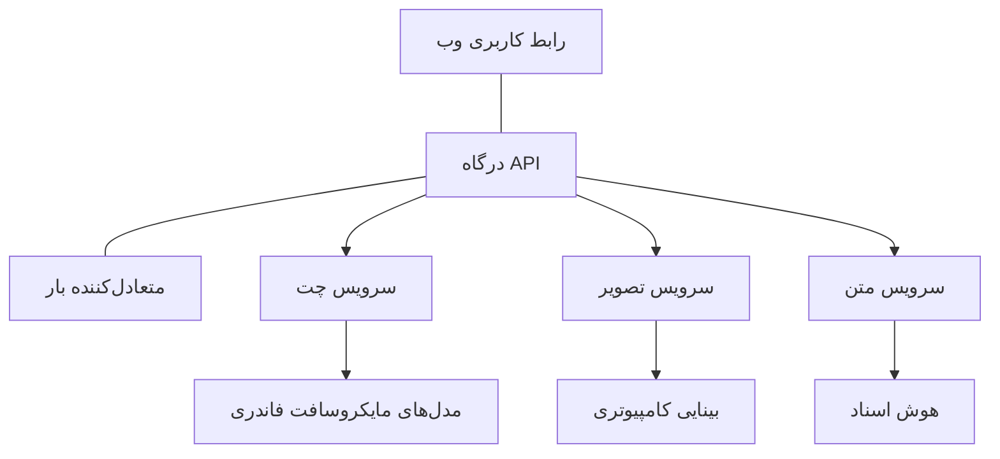

# بهترین شیوه‌ها برای بارکاری‌های تولیدی هوش مصنوعی با AZD

**ناوبری فصل:**
- **📚 صفحه دوره**: [AZD برای مبتدیان](../../README.md)
- **📖 فصل فعلی**: فصل 8 - الگوهای تولید و سازمانی
- **⬅️ فصل قبلی**: [فصل 7: عیب‌یابی](../chapter-07-troubleshooting/debugging.md)
- **⬅️ مرتبط همچنین**: [کارگاه آزمایشگاه هوش مصنوعی](ai-workshop-lab.md)
- **🎯 پایان دوره**: [AZD برای مبتدیان](../../README.md)

## بررسی اجمالی

این راهنما بهترین شیوه‌های جامع برای استقرار بارکاری‌های آماده تولید هوش مصنوعی با استفاده از Azure Developer CLI (AZD) را ارائه می‌دهد. بر اساس بازخورد جامعه Discord مایکروسافت فاندری و استقرارهای واقعی مشتریان، این شیوه‌ها متداول‌ترین چالش‌ها در سیستم‌های هوش مصنوعی تولیدی را پوشش می‌دهند.

## چالش‌های کلیدی مورد رسیدگی

براساس نتایج نظرسنجی جامعه ما، این‌ها مهم‌ترین چالش‌هایی هستند که توسعه‌دهندگان با آنها مواجه‌اند:

- **45%** در استقرارهای چندسرویسی هوش مصنوعی مشکل دارند
- **38%** مسائل مدیریت اعتبارنامه و اسرار را گزارش کرده‌اند  
- **35%** آماده‌سازی برای تولید و مقیاس‌دهی را دشوار می‌یابند
- **32%** به استراتژی‌های بهتر بهینه‌سازی هزینه نیاز دارند
- **29%** نیاز به مانیتورینگ و عیب‌یابی بهبودیافته دارند

## الگوهای معماری برای هوش مصنوعی تولیدی

### الگو 1: معماری میکروسرویس برای هوش مصنوعی

**زمان استفاده**: برنامه‌های پیچیده هوش مصنوعی با قابلیت‌های متعدد


**پیاده‌سازی AZD**:

```yaml
# azure.yaml
name: enterprise-ai-platform
services:
  web:
    project: ./web
    host: staticwebapp
  api-gateway:
    project: ./api-gateway
    host: containerapp
  chat-service:
    project: ./services/chat
    host: containerapp
  vision-service:
    project: ./services/vision
    host: containerapp
  text-service:
    project: ./services/text
    host: containerapp
```

### الگو 2: پردازش رویداد‌محور هوش مصنوعی

**زمان استفاده**: پردازش دسته‌ای، تحلیل اسناد، جریان‌های کاری غیرهمزمان

```bicep
// Event Hub for AI processing pipeline
resource eventHub 'Microsoft.EventHub/namespaces@2023-01-01-preview' = {
  name: eventHubNamespaceName
  location: location
  sku: {
    name: 'Standard'
    tier: 'Standard'
    capacity: 1
  }
}

// Service Bus for reliable message processing
resource serviceBus 'Microsoft.ServiceBus/namespaces@2022-10-01-preview' = {
  name: serviceBusNamespaceName
  location: location
  sku: {
    name: 'Premium'
    tier: 'Premium'
    capacity: 1
  }
}

// Function App for processing
resource functionApp 'Microsoft.Web/sites@2023-01-01' = {
  name: functionAppName
  location: location
  kind: 'functionapp,linux'
  properties: {
    siteConfig: {
      appSettings: [
        {
          name: 'FUNCTIONS_EXTENSION_VERSION'
          value: '~4'
        }
        {
          name: 'AZURE_OPENAI_ENDPOINT'
          value: '@Microsoft.KeyVault(VaultName=${keyVault.name};SecretName=openai-endpoint)'
        }
      ]
    }
  }
}
```

## تفکر درباره سلامت عامل‌های هوش مصنوعی

وقتی یک اپ وب سنتی خراب می‌شود، علائم آشنا هستند: صفحه لود نمی‌شود، یک API خطا برمی‌گرداند، یا استقرار شکست می‌خورد. برنامه‌های مبتنی بر هوش مصنوعی می‌توانند به همان شکل خراب شوند—اما ممکن است رفتارهای ظریف‌تری نیز داشته باشند که پیام خطای واضحی تولید نکنند.

این بخش به شما کمک می‌کند یک مدل ذهنی برای نظارت بر بارکاری‌های هوش مصنوعی بسازید تا بدانید وقتی اوضاع درست به نظر نمی‌رسد، باید کجا را بررسی کنید.

### چگونه سلامت عامل با سلامت اپلیکیشن سنتی متفاوت است

یک اپلیکیشن سنتی یا کار می‌کند یا کار نمی‌کند. یک عامل هوش مصنوعی ممکن است ظاهراً کار کند اما نتایج ضعیفی تولید کند. سلامت عامل را در دو لایه در نظر بگیرید:

| Layer | What to Watch | Where to Look |
|-------|--------------|---------------|
| **Infrastructure health** | آیا سرویس در حال اجراست؟ آیا منابع فراهم شده‌اند؟ آیا نقاط انتهایی قابل دسترسی‌اند؟ | `azd monitor`, Azure Portal resource health, لاگ‌های کانتینر/اپ |
| **Behavior health** | آیا عامل به درستی پاسخ می‌دهد؟ آیا پاسخ‌ها به موقع هستند؟ آیا مدل به درستی فراخوانی می‌شود؟ | Application Insights traces, متریک‌های تاخیر فراخوانی مدل, لاگ‌های کیفیت پاسخ |

سلامت زیرساخت آشناست—برای هر اپ azd یکسان است. سلامت رفتار لایه جدیدی است که بارکاری‌های هوش مصنوعی معرفی می‌کنند.

### کجا را بررسی کنید وقتی اپ‌های هوش مصنوعی مطابق انتظار رفتار نمی‌کنند

اگر اپ هوش مصنوعی شما نتایجی که انتظار دارید را تولید نمی‌کند، این یک چک‌لیست مفهومی است:

1. **با مبانی شروع کنید.** آیا اپ در حال اجراست؟ آیا می‌تواند به وابستگی‌هایش دسترسی پیدا کند؟ همان‌طور که برای هر اپی انجام می‌دهید، `azd monitor` و سلامت منابع را بررسی کنید.
2. **اتصال به مدل را بررسی کنید.** آیا اپ شما با موفقیت مدل هوش مصنوعی را فراخوانی می‌کند؟ فراخوانی‌های مدل ناموفق یا با زمان‌گذشته یکی از رایج‌ترین علل مشکلات اپ‌های هوش مصنوعی هستند و در لاگ‌های اپلیکیشن شما ظاهر خواهند شد.
3. **نگاه کنید مدل چه داده‌ای دریافت کرده است.** پاسخ‌های هوش مصنوعی به ورودی بستگی دارند (پرومپت و هر زمینه بازیابی‌شده). اگر خروجی اشتباه است، معمولاً ورودی اشتباه است. بررسی کنید آیا اپ شما داده درست را به مدل ارسال می‌کند یا خیر.
4. **تاخیر پاسخ را مرور کنید.** فراخوانی‌های مدل هوش مصنوعی کندتر از فراخوانی‌های معمول API هستند. اگر اپ شما کند به نظر می‌رسد، بررسی کنید آیا زمان پاسخ مدل افزایش یافته است — این می‌تواند نشان‌دهنده محدودیت نرخ، محدودیت ظرفیت یا شلوغی سطح منطقه باشد.
5. **به سیگنال‌های هزینه توجه کنید.** جهش‌های ناگهانی در مصرف توکن یا فراخوانی‌های API می‌تواند نشان‌دهنده یک حلقه، پرومپت پیکربندی‌شده نادرست، یا تلاش‌های مجدد بیش از حد باشد.

لازم نیست فوراً در ابزارهای قابل مشاهده‌پذیری استاد شوید. نکته کلیدی این است که برنامه‌های هوش مصنوعی یک لایه رفتار اضافی برای نظارت دارند و مانیتورینگ داخلی azd (`azd monitor`) نقطه شروعی برای بررسی هر دو لایه به شما می‌دهد.

---

## بهترین شیوه‌های امنیتی

### 1. مدل امنیتی Zero-Trust

**استراتژی پیاده‌سازی**:
- هیچ ارتباط سرویس‌به‌سرویسی بدون احراز هویت مجاز نباشد
- تمام فراخوانی‌های API از managed identities استفاده کنند
- ایزولاسیون شبکه با private endpoints
- کنترل‌های دسترسی با حداقل امتیاز

```bicep
// Managed Identity for each service
resource chatServiceIdentity 'Microsoft.ManagedIdentity/userAssignedIdentities@2023-01-31' = {
  name: 'chat-service-identity'
  location: location
}

// Role assignments with minimal permissions
resource openAIUserRole 'Microsoft.Authorization/roleAssignments@2022-04-01' = {
  scope: openAIAccount
  name: guid(openAIAccount.id, chatServiceIdentity.id, openAIUserRoleDefinitionId)
  properties: {
    roleDefinitionId: subscriptionResourceId('Microsoft.Authorization/roleDefinitions', '5e0bd9bd-7b93-4f28-af87-19fc36ad61bd')
    principalId: chatServiceIdentity.properties.principalId
    principalType: 'ServicePrincipal'
  }
}
```

### 2. مدیریت امن اسرار

**الگوی یکپارچه‌سازی Key Vault**:

```bicep
// Key Vault with proper access policies
resource keyVault 'Microsoft.KeyVault/vaults@2023-02-01' = {
  name: keyVaultName
  location: location
  properties: {
    tenantId: tenant().tenantId
    sku: {
      family: 'A'
      name: 'premium'  // Use premium for production
    }
    enableRbacAuthorization: true  // Use RBAC instead of access policies
    enablePurgeProtection: true    // Prevent accidental deletion
    enableSoftDelete: true
    softDeleteRetentionInDays: 90
  }
}

// Store all AI service credentials
resource openAIKeySecret 'Microsoft.KeyVault/vaults/secrets@2023-02-01' = {
  parent: keyVault
  name: 'openai-api-key'
  properties: {
    value: openAIAccount.listKeys().key1
    attributes: {
      enabled: true
    }
  }
}
```

### 3. امنیت شبکه

**پیکربندی Private Endpoint**:

```bicep
// Virtual Network for AI services
resource virtualNetwork 'Microsoft.Network/virtualNetworks@2023-04-01' = {
  name: vnetName
  location: location
  properties: {
    addressSpace: {
      addressPrefixes: ['10.0.0.0/16']
    }
    subnets: [
      {
        name: 'ai-services-subnet'
        properties: {
          addressPrefix: '10.0.1.0/24'
          privateEndpointNetworkPolicies: 'Disabled'
        }
      }
      {
        name: 'app-services-subnet'
        properties: {
          addressPrefix: '10.0.2.0/24'
          delegations: [
            {
              name: 'Microsoft.Web/serverFarms'
              properties: {
                serviceName: 'Microsoft.Web/serverFarms'
              }
            }
          ]
        }
      }
    ]
  }
}

// Private endpoints for all AI services
resource openAIPrivateEndpoint 'Microsoft.Network/privateEndpoints@2023-04-01' = {
  name: '${openAIAccountName}-pe'
  location: location
  properties: {
    subnet: {
      id: virtualNetwork.properties.subnets[0].id
    }
    privateLinkServiceConnections: [
      {
        name: 'openai-connection'
        properties: {
          privateLinkServiceId: openAIAccount.id
          groupIds: ['account']
        }
      }
    ]
  }
}
```

## عملکرد و مقیاس‌دهی

### 1. استراتژی‌های مقیاس خودکار

**مقیاس خودکار Container Apps**:

```bicep
resource containerApp 'Microsoft.App/containerApps@2023-05-01' = {
  name: containerAppName
  location: location
  properties: {
    configuration: {
      ingress: {
        external: true
        targetPort: 8000
        transport: 'http'
      }
    }
    template: {
      scale: {
        minReplicas: 2  // Always have 2 instances minimum
        maxReplicas: 50 // Scale up to 50 for high load
        rules: [
          {
            name: 'http-scaling'
            http: {
              metadata: {
                concurrentRequests: '20'  // Scale when >20 concurrent requests
              }
            }
          }
          {
            name: 'cpu-scaling'
            custom: {
              type: 'cpu'
              metadata: {
                type: 'Utilization'
                value: '70'  // Scale when CPU >70%
              }
            }
          }
        ]
      }
    }
  }
}
```

### 2. استراتژی‌های کشینگ

**Redis Cache برای پاسخ‌های هوش مصنوعی**:

```bicep
// Redis Premium for production workloads
resource redisCache 'Microsoft.Cache/redis@2023-04-01' = {
  name: redisCacheName
  location: location
  properties: {
    sku: {
      name: 'Premium'
      family: 'P'
      capacity: 1
    }
    enableNonSslPort: false
    minimumTlsVersion: '1.2'
    redisConfiguration: {
      'maxmemory-policy': 'allkeys-lru'
    }
    // Enable clustering for high availability
    redisVersion: '6.0'
    shardCount: 2
  }
}

// Cache configuration in application
var cacheConnectionString = '${redisCache.properties.hostName}:6380,password=${redisCache.listKeys().primaryKey},ssl=True,abortConnect=False'
```

### 3. توازن بار و مدیریت ترافیک

**Application Gateway با WAF**:

```bicep
// Application Gateway with Web Application Firewall
resource applicationGateway 'Microsoft.Network/applicationGateways@2023-04-01' = {
  name: appGatewayName
  location: location
  properties: {
    sku: {
      name: 'WAF_v2'
      tier: 'WAF_v2'
      capacity: 2
    }
    webApplicationFirewallConfiguration: {
      enabled: true
      firewallMode: 'Prevention'
      ruleSetType: 'OWASP'
      ruleSetVersion: '3.2'
    }
    // Backend pools for AI services
    backendAddressPools: [
      {
        name: 'ai-services-pool'
        properties: {
          backendAddresses: [
            {
              fqdn: '${containerApp.properties.configuration.ingress.fqdn}'
            }
          ]
        }
      }
    ]
  }
}
```

## 💰 بهینه‌سازی هزینه

### 1. اندازه‌گذاری صحیح منابع

**پیکربندی‌های خاص محیط**:

```bash
# محیط توسعه
azd env new development
azd env set AZURE_OPENAI_SKU "S0"
azd env set AZURE_OPENAI_CAPACITY 10
azd env set AZURE_SEARCH_SKU "basic"
azd env set CONTAINER_CPU 0.5
azd env set CONTAINER_MEMORY 1.0

# محیط تولید
azd env new production
azd env set AZURE_OPENAI_SKU "S0"
azd env set AZURE_OPENAI_CAPACITY 100
azd env set AZURE_SEARCH_SKU "standard"
azd env set CONTAINER_CPU 2.0
azd env set CONTAINER_MEMORY 4.0
```

### 2. مانیتورینگ هزینه و بودجه‌بندی

```bicep
// Cost management and budgets
resource budget 'Microsoft.Consumption/budgets@2023-05-01' = {
  name: 'ai-workload-budget'
  properties: {
    timePeriod: {
      startDate: '2024-01-01'
      endDate: '2024-12-31'
    }
    timeGrain: 'Monthly'
    amount: 2000  // $2000 monthly budget
    category: 'Cost'
    notifications: {
      warning: {
        enabled: true
        operator: 'GreaterThan'
        threshold: 80
        contactEmails: [
          'finance@company.com'
          'engineering@company.com'
        ]
        contactRoles: [
          'Owner'
          'Contributor'
        ]
      }
      critical: {
        enabled: true
        operator: 'GreaterThan'
        threshold: 95
        contactEmails: [
          'cto@company.com'
        ]
      }
    }
  }
}
```

### 3. بهینه‌سازی مصرف توکن

**مدیریت هزینه OpenAI**:

```typescript
// بهینه‌سازی توکن در سطح برنامه
class TokenOptimizer {
  private readonly maxTokens = 4000;
  private readonly reserveTokens = 500;
  
  optimizePrompt(userInput: string, context: string): string {
    const availableTokens = this.maxTokens - this.reserveTokens;
    const estimatedTokens = this.estimateTokens(userInput + context);
    
    if (estimatedTokens > availableTokens) {
      // زمینه را کوتاه کنید، نه ورودی کاربر
      context = this.truncateContext(context, availableTokens - this.estimateTokens(userInput));
    }
    
    return `${context}\n\nUser: ${userInput}`;
  }
  
  private estimateTokens(text: string): number {
    // برآورد تقریبی: ۱ توکن ≈ ۴ کاراکتر
    return Math.ceil(text.length / 4);
  }
}
```

## نظارت و مشاهده‌پذیری

### 1. Application Insights جامع

```bicep
// Application Insights with advanced features
resource applicationInsights 'Microsoft.Insights/components@2020-02-02' = {
  name: applicationInsightsName
  location: location
  kind: 'web'
  properties: {
    Application_Type: 'web'
    WorkspaceResourceId: logAnalyticsWorkspace.id
    SamplingPercentage: 100  // Full sampling for AI apps
    DisableIpMasking: false  // Enable for security
  }
}

// Custom metrics for AI operations
resource aiMetricAlerts 'Microsoft.Insights/metricAlerts@2018-03-01' = {
  name: 'ai-high-error-rate'
  location: 'global'
  properties: {
    description: 'Alert when AI service error rate is high'
    severity: 2
    enabled: true
    scopes: [
      applicationInsights.id
    ]
    evaluationFrequency: 'PT1M'
    windowSize: 'PT5M'
    criteria: {
      'odata.type': 'Microsoft.Azure.Monitor.SingleResourceMultipleMetricCriteria'
      allOf: [
        {
          name: 'high-error-rate'
          metricName: 'requests/failed'
          operator: 'GreaterThan'
          threshold: 10
          timeAggregation: 'Count'
        }
      ]
    }
  }
}
```

### 2. مانیتورینگ مخصوص هوش مصنوعی

**داشبوردهای سفارشی برای متریک‌های هوش مصنوعی**:

```json
// Dashboard configuration for AI workloads
{
  "dashboard": {
    "name": "AI Application Monitoring",
    "tiles": [
      {
        "name": "OpenAI Request Volume",
        "query": "requests | where name contains 'openai' | summarize count() by bin(timestamp, 5m)"
      },
      {
        "name": "AI Response Latency",
        "query": "requests | where name contains 'openai' | summarize avg(duration) by bin(timestamp, 5m)"
      },
      {
        "name": "Token Usage",
        "query": "customMetrics | where name == 'openai_tokens_used' | summarize sum(value) by bin(timestamp, 1h)"
      },
      {
        "name": "Cost per Hour",
        "query": "customMetrics | where name == 'openai_cost' | summarize sum(value) by bin(timestamp, 1h)"
      }
    ]
  }
}
```

### 3. بررسی سلامت و مانیتورینگ زمان کار

```bicep
// Application Insights availability tests
resource availabilityTest 'Microsoft.Insights/webtests@2022-06-15' = {
  name: 'ai-app-availability-test'
  location: location
  tags: {
    'hidden-link:${applicationInsights.id}': 'Resource'
  }
  properties: {
    SyntheticMonitorId: 'ai-app-availability-test'
    Name: 'AI Application Availability Test'
    Description: 'Tests AI application endpoints'
    Enabled: true
    Frequency: 300  // 5 minutes
    Timeout: 120    // 2 minutes
    Kind: 'ping'
    Locations: [
      {
        Id: 'us-east-2-azr'
      }
      {
        Id: 'us-west-2-azr'
      }
    ]
    Configuration: {
      WebTest: '''
        <WebTest Name="AI Health Check" 
                 Id="8d2de8d2-a2b0-4c2e-9a0d-8f9c9a0b8c8d" 
                 Enabled="True" 
                 CssProjectStructure="" 
                 CssIteration="" 
                 Timeout="120" 
                 WorkItemIds="" 
                 xmlns="http://microsoft.com/schemas/VisualStudio/TeamTest/2010" 
                 Description="" 
                 CredentialUserName="" 
                 CredentialPassword="" 
                 PreAuthenticate="True" 
                 Proxy="default" 
                 StopOnError="False" 
                 RecordedResultFile="" 
                 ResultsLocale="">
          <Items>
            <Request Method="GET" 
                     Guid="a5f10126-e4cd-570d-961c-cea43999a200" 
                     Version="1.1" 
                     Url="${webApp.properties.defaultHostName}/health" 
                     ThinkTime="0" 
                     Timeout="120" 
                     ParseDependentRequests="True" 
                     FollowRedirects="True" 
                     RecordResult="True" 
                     Cache="False" 
                     ResponseTimeGoal="0" 
                     Encoding="utf-8" 
                     ExpectedHttpStatusCode="200" 
                     ExpectedResponseUrl="" 
                     ReportingName="" 
                     IgnoreHttpStatusCode="False" />
          </Items>
        </WebTest>
      '''
    }
  }
}
```

## بازیابی از فاجعه و دسترس‌پذیری بالا

### 1. استقرار چندمنطقه‌ای

```yaml
# azure.yaml - Multi-region configuration
name: ai-app-multiregion
services:
  api-primary:
    project: ./api
    host: containerapp
    env:
      - AZURE_REGION=eastus
  api-secondary:
    project: ./api
    host: containerapp
    env:
      - AZURE_REGION=westus2
```

```bicep
// Traffic Manager for global load balancing
resource trafficManager 'Microsoft.Network/trafficManagerProfiles@2022-04-01' = {
  name: trafficManagerProfileName
  location: 'global'
  properties: {
    profileStatus: 'Enabled'
    trafficRoutingMethod: 'Priority'
    dnsConfig: {
      relativeName: trafficManagerProfileName
      ttl: 30
    }
    monitorConfig: {
      protocol: 'HTTPS'
      port: 443
      path: '/health'
      intervalInSeconds: 30
      toleratedNumberOfFailures: 3
      timeoutInSeconds: 10
    }
    endpoints: [
      {
        name: 'primary-endpoint'
        type: 'Microsoft.Network/trafficManagerProfiles/azureEndpoints'
        properties: {
          targetResourceId: primaryAppService.id
          endpointStatus: 'Enabled'
          priority: 1
        }
      }
      {
        name: 'secondary-endpoint'
        type: 'Microsoft.Network/trafficManagerProfiles/azureEndpoints'
        properties: {
          targetResourceId: secondaryAppService.id
          endpointStatus: 'Enabled'
          priority: 2
        }
      }
    ]
  }
}
```

### 2. پشتیبان‌گیری و بازیابی داده

```bicep
// Backup configuration for critical data
resource backupVault 'Microsoft.DataProtection/backupVaults@2023-05-01' = {
  name: backupVaultName
  location: location
  identity: {
    type: 'SystemAssigned'
  }
  properties: {
    storageSettings: [
      {
        datastoreType: 'VaultStore'
        type: 'LocallyRedundant'
      }
    ]
  }
}

// Backup policy for AI models and data
resource backupPolicy 'Microsoft.DataProtection/backupVaults/backupPolicies@2023-05-01' = {
  parent: backupVault
  name: 'ai-data-backup-policy'
  properties: {
    policyRules: [
      {
        backupParameters: {
          backupType: 'Full'
          objectType: 'AzureBackupParams'
        }
        trigger: {
          schedule: {
            repeatingTimeIntervals: [
              'R/2024-01-01T02:00:00+00:00/P1D'  // Daily at 2 AM
            ]
          }
          objectType: 'ScheduleBasedTriggerContext'
        }
        dataStore: {
          datastoreType: 'VaultStore'
          objectType: 'DataStoreInfoBase'
        }
        name: 'BackupDaily'
        objectType: 'AzureBackupRule'
      }
    ]
  }
}
```

## DevOps و ادغام CI/CD

### 1. گردش کار GitHub Actions

```yaml
# .github/workflows/deploy-ai-app.yml
name: Deploy AI Application

on:
  push:
    branches: [main]
  pull_request:
    branches: [main]

jobs:
  test:
    runs-on: ubuntu-latest
    steps:
      - uses: actions/checkout@v4
      
      - name: Setup Python
        uses: actions/setup-python@v4
        with:
          python-version: '3.11'
          
      - name: Install dependencies
        run: |
          pip install -r requirements.txt
          pip install pytest
          
      - name: Run tests
        run: pytest tests/
        
      - name: AI Safety Tests
        run: |
          python scripts/test_ai_safety.py
          python scripts/validate_prompts.py

  deploy-staging:
    needs: test
    if: github.event_name == 'pull_request'
    runs-on: ubuntu-latest
    steps:
      - uses: actions/checkout@v4
      
      - name: Setup AZD
        uses: Azure/setup-azd@v1.0.0
        
      - name: Login to Azure
        uses: azure/login@v1
        with:
          creds: ${{ secrets.AZURE_CREDENTIALS }}
          
      - name: Deploy to Staging
        run: |
          azd env select staging
          azd deploy

  deploy-production:
    needs: test
    if: github.ref == 'refs/heads/main'
    runs-on: ubuntu-latest
    steps:
      - uses: actions/checkout@v4
      
      - name: Setup AZD
        uses: Azure/setup-azd@v1.0.0
        
      - name: Login to Azure
        uses: azure/login@v1
        with:
          creds: ${{ secrets.AZURE_CREDENTIALS }}
          
      - name: Deploy to Production
        run: |
          azd env select production
          azd deploy
          
      - name: Run Production Health Checks
        run: |
          python scripts/health_check.py --env production
```

### 2. اعتبارسنجی زیرساخت

```bash
# scripts/validate_infrastructure.sh
#!/bin/bash

echo "Validating AI infrastructure deployment..."

# بررسی کنید که همه سرویس‌های مورد نیاز در حال اجرا هستند
services=("openai" "search" "storage" "keyvault")
for service in "${services[@]}"; do
    echo "Checking $service..."
    if ! az resource list --resource-type "Microsoft.CognitiveServices/accounts" --query "[?contains(name, '$service')]" -o tsv; then
        echo "ERROR: $service not found"
        exit 1
    fi
done

# اعتبارسنجی استقرار مدل‌های OpenAI
echo "Validating OpenAI model deployments..."
models=$(az cognitiveservices account deployment list --name $AZURE_OPENAI_NAME --resource-group $AZURE_RESOURCE_GROUP --query "[].name" -o tsv)
if [[ ! $models == *"gpt-35-turbo"* ]]; then
    echo "ERROR: Required model gpt-35-turbo not deployed"
    exit 1
fi

# آزمایش اتصال سرویس هوش مصنوعی
echo "Testing AI service connectivity..."
python scripts/test_connectivity.py

echo "Infrastructure validation completed successfully!"
```

## فهرست بررسی آمادگی تولید

### امنیت ✅
- [ ] تمام سرویس‌ها از managed identities استفاده می‌کنند
- [ ] اسرار در Key Vault ذخیره شده‌اند
- [ ] private endpoints پیکربندی شده‌اند
- [ ] گروه‌های امنیتی شبکه اعمال شده‌اند
- [ ] RBAC با حداقل امتیاز
- [ ] WAF در نقاط انتهایی عمومی فعال است

### عملکرد ✅
- [ ] مقیاس خودکار پیکربندی شده است
- [ ] کشینگ پیاده‌سازی شده است
- [ ] توازن بار راه‌اندازی شده است
- [ ] CDN برای محتوای استاتیک
- [ ] پویولینگ اتصالات پایگاه‌داده
- [ ] بهینه‌سازی مصرف توکن

### مانیتورینگ ✅
- [ ] Application Insights پیکربندی شده است
- [ ] متریک‌های سفارشی تعریف شده‌اند
- [ ] قوانین هشداردهی تنظیم شده‌اند
- [ ] داشبورد ایجاد شده است
- [ ] بررسی‌های سلامت پیاده‌سازی شده‌اند
- [ ] سیاست‌های نگهداری لاگ

### قابلیت اطمینان ✅
- [ ] استقرار چندمنطقه‌ای
- [ ] برنامه پشتیبان‌گیری و بازیابی
- [ ] پیاده‌سازی circuit breakers
- [ ] سیاست‌های تلاش مجدد پیکربندی شده‌اند
- [ ] افت تدریجی کنترل‌شده (Graceful degradation)
- [ ] نقاط انتهایی بررسی سلامت

### مدیریت هزینه ✅
- [ ] هشدارهای بودجه پیکربندی شده‌اند
- [ ] اندازه‌گذاری صحیح منابع
- [ ] تخفیف‌های dev/test اعمال شده‌اند
- [ ] خرید Reserved Instances
- [ ] داشبورد مانیتورینگ هزینه
- [ ] بررسی‌های منظم هزینه

### انطباق ✅
- [ ] الزامات محل نگهداری داده‌ها رعایت شده‌اند
- [ ] لاگینگ حسابرسی فعال شده است
- [ ] سیاست‌های انطباق اعمال شده‌اند
- [ ] مبانی امنیتی پیاده‌سازی شده‌اند
- [ ] ارزیابی‌های امنیتی منظم
- [ ] برنامه پاسخ به حادثه

## معیارهای عملکرد

### معیارهای معمول تولید

| Metric | Target | Monitoring |
|--------|--------|------------|
| **Response Time** | < 2 seconds | Application Insights |
| **Availability** | 99.9% | Uptime monitoring |
| **Error Rate** | < 0.1% | Application logs |
| **Token Usage** | < $500/month | Cost management |
| **Concurrent Users** | 1000+ | Load testing |
| **Recovery Time** | < 1 hour | Disaster recovery tests |

### تست بار

```bash
# اسکریپت تست بار برای برنامه‌های هوش مصنوعی
python scripts/load_test.py \
  --endpoint https://your-ai-app.azurewebsites.net \
  --concurrent-users 100 \
  --duration 300 \
  --ramp-up 60
```

## 🤝 بهترین شیوه‌های جامعه

بر اساس بازخورد جامعه Discord مایکروسافت فاندری:

### توصیه‌های برتر از طرف جامعه:

1. **کوچک شروع کنید، به‌تدریج مقیاس دهید**: با SKUهای پایه شروع کنید و بر اساس مصرف واقعی مقیاس دهید
2. **همه چیز را مانیتور کنید**: از روز اول نظارت جامع را راه‌اندازی کنید
3. **امنیت را خودکار کنید**: از Infrastructure as Code برای تضمین امنیت یکدست استفاده کنید
4. **به‌طور کامل تست کنید**: تست‌های مخصوص هوش مصنوعی را در خط لوله خود بگنجانید
5. **برای هزینه‌ها برنامه‌ریزی کنید**: مصرف توکن را مانیتور کنید و زود هشدارهای بودجه را تنظیم کنید

### دام‌های رایج برای اجتناب:

- ❌ قراردادن کلیدهای API در کد به‌صورت هاردکد
- ❌ راه‌اندازی نکردن مانیتورینگ مناسب
- ❌ نادیده گرفتن بهینه‌سازی هزینه
- ❌ تست نکردن سناریوهای خطا
- ❌ استقرار بدون بررسی سلامتی

## دستورات AZD AI CLI و افزونه‌ها

AZD مجموعه‌ای در حال رشد از دستورات و افزونه‌های مخصوص هوش مصنوعی را شامل می‌شود که جریان‌های کاری تولیدی هوش مصنوعی را ساده می‌سازند. این ابزارها فاصله بین توسعه محلی و استقرار تولیدی برای بارکاری‌های هوش مصنوعی را پر می‌کنند.

### افزونه‌های AZD برای هوش مصنوعی

AZD از یک سیستم افزونه برای افزودن قابلیت‌های مخصوص هوش مصنوعی استفاده می‌کند. افزونه‌ها را با موارد زیر نصب و مدیریت کنید:

```bash
# فهرست تمام افزونه‌های در دسترس (شامل هوش مصنوعی)
azd extension list

# افزونهٔ Foundry agents را نصب کنید
azd extension install azure.ai.agents

# افزونهٔ تنظیم دقیق را نصب کنید
azd extension install azure.ai.finetune

# افزونهٔ مدل‌های سفارشی را نصب کنید
azd extension install azure.ai.models

# تمام افزونه‌های نصب‌شده را به‌روزرسانی کنید
azd extension upgrade --all
```

**افزونه‌های AI در دسترس:**

| Extension | Purpose | Status |
|-----------|---------|--------|
| `azure.ai.agents` | مدیریت Foundry Agent Service | Preview |
| `azure.ai.finetune` | تنظیم دقیق مدل در Foundry | Preview |
| `azure.ai.models` | مدل‌های سفارشی Foundry | Preview |
| `azure.coding-agent` | پیکربندی عامل کدنویسی | Available |

### راه‌اندازی پروژه‌های عامل با `azd ai agent init`

دستور `azd ai agent init` یک پروژه عامل هوش مصنوعی آماده تولید را که با Microsoft Foundry Agent Service یکپارچه شده است، قالب‌بندی می‌کند:

```bash
# یک پروژهٔ عامل جدید را از مانیفست عامل مقداردهی اولیه کنید
azd ai agent init -m <manifest-path-or-uri>

# یک پروژهٔ مشخص Foundry را مقداردهی اولیه کرده و به‌عنوان هدف تعیین کنید
azd ai agent init -m agent-manifest.yaml --project-id <foundry-project-id>

# با یک دایرکتوری منبع سفارشی مقداردهی اولیه کنید
azd ai agent init -m agent-manifest.yaml --src ./agents/my-agent

# Container Apps را به‌عنوان میزبان هدف قرار دهید
azd ai agent init -m agent-manifest.yaml --host containerapp
```

**پرچم‌های کلیدی:**

| Flag | Description |
|------|-------------|
| `-m, --manifest` | Path or URI to an agent manifest to add to your project |
| `-p, --project-id` | Existing Microsoft Foundry Project ID for your azd environment |
| `-s, --src` | Directory to download the agent definition (defaults to `src/<agent-id>`) |
| `--host` | Override the default host (e.g., `containerapp`) |
| `-e, --environment` | The azd environment to use |

**نکته تولیدی**: از `--project-id` برای اتصال مستقیم به یک پروژه Foundry موجود استفاده کنید تا کد عامل و منابع ابری شما از ابتدا لینک شده باقی بمانند.

### پروتکل زمینه مدل (MCP) با `azd mcp`

AZD پشتیبانی داخلی از سرور MCP را (Alpha) شامل می‌شود که امکان تعامل عامل‌ها و ابزارهای هوش مصنوعی با منابع Azure شما را از طریق یک پروتکل استاندارد فراهم می‌کند:

```bash
# سرور MCP را برای پروژهٔ خود راه‌اندازی کنید
azd mcp start

# مدیریت مجوز ابزار برای عملیات MCP
azd mcp consent
```

سرور MCP زمینه پروژه azd شما—محیط‌ها، سرویس‌ها، و منابع Azure—را در اختیار ابزارهای توسعه مجهز به هوش مصنوعی قرار می‌دهد. این امکان را فراهم می‌کند برای:

- **استقرار با کمک هوش مصنوعی**: اجازه دهید عوامل کدنویسی وضعیت پروژه شما را پرس‌وجو کنند و استقرارها را فعال کنند
- **کشف منابع**: ابزارهای هوش مصنوعی می‌توانند کشف کنند پروژه شما از چه منابع Azure ای استفاده می‌کند
- **مدیریت محیط**: عامل‌ها می‌توانند بین محیط‌های dev/staging/production جابجا شوند

### تولید زیرساخت با `azd infra generate`

برای بارکاری‌های تولیدی هوش مصنوعی، می‌توانید Infrastructure as Code را تولید و سفارشی کنید به‌جای تکیه بر تامین خودکار:

```bash
# تولید فایل‌های Bicep/Terraform از تعریف پروژهٔ شما
azd infra generate
```

این IaC را به دیسک می‌نویسد تا بتوانید:
- زیرساخت را قبل از استقرار بازبینی و ممیزی کنید
- سیاست‌های امنیتی سفارشی اضافه کنید (قوانین شبکه، private endpoints)
- آن را با فرایندهای بازبینی IaC موجود یکپارچه کنید
- تغییرات زیرساخت را جدا از کد اپلیکیشن نسخه‌بندی کنید

### هوک‌های چرخه حیات تولید

هوک‌های AZD به شما اجازه می‌دهند منطق سفارشی را در هر مرحله از چرخه حیات استقرار تزریق کنید—که برای جریان‌های کاری تولیدی هوش مصنوعی حیاتی است:

```yaml
# azure.yaml - Production hooks example
name: ai-production-app
hooks:
  preprovision:
    shell: sh
    run: scripts/validate-quotas.sh    # Check AI model quota before provisioning
  postprovision:
    shell: sh
    run: scripts/configure-networking.sh  # Set up private endpoints
  predeploy:
    shell: sh
    run: scripts/run-ai-safety-tests.sh  # Run prompt safety checks
  postdeploy:
    shell: sh
    run: scripts/smoke-test.sh           # Verify agent responses post-deploy
services:
  agent-api:
    project: ./src/agent
    host: containerapp
    hooks:
      predeploy:
        shell: sh
        run: scripts/validate-model-access.sh  # Per-service hook
```

```bash
# در حین توسعه، یک هوک مشخص را به‌صورت دستی اجرا کنید
azd hooks run predeploy
```

**هوک‌های تولیدی پیشنهادی برای بارکاری‌های هوش مصنوعی:**

| Hook | Use Case |
|------|----------|
| `preprovision` | اعتبارسنجی سهمیه‌های اشتراک برای ظرفیت مدل‌های هوش مصنوعی |
| `postprovision` | پیکربندی private endpoints، استقرار وزن‌های مدل |
| `predeploy` | اجرای تست‌های ایمنی هوش مصنوعی، اعتبارسنجی قالب‌های پرومپت |
| `postdeploy` | تست دودآزمایی پاسخ عامل‌ها، تایید اتصال مدل |

### پیکربندی خط لوله CI/CD

از `azd pipeline config` برای اتصال پروژه خود به GitHub Actions یا Azure Pipelines با احراز هویت ایمن Azure استفاده کنید:

```bash
# پیکربندی خط لوله CI/CD (تعاملی)
azd pipeline config

# پیکربندی با یک ارائه‌دهنده مشخص
azd pipeline config --provider github
```

این دستور:
- یک service principal با دسترسی حداقل امتیاز ایجاد می‌کند
- اعتبارنامه‌های فدرال‌شده را پیکربندی می‌کند (بدون ذخیره اسرار)
- فایل تعریف خط لوله شما را تولید یا به‌روزرسانی می‌کند
- متغیرهای محیطی مورد نیاز را در سیستم CI/CD شما تنظیم می‌کند

**گردش کار تولیدی با pipeline config:**

```bash
# 1. راه‌اندازی محیط تولید
azd env new production
azd env set AZURE_OPENAI_CAPACITY 100

# 2. پیکربندی خط لوله
azd pipeline config --provider github

# 3. خط لوله در هر push به شاخه main دستور azd deploy را اجرا می‌کند.
```

### افزودن مؤلفه‌ها با `azd add`

به‌تدریج سرویس‌های Azure را به یک پروژه موجود اضافه کنید:

```bash
# یک مولفهٔ سرویس جدید را به‌صورت تعاملی اضافه کنید
azd add
```

این خصوصاً برای گسترش اپلیکیشن‌های تولیدی هوش مصنوعی مفید است—برای مثال، افزودن سرویس جستجوی برداری، یک نقطه انتهایی عامل جدید، یا یک مؤلفه مانیتورینگ به یک استقرار موجود.

## منابع اضافی
- **Azure Well-Architected Framework**: [راهنمای بار کاری AI](https://learn.microsoft.com/azure/well-architected/ai/)
- **Microsoft Foundry Documentation**: [مستندات رسمی](https://learn.microsoft.com/azure/ai-studio/)
- **Community Templates**: [نمونه‌های Azure](https://github.com/Azure-Samples)
- **Discord Community**: [کانال #Azure](https://discord.gg/microsoft-azure)
- **Agent Skills for Azure**: [microsoft/github-copilot-for-azure on skills.sh](https://skills.sh/microsoft/github-copilot-for-azure) - 37 مهارت عامل باز برای Azure AI، Foundry، استقرار، بهینه‌سازی هزینه، و تشخیص خطا. در ویرایشگر خود نصب کنید:
  ```bash
  npx skills add microsoft/github-copilot-for-azure
  ```

---

**ناوبری فصل:**
- **📚 صفحه اصلی دوره**: [AZD For Beginners](../../README.md)
- **📖 فصل جاری**: فصل 8 - الگوهای تولید و سازمانی
- **⬅️ فصل قبلی**: [Chapter 7: Troubleshooting](../chapter-07-troubleshooting/debugging.md)
- **⬅️ همچنین مرتبط**: [AI Workshop Lab](ai-workshop-lab.md)
- **� پایان دوره**: [AZD For Beginners](../../README.md)

**به‌خاطر داشته باشید**: بار کاری‌های AI در تولید نیازمند برنامه‌ریزی دقیق، پایش و بهینه‌سازی مستمر هستند. با این الگوها شروع کنید و آن‌ها را براساس نیازهای خاص خود تطبیق دهید.

---

<!-- CO-OP TRANSLATOR DISCLAIMER START -->
**Disclaimer**:
این سند با استفاده از سرویس ترجمهٔ هوش مصنوعی [Co-op Translator](https://github.com/Azure/co-op-translator) ترجمه شده است. در حالی که ما در تلاش برای دقت هستیم، لطفاً توجه داشته باشید که ترجمه‌های خودکار ممکن است حاوی خطاها یا نادرستی‌هایی باشند. سند اصلی به زبان بومی خود باید به‌عنوان منبع معتبر در نظر گرفته شود. برای اطلاعات حساس، ترجمهٔ حرفه‌ای انسانی توصیه می‌شود. ما در قبال هرگونه سوءتفاهم یا تفسیر نادرستی که ناشی از استفاده از این ترجمه باشد، مسئول نیستیم.
<!-- CO-OP TRANSLATOR DISCLAIMER END -->