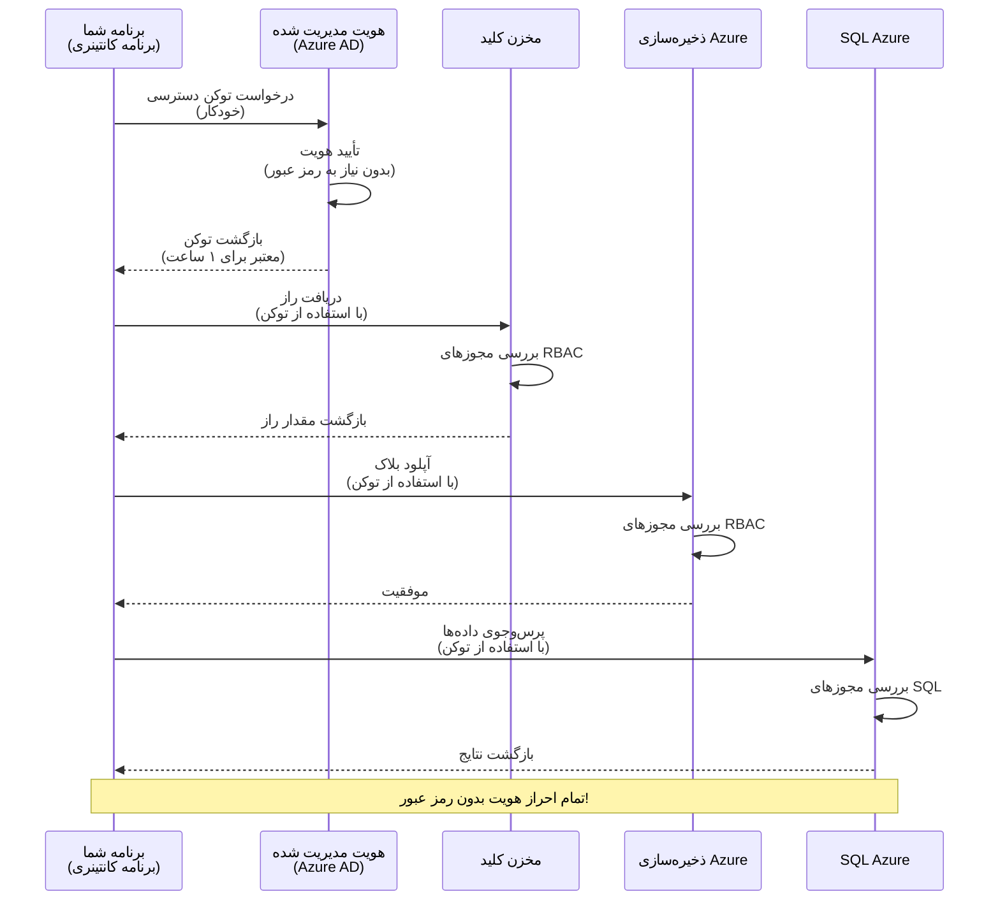
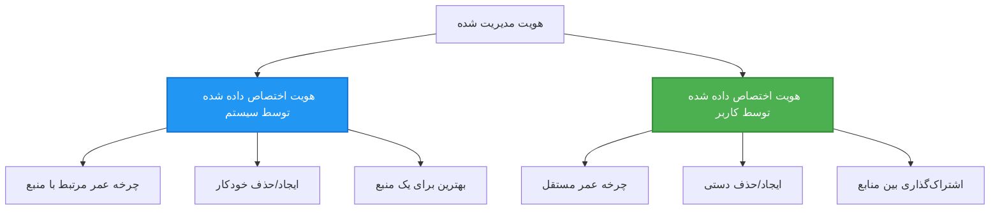

<!--
CO_OP_TRANSLATOR_METADATA:
{
  "original_hash": "e13ff6e1197e0a7462ed0aede7df9f23",
  "translation_date": "2025-11-20T03:01:15+00:00",
  "source_file": "docs/getting-started/authsecurity.md",
  "language_code": "fa"
}
-->
# الگوهای احراز هویت و هویت مدیریت‌شده

⏱️ **زمان تخمینی**: ۴۵-۶۰ دقیقه | 💰 **هزینه**: رایگان (بدون هزینه اضافی) | ⭐ **پیچیدگی**: متوسط

**📚 مسیر یادگیری:**
- ← قبلی: [مدیریت پیکربندی](configuration.md) - مدیریت متغیرهای محیطی و اسرار
- 🎯 **شما اینجا هستید**: احراز هویت و امنیت (هویت مدیریت‌شده، Key Vault، الگوهای امن)
- → بعدی: [پروژه اول](first-project.md) - ساخت اولین برنامه AZD
- 🏠 [صفحه اصلی دوره](../../README.md)

---

## آنچه یاد خواهید گرفت

با تکمیل این درس، شما:
- الگوهای احراز هویت Azure (کلیدها، رشته‌های اتصال، هویت مدیریت‌شده) را درک خواهید کرد
- **هویت مدیریت‌شده** را برای احراز هویت بدون رمز عبور پیاده‌سازی خواهید کرد
- اسرار را با ادغام **Azure Key Vault** ایمن خواهید کرد
- **کنترل دسترسی مبتنی بر نقش (RBAC)** را برای استقرارهای AZD پیکربندی خواهید کرد
- بهترین شیوه‌های امنیتی را در برنامه‌های کانتینری و خدمات Azure اعمال خواهید کرد
- از احراز هویت مبتنی بر کلید به احراز هویت مبتنی بر هویت مهاجرت خواهید کرد

## چرا هویت مدیریت‌شده مهم است

### مشکل: احراز هویت سنتی

**قبل از هویت مدیریت‌شده:**
```javascript
// ❌ خطر امنیتی: رمزهای سخت‌کد شده در کد
const connectionString = "Server=mydb.database.windows.net;User=admin;Password=P@ssw0rd123";
const storageKey = "xK7mN9pQ2wR5tY8uI0oP3aS6dF1gH4jK...";
const cosmosKey = "C2x7B9n4M1p8Q5w3E6r0T2y5U8i1O4p7...";
```

**مشکلات:**
- 🔴 **اسرار افشا شده** در کد، فایل‌های پیکربندی، متغیرهای محیطی
- 🔴 **چرخش اعتبارنامه‌ها** نیاز به تغییر کد و استقرار مجدد دارد
- 🔴 **کابوس‌های حسابرسی** - چه کسی چه چیزی را و چه زمانی دسترسی داشته است؟
- 🔴 **پراکندگی** - اسرار در سیستم‌های مختلف پراکنده شده‌اند
- 🔴 **ریسک‌های انطباق** - شکست در ممیزی‌های امنیتی

### راه‌حل: هویت مدیریت‌شده

**بعد از هویت مدیریت‌شده:**
```javascript
// ✅ امن: هیچ رازهایی در کد وجود ندارد
const credential = new DefaultAzureCredential();
const client = new BlobServiceClient(
  "https://mystorageaccount.blob.core.windows.net",
  credential  // Azure به طور خودکار احراز هویت را مدیریت می‌کند
);
```

**مزایا:**
- ✅ **بدون اسرار** در کد یا پیکربندی
- ✅ **چرخش خودکار** - Azure آن را مدیریت می‌کند
- ✅ **ردیابی کامل حسابرسی** در گزارش‌های Azure AD
- ✅ **امنیت متمرکز** - مدیریت در پورتال Azure
- ✅ **آماده انطباق** - مطابق با استانداردهای امنیتی

**تشبیه**: احراز هویت سنتی مانند حمل چندین کلید فیزیکی برای درهای مختلف است. هویت مدیریت‌شده مانند داشتن یک کارت امنیتی است که به طور خودکار دسترسی را بر اساس هویت شما فراهم می‌کند—بدون کلیدهایی که گم شوند، کپی شوند یا چرخش داشته باشند.

---

## نمای کلی معماری

### جریان احراز هویت با هویت مدیریت‌شده


### انواع هویت‌های مدیریت‌شده


| ویژگی | اختصاص داده شده به سیستم | اختصاص داده شده به کاربر |
|---------|----------------|---------------|
| **چرخه عمر** | مرتبط با منبع | مستقل |
| **ایجاد** | خودکار با منبع | ایجاد دستی |
| **حذف** | با منبع حذف می‌شود | پس از حذف منبع باقی می‌ماند |
| **اشتراک‌گذاری** | فقط یک منبع | چندین منبع |
| **مورد استفاده** | سناریوهای ساده | سناریوهای پیچیده چندمنبعی |
| **پیش‌فرض AZD** | ✅ توصیه شده | اختیاری |

---

## پیش‌نیازها

### ابزارهای مورد نیاز

شما باید این ابزارها را از درس‌های قبلی نصب کرده باشید:

```bash
# تأیید CLI توسعه‌دهنده Azure
azd version
# ✅ مورد انتظار: نسخه azd 1.0.0 یا بالاتر

# تأیید CLI Azure
az --version
# ✅ مورد انتظار: azure-cli نسخه 2.50.0 یا بالاتر
```

### الزامات Azure

- اشتراک فعال Azure
- مجوزها برای:
  - ایجاد هویت‌های مدیریت‌شده
  - اختصاص نقش‌های RBAC
  - ایجاد منابع Key Vault
  - استقرار برنامه‌های کانتینری

### پیش‌نیازهای دانش

شما باید این موارد را تکمیل کرده باشید:
- [راهنمای نصب](installation.md) - تنظیم AZD
- [مبانی AZD](azd-basics.md) - مفاهیم اصلی
- [مدیریت پیکربندی](configuration.md) - متغیرهای محیطی

---

## درس ۱: درک الگوهای احراز هویت

### الگو ۱: رشته‌های اتصال (قدیمی - اجتناب کنید)

**نحوه کار:**
```bash
# رشته اتصال شامل اطلاعات ورود است
STORAGE_CONNECTION_STRING="DefaultEndpointsProtocol=https;AccountName=myaccount;AccountKey=xK7mN9pQ2wR5..."
COSMOS_CONNECTION_STRING="AccountEndpoint=https://myaccount.documents.azure.com:443/;AccountKey=C2x7..."
SQL_CONNECTION_STRING="Server=myserver.database.windows.net;User=admin;Password=P@ssw0rd..."
```

**مشکلات:**
- ❌ اسرار قابل مشاهده در متغیرهای محیطی
- ❌ ثبت شده در سیستم‌های استقرار
- ❌ دشوار برای چرخش
- ❌ بدون ردیابی حسابرسی دسترسی

**زمان استفاده:** فقط برای توسعه محلی، هرگز در تولید.

---

### الگو ۲: ارجاعات Key Vault (بهتر)

**نحوه کار:**
```bicep
// Store secret in Key Vault
resource keyVault 'Microsoft.KeyVault/vaults@2023-02-01' = {
  name: 'mykv'
  properties: {
    enableRbacAuthorization: true
  }
}

// Reference in Container App
env: [
  {
    name: 'STORAGE_KEY'
    secretRef: 'storage-key'  // References Key Vault
  }
]
```

**مزایا:**
- ✅ اسرار به طور امن در Key Vault ذخیره می‌شوند
- ✅ مدیریت متمرکز اسرار
- ✅ چرخش بدون تغییر کد

**محدودیت‌ها:**
- ⚠️ هنوز از کلیدها/رمزها استفاده می‌شود
- ⚠️ نیاز به مدیریت دسترسی Key Vault

**زمان استفاده:** مرحله انتقال از رشته‌های اتصال به هویت مدیریت‌شده.

---

### الگو ۳: هویت مدیریت‌شده (بهترین شیوه)

**نحوه کار:**
```bicep
// Enable managed identity
resource containerApp 'Microsoft.App/containerApps@2023-05-01' = {
  name: 'myapp'
  identity: {
    type: 'SystemAssigned'  // Automatically creates identity
  }
}

// Grant permissions
resource roleAssignment 'Microsoft.Authorization/roleAssignments@2022-04-01' = {
  scope: storageAccount
  properties: {
    roleDefinitionId: storageBlobDataContributorRole
    principalId: containerApp.identity.principalId
  }
}
```

**کد برنامه:**
```javascript
// هیچ رازهایی لازم نیست!
const { DefaultAzureCredential } = require('@azure/identity');
const { BlobServiceClient } = require('@azure/storage-blob');

const credential = new DefaultAzureCredential();
const blobServiceClient = new BlobServiceClient(
  'https://mystorageaccount.blob.core.windows.net',
  credential
);
```

**مزایا:**
- ✅ بدون اسرار در کد/پیکربندی
- ✅ چرخش خودکار اعتبارنامه‌ها
- ✅ ردیابی کامل حسابرسی
- ✅ مجوزهای مبتنی بر RBAC
- ✅ آماده انطباق

**زمان استفاده:** همیشه، برای برنامه‌های تولیدی.

---

## درس ۲: پیاده‌سازی هویت مدیریت‌شده با AZD

### پیاده‌سازی گام به گام

بیایید یک برنامه کانتینری امن بسازیم که از هویت مدیریت‌شده برای دسترسی به Azure Storage و Key Vault استفاده می‌کند.

### ساختار پروژه

```
secure-app/
├── azure.yaml                 # AZD configuration
├── infra/
│   ├── main.bicep            # Main infrastructure
│   ├── core/
│   │   ├── identity.bicep    # Managed identity setup
│   │   ├── keyvault.bicep    # Key Vault configuration
│   │   └── storage.bicep     # Storage with RBAC
│   └── app/
│       └── container-app.bicep
└── src/
    ├── app.js                # Application code
    ├── package.json
    └── Dockerfile
```

### ۱. پیکربندی AZD (azure.yaml)

```yaml
name: secure-app
metadata:
  template: secure-app@1.0.0

services:
  api:
    project: ./src
    language: js
    host: containerapp

# Enable managed identity (AZD handles this automatically)
```

### ۲. زیرساخت: فعال کردن هویت مدیریت‌شده

**فایل: `infra/main.bicep`**

```bicep
targetScope = 'subscription'

param environmentName string
param location string = 'eastus'

var tags = { 'azd-env-name': environmentName }

// Resource group
resource rg 'Microsoft.Resources/resourceGroups@2021-04-01' = {
  name: 'rg-${environmentName}'
  location: location
  tags: tags
}

// Storage Account
module storage './core/storage.bicep' = {
  name: 'storage'
  scope: rg
  params: {
    name: 'st${uniqueString(rg.id)}'
    location: location
    tags: tags
  }
}

// Key Vault
module keyVault './core/keyvault.bicep' = {
  name: 'keyvault'
  scope: rg
  params: {
    name: 'kv-${uniqueString(rg.id)}'
    location: location
    tags: tags
  }
}

// Container App with Managed Identity
module containerApp './app/container-app.bicep' = {
  name: 'container-app'
  scope: rg
  params: {
    name: 'ca-${environmentName}'
    location: location
    tags: tags
    storageAccountName: storage.outputs.name
    keyVaultName: keyVault.outputs.name
  }
}

// Grant Container App access to Storage
module storageRoleAssignment './core/role-assignment.bicep' = {
  name: 'storage-role'
  scope: rg
  params: {
    principalId: containerApp.outputs.identityPrincipalId
    roleDefinitionId: 'ba92f5b4-2d11-453d-a403-e96b0029c9fe'  // Storage Blob Data Contributor
    targetResourceId: storage.outputs.id
  }
}

// Grant Container App access to Key Vault
module kvRoleAssignment './core/role-assignment.bicep' = {
  name: 'kv-role'
  scope: rg
  params: {
    principalId: containerApp.outputs.identityPrincipalId
    roleDefinitionId: '4633458b-17de-408a-b874-0445c86b69e6'  // Key Vault Secrets User
    targetResourceId: keyVault.outputs.id
  }
}

// Outputs
output AZURE_STORAGE_ACCOUNT_NAME string = storage.outputs.name
output AZURE_KEY_VAULT_NAME string = keyVault.outputs.name
output APP_URL string = containerApp.outputs.url
```

### ۳. برنامه کانتینری با هویت اختصاص داده شده به سیستم

**فایل: `infra/app/container-app.bicep`**

```bicep
param name string
param location string
param tags object = {}
param storageAccountName string
param keyVaultName string

resource containerApp 'Microsoft.App/containerApps@2023-05-01' = {
  name: name
  location: location
  tags: tags
  identity: {
    type: 'SystemAssigned'  // 🔑 Enable managed identity
  }
  properties: {
    configuration: {
      ingress: {
        external: true
        targetPort: 3000
      }
    }
    template: {
      containers: [
        {
          name: 'api'
          image: 'myregistry.azurecr.io/api:latest'
          resources: {
            cpu: json('0.5')
            memory: '1Gi'
          }
          env: [
            {
              name: 'AZURE_STORAGE_ACCOUNT_NAME'
              value: storageAccountName
            }
            {
              name: 'AZURE_KEY_VAULT_NAME'
              value: keyVaultName
            }
            // 🔑 No secrets - managed identity handles authentication!
          ]
        }
      ]
    }
  }
}

// Output the identity for RBAC assignments
output identityPrincipalId string = containerApp.identity.principalId
output id string = containerApp.id
output url string = 'https://${containerApp.properties.configuration.ingress.fqdn}'
```

### ۴. ماژول اختصاص نقش RBAC

**فایل: `infra/core/role-assignment.bicep`**

```bicep
param principalId string
param roleDefinitionId string  // Azure built-in role ID
param targetResourceId string

resource roleAssignment 'Microsoft.Authorization/roleAssignments@2022-04-01' = {
  name: guid(principalId, roleDefinitionId, targetResourceId)
  scope: resourceId('Microsoft.Resources/resourceGroups', resourceGroup().name)
  properties: {
    roleDefinitionId: subscriptionResourceId('Microsoft.Authorization/roleDefinitions', roleDefinitionId)
    principalId: principalId
    principalType: 'ServicePrincipal'
  }
}

output id string = roleAssignment.id
```

### ۵. کد برنامه با هویت مدیریت‌شده

**فایل: `src/app.js`**

```javascript
const express = require('express');
const { DefaultAzureCredential } = require('@azure/identity');
const { BlobServiceClient } = require('@azure/storage-blob');
const { SecretClient } = require('@azure/keyvault-secrets');

const app = express();
const PORT = process.env.PORT || 3000;

// 🔑 اعتبارنامه را مقداردهی اولیه کنید (به طور خودکار با هویت مدیریت شده کار می‌کند)
const credential = new DefaultAzureCredential();

// تنظیمات ذخیره‌سازی Azure
const storageAccountName = process.env.AZURE_STORAGE_ACCOUNT_NAME;
const blobServiceClient = new BlobServiceClient(
  `https://${storageAccountName}.blob.core.windows.net`,
  credential  // نیازی به کلید نیست!
);

// تنظیمات Key Vault
const keyVaultName = process.env.AZURE_KEY_VAULT_NAME;
const secretClient = new SecretClient(
  `https://${keyVaultName}.vault.azure.net`,
  credential  // نیازی به کلید نیست!
);

// بررسی سلامت
app.get('/health', (req, res) => {
  res.json({ status: 'healthy', authentication: 'managed-identity' });
});

// آپلود فایل به ذخیره‌سازی blob
app.post('/upload', async (req, res) => {
  try {
    const containerClient = blobServiceClient.getContainerClient('uploads');
    await containerClient.createIfNotExists();
    
    const blobName = `file-${Date.now()}.txt`;
    const blockBlobClient = containerClient.getBlockBlobClient(blobName);
    
    await blockBlobClient.upload('Hello from managed identity!', 30);
    
    res.json({
      success: true,
      blobName: blobName,
      message: 'File uploaded using managed identity!'
    });
  } catch (error) {
    console.error('Upload error:', error);
    res.status(500).json({ error: error.message });
  }
});

// دریافت راز از Key Vault
app.get('/secret/:name', async (req, res) => {
  try {
    const secretName = req.params.name;
    const secret = await secretClient.getSecret(secretName);
    
    res.json({
      name: secretName,
      value: secret.value,
      message: 'Secret retrieved using managed identity!'
    });
  } catch (error) {
    console.error('Secret error:', error);
    res.status(500).json({ error: error.message });
  }
});

// لیست کانتینرهای blob (دسترسی خواندن را نشان می‌دهد)
app.get('/containers', async (req, res) => {
  try {
    const containers = [];
    for await (const container of blobServiceClient.listContainers()) {
      containers.push(container.name);
    }
    
    res.json({
      containers: containers,
      count: containers.length,
      message: 'Containers listed using managed identity!'
    });
  } catch (error) {
    console.error('List error:', error);
    res.status(500).json({ error: error.message });
  }
});

app.listen(PORT, () => {
  console.log(`Secure API listening on port ${PORT}`);
  console.log('Authentication: Managed Identity (passwordless)');
});
```

**فایل: `src/package.json`**

```json
{
  "name": "secure-app",
  "version": "1.0.0",
  "dependencies": {
    "express": "^4.18.2",
    "@azure/identity": "^4.0.0",
    "@azure/storage-blob": "^12.17.0",
    "@azure/keyvault-secrets": "^4.7.0"
  },
  "scripts": {
    "start": "node app.js"
  }
}
```

### ۶. استقرار و آزمایش

```bash
# محیط AZD را مقداردهی اولیه کنید
azd init

# زیرساخت و برنامه را مستقر کنید
azd up

# آدرس برنامه را دریافت کنید
APP_URL=$(azd env get-values | grep APP_URL | cut -d '=' -f2 | tr -d '"')

# بررسی سلامت را آزمایش کنید
curl $APP_URL/health
```

**✅ خروجی مورد انتظار:**
```json
{
  "status": "healthy",
  "authentication": "managed-identity"
}
```

**آزمایش آپلود blob:**
```bash
curl -X POST $APP_URL/upload
```

**✅ خروجی مورد انتظار:**
```json
{
  "success": true,
  "blobName": "file-1700404800000.txt",
  "message": "File uploaded using managed identity!"
}
```

**آزمایش لیست کانتینر:**
```bash
curl $APP_URL/containers
```

**✅ خروجی مورد انتظار:**
```json
{
  "containers": ["uploads"],
  "count": 1,
  "message": "Containers listed using managed identity!"
}
```

---

## نقش‌های RBAC رایج Azure

### شناسه‌های نقش داخلی برای هویت مدیریت‌شده

| سرویس | نام نقش | شناسه نقش | مجوزها |
|---------|-----------|---------|-------------|
| **Storage** | Storage Blob Data Reader | `2a2b9908-6b94-4a3d-8e5a-a7d8f8cc8a12` | خواندن blob‌ها و کانتینرها |
| **Storage** | Storage Blob Data Contributor | `ba92f5b4-2d11-453d-a403-e96b0029c9fe` | خواندن، نوشتن، حذف blob‌ها |
| **Storage** | Storage Queue Data Contributor | `974c5e8b-45b9-4653-ba55-5f855dd0fb88` | خواندن، نوشتن، حذف پیام‌های صف |
| **Key Vault** | Key Vault Secrets User | `4633458b-17de-408a-b874-0445c86b69e6` | خواندن اسرار |
| **Key Vault** | Key Vault Secrets Officer | `b86a8fe4-44ce-4948-aee5-eccb2c155cd7` | خواندن، نوشتن، حذف اسرار |
| **Cosmos DB** | Cosmos DB Built-in Data Reader | `00000000-0000-0000-0000-000000000001` | خواندن داده‌های Cosmos DB |
| **Cosmos DB** | Cosmos DB Built-in Data Contributor | `00000000-0000-0000-0000-000000000002` | خواندن، نوشتن داده‌های Cosmos DB |
| **SQL Database** | SQL DB Contributor | `9b7fa17d-e63e-47b0-bb0a-15c516ac86ec` | مدیریت پایگاه‌های داده SQL |
| **Service Bus** | Azure Service Bus Data Owner | `090c5cfd-751d-490a-894a-3ce6f1109419` | ارسال، دریافت، مدیریت پیام‌ها |

### نحوه یافتن شناسه‌های نقش

```bash
# لیست تمام نقش‌های داخلی
az role definition list --query "[].{Name:roleName, ID:name}" --output table

# جستجو برای نقش خاص
az role definition list --query "[?contains(roleName, 'Storage Blob')].{Name:roleName, ID:name}" --output table

# دریافت جزئیات نقش
az role definition list --name "Storage Blob Data Contributor"
```

---

## تمرین‌های عملی

### تمرین ۱: فعال کردن هویت مدیریت‌شده برای برنامه موجود ⭐⭐ (متوسط)

**هدف**: افزودن هویت مدیریت‌شده به استقرار موجود برنامه کانتینری

**سناریو**: شما یک برنامه کانتینری دارید که از رشته‌های اتصال استفاده می‌کند. آن را به هویت مدیریت‌شده تبدیل کنید.

**نقطه شروع**: برنامه کانتینری با این پیکربندی:

```bicep
// ❌ Current: Using connection string
env: [
  {
    name: 'STORAGE_CONNECTION_STRING'
    secretRef: 'storage-connection'
  }
]
```

**مراحل**:

۱. **فعال کردن هویت مدیریت‌شده در Bicep:**

```bicep
resource containerApp 'Microsoft.App/containerApps@2023-05-01' = {
  name: 'myapp'
  identity: {
    type: 'SystemAssigned'  // Add this
  }
  // ... rest of configuration
}
```

۲. **اعطای دسترسی به Storage:**

```bicep
// Get storage account reference
resource storageAccount 'Microsoft.Storage/storageAccounts@2023-01-01' existing = {
  name: storageAccountName
}

// Assign role
resource roleAssignment 'Microsoft.Authorization/roleAssignments@2022-04-01' = {
  name: guid(containerApp.id, 'ba92f5b4-2d11-453d-a403-e96b0029c9fe', storageAccount.id)
  scope: storageAccount
  properties: {
    roleDefinitionId: subscriptionResourceId('Microsoft.Authorization/roleDefinitions', 'ba92f5b4-2d11-453d-a403-e96b0029c9fe')
    principalId: containerApp.identity.principalId
    principalType: 'ServicePrincipal'
  }
}
```

۳. **به‌روزرسانی کد برنامه:**

**قبل (رشته اتصال):**
```javascript
const { BlobServiceClient } = require('@azure/storage-blob');

const blobServiceClient = BlobServiceClient.fromConnectionString(
  process.env.STORAGE_CONNECTION_STRING
);
```

**بعد (هویت مدیریت‌شده):**
```javascript
const { DefaultAzureCredential } = require('@azure/identity');
const { BlobServiceClient } = require('@azure/storage-blob');

const credential = new DefaultAzureCredential();
const blobServiceClient = new BlobServiceClient(
  `https://${process.env.STORAGE_ACCOUNT_NAME}.blob.core.windows.net`,
  credential
);
```

۴. **به‌روزرسانی متغیرهای محیطی:**

```bicep
env: [
  {
    name: 'STORAGE_ACCOUNT_NAME'
    value: storageAccountName  // Just the name, no secrets!
  }
  // Remove STORAGE_CONNECTION_STRING
]
```

۵. **استقرار و آزمایش:**

```bash
# استقرار مجدد
azd up

# آزمایش کنید که هنوز کار می‌کند
curl https://myapp.azurecontainerapps.io/upload
```

**✅ معیارهای موفقیت:**
- ✅ برنامه بدون خطا مستقر می‌شود
- ✅ عملیات Storage کار می‌کند (آپلود، لیست، دانلود)
- ✅ هیچ رشته اتصالی در متغیرهای محیطی وجود ندارد
- ✅ هویت در پورتال Azure در بخش "Identity" قابل مشاهده است

**تأیید:**

```bash
# بررسی کنید که هویت مدیریت شده فعال است
az containerapp show \
  --name myapp \
  --resource-group rg-myapp \
  --query "identity.type"
# ✅ مورد انتظار: "SystemAssigned"

# بررسی تخصیص نقش
az role assignment list \
  --assignee $(az containerapp show --name myapp --resource-group rg-myapp --query "identity.principalId" -o tsv) \
  --scope /subscriptions/{sub-id}/resourceGroups/rg-myapp/providers/Microsoft.Storage/storageAccounts/mystorageaccount
# ✅ مورد انتظار: نشان می‌دهد نقش "Storage Blob Data Contributor"
```

**زمان**: ۲۰-۳۰ دقیقه

---

### تمرین ۲: دسترسی چند سرویس با هویت اختصاص داده شده به کاربر ⭐⭐⭐ (پیشرفته)

**هدف**: ایجاد یک هویت اختصاص داده شده به کاربر که بین چندین برنامه کانتینری به اشتراک گذاشته شود

**سناریو**: شما ۳ میکروسرویس دارید که همه نیاز به دسترسی به یک حساب Storage و Key Vault دارند.

**مراحل**:

۱. **ایجاد هویت اختصاص داده شده به کاربر:**

**فایل: `infra/core/identity.bicep`**

```bicep
param name string
param location string
param tags object = {}

resource userAssignedIdentity 'Microsoft.ManagedIdentity/userAssignedIdentities@2023-01-31' = {
  name: name
  location: location
  tags: tags
}

output id string = userAssignedIdentity.id
output principalId string = userAssignedIdentity.properties.principalId
output clientId string = userAssignedIdentity.properties.clientId
```

۲. **اختصاص نقش‌ها به هویت اختصاص داده شده به کاربر:**

```bicep
// In main.bicep
module userIdentity './core/identity.bicep' = {
  name: 'user-identity'
  scope: rg
  params: {
    name: 'id-${environmentName}'
    location: location
    tags: tags
  }
}

// Grant Storage access
resource storageRoleAssignment 'Microsoft.Authorization/roleAssignments@2022-04-01' = {
  name: guid(userIdentity.outputs.principalId, 'storage-contributor')
  scope: storageAccount
  properties: {
    roleDefinitionId: subscriptionResourceId('Microsoft.Authorization/roleDefinitions', 'ba92f5b4-2d11-453d-a403-e96b0029c9fe')
    principalId: userIdentity.outputs.principalId
    principalType: 'ServicePrincipal'
  }
}

// Grant Key Vault access
resource kvRoleAssignment 'Microsoft.Authorization/roleAssignments@2022-04-01' = {
  name: guid(userIdentity.outputs.principalId, 'kv-secrets-user')
  scope: keyVault
  properties: {
    roleDefinitionId: subscriptionResourceId('Microsoft.Authorization/roleDefinitions', '4633458b-17de-408a-b874-0445c86b69e6')
    principalId: userIdentity.outputs.principalId
    principalType: 'ServicePrincipal'
  }
}
```

۳. **اختصاص هویت به چندین برنامه کانتینری:**

```bicep
resource apiGateway 'Microsoft.App/containerApps@2023-05-01' = {
  name: 'api-gateway'
  identity: {
    type: 'UserAssigned'
    userAssignedIdentities: {
      '${userIdentity.outputs.id}': {}
    }
  }
  // ... rest of config
}

resource productService 'Microsoft.App/containerApps@2023-05-01' = {
  name: 'product-service'
  identity: {
    type: 'UserAssigned'
    userAssignedIdentities: {
      '${userIdentity.outputs.id}': {}
    }
  }
  // ... rest of config
}

resource orderService 'Microsoft.App/containerApps@2023-05-01' = {
  name: 'order-service'
  identity: {
    type: 'UserAssigned'
    userAssignedIdentities: {
      '${userIdentity.outputs.id}': {}
    }
  }
  // ... rest of config
}
```

۴. **کد برنامه (همه سرویس‌ها از الگوی مشابه استفاده می‌کنند):**

```javascript
const { DefaultAzureCredential, ManagedIdentityCredential } = require('@azure/identity');

// برای هویت اختصاص داده شده توسط کاربر، شناسه مشتری را مشخص کنید
const credential = new ManagedIdentityCredential(
  process.env.AZURE_CLIENT_ID  // شناسه مشتری هویت اختصاص داده شده توسط کاربر
);

// یا از DefaultAzureCredential استفاده کنید (به صورت خودکار تشخیص می‌دهد)
const credential = new DefaultAzureCredential();

const blobServiceClient = new BlobServiceClient(
  `https://${process.env.STORAGE_ACCOUNT_NAME}.blob.core.windows.net`,
  credential
);
```

۵. **استقرار و تأیید:**

```bash
azd up

# آزمایش کنید که همه خدمات می‌توانند به ذخیره‌سازی دسترسی داشته باشند
curl https://api-gateway.azurecontainerapps.io/upload
curl https://product-service.azurecontainerapps.io/upload
curl https://order-service.azurecontainerapps.io/upload
```

**✅ معیارهای موفقیت:**
- ✅ یک هویت بین ۳ سرویس به اشتراک گذاشته شده است
- ✅ همه سرویس‌ها می‌توانند به Storage و Key Vault دسترسی داشته باشند
- ✅ هویت در صورت حذف یک سرویس باقی می‌ماند
- ✅ مدیریت مجوز متمرکز

**مزایای هویت اختصاص داده شده به کاربر:**
- یک هویت برای مدیریت
- مجوزهای سازگار بین سرویس‌ها
- باقی ماندن در صورت حذف سرویس
- بهتر برای معماری‌های پیچیده

**زمان**: ۳۰-۴۰ دقیقه

---

### تمرین ۳: پیاده‌سازی چرخش اسرار Key Vault ⭐⭐⭐ (پیشرفته)

**هدف**: ذخیره کلیدهای API شخص ثالث در Key Vault و دسترسی به آنها با استفاده از هویت مدیریت‌شده

**سناریو**: برنامه شما نیاز به فراخوانی یک API خارجی (OpenAI، Stripe، SendGrid) دارد که نیاز به کلیدهای API دارد.

**مراحل**:

۱. **ایجاد Key Vault با RBAC:**

**فایل: `infra/core/keyvault.bicep`**

```bicep
param name string
param location string
param tags object = {}

resource keyVault 'Microsoft.KeyVault/vaults@2023-02-01' = {
  name: name
  location: location
  tags: tags
  properties: {
    enableRbacAuthorization: true  // Use RBAC instead of access policies
    sku: {
      family: 'A'
      name: 'standard'
    }
    tenantId: subscription().tenantId
    enableSoftDelete: true
    softDeleteRetentionInDays: 90
  }
}

// Allow Container App to read secrets
output id string = keyVault.id
output name string = keyVault.name
output uri string = keyVault.properties.vaultUri
```

۲. **ذخیره اسرار در Key Vault:**

```bash
# نام Key Vault را دریافت کنید
KV_NAME=$(azd env get-values | grep AZURE_KEY_VAULT_NAME | cut -d '=' -f2 | tr -d '"')

# کلیدهای API شخص ثالث را ذخیره کنید
az keyvault secret set \
  --vault-name $KV_NAME \
  --name "OpenAI-ApiKey" \
  --value "sk-proj-xxxxxxxxxxxxx"

az keyvault secret set \
  --vault-name $KV_NAME \
  --name "Stripe-ApiKey" \
  --value "sk_live_xxxxxxxxxxxxx"

az keyvault secret set \
  --vault-name $KV_NAME \
  --name "SendGrid-ApiKey" \
  --value "SG.xxxxxxxxxxxxx"
```

۳. **کد برنامه برای بازیابی اسرار:**

**فایل: `src/config.js`**

```javascript
const { DefaultAzureCredential } = require('@azure/identity');
const { SecretClient } = require('@azure/keyvault-secrets');

class Config {
  constructor() {
    this.credential = new DefaultAzureCredential();
    this.secretClient = new SecretClient(
      `https://${process.env.AZURE_KEY_VAULT_NAME}.vault.azure.net`,
      this.credential
    );
    this.cache = {};
  }

  async getSecret(secretName) {
    // ابتدا حافظه پنهان را بررسی کنید
    if (this.cache[secretName]) {
      return this.cache[secretName];
    }

    try {
      const secret = await this.secretClient.getSecret(secretName);
      this.cache[secretName] = secret.value;
      console.log(`✅ Retrieved secret: ${secretName}`);
      return secret.value;
    } catch (error) {
      console.error(`❌ Failed to get secret ${secretName}:`, error.message);
      throw error;
    }
  }

  async getOpenAIKey() {
    return this.getSecret('OpenAI-ApiKey');
  }

  async getStripeKey() {
    return this.getSecret('Stripe-ApiKey');
  }

  async getSendGridKey() {
    return this.getSecret('SendGrid-ApiKey');
  }
}

module.exports = new Config();
```

۴. **استفاده از اسرار در برنامه:**

**فایل: `src/app.js`**

```javascript
const express = require('express');
const config = require('./config');
const { OpenAI } = require('openai');

const app = express();

// مقداردهی اولیه OpenAI با کلید از Key Vault
let openaiClient;

async function initializeServices() {
  const openaiKey = await config.getOpenAIKey();
  openaiClient = new OpenAI({ apiKey: openaiKey });
  console.log('✅ Services initialized with secrets from Key Vault');
}

// فراخوانی در شروع
initializeServices().catch(console.error);

app.post('/chat', async (req, res) => {
  try {
    const completion = await openaiClient.chat.completions.create({
      model: 'gpt-4',
      messages: [{ role: 'user', content: 'Hello!' }]
    });
    
    res.json({
      response: completion.choices[0].message.content,
      authentication: 'Key from Key Vault via Managed Identity'
    });
  } catch (error) {
    res.status(500).json({ error: error.message });
  }
});

app.listen(3000, () => {
  console.log('Secure API with Key Vault integration running');
});
```

۵. **استقرار و آزمایش:**

```bash
azd up

# آزمایش کنید که کلیدهای API کار می‌کنند
curl -X POST https://myapp.azurecontainerapps.io/chat \
  -H "Content-Type: application/json" \
  -d '{"message":"Hello AI"}'
```

**✅ معیارهای موفقیت:**
- ✅ هیچ کلید API در کد یا متغیرهای محیطی وجود ندارد
- ✅ برنامه کلیدها را از Key Vault بازیابی می‌کند
- ✅ APIهای شخص ثالث به درستی کار می‌کنند
- ✅ می‌توان کلیدها را بدون تغییر کد چرخاند

**چرخاندن یک اسرار:**

```bash
# به‌روزرسانی راز در Key Vault
az keyvault secret set \
  --vault-name $KV_NAME \
  --name "OpenAI-ApiKey" \
  --value "sk-proj-NEW_KEY_HERE"

# راه‌اندازی مجدد برنامه برای دریافت کلید جدید
az containerapp revision restart \
  --name myapp \
  --resource-group rg-myapp
```

**زمان**: ۲۵-۳۵ دقیقه

---

## نقطه بررسی دانش

### ۱. الگوهای احراز هویت ✓

دانش خود را آزمایش کنید:

- [ ] **سؤال ۱**: سه الگوی اصلی احراز هویت چیست؟ 
  - **پاسخ**: رشته‌های اتصال (قدیمی)، ارجاعات Key Vault (انتقال)، هویت مدیریت‌شده (بهترین)

- [ ] **سؤال ۲**: چرا هویت مدیریت‌شده بهتر از رشته‌های اتصال است؟
  - **پاسخ**: بدون اسرار در کد، چرخش خودکار، ردیابی کامل حسابرسی، مجوزهای RBAC

- [ ] **سؤال ۳**: چه زمانی از هویت اختصاص داده شده به کاربر به جای اختصاص داده شده به سیستم استفاده می‌کنید؟
  - **پاسخ**: زمانی که هویت بین چندین منبع به اشتراک گذاشته شود یا چرخه عمر هویت مستقل از چرخه عمر منبع باشد

**تأیید عملی:**
```bash
# بررسی کنید که برنامه شما از چه نوع هویتی استفاده می‌کند
az containerapp show \
  --name myapp \
  --resource-group rg-myapp \
  --query "identity.type"

# تمام تخصیص‌های نقش برای هویت را فهرست کنید
az role assignment list \
  --assignee $(az containerapp show --name myapp --resource-group rg-myapp --query "identity.principalId" -o tsv)
```

---

### ۲. RBAC و مجوزها ✓

دانش خود را آزمایش کنید:

- [ ] **سؤال ۱**: شناسه نقش "Storage Blob Data Contributor" چیست؟
  - **پاسخ**: `ba92f5b4-2d11-453d-a403-e96b0029c9fe`

- [ ] **سؤال ۲**: "Key Vault Secrets User" چه مجوزهایی ارائه می‌دهد؟
  - **پاسخ**: دسترسی فقط خواندن به اسرار (نمی‌تواند ایجاد، به‌روزرسانی یا حذف کند)

- [ ] **سؤال ۳**: چگونه به یک برنامه کانتینری دسترسی به Azure SQL می‌دهید؟
  - **پاسخ**: اختصاص نقش "SQL DB Contributor" یا پیکربندی احراز هویت Azure AD برای SQL

**تأیید عملی:**
```bash
# یافتن نقش خاص
az role definition list --name "Storage Blob Data Contributor"

# بررسی کنید چه نقش‌هایی به هویت شما اختصاص داده شده‌اند
PRINCIPAL_ID=$(az containerapp show --name myapp --resource-group rg-myapp --query "identity.principalId" -o tsv)
az role assignment list --assignee $PRINCIPAL_ID --output table
```

---

### ۳. ادغام Key Vault ✓

دانش خود را آزمایش کنید:
- [ ] **سوال ۱**: چگونه می‌توان RBAC را برای Key Vault به جای سیاست‌های دسترسی فعال کرد؟
  - **پاسخ**: مقدار `enableRbacAuthorization: true` را در Bicep تنظیم کنید

- [ ] **سوال ۲**: کدام کتابخانه Azure SDK احراز هویت با هویت مدیریت‌شده را انجام می‌دهد؟
  - **پاسخ**: `@azure/identity` با کلاس `DefaultAzureCredential`

- [ ] **سوال ۳**: اسرار Key Vault چه مدت در کش باقی می‌مانند؟
  - **پاسخ**: وابسته به برنامه؛ استراتژی کش خود را پیاده‌سازی کنید

**تأیید عملی:**
```bash
# دسترسی به Key Vault را آزمایش کنید
az keyvault secret show \
  --vault-name $KV_NAME \
  --name "OpenAI-ApiKey" \
  --query "value"

# بررسی کنید که RBAC فعال است
az keyvault show \
  --name $KV_NAME \
  --query "properties.enableRbacAuthorization"
# ✅ انتظار می‌رود: درست
```

---

## بهترین روش‌های امنیتی

### ✅ انجام دهید:

1. **همیشه در محیط تولید از هویت مدیریت‌شده استفاده کنید**
   ```bicep
   identity: {
     type: 'SystemAssigned'
   }
   ```

2. **از نقش‌های RBAC با کمترین سطح دسترسی استفاده کنید**
   - تا حد امکان از نقش‌های "Reader" استفاده کنید
   - از نقش‌های "Owner" یا "Contributor" فقط در صورت نیاز استفاده کنید

3. **کلیدهای شخص ثالث را در Key Vault ذخیره کنید**
   ```javascript
   const apiKey = await secretClient.getSecret('ThirdPartyApiKey');
   ```

4. **ثبت وقایع (Audit Logging) را فعال کنید**
   ```bicep
   diagnosticSettings: {
     logs: [{ category: 'AuditEvent', enabled: true }]
   }
   ```

5. **از هویت‌های مختلف برای توسعه/آزمایش/تولید استفاده کنید**
   ```bash
   azd env new dev
   azd env new staging
   azd env new prod
   ```

6. **اسرار را به طور منظم چرخش دهید**
   - تاریخ انقضا برای اسرار Key Vault تنظیم کنید
   - چرخش خودکار را با Azure Functions پیاده‌سازی کنید

### ❌ انجام ندهید:

1. **هرگز اسرار را به صورت سخت‌کد ذخیره نکنید**
   ```javascript
   // ❌ بد
   const apiKey = "sk-proj-xxxxxxxxxxxxx";
   ```

2. **از رشته‌های اتصال در محیط تولید استفاده نکنید**
   ```javascript
   // ❌ بد
   BlobServiceClient.fromConnectionString(process.env.STORAGE_CONNECTION_STRING)
   ```

3. **مجوزهای بیش از حد ندهید**
   ```bicep
   // ❌ BAD - too much access
   roleDefinitionId: 'Owner'
   
   // ✅ GOOD - least privilege
   roleDefinitionId: 'Storage Blob Data Reader'
   ```

4. **اسرار را ثبت نکنید**
   ```javascript
   // ❌ بد
   console.log('API Key:', apiKey);
   
   // ✅ خوب
   console.log('API Key retrieved successfully');
   ```

5. **هویت‌های تولید را بین محیط‌ها به اشتراک نگذارید**
   ```bicep
   // ❌ BAD - same identity for dev and prod
   // ✅ GOOD - separate identities per environment
   ```

---

## راهنمای رفع اشکال

### مشکل: "Unauthorized" هنگام دسترسی به Azure Storage

**علائم:**
```
Error: Unauthorized (403)
AuthorizationPermissionMismatch: This request is not authorized to perform this operation
```

**تشخیص:**

```bash
# بررسی کنید که آیا هویت مدیریت شده فعال است
az containerapp show \
  --name myapp \
  --resource-group rg-myapp \
  --query "identity.type"
# ✅ مورد انتظار: "SystemAssigned" یا "UserAssigned"

# بررسی انتساب‌های نقش
PRINCIPAL_ID=$(az containerapp show --name myapp --resource-group rg-myapp --query "identity.principalId" -o tsv)
az role assignment list --assignee $PRINCIPAL_ID

# مورد انتظار: باید نقش "Storage Blob Data Contributor" یا مشابه آن را مشاهده کنید
```

**راه‌حل‌ها:**

1. **نقش RBAC صحیح را اختصاص دهید:**
```bash
STORAGE_ID=$(az storage account show --name mystorageaccount --resource-group rg-myapp --query "id" -o tsv)
az role assignment create \
  --assignee $PRINCIPAL_ID \
  --role "Storage Blob Data Contributor" \
  --scope $STORAGE_ID
```

2. **منتظر انتشار تغییرات باشید (ممکن است ۵-۱۰ دقیقه طول بکشد):**
```bash
# بررسی وضعیت تخصیص نقش
az role assignment list --assignee $PRINCIPAL_ID --scope $STORAGE_ID
```

3. **اطمینان حاصل کنید که کد برنامه از اعتبارنامه صحیح استفاده می‌کند:**
```javascript
// مطمئن شوید که از DefaultAzureCredential استفاده می‌کنید
const credential = new DefaultAzureCredential();
```

---

### مشکل: دسترسی به Key Vault رد شده است

**علائم:**
```
Error: Forbidden (403)
The user, group or application does not have secrets get permission
```

**تشخیص:**

```bash
# بررسی کنید که RBAC در Key Vault فعال است
az keyvault show \
  --name $KV_NAME \
  --query "properties.enableRbacAuthorization"
# ✅ مورد انتظار: درست

# بررسی انتساب‌های نقش
az role assignment list \
  --assignee $PRINCIPAL_ID \
  --scope /subscriptions/{sub-id}/resourceGroups/rg-myapp/providers/Microsoft.KeyVault/vaults/$KV_NAME
```

**راه‌حل‌ها:**

1. **RBAC را در Key Vault فعال کنید:**
```bash
az keyvault update \
  --name $KV_NAME \
  --enable-rbac-authorization true
```

2. **نقش Key Vault Secrets User را اختصاص دهید:**
```bash
KV_ID=$(az keyvault show --name $KV_NAME --query "id" -o tsv)
az role assignment create \
  --assignee $PRINCIPAL_ID \
  --role "Key Vault Secrets User" \
  --scope $KV_ID
```

---

### مشکل: DefaultAzureCredential به صورت محلی شکست می‌خورد

**علائم:**
```
Error: DefaultAzureCredential failed to retrieve a token
CredentialUnavailableError: No credential available
```

**تشخیص:**

```bash
# بررسی کنید که وارد شده‌اید
az account show

# بررسی احراز هویت Azure CLI
az ad signed-in-user show
```

**راه‌حل‌ها:**

1. **به Azure CLI وارد شوید:**
```bash
az login
```

2. **اشتراک Azure را تنظیم کنید:**
```bash
az account set --subscription "Your Subscription Name"
```

3. **برای توسعه محلی، از متغیرهای محیطی استفاده کنید:**
```bash
export AZURE_TENANT_ID="your-tenant-id"
export AZURE_CLIENT_ID="your-client-id"
export AZURE_CLIENT_SECRET="your-client-secret"
```

4. **یا از اعتبارنامه متفاوت به صورت محلی استفاده کنید:**
```javascript
const { DefaultAzureCredential, AzureCliCredential } = require('@azure/identity');

// از AzureCliCredential برای توسعه محلی استفاده کنید
const credential = process.env.NODE_ENV === 'production' 
  ? new DefaultAzureCredential()
  : new AzureCliCredential();
```

---

### مشکل: انتشار اختصاص نقش زمان زیادی می‌برد

**علائم:**
- نقش با موفقیت اختصاص داده شده است
- همچنان خطای 403 دریافت می‌شود
- دسترسی متناوب (گاهی کار می‌کند، گاهی نه)

**توضیح:**
تغییرات RBAC در Azure ممکن است ۵-۱۰ دقیقه طول بکشد تا به صورت جهانی منتشر شود.

**راه‌حل:**

```bash
# صبر کنید و دوباره تلاش کنید
echo "Waiting for RBAC propagation..."
sleep 300  # ۵ دقیقه صبر کنید

# دسترسی را آزمایش کنید
curl https://myapp.azurecontainerapps.io/upload

# اگر هنوز مشکل وجود دارد، برنامه را مجدداً راه‌اندازی کنید
az containerapp revision restart \
  --name myapp \
  --resource-group rg-myapp
```

---

## ملاحظات هزینه

### هزینه‌های هویت مدیریت‌شده

| منبع | هزینه |
|----------|------|
| **هویت مدیریت‌شده** | 🆓 **رایگان** - بدون هزینه |
| **اختصاص نقش‌های RBAC** | 🆓 **رایگان** - بدون هزینه |
| **درخواست‌های توکن Azure AD** | 🆓 **رایگان** - شامل می‌شود |
| **عملیات Key Vault** | $0.03 برای هر ۱۰,۰۰۰ عملیات |
| **ذخیره‌سازی Key Vault** | $0.024 برای هر راز در ماه |

**هویت مدیریت‌شده باعث صرفه‌جویی در هزینه می‌شود با:**
- ✅ حذف عملیات Key Vault برای احراز هویت سرویس به سرویس
- ✅ کاهش حوادث امنیتی (بدون افشای اعتبارنامه)
- ✅ کاهش سربار عملیاتی (بدون چرخش دستی)

**مقایسه هزینه نمونه (ماهانه):**

| سناریو | رشته‌های اتصال | هویت مدیریت‌شده | صرفه‌جویی |
|----------|-------------------|-----------------|---------|
| برنامه کوچک (۱ میلیون درخواست) | ~$50 (Key Vault + عملیات) | ~$0 | $50/ماه |
| برنامه متوسط (۱۰ میلیون درخواست) | ~$200 | ~$0 | $200/ماه |
| برنامه بزرگ (۱۰۰ میلیون درخواست) | ~$1,500 | ~$0 | $1,500/ماه |

---

## اطلاعات بیشتر

### مستندات رسمی
- [هویت مدیریت‌شده Azure](https://learn.microsoft.com/entra/identity/managed-identities-azure-resources/overview)
- [RBAC Azure](https://learn.microsoft.com/azure/role-based-access-control/overview)
- [Key Vault Azure](https://learn.microsoft.com/azure/key-vault/general/overview)
- [DefaultAzureCredential](https://learn.microsoft.com/dotnet/api/azure.identity.defaultazurecredential)

### مستندات SDK
- [@azure/identity (Node.js)](https://www.npmjs.com/package/@azure/identity)
- [Azure.Identity (C#)](https://www.nuget.org/packages/Azure.Identity/)
- [azure-identity (Python)](https://pypi.org/project/azure-identity/)

### مراحل بعدی در این دوره
- ← قبلی: [مدیریت پیکربندی](configuration.md)
- → بعدی: [پروژه اول](first-project.md)
- 🏠 [صفحه اصلی دوره](../../README.md)

### مثال‌های مرتبط
- [مثال چت Azure OpenAI](../../../../examples/azure-openai-chat) - استفاده از هویت مدیریت‌شده برای Azure OpenAI
- [مثال میکروسرویس‌ها](../../../../examples/microservices) - الگوهای احراز هویت چند سرویس

---

## خلاصه

**شما یاد گرفتید:**
- ✅ سه الگوی احراز هویت (رشته‌های اتصال، Key Vault، هویت مدیریت‌شده)
- ✅ نحوه فعال‌سازی و پیکربندی هویت مدیریت‌شده در AZD
- ✅ اختصاص نقش‌های RBAC برای خدمات Azure
- ✅ یکپارچه‌سازی Key Vault برای اسرار شخص ثالث
- ✅ هویت‌های اختصاصی در مقابل هویت‌های سیستمی
- ✅ بهترین روش‌های امنیتی و رفع اشکال

**نکات کلیدی:**
1. **همیشه در محیط تولید از هویت مدیریت‌شده استفاده کنید** - بدون اسرار، چرخش خودکار
2. **از نقش‌های RBAC با کمترین سطح دسترسی استفاده کنید** - فقط مجوزهای ضروری را بدهید
3. **کلیدهای شخص ثالث را در Key Vault ذخیره کنید** - مدیریت متمرکز اسرار
4. **هویت‌های جداگانه برای هر محیط** - جداسازی توسعه، آزمایش، تولید
5. **ثبت وقایع را فعال کنید** - پیگیری کنید که چه کسی به چه چیزی دسترسی داشته است

**مراحل بعدی:**
1. تمرین‌های عملی بالا را کامل کنید
2. یک برنامه موجود را از رشته‌های اتصال به هویت مدیریت‌شده منتقل کنید
3. اولین پروژه AZD خود را با امنیت از روز اول بسازید: [پروژه اول](first-project.md)

---

<!-- CO-OP TRANSLATOR DISCLAIMER START -->
**سلب مسئولیت**:  
این سند با استفاده از سرویس ترجمه هوش مصنوعی [Co-op Translator](https://github.com/Azure/co-op-translator) ترجمه شده است. در حالی که ما تلاش می‌کنیم دقت را حفظ کنیم، لطفاً توجه داشته باشید که ترجمه‌های خودکار ممکن است شامل خطاها یا نادرستی‌ها باشند. سند اصلی به زبان اصلی آن باید به عنوان منبع معتبر در نظر گرفته شود. برای اطلاعات حیاتی، ترجمه حرفه‌ای انسانی توصیه می‌شود. ما مسئولیتی در قبال سوء تفاهم‌ها یا تفسیرهای نادرست ناشی از استفاده از این ترجمه نداریم.
<!-- CO-OP TRANSLATOR DISCLAIMER END -->