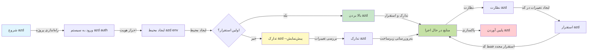
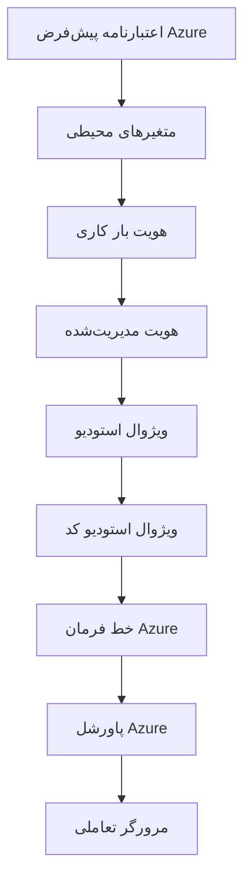

# اصول اولیه AZD - آشنایی با Azure Developer CLI

# اصول اولیه AZD - مفاهیم اصلی و مبانی

**فهرست فصل:**
- **📚 صفحه اصلی دوره**: [AZD برای مبتدیان](../../README.md)
- **📖 فصل جاری**: فصل 1 - مبانی و شروع سریع
- **⬅️ قبلی**: [مروری بر دوره](../../README.md#-chapter-1-foundation--quick-start)
- **➡️ بعدی**: [نصب و راه‌اندازی](installation.md)
- **🚀 فصل بعدی**: [فصل 2: توسعه مبتنی بر هوش مصنوعی](../microsoft-foundry/microsoft-foundry-integration.md)

## مقدمه

این درس شما را با Azure Developer CLI (azd) آشنا می‌کند، ابزاری قدرتمند در خط فرمان که مسیر شما را از توسعه محلی به استقرار در Azure تسریع می‌کند. شما با مفاهیم اساسی، ویژگی‌های اصلی و نحوه ساده‌سازی استقرار برنامه‌های ابری توسط azd آشنا خواهید شد.

## اهداف یادگیری

در پایان این درس، شما:
- درک خواهید کرد که Azure Developer CLI چیست و هدف اصلی آن چیست
- با مفاهیم اصلی مانند قالب‌ها، محیط‌ها و سرویس‌ها آشنا خواهید شد
- ویژگی‌های کلیدی مانند توسعه مبتنی بر قالب و زیرساخت به عنوان کد را بررسی خواهید کرد
- ساختار پروژه azd و جریان کاری آن را خواهید فهمید
- برای نصب و پیکربندی azd در محیط توسعه خود آماده خواهید بود

## نتایج یادگیری

پس از تکمیل این درس، شما قادر خواهید بود:
- نقش azd را در جریان‌های کاری توسعه ابری مدرن توضیح دهید
- اجزای ساختار پروژه azd را شناسایی کنید
- نحوه همکاری قالب‌ها، محیط‌ها و سرویس‌ها را شرح دهید
- مزایای زیرساخت به عنوان کد با azd را درک کنید
- دستورات مختلف azd و اهداف آن‌ها را بشناسید

## Azure Developer CLI (azd) چیست؟

Azure Developer CLI (azd) یک ابزار خط فرمان است که برای تسریع مسیر شما از توسعه محلی به استقرار در Azure طراحی شده است. این ابزار فرآیند ساخت، استقرار و مدیریت برنامه‌های ابری در Azure را ساده می‌کند.

### 🎯 چرا از AZD استفاده کنیم؟ مقایسه‌ای در دنیای واقعی

بیایید استقرار یک برنامه وب ساده با پایگاه داده را مقایسه کنیم:

#### ❌ بدون AZD: استقرار دستی در Azure (بیش از 30 دقیقه)

```bash
# مرحله ۱: ایجاد گروه منابع
az group create --name myapp-rg --location eastus

# مرحله ۲: ایجاد طرح سرویس اپلیکیشن
az appservice plan create --name myapp-plan \
  --resource-group myapp-rg \
  --sku B1 --is-linux

# مرحله ۳: ایجاد اپلیکیشن وب
az webapp create --name myapp-web-unique123 \
  --resource-group myapp-rg \
  --plan myapp-plan \
  --runtime "NODE:18-lts"

# مرحله ۴: ایجاد حساب Cosmos DB (۱۰-۱۵ دقیقه)
az cosmosdb create --name myapp-cosmos-unique123 \
  --resource-group myapp-rg \
  --kind MongoDB

# مرحله ۵: ایجاد پایگاه داده
az cosmosdb mongodb database create \
  --account-name myapp-cosmos-unique123 \
  --resource-group myapp-rg \
  --name tododb

# مرحله ۶: ایجاد مجموعه
az cosmosdb mongodb collection create \
  --account-name myapp-cosmos-unique123 \
  --resource-group myapp-rg \
  --database-name tododb \
  --name todos

# مرحله ۷: دریافت رشته اتصال
CONN_STR=$(az cosmosdb keys list \
  --name myapp-cosmos-unique123 \
  --resource-group myapp-rg \
  --type connection-strings \
  --query "connectionStrings[0].connectionString" -o tsv)

# مرحله ۸: پیکربندی تنظیمات اپلیکیشن
az webapp config appsettings set \
  --name myapp-web-unique123 \
  --resource-group myapp-rg \
  --settings MONGODB_URI="$CONN_STR"

# مرحله ۹: فعال کردن ثبت وقایع
az webapp log config --name myapp-web-unique123 \
  --resource-group myapp-rg \
  --application-logging filesystem \
  --detailed-error-messages true

# مرحله ۱۰: تنظیم Application Insights
az monitor app-insights component create \
  --app myapp-insights \
  --location eastus \
  --resource-group myapp-rg

# مرحله ۱۱: اتصال App Insights به اپلیکیشن وب
INSTRUMENTATION_KEY=$(az monitor app-insights component show \
  --app myapp-insights \
  --resource-group myapp-rg \
  --query "instrumentationKey" -o tsv)

az webapp config appsettings set \
  --name myapp-web-unique123 \
  --resource-group myapp-rg \
  --settings APPINSIGHTS_INSTRUMENTATIONKEY="$INSTRUMENTATION_KEY"

# مرحله ۱۲: ساخت اپلیکیشن به صورت محلی
npm install
npm run build

# مرحله ۱۳: ایجاد بسته استقرار
zip -r app.zip . -x "*.git*" "node_modules/*"

# مرحله ۱۴: استقرار اپلیکیشن
az webapp deployment source config-zip \
  --resource-group myapp-rg \
  --name myapp-web-unique123 \
  --src app.zip

# مرحله ۱۵: منتظر بمانید و دعا کنید که کار کند 🙏
# (بدون اعتبارسنجی خودکار، نیاز به تست دستی)
```

**مشکلات:**
- ❌ بیش از 15 فرمان برای به خاطر سپردن و اجرا به ترتیب
- ❌ 30-45 دقیقه کار دستی
- ❌ احتمال اشتباه (اشتباه تایپی، پارامترهای نادرست)
- ❌ رشته‌های اتصال در تاریخچه ترمینال نمایش داده می‌شوند
- ❌ بدون بازگشت خودکار در صورت بروز خطا
- ❌ سخت برای تکرار توسط اعضای تیم
- ❌ هر بار متفاوت (غیرقابل تکرار)

#### ✅ با AZD: استقرار خودکار (5 فرمان، 10-15 دقیقه)

```bash
# مرحله ۱: مقداردهی اولیه از الگو
azd init --template todo-nodejs-mongo

# مرحله ۲: احراز هویت
azd auth login

# مرحله ۳: ایجاد محیط
azd env new dev

# مرحله ۴: پیش‌نمایش تغییرات (اختیاری اما توصیه‌شده)
azd provision --preview

# مرحله ۵: همه چیز را مستقر کنید
azd up

# ✨ تمام! همه چیز مستقر، پیکربندی و نظارت شد
```

**مزایا:**
- ✅ **5 فرمان** در مقابل بیش از 15 مرحله دستی
- ✅ **10-15 دقیقه** زمان کل (بیشتر منتظر Azure)
- ✅ **بدون خطا** - خودکار و تست شده
- ✅ **مدیریت امن اسرار** از طریق Key Vault
- ✅ **بازگشت خودکار** در صورت بروز خطا
- ✅ **کاملاً قابل تکرار** - نتیجه یکسان هر بار
- ✅ **آماده برای تیم** - هر کسی می‌تواند با همان فرمان‌ها استقرار دهد
- ✅ **زیرساخت به عنوان کد** - قالب‌های Bicep کنترل شده توسط نسخه
- ✅ **نظارت داخلی** - Application Insights به طور خودکار پیکربندی شده است

### 📊 کاهش زمان و خطا

| معیار | استقرار دستی | استقرار با AZD | بهبود |
|:-------|:------------------|:---------------|:------------|
| **فرمان‌ها** | بیش از 15 | 5 | 67% کمتر |
| **زمان** | 30-45 دقیقه | 10-15 دقیقه | 60% سریع‌تر |
| **نرخ خطا** | ~40% | <5% | 88% کاهش |
| **ثبات** | کم (دستی) | 100% (خودکار) | کامل |
| **آموزش تیمی** | 2-4 ساعت | 30 دقیقه | 75% سریع‌تر |
| **زمان بازگشت** | بیش از 30 دقیقه (دستی) | 2 دقیقه (خودکار) | 93% سریع‌تر |

## مفاهیم اصلی

### قالب‌ها
قالب‌ها پایه و اساس azd هستند. آن‌ها شامل موارد زیر هستند:
- **کد برنامه** - کد منبع و وابستگی‌های شما
- **تعاریف زیرساخت** - منابع Azure تعریف شده در Bicep یا Terraform
- **فایل‌های پیکربندی** - تنظیمات و متغیرهای محیطی
- **اسکریپت‌های استقرار** - جریان‌های کاری استقرار خودکار

### محیط‌ها
محیط‌ها نمایانگر اهداف مختلف استقرار هستند:
- **توسعه** - برای آزمایش و توسعه
- **آزمایشی** - محیط پیش از تولید
- **تولید** - محیط تولید زنده

هر محیط دارای موارد زیر است:
- گروه منابع Azure خاص خود
- تنظیمات پیکربندی
- وضعیت استقرار

### سرویس‌ها
سرویس‌ها اجزای سازنده برنامه شما هستند:
- **فرانت‌اند** - برنامه‌های وب، SPAs
- **بک‌اند** - APIها، میکروسرویس‌ها
- **پایگاه داده** - راه‌حل‌های ذخیره‌سازی داده
- **ذخیره‌سازی** - ذخیره‌سازی فایل و blob

## ویژگی‌های کلیدی

### 1. توسعه مبتنی بر قالب
```bash
# مرور قالب‌های موجود
azd template list

# مقداردهی اولیه از یک قالب
azd init --template <template-name>
```

### 2. زیرساخت به عنوان کد
- **Bicep** - زبان خاص دامنه Azure
- **Terraform** - ابزار زیرساخت چند ابری
- **ARM Templates** - قالب‌های Azure Resource Manager

### 3. جریان‌های کاری یکپارچه
```bash
# تکمیل جریان کاری استقرار
azd up            # تهیه + استقرار این برای تنظیم اولیه بدون دخالت دست است

# 🧪 جدید: پیش‌نمایش تغییرات زیرساخت قبل از استقرار (ایمن)
azd provision --preview    # شبیه‌سازی استقرار زیرساخت بدون ایجاد تغییرات

azd provision     # ایجاد منابع Azure اگر زیرساخت را به‌روزرسانی کنید از این استفاده کنید
azd deploy        # استقرار کد برنامه یا بازاستقرار کد برنامه پس از به‌روزرسانی
azd down          # پاکسازی منابع
```

#### 🛡️ برنامه‌ریزی ایمن زیرساخت با پیش‌نمایش
فرمان `azd provision --preview` یک تغییر بزرگ برای استقرارهای ایمن است:
- **تحلیل پیش‌نمایش** - نشان می‌دهد چه چیزی ایجاد، اصلاح یا حذف خواهد شد
- **بدون ریسک** - هیچ تغییری در محیط Azure شما ایجاد نمی‌شود
- **همکاری تیمی** - نتایج پیش‌نمایش را قبل از استقرار به اشتراک بگذارید
- **برآورد هزینه** - هزینه منابع را قبل از تعهد درک کنید

```bash
# نمونه‌ای از جریان کاری پیش‌نمایش
azd provision --preview           # ببینید چه چیزی تغییر خواهد کرد
# خروجی را بررسی کنید، با تیم بحث کنید
azd provision                     # با اطمینان تغییرات را اعمال کنید
```

### 📊 تصویر: جریان کاری توسعه AZD


**توضیح جریان کاری:**
1. **Init** - شروع با قالب یا پروژه جدید
2. **Auth** - احراز هویت با Azure
3. **Environment** - ایجاد محیط استقرار ایزوله
4. **Preview** - 🆕 همیشه ابتدا تغییرات زیرساخت را پیش‌نمایش کنید (عملکرد ایمن)
5. **Provision** - ایجاد/به‌روزرسانی منابع Azure
6. **Deploy** - ارسال کد برنامه شما
7. **Monitor** - مشاهده عملکرد برنامه
8. **Iterate** - ایجاد تغییرات و استقرار مجدد کد
9. **Cleanup** - حذف منابع پس از اتمام

### 4. مدیریت محیط‌ها
```bash
# ایجاد و مدیریت محیط‌ها
azd env new <environment-name>
azd env select <environment-name>
azd env list
```

## 📁 ساختار پروژه

یک ساختار معمولی پروژه azd:
```
my-app/
├── .azd/                    # azd configuration
│   └── config.json
├── .azure/                  # Azure deployment artifacts
├── .devcontainer/          # Development container config
├── .github/workflows/      # GitHub Actions
├── .vscode/               # VS Code settings
├── infra/                 # Infrastructure code
│   ├── main.bicep        # Main infrastructure template
│   ├── main.parameters.json
│   └── modules/          # Reusable modules
├── src/                  # Application source code
│   ├── api/             # Backend services
│   └── web/             # Frontend application
├── azure.yaml           # azd project configuration
└── README.md
```

## 🔧 فایل‌های پیکربندی

### azure.yaml
فایل اصلی پیکربندی پروژه:
```yaml
name: my-awesome-app
metadata:
  template: my-template@1.0.0

services:
  web:
    project: ./src/web
    language: js
    host: appservice
  api:
    project: ./src/api
    language: js
    host: appservice

hooks:
  preprovision:
    shell: pwsh
    run: echo "Preparing to provision..."
```

### .azure/config.json
پیکربندی خاص محیط:
```json
{
  "version": 1,
  "defaultEnvironment": "dev",
  "environments": {
    "dev": {
      "subscriptionId": "your-subscription-id",
      "location": "eastus"
    }
  }
}
```

## 🎪 جریان‌های کاری رایج با تمرین‌های عملی

> **💡 نکته یادگیری:** این تمرین‌ها را به ترتیب دنبال کنید تا مهارت‌های AZD خود را به تدریج بسازید.

### 🎯 تمرین 1: پروژه اول خود را راه‌اندازی کنید

**هدف:** ایجاد یک پروژه AZD و بررسی ساختار آن

**مراحل:**
```bash
# از یک قالب اثبات‌شده استفاده کنید
azd init --template todo-nodejs-mongo

# فایل‌های تولید شده را بررسی کنید
ls -la  # تمام فایل‌ها از جمله فایل‌های مخفی را مشاهده کنید

# فایل‌های کلیدی ایجاد شده:
# - azure.yaml (پیکربندی اصلی)
# - infra/ (کد زیرساخت)
# - src/ (کد برنامه)
```

**✅ موفقیت:** شما دایرکتوری‌های azure.yaml، infra/ و src/ را دارید

---

### 🎯 تمرین 2: استقرار در Azure

**هدف:** تکمیل استقرار از ابتدا تا انتها

**مراحل:**
```bash
# ۱. احراز هویت
az login && azd auth login

# ۲. ایجاد محیط
azd env new dev
azd env set AZURE_LOCATION eastus

# ۳. پیش‌نمایش تغییرات (توصیه‌شده)
azd provision --preview

# ۴. استقرار همه چیز
azd up

# ۵. تأیید استقرار
azd show    # مشاهده آدرس URL برنامه خود
```

**زمان مورد انتظار:** 10-15 دقیقه  
**✅ موفقیت:** URL برنامه در مرورگر باز می‌شود

---

### 🎯 تمرین 3: محیط‌های چندگانه

**هدف:** استقرار در dev و staging

**مراحل:**
```bash
# قبلاً توسعه داده شده است، مرحله‌بندی ایجاد کنید
azd env new staging
azd env set AZURE_LOCATION westus2
azd up

# بین آنها جابجا شوید
azd env list
azd env select dev
```

**✅ موفقیت:** دو گروه منابع جداگانه در Azure Portal

---

### 🛡️ شروع تازه: `azd down --force --purge`

وقتی نیاز به بازنشانی کامل دارید:

```bash
azd down --force --purge
```

**چه کاری انجام می‌دهد:**
- `--force`: بدون درخواست تأیید
- `--purge`: حذف تمام وضعیت محلی و منابع Azure

**زمان استفاده:**
- استقرار در میانه راه شکست خورده است
- تغییر پروژه‌ها
- نیاز به شروع تازه

---

## 🎪 مرجع جریان کاری اصلی

### شروع یک پروژه جدید
```bash
# روش ۱: استفاده از قالب موجود
azd init --template todo-nodejs-mongo

# روش ۲: شروع از ابتدا
azd init

# روش ۳: استفاده از پوشه فعلی
azd init .
```

### چرخه توسعه
```bash
# تنظیم محیط توسعه
azd auth login
azd env new dev
azd env select dev

# همه چیز را مستقر کنید
azd up

# تغییرات را اعمال کرده و دوباره مستقر کنید
azd deploy

# پس از اتمام کار پاکسازی کنید
azd down --force --purge # دستور در Azure Developer CLI یک **بازنشانی کامل** برای محیط شما است—به‌ویژه زمانی که در حال رفع اشکال استقرارهای ناموفق، پاکسازی منابع یتیم، یا آماده‌سازی برای استقرار مجدد تازه هستید، مفید است.
```

## درک `azd down --force --purge`
فرمان `azd down --force --purge` راهی قدرتمند برای حذف کامل محیط azd و تمام منابع مرتبط است. در اینجا توضیحی از هر پرچم آورده شده است:
```
--force
```
- درخواست‌های تأیید را رد می‌کند.
- برای اتوماسیون یا اسکریپت‌نویسی که ورودی دستی امکان‌پذیر نیست مفید است.
- اطمینان می‌دهد که حذف بدون وقفه ادامه می‌یابد، حتی اگر CLI ناسازگاری‌هایی را تشخیص دهد.

```
--purge
```
حذف **تمام متادیتاهای مرتبط**، شامل:
وضعیت محیط
پوشه محلی `.azure`
اطلاعات استقرار کش شده
از "به خاطر سپردن" استقرارهای قبلی توسط azd جلوگیری می‌کند، که می‌تواند مشکلاتی مانند گروه‌های منابع ناسازگار یا ارجاعات قدیمی را ایجاد کند.

### چرا از هر دو استفاده کنیم؟
وقتی با `azd up` به دلیل وضعیت باقی‌مانده یا استقرارهای ناقص به مشکل برخوردید، این ترکیب یک **شروع تازه** را تضمین می‌کند.

این به ویژه پس از حذف دستی منابع در پورتال Azure یا هنگام تغییر قالب‌ها، محیط‌ها یا قراردادهای نام‌گذاری گروه منابع مفید است.

### مدیریت محیط‌های چندگانه
```bash
# ایجاد محیط مرحله‌بندی
azd env new staging
azd env select staging
azd up

# بازگشت به توسعه
azd env select dev

# مقایسه محیط‌ها
azd env list
```

## 🔐 احراز هویت و اعتبارنامه‌ها

درک احراز هویت برای استقرار موفقیت‌آمیز azd ضروری است. Azure از روش‌های مختلف احراز هویت استفاده می‌کند و azd از همان زنجیره اعتبارنامه‌ای که توسط ابزارهای دیگر Azure استفاده می‌شود بهره می‌برد.

### احراز هویت Azure CLI (`az login`)

قبل از استفاده از azd، باید با Azure احراز هویت کنید. رایج‌ترین روش استفاده از Azure CLI است:

```bash
# ورود تعاملی (باز کردن مرورگر)
az login

# ورود با مستاجر خاص
az login --tenant <tenant-id>

# ورود با سرویس اصلی
az login --service-principal -u <app-id> -p <password> --tenant <tenant-id>

# بررسی وضعیت ورود فعلی
az account show

# لیست اشتراک‌های موجود
az account list --output table

# تنظیم اشتراک پیش‌فرض
az account set --subscription <subscription-id>
```

### جریان احراز هویت
1. **ورود تعاملی**: مرورگر پیش‌فرض شما را برای احراز هویت باز می‌کند
2. **جریان کد دستگاه**: برای محیط‌هایی که دسترسی به مرورگر ندارند
3. **Service Principal**: برای سناریوهای اتوماسیون و CI/CD
4. **Managed Identity**: برای برنامه‌های میزبانی شده در Azure

### زنجیره DefaultAzureCredential

`DefaultAzureCredential` نوعی اعتبارنامه است که تجربه احراز هویت ساده‌ای را با تلاش خودکار برای منابع مختلف اعتبارنامه به ترتیب خاص فراهم می‌کند:

#### ترتیب زنجیره اعتبارنامه

#### 1. متغیرهای محیطی
```bash
# تنظیم متغیرهای محیطی برای سرویس پرینسیپل
export AZURE_CLIENT_ID="<app-id>"
export AZURE_CLIENT_SECRET="<password>"
export AZURE_TENANT_ID="<tenant-id>"
```

#### 2. هویت کاری (Kubernetes/GitHub Actions)
به طور خودکار استفاده می‌شود در:
- Azure Kubernetes Service (AKS) با هویت کاری
- GitHub Actions با OIDC federation
- سایر سناریوهای هویت فدراسیون

#### 3. هویت مدیریت شده
برای منابع Azure مانند:
- ماشین‌های مجازی
- App Service
- Azure Functions
- Container Instances

```bash
# بررسی کنید که آیا روی منبع Azure با هویت مدیریت شده اجرا می‌شود
az account show --query "user.type" --output tsv
# بازگشت: "servicePrincipal" اگر از هویت مدیریت شده استفاده شود
```

#### 4. یکپارچه‌سازی ابزارهای توسعه‌دهنده
- **Visual Studio**: به طور خودکار از حساب وارد شده استفاده می‌کند
- **VS Code**: از اعتبارنامه‌های افزونه Azure Account استفاده می‌کند
- **Azure CLI**: از اعتبارنامه‌های `az login` استفاده می‌کند (رایج‌ترین برای توسعه محلی)

### تنظیم احراز هویت AZD

```bash
# روش ۱: استفاده از Azure CLI (توصیه شده برای توسعه)
az login
azd auth login  # استفاده از اعتبارنامه‌های موجود Azure CLI

# روش ۲: احراز هویت مستقیم azd
azd auth login --use-device-code  # برای محیط‌های بدون رابط کاربری

# روش ۳: بررسی وضعیت احراز هویت
azd auth login --check-status

# روش ۴: خروج و احراز هویت مجدد
azd auth logout
azd auth login
```

### بهترین شیوه‌های احراز هویت

#### برای توسعه محلی
```bash
# ۱. ورود با Azure CLI
az login

# ۲. تأیید اشتراک صحیح
az account show
az account set --subscription "Your Subscription Name"

# ۳. استفاده از azd با اعتبارنامه‌های موجود
azd auth login
```

#### برای خطوط CI/CD
```yaml
# GitHub Actions example
- name: Azure Login
  uses: azure/login@v1
  with:
    creds: ${{ secrets.AZURE_CREDENTIALS }}

- name: Deploy with azd
  run: |
    azd auth login --client-id ${{ secrets.AZURE_CLIENT_ID }} \
                    --client-secret ${{ secrets.AZURE_CLIENT_SECRET }} \
                    --tenant-id ${{ secrets.AZURE_TENANT_ID }}
    azd up --no-prompt
```

#### برای محیط‌های تولید
- از **Managed Identity** هنگام اجرای منابع Azure استفاده کنید
- از **Service Principal** برای سناریوهای اتوماسیون استفاده کنید
- از ذخیره اعتبارنامه‌ها در کد یا فایل‌های پیکربندی خودداری کنید
- از **Azure Key Vault** برای پیکربندی حساس استفاده کنید

### مشکلات رایج احراز هویت و راه‌حل‌ها

#### مشکل: "هیچ اشتراکی یافت نشد"
```bash
# راه‌حل: تنظیم اشتراک پیش‌فرض
az account list --output table
az account set --subscription "<subscription-id>"
azd env set AZURE_SUBSCRIPTION_ID "<subscription-id>"
```

#### مشکل: "مجوزهای ناکافی"
```bash
# راه‌حل: بررسی و اختصاص نقش‌های مورد نیاز
az role assignment list --assignee $(az account show --query user.name --output tsv)

# نقش‌های مورد نیاز عمومی:
# - مشارکت‌کننده (برای مدیریت منابع)
# - مدیر دسترسی کاربر (برای اختصاص نقش‌ها)
```

#### مشکل: "توکن منقضی شده"
```bash
# راه‌حل: دوباره احراز هویت کنید
az logout
az login
azd auth logout
azd auth login
```

### احراز هویت در سناریوهای مختلف

#### توسعه محلی
```bash
# حساب توسعه شخصی
az login
azd auth login
```

#### توسعه تیمی
```bash
# از مستاجر خاص برای سازمان استفاده کنید
az login --tenant contoso.onmicrosoft.com
azd auth login
```

#### سناریوهای چند مستاجری
```bash
# بین مستاجرها جابجا شوید
az login --tenant tenant1.onmicrosoft.com
# به مستاجر ۱ مستقر کنید
azd up

az login --tenant tenant2.onmicrosoft.com  
# به مستاجر ۲ مستقر کنید
azd up
```

### ملاحظات امنیتی

1. **ذخیره اعتبارنامه‌ها**: هرگز اعتبارنامه‌ها را در کد منبع ذخیره نکنید
2. **محدودیت دامنه**: از اصل حداقل امتیاز برای Service Principal استفاده کنید
3. **چرخش توکن**: اسرار Service Principal را به طور منظم تغییر دهید
4. **ردیابی حسابرسی**: فعالیت‌های احراز هویت و استقرار را نظارت کنید
5. **امنیت شبکه**: در صورت امکان از نقاط پایانی خصوصی استفاده کنید

### عیب‌یابی احراز هویت

```bash
# اشکال‌زدایی مشکلات احراز هویت
azd auth login --check-status
az account show
az account get-access-token

# دستورات تشخیصی رایج
whoami                          # زمینه کاربر فعلی
az ad signed-in-user show      # جزئیات کاربر Azure AD
az group list                  # آزمایش دسترسی به منابع
```

## درک `azd down --force --purge`

### کشف
```bash
azd template list              # مرور قالب‌ها
azd template show <template>   # جزئیات قالب
azd init --help               # گزینه‌های اولیه‌سازی
```

### مدیریت پروژه
```bash
azd show                     # نمای کلی پروژه
azd env show                 # محیط فعلی
azd config list             # تنظیمات پیکربندی
```

### نظارت
```bash
azd monitor                  # پورتال Azure را باز کنید
azd pipeline config          # CI/CD را تنظیم کنید
azd logs                     # گزارش‌های برنامه را مشاهده کنید
```

## بهترین شیوه‌ها

### 1. استفاده از نام‌های معنادار
```bash
# خوب
azd env new production-east
azd init --template web-app-secure

# اجتناب
azd env new env1
azd init --template template1
```

### 2. استفاده از قالب‌ها
- با قالب‌های موجود شروع کنید
- برای نیازهای خود سفارشی کنید
- قالب‌های قابل استفاده مجدد برای سازمان خود ایجاد کنید

### 3. ایزوله‌سازی محیط
- از محیط‌های جداگانه برای dev/staging/prod استفاده کنید
- هرگز مستقیماً از ماشین محلی به تولید استقرار ندهید
- از خطوط CI/CD برای استقرارهای تولید استفاده کنید

### 4. مدیریت پیکربندی
- از متغیرهای محیطی برای داده‌های حساس استفاده کنید
- پیکربندی را در کنترل نسخه نگه دارید
- تنظیمات خاص محیط را مستند کنید

## پیشرفت یادگیری

### مبتدی (هفته 1-2)
1. نصب azd و احراز هویت
2. استقرار یک قالب ساده
3. درک ساختار پروژه
4. یادگیری دستورات پایه (up, down, deploy)

### متوسط (هفته 3-4)
1. سفارشی‌سازی قالب‌ها
2. مدیریت محیط‌های چندگانه
3. درک کد زیرساخت
4. راه‌اندازی خطوط CI/CD

### پیشرفته (هفته 5+)
1. ایجاد قالب‌های سفارشی
2. الگوهای پیشرفته زیرساخت
3. استقرارهای چند منطقه‌ای
4. پیکربندی‌های در سطح سازمانی

## گام‌های بعدی

**📖 ادامه یادگیری فصل 1:**
- [نصب و راه‌اندازی](installation.md) - نصب و پیکربندی azd
- [اولین پروژه شما](first-project.md) - آموزش عملی کامل
- [راهنمای پیکربندی](configuration.md) - گزینه‌های پیشرفته پیکربندی

**🎯 آماده برای فصل بعد؟**
- [فصل ۲: توسعه مبتنی بر هوش مصنوعی](../microsoft-foundry/microsoft-foundry-integration.md) - شروع به ساخت برنامه‌های هوش مصنوعی

## منابع اضافی

- [مروری بر Azure Developer CLI](https://learn.microsoft.com/en-us/azure/developer/azure-developer-cli/)
- [گالری قالب‌ها](https://azure.github.io/awesome-azd/)
- [نمونه‌های جامعه](https://github.com/Azure-Samples)

---

## 🙋 سوالات متداول

### سوالات عمومی

**س: تفاوت بین AZD و Azure CLI چیست؟**

ج: Azure CLI (`az`) برای مدیریت منابع فردی Azure است. AZD (`azd`) برای مدیریت کل برنامه‌ها:

```bash
# مدیریت منابع در سطح پایین - Azure CLI
az webapp create --name myapp --resource-group rg
az sql server create --name myserver --resource-group rg
# ...دستورات بیشتری مورد نیاز است

# مدیریت در سطح برنامه - AZD
azd up  # کل برنامه را با تمام منابع مستقر می‌کند
```

**این‌طور فکر کنید:**
- `az` = کار با آجرهای لگو به صورت جداگانه
- `azd` = کار با مجموعه‌های کامل لگو

---

**س: آیا برای استفاده از AZD باید Bicep یا Terraform بلد باشم؟**

ج: نه! با قالب‌ها شروع کنید:
```bash
# از قالب موجود استفاده کنید - نیازی به دانش IaC نیست
azd init --template todo-nodejs-mongo
azd up
```

می‌توانید بعداً Bicep را برای سفارشی‌سازی زیرساخت یاد بگیرید. قالب‌ها نمونه‌های کاربردی برای یادگیری ارائه می‌دهند.

---

**س: هزینه اجرای قالب‌های AZD چقدر است؟**

ج: هزینه‌ها بسته به قالب متفاوت است. بیشتر قالب‌های توسعه حدود ۵۰-۱۵۰ دلار در ماه هزینه دارند:

```bash
# پیش‌نمایش هزینه‌ها قبل از استقرار
azd provision --preview

# همیشه هنگام عدم استفاده پاکسازی کنید
azd down --force --purge  # تمام منابع را حذف می‌کند
```

**نکته حرفه‌ای:** از سطوح رایگان در صورت امکان استفاده کنید:
- App Service: سطح F1 (رایگان)
- Azure OpenAI: ۵۰,۰۰۰ توکن در ماه رایگان
- Cosmos DB: سطح رایگان ۱۰۰۰ RU/s

---

**س: آیا می‌توانم از AZD با منابع موجود Azure استفاده کنم؟**

ج: بله، اما شروع از ابتدا آسان‌تر است. AZD زمانی بهترین عملکرد را دارد که کل چرخه عمر را مدیریت کند. برای منابع موجود:

```bash
# گزینه ۱: وارد کردن منابع موجود (پیشرفته)
azd init
# سپس infra/ را تغییر دهید تا به منابع موجود اشاره کند

# گزینه ۲: شروع تازه (توصیه‌شده)
azd init --template matching-your-stack
azd up  # ایجاد محیط جدید
```

---

**س: چگونه پروژه خود را با هم‌تیمی‌ها به اشتراک بگذارم؟**

ج: پروژه AZD را در Git ذخیره کنید (اما پوشه .azure را ذخیره نکنید):

```bash
# به طور پیش‌فرض در .gitignore قرار دارد
.azure/        # شامل اطلاعات محرمانه و داده‌های محیطی
*.env          # متغیرهای محیطی

# سپس اعضای تیم:
git clone <your-repo>
azd auth login
azd env new <their-name>-dev
azd up
```

همه زیرساخت‌های یکسانی را از همان قالب‌ها دریافت می‌کنند.

---

### سوالات مربوط به عیب‌یابی

**س: "azd up" در میانه راه شکست خورد. چه کار کنم؟**

ج: خطا را بررسی کنید، آن را برطرف کنید و دوباره تلاش کنید:

```bash
# مشاهده گزارش‌های دقیق
azd show

# رفع مشکلات رایج:

# ۱. اگر سهمیه تمام شده است:
azd env set AZURE_LOCATION "westus2"  # منطقه دیگری را امتحان کنید

# ۲. اگر نام منبع تکراری است:
azd down --force --purge  # شروع از ابتدا
azd up  # دوباره تلاش کنید

# ۳. اگر اعتبارسنجی منقضی شده است:
az login
azd auth login
azd up
```

**رایج‌ترین مشکل:** اشتباه انتخاب کردن اشتراک Azure
```bash
az account list --output table
az account set --subscription "<correct-subscription>"
```

---

**س: چگونه فقط تغییرات کد را بدون بازپیکربندی مستقر کنم؟**

ج: از `azd deploy` به جای `azd up` استفاده کنید:

```bash
azd up          # بار اول: آماده‌سازی + استقرار (کند)

# ایجاد تغییرات در کد...

azd deploy      # دفعات بعدی: فقط استقرار (سریع)
```

مقایسه سرعت:
- `azd up`: ۱۰-۱۵ دقیقه (زیرساخت را پیکربندی می‌کند)
- `azd deploy`: ۲-۵ دقیقه (فقط کد)

---

**س: آیا می‌توانم قالب‌های زیرساخت را سفارشی کنم؟**

ج: بله! فایل‌های Bicep را در `infra/` ویرایش کنید:

```bash
# پس از مقداردهی اولیه azd
cd infra/
code main.bicep  # ویرایش در VS Code

# پیش‌نمایش تغییرات
azd provision --preview

# اعمال تغییرات
azd provision
```

**نکته:** با تغییرات کوچک شروع کنید - ابتدا SKUs را تغییر دهید:
```bicep
// infra/main.bicep
sku: {
  name: 'B1'  // Change to 'P1V2' for production
}
```

---

**س: چگونه همه چیزهایی که AZD ایجاد کرده را حذف کنم؟**

ج: یک فرمان همه منابع را حذف می‌کند:

```bash
azd down --force --purge

# این حذف می‌کند:
# - تمام منابع Azure
# - گروه منابع
# - وضعیت محیط محلی
# - داده‌های ذخیره‌شده استقرار
```

**همیشه این کار را انجام دهید وقتی:**
- آزمایش یک قالب را تمام کرده‌اید
- به پروژه دیگری تغییر می‌دهید
- می‌خواهید از ابتدا شروع کنید

**صرفه‌جویی در هزینه:** حذف منابع استفاده نشده = هزینه ۰ دلار

---

**س: اگر منابع را به اشتباه در Azure Portal حذف کنم چه می‌شود؟**

ج: وضعیت AZD ممکن است از همگام خارج شود. رویکرد شروع از ابتدا:

```bash
# ۱. حذف وضعیت محلی
azd down --force --purge

# ۲. شروع تازه
azd up

# جایگزین: اجازه دهید AZD شناسایی و رفع کند
azd provision  # منابع گمشده را ایجاد خواهد کرد
```

---

### سوالات پیشرفته

**س: آیا می‌توانم از AZD در خطوط CI/CD استفاده کنم؟**

ج: بله! مثال GitHub Actions:

```yaml
# .github/workflows/deploy.yml
name: Deploy with AZD

on:
  push:
    branches: [main]

jobs:
  deploy:
    runs-on: ubuntu-latest
    steps:
      - uses: actions/checkout@v2
      
      - name: Install azd
        run: curl -fsSL https://aka.ms/install-azd.sh | bash
      
      - name: Azure Login
        run: |
          azd auth login \
            --client-id ${{ secrets.AZURE_CLIENT_ID }} \
            --client-secret ${{ secrets.AZURE_CLIENT_SECRET }} \
            --tenant-id ${{ secrets.AZURE_TENANT_ID }}
      
      - name: Deploy
        run: azd up --no-prompt
```

---

**س: چگونه با اسرار و داده‌های حساس برخورد کنم؟**

ج: AZD به طور خودکار با Azure Key Vault یکپارچه می‌شود:

```bash
# اسرار در Key Vault ذخیره می‌شوند، نه در کد
azd env set DATABASE_PASSWORD "$(openssl rand -base64 32)"

# AZD به صورت خودکار:
# 1. Key Vault ایجاد می‌کند
# 2. راز را ذخیره می‌کند
# 3. دسترسی برنامه را از طریق Managed Identity اعطا می‌کند
# 4. در زمان اجرا تزریق می‌کند
```

**هرگز ذخیره نکنید:**
- پوشه `.azure/` (حاوی داده‌های محیط)
- فایل‌های `.env` (اسرار محلی)
- رشته‌های اتصال

---

**س: آیا می‌توانم به چندین منطقه مستقر کنم؟**

ج: بله، برای هر منطقه یک محیط ایجاد کنید:

```bash
# محیط شرق ایالات متحده
azd env new prod-eastus
azd env set AZURE_LOCATION eastus
azd up

# محیط غرب اروپا
azd env new prod-westeurope
azd env set AZURE_LOCATION westeurope
azd up

# هر محیط مستقل است
azd env list
```

برای برنامه‌های واقعی چندمنطقه‌ای، قالب‌های Bicep را برای استقرار همزمان در چندین منطقه سفارشی کنید.

---

**س: اگر گیر کردم، کجا می‌توانم کمک بگیرم؟**

1. **مستندات AZD:** https://learn.microsoft.com/azure/developer/azure-developer-cli/
2. **مشکلات GitHub:** https://github.com/Azure/azure-dev/issues
3. **Discord:** [Azure Discord](https://discord.gg/microsoft-azure) - کانال #azure-developer-cli
4. **Stack Overflow:** برچسب `azure-developer-cli`
5. **این دوره:** [راهنمای عیب‌یابی](../troubleshooting/common-issues.md)

**نکته حرفه‌ای:** قبل از پرسیدن، اجرا کنید:
```bash
azd show       # نمایش وضعیت فعلی
azd version    # نمایش نسخه شما
```
این اطلاعات را در سوال خود بگنجانید تا سریع‌تر کمک بگیرید.

---

## 🎓 مرحله بعد چیست؟

اکنون اصول AZD را می‌دانید. مسیر خود را انتخاب کنید:

### 🎯 برای مبتدیان:
1. **بعدی:** [نصب و راه‌اندازی](installation.md) - AZD را روی دستگاه خود نصب کنید
2. **سپس:** [اولین پروژه شما](first-project.md) - اولین برنامه خود را مستقر کنید
3. **تمرین:** تمام ۳ تمرین این درس را کامل کنید

### 🚀 برای توسعه‌دهندگان هوش مصنوعی:
1. **برو به:** [فصل ۲: توسعه مبتنی بر هوش مصنوعی](../microsoft-foundry/microsoft-foundry-integration.md)
2. **استقرار:** با `azd init --template get-started-with-ai-chat` شروع کنید
3. **یادگیری:** در حین استقرار، ساختن را یاد بگیرید

### 🏗️ برای توسعه‌دهندگان با تجربه:
1. **مرور:** [راهنمای پیکربندی](configuration.md) - تنظیمات پیشرفته
2. **کاوش:** [زیرساخت به عنوان کد](../deployment/provisioning.md) - بررسی عمیق Bicep
3. **ساختن:** قالب‌های سفارشی برای پشته خود ایجاد کنید

---

**ناوبری فصل:**
- **📚 صفحه اصلی دوره**: [AZD برای مبتدیان](../../README.md)
- **📖 فصل فعلی**: فصل ۱ - مبانی و شروع سریع  
- **⬅️ قبلی**: [مروری بر دوره](../../README.md#-chapter-1-foundation--quick-start)
- **➡️ بعدی**: [نصب و راه‌اندازی](installation.md)
- **🚀 فصل بعدی**: [فصل ۲: توسعه مبتنی بر هوش مصنوعی](../microsoft-foundry/microsoft-foundry-integration.md)

---

<!-- CO-OP TRANSLATOR DISCLAIMER START -->
**سلب مسئولیت**:  
این سند با استفاده از سرویس ترجمه هوش مصنوعی [Co-op Translator](https://github.com/Azure/co-op-translator) ترجمه شده است. در حالی که ما برای دقت تلاش می‌کنیم، لطفاً توجه داشته باشید که ترجمه‌های خودکار ممکن است حاوی خطاها یا نادرستی‌هایی باشند. سند اصلی به زبان اصلی آن باید به عنوان منبع معتبر در نظر گرفته شود. برای اطلاعات حیاتی، ترجمه حرفه‌ای انسانی توصیه می‌شود. ما مسئولیتی در قبال هرگونه سوءتفاهم یا تفسیر نادرست ناشی از استفاده از این ترجمه نداریم.
<!-- CO-OP TRANSLATOR DISCLAIMER END -->