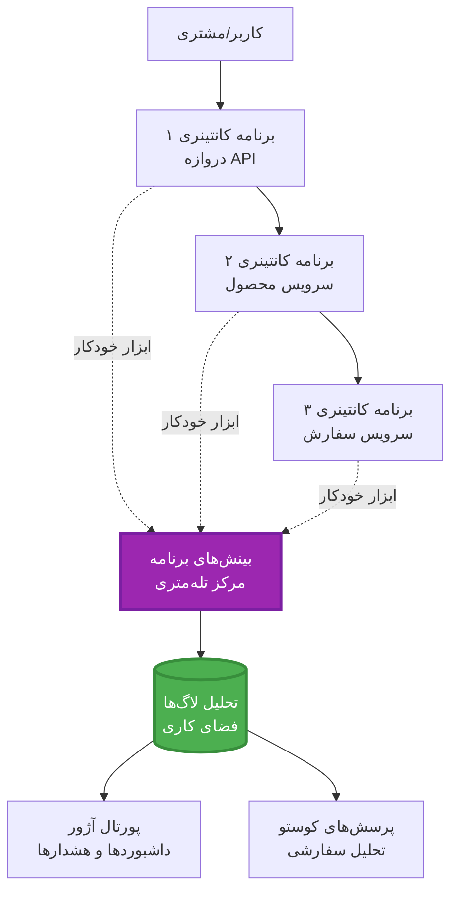
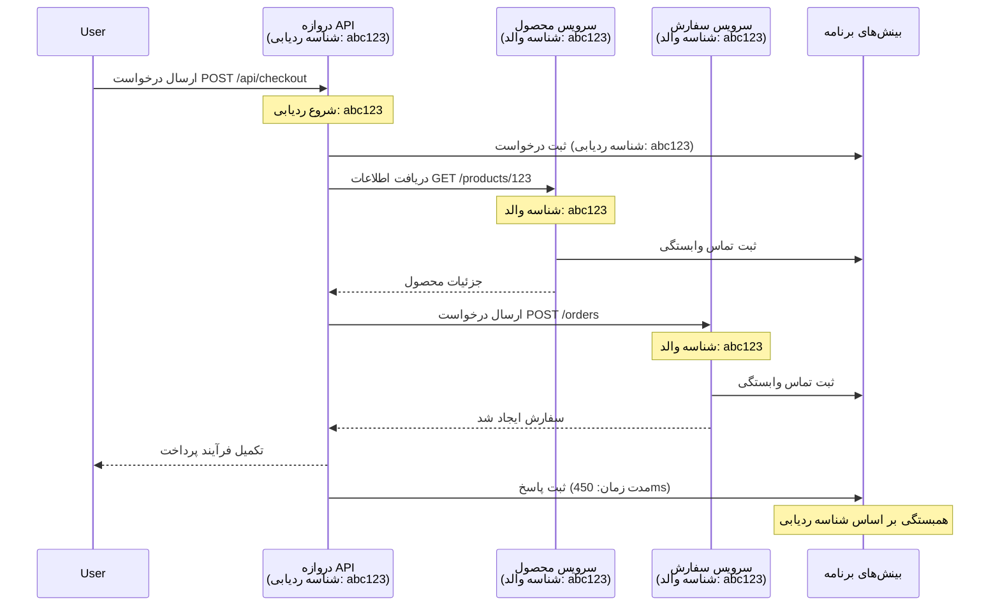

# یکپارچه‌سازی Application Insights با AZD

⏱️ **زمان تخمینی**: ۴۰-۵۰ دقیقه | 💰 **هزینه تقریبی**: ~۵-۱۵ دلار/ماه | ⭐ **پیچیدگی**: متوسط

**📚 مسیر یادگیری:**
- ← قبلی: [بررسی‌های پیش از اجرا](preflight-checks.md) - اعتبارسنجی پیش از استقرار
- 🎯 **شما اینجا هستید**: یکپارچه‌سازی Application Insights (نظارت، تله‌متری، اشکال‌زدایی)
- → بعدی: [راهنمای استقرار](../deployment/deployment-guide.md) - استقرار در Azure
- 🏠 [صفحه اصلی دوره](../../README.md)

---

## آنچه یاد خواهید گرفت

با تکمیل این درس، شما:
- **Application Insights** را به صورت خودکار در پروژه‌های AZD یکپارچه می‌کنید
- **ردیابی توزیع‌شده** برای میکروسرویس‌ها پیکربندی می‌کنید
- **تله‌متری سفارشی** (متریک‌ها، رویدادها، وابستگی‌ها) پیاده‌سازی می‌کنید
- **متریک‌های زنده** برای نظارت لحظه‌ای تنظیم می‌کنید
- **هشدارها و داشبوردها** از استقرارهای AZD ایجاد می‌کنید
- مشکلات تولید را با **پرسش‌های تله‌متری** اشکال‌زدایی می‌کنید
- **هزینه‌ها و استراتژی‌های نمونه‌گیری** را بهینه‌سازی می‌کنید
- **برنامه‌های AI/LLM** را نظارت می‌کنید (توکن‌ها، تأخیر، هزینه‌ها)

## چرا Application Insights با AZD اهمیت دارد

### چالش: مشاهده‌پذیری در تولید

**بدون Application Insights:**
```
❌ No visibility into production behavior
❌ Manual log aggregation across services
❌ Reactive debugging (wait for customer complaints)
❌ No performance metrics
❌ Cannot trace requests across services
❌ Unknown failure rates and bottlenecks
```

**با Application Insights + AZD:**
```
✅ Automatic telemetry collection
✅ Centralized logs from all services
✅ Proactive issue detection
✅ End-to-end request tracing
✅ Performance metrics and insights
✅ Real-time dashboards
✅ AZD provisions everything automatically
```

**تشبیه**: Application Insights مانند داشتن یک "جعبه سیاه" ضبط‌کننده پرواز + داشبورد کابین خلبان برای برنامه شما است. شما همه چیز را در لحظه مشاهده می‌کنید و می‌توانید هر حادثه‌ای را بازپخش کنید.

---

## نمای کلی معماری

### Application Insights در معماری AZD


### آنچه به صورت خودکار نظارت می‌شود

| نوع تله‌متری | آنچه ضبط می‌کند | مورد استفاده |
|--------------|-----------------|--------------|
| **درخواست‌ها** | درخواست‌های HTTP، کدهای وضعیت، مدت زمان | نظارت بر عملکرد API |
| **وابستگی‌ها** | تماس‌های خارجی (پایگاه داده، API‌ها، ذخیره‌سازی) | شناسایی گلوگاه‌ها |
| **استثناها** | خطاهای بدون مدیریت با ردپای پشته | اشکال‌زدایی خرابی‌ها |
| **رویدادهای سفارشی** | رویدادهای تجاری (ثبت‌نام، خرید) | تحلیل و قیف‌ها |
| **متریک‌ها** | شمارنده‌های عملکرد، متریک‌های سفارشی | برنامه‌ریزی ظرفیت |
| **ردیابی‌ها** | پیام‌های لاگ با شدت | اشکال‌زدایی و حسابرسی |
| **دسترس‌پذیری** | آزمایش‌های زمان پاسخ و آپ‌تایم | نظارت بر SLA |

---

## پیش‌نیازها

### ابزارهای مورد نیاز

```bash
# تأیید CLI توسعه‌دهنده Azure
azd version
# ✅ مورد انتظار: نسخه azd 1.0.0 یا بالاتر

# تأیید CLI Azure
az --version
# ✅ مورد انتظار: azure-cli نسخه 2.50.0 یا بالاتر
```

### نیازمندی‌های Azure

- اشتراک فعال Azure
- مجوز برای ایجاد:
  - منابع Application Insights
  - فضای کاری Log Analytics
  - برنامه‌های کانتینری
  - گروه‌های منابع

### پیش‌نیازهای دانشی

شما باید تکمیل کرده باشید:
- [مبانی AZD](../getting-started/azd-basics.md) - مفاهیم اصلی AZD
- [پیکربندی](../getting-started/configuration.md) - تنظیم محیط
- [پروژه اول](../getting-started/first-project.md) - استقرار پایه

---

## درس ۱: Application Insights خودکار با AZD

### نحوه ایجاد Application Insights توسط AZD

AZD هنگام استقرار به صورت خودکار Application Insights را ایجاد و پیکربندی می‌کند. بیایید ببینیم چگونه کار می‌کند.

### ساختار پروژه

```
monitored-app/
├── azure.yaml                     # AZD configuration
├── infra/
│   ├── main.bicep                # Main infrastructure
│   ├── core/
│   │   └── monitoring.bicep      # Application Insights + Log Analytics
│   └── app/
│       └── api.bicep             # Container App with monitoring
└── src/
    ├── app.py                    # Application with telemetry
    ├── requirements.txt
    └── Dockerfile
```

---

### مرحله ۱: پیکربندی AZD (azure.yaml)

**فایل: `azure.yaml`**

```yaml
name: monitored-app
metadata:
  template: monitored-app@1.0.0

services:
  api:
    project: ./src
    language: python
    host: containerapp

# AZD automatically provisions monitoring!
```

**همین!** AZD به صورت پیش‌فرض Application Insights را ایجاد می‌کند. برای نظارت پایه نیازی به پیکربندی اضافی نیست.

---

### مرحله ۲: زیرساخت نظارت (Bicep)

**فایل: `infra/core/monitoring.bicep`**

```bicep
param logAnalyticsName string
param applicationInsightsName string
param location string = resourceGroup().location
param tags object = {}

// Log Analytics Workspace (required for Application Insights)
resource logAnalytics 'Microsoft.OperationalInsights/workspaces@2022-10-01' = {
  name: logAnalyticsName
  location: location
  tags: tags
  properties: {
    sku: {
      name: 'PerGB2018'  // Pay-as-you-go pricing
    }
    retentionInDays: 30  // Keep logs for 30 days
    features: {
      enableLogAccessUsingOnlyResourcePermissions: true
    }
  }
}

// Application Insights
resource applicationInsights 'Microsoft.Insights/components@2020-02-02' = {
  name: applicationInsightsName
  location: location
  tags: tags
  kind: 'web'
  properties: {
    Application_Type: 'web'
    WorkspaceResourceId: logAnalytics.id
    IngestionMode: 'LogAnalytics'
    publicNetworkAccessForIngestion: 'Enabled'
    publicNetworkAccessForQuery: 'Enabled'
  }
}

// Outputs for Container Apps
output logAnalyticsWorkspaceId string = logAnalytics.id
output logAnalyticsWorkspaceName string = logAnalytics.name
output applicationInsightsConnectionString string = applicationInsights.properties.ConnectionString
output applicationInsightsInstrumentationKey string = applicationInsights.properties.InstrumentationKey
output applicationInsightsName string = applicationInsights.name
```

---

### مرحله ۳: اتصال برنامه کانتینری به Application Insights

**فایل: `infra/app/api.bicep`**

```bicep
param name string
param location string
param tags object = {}
param containerAppsEnvironmentName string
param applicationInsightsConnectionString string

resource containerApp 'Microsoft.App/containerApps@2023-05-01' = {
  name: name
  location: location
  tags: tags
  properties: {
    configuration: {
      ingress: {
        external: true
        targetPort: 8000
      }
      secrets: [
        {
          name: 'appinsights-connection-string'
          value: applicationInsightsConnectionString
        }
      ]
    }
    template: {
      containers: [
        {
          name: 'api'
          image: 'myregistry.azurecr.io/api:latest'
          resources: {
            cpu: json('0.5')
            memory: '1Gi'
          }
          env: [
            {
              name: 'APPLICATIONINSIGHTS_CONNECTION_STRING'
              secretRef: 'appinsights-connection-string'
            }
            {
              name: 'APPLICATIONINSIGHTS_ENABLED'
              value: 'true'
            }
          ]
        }
      ]
    }
  }
}

output uri string = 'https://${containerApp.properties.configuration.ingress.fqdn}'
```

---

### مرحله ۴: کد برنامه با تله‌متری

**فایل: `src/app.py`**

```python
from flask import Flask, request, jsonify
from opencensus.ext.azure.log_exporter import AzureLogHandler
from opencensus.ext.azure.trace_exporter import AzureExporter
from opencensus.ext.flask.flask_middleware import FlaskMiddleware
from opencensus.trace.samplers import ProbabilitySampler
import logging
import os

app = Flask(__name__)

# دریافت رشته اتصال Application Insights
connection_string = os.environ.get('APPLICATIONINSIGHTS_CONNECTION_STRING')

if connection_string:
    # پیکربندی ردیابی توزیع‌شده
    middleware = FlaskMiddleware(
        app,
        exporter=AzureExporter(connection_string=connection_string),
        sampler=ProbabilitySampler(rate=1.0)  # نمونه‌برداری ۱۰۰٪ برای توسعه
    )
    
    # پیکربندی ثبت وقایع
    logger = logging.getLogger(__name__)
    logger.addHandler(AzureLogHandler(connection_string=connection_string))
    logger.setLevel(logging.INFO)
    
    print("✅ Application Insights enabled")
else:
    logger = logging.getLogger(__name__)
    logger.setLevel(logging.INFO)
    print("⚠️ Application Insights not configured")

@app.route('/health')
def health():
    logger.info('Health check endpoint called')
    return jsonify({'status': 'healthy', 'monitoring': 'enabled'})

@app.route('/api/products')
def get_products():
    logger.info('Fetching products')
    
    # شبیه‌سازی تماس پایگاه داده (به‌طور خودکار به‌عنوان وابستگی ردیابی می‌شود)
    products = [
        {'id': 1, 'name': 'Laptop', 'price': 999.99},
        {'id': 2, 'name': 'Mouse', 'price': 29.99},
        {'id': 3, 'name': 'Keyboard', 'price': 79.99}
    ]
    
    logger.info(f'Returned {len(products)} products')
    return jsonify(products)

@app.route('/api/error-test')
def error_test():
    """Test error tracking"""
    logger.error('Testing error tracking')
    try:
        raise ValueError('This is a test exception')
    except Exception as e:
        logger.exception('Exception occurred in error-test endpoint')
        return jsonify({'error': str(e)}), 500

@app.route('/api/slow')
def slow_endpoint():
    """Test performance tracking"""
    import time
    logger.info('Slow endpoint called')
    time.sleep(3)  # شبیه‌سازی عملیات کند
    logger.warning('Endpoint took 3 seconds to respond')
    return jsonify({'message': 'Slow operation completed'})

if __name__ == '__main__':
    app.run(host='0.0.0.0', port=8000)
```

**فایل: `src/requirements.txt`**

```txt
Flask==3.0.0
opencensus-ext-azure==1.1.13
opencensus-ext-flask==0.8.1
gunicorn==21.2.0
```

---

### مرحله ۵: استقرار و تأیید

```bash
# مقداردهی اولیه AZD
azd init

# استقرار (به‌طور خودکار Application Insights را فراهم می‌کند)
azd up

# دریافت URL برنامه
APP_URL=$(azd env get-values | grep API_URL | cut -d '=' -f2 | tr -d '"')

# تولید تله‌متری
curl $APP_URL/health
curl $APP_URL/api/products
curl $APP_URL/api/error-test
curl $APP_URL/api/slow
```

**✅ خروجی مورد انتظار:**
```json
{
  "status": "healthy",
  "monitoring": "enabled"
}
```

---

### مرحله ۶: مشاهده تله‌متری در پورتال Azure

```bash
# دریافت جزئیات Application Insights
azd env get-values | grep APPLICATIONINSIGHTS

# باز کردن در پورتال Azure
az monitor app-insights component show \
  --app $(azd env get-values | grep APPLICATIONINSIGHTS_NAME | cut -d '=' -f2 | tr -d '"') \
  --resource-group $(azd env get-values | grep AZURE_RESOURCE_GROUP | cut -d '=' -f2 | tr -d '"') \
  --query "appId" -o tsv
```

**به پورتال Azure → Application Insights → جستجوی تراکنش بروید**

شما باید ببینید:
- ✅ درخواست‌های HTTP با کدهای وضعیت
- ✅ مدت زمان درخواست (بیش از ۳ ثانیه برای `/api/slow`)
- ✅ جزئیات استثناها از `/api/error-test`
- ✅ پیام‌های لاگ سفارشی

---

## درس ۲: تله‌متری و رویدادهای سفارشی

### ردیابی رویدادهای تجاری

بیایید تله‌متری سفارشی برای رویدادهای حیاتی تجاری اضافه کنیم.

**فایل: `src/telemetry.py`**

```python
from opencensus.ext.azure import metrics_exporter
from opencensus.stats import aggregation as aggregation_module
from opencensus.stats import measure as measure_module
from opencensus.stats import stats as stats_module
from opencensus.stats import view as view_module
from opencensus.tags import tag_map as tag_map_module
from opencensus.ext.azure.log_exporter import AzureLogHandler
from opencensus.ext.azure.trace_exporter import AzureExporter
from opencensus.trace import tracer as tracer_module
import logging
import os

class TelemetryClient:
    """Custom telemetry client for Application Insights"""
    
    def __init__(self, connection_string=None):
        self.connection_string = connection_string or os.environ.get('APPLICATIONINSIGHTS_CONNECTION_STRING')
        
        if not self.connection_string:
            print("⚠️ Application Insights connection string not found")
            return
        
        # تنظیم ثبت‌کننده
        self.logger = logging.getLogger(__name__)
        self.logger.addHandler(AzureLogHandler(connection_string=self.connection_string))
        self.logger.setLevel(logging.INFO)
        
        # تنظیم صادرکننده معیارها
        self.stats = stats_module.stats
        self.view_manager = self.stats.view_manager
        self.stats_recorder = self.stats.stats_recorder
        
        exporter = metrics_exporter.new_metrics_exporter(
            connection_string=self.connection_string
        )
        self.view_manager.register_exporter(exporter)
        
        # تنظیم ردیاب
        self.tracer = tracer_module.Tracer(
            exporter=AzureExporter(connection_string=self.connection_string)
        )
        
        print("✅ Custom telemetry client initialized")
    
    def track_event(self, event_name: str, properties: dict = None):
        """Track custom business event"""
        properties = properties or {}
        self.logger.info(
            f"CustomEvent: {event_name}",
            extra={
                'custom_dimensions': {
                    'event_name': event_name,
                    **properties
                }
            }
        )
    
    def track_metric(self, metric_name: str, value: float, properties: dict = None):
        """Track custom metric"""
        properties = properties or {}
        self.logger.info(
            f"CustomMetric: {metric_name} = {value}",
            extra={
                'custom_dimensions': {
                    'metric_name': metric_name,
                    'value': value,
                    **properties
                }
            }
        )
    
    def track_dependency(self, name: str, dependency_type: str, duration: float, success: bool):
        """Track external dependency call"""
        with self.tracer.span(name=name) as span:
            span.add_attribute('dependency.type', dependency_type)
            span.add_attribute('duration', duration)
            span.add_attribute('success', success)

# مشتری جهانی تله‌متری
telemetry = TelemetryClient()
```

### به‌روزرسانی برنامه با رویدادهای سفارشی

**فایل: `src/app.py` (بهبود یافته)**

```python
from flask import Flask, request, jsonify
from telemetry import telemetry
import time
import random

app = Flask(__name__)

@app.route('/api/purchase', methods=['POST'])
def purchase():
    """Track purchase event with custom telemetry"""
    data = request.json
    product_id = data.get('product_id')
    quantity = data.get('quantity', 1)
    price = data.get('price', 0)
    
    # ردیابی رویداد کسب‌وکار
    telemetry.track_event('Purchase', {
        'product_id': product_id,
        'quantity': quantity,
        'total_amount': price * quantity,
        'user_id': request.headers.get('X-User-Id', 'anonymous')
    })
    
    # ردیابی معیار درآمد
    telemetry.track_metric('Revenue', price * quantity, {
        'product_id': product_id,
        'currency': 'USD'
    })
    
    return jsonify({
        'order_id': f'ORD-{random.randint(1000, 9999)}',
        'status': 'confirmed',
        'total': price * quantity
    })

@app.route('/api/search')
def search():
    """Track search queries"""
    query = request.args.get('q', '')
    
    start_time = time.time()
    
    # شبیه‌سازی جستجو (می‌تواند یک پرس‌وجوی واقعی پایگاه داده باشد)
    results = [{'id': 1, 'name': f'Result for {query}'}]
    
    duration = (time.time() - start_time) * 1000  # تبدیل به میلی‌ثانیه
    
    # ردیابی رویداد جستجو
    telemetry.track_event('Search', {
        'query': query,
        'results_count': len(results),
        'duration_ms': duration
    })
    
    # ردیابی معیار عملکرد جستجو
    telemetry.track_metric('SearchDuration', duration, {
        'query_length': len(query)
    })
    
    return jsonify({'results': results, 'count': len(results)})

@app.route('/api/external-call')
def external_call():
    """Track external API dependency"""
    import requests
    
    start_time = time.time()
    success = True
    
    try:
        # شبیه‌سازی تماس API خارجی
        response = requests.get('https://api.example.com/data', timeout=5)
        result = response.json()
    except Exception as e:
        success = False
        result = {'error': str(e)}
    
    duration = (time.time() - start_time) * 1000
    
    # ردیابی وابستگی
    telemetry.track_dependency(
        name='ExternalAPI',
        dependency_type='HTTP',
        duration=duration,
        success=success
    )
    
    return jsonify(result)

if __name__ == '__main__':
    app.run(host='0.0.0.0', port=8000)
```

### آزمایش تله‌متری سفارشی

```bash
# ردیابی رویداد خرید
curl -X POST $APP_URL/api/purchase \
  -H "Content-Type: application/json" \
  -H "X-User-Id: user123" \
  -d '{"product_id": 1, "quantity": 2, "price": 29.99}'

# ردیابی رویداد جستجو
curl "$APP_URL/api/search?q=laptop"

# ردیابی وابستگی خارجی
curl $APP_URL/api/external-call
```

**مشاهده در پورتال Azure:**

به Application Insights → Logs بروید و اجرا کنید:

```kusto
// View purchase events
traces
| where customDimensions.event_name == "Purchase"
| project 
    timestamp,
    product_id = tostring(customDimensions.product_id),
    total_amount = todouble(customDimensions.total_amount),
    user_id = tostring(customDimensions.user_id)
| order by timestamp desc

// View revenue metrics
traces
| where customDimensions.metric_name == "Revenue"
| summarize TotalRevenue = sum(todouble(customDimensions.value)) by bin(timestamp, 1h)
| render timechart

// View search performance
traces
| where customDimensions.event_name == "Search"
| summarize 
    AvgDuration = avg(todouble(customDimensions.duration_ms)),
    SearchCount = count()
  by bin(timestamp, 5m)
| render timechart
```

---

## درس ۳: ردیابی توزیع‌شده برای میکروسرویس‌ها

### فعال‌سازی ردیابی بین‌سرویسی

برای میکروسرویس‌ها، Application Insights به صورت خودکار درخواست‌ها را بین سرویس‌ها مرتبط می‌کند.

**فایل: `infra/main.bicep`**

```bicep
targetScope = 'subscription'

param environmentName string
param location string = 'eastus'

var tags = { 'azd-env-name': environmentName }

resource rg 'Microsoft.Resources/resourceGroups@2021-04-01' = {
  name: 'rg-${environmentName}'
  location: location
  tags: tags
}

// Monitoring (shared by all services)
module monitoring './core/monitoring.bicep' = {
  name: 'monitoring'
  scope: rg
  params: {
    logAnalyticsName: 'log-${environmentName}'
    applicationInsightsName: 'appi-${environmentName}'
    location: location
    tags: tags
  }
}

// API Gateway
module apiGateway './app/api-gateway.bicep' = {
  name: 'api-gateway'
  scope: rg
  params: {
    name: 'ca-gateway-${environmentName}'
    location: location
    tags: union(tags, { 'azd-service-name': 'gateway' })
    applicationInsightsConnectionString: monitoring.outputs.applicationInsightsConnectionString
  }
}

// Product Service
module productService './app/product-service.bicep' = {
  name: 'product-service'
  scope: rg
  params: {
    name: 'ca-products-${environmentName}'
    location: location
    tags: union(tags, { 'azd-service-name': 'products' })
    applicationInsightsConnectionString: monitoring.outputs.applicationInsightsConnectionString
  }
}

// Order Service
module orderService './app/order-service.bicep' = {
  name: 'order-service'
  scope: rg
  params: {
    name: 'ca-orders-${environmentName}'
    location: location
    tags: union(tags, { 'azd-service-name': 'orders' })
    applicationInsightsConnectionString: monitoring.outputs.applicationInsightsConnectionString
  }
}

output APPLICATIONINSIGHTS_CONNECTION_STRING string = monitoring.outputs.applicationInsightsConnectionString
output GATEWAY_URL string = apiGateway.outputs.uri
```

### مشاهده تراکنش انتها به انتها


**پرسش ردیابی انتها به انتها:**

```kusto
// Find complete request flow
let traceId = "abc123...";  // Get from response header
dependencies
| union requests
| where operation_Id == traceId
| project 
    timestamp,
    type = itemType,
    name,
    duration,
    success,
    cloud_RoleName
| order by timestamp asc
```

---

## درس ۴: متریک‌های زنده و نظارت لحظه‌ای

### فعال‌سازی جریان متریک‌های زنده

متریک‌های زنده تله‌متری لحظه‌ای با تأخیر کمتر از ۱ ثانیه ارائه می‌دهند.

**دسترسی به متریک‌های زنده:**

```bash
# دریافت منبع Application Insights
APPI_NAME=$(azd env get-values | grep APPLICATIONINSIGHTS_NAME | cut -d '=' -f2 | tr -d '"')

# دریافت گروه منابع
RG_NAME=$(azd env get-values | grep AZURE_RESOURCE_GROUP | cut -d '=' -f2 | tr -d '"')

echo "Navigate to: Azure Portal → Resource Groups → $RG_NAME → $APPI_NAME → Live Metrics"
```

**آنچه در لحظه مشاهده می‌کنید:**
- ✅ نرخ درخواست‌های ورودی (درخواست‌ها/ثانیه)
- ✅ تماس‌های وابستگی خروجی
- ✅ تعداد استثناها
- ✅ استفاده از CPU و حافظه
- ✅ تعداد سرورهای فعال
- ✅ نمونه تله‌متری

### ایجاد بار برای آزمایش

```bash
# تولید بار برای مشاهده معیارهای زنده
for i in {1..100}; do
  curl $APP_URL/api/products &
  curl $APP_URL/api/search?q=test$i &
done

# مشاهده معیارهای زنده در پورتال Azure
# باید افزایش نرخ درخواست را مشاهده کنید
```

---

## تمرین‌های عملی

### تمرین ۱: تنظیم هشدارها ⭐⭐ (متوسط)

**هدف**: ایجاد هشدار برای نرخ خطای بالا و پاسخ‌های کند.

**مراحل:**

۱. **ایجاد هشدار برای نرخ خطا:**

```bash
# شناسه منبع Application Insights را دریافت کنید
APPI_ID=$(az monitor app-insights component show \
  --app $APPI_NAME \
  --resource-group $RG_NAME \
  --query "id" -o tsv)

# هشدار متریک برای درخواست‌های ناموفق ایجاد کنید
az monitor metrics alert create \
  --name "High-Error-Rate" \
  --resource-group $RG_NAME \
  --scopes $APPI_ID \
  --condition "count requests/failed > 10" \
  --window-size 5m \
  --evaluation-frequency 1m \
  --description "Alert when error rate exceeds 10 per 5 minutes"
```

۲. **ایجاد هشدار برای پاسخ‌های کند:**

```bash
az monitor metrics alert create \
  --name "Slow-Responses" \
  --resource-group $RG_NAME \
  --scopes $APPI_ID \
  --condition "avg requests/duration > 3000" \
  --window-size 5m \
  --evaluation-frequency 1m \
  --description "Alert when average response time exceeds 3 seconds"
```

۳. **ایجاد هشدار از طریق Bicep (ترجیحاً برای AZD):**

**فایل: `infra/core/alerts.bicep`**

```bicep
param applicationInsightsId string
param actionGroupId string = ''
param location string = resourceGroup().location

// High error rate alert
resource errorRateAlert 'Microsoft.Insights/metricAlerts@2018-03-01' = {
  name: 'high-error-rate'
  location: 'global'
  properties: {
    description: 'Alert when error rate exceeds threshold'
    severity: 2
    enabled: true
    scopes: [
      applicationInsightsId
    ]
    evaluationFrequency: 'PT1M'
    windowSize: 'PT5M'
    criteria: {
      'odata.type': 'Microsoft.Azure.Monitor.SingleResourceMultipleMetricCriteria'
      allOf: [
        {
          name: 'Error rate'
          metricName: 'requests/failed'
          operator: 'GreaterThan'
          threshold: 10
          timeAggregation: 'Count'
        }
      ]
    }
    actions: actionGroupId != '' ? [
      {
        actionGroupId: actionGroupId
      }
    ] : []
  }
}

// Slow response alert
resource slowResponseAlert 'Microsoft.Insights/metricAlerts@2018-03-01' = {
  name: 'slow-responses'
  location: 'global'
  properties: {
    description: 'Alert when response time is too high'
    severity: 3
    enabled: true
    scopes: [
      applicationInsightsId
    ]
    evaluationFrequency: 'PT1M'
    windowSize: 'PT5M'
    criteria: {
      'odata.type': 'Microsoft.Azure.Monitor.SingleResourceMultipleMetricCriteria'
      allOf: [
        {
          name: 'Response duration'
          metricName: 'requests/duration'
          operator: 'GreaterThan'
          threshold: 3000
          timeAggregation: 'Average'
        }
      ]
    }
  }
}

output errorAlertId string = errorRateAlert.id
output slowResponseAlertId string = slowResponseAlert.id
```

۴. **آزمایش هشدارها:**

```bash
# تولید خطاها
for i in {1..20}; do
  curl $APP_URL/api/error-test
done

# تولید پاسخ‌های کند
for i in {1..10}; do
  curl $APP_URL/api/slow
done

# وضعیت هشدار را بررسی کنید (5-10 دقیقه صبر کنید)
az monitor metrics alert list \
  --resource-group $RG_NAME \
  --query "[].{Name:name, Enabled:enabled, State:properties.enabled}" \
  --output table
```

**✅ معیار موفقیت:**
- ✅ هشدارها با موفقیت ایجاد شدند
- ✅ هشدارها هنگام تجاوز از آستانه‌ها فعال می‌شوند
- ✅ می‌توان تاریخچه هشدارها را در پورتال Azure مشاهده کرد
- ✅ یکپارچه با استقرار AZD

**زمان**: ۲۰-۲۵ دقیقه

---

### تمرین ۲: ایجاد داشبورد سفارشی ⭐⭐ (متوسط)

**هدف**: ساخت داشبوردی که متریک‌های کلیدی برنامه را نشان دهد.

**مراحل:**

۱. **ایجاد داشبورد از طریق پورتال Azure:**

به: پورتال Azure → داشبوردها → داشبورد جدید بروید

۲. **افزودن کاشی‌ها برای متریک‌های کلیدی:**

- تعداد درخواست‌ها (۲۴ ساعت گذشته)
- میانگین زمان پاسخ
- نرخ خطا
- ۵ عملیات کندترین
- توزیع جغرافیایی کاربران

۳. **ایجاد داشبورد از طریق Bicep:**

**فایل: `infra/core/dashboard.bicep`**

```bicep
param dashboardName string
param applicationInsightsId string
param location string = resourceGroup().location

resource dashboard 'Microsoft.Portal/dashboards@2020-09-01-preview' = {
  name: dashboardName
  location: location
  properties: {
    lenses: [
      {
        order: 0
        parts: [
          // Request count
          {
            position: { x: 0, y: 0, rowSpan: 4, colSpan: 6 }
            metadata: {
              type: 'Extension/Microsoft_OperationsManagementSuite_Workspace/PartType/LogsDashboardPart'
              inputs: [
                {
                  name: 'resourceId'
                  value: applicationInsightsId
                }
                {
                  name: 'query'
                  value: '''
                    requests
                    | summarize RequestCount = count() by bin(timestamp, 1h)
                    | render timechart
                  '''
                }
              ]
            }
          }
          // Error rate
          {
            position: { x: 6, y: 0, rowSpan: 4, colSpan: 6 }
            metadata: {
              type: 'Extension/Microsoft_OperationsManagementSuite_Workspace/PartType/LogsDashboardPart'
              inputs: [
                {
                  name: 'resourceId'
                  value: applicationInsightsId
                }
                {
                  name: 'query'
                  value: '''
                    requests
                    | summarize 
                        Total = count(),
                        Failed = countif(success == false)
                    | extend ErrorRate = (Failed * 100.0) / Total
                    | project ErrorRate
                  '''
                }
              ]
            }
          }
        ]
      }
    ]
  }
}

output dashboardId string = dashboard.id
```

۴. **استقرار داشبورد:**

```bash
# به main.bicep اضافه کنید
module dashboard './core/dashboard.bicep' = {
  name: 'dashboard'
  scope: rg
  params: {
    dashboardName: 'dashboard-${environmentName}'
    applicationInsightsId: monitoring.outputs.applicationInsightsId
    location: location
  }
}

# استقرار دهید
azd up
```

**✅ معیار موفقیت:**
- ✅ داشبورد متریک‌های کلیدی را نمایش می‌دهد
- ✅ می‌توان آن را به صفحه اصلی پورتال Azure پین کرد
- ✅ به صورت لحظه‌ای به‌روزرسانی می‌شود
- ✅ قابل استقرار از طریق AZD

**زمان**: ۲۵-۳۰ دقیقه

---

### تمرین ۳: نظارت بر برنامه AI/LLM ⭐⭐⭐ (پیشرفته)

**هدف**: ردیابی استفاده از Azure OpenAI (توکن‌ها، هزینه‌ها، تأخیر).

**مراحل:**

۱. **ایجاد پوشش نظارت بر AI:**

**فایل: `src/ai_telemetry.py`**

```python
from telemetry import telemetry
from openai import AzureOpenAI
import time

class MonitoredAzureOpenAI:
    """Azure OpenAI client with automatic telemetry"""
    
    def __init__(self, api_key, endpoint, api_version="2024-02-01"):
        self.client = AzureOpenAI(
            api_key=api_key,
            api_version=api_version,
            azure_endpoint=endpoint
        )
    
    def chat_completion(self, model: str, messages: list, **kwargs):
        """Track chat completion with telemetry"""
        start_time = time.time()
        
        try:
            # تماس با Azure OpenAI
            response = self.client.chat.completions.create(
                model=model,
                messages=messages,
                **kwargs
            )
            
            duration = (time.time() - start_time) * 1000  # میلی‌ثانیه
            
            # استخراج استفاده
            usage = response.usage
            prompt_tokens = usage.prompt_tokens
            completion_tokens = usage.completion_tokens
            total_tokens = usage.total_tokens
            
            # محاسبه هزینه (قیمت‌گذاری GPT-4)
            prompt_cost = (prompt_tokens / 1000) * 0.03  # ۰.۰۳ دلار برای هر ۱۰۰۰ توکن
            completion_cost = (completion_tokens / 1000) * 0.06  # ۰.۰۶ دلار برای هر ۱۰۰۰ توکن
            total_cost = prompt_cost + completion_cost
            
            # ردیابی رویداد سفارشی
            telemetry.track_event('OpenAI_Request', {
                'model': model,
                'prompt_tokens': prompt_tokens,
                'completion_tokens': completion_tokens,
                'total_tokens': total_tokens,
                'duration_ms': duration,
                'cost_usd': total_cost,
                'success': True
            })
            
            # ردیابی معیارها
            telemetry.track_metric('OpenAI_Tokens', total_tokens, {
                'model': model,
                'type': 'total'
            })
            
            telemetry.track_metric('OpenAI_Cost', total_cost, {
                'model': model,
                'currency': 'USD'
            })
            
            telemetry.track_metric('OpenAI_Duration', duration, {
                'model': model
            })
            
            return response
            
        except Exception as e:
            duration = (time.time() - start_time) * 1000
            
            telemetry.track_event('OpenAI_Request', {
                'model': model,
                'duration_ms': duration,
                'success': False,
                'error': str(e)
            })
            
            raise
```

۲. **استفاده از کلاینت نظارت‌شده:**

```python
from flask import Flask, request, jsonify
from ai_telemetry import MonitoredAzureOpenAI
import os

app = Flask(__name__)

# مقداردهی اولیه مشتری OpenAI نظارت شده
openai_client = MonitoredAzureOpenAI(
    api_key=os.environ['AZURE_OPENAI_API_KEY'],
    endpoint=os.environ['AZURE_OPENAI_ENDPOINT']
)

@app.route('/api/chat', methods=['POST'])
def chat():
    data = request.json
    user_message = data.get('message')
    
    # تماس با نظارت خودکار
    response = openai_client.chat_completion(
        model='gpt-4',
        messages=[
            {'role': 'user', 'content': user_message}
        ]
    )
    
    return jsonify({
        'response': response.choices[0].message.content,
        'tokens': response.usage.total_tokens
    })
```

۳. **پرسش متریک‌های AI:**

```kusto
// Total AI spend over time
traces
| where customDimensions.event_name == "OpenAI_Request"
| where customDimensions.success == "True"
| summarize TotalCost = sum(todouble(customDimensions.cost_usd)) by bin(timestamp, 1h)
| render timechart

// Token usage by model
traces
| where customDimensions.event_name == "OpenAI_Request"
| summarize 
    TotalTokens = sum(toint(customDimensions.total_tokens)),
    RequestCount = count()
  by Model = tostring(customDimensions.model)

// Average latency
traces
| where customDimensions.event_name == "OpenAI_Request"
| summarize AvgDuration = avg(todouble(customDimensions.duration_ms))
| project AvgDurationSeconds = AvgDuration / 1000

// Cost per request
traces
| where customDimensions.event_name == "OpenAI_Request"
| extend Cost = todouble(customDimensions.cost_usd)
| summarize 
    TotalCost = sum(Cost),
    RequestCount = count(),
    AvgCostPerRequest = avg(Cost)
```

**✅ معیار موفقیت:**
- ✅ هر تماس OpenAI به صورت خودکار ردیابی می‌شود
- ✅ استفاده از توکن‌ها و هزینه‌ها قابل مشاهده است
- ✅ تأخیر نظارت می‌شود
- ✅ می‌توان هشدارهای بودجه تنظیم کرد

**زمان**: ۳۵-۴۵ دقیقه

---

## بهینه‌سازی هزینه

### استراتژی‌های نمونه‌گیری

هزینه‌ها را با نمونه‌گیری تله‌متری کنترل کنید:

```python
from opencensus.trace.samplers import ProbabilitySampler

# توسعه: نمونه‌گیری ۱۰۰٪
sampler = ProbabilitySampler(rate=1.0)

# تولید: نمونه‌گیری ۱۰٪ (کاهش هزینه‌ها به میزان ۹۰٪)
sampler = ProbabilitySampler(rate=0.1)

# نمونه‌گیری تطبیقی (به‌طور خودکار تنظیم می‌شود)
from opencensus.trace.samplers import AdaptiveSampler
sampler = AdaptiveSampler()
```

**در Bicep:**

```bicep
resource applicationInsights 'Microsoft.Insights/components@2020-02-02' = {
  name: applicationInsightsName
  properties: {
    SamplingPercentage: 10  // 10% sampling
  }
}
```

### نگهداری داده‌ها

```bicep
resource logAnalytics 'Microsoft.OperationalInsights/workspaces@2022-10-01' = {
  name: logAnalyticsName
  properties: {
    retentionInDays: 30  // Minimum (cheapest)
    // Options: 30, 31, 60, 90, 120, 180, 270, 365, 550, 730
  }
}
```

### تخمین هزینه ماهانه

| حجم داده | نگهداری | هزینه ماهانه |
|----------|---------|--------------|
| ۱ گیگابایت/ماه | ۳۰ روز | ~۲-۵ دلار |
| ۵ گیگابایت/ماه | ۳۰ روز | ~۱۰-۱۵ دلار |
| ۱۰ گیگابایت/ماه | ۹۰ روز | ~۲۵-۴۰ دلار |
| ۵۰ گیگابایت/ماه | ۹۰ روز | ~۱۰۰-۱۵۰ دلار |

**سطح رایگان**: ۵ گیگابایت/ماه شامل می‌شود

---

## نقطه بررسی دانش

### ۱. یکپارچه‌سازی پایه ✓

دانش خود را آزمایش کنید:

- [ ] **سؤال ۱**: AZD چگونه Application Insights را ایجاد می‌کند؟
  - **پاسخ**: به صورت خودکار از طریق قالب‌های Bicep در `infra/core/monitoring.bicep`

- [ ] **سؤال ۲**: کدام متغیر محیطی Application Insights را فعال می‌کند؟
  - **پاسخ**: `APPLICATIONINSIGHTS_CONNECTION_STRING`

- [ ] **سؤال ۳**: سه نوع اصلی تله‌متری چیست؟
  - **پاسخ**: درخواست‌ها (تماس‌های HTTP)، وابستگی‌ها (تماس‌های خارجی)، استثناها (خطاها)

**تأیید عملی:**
```bash
# بررسی کنید که آیا Application Insights پیکربندی شده است
azd env get-values | grep APPLICATIONINSIGHTS

# تأیید کنید که داده‌های تله‌متری جریان دارند
az monitor app-insights metrics show \
  --app $APPI_NAME \
  --resource-group $RG_NAME \
  --metric "requests/count"
```

---

### ۲. تله‌متری سفارشی ✓

دانش خود را آزمایش کنید:

- [ ] **سؤال ۱**: چگونه رویدادهای تجاری سفارشی را ردیابی می‌کنید؟
  - **پاسخ**: استفاده از logger با `custom_dimensions` یا `TelemetryClient.track_event()`

- [ ] **سؤال ۲**: تفاوت بین رویدادها و متریک‌ها چیست؟
  - **پاسخ**: رویدادها وقوع‌های گسسته هستند، متریک‌ها اندازه‌گیری‌های عددی هستند

- [ ] **سؤال ۳**: چگونه تله‌متری را بین سرویس‌ها مرتبط می‌کنید؟
  - **پاسخ**: Application Insights به صورت خودکار از `operation_Id` برای ارتباط استفاده می‌کند

**تأیید عملی:**
```kusto
// Verify custom events
traces
| where customDimensions.event_name != ""
| summarize count() by tostring(customDimensions.event_name)
```

---

### ۳. نظارت بر تولید ✓

دانش خود را آزمایش کنید:

- [ ] **سؤال ۱**: نمونه‌گیری چیست و چرا از آن استفاده می‌شود؟
  - **پاسخ**: نمونه‌گیری حجم داده‌ها (و هزینه‌ها) را با ضبط درصدی از تله‌متری کاهش می‌دهد

- [ ] **سؤال ۲**: چگونه هشدارها را تنظیم می‌کنید؟
  - **پاسخ**: استفاده از هشدارهای متریک در Bicep یا پورتال Azure بر اساس متریک‌های Application Insights

- [ ] **سؤال ۳**: تفاوت بین Log Analytics و Application Insights چیست؟
  - **پاسخ**: Application Insights داده‌ها را در فضای کاری Log Analytics ذخیره می‌کند؛ App Insights نماهای خاص برنامه ارائه می‌دهد

**تأیید عملی:**
```bash
# تنظیمات نمونه‌گیری را بررسی کنید
az monitor app-insights component show \
  --app $APPI_NAME \
  --resource-group $RG_NAME \
  --query "properties.SamplingPercentage"
```

---

## بهترین روش‌ها

### ✅ انجام دهید:

۱. **از شناسه‌های ارتباطی استفاده کنید**
   ```python
   logger.info('Processing order', extra={
       'custom_dimensions': {
           'order_id': order_id,
           'user_id': user_id
       }
   })
   ```

۲. **هشدارها را برای متریک‌های حیاتی تنظیم کنید**
   ```bicep
   // Error rate, slow responses, availability
   ```

۳. **از لاگ‌گذاری ساختاری استفاده کنید**
   ```python
   # ✅ خوب: ساختارمند
   logger.info('User signup', extra={'custom_dimensions': {'user_id': 123}})
   
   # ❌ بد: بدون ساختار
   logger.info(f'User 123 signed up')
   ```

۴. **وابستگی‌ها را نظارت کنید**
   ```python
   # به‌طور خودکار تماس‌های پایگاه داده، درخواست‌های HTTP و غیره را ردیابی کنید.
   ```

۵. **در طول استقرارها از متریک‌های زنده استفاده کنید**

### ❌ انجام ندهید:

۱. **اطلاعات حساس را لاگ نکنید**
   ```python
   # ❌ بد
   logger.info(f'Login: {username}:{password}')
   
   # ✅ خوب
   logger.info('Login attempt', extra={'custom_dimensions': {'username': username}})
   ```

۲. **نمونه‌گیری ۱۰۰٪ در تولید استفاده نکنید**
   ```python
   # ❌ گران
   sampler = ProbabilitySampler(rate=1.0)
   
   # ✅ مقرون به صرفه
   sampler = ProbabilitySampler(rate=0.1)
   ```

۳. **صف‌های نامه‌های مرده را نادیده نگیرید**

۴. **فراموش نکنید محدودیت‌های نگهداری داده‌ها را تنظیم کنید**

---

## رفع اشکال

### مشکل: هیچ تله‌متری ظاهر نمی‌شود

**تشخیص:**
```bash
# بررسی کنید که رشته اتصال تنظیم شده است
azd env get-values | grep APPLICATIONINSIGHTS

# بررسی کنید که گزارش‌های برنامه
azd logs api --tail 50
```

**راه‌حل:**
```bash
# رشته اتصال را در برنامه کانتینر بررسی کنید
az containerapp show \
  --name $APP_NAME \
  --resource-group $RG_NAME \
  --query "properties.template.containers[0].env" \
  | grep -i applicationinsights
```

---

### مشکل: هزینه‌های بالا

**تشخیص:**
```bash
# بررسی ورود داده‌ها
az monitor app-insights metrics show \
  --app $APPI_NAME \
  --resource-group $RG_NAME \
  --metric "availabilityResults/count"
```

**راه‌حل:**
- کاهش نرخ نمونه‌گیری
- کاهش دوره نگهداری
- حذف لاگ‌گذاری‌های پرحجم

---

## بیشتر بیاموزید

### مستندات رسمی
- [نمای کلی Application Insights](https://learn.microsoft.com/azure/azure-monitor/app/app-insights-overview)
- [Application Insights برای Python](https://learn.microsoft.com/azure/azure-monitor/app/opencensus-python)
- [زبان پرسش Kusto](https://learn.microsoft.com/azure/data-explorer/kusto/query/)
- [نظارت بر AZD](https://learn.microsoft.com/azure/developer/azure-developer-cli/monitor-your-app)

### مراحل بعدی در این دوره
- ← قبلی: [بررسی‌های پیش از اجرا](preflight-checks.md)
- → بعدی: [راهنمای استقرار](../deployment/deployment-guide.md)
- 🏠 [صفحه اصلی دوره](../../README.md)

### مثال‌های مرتبط
- [مثال Azure OpenAI](../../../../examples/azure-openai-chat) - تله‌متری AI
- [مثال میکروسرویس‌ها](../../../../examples/microservices) - ردیابی توزیع‌شده

---

## خلاصه

**آنچه یاد گرفتید:**
- ✅ ایجاد خودکار Application Insights با AZD
- ✅ تله‌متری سفارشی (رویدادها، متریک‌ها، وابستگی‌ها)
- ✅ ردیابی توزیع‌شده بین میکروسرویس‌ها
- ✅ متریک‌های زنده و نظارت لحظه‌ای
- ✅ هشدارها و داشبوردها
- ✅ نظارت بر برنامه‌های AI/LLM  
- ✅ استراتژی‌های بهینه‌سازی هزینه  

**نکات کلیدی:**  
1. **AZD نظارت را به‌صورت خودکار فراهم می‌کند** - نیازی به تنظیم دستی نیست  
2. **از ثبت لاگ‌های ساختاریافته استفاده کنید** - جستجو را آسان‌تر می‌کند  
3. **رویدادهای کسب‌وکار را دنبال کنید** - نه فقط معیارهای فنی  
4. **هزینه‌های AI را نظارت کنید** - توکن‌ها و مخارج را دنبال کنید  
5. **هشدارها را تنظیم کنید** - پیشگیرانه عمل کنید، نه واکنشی  
6. **هزینه‌ها را بهینه کنید** - از نمونه‌گیری و محدودیت‌های نگهداری استفاده کنید  

**گام‌های بعدی:**  
1. تمرین‌های عملی را کامل کنید  
2. Application Insights را به پروژه‌های AZD خود اضافه کنید  
3. داشبوردهای سفارشی برای تیم خود ایجاد کنید  
4. [راهنمای استقرار](../deployment/deployment-guide.md) را یاد بگیرید  

---

<!-- CO-OP TRANSLATOR DISCLAIMER START -->
**سلب مسئولیت**:  
این سند با استفاده از سرویس ترجمه هوش مصنوعی [Co-op Translator](https://github.com/Azure/co-op-translator) ترجمه شده است. در حالی که ما تلاش می‌کنیم دقت را حفظ کنیم، لطفاً توجه داشته باشید که ترجمه‌های خودکار ممکن است شامل خطاها یا نادرستی‌ها باشند. سند اصلی به زبان اصلی آن باید به عنوان منبع معتبر در نظر گرفته شود. برای اطلاعات حیاتی، ترجمه حرفه‌ای انسانی توصیه می‌شود. ما مسئولیتی در قبال سوء تفاهم‌ها یا تفسیرهای نادرست ناشی از استفاده از این ترجمه نداریم.
<!-- CO-OP TRANSLATOR DISCLAIMER END -->